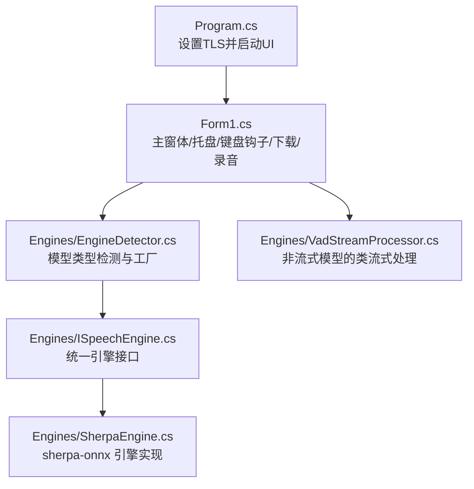
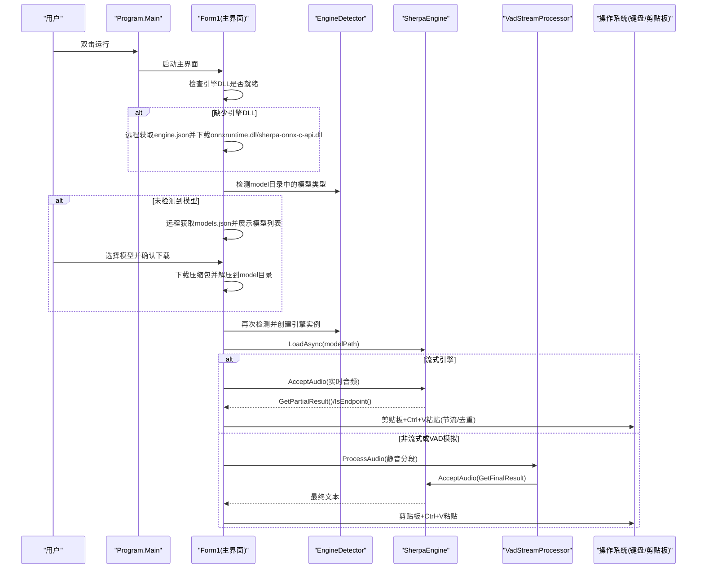
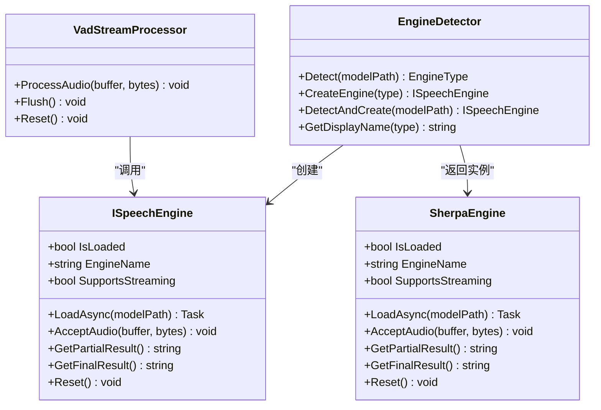
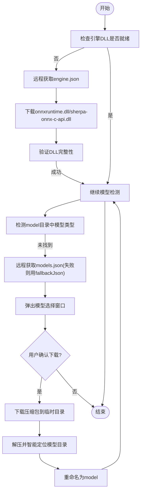
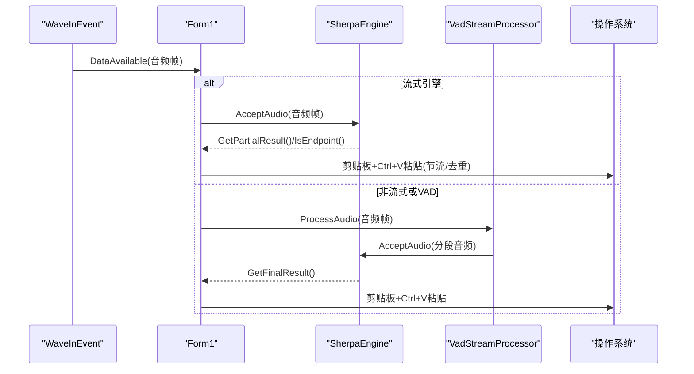
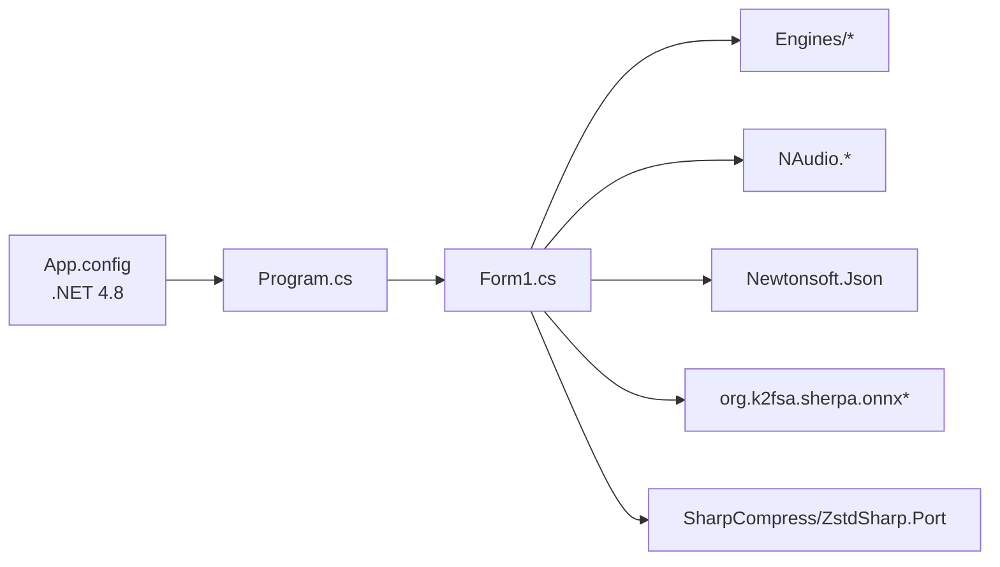

# 安装与配置

<cite>
**本文引用的文件**
- [Program.cs](file://t9s2t/Program.cs)
- [App.config](file://t9s2t/App.config)
- [app.manifest](file://t9s2t/app.manifest)
- [packages.config](file://t9s2t/packages.config)
- [Form1.cs](file://t9s2t/Form1.cs)
- [EngineDetector.cs](file://t9s2t/Engines/EngineDetector.cs)
- [ISpeechEngine.cs](file://t9s2t/Engines/ISpeechEngine.cs)
- [SherpaEngine.cs](file://t9s2t/Engines/SherpaEngine.cs)
- [VadStreamProcessor.cs](file://t9s2t/Engines/VadStreamProcessor.cs)
</cite>

## 目录
1. [简介](#简介)
2. [项目结构](#项目结构)
3. [核心组件](#核心组件)
4. [架构总览](#架构总览)
5. [详细组件分析](#详细组件分析)
6. [依赖关系分析](#依赖关系分析)
7. [性能考虑](#性能考虑)
8. [故障排查指南](#故障排查指南)
9. [结论](#结论)
10. [附录](#附录)

## 简介
本指南面向首次使用者，提供 t9s2t（语音转文字）在 Windows 上的完整安装与配置说明。内容涵盖系统要求、前置条件、从下载程序包到首次启动的完整流程；解释初始配置项（模型选择、音频设备、快捷键等）；详细说明自动组件下载机制（sherpa-onnx 引擎 DLL、语音模型文件的自动获取过程）；并提供常见问题的排查方法与解决方案，以及环境变量、防火墙和网络代理等高级配置建议。

## 项目结构
- 应用入口与运行时环境声明位于 Program.cs 与 App.config，指定 .NET Framework 版本与 TLS 安全协议。
- 主界面与交互逻辑集中在 Form1.cs，包含托盘图标、键盘钩子、录音控制、模型与引擎的自动检测与下载。
- 引擎抽象与实现位于 Engines 目录：ISpeechEngine 定义统一接口，EngineDetector 负责模型类型识别与实例创建，SherpaEngine 封装 sherpa-onnx 推理能力，VadStreamProcessor 为非流式模型提供“类流式”体验。
- NuGet 依赖与目标框架由 packages.config 管理。

图表来源
- [Program.cs:1-27](file://t9s2t/Program.cs#L1-L27)
- [Form1.cs:144-235](file://t9s2t/Form1.cs#L144-L235)
- [EngineDetector.cs:22-122](file://t9s2t/Engines/EngineDetector.cs#L22-L122)
- [ISpeechEngine.cs:1-35](file://t9s2t/Engines/ISpeechEngine.cs#L1-L35)
- [SherpaEngine.cs:14-72](file://t9s2t/Engines/SherpaEngine.cs#L14-L72)
- [VadStreamProcessor.cs:12-33](file://t9s2t/Engines/VadStreamProcessor.cs#L12-L33)

章节来源
- [Program.cs:1-27](file://t9s2t/Program.cs#L1-L27)
- [App.config:1-10](file://t9s2t/App.config#L1-L10)
- [app.manifest:1-18](file://t9s2t/app.manifest#L1-L18)
- [packages.config:1-20](file://t9s2t/packages.config#L1-L20)
- [Form1.cs:144-235](file://t9s2t/Form1.cs#L144-L235)

## 核心组件
- 运行环境与权限
  - 目标框架：.NET Framework 4.8（由配置文件声明）。
  - 管理员权限：清单文件请求 requireAdministrator，确保全局键盘钩子与前台窗口操作可用。
  - TLS 支持：程序启动时启用 TLS 1.2/1.1/TLS，保障远程资源访问。
- 主界面与交互
  - 托盘常驻、单实例互斥、开机自启注册。
  - 键盘钩子监听 Ctrl+Alt+D 组合键，按住开始录音，松开结束并输出结果。
  - 动态 UI 控件与状态提示，自动隐藏至托盘后台运行。
- 引擎与模型
  - 自动检测本地 model 目录中的模型类型（SenseVoice、Paraformer、Paraformer-large、流式 Paraformer）。
  - 自动按需下载 sherpa-onnx 运行时 DLL（onnxruntime.dll、sherpa-onnx-c-api.dll），再自动拉取最新模型列表并引导用户下载。
  - 支持标点恢复与 VAD 模型可选加载。
- 音频采集与输入模拟
  - 使用 NAudio.Wave 采集麦克风数据，按引擎模式送入识别。
  - 最终文本通过剪贴板 + 快捷键粘贴到前台窗口，避免焦点丢失与闪烁。

章节来源
- [App.config:1-10](file://t9s2t/App.config#L1-L10)
- [app.manifest:1-18](file://t9s2t/app.manifest#L1-L18)
- [Program.cs:1-27](file://t9s2t/Program.cs#L1-L27)
- [Form1.cs:144-235](file://t9s2t/Form1.cs#L144-L235)
- [Form1.cs:462-606](file://t9s2t/Form1.cs#L462-L606)
- [Form1.cs:724-966](file://t9s2t/Form1.cs#L724-L966)
- [Form1.cs:1057-1111](file://t9s2t/Form1.cs#L1057-L1111)
- [EngineDetector.cs:22-122](file://t9s2t/Engines/EngineDetector.cs#L22-L122)
- [SherpaEngine.cs:14-72](file://t9s2t/Engines/SherpaEngine.cs#L14-L72)

## 架构总览
下图展示了从启动到识别输出的关键路径，包括自动组件与模型下载、引擎加载、音频采集与结果输出。

图表来源
- [Program.cs:1-27](file://t9s2t/Program.cs#L1-L27)
- [Form1.cs:144-235](file://t9s2t/Form1.cs#L144-L235)
- [Form1.cs:462-606](file://t9s2t/Form1.cs#L462-L606)
- [Form1.cs:724-966](file://t9s2t/Form1.cs#L724-L966)
- [EngineDetector.cs:22-122](file://t9s2t/Engines/EngineDetector.cs#L22-L122)
- [SherpaEngine.cs:57-72](file://t9s2t/Engines/SherpaEngine.cs#L57-L72)
- [VadStreamProcessor.cs:38-86](file://t9s2t/Engines/VadStreamProcessor.cs#L38-L86)

## 详细组件分析

### 组件A：引擎与模型自动检测与加载
- 引擎类型枚举与检测规则
  - 流式 Paraformer：存在 encoder.onnx/int8 + decoder.onnx/int8。
  - SenseVoice / Paraformer-large：存在 model.onnx/int8，并通过 tokens.txt 行数区分。
  - 非流式 Paraformer：仅存在 encoder.onnx/int8。
- 引擎实例创建
  - 根据检测结果返回 SherpaEngine(false) 或 SherpaEngine(true)。
- 引擎加载
  - SherpaEngine.LoadAsync 异步加载离线/在线模型，并尝试加载标点与 VAD 模型（若存在）。

图表来源
- [EngineDetector.cs:22-122](file://t9s2t/Engines/EngineDetector.cs#L22-L122)
- [ISpeechEngine.cs:1-35](file://t9s2t/Engines/ISpeechEngine.cs#L1-L35)
- [SherpaEngine.cs:14-72](file://t9s2t/Engines/SherpaEngine.cs#L14-L72)
- [VadStreamProcessor.cs:12-33](file://t9s2t/Engines/VadStreamProcessor.cs#L12-L33)

章节来源
- [EngineDetector.cs:22-122](file://t9s2t/Engines/EngineDetector.cs#L22-L122)
- [SherpaEngine.cs:57-72](file://t9s2t/Engines/SherpaEngine.cs#L57-L72)

### 组件B：自动组件与模型下载机制
- 引擎 DLL 自动下载
  - 启动时检查 onnxruntime.dll 与 sherpa-onnx-c-api.dll 是否存在且大小大于 0。
  - 缺失则远程获取 engine.json，逐项下载所需 DLL，失败清理空文件并提示重试。
- 模型自动下载
  - 点击“下载模型”按钮后，先确保引擎 DLL 就绪。
  - 远程获取 models.json，若失败回退到内置 fallbackJson。
  - 弹出动态选择窗口，用户确认后下载压缩包到临时目录，解压并智能定位模型目录，重命名为 model。
  - 支持 tar.bz2 与 zip 两种格式，解压完成后自动进入模型检测与加载流程。

图表来源
- [Form1.cs:462-606](file://t9s2t/Form1.cs#L462-L606)
- [Form1.cs:724-966](file://t9s2t/Form1.cs#L724-L966)

章节来源
- [Form1.cs:462-606](file://t9s2t/Form1.cs#L462-L606)
- [Form1.cs:724-966](file://t9s2t/Form1.cs#L724-L966)

### 组件C：音频采集与输入模拟
- 音频采集
  - 初始化 WaveInEvent，采样率 16kHz，单声道。
  - DataAvailable 回调中根据引擎模式分流：
    - 流式引擎：直接送入 SherpaEngine.AcceptAudio，并根据端点检测或 partial 结果输出。
    - 非流式或 VAD 模拟：通过 VadStreamProcessor 进行静音分段，提交整段识别。
- 输入模拟
  - 最终文本通过剪贴板 + Ctrl+V 粘贴到前台窗口，增加延时避免剪贴板未就绪。
  - 防 Alt+Space 误触发：发送前检测并临时释放 Alt 键。
  - 节流与去重：partial 更新最小间隔 200ms，避免频繁刷新造成闪烁。

图表来源
- [Form1.cs:1057-1111](file://t9s2t/Form1.cs#L1057-L1111)
- [Form1.cs:993-1051](file://t9s2t/Form1.cs#L993-L1051)
- [VadStreamProcessor.cs:38-86](file://t9s2t/Engines/VadStreamProcessor.cs#L38-L86)
- [SherpaEngine.cs:351-479](file://t9s2t/Engines/SherpaEngine.cs#L351-L479)

章节来源
- [Form1.cs:1057-1111](file://t9s2t/Form1.cs#L1057-L1111)
- [Form1.cs:993-1051](file://t9s2t/Form1.cs#L993-L1051)
- [VadStreamProcessor.cs:38-86](file://t9s2t/Engines/VadStreamProcessor.cs#L38-L86)
- [SherpaEngine.cs:351-479](file://t9s2t/Engines/SherpaEngine.cs#L351-L479)

## 依赖关系分析
- 目标框架与运行时
  - .NET Framework 4.8（App.config 声明）。
  - 需要 Windows 10/11 兼容性与管理员权限（app.manifest）。
- NuGet 依赖
  - NAudio.* 系列用于音频采集与播放。
  - Newtonsoft.Json 用于 JSON 解析。
  - org.k2fsa.sherpa.onnx 及其 win-x64 运行时包。
  - SharpCompress、ZstdSharp.Port 用于压缩/解压。
  - System.Security.Principal.Windows 等系统扩展库。

图表来源
- [App.config:1-10](file://t9s2t/App.config#L1-L10)
- [packages.config:1-20](file://t9s2t/packages.config#L1-L20)
- [Form1.cs:1-20](file://t9s2t/Form1.cs#L1-L20)

章节来源
- [App.config:1-10](file://t9s2t/App.config#L1-L10)
- [packages.config:1-20](file://t9s2t/packages.config#L1-L20)

## 性能考虑
- 流式识别优先：对于支持流式的引擎（如 Paraformer 流式），可减少延迟，边说边出字。
- 节流与去重：partial 结果更新最小间隔 200ms，避免频繁 UI 刷新与输入抖动。
- 静音阈值与分段：VAD 处理器采用能量阈值与连续静音帧数控制分段，平衡灵敏度与稳定性。
- 线程与锁：录音回调与输入模拟使用锁保护，避免竞态条件。

[本节为通用指导，不直接分析具体文件]

## 故障排查指南
- 无法启动或提示缺少运行时
  - 确认已安装 .NET Framework 4.8。
  - 以管理员身份运行程序（清单要求 requireAdministrator）。
- 网络相关错误（无法下载引擎 DLL 或模型）
  - 程序已强制启用 TLS 1.2/1.1/TLS，若仍失败，请检查系统时间、证书与代理设置。
  - 若企业网络需代理，请在系统级配置 HTTP(S) 代理，或通过组策略允许 HTTPS 出站。
- 模型下载完成但无法识别
  - 确认 model 目录中存在 tokens.txt 与对应模型文件（encoder/decoder 或 model.onnx/int8）。
  - 删除现有 model 目录后重新下载。
- 无麦克风或无声
  - 确认系统默认录音设备可用，并在任务管理器中查看是否有音频进程占用。
  - 调整麦克风增益与音量，必要时更换设备。
- 快捷键无效
  - 确认当前前台窗口可接收输入，且未被安全软件拦截全局钩子。
  - 检查是否被其他程序占用了 Ctrl+Alt+D。
- 输出异常（如弹出系统菜单）
  - 程序已在粘贴前检测并临时释放 Alt 键，若仍有问题，请关闭可能干扰的系统热键。

章节来源
- [App.config:1-10](file://t9s2t/App.config#L1-L10)
- [app.manifest:1-18](file://t9s2t/app.manifest#L1-L18)
- [Program.cs:1-27](file://t9s2t/Program.cs#L1-L27)
- [Form1.cs:724-966](file://t9s2t/Form1.cs#L724-L966)
- [Form1.cs:993-1051](file://t9s2t/Form1.cs#L993-L1051)

## 结论
t9s2t 通过自动化的引擎与模型下载机制，结合 sherpa-onnx 的高性能识别能力，提供了开箱即用的语音转文字体验。合理配置系统权限、网络与音频设备后，即可享受低延迟的流式识别与稳定的离线识别。遇到问题时，可依据本指南逐步排查。

[本节为总结性内容，不直接分析具体文件]

## 附录

### 系统要求与前置条件
- 操作系统：Windows 10/11（清单兼容性声明）。
- 运行时：.NET Framework 4.8（App.config 声明）。
- 权限：管理员权限（app.manifest 声明）。
- 网络：HTTPS 出站访问（用于下载引擎 DLL 与模型）。
- 硬件：可用的麦克风设备。

章节来源
- [app.manifest:11-16](file://t9s2t/app.manifest#L11-L16)
- [App.config:7-9](file://t9s2t/App.config#L7-L9)
- [Form1.cs:1057-1062](file://t9s2t/Form1.cs#L1057-L1062)

### 安装步骤（从下载到首次启动）
- 准备环境
  - 安装 .NET Framework 4.8。
  - 确保系统时间为正确时间，证书链有效。
- 运行程序
  - 右键以管理员身份运行程序。
  - 首次启动会自动检查引擎 DLL，缺失则自动下载。
- 下载模型
  - 点击“下载模型”，程序会获取最新模型列表并弹窗选择。
  - 选择推荐模型（如 Paraformer-large-zh），确认后自动下载并解压到 model 目录。
- 首次使用
  - 程序将自动加载引擎与模型，显示就绪状态。
  - 按住 Ctrl+Alt+D 开始录音，松开结束并输出结果。

章节来源
- [Form1.cs:144-235](file://t9s2t/Form1.cs#L144-L235)
- [Form1.cs:724-966](file://t9s2t/Form1.cs#L724-L966)
- [Form1.cs:1146-1173](file://t9s2t/Form1.cs#L1146-L1173)

### 初始配置选项
- 模型选择
  - 通过“下载模型”弹窗选择官方发布的模型，支持多版本与不同语言/质量。
- 音频设备设置
  - 默认使用设备索引 0（系统默认录音设备），可在代码中修改。
- 快捷键配置
  - 默认快捷键为 Ctrl+Alt+D，如需更改，需在键盘钩子逻辑中调整虚拟键码与修饰键判断。
- 开机自启
  - 勾选“开机自动启动”会在当前用户 Run 注册表项写入启动项。

章节来源
- [Form1.cs:171-183](file://t9s2t/Form1.cs#L171-L183)
- [Form1.cs:260-277](file://t9s2t/Form1.cs#L260-L277)
- [Form1.cs:1057-1062](file://t9s2t/Form1.cs#L1057-L1062)
- [Form1.cs:422-460](file://t9s2t/Form1.cs#L422-L460)

### 自动组件下载机制详解
- 引擎 DLL 自动下载
  - 检测 onnxruntime.dll 与 sherpa-onnx-c-api.dll 是否存在且大小 > 0。
  - 远程获取 engine.json，逐项下载，失败清理空文件并提示重试。
- 模型自动下载
  - 远程获取 models.json，失败则使用内置 fallbackJson。
  - 下载压缩包到临时目录，解压并智能定位模型目录，重命名为 model。
  - 支持 tar.bz2 与 zip 格式，解压完成后自动进入模型检测与加载流程。

章节来源
- [Form1.cs:462-606](file://t9s2t/Form1.cs#L462-L606)
- [Form1.cs:724-966](file://t9s2t/Form1.cs#L724-L966)

### 高级配置选项
- 环境变量
  - 程序未显式读取自定义环境变量，可通过系统级代理与网络策略影响下载行为。
- 防火墙设置
  - 放行对 HTTPS 出站连接，确保能访问远程模型与引擎 DLL 地址。
- 网络代理配置
  - 在企业环境中，建议在系统级配置 HTTP(S) 代理，或通过组策略允许 HTTPS 出站。
  - 若使用公司代理服务器，请确保代理支持 TLS 1.2。

[本节为通用指导，不直接分析具体文件]