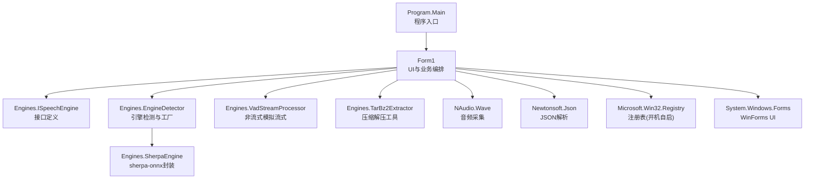
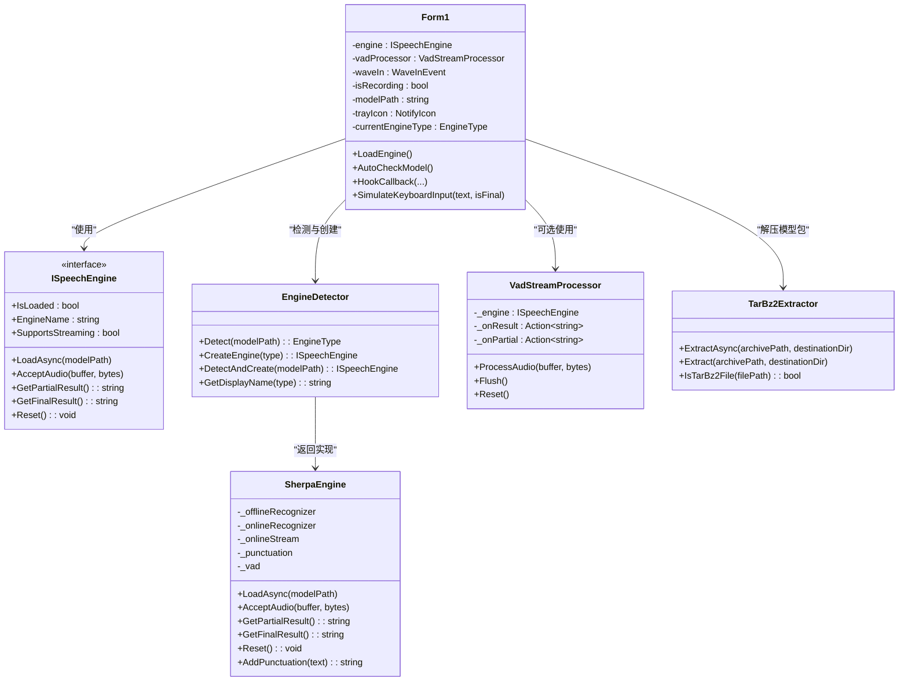
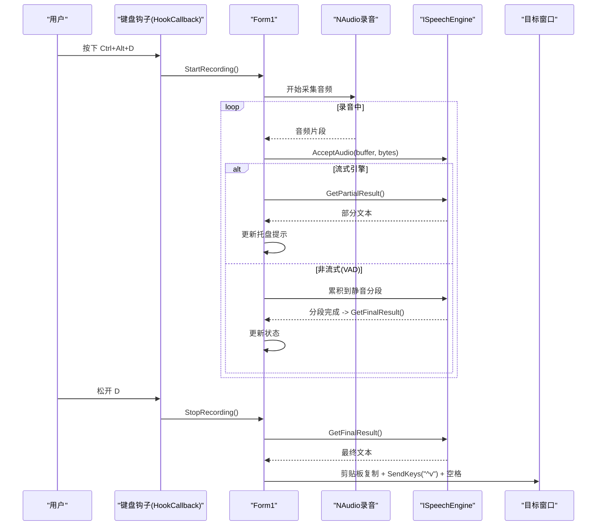
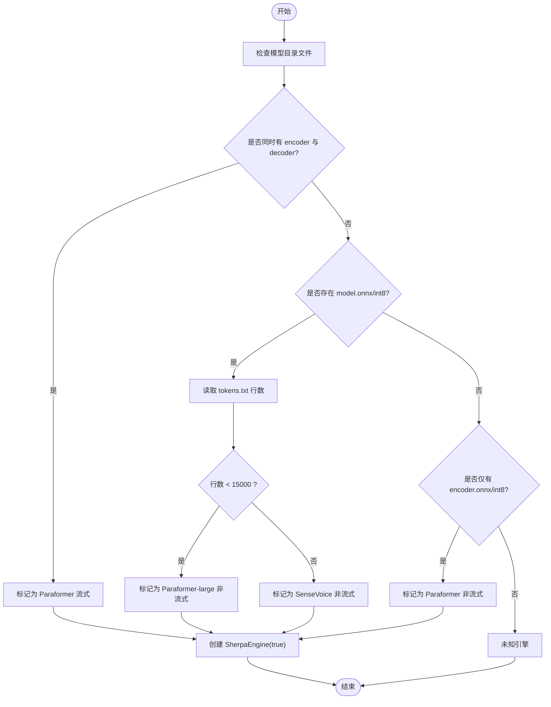
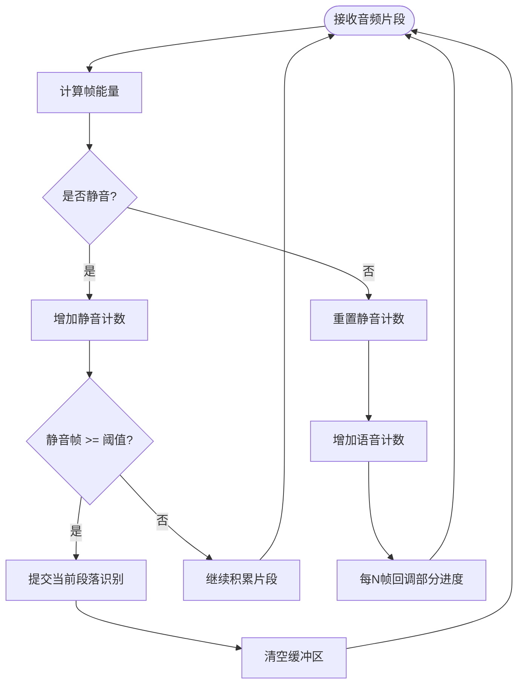
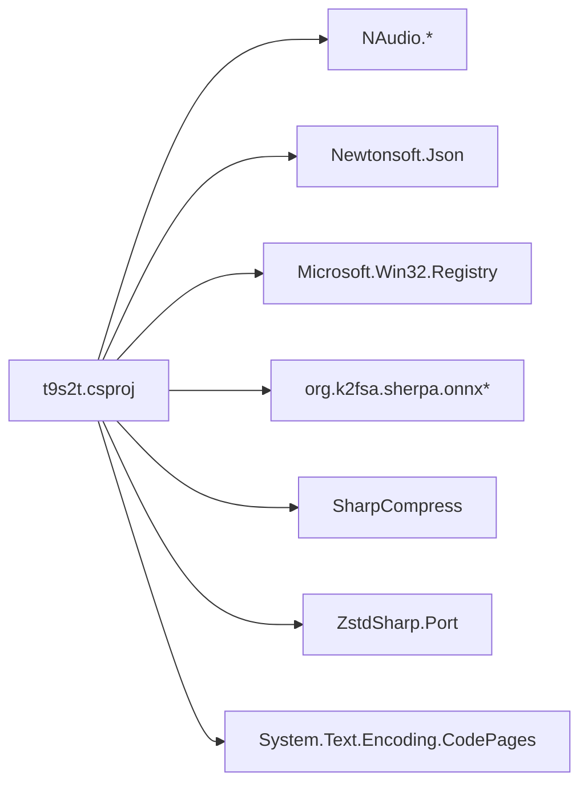

# 开发指南

<cite>
**本文引用的文件列表**
- [Program.cs](file://t9s2t/Program.cs)
- [Form1.cs](file://t9s2t/Form1.cs)
- [t9s2t.csproj](file://t9s2t/t9s2t.csproj)
- [packages.config](file://t9s2t/packages.config)
- [App.config](file://t9s2t/App.config)
- [ISpeechEngine.cs](file://t9s2t/Engines/ISpeechEngine.cs)
- [SherpaEngine.cs](file://t9s2t/Engines/SherpaEngine.cs)
- [EngineDetector.cs](file://t9s2t/Engines/EngineDetector.cs)
- [VadStreamProcessor.cs](file://t9s2t/Engines/VadStreamProcessor.cs)
- [TarBz2Extractor.cs](file://t9s2t/Engines/TarBz2Extractor.cs)
- [AssemblyInfo.cs](file://t9s2t/Properties/AssemblyInfo.cs)
- [app.manifest](file://t9s2t/app.manifest)
</cite>

## 目录
1. [简介](#简介)
2. [项目结构](#项目结构)
3. [核心组件](#核心组件)
4. [架构总览](#架构总览)
5. [详细组件分析](#详细组件分析)
6. [依赖关系分析](#依赖关系分析)
7. [性能与稳定性](#性能与稳定性)
8. [调试与排障](#调试与排障)
9. [测试策略](#测试策略)
10. [重构与版本控制最佳实践](#重构与版本控制最佳实践)
11. [新特性开发流程](#新特性开发流程)
12. [持续集成与自动化部署](#持续集成与自动化部署)
13. [常见陷阱与解决方案](#常见陷阱与解决方案)
14. [贡献代码规范与流程](#贡献代码规范与流程)
15. [结论](#结论)

## 简介
本项目是一个基于 .NET Framework 4.8 的 Windows 桌面应用，提供“按住快捷键录音、松手出字”的语音转文本能力。它通过低层键盘钩子捕获 Ctrl+Alt+D 组合键，使用 NAudio 采集麦克风音频，结合 sherpa-onnx 引擎（SenseVoice、Paraformer）进行离线识别，支持流式与非流式两种模式，并可选加载标点恢复与 VAD 模型。应用具备托盘后台运行、开机自启、远程模型与引擎 DLL 自动下载、单实例运行等实用功能。

## 项目结构
- 顶层解决方案 t9s2t.sln 包含一个 WinForms 工程 t9s2t。
- 工程采用分层组织：UI 层在 Form1.cs，引擎抽象与实现位于 Engines 目录，资源与属性在 Properties，构建配置在 csproj 和 packages.config。
- 关键入口为 Program.Main，负责 TLS 设置与 UI 启动；主界面逻辑集中在 Form1，包括键盘钩子、录音、引擎加载、模型管理、输入模拟等。

图表来源
- [Program.cs:1-27](file://t9s2t/Program.cs#L1-L27)
- [Form1.cs:1-120](file://t9s2t/Form1.cs#L1-L120)
- [ISpeechEngine.cs:1-35](file://t9s2t/Engines/ISpeechEngine.cs#L1-L35)
- [EngineDetector.cs:1-122](file://t9s2t/Engines/EngineDetector.cs#L1-L122)
- [SherpaEngine.cs:1-120](file://t9s2t/Engines/SherpaEngine.cs#L1-L120)
- [VadStreamProcessor.cs:1-60](file://t9s2t/Engines/VadStreamProcessor.cs#L1-L60)
- [TarBz2Extractor.cs:1-60](file://t9s2t/Engines/TarBz2Extractor.cs#L1-L60)

章节来源
- [t9s2t.csproj:1-60](file://t9s2t/t9s2t.csproj#L1-L60)
- [packages.config:1-20](file://t9s2t/packages.config#L1-L20)
- [App.config:1-10](file://t9s2t/App.config#L1-L10)

## 核心组件
- 程序入口与运行时初始化
  - 设置全局 TLS 协议，确保网络请求兼容 TLS 1.2/1.1/1.0。
  - 启用视觉样式并启动主窗体。
- 主窗体与系统交互
  - 单实例互斥、托盘图标、开机自启注册、窗口显示/隐藏、消息广播。
  - 低层键盘钩子拦截 Ctrl+Alt+D 触发录音，松手停止并输出结果。
  - 动态 UI 控件创建、二维码图片加载、广告面板折叠状态持久化。
- 引擎抽象与实现
  - ISpeechEngine 统一了加载、接受音频、获取部分/最终结果、重置等能力。
  - SherpaEngine 封装 sherpa-onnx，支持 SenseVoice、Paraformer（含 large）、流式 Paraformer，并可选加载标点与 VAD 模型。
  - EngineDetector 根据模型目录结构自动识别引擎类型并创建对应实例。
- 流式处理与分段
  - VadStreamProcessor 将非流式模型包装成“静音分段 + 即时提交”的流式体验。
- 压缩解压
  - TarBz2Extractor 原生支持 tar.bz2/tar.gz/zip 等格式，无需外部工具。

章节来源
- [Program.cs:15-24](file://t9s2t/Program.cs#L15-L24)
- [Form1.cs:144-235](file://t9s2t/Form1.cs#L144-L235)
- [ISpeechEngine.cs:1-35](file://t9s2t/Engines/ISpeechEngine.cs#L1-L35)
- [SherpaEngine.cs:57-115](file://t9s2t/Engines/SherpaEngine.cs#L57-L115)
- [EngineDetector.cs:27-75](file://t9s2t/Engines/EngineDetector.cs#L27-L75)
- [VadStreamProcessor.cs:28-86](file://t9s2t/Engines/VadStreamProcessor.cs#L28-L86)
- [TarBz2Extractor.cs:22-96](file://t9s2t/Engines/TarBz2Extractor.cs#L22-L96)

## 架构总览
整体采用“UI 编排 + 引擎抽象 + 插件式模型”的架构。UI 层负责用户交互、系统 API 调用与异步任务调度；引擎层通过接口屏蔽不同模型差异；模型以目录形式存在，由检测器自动识别并加载。

图表来源
- [Form1.cs:20-120](file://t9s2t/Form1.cs#L20-L120)
- [ISpeechEngine.cs:1-35](file://t9s2t/Engines/ISpeechEngine.cs#L1-L35)
- [SherpaEngine.cs:14-120](file://t9s2t/Engines/SherpaEngine.cs#L14-L120)
- [EngineDetector.cs:22-122](file://t9s2t/Engines/EngineDetector.cs#L22-L122)
- [VadStreamProcessor.cs:12-60](file://t9s2t/Engines/VadStreamProcessor.cs#L12-L60)
- [TarBz2Extractor.cs:17-60](file://t9s2t/Engines/TarBz2Extractor.cs#L17-L60)

## 详细组件分析

### 键盘钩子与输入模拟
- 键盘钩子
  - 使用 SetWindowsHookEx 安装 WH_KEYBOARD_LL 钩子，监听 WM_KEYDOWN/WM_KEYUP 及 Alt 修饰下的系统按键事件。
  - 当检测到 Ctrl+Alt+D 按下时开始录音，并在松开时停止录音并输出结果。
- 输入模拟
  - 优先使用剪贴板 + SendKeys 粘贴，避免逐字符输入的延迟与闪烁。
  - 针对 Alt 仍按住的场景，先释放 Alt 再发送 Space，防止弹出系统菜单。
  - 提供降级方案：逐字符 SendKeys 作为兜底。

图表来源
- [Form1.cs:415-460](file://t9s2t/Form1.cs#L415-L460)
- [Form1.cs:992-1051](file://t9s2t/Form1.cs#L992-L1051)
- [SherpaEngine.cs:351-479](file://t9s2t/Engines/SherpaEngine.cs#L351-L479)
- [VadStreamProcessor.cs:38-136](file://t9s2t/Engines/VadStreamProcessor.cs#L38-L136)

章节来源
- [Form1.cs:82-127](file://t9s2t/Form1.cs#L82-L127)
- [Form1.cs:415-460](file://t9s2t/Form1.cs#L415-L460)
- [Form1.cs:992-1051](file://t9s2t/Form1.cs#L992-L1051)
- [App.config:3-6](file://t9s2t/App.config#L3-L6)

### 引擎检测与加载
- 检测规则
  - 流式 Paraformer：同时存在 encoder.onnx/int8 与 decoder.onnx/int8。
  - 非流式大模型：存在 model.onnx/int8，并通过 tokens.txt 行数区分 SenseVoice 与 Paraformer-large。
  - 非流式小模型：仅存在 encoder.onnx/int8。
- 加载流程
  - 根据检测结果构造 Offline/Online Recognizer，必要时加载标点与 VAD 模型。
  - 流式模式下设置端点参数，平衡出字速度与吞字问题。

图表来源
- [EngineDetector.cs:27-75](file://t9s2t/Engines/EngineDetector.cs#L27-L75)
- [SherpaEngine.cs:74-115](file://t9s2t/Engines/SherpaEngine.cs#L74-L115)

章节来源
- [EngineDetector.cs:27-122](file://t9s2t/Engines/EngineDetector.cs#L27-L122)
- [SherpaEngine.cs:57-255](file://t9s2t/Engines/SherpaEngine.cs#L57-L255)

### 流式与非流式处理
- 流式（SherpaEngine Online）
  - 实时送入音频片段，周期性解码并返回部分文本；结束时 InputFinished 并循环解码剩余数据。
  - 支持端点检测与分句重置。
- 非流式（SherpaEngine Offline + VadStreamProcessor）
  - 计算帧能量，连续静音达到阈值后提交一段语音进行识别，模拟“边说边出字”。

图表来源
- [VadStreamProcessor.cs:38-136](file://t9s2t/Engines/VadStreamProcessor.cs#L38-L136)
- [SherpaEngine.cs:351-479](file://t9s2t/Engines/SherpaEngine.cs#L351-L479)

章节来源
- [VadStreamProcessor.cs:12-162](file://t9s2t/Engines/VadStreamProcessor.cs#L12-L162)
- [SherpaEngine.cs:351-543](file://t9s2t/Engines/SherpaEngine.cs#L351-L543)

### 压缩解压与模型分发
- 使用 SharpCompress 原生支持 tar.bz2/tar.gz/zip，无需外部工具。
- tar.bz2 需要两步：先解压 bzip2 得到 .tar，再解 tar。
- 提供魔数判断与扩展名判断双重校验。

章节来源
- [TarBz2Extractor.cs:22-96](file://t9s2t/Engines/TarBz2Extractor.cs#L22-L96)
- [TarBz2Extractor.cs:112-140](file://t9s2t/Engines/TarBz2Extractor.cs#L112-L140)

### 单实例与托盘
- 使用全局 Mutex 保证单实例运行，重复启动时将焦点切换到已有窗口。
- 托盘图标提供显示主界面与退出选项，双击可恢复主窗口。

章节来源
- [Form1.cs:151-169](file://t9s2t/Form1.cs#L151-L169)
- [Form1.cs:237-258](file://t9s2t/Form1.cs#L237-L258)

### 开机自启与注册表
- 通过 HKCU\Software\Microsoft\Windows\CurrentVersion\Run 写入/删除条目实现开机自启。
- 提供异常处理与回滚逻辑，失败时恢复复选框状态。

章节来源
- [Form1.cs:260-277](file://t9s2t/Form1.cs#L260-L277)

## 依赖关系分析
- 框架与平台
  - 目标框架：.NET Framework 4.8（csproj 与 App.config 指定）。
  - 语言版本：7.3（x64 配置）。
- 第三方库
  - NAudio.*：音频采集与波形处理。
  - Newtonsoft.Json：JSON 解析（远程模型/引擎配置）。
  - Microsoft.Win32.Registry：注册表访问。
  - org.k2fsa.sherpa.onnx*：sherpa-onnx 托管封装与 x64 运行时。
  - SharpCompress、ZstdSharp.Port：压缩解压。
  - System.Text.Encoding.CodePages：编码页支持。
- 构建产物
  - OutputType=WinExe，生成桌面应用程序。
  - Debug/Release 与 x64 多平台配置。

图表来源
- [t9s2t.csproj:61-124](file://t9s2t/t9s2t.csproj#L61-L124)
- [packages.config:1-20](file://t9s2t/packages.config#L1-L20)

章节来源
- [t9s2t.csproj:1-60](file://t9s2t/t9s2t.csproj#L1-L60)
- [packages.config:1-20](file://t9s2t/packages.config#L1-L20)

## 性能与稳定性
- 线程与异步
  - 引擎加载、解压、网络请求均使用异步或 Task.Run，避免阻塞 UI 线程。
  - 键盘钩子回调尽量轻量，复杂操作交由 UI 线程异步执行。
- 内存与缓冲
  - 非流式模式使用 List<byte> 累积音频片段，注意及时清理与限制大小。
  - 流式模式按需解码，减少峰值内存占用。
- 输入稳定性
  - 剪贴板 + SendKeys 原子粘贴，降低闪烁与丢字风险。
  - 对 Alt 修饰键冲突做特殊处理，避免误触系统菜单。

[本节为通用指导，不直接分析具体文件]

## 调试与排障
- 调试环境搭建
  - 安装 Visual Studio 2022（推荐），选择“.NET 桌面开发”工作负载。
  - 安装 .NET Framework 4.8 开发工具包（若未自带）。
  - 打开解决方案 t9s2t.sln，还原 NuGet 包（packages.config 已声明）。
  - 选择 x64 平台（因 sherpa-onnx 运行时为 x64）。
- 常用调试技巧
  - 断点：在键盘钩子回调、引擎加载、输入模拟处设置断点。
  - 日志：关注 Debug.WriteLine 输出，定位引擎加载与识别错误。
  - 进程与线程：观察 UI 线程是否被阻塞，确认异步路径是否正确。
  - 网络：检查 TLS 设置与远程地址可达性。
- 常见问题
  - 无法加载 sherpa-onnx：确认 x64 平台与 onnxruntime.dll/sherpa-onnx-c-api.dll 存在且有效。
  - 无声音输入：检查默认麦克风权限与 NAudio 设备枚举。
  - 输入无效：确认目标窗口可接收剪贴板粘贴，SendKeys 配置为 SendInput。

章节来源
- [t9s2t.csproj:38-57](file://t9s2t/t9s2t.csproj#L38-L57)
- [Form1.cs:510-567](file://t9s2t/Form1.cs#L510-L567)
- [App.config:3-6](file://t9s2t/App.config#L3-L6)

## 测试策略
- 单元测试建议
  - 引擎检测：覆盖各模型目录结构，验证 EngineDetector.Detect 分支。
  - 压缩解压：验证 tar.bz2/tar.gz/zip 的 Extract 行为与异常路径。
  - 流式/非流式处理：构造边界音频片段，验证分段与结果输出。
- 集成测试建议
  - 端到端流程：从键盘钩子触发到最终文本输入，验证 UI 状态与输出。
  - 网络与下载：模拟远程模型/引擎配置不可用，验证 fallback 机制。
- 测试工具
  - MSTest/NUnit/xUnit 任选其一，配合 Moq 模拟外部依赖（如文件系统、网络）。
  - 使用隔离的临时目录存放测试模型与解压产物。

[本节为通用指导，不直接分析具体文件]

## 重构与版本控制最佳实践
- 命名约定
  - 类与方法使用 PascalCase，私有字段使用 _camelCase。
  - 常量使用 UPPER_SNAKE_CASE。
- 注释标准
  - 公共接口与关键方法添加 XML 文档注释，说明用途、参数与返回值。
  - 复杂算法与边界条件补充行内注释。
- 文件组织
  - 按职责划分目录：UI、Engines、Utils、Tests。
  - 保持单一职责，避免巨型类（如 Form1 可拆分更多模块）。
- 版本控制
  - 使用 Git，遵循语义化版本（主.次.修订）。
  - 提交信息清晰描述变更动机与影响范围。
  - 分支策略：main 稳定，develop 集成，feature/* 新功能，hotfix/* 紧急修复。

[本节为通用指导，不直接分析具体文件]

## 新特性开发流程
- 需求分析
  - 明确用户场景、输入输出、性能指标与兼容性要求。
- 设计文档
  - 绘制架构图与序列图，定义接口契约与数据模型。
  - 评估外部依赖与安全风险（如网络、文件系统、注册表）。
- 编码实现
  - 在 Engines 新增引擎实现或扩展现有引擎。
  - 在 UI 层提供配置入口与状态反馈。
- 测试验证
  - 编写单元与集成用例，覆盖正常与异常路径。
  - 进行性能基准测试与回归测试。
- 发布准备
  - 更新版本号与变更日志，打包与签名（如需）。
  - 更新远程模型/引擎配置与下载逻辑。

[本节为通用指导，不直接分析具体文件]

## 持续集成与自动化部署
- CI 流水线
  - 拉取代码，还原 NuGet 包，编译 x64 配置。
  - 运行单元测试与集成测试，收集测试结果。
  - 构建安装包（MSI/ZIP），上传制品仓库。
- 自动化部署
  - 从制品仓库下载最新构建，替换目标机器上的二进制与模型。
  - 提供一键脚本或 PowerShell 任务执行部署。
- 质量门禁
  - 静态代码分析（SonarQube）、安全扫描（Dependency-Check）。
  - 覆盖率阈值与失败阻断合并。

[本节为通用指导，不直接分析具体文件]

## 常见陷阱与解决方案
- 平台不匹配
  - sherpa-onnx 运行时为 x64，需确保构建平台为 x64。
- 权限不足
  - app.manifest 请求管理员权限，某些系统策略可能阻止安装或修改注册表。
- 网络与证书
  - 确保 TLS 1.2 可用，代理环境下正确配置 User-Agent 与证书链。
- 输入冲突
  - Alt 修饰键可能导致系统菜单弹出，需在输入前释放修饰键。
- 资源缺失
  - 缺少 onnxruntime.dll/sherpa-onnx-c-api.dll 会导致引擎加载失败，应提供自动下载与校验。

章节来源
- [t9s2t.csproj:38-57](file://t9s2t/t9s2t.csproj#L38-L57)
- [app.manifest:6-9](file://t9s2t/app.manifest#L6-L9)
- [Form1.cs:510-567](file://t9s2t/Form1.cs#L510-L567)
- [Form1.cs:992-1051](file://t9s2t/Form1.cs#L992-L1051)

## 贡献代码规范与流程
- 分支与提交
  - 新建 feature/* 分支，提交信息遵循“类型: 简述”，如 feat: 增加标点恢复开关。
- 代码审查
  - 提交 PR，附带变更说明与测试截图/日志。
  - 至少一名维护者审查通过后合并。
- 发布流程
  - 打标签 vX.Y.Z，更新 README 与变更日志。
  - 构建产物上传至发布渠道。

[本节为通用指导，不直接分析具体文件]

## 结论
本指南围绕开发环境搭建、项目结构与代码组织、调试技巧、测试策略、重构与版本控制、新特性开发流程、CI/CD 配置以及常见陷阱展开，帮助开发者快速上手并高效迭代。建议在后续迭代中逐步完善单元测试覆盖、模块化拆分与文档沉淀，以提升项目的可维护性与可扩展性。