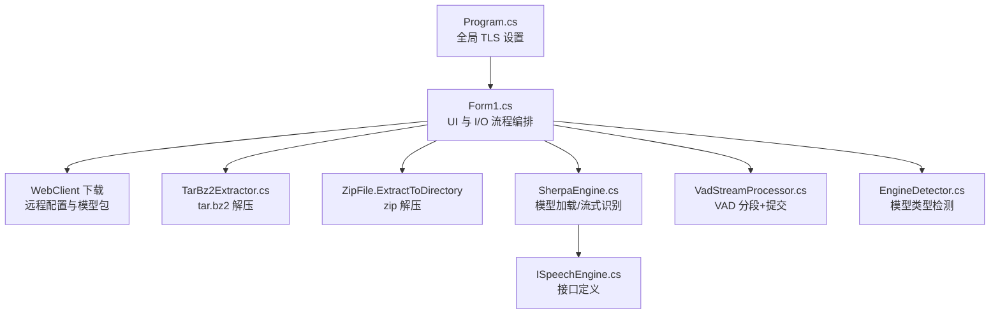
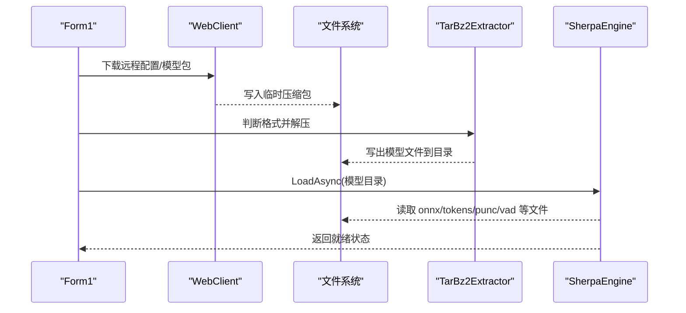
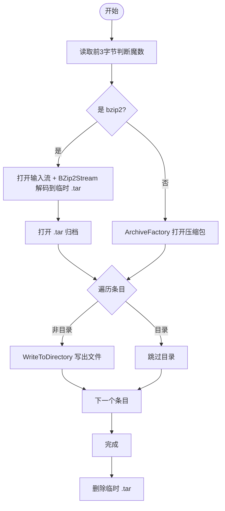
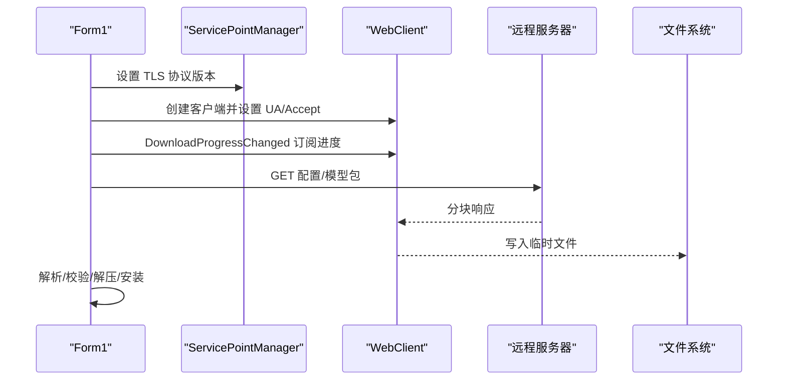
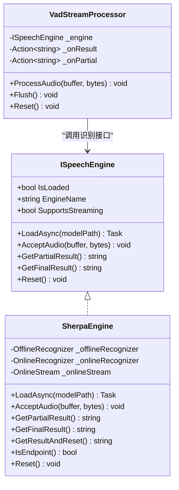
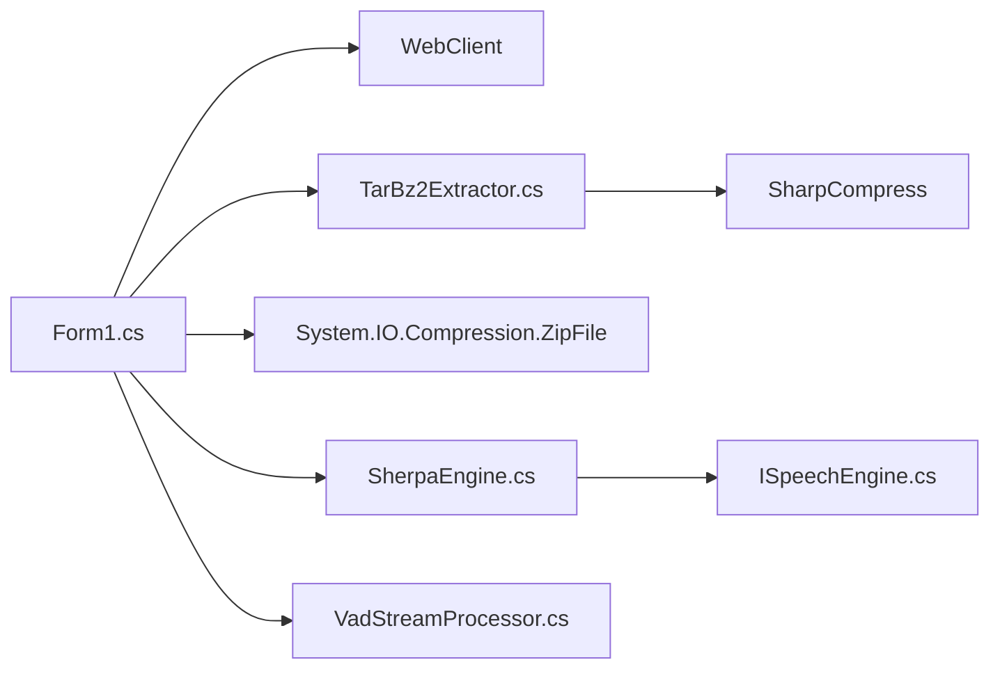

# I/O 操作优化

<cite>
**本文引用的文件**
- [Program.cs](file://t9s2t/Program.cs)
- [Form1.cs](file://t9s2t/Form1.cs)
- [TarBz2Extractor.cs](file://t9s2t/Engines/TarBz2Extractor.cs)
- [VadStreamProcessor.cs](file://t9s2t/Engines/VadStreamProcessor.cs)
- [SherpaEngine.cs](file://t9s2t/Engines/SherpaEngine.cs)
- [ISpeechEngine.cs](file://t9s2t/Engines/ISpeechEngine.cs)
- [EngineDetector.cs](file://t9s2t/Engines/EngineDetector.cs)
</cite>

## 目录
1. [简介](#简介)
2. [项目结构](#项目结构)
3. [核心组件](#核心组件)
4. [架构总览](#架构总览)
5. [详细组件分析](#详细组件分析)
6. [依赖关系分析](#依赖关系分析)
7. [性能考量与优化建议](#性能考量与优化建议)
8. [故障排查指南](#故障排查指南)
9. [结论](#结论)
10. [附录：基准测试与监控建议](#附录基准测试与监控建议)

## 简介
本技术文档聚焦于 I/O 操作优化，围绕以下方面展开：
- 文件读写性能优化：缓冲大小、异步 I/O、内存映射文件的适用性与取舍
- 网络请求优化策略：连接复用、并发下载、缓存与降级、错误重试
- 压缩文件处理：TarBz2Extractor 的解压路径、流式处理与内存控制
- 磁盘访问优化：顺序读写、随机访问优化、文件系统选择
- 日志记录的异步化与批处理：级别控制与输出目标优化
- I/O 性能监控与瓶颈分析方法
- 结合本项目实际的优化案例与可执行的基准方法

## 项目结构
本项目为 Windows 桌面应用（WinForms），核心 I/O 相关代码集中在 UI 层与引擎层：
- UI 层负责模型与运行时 DLL 的网络下载、解压、安装与状态管理
- 引擎层封装语音识别模型加载、音频流输入与结果获取
- 压缩工具类提供 tar.bz2/tar.gz/zip 的统一解压能力

图表来源
- [Program.cs:18-20](file://t9s2t/Program.cs#L18-L20)
- [Form1.cs:876-966](file://t9s2t/Form1.cs#L876-L966)
- [TarBz2Extractor.cs:30-96](file://t9s2t/Engines/TarBz2Extractor.cs#L30-L96)
- [SherpaEngine.cs:57-72](file://t9s2t/Engines/SherpaEngine.cs#L57-L72)
- [ISpeechEngine.cs:1-35](file://t9s2t/Engines/ISpeechEngine.cs#L1-L35)
- [VadStreamProcessor.cs:28-101](file://t9s2t/Engines/VadStreamProcessor.cs#L28-L101)
- [EngineDetector.cs:27-75](file://t9s2t/Engines/EngineDetector.cs#L27-L75)

章节来源
- [Program.cs:18-20](file://t9s2t/Program.cs#L18-L20)
- [Form1.cs:876-966](file://t9s2t/Form1.cs#L876-L966)
- [TarBz2Extractor.cs:30-96](file://t9s2t/Engines/TarBz2Extractor.cs#L30-L96)
- [SherpaEngine.cs:57-72](file://t9s2t/Engines/SherpaEngine.cs#L57-L72)
- [ISpeechEngine.cs:1-35](file://t9s2t/Engines/ISpeechEngine.cs#L1-L35)
- [VadStreamProcessor.cs:28-101](file://t9s2t/Engines/VadStreamProcessor.cs#L28-L101)
- [EngineDetector.cs:27-75](file://t9s2t/Engines/EngineDetector.cs#L27-L75)

## 核心组件
- TarBz2Extractor：统一解压入口，支持 tar.bz2/tar.gz/zip；对 tar.bz2 采用两步流式解压（bzip2 -> tar -> 写入目录）
- VadStreamProcessor：基于能量阈值的 VAD，将非流式模型模拟为“边说边出字”的流式体验
- SherpaEngine：封装 sherpa-onnx 的离线/流式识别、标点恢复与 VAD 集成
- Form1：驱动整个 I/O 生命周期（网络下载、解压、模型检测与加载、录音与识别）

章节来源
- [TarBz2Extractor.cs:17-96](file://t9s2t/Engines/TarBz2Extractor.cs#L17-L96)
- [VadStreamProcessor.cs:12-101](file://t9s2t/Engines/VadStreamProcessor.cs#L12-L101)
- [SherpaEngine.cs:14-72](file://t9s2t/Engines/SherpaEngine.cs#L14-L72)
- [Form1.cs:876-966](file://t9s2t/Form1.cs#L876-L966)

## 架构总览
下图展示了从“下载模型包”到“解压并加载引擎”的关键 I/O 链路。

图表来源
- [Form1.cs:876-966](file://t9s2t/Form1.cs#L876-L966)
- [TarBz2Extractor.cs:30-96](file://t9s2t/Engines/TarBz2Extractor.cs#L30-L96)
- [SherpaEngine.cs:57-72](file://t9s2t/Engines/SherpaEngine.cs#L57-L72)

## 详细组件分析

### 压缩文件处理：TarBz2Extractor
- 设计要点
  - 通过魔数判断是否为 bzip2，避免仅依赖扩展名带来的误判
  - tar.bz2 采用两步流式处理：先解 bzip2 得到 .tar，再逐条目写入目标目录
  - 其他格式直接走 ArchiveFactory 统一解压
- 性能与内存
  - 使用流式 CopyTo 减少一次性内存占用
  - 中间 .tar 文件位于系统临时目录，避免污染工作目录
- 可扩展点
  - 可引入自定义缓冲区大小以提升吞吐
  - 可考虑并行解压多个条目（注意文件系统并发写入开销）

图表来源
- [TarBz2Extractor.cs:112-127](file://t9s2t/Engines/TarBz2Extractor.cs#L112-L127)
- [TarBz2Extractor.cs:40-75](file://t9s2t/Engines/TarBz2Extractor.cs#L40-L75)
- [TarBz2Extractor.cs:76-93](file://t9s2t/Engines/TarBz2Extractor.cs#L76-L93)

章节来源
- [TarBz2Extractor.cs:30-96](file://t9s2t/Engines/TarBz2Extractor.cs#L30-L96)
- [TarBz2Extractor.cs:112-127](file://t9s2t/Engines/TarBz2Extractor.cs#L112-L127)

### 网络请求优化：Form1 中的下载与配置拉取
- 现状
  - 使用 WebClient 进行 JSON 配置与二进制模型包的下载
  - 在多处显式设置 ServicePointManager.SecurityProtocol 以启用 TLS1.2/1.1/SSL
  - 下载完成后根据魔数或扩展名选择解压方式
- 可优化点
  - 连接复用：WebClient 内部基于 ServicePoint，默认已复用 TCP 连接；可通过合理设置 MaxServicePointIdleTime 与 DefaultConnectionLimit 提升并发效率
  - 并发下载：多文件场景下可限制最大并发度，避免打满带宽导致抖动
  - 断点续传：大文件下载失败后从上次位置继续，降低重传成本
  - 超时与重试：为网络请求增加合理的超时与指数退避重试
  - 本地缓存：对远程配置 JSON 做短期缓存，减少频繁请求

图表来源
- [Form1.cs:876-912](file://t9s2t/Form1.cs#L876-L912)
- [Form1.cs:525-567](file://t9s2t/Form1.cs#L525-L567)
- [Form1.cs:818-851](file://t9s2t/Form1.cs#L818-L851)
- [Program.cs:18-20](file://t9s2t/Program.cs#L18-L20)

章节来源
- [Form1.cs:876-966](file://t9s2t/Form1.cs#L876-L966)
- [Form1.cs:525-567](file://t9s2t/Form1.cs#L525-L567)
- [Form1.cs:818-851](file://t9s2t/Form1.cs#L818-L851)
- [Program.cs:18-20](file://t9s2t/Program.cs#L18-L20)

### 流式识别与 VAD：VadStreamProcessor 与 SherpaEngine
- VadStreamProcessor
  - 基于帧平均振幅阈值判定静音/语音，达到连续静音帧数后触发一次识别
  - 通过回调上报最终结果与部分提示，避免 UI 闪烁
- SherpaEngine
  - 自动检测模型类型（SenseVoice/Paraformer/Paraformer-large/流式 Paraformer）
  - 流式模式：按端点规则分句，支持 GetResultAndReset 用于录音中分句
  - 非流式模式：累积音频片段，结束时整段识别
  - 可选加载标点与 VAD 模型，增强文本可读性与静音处理

图表来源
- [ISpeechEngine.cs:1-35](file://t9s2t/Engines/ISpeechEngine.cs#L1-L35)
- [SherpaEngine.cs:14-72](file://t9s2t/Engines/SherpaEngine.cs#L14-L72)
- [VadStreamProcessor.cs:12-101](file://t9s2t/Engines/VadStreamProcessor.cs#L12-L101)

章节来源
- [VadStreamProcessor.cs:28-101](file://t9s2t/Engines/VadStreamProcessor.cs#L28-L101)
- [SherpaEngine.cs:57-72](file://t9s2t/Engines/SherpaEngine.cs#L57-L72)
- [ISpeechEngine.cs:1-35](file://t9s2t/Engines/ISpeechEngine.cs#L1-L35)

## 依赖关系分析
- 模块耦合
  - Form1 作为编排者，依赖 WebClient、TarBz2Extractor、SherpaEngine、VadStreamProcessor
  - SherpaEngine 依赖底层 sherpa-onnx 原生库（通过托管包装）
  - TarBz2Extractor 依赖 SharpCompress 库
- 外部依赖
  - 网络：System.Net.WebClient、TLS 协议栈
  - 压缩：SharpCompress（tar/bzip2）、System.IO.Compression（zip）
  - 音频：NAudio.Wave（录音）

图表来源
- [Form1.cs:876-966](file://t9s2t/Form1.cs#L876-L966)
- [TarBz2Extractor.cs:1-10](file://t9s2t/Engines/TarBz2Extractor.cs#L1-L10)
- [SherpaEngine.cs:1-10](file://t9s2t/Engines/SherpaEngine.cs#L1-L10)
- [ISpeechEngine.cs:1-35](file://t9s2t/Engines/ISpeechEngine.cs#L1-L35)

章节来源
- [Form1.cs:876-966](file://t9s2t/Form1.cs#L876-L966)
- [TarBz2Extractor.cs:1-10](file://t9s2t/Engines/TarBz2Extractor.cs#L1-L10)
- [SherpaEngine.cs:1-10](file://t9s2t/Engines/SherpaEngine.cs#L1-L10)
- [ISpeechEngine.cs:1-35](file://t9s2t/Engines/ISpeechEngine.cs#L1-L35)

## 性能考量与优化建议

### 文件读写优化
- 缓冲大小调优
  - 当前实现多为框架默认缓冲（如 CopyTo）。对于大文件解压/拷贝，可将缓冲提升至 1MB~4MB，减少系统调用次数
  - 参考路径：[TarBz2Extractor.cs:48-53](file://t9s2t/Engines/TarBz2Extractor.cs#L48-L53)
- 异步 I/O
  - 下载与解压已使用异步 API（DownloadFileTaskAsync、ExtractAsync），避免阻塞 UI 线程
  - 参考路径：[Form1.cs:908-926](file://t9s2t/Form1.cs#L908-L926)、[TarBz2Extractor.cs:22-25](file://t9s2t/Engines/TarBz2Extractor.cs#L22-L25)
- 内存映射文件
  - 适用于只读大文件（如模型权重）的随机访问场景。本项目主要顺序写入/解压，暂不推荐强制使用 mmap，以免增加复杂度与平台差异
  - 若后续需要快速扫描大型索引文件，可评估 MemoryMappedFile

### 网络请求优化
- 连接池与并发
  - 通过 ServicePointManager 调整连接行为，提高并发下载稳定性
  - 参考路径：[Program.cs:18-20](file://t9s2t/Program.cs#L18-L20)、[Form1.cs:879-885](file://t9s2t/Form1.cs#L879-L885)
- 请求合并与缓存
  - 远程配置 JSON 可做短期缓存（例如 5 分钟），避免重复请求
  - 参考路径：[Form1.cs:818-851](file://t9s2t/Form1.cs#L818-L851)
- 错误重试机制
  - 为下载与 JSON 拉取增加指数退避重试（最多 3 次），捕获网络异常并回退到内置备用列表
  - 参考路径：[Form1.cs:569-599](file://t9s2t/Form1.cs#L569-L599)

### 压缩文件处理优化
- 流式处理与内存控制
  - 当前已采用流式解压，避免一次性加载整个压缩包到内存
  - 可进一步优化：在写盘时增大缓冲区，减少 IO 次数
  - 参考路径：[TarBz2Extractor.cs:48-69](file://t9s2t/Engines/TarBz2Extractor.cs#L48-L69)
- 解压后清理
  - 确保临时文件及时删除，避免磁盘碎片与空间泄漏
  - 参考路径：[TarBz2Extractor.cs:71-74](file://t9s2t/Engines/TarBz2Extractor.cs#L71-L74)

### 磁盘访问优化
- 顺序读写优先
  - 下载与解压均为顺序写入，有利于磁盘预读与顺序写优化
- 随机访问优化
  - 模型加载阶段存在大量小文件读取，建议使用 SSD 并确保文件系统未过度碎片化
- 文件系统选择
  - NTFS 在 Windows 上具备较好的元数据与权限管理能力；对于纯数据目录，关闭不必要的审计可减少开销

### 日志记录优化
- 现状
  - 使用 Debug.WriteLine 输出关键步骤与错误信息
- 优化建议
  - 异步化：将日志写入后台队列，避免阻塞主流程
  - 批处理：批量落盘，降低频繁 IO
  - 级别控制：区分 Info/Warn/Error，便于生产环境裁剪
  - 输出目标：控制台/文件/事件查看器，按需切换

## 故障排查指南
- 下载失败
  - 检查 TLS 协议是否启用（程序启动即设置）
  - 确认网络连通与代理设置
  - 参考路径：[Program.cs:18-20](file://t9s2t/Program.cs#L18-L20)、[Form1.cs:879-885](file://t9s2t/Form1.cs#L879-L885)
- 解压失败
  - 确认压缩包完整性（魔数判断）
  - 检查临时目录权限与空间
  - 参考路径：[TarBz2Extractor.cs:112-127](file://t9s2t/Engines/TarBz2Extractor.cs#L112-L127)
- 模型加载失败
  - 检查 tokens.txt/onnx 文件是否存在且完整
  - 参考路径：[SherpaEngine.cs:74-115](file://t9s2t/Engines/SherpaEngine.cs#L74-L115)
- 识别无结果或卡顿
  - 检查 VAD 参数与静音阈值
  - 参考路径：[VadStreamProcessor.cs:18-26](file://t9s2t/Engines/VadStreamProcessor.cs#L18-L26)、[SherpaEngine.cs:351-384](file://t9s2t/Engines/SherpaEngine.cs#L351-L384)

章节来源
- [Program.cs:18-20](file://t9s2t/Program.cs#L18-L20)
- [Form1.cs:879-885](file://t9s2t/Form1.cs#L879-L885)
- [TarBz2Extractor.cs:112-127](file://t9s2t/Engines/TarBz2Extractor.cs#L112-L127)
- [SherpaEngine.cs:74-115](file://t9s2t/Engines/SherpaEngine.cs#L74-L115)
- [VadStreamProcessor.cs:18-26](file://t9s2t/Engines/VadStreamProcessor.cs#L18-L26)
- [SherpaEngine.cs:351-384](file://t9s2t/Engines/SherpaEngine.cs#L351-L384)

## 结论
- 本项目在 I/O 层面已采用异步与流式处理，整体具备良好的用户体验与资源控制
- 针对网络与压缩环节，仍有较大优化空间：连接复用、重试与缓存、缓冲大小调优
- 建议在后续迭代中引入统一的网络客户端抽象、可配置的日志系统与更完善的错误恢复策略

## 附录：基准测试与监控建议

### 基准测试方案
- 下载耗时
  - 指标：端到端时间、吞吐（MB/s）、CPU 占用
  - 方法：多次测量取中位数，对比不同缓冲大小与并发度
- 解压耗时
  - 指标：解压时间、峰值内存、IO 次数
  - 方法：固定压缩包，对比默认缓冲与自定义缓冲
- 模型加载
  - 指标：首次加载时间、I/O 次数、CPU 峰值
  - 方法：冷启动与热启动对比，观察 SSD 预读效果

### 监控与定位
- 系统级
  - PerfMon：Disk Queue Length、Avg Disk sec/Read、Avg Disk sec/Write、Network Interface Bytes/sec
  - Process Explorer：进程 IO 计数、句柄与内存增长
- 应用级
  - 在关键路径埋点计时（下载、解压、加载）
  - 输出结构化日志（JSON），便于聚合与分析