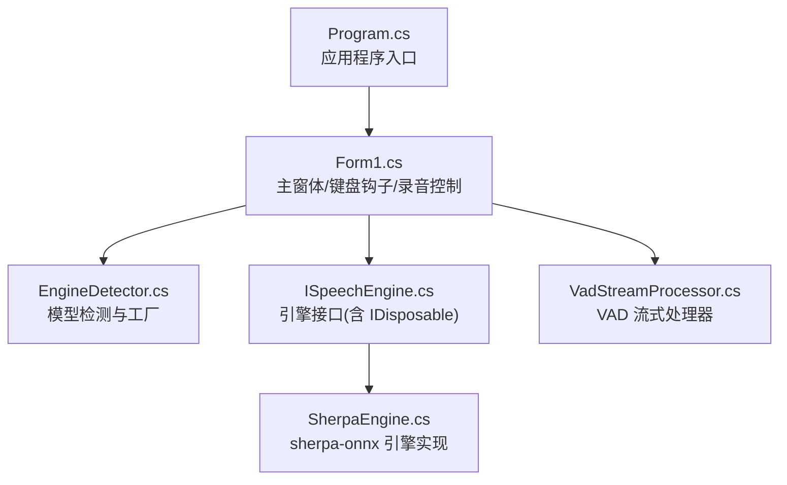
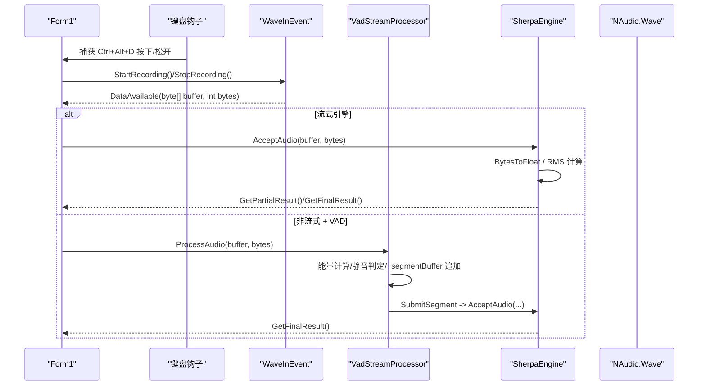
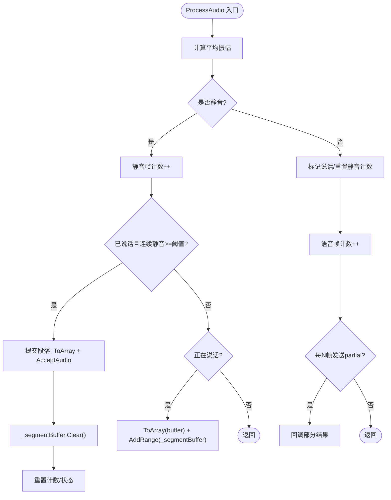
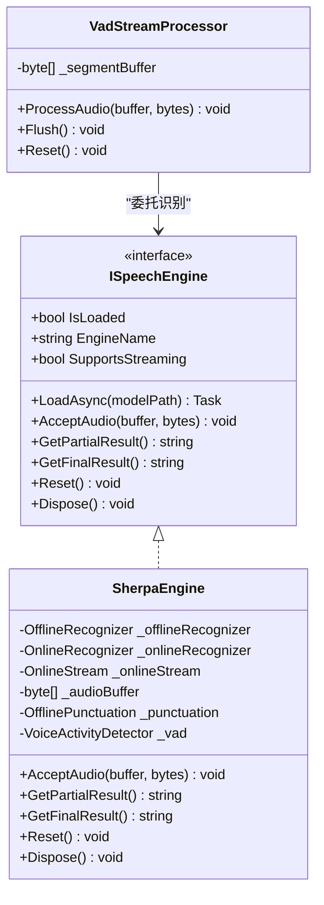
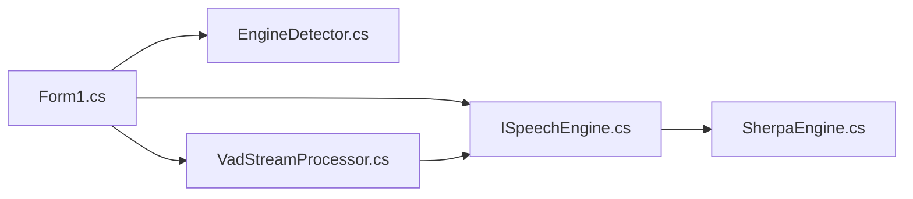

# 内存管理优化

<cite>
**本文引用的文件**
- [VadStreamProcessor.cs](file://t9s2t/Engines/VadStreamProcessor.cs)
- [SherpaEngine.cs](file://t9s2t/Engines/SherpaEngine.cs)
- [ISpeechEngine.cs](file://t9s2t/Engines/ISpeechEngine.cs)
- [EngineDetector.cs](file://t9s2t/Engines/EngineDetector.cs)
- [Form1.cs](file://t9s2t/Form1.cs)
- [Program.cs](file://t9s2t/Program.cs)
</cite>

## 目录
1. [简介](#简介)
2. [项目结构](#项目结构)
3. [核心组件](#核心组件)
4. [架构总览](#架构总览)
5. [详细组件分析](#详细组件分析)
6. [依赖关系分析](#依赖关系分析)
7. [性能与内存特性](#性能与内存特性)
8. [故障排查指南](#故障排查指南)
9. [结论](#结论)
10. [附录：最佳实践与工具](#附录最佳实践与工具)

## 简介
本技术文档聚焦于音频识别场景下的内存管理优化，围绕以下目标展开：
- 深入分析音频缓冲区管理策略，特别是 VadStreamProcessor 中的 _segmentBuffer 列表使用、对象分配与释放模式。
- 说明垃圾回收（GC）优化要点：大对象堆（LOH）管理、内存池复用、避免碎片化。
- 阐述内存泄漏防护：IDisposable 模式实现、事件订阅清理、资源句柄管理。
- 总结音频数据处理中的内存优化技巧：字节数组复用、零拷贝思路、内存映射文件的使用建议。
- 提供内存监控方法与性能分析工具使用指南，并给出常见问题的解决方案与最佳实践。

## 项目结构
本项目为 Windows 桌面应用，核心语音识别引擎封装在 Engines 命名空间下，UI 层通过 Form1 组织录音、按键钩子与 UI 交互，Program 作为入口点初始化全局 TLS 设置并启动 UI。

图表来源
- [Program.cs:15-24](file://t9s2t/Program.cs#L15-L24)
- [Form1.cs:22-28](file://t9s2t/Form1.cs#L22-L28)
- [EngineDetector.cs:22-104](file://t9s2t/Engines/EngineDetector.cs#L22-L104)
- [ISpeechEngine.cs:8-33](file://t9s2t/Engines/ISpeechEngine.cs#L8-L33)
- [SherpaEngine.cs:14-55](file://t9s2t/Engines/SherpaEngine.cs#L14-L55)
- [VadStreamProcessor.cs:12-33](file://t9s2t/Engines/VadStreamProcessor.cs#L12-L33)

章节来源
- [Program.cs:15-24](file://t9s2t/Program.cs#L15-L24)
- [Form1.cs:22-28](file://t9s2t/Form1.cs#L22-L28)
- [EngineDetector.cs:22-104](file://t9s2t/Engines/EngineDetector.cs#L22-L104)
- [ISpeechEngine.cs:8-33](file://t9s2t/Engines/ISpeechEngine.cs#L8-L33)
- [SherpaEngine.cs:14-55](file://t9s2t/Engines/SherpaEngine.cs#L14-L55)
- [VadStreamProcessor.cs:12-33](file://t9s2t/Engines/VadStreamProcessor.cs#L12-L33)

## 核心组件
- ISpeechEngine：定义统一的语音识别引擎接口，继承 IDisposable，要求所有外部资源必须可被显式释放。
- SherpaEngine：sherpa-onnx 引擎的具体实现，支持离线与非流式、流式两种模式；内部维护音频缓冲、流式流对象、标点恢复与 VAD 等组件，并在 Dispose 中统一释放。
- VadStreamProcessor：基于能量阈值进行静音检测，将非流式模型模拟为“分段流式”识别；内部使用 List<byte> 累积片段数据，达到静音段或强制刷新时提交识别。
- EngineDetector：根据模型目录结构自动判断引擎类型并创建对应实例。
- Form1：负责 UI、键盘钩子、录音生命周期、引擎加载与结果回调；在关闭路径上释放关键资源。

章节来源
- [ISpeechEngine.cs:8-33](file://t9s2t/Engines/ISpeechEngine.cs#L8-L33)
- [SherpaEngine.cs:14-55](file://t9s2t/Engines/SherpaEngine.cs#L14-L55)
- [VadStreamProcessor.cs:12-33](file://t9s2t/Engines/VadStreamProcessor.cs#L12-L33)
- [EngineDetector.cs:22-104](file://t9s2t/Engines/EngineDetector.cs#L22-L104)
- [Form1.cs:22-28](file://t9s2t/Form1.cs#L22-L28)

## 架构总览
下图展示了从音频采集到识别输出的整体流程，以及内存热点位置（如字节数组复制、List 扩容、浮点转换）。

图表来源
- [Form1.cs:422-460](file://t9s2t/Form1.cs#L422-L460)
- [VadStreamProcessor.cs:38-86](file://t9s2t/Engines/VadStreamProcessor.cs#L38-L86)
- [VadStreamProcessor.cs:114-136](file://t9s2t/Engines/VadStreamProcessor.cs#L114-L136)
- [SherpaEngine.cs:351-384](file://t9s2t/Engines/SherpaEngine.cs#L351-L384)
- [SherpaEngine.cs:388-479](file://t9s2t/Engines/SherpaEngine.cs#L388-L479)

## 详细组件分析

### VadStreamProcessor 的内存行为与优化点
- 数据结构
  - _segmentBuffer：List<byte>，用于累积一段语音的原始 PCM 字节。
  - 状态变量：_silenceFrameCount、_speechFrameCount、_isSpeaking 控制分段时机。
- 分配与复制
  - ToArray：每次追加前对输入 buffer 做 Array.Copy 生成新 byte[]，再 AddRange 到 _segmentBuffer。
  - SubmitSegment：调用 _segmentBuffer.ToArray() 生成一次性副本交给引擎识别。
- 释放与重置
  - Flush/Reset：Clear 列表并清零计数，避免残留引用导致 GC 延迟回收。
- 潜在问题
  - 频繁 Array.Copy 与 List 扩容会产生大量短生命周期对象，增加 GC 压力。
  - 多次 ToArray 会触发 LOH 分配风险（当片段较大时），可能引起抖动。

图表来源
- [VadStreamProcessor.cs:38-86](file://t9s2t/Engines/VadStreamProcessor.cs#L38-L86)
- [VadStreamProcessor.cs:114-136](file://t9s2t/Engines/VadStreamProcessor.cs#L114-L136)
- [VadStreamProcessor.cs:141-159](file://t9s2t/Engines/VadStreamProcessor.cs#L141-L159)

章节来源
- [VadStreamProcessor.cs:25-26](file://t9s2t/Engines/VadStreamProcessor.cs#L25-L26)
- [VadStreamProcessor.cs:38-86](file://t9s2t/Engines/VadStreamProcessor.cs#L38-L86)
- [VadStreamProcessor.cs:114-136](file://t9s2t/Engines/VadStreamProcessor.cs#L114-L136)
- [VadStreamProcessor.cs:141-159](file://t9s2t/Engines/VadStreamProcessor.cs#L141-L159)

### SherpaEngine 的内存行为与优化点
- 数据结构
  - 非流式：_audioBuffer（List<byte>）累积整段 PCM。
  - 流式：_onlineStream 由底层库管理，AcceptAudio 直接送入。
  - 其他：OfflineRecognizer/OnlineRecognizer、OfflinePunctuation、VoiceActivityDetector 等原生句柄。
- 分配与复制
  - AcceptAudio（非流式）：先 new byte[bytes] 再 Array.Copy，随后 AddRange 到 _audioBuffer。
  - GetFinalResult（非流式）：_audioBuffer.ToArray() 转换为 float[]（BytesToFloat），然后识别后 Clear。
  - 流式：BytesToFloat 产生 float[] 送入 OnlineStream。
- 释放与重置
  - Reset：清空 _audioBuffer，重置流式 stream，调用 VAD.Reset。
  - Dispose：按顺序释放 _onlineStream、_onlineRecognizer、_offlineRecognizer、_punctuation、_vad，并将字段置空。
- 潜在问题
  - 非流式路径存在两次复制（byte[] 副本 + ToArray + BytesToFloat），峰值内存较高。
  - 流式路径每次采样块都会分配 float[]，高频分配带来 GC 压力。

图表来源
- [ISpeechEngine.cs:8-33](file://t9s2t/Engines/ISpeechEngine.cs#L8-L33)
- [SherpaEngine.cs:14-55](file://t9s2t/Engines/SherpaEngine.cs#L14-L55)
- [SherpaEngine.cs:351-384](file://t9s2t/Engines/SherpaEngine.cs#L351-L384)
- [SherpaEngine.cs:388-479](file://t9s2t/Engines/SherpaEngine.cs#L388-L479)
- [SherpaEngine.cs:591-605](file://t9s2t/Engines/SherpaEngine.cs#L591-L605)
- [VadStreamProcessor.cs:12-33](file://t9s2t/Engines/VadStreamProcessor.cs#L12-L33)

章节来源
- [SherpaEngine.cs:34-35](file://t9s2t/Engines/SherpaEngine.cs#L34-L35)
- [SherpaEngine.cs:351-384](file://t9s2t/Engines/SherpaEngine.cs#L351-L384)
- [SherpaEngine.cs:388-479](file://t9s2t/Engines/SherpaEngine.cs#L388-L479)
- [SherpaEngine.cs:591-605](file://t9s2t/Engines/SherpaEngine.cs#L591-L605)

### 资源管理与泄漏防护
- IDisposable 模式
  - ISpeechEngine 继承 IDisposable，SherpaEngine 在 Dispose 中释放所有原生句柄与托管资源，并将字段置空，避免悬挂引用。
  - Form1 在 FormClosing 中释放 waveIn、engine、trayIcon，确保进程退出时不泄露系统资源。
- 事件与回调
  - VadStreamProcessor 的 onResult/onPartial 为 Action 引用，注意在停止录音或重置时避免重复绑定导致闭包持有长生命周期对象。
- 资源句柄
  - 流式模式下 _onlineStream 的生命周期需与 _onlineRecognizer 一致；非流式模式下 _audioBuffer 需在识别完成后及时 Clear。

章节来源
- [ISpeechEngine.cs:8-33](file://t9s2t/Engines/ISpeechEngine.cs#L8-L33)
- [SherpaEngine.cs:591-605](file://t9s2t/Engines/SherpaEngine.cs#L591-L605)
- [Form1.cs:279-288](file://t9s2t/Form1.cs#L279-L288)

## 依赖关系分析
- 模块耦合
  - Form1 依赖 EngineDetector 选择引擎，并通过 ISpeechEngine 抽象与 SherpaEngine 解耦。
  - VadStreamProcessor 仅依赖 ISpeechEngine，便于替换不同引擎实现。
- 外部依赖
  - NAudio.Wave 提供音频采集回调，产生 byte[] 数据。
  - sherpa-onnx 原生库通过 C API 暴露给 .NET，需要正确 Dispose 以避免未托管内存泄漏。

图表来源
- [Form1.cs:22-28](file://t9s2t/Form1.cs#L22-L28)
- [EngineDetector.cs:22-104](file://t9s2t/Engines/EngineDetector.cs#L22-L104)
- [ISpeechEngine.cs:8-33](file://t9s2t/Engines/ISpeechEngine.cs#L8-L33)
- [SherpaEngine.cs:14-55](file://t9s2t/Engines/SherpaEngine.cs#L14-L55)
- [VadStreamProcessor.cs:12-33](file://t9s2t/Engines/VadStreamProcessor.cs#L12-L33)

章节来源
- [EngineDetector.cs:22-104](file://t9s2t/Engines/EngineDetector.cs#L22-L104)
- [Form1.cs:22-28](file://t9s2t/Form1.cs#L22-L28)

## 性能与内存特性
- 分配热点
  - VadStreamProcessor：ToList 追加前的 ToArray 与 _segmentBuffer.ToArray() 在长语音或高吞吐场景下会产生较多临时数组。
  - SherpaEngine：非流式路径的二次复制与 float[] 转换；流式路径的逐块 float[] 分配。
- LOH 风险
  - 当单次提交的音频片段超过 85KB 时，可能进入大对象堆，增加 GC 成本与碎片风险。
- 缓存与复用
  - 当前代码未使用 ArrayPool<T> 或对象池，短期对象多，易引发 Gen2 GC。
- 线程与并发
  - 音频回调通常在高频率触发，应避免在回调中进行阻塞 IO 或复杂计算，减少锁竞争与额外分配。

章节来源
- [VadStreamProcessor.cs:38-86](file://t9s2t/Engines/VadStreamProcessor.cs#L38-L86)
- [VadStreamProcessor.cs:114-136](file://t9s2t/Engines/VadStreamProcessor.cs#L114-L136)
- [SherpaEngine.cs:351-384](file://t9s2t/Engines/SherpaEngine.cs#L351-L384)
- [SherpaEngine.cs:388-479](file://t9s2t/Engines/SherpaEngine.cs#L388-L479)

## 故障排查指南
- 症状：长时间运行后内存持续增长
  - 检查是否在异常路径遗漏了 Reset/Flush/Clear，导致 _segmentBuffer/_audioBuffer 未释放。
  - 确认 Dispose 是否被调用，尤其是 Form 关闭路径与异常分支。
- 症状：识别卡顿或 CPU 飙升
  - 检查是否存在频繁的 ToArray/Array.Copy 与 float[] 分配，考虑引入池化或 Span/ReadOnlySpan 优化。
- 症状：无输出或偶发崩溃
  - 核对流式模式下 _onlineStream 是否正确 Reset/InputFinished，避免状态不一致。
  - 检查 VAD 与标点模型的加载与异常处理路径。

章节来源
- [VadStreamProcessor.cs:91-112](file://t9s2t/Engines/VadStreamProcessor.cs#L91-L112)
- [SherpaEngine.cs:417-479](file://t9s2t/Engines/SherpaEngine.cs#L417-L479)
- [SherpaEngine.cs:591-605](file://t9s2t/Engines/SherpaEngine.cs#L591-L605)
- [Form1.cs:279-288](file://t9s2t/Form1.cs#L279-L288)

## 结论
当前实现以清晰的分层与明确的接口契约为基础，但在高频音频处理路径中存在多处临时数组分配与复制，容易引发 GC 压力与大对象堆碎片。通过引入对象池、Span/ReadOnlySpan 零拷贝、合理的缓冲大小与分片策略，以及严格的 IDisposable 与资源清理，可以显著降低内存占用与抖动，提升实时性与稳定性。

## 附录：最佳实践与工具

### 内存管理最佳实践
- 缓冲与复制
  - 优先使用 Span<T>/ReadOnlySpan<T> 在栈上操作，避免不必要的中间数组。
  - 使用 ArrayPool<byte> 与 ArrayPool<float> 复用数组，减少分配。
  - 合并小片段写入，减少 List 扩容次数；必要时预分配容量。
- 大对象堆管理
  - 控制单次提交片段大小，避免超过 LOH 阈值；必要时拆分为更小的块。
  - 避免在热路径中创建大型字符串或集合。
- 零拷贝与内存映射
  - 对于固定大小的音频文件或缓存，可使用 MemoryMappedFile 进行零拷贝访问。
  - 流式场景尽量在回调内只做必要的数据变换，避免跨边界复制。
- 资源与事件
  - 严格遵循 IDisposable 模式，确保所有原生句柄与托管资源在确定路径释放。
  - 事件订阅在对象销毁时取消订阅，防止闭包持有长生命周期对象。
- 线程与并发
  - 音频回调路径保持轻量，避免锁与阻塞 IO；将耗时任务异步化。

### 内存监控与分析工具
- 运行时指标
  - 使用 System.Diagnostics 计数器观察 GC 次数、Gen2 比例、LOH 增长。
  - 记录关键路径的分配热点（如 ToArray、BytesToFloat 调用频次）。
- 工具链
  - Visual Studio 诊断工具：CPU 使用率、内存快照、分配热点。
  - dotnet-counters/dotnet-trace：收集 GC 与 CPU 遥测。
  - PerfView：深度分析托管与非托管内存分配。
  - dotMemory/.NET Profiler：定位对象保留与泄漏路径。
- 分析方法
  - 对比基线与优化后的 GC 次数、暂停时间与峰值内存。
  - 关注长生命周期对象（如 List<byte>、float[]）的保留原因。

### 常见问题与解决方案
- 问题：非流式路径内存峰值过高
  - 方案：减少复制次数，采用 Span 解析 PCM，避免中间 byte[] 与 float[] 同时存在。
- 问题：流式路径频繁分配 float[]
  - 方案：使用 ArrayPool<float> 复用缓冲区，或在 Native 侧完成转换以减少托管分配。
- 问题：VAD 分段过大导致 LOH 抖动
  - 方案：调整静音阈值与最小语音帧数，合理拆分片段；必要时限制最大片段长度。
- 问题：资源未释放导致泄漏
  - 方案：确保 Dispose 在所有退出路径执行；在异常分支也进行必要的 Reset/Clear。