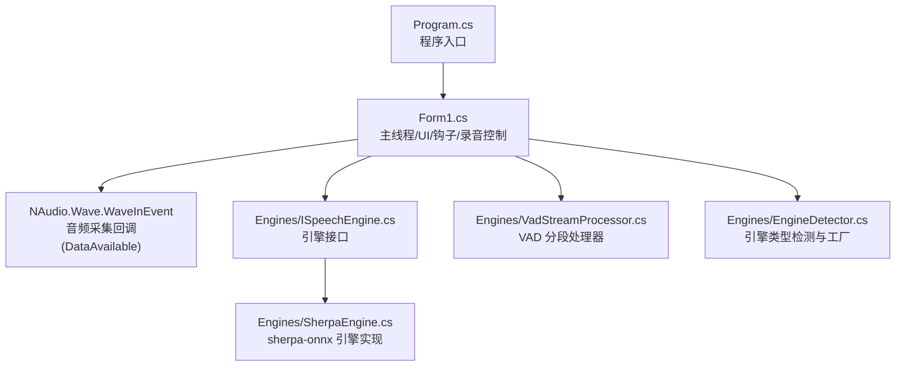
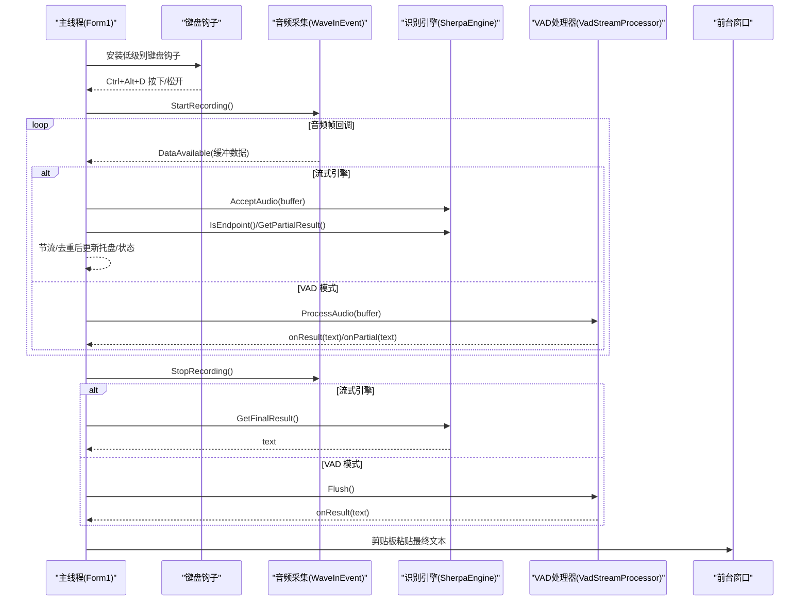
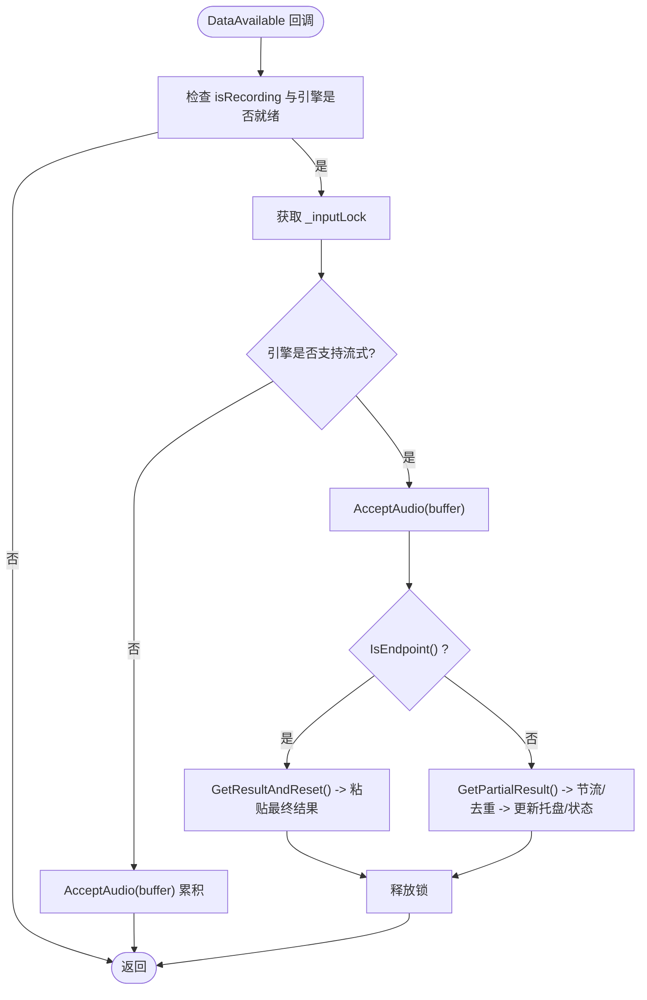
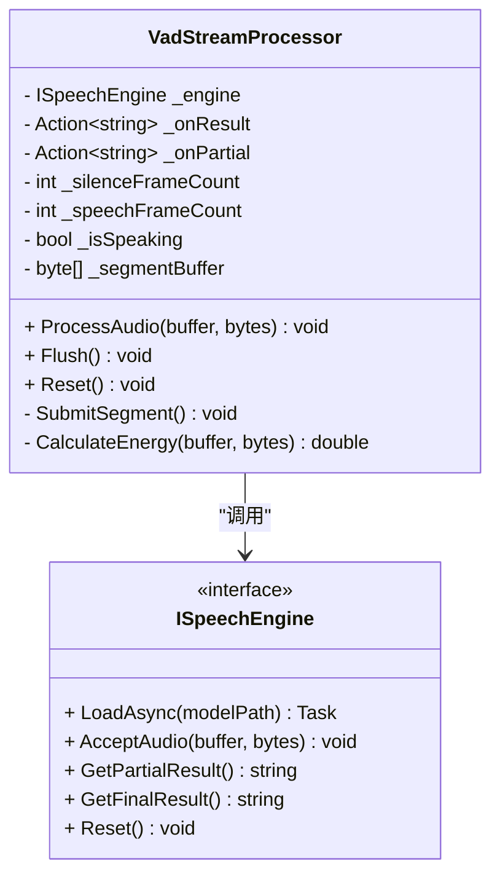
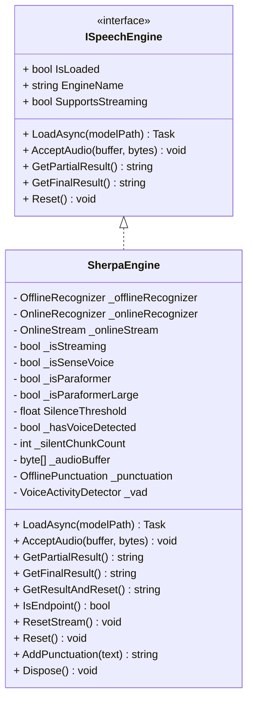
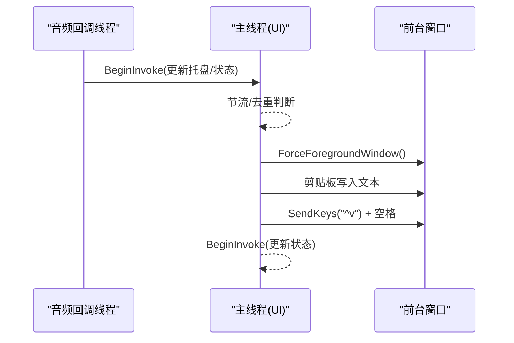
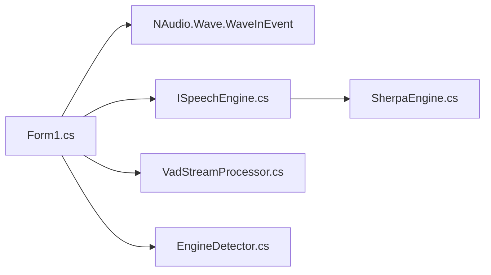

# 多线程与并发处理

<cite>
**本文引用的文件**
- [Program.cs](file://t9s2t/Program.cs)
- [Form1.cs](file://t9s2t/Form1.cs)
- [ISpeechEngine.cs](file://t9s2t/Engines/ISpeechEngine.cs)
- [SherpaEngine.cs](file://t9s2t/Engines/SherpaEngine.cs)
- [VadStreamProcessor.cs](file://t9s2t/Engines/VadStreamProcessor.cs)
- [EngineDetector.cs](file://t9s2t/Engines/EngineDetector.cs)
</cite>

## 目录
1. [简介](#简介)
2. [项目结构](#项目结构)
3. [核心组件](#核心组件)
4. [架构总览](#架构总览)
5. [详细组件分析](#详细组件分析)
6. [依赖关系分析](#依赖关系分析)
7. [性能考虑](#性能考虑)
8. [故障排查指南](#故障排查指南)
9. [结论](#结论)

## 简介
本技术文档聚焦于该语音识别应用的线程架构与并发处理设计，围绕以下目标展开：
- 主线程、音频采集线程、识别引擎线程的职责分离
- 异步编程模式（async/await）在音频流处理中的应用
- Task 并行与取消令牌机制的使用现状与建议
- 线程同步策略：锁、信号量、线程安全数据结构
- 音频数据流的并发处理：生产者-消费者、背压与流量控制
- 跨线程 UI 更新的安全机制：Invoke/BeginInvoke 的正确使用
- 并发性能调优技巧与死锁预防策略
- 多线程调试方法与性能监控指标

## 项目结构
应用采用 WinForms + NAudio + sherpa-onnx 的架构。关键模块职责如下：
- Program.cs：应用程序入口，初始化全局 TLS 设置并启动主窗体
- Form1.cs：UI 主线程，负责键盘钩子、录音控制、模型下载、引擎加载、结果输出到前台窗口
- Engines/ISpeechEngine.cs：识别引擎抽象接口
- Engines/SherpaEngine.cs：sherpa-onnx 引擎实现，支持 SenseVoice、离线 Paraformer、流式 Paraformer
- Engines/VadStreamProcessor.cs：基于能量阈值的 VAD 分段器，将非流式模型“模拟”为流式
- Engines/EngineDetector.cs：根据模型目录结构自动检测引擎类型并创建实例

图表来源
- [Program.cs:10-24](file://t9s2t/Program.cs#L10-L24)
- [Form1.cs:144-235](file://t9s2t/Form1.cs#L144-L235)
- [ISpeechEngine.cs:1-35](file://t9s2t/Engines/ISpeechEngine.cs#L1-L35)
- [SherpaEngine.cs:14-72](file://t9s2t/Engines/SherpaEngine.cs#L14-L72)
- [VadStreamProcessor.cs:12-33](file://t9s2t/Engines/VadStreamProcessor.cs#L12-L33)
- [EngineDetector.cs:22-104](file://t9s2t/Engines/EngineDetector.cs#L22-L104)

章节来源
- [Program.cs:10-24](file://t9s2t/Program.cs#L10-L24)
- [Form1.cs:144-235](file://t9s2t/Form1.cs#L144-L235)

## 核心组件
- 主线程（WinForms UI 线程）
  - 负责 UI 渲染、用户交互、键盘钩子、录音启停、引擎加载、结果粘贴到前台窗口
  - 通过 BeginInvoke/Invoke 进行跨线程 UI 更新
- 音频采集线程（NAudio 回调线程）
  - WaveInEvent.DataAvailable 事件由底层驱动线程触发，高频回调
  - 在该回调中调用引擎 AcceptAudio，必要时计算部分结果或触发 VAD 分段
- 识别引擎线程（后台任务）
  - SherpaEngine.LoadAsync 内部使用 Task.Run 执行模型加载等耗时操作
  - 引擎内部对在线/离线识别逻辑进行封装，提供 GetPartialResult/GetFinalResult 等方法

章节来源
- [Form1.cs:1057-1111](file://t9s2t/Form1.cs#L1057-L1111)
- [SherpaEngine.cs:57-72](file://t9s2t/Engines/SherpaEngine.cs#L57-L72)
- [ISpeechEngine.cs:19-32](file://t9s2t/Engines/ISpeechEngine.cs#L19-L32)

## 架构总览
下图展示了从音频采集到识别结果输出的完整并发流程，包括主线程、音频回调线程、引擎后台任务的协作方式。

图表来源
- [Form1.cs:1146-1173](file://t9s2t/Form1.cs#L1146-L1173)
- [Form1.cs:1057-1111](file://t9s2t/Form1.cs#L1057-L1111)
- [Form1.cs:1228-1273](file://t9s2t/Form1.cs#L1228-L1273)
- [VadStreamProcessor.cs:38-136](file://t9s2t/Engines/VadStreamProcessor.cs#L38-L136)
- [SherpaEngine.cs:351-479](file://t9s2t/Engines/SherpaEngine.cs#L351-L479)

## 详细组件分析

### 组件一：音频采集与输入管线（WaveInEvent + 锁保护）
- 采集线程触发 DataAvailable，回调频率高，需避免阻塞
- 使用互斥锁 _inputLock 保护 isRecording 状态、引擎 Reset/AcceptAudio、以及停止录音时的收尾逻辑
- 流式模式下直接送入引擎；非流式模式下积累缓冲区，等待结束一次性识别
- 端点检测（停顿分句）时获取中间结果并重置 stream，避免吞字

图表来源
- [Form1.cs:1064-1111](file://t9s2t/Form1.cs#L1064-L1111)
- [SherpaEngine.cs:351-479](file://t9s2t/Engines/SherpaEngine.cs#L351-L479)

章节来源
- [Form1.cs:1064-1111](file://t9s2t/Form1.cs#L1064-L1111)
- [Form1.cs:1146-1173](file://t9s2t/Form1.cs#L1146-L1173)
- [Form1.cs:1228-1273](file://t9s2t/Form1.cs#L1228-L1273)

### 组件二：VAD 流式处理器（非流式模型的“流式化”）
- 基于平均振幅阈值判断静音/语音段，连续静音达到阈值则提交一段语音
- 最小语音帧数过滤噪音，避免误触发
- 每若干帧发送 partial 反馈，提升用户体验
- 提交段落时调用引擎 Reset/AcceptAudio/GetFinalResult，并通过回调通知上层

图表来源
- [VadStreamProcessor.cs:12-162](file://t9s2t/Engines/VadStreamProcessor.cs#L12-L162)
- [ISpeechEngine.cs:1-35](file://t9s2t/Engines/ISpeechEngine.cs#L1-L35)

章节来源
- [VadStreamProcessor.cs:38-136](file://t9s2t/Engines/VadStreamProcessor.cs#L38-L136)

### 组件三：识别引擎（sherpa-onnx）
- 支持三种模式：SenseVoice（非流式）、Paraformer-large（非流式）、Paraformer（流式）
- 模型类型检测依据 tokens.txt 行数与文件结构
- 流式模式使用 OnlineRecognizer/OnlineStream，非流式使用 OfflineRecognizer
- 可选标点恢复与 VAD 模型加载
- 静音检测与端点参数用于平衡出字速度与稳定性

图表来源
- [ISpeechEngine.cs:1-35](file://t9s2t/Engines/ISpeechEngine.cs#L1-L35)
- [SherpaEngine.cs:14-608](file://t9s2t/Engines/SherpaEngine.cs#L14-L608)

章节来源
- [SherpaEngine.cs:57-72](file://t9s2t/Engines/SherpaEngine.cs#L57-L72)
- [SherpaEngine.cs:351-479](file://t9s2t/Engines/SherpaEngine.cs#L351-L479)
- [EngineDetector.cs:22-104](file://t9s2t/Engines/EngineDetector.cs#L22-L104)

### 组件四：跨线程 UI 更新与输入合成
- 使用 BeginInvoke 异步更新 UI（托盘图标、状态栏），避免阻塞音频回调
- 使用 Invoke 在需要确保同步的场景（如强制显示主窗口）
- 最终结果粘贴到前台窗口前，先尝试将前台窗口置于最前，必要时临时释放 Alt 键以避免系统菜单弹出
- 防抖与去重：partial 结果仅在文本变化且超过一定时间间隔才更新

图表来源
- [Form1.cs:1057-1111](file://t9s2t/Form1.cs#L1057-L1111)
- [Form1.cs:1114-1144](file://t9s2t/Form1.cs#L1114-L1144)
- [Form1.cs:1228-1273](file://t9s2t/Form1.cs#L1228-L1273)

章节来源
- [Form1.cs:1057-1111](file://t9s2t/Form1.cs#L1057-L1111)
- [Form1.cs:1114-1144](file://t9s2t/Form1.cs#L1114-L1144)
- [Form1.cs:1228-1273](file://t9s2t/Form1.cs#L1228-L1273)

## 依赖关系分析
- 主线程依赖 NAudio 的 WaveInEvent 进行音频采集
- 主线程通过 ISpeechEngine 抽象与 SherpaEngine 具体实现解耦
- VadStreamProcessor 作为适配器，将非流式引擎包装成“类流式”体验
- EngineDetector 根据模型目录结构选择正确的引擎模式

图表来源
- [Form1.cs:1057-1111](file://t9s2t/Form1.cs#L1057-L1111)
- [ISpeechEngine.cs:1-35](file://t9s2t/Engines/ISpeechEngine.cs#L1-L35)
- [SherpaEngine.cs:14-72](file://t9s2t/Engines/SherpaEngine.cs#L14-L72)
- [VadStreamProcessor.cs:12-33](file://t9s2t/Engines/VadStreamProcessor.cs#L12-L33)
- [EngineDetector.cs:22-104](file://t9s2t/Engines/EngineDetector.cs#L22-L104)

章节来源
- [Form1.cs:1057-1111](file://t9s2t/Form1.cs#L1057-L1111)
- [EngineDetector.cs:22-104](file://t9s2t/Engines/EngineDetector.cs#L22-L104)

## 性能考虑
- 音频回调路径应尽量轻量：仅做 AcceptAudio 与必要的端点/部分结果查询
- 节流与去重减少 UI 刷新频率，降低主线程压力
- 流式引擎的端点参数（Rule1MinTrailingSilence、Rule2MinTrailingSilence、Rule3MinUtteranceLength）影响出字延迟与稳定性，需按场景调优
- 非流式引擎的静音阈值与分段帧数影响分段准确性与延迟
- 避免在回调中进行 I/O 或长时间 CPU 计算，必要时使用队列与后台任务

[本节为通用指导，不直接分析具体文件]

## 故障排查指南
- 单实例互斥锁
  - 使用全局 Mutex 防止多开，若已存在实例则激活已有窗口并退出当前进程
- 跨线程 UI 异常
  - 使用 InvokeRequired 判断是否需要 Invoke/BeginInvoke
  - 在 UI 更新前后捕获异常，避免崩溃
- 音频设备问题
  - 未检测到麦克风时提示用户，避免空引用
- 引擎加载失败
  - 捕获异常并回退 UI 状态，提示重新下载模型
- 前台窗口粘贴失败
  - 降级为逐字符输入方案，保证可用性

章节来源
- [Form1.cs:153-162](file://t9s2t/Form1.cs#L153-L162)
- [Form1.cs:244-258](file://t9s2t/Form1.cs#L244-L258)
- [Form1.cs:1057-1111](file://t9s2t/Form1.cs#L1057-L1111)
- [Form1.cs:1278-1290](file://t9s2t/Form1.cs#L1278-L1290)

## 结论
该应用在主线程、音频采集线程与识别引擎线程之间实现了清晰的职责分离，结合 async/await、Task.Run、锁与 BeginInvoke/Invoke 等手段，保证了音频流处理的实时性与 UI 的响应性。VAD 处理器为非流式模型提供了“类流式”体验，而 sherpa-onnx 引擎在不同模式下灵活切换，兼顾了识别质量与延迟。建议后续引入更完善的取消令牌机制与线程安全队列以增强背压与可观测性，进一步提升系统的健壮性与可维护性。