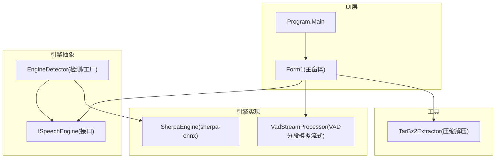
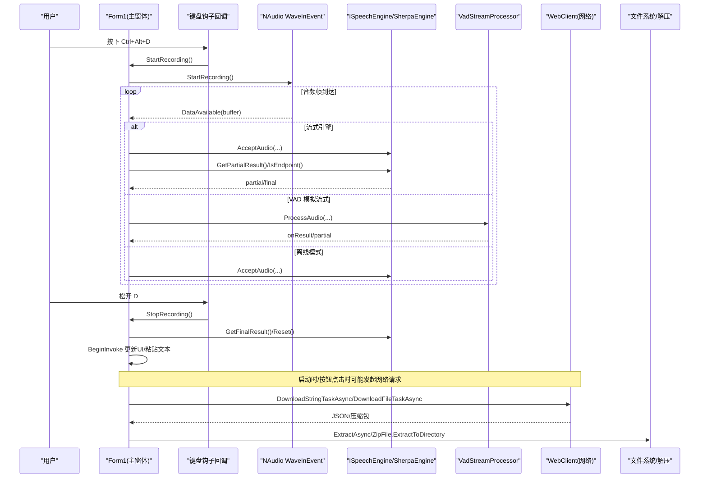
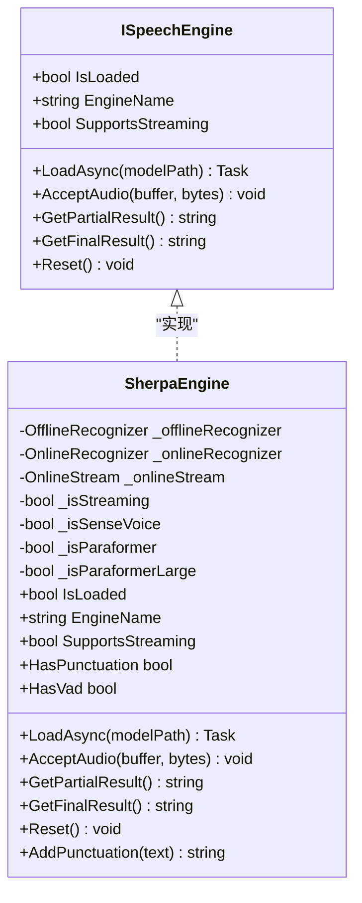
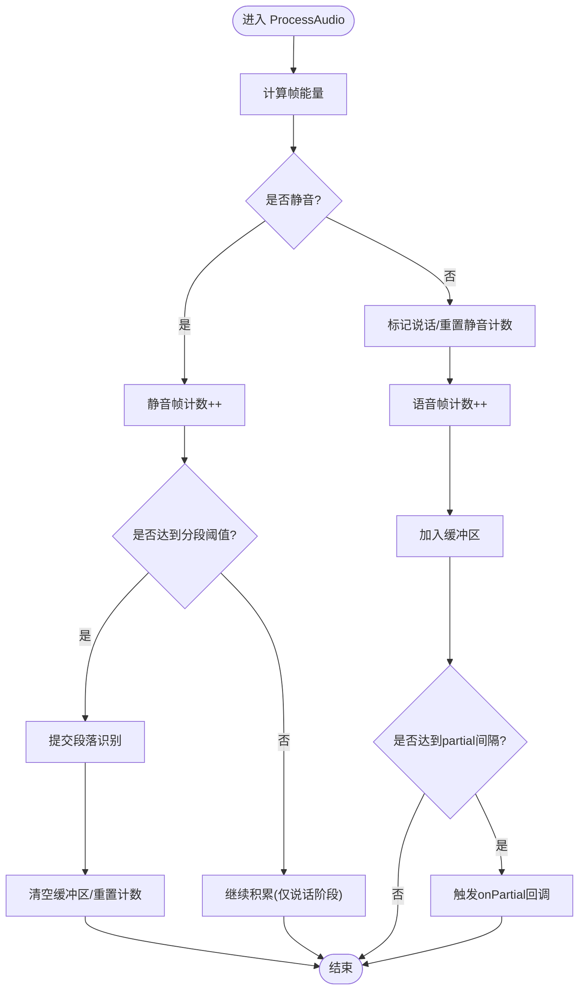
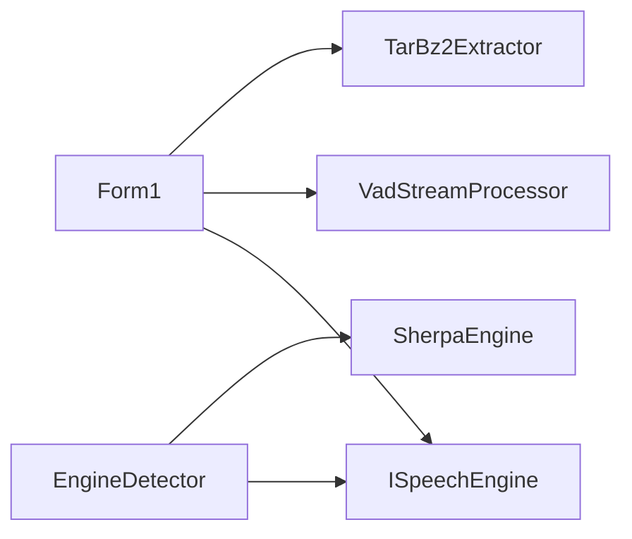

# 异步编程模式

<cite>
**本文引用的文件**   
- [Program.cs](file://t9s2t/Program.cs)
- [Form1.cs](file://t9s2t/Form1.cs)
- [ISpeechEngine.cs](file://t9s2t/Engines/ISpeechEngine.cs)
- [SherpaEngine.cs](file://t9s2t/Engines/SherpaEngine.cs)
- [VadStreamProcessor.cs](file://t9s2t/Engines/VadStreamProcessor.cs)
- [EngineDetector.cs](file://t9s2t/Engines/EngineDetector.cs)
- [TarBz2Extractor.cs](file://t9s2t/Engines/TarBz2Extractor.cs)
</cite>

## 目录
1. [引言](#引言)
2. [项目结构](#项目结构)
3. [核心组件](#核心组件)
4. [架构总览](#架构总览)
5. [详细组件分析](#详细组件分析)
6. [依赖关系分析](#依赖关系分析)
7. [性能考量](#性能考量)
8. [故障排查指南](#故障排查指南)
9. [结论](#结论)
10. [附录](#附录)

## 引言
本技术文档围绕音频流处理场景中的异步编程模式展开，重点解析 async/await、Task 并行、取消令牌机制、异常与超时控制、资源清理、UI 线程安全更新（Invoke/BeginInvoke）、以及背压与流量控制策略。结合仓库中实际的语音识别应用代码，给出可落地的最佳实践、常见陷阱与调试监控方法。

## 项目结构
该项目是一个 Windows Forms 桌面应用，使用 NAudio 采集麦克风数据，通过 sherpa-onnx 引擎进行离线或流式语音识别，支持模型自动下载与解压，并通过键盘钩子实现快捷键录音。

图表来源
- [Program.cs:1-27](file://t9s2t/Program.cs#L1-L27)
- [Form1.cs:1-1318](file://t9s2t/Form1.cs#L1-L1318)
- [ISpeechEngine.cs:1-35](file://t9s2t/Engines/ISpeechEngine.cs#L1-L35)
- [EngineDetector.cs:1-122](file://t9s2t/Engines/EngineDetector.cs#L1-L122)
- [SherpaEngine.cs:1-608](file://t9s2t/Engines/SherpaEngine.cs#L1-L608)
- [VadStreamProcessor.cs:1-162](file://t9s2t/Engines/VadStreamProcessor.cs#L1-L162)
- [TarBz2Extractor.cs:1-143](file://t9s2t/Engines/TarBz2Extractor.cs#L1-L143)

章节来源
- [Program.cs:1-27](file://t9s2t/Program.cs#L1-L27)
- [Form1.cs:1-1318](file://t9s2t/Form1.cs#L1-L1318)

## 核心组件
- 界面与流程编排：Form1 负责 UI 初始化、网络请求、模型下载、录音控制、结果粘贴到前台窗口等。
- 引擎抽象：ISpeechEngine 定义加载、接受音频、获取部分/最终结果、重置等能力。
- 引擎实现：SherpaEngine 封装 sherpa-onnx 的在线/离线识别、标点恢复、VAD 集成。
- VAD 流式处理器：VadStreamProcessor 将非流式模型“模拟”为流式输出（静音切分）。
- 引擎检测与创建：EngineDetector 根据模型目录结构判断类型并创建对应引擎实例。
- 压缩解压：TarBz2Extractor 提供 tar.bz2/zip 等格式的异步解压。

章节来源
- [ISpeechEngine.cs:1-35](file://t9s2t/Engines/ISpeechEngine.cs#L1-L35)
- [SherpaEngine.cs:1-608](file://t9s2t/Engines/SherpaEngine.cs#L1-L608)
- [VadStreamProcessor.cs:1-162](file://t9s2t/Engines/VadStreamProcessor.cs#L1-L162)
- [EngineDetector.cs:1-122](file://t9s2t/Engines/EngineDetector.cs#L1-L122)
- [TarBz2Extractor.cs:1-143](file://t9s2t/Engines/TarBz2Extractor.cs#L1-L143)

## 架构总览
下图展示了从 UI 触发到音频采集、引擎识别、结果回传与 UI 更新的完整异步链路。

图表来源
- [Form1.cs:1146-1273](file://t9s2t/Form1.cs#L1146-L1273)
- [Form1.cs:1057-1111](file://t9s2t/Form1.cs#L1057-L1111)
- [Form1.cs:818-966](file://t9s2t/Form1.cs#L818-L966)
- [TarBz2Extractor.cs:22-96](file://t9s2t/Engines/TarBz2Extractor.cs#L22-L96)
- [SherpaEngine.cs:351-543](file://t9s2t/Engines/SherpaEngine.cs#L351-L543)
- [VadStreamProcessor.cs:38-136](file://t9s2t/Engines/VadStreamProcessor.cs#L38-L136)

## 详细组件分析

### 组件一：Form1（UI 与异步编排）
- 异步 I/O 与 Task 并行
  - 网络请求：使用 WebClient.DownloadStringTaskAsync/DownloadFileTaskAsync 配合 await，避免阻塞 UI 线程。
  - 解压任务：TarBz2Extractor.ExtractAsync 内部以 Task.Run 包装同步解压逻辑，再在 UI 中 await。
- 异常处理与用户体验
  - 网络失败时回退到本地备用 JSON；下载失败提示错误信息并恢复按钮状态。
  - 引擎加载失败时通过 Invoke 更新 UI 显示错误并引导重新下载。
- 资源清理
  - 窗体关闭时释放互斥量、卸载键盘钩子、Dispose 录音设备与引擎对象。
- UI 线程安全更新
  - 使用 this.BeginInvoke 在非 UI 线程更新托盘图标与状态栏，避免跨线程访问控件。
  - 关键路径中使用 lock 保护剪贴板与输入操作，确保原子性。
- 背压与节流
  - partial 结果采用时间戳节流与去重，降低 UI 刷新频率，避免闪烁。
- 取消令牌与超时控制（现状与建议）
  - 当前未显式使用 CancellationTokenSource 和超时控制。建议在网络请求与长时间任务中加入 CTS 与超时，提升健壮性与可取消性。

章节来源
- [Form1.cs:151-235](file://t9s2t/Form1.cs#L151-L235)
- [Form1.cs:510-567](file://t9s2t/Form1.cs#L510-L567)
- [Form1.cs:818-966](file://t9s2t/Form1.cs#L818-L966)
- [Form1.cs:993-1051](file://t9s2t/Form1.cs#L993-L1051)
- [Form1.cs:1057-1111](file://t9s2t/Form1.cs#L1057-L1111)
- [Form1.cs:1146-1273](file://t9s2t/Form1.cs#L1146-L1273)

### 组件二：ISpeechEngine 与 SherpaEngine（识别引擎）
- 接口设计
  - LoadAsync 暴露异步加载能力；AcceptAudio 接收音频帧；GetPartialResult/GetFinalResult 分别返回中间与最终结果；Reset 用于一轮录音前重置状态。
- 异步加载与后台计算
  - LoadAsync 内部使用 Task.Run 执行模型检测与加载，避免阻塞调用方线程。
- 流式与非流式处理
  - 流式模式：持续送入音频，周期性解码并返回 partial；端点检测后返回 final。
  - 非流式模式：累积音频片段，结束时一次性识别。
- 异常处理与容错
  - 识别过程中捕获异常并记录日志，保证上层稳定。
- 资源管理
  - Dispose 释放 Online/Offline Recognizer、Stream、Punctuation、VAD 等资源。

图表来源
- [ISpeechEngine.cs:1-35](file://t9s2t/Engines/ISpeechEngine.cs#L1-L35)
- [SherpaEngine.cs:14-72](file://t9s2t/Engines/SherpaEngine.cs#L14-L72)
- [SherpaEngine.cs:351-543](file://t9s2t/Engines/SherpaEngine.cs#L351-L543)
- [SherpaEngine.cs:591-606](file://t9s2t/Engines/SherpaEngine.cs#L591-L606)

章节来源
- [ISpeechEngine.cs:1-35](file://t9s2t/Engines/ISpeechEngine.cs#L1-L35)
- [SherpaEngine.cs:57-72](file://t9s2t/Engines/SherpaEngine.cs#L57-L72)
- [SherpaEngine.cs:351-543](file://t9s2t/Engines/SherpaEngine.cs#L351-L543)
- [SherpaEngine.cs:591-606](file://t9s2t/Engines/SherpaEngine.cs#L591-L606)

### 组件三：VadStreamProcessor（VAD 分段模拟流式）
- 功能概述
  - 基于能量阈值检测静音段，达到静音帧数阈值后提交已积累的语音段落给引擎识别，从而对非流式模型实现“类流式”体验。
- 异步与并发
  - 当前为同步处理，适合高频小帧输入；若需更高吞吐，可在提交识别时使用 Task.Run 包裹引擎调用，避免阻塞音频采集线程。
- 背压与流量控制
  - 通过最小语音帧数过滤噪音；通过静音帧阈值控制分段时机；partial 反馈按固定帧间隔发送，避免频繁 UI 更新。

图表来源
- [VadStreamProcessor.cs:38-136](file://t9s2t/Engines/VadStreamProcessor.cs#L38-L136)

章节来源
- [VadStreamProcessor.cs:38-136](file://t9s2t/Engines/VadStreamProcessor.cs#L38-L136)

### 组件四：TarBz2Extractor（压缩解压）
- 异步封装
  - ExtractAsync 使用 Task.Run 包装同步解压逻辑，供 UI 层 await。
- 格式判断
  - 通过魔数判断是否为 bzip2，必要时先解 bzip2 得到 tar，再解 tar。
- 异常与清理
  - 临时文件在 finally 中删除，避免磁盘残留。

章节来源
- [TarBz2Extractor.cs:22-96](file://t9s2t/Engines/TarBz2Extractor.cs#L22-L96)
- [TarBz2Extractor.cs:112-127](file://t9s2t/Engines/TarBz2Extractor.cs#L112-L127)

## 依赖关系分析
- 耦合与内聚
  - Form1 依赖 ISpeechEngine 接口，松耦合便于替换引擎实现。
  - SherpaEngine 依赖 sherpa-onnx 原生库，承担具体识别逻辑。
  - VadStreamProcessor 依赖 ISpeechEngine，作为适配层增强非流式模型的流式体验。
- 外部依赖
  - NAudio.Wave 提供音频采集事件驱动。
  - Newtonsoft.Json 解析远程配置与模型列表。
  - SharpCompress 支持 tar.bz2 解压。
- 潜在循环依赖
  - 未发现循环引用；各模块职责清晰。

图表来源
- [Form1.cs:1-1318](file://t9s2t/Form1.cs#L1-L1318)
- [EngineDetector.cs:1-122](file://t9s2t/Engines/EngineDetector.cs#L1-L122)
- [SherpaEngine.cs:1-608](file://t9s2t/Engines/SherpaEngine.cs#L1-L608)
- [VadStreamProcessor.cs:1-162](file://t9s2t/Engines/VadStreamProcessor.cs#L1-L162)
- [TarBz2Extractor.cs:1-143](file://t9s2t/Engines/TarBz2Extractor.cs#L1-L143)

章节来源
- [EngineDetector.cs:1-122](file://t9s2t/Engines/EngineDetector.cs#L1-L122)

## 性能考量
- 异步 I/O 与 CPU 密集任务分离
  - 网络请求与解压使用异步 API，CPU 密集的模型加载/解压使用 Task.Run 避免阻塞 UI 线程。
- 背压与节流
  - partial 结果节流与去重减少 UI 刷新压力；VAD 分段避免过细切分导致频繁识别开销。
- 线程安全与锁粒度
  - 使用 lock 保护共享状态（录音标志、剪贴板写入），尽量缩小临界区范围。
- 资源释放
  - 明确 Dispose 顺序，避免句柄泄漏；窗体关闭时统一释放。
- 建议优化
  - 引入 CancellationTokenSource 为网络请求与长耗时任务增加取消与超时能力。
  - 对高频音频帧处理考虑零拷贝或内存池，减少分配与 GC 压力。
  - 对 UI 更新合并批量更新，进一步降低绘制开销。

[本节为通用指导，不直接分析具体文件]

## 故障排查指南
- 常见问题定位
  - 网络请求失败：检查 TLS 设置、User-Agent、URL 可达性；查看日志输出与回退逻辑。
  - 模型未找到：确认目录结构与 tokens.txt 存在；查看引擎检测日志。
  - 识别结果为空：检查音频采样率、RMS 阈值、静音判定参数；查看 partial/final 分支。
  - UI 无响应：确认 await 位置是否正确，是否存在同步阻塞；检查 BeginInvoke 使用。
- 调试技巧
  - 使用 Debug.WriteLine 输出关键路径日志，辅助定位问题。
  - 在关键节点添加计时器统计耗时（如网络请求、模型加载、识别耗时）。
- 监控指标建议
  - 网络：请求成功率、平均延迟、重试次数。
  - 音频：丢帧率、平均帧大小、静音占比。
  - 识别：partial 平均间隔、final 端到端延迟、错误率。
  - UI：更新频率、卡顿时长。

章节来源
- [Form1.cs:818-966](file://t9s2t/Form1.cs#L818-L966)
- [SherpaEngine.cs:351-543](file://t9s2t/Engines/SherpaEngine.cs#L351-L543)

## 结论
本项目在音频流处理中较好地运用了异步编程模式：通过 async/await 处理网络与解压任务，使用 Task.Run 隔离 CPU 密集型工作，借助 BeginInvoke 保障 UI 线程安全，并在关键路径使用锁与节流策略提升稳定性与流畅度。为进一步增强健壮性与可维护性，建议引入取消令牌与超时控制、完善异常分类与上报、细化性能监控指标，并对高频数据处理进行更精细的内存与线程优化。

[本节为总结性内容，不直接分析具体文件]

## 附录

### 异步方法编写模式清单
- 正确命名与签名
  - 异步方法以 Async 结尾，返回 Task 或 Task<T>。
- 避免 ConfigureAwait(false) 误用
  - UI 线程需要上下文时不要禁用上下文捕获。
- 异常处理
  - 在 await 前后捕获异常，区分网络、IO、业务异常，并提供用户友好提示。
- 超时与取消
  - 使用 CancellationTokenSource 设置超时，传递 CancellationTokens 到下游。
- 资源清理
  - 使用 using/IDisposable 确保资源释放；在 finally 中做兜底清理。
- UI 更新
  - 非 UI 线程使用 BeginInvoke/Invoke 更新 UI；避免在锁内执行耗时操作。

[本节为通用指导，不直接分析具体文件]

### 背压与流量控制策略
- 生产者-消费者队列
  - 使用 Channel<T> 或 ConcurrentQueue 缓冲音频帧，限制队列长度，防止内存暴涨。
- 速率限制
  - 对 partial 结果进行节流与去重，限制 UI 更新频率。
- 自适应调整
  - 根据系统负载动态调整分段阈值与识别频率。

[本节为通用指导，不直接分析具体文件]

### 异步调试与监控
- 日志分层
  - 区分 Info/Warn/Error，包含上下文信息（模型名、引擎类型、音频长度）。
- 指标埋点
  - 关键路径打点：网络请求、模型加载、识别耗时、UI 更新耗时。
- 诊断工具
  - 使用 Visual Studio 诊断工具分析 CPU/内存占用；使用 ETW/PerfView 收集性能数据。

[本节为通用指导，不直接分析具体文件]