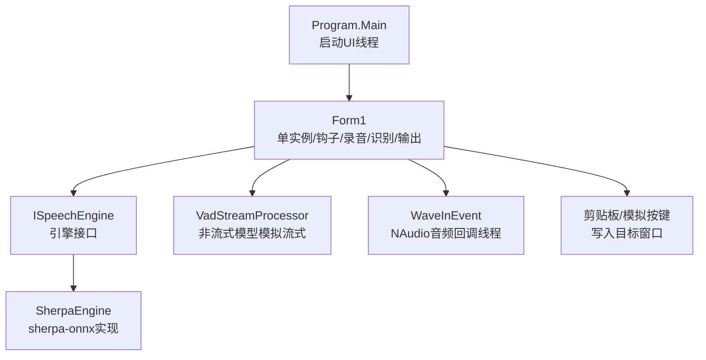
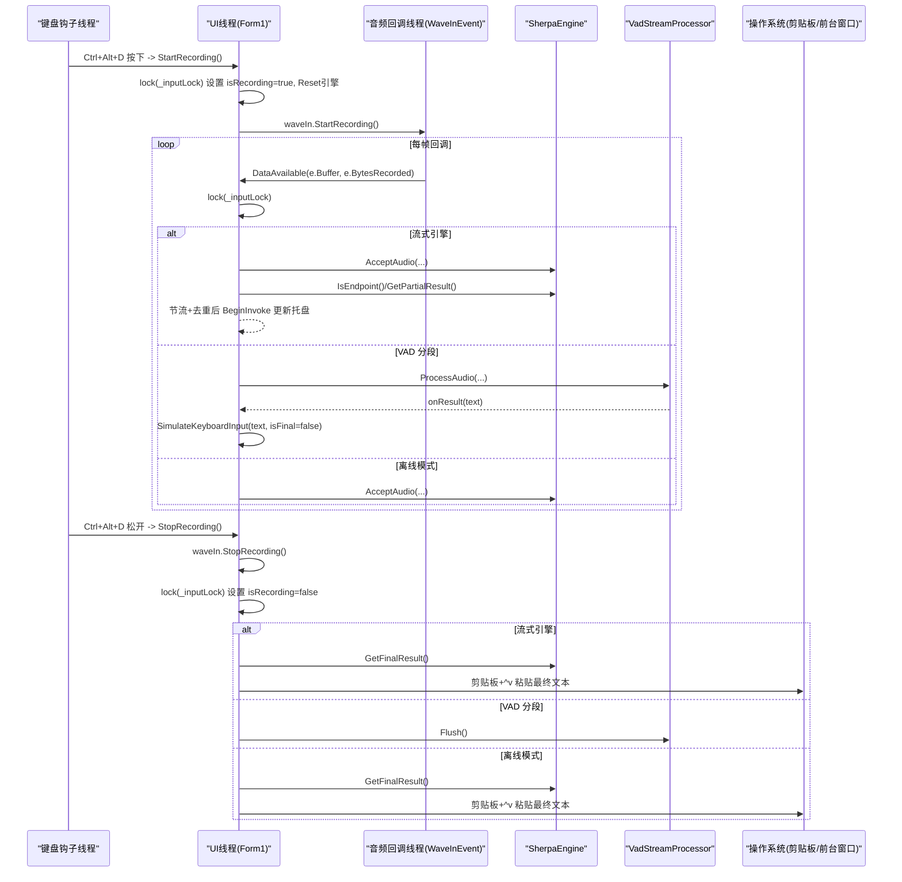
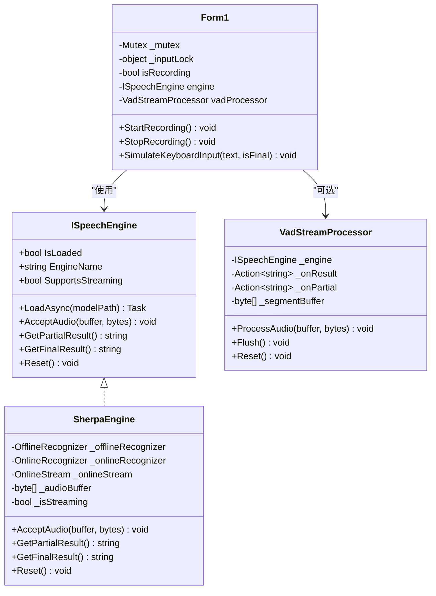
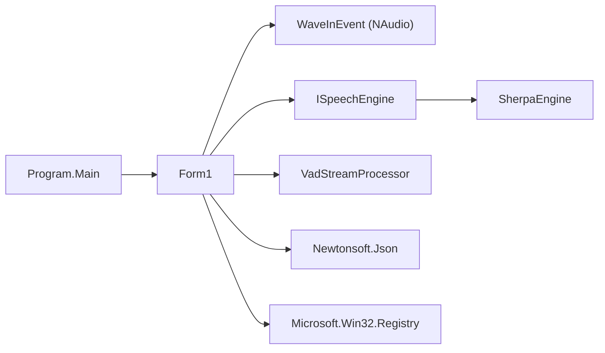

# 线程同步机制

<cite>
**本文引用的文件**   
- [Program.cs](file://t9s2t/Program.cs)
- [Form1.cs](file://t9s2t/Form1.cs)
- [ISpeechEngine.cs](file://t9s2t/Engines/ISpeechEngine.cs)
- [SherpaEngine.cs](file://t9s2t/Engines/SherpaEngine.cs)
- [VadStreamProcessor.cs](file://t9s2t/Engines/VadStreamProcessor.cs)
- [EngineDetector.cs](file://t9s2t/Engines/EngineDetector.cs)
</cite>

## 目录
1. [简介](#简介)
2. [项目结构](#项目结构)
3. [核心组件](#核心组件)
4. [架构总览](#架构总览)
5. [详细组件分析](#详细组件分析)
6. [依赖关系分析](#依赖关系分析)
7. [性能与并发调优](#性能与并发调优)
8. [故障排查指南](#故障排查指南)
9. [结论](#结论)

## 简介
本技术文档聚焦于该语音识别应用中的线程同步机制，围绕以下主题展开：
- 单实例控制：使用全局 Mutex 实现进程级互斥
- 临界区保护：在 UI 线程与音频回调线程之间使用 lock 语句保护共享状态与输入操作
- 音频缓冲区与流式处理：基于 NAudio 的回调线程、引擎内部缓冲与 VAD 分段策略
- 线程安全数据结构：当前代码未使用 ConcurrentQueue 等类型；如需扩展可引入生产者-消费者模式
- 条件变量与事件对象：当前未显式使用 AutoResetEvent/ManualResetEvent；可通过 BeginInvoke 将结果调度回 UI 线程
- 死锁预防与并发优化：避免长耗时操作持有锁、减少锁粒度、合理节流与去重
- 诊断与调试：结合日志、UI 提示与系统工具定位问题

## 项目结构
本项目为 Windows Forms 应用，核心流程如下：
- Program.Main 启动 UI 主线程并运行 Form1
- Form1 负责：
  - 单实例控制（全局 Mutex）
  - 键盘钩子监听快捷键触发录音
  - 初始化麦克风（NAudio.Wave.WaveInEvent）
  - 加载语音识别引擎（sherpa-onnx）
  - 在 DataAvailable 回调中按引擎能力进行流式或离线识别
  - 通过剪贴板+模拟按键将最终文本粘贴到前台窗口
- Engines 层提供引擎抽象与 sherpa-onnx 实现，以及 VAD 分段处理器

图表来源
- [Program.cs:10-24](file://t9s2t/Program.cs#L10-L24)
- [Form1.cs:151-235](file://t9s2t/Form1.cs#L151-L235)
- [ISpeechEngine.cs:8-33](file://t9s2t/Engines/ISpeechEngine.cs#L8-L33)
- [SherpaEngine.cs:14-56](file://t9s2t/Engines/SherpaEngine.cs#L14-L56)
- [VadStreamProcessor.cs:12-33](file://t9s2t/Engines/VadStreamProcessor.cs#L12-L33)

章节来源
- [Program.cs:10-24](file://t9s2t/Program.cs#L10-L24)
- [Form1.cs:151-235](file://t9s2t/Form1.cs#L151-L235)

## 核心组件
- 单实例控制：使用全局命名 Mutex 确保仅一个进程实例运行
- 临界区保护：使用 lock(_inputLock) 保护 isRecording、引擎调用、剪贴板与模拟输入等关键路径
- 音频数据流：
  - WaveInEvent 回调线程高频推送音频帧
  - SherpaEngine 内部维护在线流式流与非流式累积缓冲
  - VadStreamProcessor 对非流式模型做静音检测与分段提交
- UI 交互：通过 BeginInvoke 将部分结果更新到托盘图标，避免阻塞回调线程

章节来源
- [Form1.cs:153-162](file://t9s2t/Form1.cs#L153-L162)
- [Form1.cs:988-1051](file://t9s2t/Form1.cs#L988-L1051)
- [Form1.cs:1064-1111](file://t9s2t/Form1.cs#L1064-L1111)
- [SherpaEngine.cs:351-479](file://t9s2t/Engines/SherpaEngine.cs#L351-L479)
- [VadStreamProcessor.cs:38-136](file://t9s2t/Engines/VadStreamProcessor.cs#L38-L136)

## 架构总览
下图展示了从音频采集到文本输出的完整时序，包括锁的使用点与线程边界。

图表来源
- [Form1.cs:1146-1173](file://t9s2t/Form1.cs#L1146-L1173)
- [Form1.cs:1064-1111](file://t9s2t/Form1.cs#L1064-L1111)
- [Form1.cs:1228-1273](file://t9s2t/Form1.cs#L1228-L1273)
- [SherpaEngine.cs:351-479](file://t9s2t/Engines/SherpaEngine.cs#L351-L479)
- [VadStreamProcessor.cs:38-136](file://t9s2t/Engines/VadStreamProcessor.cs#L38-L136)

## 详细组件分析

### 单实例控制：全局 Mutex
- 实现要点
  - 使用全局命名 Mutex 创建时返回是否新建成功，若失败则激活已有窗口并退出当前进程
  - 在窗体关闭时释放 Mutex，避免进程异常退出导致资源泄漏
- 线程语义
  - 跨进程互斥，保证同一时刻只有一个应用实例运行
- 风险与建议
  - 建议捕获异常并在失败时给出明确提示
  - 注意进程崩溃后的清理策略（如注册表项、临时文件）

章节来源
- [Form1.cs:153-162](file://t9s2t/Form1.cs#L153-L162)
- [Form1.cs:279-288](file://t9s2t/Form1.cs#L279-L288)

### 临界区保护：lock 语句与共享状态
- 受保护的共享状态
  - isRecording：录音开关标志
  - 引擎对象与状态：engine.Reset/AcceptAudio/GetFinalResult 等
  - 剪贴板与模拟输入：Clipboard.SetText、SendKeys.SendWait
- 关键位置
  - StartRecording：进入锁后设置 isRecording=true、重置引擎、启动录音
  - DataAvailable：获取锁后进行双检（double-check），再根据引擎能力分流处理
  - StopRecording：先停止录音设备，再进入锁设置 isRecording=false，并获取最终结果
  - SimulateKeyboardInput：final 文本粘贴前加锁，避免与其他输入竞争
- 设计优点
  - 锁范围尽量小，避免在锁内执行 I/O 或长时间操作
  - 使用 double-check 防止竞态条件下重复开始/结束录音
- 潜在改进
  - 可将“节流+去重”逻辑移出锁外，进一步缩小临界区
  - 对于频繁更新的 partial 文本，建议使用更轻量的原子状态（如 Interlocked 或无锁队列）

章节来源
- [Form1.cs:988-1051](file://t9s2t/Form1.cs#L988-L1051)
- [Form1.cs:1146-1173](file://t9s2t/Form1.cs#L1146-L1173)
- [Form1.cs:1064-1111](file://t9s2t/Form1.cs#L1064-L1111)
- [Form1.cs:1228-1273](file://t9s2t/Form1.cs#L1228-L1273)

### 音频缓冲区管理与流式处理
- 流式模式（Paraformer Online）
  - SherpaEngine 内部维护 _onlineStream，AcceptAudio 将浮点样本送入流
  - GetPartialResult 周期性解码并返回中间结果
  - GetFinalResult 通知输入结束、解码剩余数据、重置流
- 非流式模式（SenseVoice/Paraformer-large）
  - SherpaEngine 内部以 List<byte> 累积音频片段，结束时一次性识别
  - VadStreamProcessor 对非流式模型进行静音检测与分段提交，模拟流式体验
- 静音与端点检测
  - SherpaEngine 内置 RMS 音量阈值与连续静音计数，用于过滤静音段
  - 流式引擎还启用端点检测参数，平衡出字速度与吞字问题
- 线程边界
  - 音频回调线程高频推送数据，需避免在回调中进行重计算或 UI 操作
  - 引擎内部方法应尽量轻量，必要时异步化

章节来源
- [SherpaEngine.cs:351-479](file://t9s2t/Engines/SherpaEngine.cs#L351-L479)
- [VadStreamProcessor.cs:38-136](file://t9s2t/Engines/VadStreamProcessor.cs#L38-L136)

### 线程安全数据结构与生产者-消费者模式
- 现状
  - 当前代码未使用 ConcurrentQueue 等线程安全集合
  - 音频数据直接由回调线程传入引擎或 VAD 处理器，无需额外队列
- 可扩展方案
  - 若未来需要解耦采集与识别，可在两者间引入 ConcurrentQueue<byte[]> 作为环形缓冲
  - 采用生产者-消费者模式：采集线程入队，识别线程出队消费
  - 配合信号量限制队列长度，避免内存暴涨
- 适用场景
  - 高吞吐音频流、多路输入合并、识别延迟敏感场景

[本节为概念性内容，不直接分析具体文件]

### 条件变量与事件对象
- 现状
  - 未显式使用 AutoResetEvent/ManualResetEvent/WaitHandle
  - UI 更新通过 BeginInvoke 调度至 UI 线程，避免跨线程访问控件
- 建议
  - 若需要等待引擎就绪或完成某阶段任务，可使用 ManualResetEventSlim 替代轮询
  - 使用 CancellationTokenSource 管理取消与超时，提升响应性

章节来源
- [Form1.cs:1001-1009](file://t9s2t/Form1.cs#L1001-L1009)

### 类关系图（代码级）

图表来源
- [ISpeechEngine.cs:8-33](file://t9s2t/Engines/ISpeechEngine.cs#L8-L33)
- [SherpaEngine.cs:14-56](file://t9s2t/Engines/SherpaEngine.cs#L14-L56)
- [VadStreamProcessor.cs:12-33](file://t9s2t/Engines/VadStreamProcessor.cs#L12-L33)
- [Form1.cs:988-1051](file://t9s2t/Form1.cs#L988-L1051)

## 依赖关系分析
- 外部库
  - NAudio.Wave：提供 WaveInEvent 音频采集回调
  - Newtonsoft.Json：解析远程模型配置
  - Microsoft.Win32.Registry：开机自启设置
- 内部模块
  - EngineDetector：自动检测模型类型并创建对应引擎
  - SherpaEngine：sherpa-onnx 封装，支持多种模型与流式/离线模式
  - VadStreamProcessor：非流式模型的静音分段与流式模拟

图表来源
- [Program.cs:10-24](file://t9s2t/Program.cs#L10-L24)
- [Form1.cs:151-235](file://t9s2t/Form1.cs#L151-L235)
- [EngineDetector.cs:22-122](file://t9s2t/Engines/EngineDetector.cs#L22-L122)

章节来源
- [EngineDetector.cs:22-122](file://t9s2t/Engines/EngineDetector.cs#L22-L122)

## 性能与并发调优
- 锁粒度与范围
  - 将节流与去重逻辑移至锁外，减少持锁时间
  - 避免在锁内执行网络请求、磁盘 I/O 或复杂计算
- 音频回调优化
  - 在回调中只做必要的数据拷贝与轻量判断，复杂处理放入后台任务
  - 使用固定大小缓冲池减少 GC 压力
- 流式识别参数
  - 调整端点检测阈值与最小静音时长，平衡实时性与稳定性
- UI 更新
  - 使用 BeginInvoke 异步更新 UI，避免阻塞回调线程
  - 对高频更新进行节流（已实现）与去重（已实现）
- 资源管理
  - 确保引擎与音频对象在合适时机释放，避免句柄泄漏

[本节为通用指导，不直接分析具体文件]

## 故障排查指南
- 常见问题
  - 无法启动第二个实例：检查全局 Mutex 名称与异常处理
  - 文本未粘贴或闪烁：确认 SimulateKeyboardInput 的锁范围与 Alt 键状态处理
  - 识别结果丢失：检查 DataAvailable 中的双检逻辑与引擎 Reset 时机
- 诊断步骤
  - 查看 Debug 输出，定位引擎加载与识别错误
  - 观察托盘图标与状态栏提示，辅助判断流式/离线模式行为
  - 使用系统监视器检查 CPU/内存占用，评估回调线程负载
- 调试工具
  - Visual Studio 线程视图：查看回调线程与 UI 线程栈
  - PerfView/ETW：分析热点与锁竞争
  - Sysinternals Tools：监控句柄与线程数变化

章节来源
- [Form1.cs:1011-1051](file://t9s2t/Form1.cs#L1011-L1051)
- [Form1.cs:1064-1111](file://t9s2t/Form1.cs#L1064-L1111)
- [SherpaEngine.cs:351-479](file://t9s2t/Engines/SherpaEngine.cs#L351-L479)

## 结论
该项目在多线程环境下采用了较为稳健的同步策略：
- 使用全局 Mutex 实现单实例控制
- 使用 lock 语句保护关键共享状态与输入操作，避免竞态条件
- 在音频回调线程中保持轻量处理，并通过 BeginInvoke 安全更新 UI
- 针对非流式模型，借助 VAD 分段模拟流式体验，提升用户体验

为进一步增强并发能力与可扩展性，建议在适当场景引入线程安全集合（如 ConcurrentQueue）与事件对象（如 ManualResetEventSlim），并持续优化锁粒度与回调处理路径，以提升整体性能与稳定性。