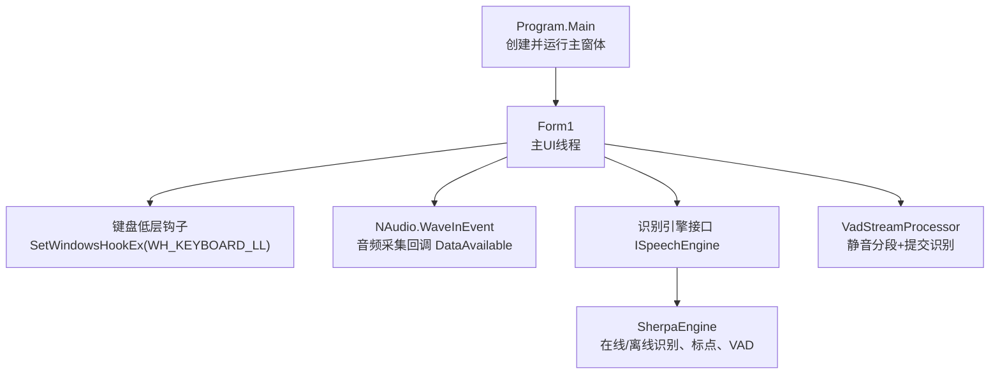
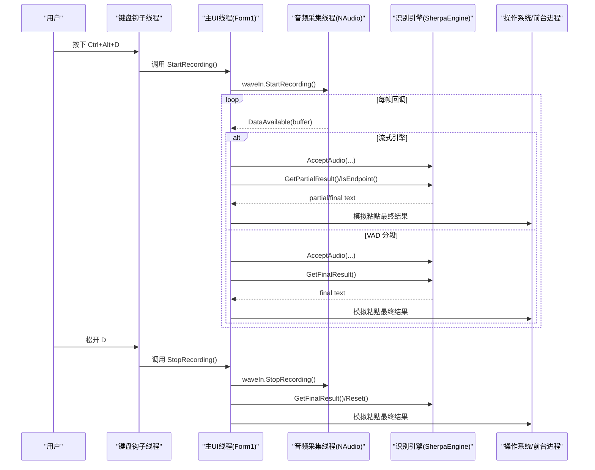
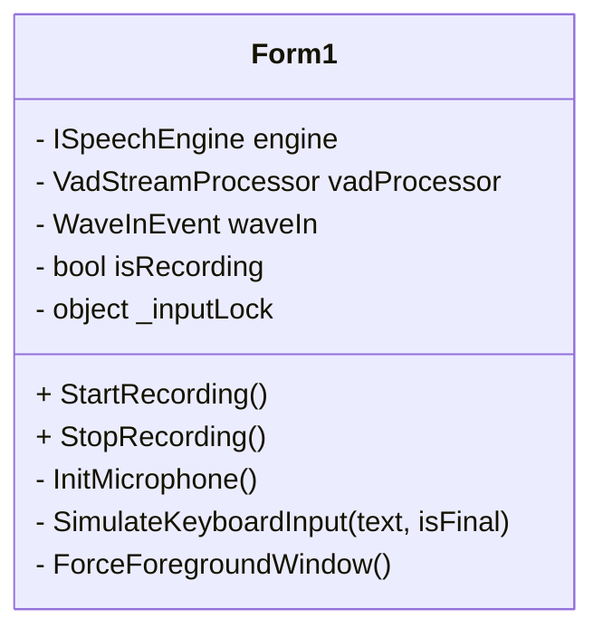
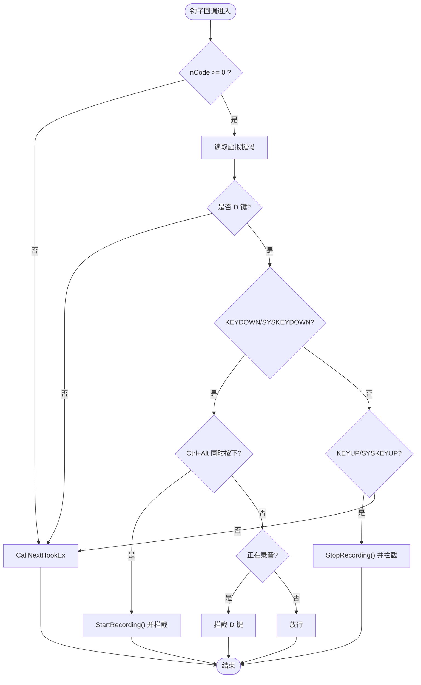
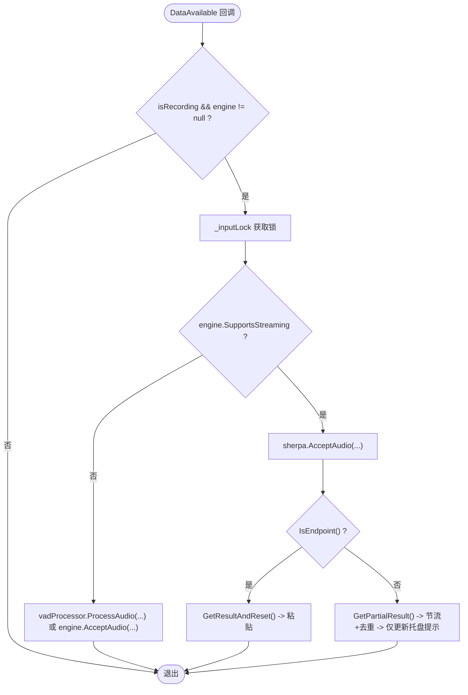
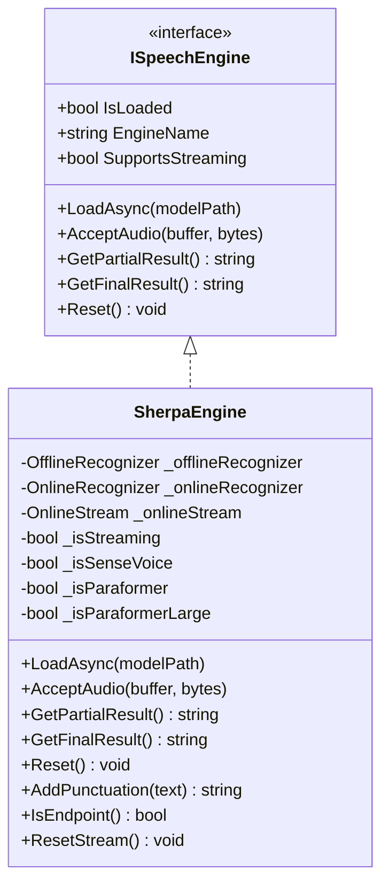
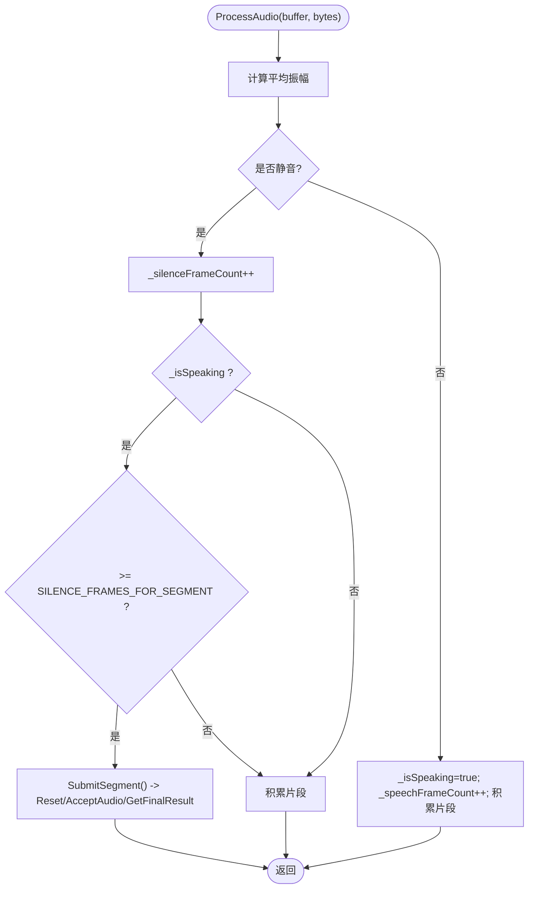
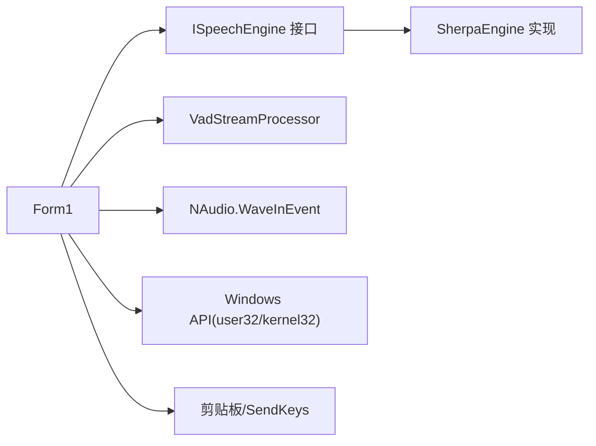

# 线程模型架构

<cite>
**本文引用的文件**   
- [Program.cs](file://t9s2t/Program.cs)
- [Form1.cs](file://t9s2t/Form1.cs)
- [ISpeechEngine.cs](file://t9s2t/Engines/ISpeechEngine.cs)
- [SherpaEngine.cs](file://t9s2t/Engines/SherpaEngine.cs)
- [VadStreamProcessor.cs](file://t9s2t/Engines/VadStreamProcessor.cs)
- [EngineDetector.cs](file://t9s2t/Engines/EngineDetector.cs)
</cite>

## 目录
1. [简介](#简介)
2. [项目结构](#项目结构)
3. [核心组件](#核心组件)
4. [架构总览](#架构总览)
5. [详细组件分析](#详细组件分析)
6. [依赖关系分析](#依赖关系分析)
7. [性能与资源管理](#性能与资源管理)
8. [故障排查指南](#故障排查指南)
9. [结论](#结论)

## 简介
本技术文档聚焦于该语音识别应用的线程模型与并发设计，围绕以下目标展开：
- 主 UI 线程、音频采集线程、键盘钩子线程、识别引擎线程的职责分离与协作机制
- 各线程生命周期管理（启动时机、资源分配、优雅关闭）
- 线程间通信机制（事件驱动、回调函数模式、UI 同步）
- 线程优先级设置与资源竞争处理策略
- 线程状态监控与调试方法（含线程 dump 分析与性能瓶颈定位技巧）

## 项目结构
应用采用 WinForms + NAudio + sherpa-onnx C API 封装的架构。关键入口与线程相关代码集中在 Form1 中，识别引擎通过 ISpeechEngine 抽象接口解耦，具体实现由 SherpaEngine 提供，VAD 流式处理器 VadStreamProcessor 用于非流式模型的“伪流式”体验。

图表来源
- [Program.cs:10-24](file://t9s2t/Program.cs#L10-L24)
- [Form1.cs:144-235](file://t9s2t/Form1.cs#L144-L235)
- [Form1.cs:415-460](file://t9s2t/Form1.cs#L415-L460)
- [Form1.cs:1057-1111](file://t9s2t/Form1.cs#L1057-L1111)
- [ISpeechEngine.cs:8-33](file://t9s2t/Engines/ISpeechEngine.cs#L8-L33)
- [SherpaEngine.cs:14-72](file://t9s2t/Engines/SherpaEngine.cs#L14-L72)
- [VadStreamProcessor.cs:12-33](file://t9s2t/Engines/VadStreamProcessor.cs#L12-L33)

章节来源
- [Program.cs:10-24](file://t9s2t/Program.cs#L10-L24)
- [Form1.cs:144-235](file://t9s2t/Form1.cs#L144-L235)

## 核心组件
- 主 UI 线程（WinForms 消息泵）
  - 负责窗口显示、托盘图标、用户交互、异步任务调度（BeginInvoke/Invoke）
  - 初始化键盘钩子、麦克风、引擎加载与状态更新
- 音频采集线程（NAudio 内部工作线程）
  - 以固定采样率采集 PCM 数据，触发 DataAvailable 回调
  - 在锁保护下将音频送入引擎或 VAD 处理器
- 键盘钩子线程（系统级 WH_KEYBOARD_LL）
  - 拦截 Ctrl+Alt+D 组合键，控制录音启停
  - 在录音期间拦截 D 键输入，避免字符混入
- 识别引擎线程（引擎内部多线程）
  - SherpaEngine 使用 NumThreads 参数配置推理线程数
  - 支持流式与非流式两种路径；部分操作在 Task.Run 中执行以避免阻塞 UI

章节来源
- [Form1.cs:144-235](file://t9s2t/Form1.cs#L144-L235)
- [Form1.cs:415-460](file://t9s2t/Form1.cs#L415-L460)
- [Form1.cs:1057-1111](file://t9s2t/Form1.cs#L1057-L1111)
- [SherpaEngine.cs:57-72](file://t9s2t/Engines/SherpaEngine.cs#L57-L72)
- [SherpaEngine.cs:136-156](file://t9s2t/Engines/SherpaEngine.cs#L136-L156)

## 架构总览
下图展示了从按键到最终文本输入的完整时序，包括 UI 线程、音频采集线程、引擎线程之间的交互。

图表来源
- [Form1.cs:415-460](file://t9s2t/Form1.cs#L415-L460)
- [Form1.cs:1146-1173](file://t9s2t/Form1.cs#L1146-L1173)
- [Form1.cs:1057-1111](file://t9s2t/Form1.cs#L1057-L1111)
- [Form1.cs:1228-1273](file://t9s2t/Form1.cs#L1228-L1273)
- [SherpaEngine.cs:351-479](file://t9s2t/Engines/SherpaEngine.cs#L351-L479)

## 详细组件分析

### 主 UI 线程（Form1）
- 职责
  - 单实例互斥、托盘菜单、开机自启注册
  - 检测并下载引擎 DLL 与模型，动态加载引擎
  - 初始化键盘钩子与麦克风，维护录音状态
  - 通过 BeginInvoke/Invoke 安全更新 UI
- 关键点
  - 使用全局 Mutex 防止多开
  - 使用 _inputLock 保护录音、引擎访问与剪贴板操作的临界区
  - 使用节流与去重减少 partial 结果的 UI 抖动
  - 优雅关闭时释放钩子、麦克风、引擎、托盘图标

图表来源
- [Form1.cs:144-235](file://t9s2t/Form1.cs#L144-L235)
- [Form1.cs:988-1051](file://t9s2t/Form1.cs#L988-L1051)
- [Form1.cs:1057-1111](file://t9s2t/Form1.cs#L1057-L1111)
- [Form1.cs:1146-1173](file://t9s2t/Form1.cs#L1146-L1173)
- [Form1.cs:1228-1273](file://t9s2t/Form1.cs#L1228-L1273)

章节来源
- [Form1.cs:144-235](file://t9s2t/Form1.cs#L144-L235)
- [Form1.cs:988-1051](file://t9s2t/Form1.cs#L988-L1051)
- [Form1.cs:1057-1111](file://t9s2t/Form1.cs#L1057-L1111)
- [Form1.cs:1146-1173](file://t9s2t/Form1.cs#L1146-L1173)
- [Form1.cs:1228-1273](file://t9s2t/Form1.cs#L1228-L1273)

### 键盘钩子线程（WH_KEYBOARD_LL）
- 职责
  - 监听 Ctrl+Alt+D 组合键，开始/停止录音
  - 录音期间拦截 D 键，避免字符输入
- 关键点
  - 使用 SetWindowsHookEx 安装全局钩子
  - 在回调中判断修饰键状态，区分“开始录音”和“普通打字”
  - 返回 (IntPtr)1 拦截按键，否则放行

图表来源
- [Form1.cs:415-460](file://t9s2t/Form1.cs#L415-L460)

章节来源
- [Form1.cs:415-460](file://t9s2t/Form1.cs#L415-L460)

### 音频采集线程（NAudio.WaveInEvent）
- 职责
  - 以 16kHz 单声道采集 PCM 数据
  - 在 DataAvailable 回调中将音频送入引擎或 VAD 处理器
- 关键点
  - 使用 _inputLock 保证与 UI 线程对引擎状态的互斥访问
  - 根据引擎是否支持流式选择不同处理路径
  - 流式模式下按端点分句，非流式模式下累积后一次性识别

图表来源
- [Form1.cs:1057-1111](file://t9s2t/Form1.cs#L1057-L1111)

章节来源
- [Form1.cs:1057-1111](file://t9s2t/Form1.cs#L1057-L1111)

### 识别引擎线程（SherpaEngine）
- 职责
  - 加载模型（SenseVoice、Paraformer、Paraformer-large、流式 Paraformer）
  - 提供 AcceptAudio、GetPartialResult、GetFinalResult、Reset 等接口
  - 可选加载标点恢复与 VAD 模型
- 关键点
  - LoadAsync 使用 Task.Run 避免阻塞 UI
  - 流式路径使用 OnlineRecognizer/OnlineStream，非流式路径使用 OfflineRecognizer
  - 内部使用 NumThreads 控制推理并行度
  - 静音阈值与连续静音计数用于抑制静音段送入模型

图表来源
- [ISpeechEngine.cs:8-33](file://t9s2t/Engines/ISpeechEngine.cs#L8-L33)
- [SherpaEngine.cs:14-72](file://t9s2t/Engines/SherpaEngine.cs#L14-L72)
- [SherpaEngine.cs:351-479](file://t9s2t/Engines/SherpaEngine.cs#L351-L479)
- [SherpaEngine.cs:533-543](file://t9s2t/Engines/SherpaEngine.cs#L533-L543)

章节来源
- [ISpeechEngine.cs:8-33](file://t9s2t/Engines/ISpeechEngine.cs#L8-L33)
- [SherpaEngine.cs:57-72](file://t9s2t/Engines/SherpaEngine.cs#L57-L72)
- [SherpaEngine.cs:351-479](file://t9s2t/Engines/SherpaEngine.cs#L351-L479)
- [SherpaEngine.cs:533-543](file://t9s2t/Engines/SherpaEngine.cs#L533-L543)

### VAD 流式处理器（VadStreamProcessor）
- 职责
  - 基于能量阈值检测静音段落，将积累的语音片段提交给引擎进行识别
  - 为不支持原生流式的模型提供“伪流式”体验
- 关键点
  - 使用 SILENCE_FRAMES_FOR_SEGMENT 控制分段长度
  - 使用 MIN_SPEECH_FRAMES 过滤噪声
  - 提供 Flush 强制提交当前缓冲

图表来源
- [VadStreamProcessor.cs:38-86](file://t9s2t/Engines/VadStreamProcessor.cs#L38-L86)
- [VadStreamProcessor.cs:114-136](file://t9s2t/Engines/VadStreamProcessor.cs#L114-L136)

章节来源
- [VadStreamProcessor.cs:38-86](file://t9s2t/Engines/VadStreamProcessor.cs#L38-L86)
- [VadStreamProcessor.cs:114-136](file://t9s2t/Engines/VadStreamProcessor.cs#L114-L136)

## 依赖关系分析
- 组件耦合
  - Form1 依赖 ISpeechEngine 接口，松耦合便于替换引擎实现
  - SherpaEngine 依赖 sherpa-onnx C API（通过 NuGet 包引入）
  - VadStreamProcessor 依赖 ISpeechEngine，用于非流式模型的流式包装
- 外部依赖
  - NAudio.WaveInEvent 提供音频采集回调
  - Windows 低级键盘钩子（user32.dll）
  - 剪贴板与 SendKeys 用于文本输出

图表来源
- [Form1.cs:1057-1111](file://t9s2t/Form1.cs#L1057-L1111)
- [ISpeechEngine.cs:8-33](file://t9s2t/Engines/ISpeechEngine.cs#L8-L33)
- [SherpaEngine.cs:14-72](file://t9s2t/Engines/SherpaEngine.cs#L14-L72)
- [VadStreamProcessor.cs:12-33](file://t9s2t/Engines/VadStreamProcessor.cs#L12-L33)

章节来源
- [Form1.cs:1057-1111](file://t9s2t/Form1.cs#L1057-L1111)
- [ISpeechEngine.cs:8-33](file://t9s2t/Engines/ISpeechEngine.cs#L8-L33)
- [SherpaEngine.cs:14-72](file://t9s2t/Engines/SherpaEngine.cs#L14-L72)
- [VadStreamProcessor.cs:12-33](file://t9s2t/Engines/VadStreamProcessor.cs#L12-L33)

## 性能与资源管理
- 线程优先级
  - 未显式设置线程优先级。音频采集与键盘钩子由系统驱动与内核调度，识别引擎内部线程数通过 NumThreads 配置
  - 建议：若需降低 UI 卡顿，可在高负载场景适当调整引擎线程数，避免与 UI 抢占 CPU
- 资源竞争与同步
  - 使用 _inputLock 保护 isRecording、引擎方法与剪贴板操作，避免竞态条件
  - 使用 BeginInvoke/Invoke 确保 UI 更新在主线程执行
  - 节流与去重（PartialThrottleMs、_lastDisplayedPartial）降低 UI 刷新频率
- 内存与对象生命周期
  - 引擎 Dispose 释放 Online/Offline Recognizer、Stream、标点与 VAD 模型
  - 录音结束时先 StopRecording，再在锁内完成最后数据处理，避免丢帧
- 网络与磁盘 I/O
  - 模型与引擎 DLL 下载使用 WebClient 异步下载，失败回退本地备用列表
  - 解压与移动目录在 UI 线程异步执行，避免阻塞

章节来源
- [Form1.cs:988-1051](file://t9s2t/Form1.cs#L988-L1051)
- [Form1.cs:1228-1273](file://t9s2t/Form1.cs#L1228-L1273)
- [SherpaEngine.cs:591-605](file://t9s2t/Engines/SherpaEngine.cs#L591-L605)
- [Form1.cs:510-567](file://t9s2t/Form1.cs#L510-L567)

## 故障排查指南
- 常见问题定位
  - 无麦克风：检查 WaveIn.DeviceCount，确认设备可用
  - 引擎未就绪：AreEngineDllsReady 检查 onnxruntime.dll 与 sherpa-onnx-c-api.dll 是否存在且大小 > 0
  - 模型缺失：EngineDetector.Detect 无法识别模型类型时，重新下载模型
  - 键盘钩子失效：确认 SetWindowsHookEx 返回值有效，UnhookWindowsHookEx 在关闭时调用
- 线程与死锁排查
  - 观察 _inputLock 持有时间，避免长时间占用导致 UI 卡顿
  - 使用 Debug.WriteLine 记录关键路径耗时（如 AcceptAudio、GetFinalResult）
  - 使用 Visual Studio 线程窗口查看线程堆栈，定位阻塞点
- 性能瓶颈定位
  - 流式模式：关注 IsEndpoint 触发频率与 GetPartialResult 返回间隔
  - 非流式模式：关注分段长度与提交频率，避免过短导致频繁识别开销
  - 引擎线程数：NumThreads 过高可能导致上下文切换开销增大

章节来源
- [Form1.cs:468-505](file://t9s2t/Form1.cs#L468-L505)
- [Form1.cs:608-642](file://t9s2t/Form1.cs#L608-L642)
- [Form1.cs:1057-1111](file://t9s2t/Form1.cs#L1057-L1111)
- [SherpaEngine.cs:351-479](file://t9s2t/Engines/SherpaEngine.cs#L351-L479)

## 结论
该应用采用清晰的多线程职责划分：主 UI 线程负责协调与展示，音频采集线程负责实时数据捕获，键盘钩子线程负责用户输入拦截，识别引擎线程负责高性能推理。通过接口抽象、锁与回调机制，实现了稳定的线程间通信与资源管理。建议在后续优化中关注引擎线程数与 UI 响应性的平衡，完善异常日志与性能埋点，进一步提升用户体验与可维护性。