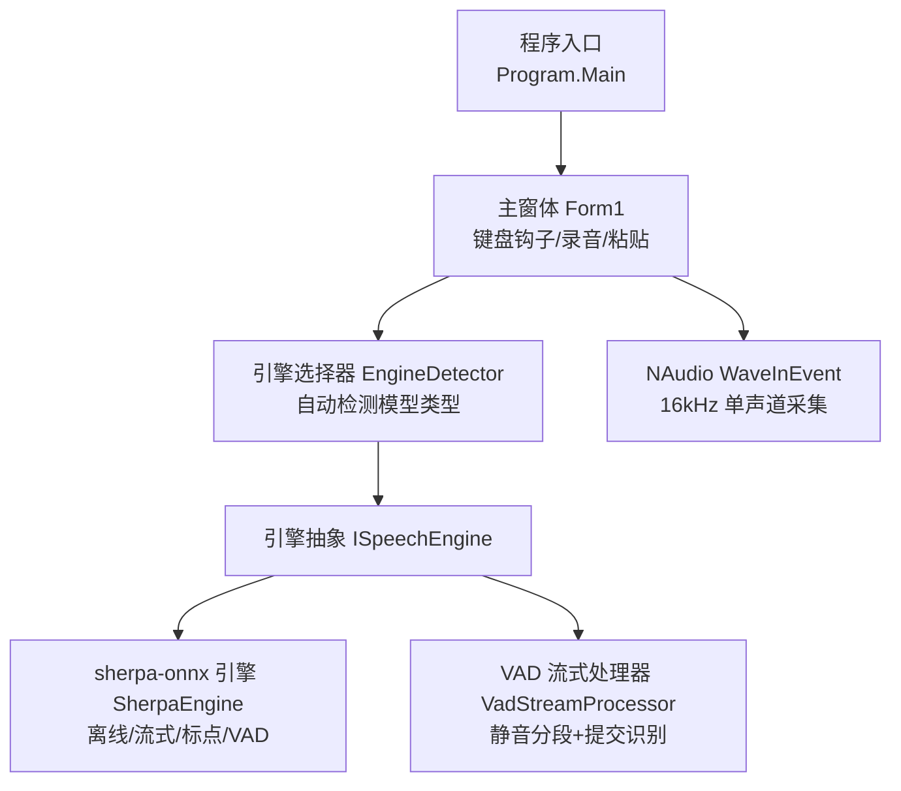
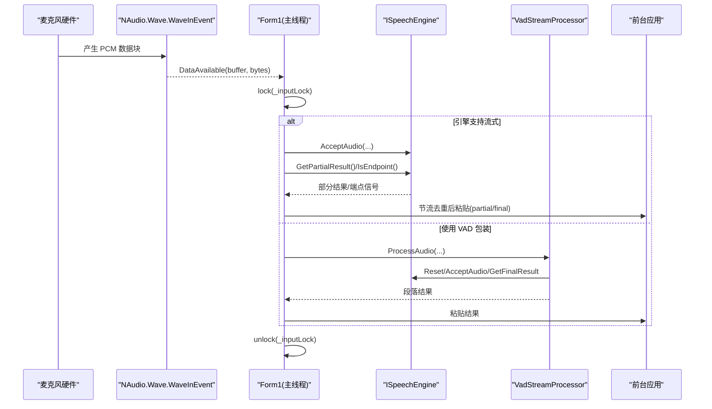
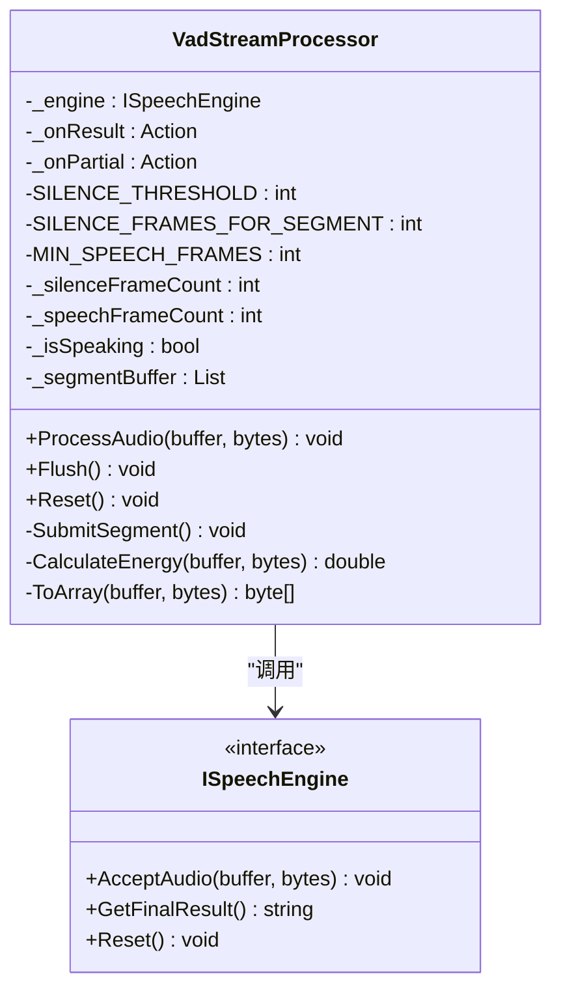
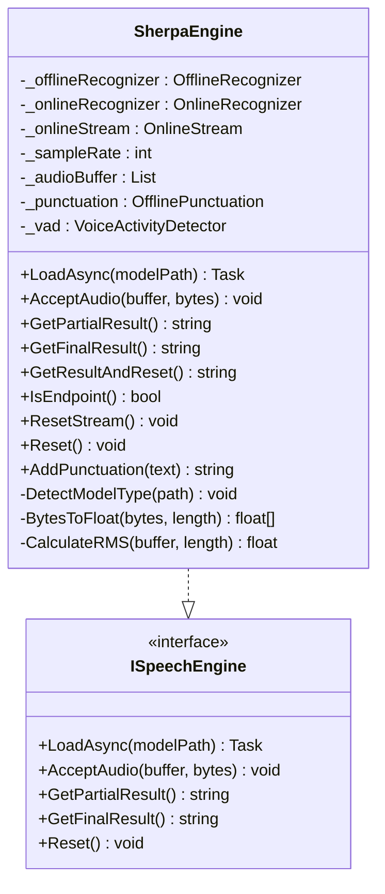
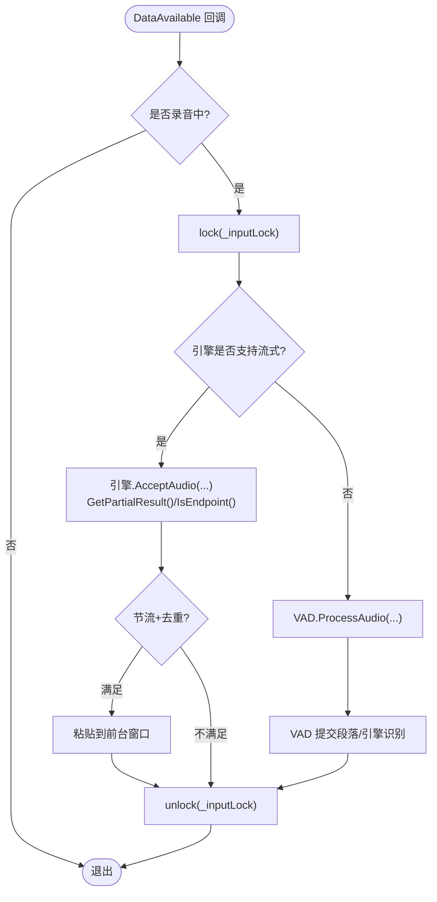
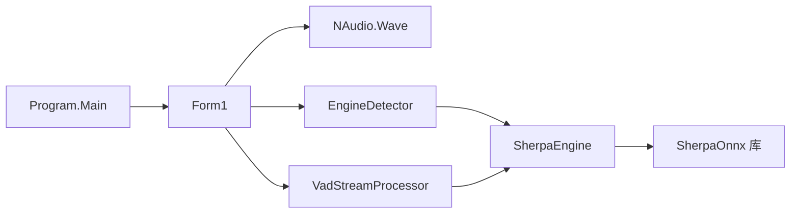

# 音频流并发处理

<cite>
**本文引用的文件**   
- [Program.cs](file://t9s2t/Program.cs)
- [Form1.cs](file://t9s2t/Form1.cs)
- [ISpeechEngine.cs](file://t9s2t/Engines/ISpeechEngine.cs)
- [SherpaEngine.cs](file://t9s2t/Engines/SherpaEngine.cs)
- [VadStreamProcessor.cs](file://t9s2t/Engines/VadStreamProcessor.cs)
- [EngineDetector.cs](file://t9s2t/Engines/EngineDetector.cs)
</cite>

## 目录
1. [简介](#简介)
2. [项目结构](#项目结构)
3. [核心组件](#核心组件)
4. [架构总览](#架构总览)
5. [详细组件分析](#详细组件分析)
6. [依赖关系分析](#依赖关系分析)
7. [性能与实时性](#性能与实时性)
8. [背压、溢出与丢帧策略](#背压溢出与丢帧策略)
9. [监控指标与瓶颈定位](#监控指标与瓶颈定位)
10. [故障排查指南](#故障排查指南)
11. [结论](#结论)

## 简介
本技术文档围绕音频采集、处理与输出的并发流水线展开，重点解析 VAD（语音活动检测）流式处理器的多线程实现、缓冲区管理、背压机制、以及音频质量与性能的平衡策略。文档同时提供延迟优化与实时性保证的最佳实践，并给出可落地的性能监控与瓶颈分析方法。

## 项目结构
本项目采用“UI + 引擎抽象 + 具体引擎实现”的分层设计：
- UI 层负责键盘钩子、录音控制、结果粘贴与状态展示
- 引擎抽象层定义统一的识别接口
- 具体引擎层封装 sherpa-onnx 的离线/流式识别能力，并提供 VAD 模型加载与静音判断
- VAD 流式处理器将非流式模型包装为“类流式”，通过静音分段触发识别

图表来源
- [Program.cs:15-24](file://t9s2t/Program.cs#L15-L24)
- [Form1.cs:1057-1111](file://t9s2t/Form1.cs#L1057-L1111)
- [EngineDetector.cs:27-75](file://t9s2t/Engines/EngineDetector.cs#L27-L75)
- [ISpeechEngine.cs:8-33](file://t9s2t/Engines/ISpeechEngine.cs#L8-L33)
- [SherpaEngine.cs:14-55](file://t9s2t/Engines/SherpaEngine.cs#L14-L55)
- [VadStreamProcessor.cs:12-33](file://t9s2t/Engines/VadStreamProcessor.cs#L12-L33)

章节来源
- [Program.cs:15-24](file://t9s2t/Program.cs#L15-L24)
- [Form1.cs:1057-1111](file://t9s2t/Form1.cs#L1057-L1111)
- [EngineDetector.cs:27-75](file://t9s2t/Engines/EngineDetector.cs#L27-L75)
- [ISpeechEngine.cs:8-33](file://t9s2t/Engines/ISpeechEngine.cs#L8-L33)
- [SherpaEngine.cs:14-55](file://t9s2t/Engines/SherpaEngine.cs#L14-L55)
- [VadStreamProcessor.cs:12-33](file://t9s2t/Engines/VadStreamProcessor.cs#L12-L33)

## 核心组件
- 引擎抽象 ISpeechEngine：统一暴露加载、接受音频、获取部分/最终结果、重置等能力
- sherpa-onnx 引擎 SherpaEngine：支持 SenseVoice、Paraformer（离线/大模型）、流式 Paraformer；内置静音阈值过滤、可选标点恢复与 VAD 模型
- VAD 流式处理器 VadStreamProcessor：对非流式模型进行“类流式”包装，基于能量阈值与连续静音帧数进行分段识别
- 引擎选择器 EngineDetector：根据模型目录结构自动识别引擎类型并创建对应实例
- UI 与采集 Form1：键盘钩子、录音启停、数据回调、节流去重、结果粘贴

章节来源
- [ISpeechEngine.cs:8-33](file://t9s2t/Engines/ISpeechEngine.cs#L8-L33)
- [SherpaEngine.cs:14-55](file://t9s2t/Engines/SherpaEngine.cs#L14-L55)
- [VadStreamProcessor.cs:12-33](file://t9s2t/Engines/VadStreamProcessor.cs#L12-L33)
- [EngineDetector.cs:27-75](file://t9s2t/Engines/EngineDetector.cs#L27-L75)
- [Form1.cs:1057-1111](file://t9s2t/Form1.cs#L1057-L1111)

## 架构总览
整体数据流从 NAudio 采集到引擎识别，再到 UI 粘贴输出。关键路径如下：
- 采集线程：WaveInEvent.DataAvailable 回调中加锁进入处理区
- 分流逻辑：根据引擎是否支持流式，走原生流式或 VAD 包装路径
- 引擎内部：流式模式直接喂入 OnlineStream；非流式模式累积后一次性识别
- 输出：节流去重的 partial 文本与最终结果通过模拟键盘输入到前台窗口

图表来源
- [Form1.cs:1064-1111](file://t9s2t/Form1.cs#L1064-L1111)
- [SherpaEngine.cs:351-479](file://t9s2t/Engines/SherpaEngine.cs#L351-L479)
- [VadStreamProcessor.cs:38-136](file://t9s2t/Engines/VadStreamProcessor.cs#L38-L136)

## 详细组件分析

### 组件一：VAD 流式处理器 VadStreamProcessor
职责与特性
- 将非流式模型包装为“类流式”：检测到静音段落即提交识别，立即返回结果
- 基于简化 RMS 能量阈值与连续静音帧数判定静音段
- 维护一段语音片段缓冲，达到最小语音帧数才提交，避免噪声误触发
- 支持 Flush 强制提交与 Reset 状态清理

并发与内存
- 当前实现为单线程同步处理，无显式环形队列或内存池
- 使用 List<byte> 作为片段缓冲，按帧追加并在提交时转数组
- 每帧计算平均振幅，复杂度 O(n)，n 为样本数

优化建议
- 引入固定容量环形缓冲区替代 List<byte>，减少扩容与拷贝开销
- 预分配字节池（对象池）复用中间数组，降低 GC 压力
- 在高频路径上避免不必要的 Array.Copy，尽量原地切片或零拷贝视图

图表来源
- [VadStreamProcessor.cs:12-160](file://t9s2t/Engines/VadStreamProcessor.cs#L12-L160)
- [ISpeechEngine.cs:8-33](file://t9s2t/Engines/ISpeechEngine.cs#L8-L33)

章节来源
- [VadStreamProcessor.cs:38-136](file://t9s2t/Engines/VadStreamProcessor.cs#L38-L136)
- [VadStreamProcessor.cs:141-159](file://t9s2t/Engines/VadStreamProcessor.cs#L141-L159)

### 组件二：sherpa-onnx 引擎 SherpaEngine
职责与特性
- 自动检测模型类型（SenseVoice、离线 Paraformer、离线 Paraformer-large、流式 Paraformer）
- 流式模式：OnlineRecognizer + OnlineStream，支持端点检测与部分结果
- 非流式模式：OfflineRecognizer，整段识别
- 可选标点恢复（punc.onnx）与 VAD 模型（vad.onnx）加载
- 内置静音阈值过滤，避免长静音送入模型造成幻觉

并发与内存
- 流式模式下直接写入 OnlineStream，非流式模式下使用 List<byte> 累积
- 提供 GetResultAndReset 用于录音中途分句（不结束流）
- 提供 IsEndpoint 与 ResetStream 配合外部控制分句

图表来源
- [SherpaEngine.cs:14-608](file://t9s2t/Engines/SherpaEngine.cs#L14-L608)
- [ISpeechEngine.cs:8-33](file://t9s2t/Engines/ISpeechEngine.cs#L8-L33)

章节来源
- [SherpaEngine.cs:57-115](file://t9s2t/Engines/SherpaEngine.cs#L57-L115)
- [SherpaEngine.cs:351-479](file://t9s2t/Engines/SherpaEngine.cs#L351-L479)
- [SherpaEngine.cs:562-589](file://t9s2t/Engines/SherpaEngine.cs#L562-L589)

### 组件三：引擎选择器 EngineDetector
职责与特性
- 依据模型目录中的文件组合与 tokens.txt 行数区分不同模型
- 提供 Detect、CreateEngine、DetectAndCreate 等方法
- 提供显示名称映射

章节来源
- [EngineDetector.cs:27-75](file://t9s2t/Engines/EngineDetector.cs#L27-L75)
- [EngineDetector.cs:80-104](file://t9s2t/Engines/EngineDetector.cs#L80-L104)
- [EngineDetector.cs:109-119](file://t9s2t/Engines/EngineDetector.cs#L109-L119)

### 组件四：UI 与采集 Form1
职责与特性
- 键盘钩子监听 Ctrl+Alt+D 组合键，启动/停止录音
- 初始化 NAudio 采集：16kHz 单声道 PCM
- 在 DataAvailable 回调中加锁，分流至流式引擎或 VAD 处理器
- 对 partial 结果进行节流（时间间隔）与去重（文本比较），再粘贴到前台窗口
- 停止录音时调用引擎或 VAD 的 Flush/GetFinalResult，确保最后片段被识别

并发与同步
- 使用 lock(_inputLock) 保护录音线程与 UI 线程对共享状态的访问
- 使用 Mutex 实现单实例运行
- 使用 BeginInvoke 异步更新 UI，避免阻塞采集路径

图表来源
- [Form1.cs:1064-1111](file://t9s2t/Form1.cs#L1064-L1111)
- [Form1.cs:987-990](file://t9s2t/Form1.cs#L987-L990)

章节来源
- [Form1.cs:1057-1111](file://t9s2t/Form1.cs#L1057-L1111)
- [Form1.cs:987-990](file://t9s2t/Form1.cs#L987-L990)
- [Form1.cs:1146-1173](file://t9s2t/Form1.cs#L1146-L1173)
- [Form1.cs:1228-1273](file://t9s2t/Form1.cs#L1228-L1273)

## 依赖关系分析
- Program.Main 启动 WinForms 应用
- Form1 依赖 NAudio.Wave 进行采集，依赖引擎抽象与具体实现
- EngineDetector 仅依赖文件系统与调试输出
- SherpaEngine 依赖 SherpaOnnx 库（C API 封装）
- VadStreamProcessor 依赖 ISpeechEngine 接口

图表来源
- [Program.cs:15-24](file://t9s2t/Program.cs#L15-L24)
- [Form1.cs:1057-1111](file://t9s2t/Form1.cs#L1057-L1111)
- [EngineDetector.cs:27-75](file://t9s2t/Engines/EngineDetector.cs#L27-L75)
- [SherpaEngine.cs:14-55](file://t9s2t/Engines/SherpaEngine.cs#L14-L55)
- [VadStreamProcessor.cs:12-33](file://t9s2t/Engines/VadStreamProcessor.cs#L12-L33)

章节来源
- [Program.cs:15-24](file://t9s2t/Program.cs#L15-L24)
- [Form1.cs:1057-1111](file://t9s2t/Form1.cs#L1057-L1111)
- [EngineDetector.cs:27-75](file://t9s2t/Engines/EngineDetector.cs#L27-L75)
- [SherpaEngine.cs:14-55](file://t9s2t/Engines/SherpaEngine.cs#L14-L55)
- [VadStreamProcessor.cs:12-33](file://t9s2t/Engines/VadStreamProcessor.cs#L12-L33)

## 性能与实时性
- 采样率与格式
  - 采集设置为 16kHz 单声道 PCM，兼顾识别精度与带宽/算力消耗
  - 引擎侧 FeatureConfig.SampleRate 同样设为 16kHz，保持端到端一致
- 缓冲区大小与帧粒度
  - 流式模式：以较小帧持续喂入 OnlineStream，结合端点检测与部分结果，降低首字延迟
  - 非流式模式：累积整段后一次识别，适合离线大模型，但延迟较高
- CPU 占用控制
  - 引擎配置 NumThreads 参数限制推理线程数，避免抢占 UI 线程
  - 节流与去重：partial 更新最小间隔 200ms，且仅在文本变化时粘贴，显著降低 UI 与系统输入负载
- 静音过滤
  - 流式模式内建 RMS 阈值与连续静音计数，避免长静音送入模型
  - VAD 处理器基于能量阈值与连续静音帧数分段，减少无效识别

章节来源
- [Form1.cs:1059-1061](file://t9s2t/Form1.cs#L1059-L1061)
- [SherpaEngine.cs:136-153](file://t9s2t/Engines/SherpaEngine.cs#L136-L153)
- [SherpaEngine.cs:229-255](file://t9s2t/Engines/SherpaEngine.cs#L229-L255)
- [SherpaEngine.cs:351-384](file://t9s2t/Engines/SherpaEngine.cs#L351-L384)
- [Form1.cs:987-990](file://t9s2t/Form1.cs#L987-L990)

## 背压、溢出与丢帧策略
现状
- 当前未实现显式的环形队列或背压控制
- 采集回调中直接加锁调用引擎/VAD 处理，若处理耗时较长，可能导致后续帧积压
- 非流式模式下使用 List<byte> 累积，存在增长风险

潜在问题
- 当引擎解码或 VAD 分段识别耗时超过帧间隔，可能引发 UI 卡顿或丢帧
- 长时间说话场景下，非流式模式的 _audioBuffer 持续增长，增加内存与拷贝开销

改进建议
- 引入固定容量环形缓冲区（RingBuffer）与生产者-消费者队列，解耦采集与处理
- 实现背压：当队列长度超过阈值时，丢弃最旧帧或暂停采集，防止溢出
- 针对非流式模式，设置最大累积时长或字节上限，超时/超限则提前提交识别
- 使用对象池复用中间数组，减少 GC 抖动

[本节为通用指导，不直接分析具体文件]

## 监控指标与瓶颈定位
建议采集的关键指标
- 采集侧
  - 帧到达间隔分布（均值/方差）
  - 队列长度与峰值（若引入队列）
- 处理侧
  - 单次 AcceptAudio/ProcessAudio 耗时
  - 引擎 Decode/GetResult 耗时
  - 静音判定与分段频率
- 输出侧
  - partial 粘贴频率与去重命中率
  - 首字延迟（从开始说话到首次粘贴）
  - 端到端延迟（从开始说话到最终结果粘贴）

定位方法
- 在关键路径插入高精度计时（如 Stopwatch），记录各阶段耗时
- 观察 UI 线程是否因锁竞争而阻塞（lock 持有时间）
- 检查引擎线程数与 CPU 占用，必要时调整 NumThreads
- 对比不同模型（SenseVoice vs Paraformer-large）的延迟与准确率

[本节为通用指导，不直接分析具体文件]

## 故障排查指南
常见问题与对策
- 未检测到麦克风
  - 现象：提示“未检测到麦克风”
  - 排查：确认设备数量与默认设备索引
- 引擎 DLL 缺失
  - 现象：按钮变为“下载引擎组件”，状态栏提示缺少组件
  - 排查：检查 onnxruntime.dll 与 sherpa-onnx-c-api.dll 是否存在且大小大于 0
- 模型未找到
  - 现象：提示“模型未找到，请点击下载按钮”
  - 排查：确认 model 目录下存在对应模型文件与 tokens.txt
- 流式识别不出字或频繁断句
  - 现象：partial 极少或过早分句
  - 排查：调整端点规则（Rule1MinTrailingSilence、Rule2MinTrailingSilence、Rule3MinUtteranceLength）
- 静音导致漏字
  - 现象：自然停顿被误判为端点
  - 排查：提高静音阈值或增大 Rule2MinTrailingSilence

章节来源
- [Form1.cs:1058-1061](file://t9s2t/Form1.cs#L1058-L1061)
- [Form1.cs:468-505](file://t9s2t/Form1.cs#L468-L505)
- [Form1.cs:608-642](file://t9s2t/Form1.cs#L608-L642)
- [SherpaEngine.cs:246-255](file://t9s2t/Engines/SherpaEngine.cs#L246-L255)

## 结论
本项目实现了从采集到识别再到输出的完整音频流处理链路，并通过引擎抽象与 VAD 包装器兼容多种模型。当前实现以简单可靠为主，尚未引入环形队列与对象池等高级优化。建议在以下方面持续演进：
- 引入环形缓冲区与对象池，提升吞吐与降低 GC
- 完善背压与丢帧策略，保障高负载下的稳定性
- 细化性能监控与指标埋点，支撑持续调优
- 针对不同模型与场景动态调整端点与静音参数，平衡延迟与准确率

[本节为总结性内容，不直接分析具体文件]