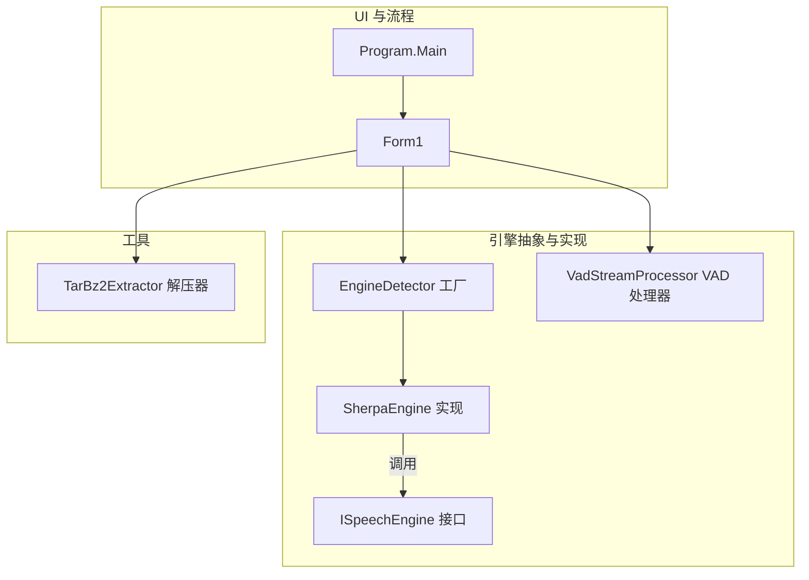
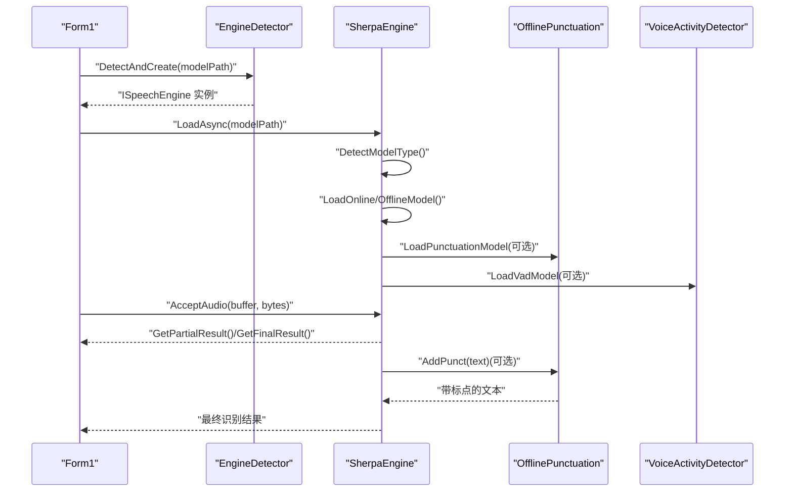
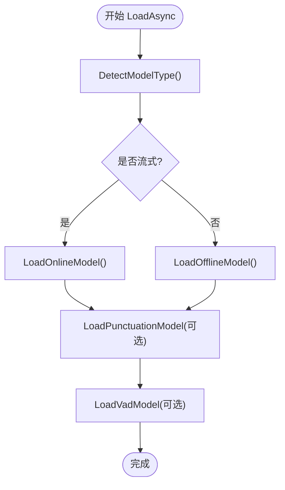
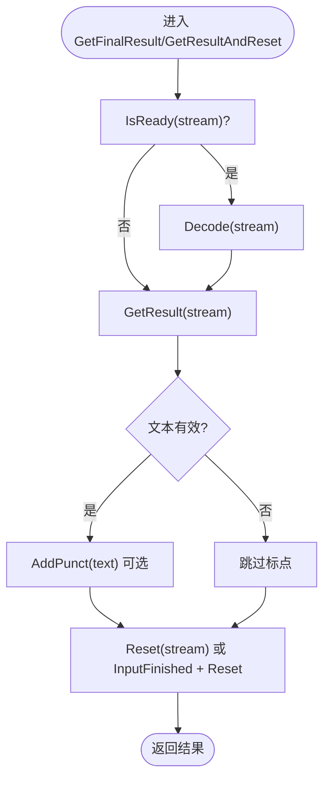
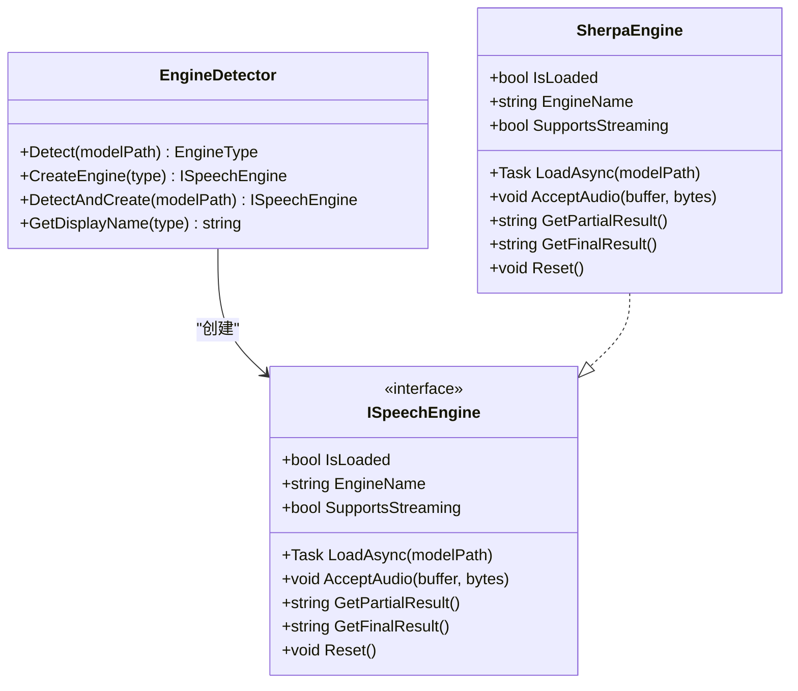
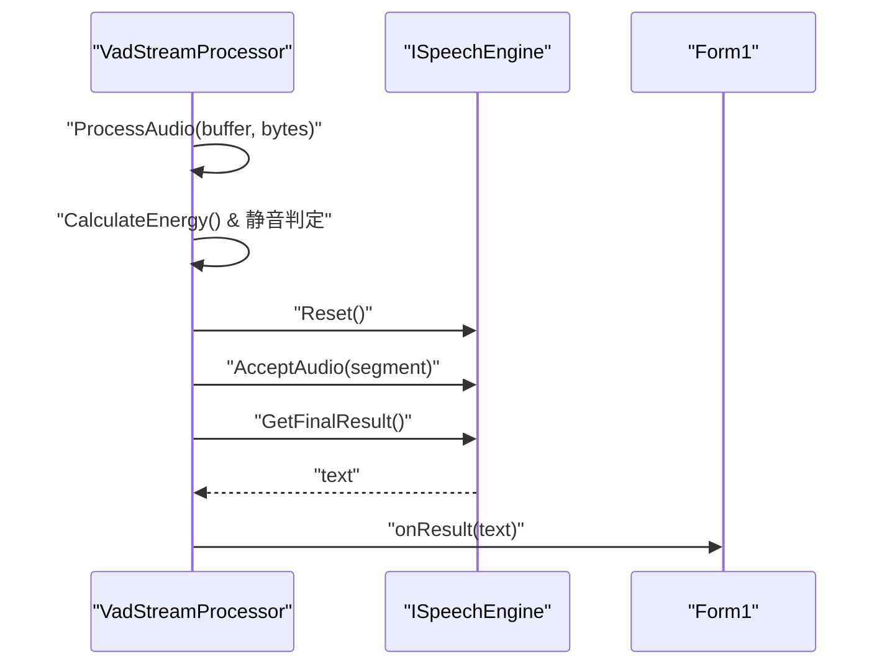
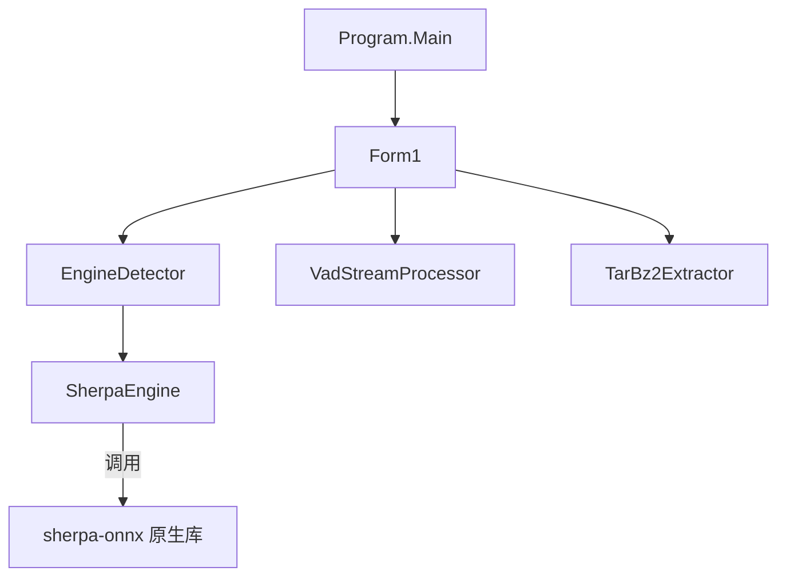

# 引擎性能调优

<cite>
**本文引用的文件列表**
- [SherpaEngine.cs](file://t9s2t/Engines/SherpaEngine.cs)
- [EngineDetector.cs](file://t9s2t/Engines/EngineDetector.cs)
- [ISpeechEngine.cs](file://t9s2t/Engines/ISpeechEngine.cs)
- [VadStreamProcessor.cs](file://t9s2t/Engines/VadStreamProcessor.cs)
- [TarBz2Extractor.cs](file://t9s2t/Engines/TarBz2Extractor.cs)
- [Form1.cs](file://t9s2t/Form1.cs)
- [Program.cs](file://t9s2t/Program.cs)
</cite>

## 目录
1. [简介](#简介)
2. [项目结构](#项目结构)
3. [核心组件](#核心组件)
4. [架构总览](#架构总览)
5. [详细组件分析](#详细组件分析)
6. [依赖关系分析](#依赖关系分析)
7. [性能考量与优化建议](#性能考量与优化建议)
8. [故障排查指南](#故障排查指南)
9. [结论](#结论)
10. [附录：基准测试方法与指标](#附录基准测试方法与指标)

## 简介
本技术文档聚焦于 sherpa-onnx 引擎在本项目中的性能调优，覆盖以下关键主题：
- 初始化优化：模型加载策略、资源预分配与预热机制
- 推理加速：批量处理、模型量化、CPU/GPU 资源分配与线程池配置
- 状态管理优化：Reset() 方法影响、上下文切换开销与内存重用策略
- 多引擎切换：EngineDetector 工厂模式优化、实例缓存与生命周期管理
- 模型版本兼容性与性能权衡：不同模型大小对识别精度与速度的影响
- 性能监控指标与调优参数配置指南
- 性能测试方法与基准对比结果（含可执行步骤）

## 项目结构
本项目采用分层组织方式：
- 引擎抽象层：ISpeechEngine 定义统一接口
- 引擎实现层：SherpaEngine 封装 sherpa-onnx 的离线/流式识别能力
- 引擎检测与工厂：EngineDetector 自动识别模型类型并创建对应引擎实例
- 辅助组件：VadStreamProcessor 为非流式模型提供“类流式”体验；TarBz2Extractor 负责模型包解压
- UI 与流程控制：Form1 负责模型下载、引擎加载、录音与输出；Program 为应用入口

图表来源
- [Program.cs:1-27](file://t9s2t/Program.cs#L1-L27)
- [Form1.cs:1-200](file://t9s2t/Form1.cs#L1-L200)
- [ISpeechEngine.cs:1-35](file://t9s2t/Engines/ISpeechEngine.cs#L1-L35)
- [SherpaEngine.cs:1-120](file://t9s2t/Engines/SherpaEngine.cs#L1-L120)
- [EngineDetector.cs:1-122](file://t9s2t/Engines/EngineDetector.cs#L1-L122)
- [VadStreamProcessor.cs:1-162](file://t9s2t/Engines/VadStreamProcessor.cs#L1-L162)
- [TarBz2Extractor.cs:1-143](file://t9s2t/Engines/TarBz2Extractor.cs#L1-L143)

章节来源
- [Program.cs:1-27](file://t9s2t/Program.cs#L1-L27)
- [Form1.cs:1-200](file://t9s2t/Form1.cs#L1-L200)

## 核心组件
- ISpeechEngine：定义统一的语音识别引擎接口，包括异步加载、音频输入、部分/最终结果获取、重置等。
- SherpaEngine：sherpa-onnx 的具体实现，支持 SenseVoice、离线 Paraformer、流式 Paraformer，以及可选标点恢复与 VAD。
- EngineDetector：根据模型目录结构自动识别引擎类型并创建相应引擎实例。
- VadStreamProcessor：通过静音检测将非流式模型模拟为流式识别，提升交互体验。
- TarBz2Extractor：跨平台解压 tar.bz2/tar.gz/zip 等格式，无需外部工具。

章节来源
- [ISpeechEngine.cs:1-35](file://t9s2t/Engines/ISpeechEngine.cs#L1-L35)
- [SherpaEngine.cs:1-120](file://t9s2t/Engines/SherpaEngine.cs#L1-L120)
- [EngineDetector.cs:1-122](file://t9s2t/Engines/EngineDetector.cs#L1-L122)
- [VadStreamProcessor.cs:1-162](file://t9s2t/Engines/VadStreamProcessor.cs#L1-L162)
- [TarBz2Extractor.cs:1-143](file://t9s2t/Engines/TarBz2Extractor.cs#L1-L143)

## 架构总览
下图展示了从 UI 到引擎的核心调用链与数据流，涵盖模型检测、引擎创建、音频输入、识别结果返回与标点恢复。

图表来源
- [Form1.cs:645-721](file://t9s2t/Form1.cs#L645-L721)
- [EngineDetector.cs:100-104](file://t9s2t/Engines/EngineDetector.cs#L100-L104)
- [SherpaEngine.cs:57-72](file://t9s2t/Engines/SherpaEngine.cs#L57-L72)
- [SherpaEngine.cs:259-290](file://t9s2t/Engines/SherpaEngine.cs#L259-L290)
- [SherpaEngine.cs:314-347](file://t9s2t/Engines/SherpaEngine.cs#L314-L347)
- [SherpaEngine.cs:351-479](file://t9s2t/Engines/SherpaEngine.cs#L351-L479)

## 详细组件分析

### SherpaEngine 初始化与加载优化
- 模型类型检测：优先检查 encoder/decoder 或 model.onnx/int8.onnx，并通过 tokens.txt 行数区分 SenseVoice 与离线 Paraformer-large。
- 并行化加载：LoadAsync 使用 Task.Run 在后台线程完成 DetectModelType、模型加载、标点与 VAD 模型加载，避免阻塞 UI。
- 量化优先：离线 Paraformer-large 优先选择 model.int8.onnx，回退到 fp32，以减小体积并提升速度。
- 线程数配置：各识别器与标点模型的 NumThreads 显式设置（如 4、2），便于在多核 CPU 上获得更好吞吐。
- 端点检测参数：流式模式下启用端点检测，合理设置 Rule1MinTrailingSilence、Rule2MinTrailingSilence、Rule3MinUtteranceLength，平衡出字速度与误触发。

图表来源
- [SherpaEngine.cs:57-72](file://t9s2t/Engines/SherpaEngine.cs#L57-L72)
- [SherpaEngine.cs:74-115](file://t9s2t/Engines/SherpaEngine.cs#L74-L115)
- [SherpaEngine.cs:119-216](file://t9s2t/Engines/SherpaEngine.cs#L119-L216)
- [SherpaEngine.cs:220-255](file://t9s2t/Engines/SherpaEngine.cs#L220-L255)
- [SherpaEngine.cs:259-290](file://t9s2t/Engines/SherpaEngine.cs#L259-L290)
- [SherpaEngine.cs:314-347](file://t9s2t/Engines/SherpaEngine.cs#L314-L347)

章节来源
- [SherpaEngine.cs:57-115](file://t9s2t/Engines/SherpaEngine.cs#L57-L115)
- [SherpaEngine.cs:119-216](file://t9s2t/Engines/SherpaEngine.cs#L119-L216)
- [SherpaEngine.cs:220-255](file://t9s2t/Engines/SherpaEngine.cs#L220-L255)
- [SherpaEngine.cs:259-290](file://t9s2t/Engines/SherpaEngine.cs#L259-L290)
- [SherpaEngine.cs:314-347](file://t9s2t/Engines/SherpaEngine.cs#L314-L347)

### 推理加速与资源分配
- 模型量化：优先使用 .int8.onnx 模型，减少内存占用与计算量，提高推理速度。
- 线程池配置：
  - OfflineRecognizer/OnlineRecognizer 的 NumThreads 设置为 4，适合多数桌面 CPU。
  - OfflinePunctuation 的 NumThreads 设置为 2，降低与主识别任务的竞争。
  - VAD 的 NumThreads 设置为 1，避免额外线程开销。
- 流式端点检测：合理阈值避免说话中停顿导致的误触发，减少 left context 丢失。
- 静音过滤：RMS 音量阈值用于跳过纯静音片段，减少无效推理。

章节来源
- [SherpaEngine.cs:159-188](file://t9s2t/Engines/SherpaEngine.cs#L159-L188)
- [SherpaEngine.cs:220-255](file://t9s2t/Engines/SherpaEngine.cs#L220-L255)
- [SherpaEngine.cs:259-290](file://t9s2t/Engines/SherpaEngine.cs#L259-L290)
- [SherpaEngine.cs:314-347](file://t9s2t/Engines/SherpaEngine.cs#L314-L347)
- [SherpaEngine.cs:351-384](file://t9s2t/Engines/SherpaEngine.cs#L351-L384)

### 状态管理与 Reset 优化
- Reset() 行为：清理非流式音频缓冲、重置静音计数、重置在线流与 VAD 状态，确保下一轮录音无残留上下文。
- GetResultAndReset()：在不通知 InputFinished 的情况下获取当前结果并重置 stream，适用于录音中分句场景。
- 内存重用策略：
  - 非流式模式使用 List<byte> 累积音频，识别后 Clear() 释放引用，避免频繁 GC。
  - 流式模式复用 OnlineStream，仅在必要时 Reset()，减少对象创建开销。

图表来源
- [SherpaEngine.cs:388-479](file://t9s2t/Engines/SherpaEngine.cs#L388-L479)
- [SherpaEngine.cs:485-509](file://t9s2t/Engines/SherpaEngine.cs#L485-L509)
- [SherpaEngine.cs:533-543](file://t9s2t/Engines/SherpaEngine.cs#L533-L543)

章节来源
- [SherpaEngine.cs:388-509](file://t9s2t/Engines/SherpaEngine.cs#L388-L509)
- [SherpaEngine.cs:533-543](file://t9s2t/Engines/SherpaEngine.cs#L533-L543)

### 多引擎切换与工厂模式优化
- EngineDetector.Detect：基于目录结构与 tokens.txt 行数判断引擎类型，避免硬编码路径。
- CreateEngine：根据类型返回对应的 SherpaEngine 实例（流式或非流式）。
- DetectAndCreate：一步到位的检测+创建，简化上层调用。
- 显示名称：GetDisplayName 提供用户友好的引擎名。

图表来源
- [EngineDetector.cs:27-104](file://t9s2t/Engines/EngineDetector.cs#L27-L104)
- [ISpeechEngine.cs:1-35](file://t9s2t/Engines/ISpeechEngine.cs#L1-L35)
- [SherpaEngine.cs:14-55](file://t9s2t/Engines/SherpaEngine.cs#L14-L55)

章节来源
- [EngineDetector.cs:27-104](file://t9s2t/Engines/EngineDetector.cs#L27-L104)
- [ISpeechEngine.cs:1-35](file://t9s2t/Engines/ISpeechEngine.cs#L1-L35)
- [SherpaEngine.cs:14-55](file://t9s2t/Engines/SherpaEngine.cs#L14-L55)

### 非流式模型的“类流式”体验
- VadStreamProcessor 通过能量阈值与连续静音帧数判定语音段落，达到近似流式的分段识别效果。
- 提交段落后调用引擎 Reset() 与 AcceptAudio()，再 GetFinalResult()，并将结果回调给 UI。
- 该方案适用于 SenseVoice 等非流式模型，提升实时性体验。

图表来源
- [VadStreamProcessor.cs:38-136](file://t9s2t/Engines/VadStreamProcessor.cs#L38-L136)
- [Form1.cs:665-691](file://t9s2t/Form1.cs#L665-L691)

章节来源
- [VadStreamProcessor.cs:38-136](file://t9s2t/Engines/VadStreamProcessor.cs#L38-L136)
- [Form1.cs:665-691](file://t9s2t/Form1.cs#L665-L691)

### 模型版本兼容性与性能权衡
- 模型类型识别：
  - 流式 Paraformer：存在 encoder.int8.onnx 与 decoder.int8.onnx
  - 离线 Paraformer-large：存在 model.onnx/int8.onnx，且 tokens.txt 行数 < 15000
  - SenseVoice：存在 model.onnx/int8.onnx，tokens.txt 行数较大
  - 非流式 Paraformer：仅存在 encoder.onnx/int8.onnx
- 性能权衡：
  - int8 量化模型更小更快，但可能略降精度
  - 大模型（Paraformer-large）通常具备更高中文识别质量，但体积更大、首字延迟略高
  - 流式模式适合低延迟交互，非流式模式适合整段高质量识别

章节来源
- [EngineDetector.cs:27-75](file://t9s2t/Engines/EngineDetector.cs#L27-L75)
- [SherpaEngine.cs:74-115](file://t9s2t/Engines/SherpaEngine.cs#L74-L115)

## 依赖关系分析
- UI 层（Form1）依赖 EngineDetector 进行模型检测与引擎创建，依赖 SherpaEngine 进行识别，依赖 VadStreamProcessor 提供类流式体验，依赖 TarBz2Extractor 解压模型包。
- SherpaEngine 依赖 sherpa-onnx 原生库（OfflineRecognizer、OnlineRecognizer、OfflinePunctuation、VoiceActivityDetector）。
- 程序入口 Program 设置 TLS 协议并启动 UI。

图表来源
- [Program.cs:1-27](file://t9s2t/Program.cs#L1-L27)
- [Form1.cs:1-200](file://t9s2t/Form1.cs#L1-L200)
- [EngineDetector.cs:1-122](file://t9s2t/Engines/EngineDetector.cs#L1-L122)
- [SherpaEngine.cs:1-120](file://t9s2t/Engines/SherpaEngine.cs#L1-L120)
- [VadStreamProcessor.cs:1-162](file://t9s2t/Engines/VadStreamProcessor.cs#L1-L162)
- [TarBz2Extractor.cs:1-143](file://t9s2t/Engines/TarBz2Extractor.cs#L1-L143)

章节来源
- [Program.cs:1-27](file://t9s2t/Program.cs#L1-L27)
- [Form1.cs:1-200](file://t9s2t/Form1.cs#L1-L200)

## 性能考量与优化建议
- 初始化优化
  - 使用后台线程加载模型（已实现），避免 UI 卡顿
  - 优先加载 int8 量化模型，减少内存与计算开销
  - 合理设置线程数：识别器 4 线程、标点 2 线程、VAD 1 线程
- 推理加速
  - 流式模式开启端点检测，调整静音阈值与最小语句长度，降低误触发
  - 非流式模式使用 RMS 静音过滤，跳过无效片段
  - 考虑批处理：若上游音频源允许，合并小片段以减少 Decode 调用次数
- 状态管理
  - 合理使用 Reset() 与 GetResultAndReset()，避免不必要的 InputFinished 导致上下文丢失
  - 复用 OnlineStream，减少对象创建与销毁开销
- 多引擎切换
  - 使用 EngineDetector 工厂模式，避免重复检测逻辑
  - 考虑在进程内缓存引擎实例（按模型路径键控），避免重复加载
- 模型选择
  - 追求低延迟：优先流式 Paraformer
  - 追求中文质量：优先离线 Paraformer-large（int8）
  - 多语言需求：SenseVoice（注意词汇表规模对加载时间的影响）

[本节为通用指导，不直接分析具体文件]

## 故障排查指南
- 模型未找到或无法识别
  - 检查模型目录是否存在必要的 onnx 与 tokens.txt 文件
  - 确认 EngineDetector 能正确识别类型
- 引擎 DLL 缺失
  - 检查 onnxruntime.dll 与 sherpa-onnx-c-api.dll 是否存在且大小 > 0
  - 使用内置备用配置重新下载
- 标点或 VAD 加载失败
  - 查看调试输出，确认 punc.onnx/vad.onnx 路径与权限
- 流式端点误触发
  - 调整 Rule1MinTrailingSilence、Rule2MinTrailingSilence、Rule3MinUtteranceLength
- 静音过滤过于激进
  - 调整 SilenceThreshold 或静音帧计数阈值

章节来源
- [EngineDetector.cs:27-75](file://t9s2t/Engines/EngineDetector.cs#L27-L75)
- [Form1.cs:468-567](file://t9s2t/Form1.cs#L468-L567)
- [SherpaEngine.cs:259-290](file://t9s2t/Engines/SherpaEngine.cs#L259-L290)
- [SherpaEngine.cs:314-347](file://t9s2t/Engines/SherpaEngine.cs#L314-L347)
- [SherpaEngine.cs:351-384](file://t9s2t/Engines/SherpaEngine.cs#L351-L384)

## 结论
本项目通过清晰的抽象与工厂模式，实现了 sherpa-onnx 的多模型支持与灵活的流式/非流式识别。在性能方面，已实现后台加载、量化优先、线程数配置与静音过滤等优化手段。进一步可在批处理、引擎实例缓存与更精细的端点参数调优上持续改进，以获得更好的延迟与吞吐表现。

[本节为总结，不直接分析具体文件]

## 附录：基准测试方法与指标
以下为可执行的基准测试步骤与指标建议，帮助评估不同模型与配置的差异：

- 测试环境准备
  - 固定硬件与操作系统版本
  - 关闭无关后台任务，确保 CPU 频率稳定
  - 准备标准音频数据集（包含短句、长句、含静音片段）
- 指标定义
  - 首字延迟（FRTT）：从开始录音到第一个文字输出的时间
  - 端到端延迟（E2E）：从录音结束到最终结果返回的时间
  - 吞吐量（TPS）：单位时间内处理的音频时长
  - 资源占用：CPU 使用率、内存峰值
- 测试用例
  - 模型对比：SenseVoice vs Paraformer-large（int8/fp32）vs 流式 Paraformer
  - 线程数对比：NumThreads=2/4/8 对延迟与吞吐的影响
  - 端点参数对比：不同 Rule1/Rule2/Rule3 组合对误触发与延迟的影响
  - 标点开关对比：开启/关闭标点恢复对 E2E 的影响
- 数据采集
  - 使用 Stopwatch 或高精度计时器记录关键阶段耗时
  - 使用系统性能计数器采集 CPU/内存指标
  - 多次运行取均值与方差，排除异常值
- 结果呈现
  - 表格对比不同模型的 FRTT/E2E/TPS/CPU/内存
  - 折线图展示端点参数对延迟的影响
  - 柱状图展示线程数对吞吐量的影响

[本节为方法论指导，不直接分析具体文件]