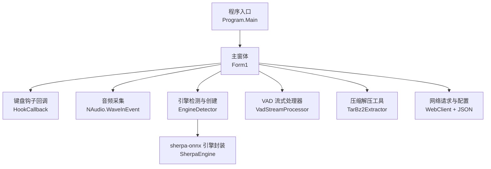
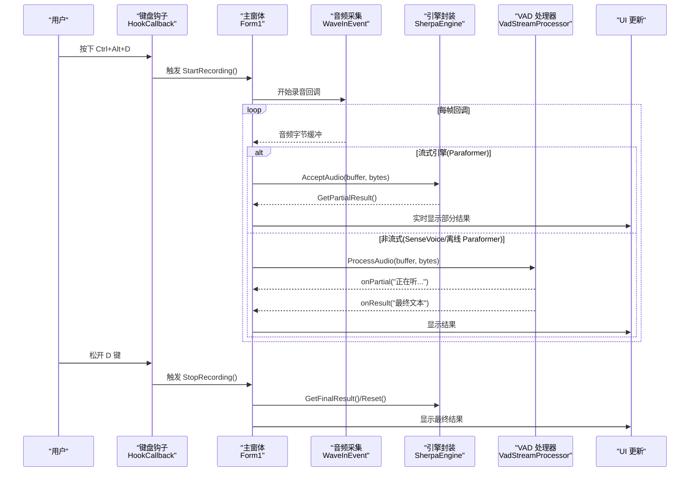
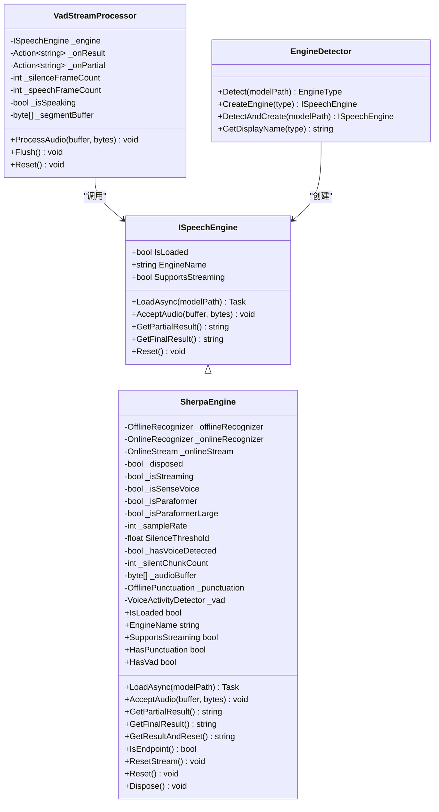
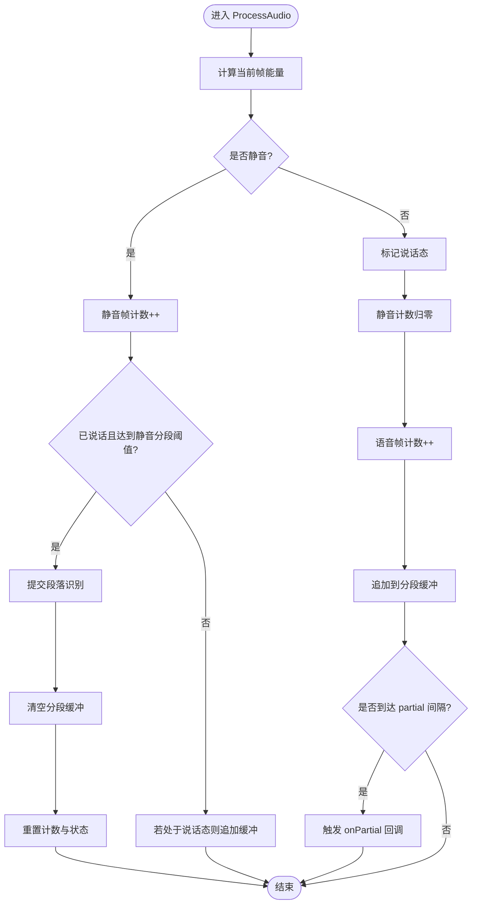
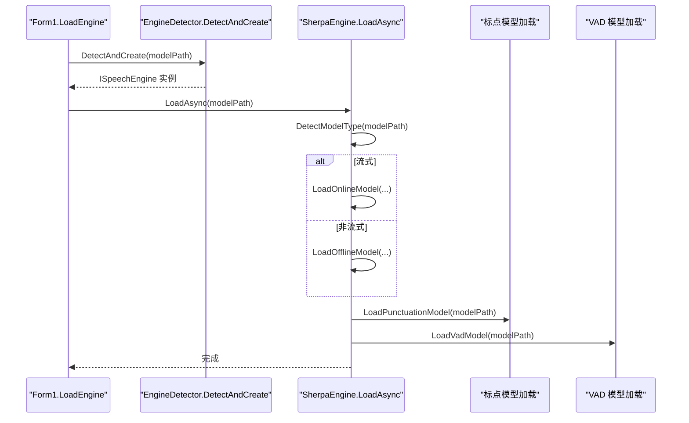
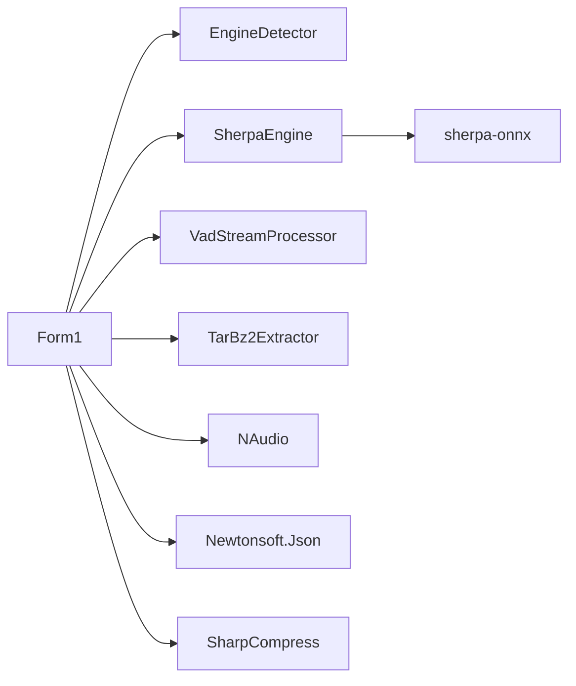

# 性能优化

<cite>
**本文引用的文件**   
- [Program.cs](file://t9s2t/Program.cs)
- [Form1.cs](file://t9s2t/Form1.cs)
- [ISpeechEngine.cs](file://t9s2t/Engines/ISpeechEngine.cs)
- [SherpaEngine.cs](file://t9s2t/Engines/SherpaEngine.cs)
- [VadStreamProcessor.cs](file://t9s2t/Engines/VadStreamProcessor.cs)
- [EngineDetector.cs](file://t9s2t/Engines/EngineDetector.cs)
- [TarBz2Extractor.cs](file://t9s2t/Engines/TarBz2Extractor.cs)
- [t9s2t.csproj](file://t9s2t/t9s2t.csproj)
</cite>

## 目录
1. [简介](#简介)
2. [项目结构](#项目结构)
3. [核心组件](#核心组件)
4. [架构总览](#架构总览)
5. [详细组件分析](#详细组件分析)
6. [依赖关系分析](#依赖关系分析)
7. [性能考量与调优建议](#性能考量与调优建议)
8. [故障排查指南](#故障排查指南)
9. [结论](#结论)
10. [附录：基准测试方法与示例](#附录：基准测试方法与示例)

## 简介
本技术文档聚焦于该语音识别桌面应用的性能优化，覆盖内存管理、多线程与异步模式、音频流处理、语音识别引擎调优、I/O 优化、监控指标收集以及基准测试方法。文档基于仓库中的实际源码进行分析，并提供可落地的调优建议与实践。

## 项目结构
该项目为 Windows 桌面应用（WinForms），采用 C#/.NET Framework 4.8 构建，核心功能包括：
- 键盘钩子监听快捷键触发录音
- 使用 NAudio 采集麦克风音频
- 通过 sherpa-onnx 进行离线或流式语音识别
- 可选 VAD 分段模拟流式输出
- 动态下载并解压模型与运行时 DLL
- 托盘常驻与 UI 交互

图表来源
- [Program.cs:15-24](file://t9s2t/Program.cs#L15-L24)
- [Form1.cs:151-235](file://t9s2t/Form1.cs#L151-L235)
- [EngineDetector.cs:27-104](file://t9s2t/Engines/EngineDetector.cs#L27-L104)
- [SherpaEngine.cs:57-72](file://t9s2t/Engines/SherpaEngine.cs#L57-L72)
- [VadStreamProcessor.cs:28-33](file://t9s2t/Engines/VadStreamProcessor.cs#L28-L33)
- [TarBz2Extractor.cs:22-25](file://t9s2t/Engines/TarBz2Extractor.cs#L22-L25)

章节来源
- [Program.cs:15-24](file://t9s2t/Program.cs#L15-L24)
- [Form1.cs:151-235](file://t9s2t/Form1.cs#L151-L235)
- [t9s2t.csproj:11-17](file://t9s2t/t9s2t.csproj#L11-L17)

## 核心组件
- ISpeechEngine：统一识别接口，定义加载、输入、结果获取与重置等能力。
- SherpaEngine：sherpa-onnx 的封装，支持 SenseVoice、Paraformer（离线/大模型）、Paraformer（流式）；内置静音阈值控制、标点恢复与 VAD 模型加载。
- VadStreamProcessor：对非流式模型进行“静音分段”以模拟流式体验。
- EngineDetector：根据模型目录结构自动识别引擎类型并创建对应实例。
- TarBz2Extractor：跨平台解压 tar.bz2 / zip / tar.gz 等格式。
- Form1：UI 与业务编排，负责键盘钩子、录音流程、引擎生命周期、资源下载与解压、状态提示等。

章节来源
- [ISpeechEngine.cs:8-33](file://t9s2t/Engines/ISpeechEngine.cs#L8-L33)
- [SherpaEngine.cs:14-55](file://t9s2t/Engines/SherpaEngine.cs#L14-L55)
- [VadStreamProcessor.cs:12-33](file://t9s2t/Engines/VadStreamProcessor.cs#L12-L33)
- [EngineDetector.cs:22-104](file://t9s2t/Engines/EngineDetector.cs#L22-L104)
- [TarBz2Extractor.cs:17-25](file://t9s2t/Engines/TarBz2Extractor.cs#L17-L25)
- [Form1.cs:20-33](file://t9s2t/Form1.cs#L20-L33)

## 架构总览
整体数据流与控制流如下：

图表来源
- [Form1.cs:422-460](file://t9s2t/Form1.cs#L422-L460)
- [Form1.cs:645-721](file://t9s2t/Form1.cs#L645-L721)
- [SherpaEngine.cs:351-479](file://t9s2t/Engines/SherpaEngine.cs#L351-L479)
- [VadStreamProcessor.cs:38-136](file://t9s2t/Engines/VadStreamProcessor.cs#L38-L136)

## 详细组件分析

### 类关系图（代码级）

图表来源
- [ISpeechEngine.cs:8-33](file://t9s2t/Engines/ISpeechEngine.cs#L8-L33)
- [SherpaEngine.cs:14-606](file://t9s2t/Engines/SherpaEngine.cs#L14-L606)
- [VadStreamProcessor.cs:12-160](file://t9s2t/Engines/VadStreamProcessor.cs#L12-L160)
- [EngineDetector.cs:22-120](file://t9s2t/Engines/EngineDetector.cs#L22-L120)

#### 关键实现要点与性能影响
- 采样率与特征维度：固定 16kHz、特征维 80，兼顾精度与延迟。
- 线程数配置：识别器与标点/ VAD 均设置 NumThreads，避免过度占用 CPU。
- 端点参数：流式模式下调整 Rule1/Rule2/Rule3 平衡出字速度与误触发。
- 静音阈值与连续静音计数：在流式路径中过滤纯静音片段，减少无效推理。
- 非流式路径：累积整段后一次性识别，适合大模型长句场景。

章节来源
- [SherpaEngine.cs:136-156](file://t9s2t/Engines/SherpaEngine.cs#L136-L156)
- [SherpaEngine.cs:229-255](file://t9s2t/Engines/SherpaEngine.cs#L229-L255)
- [SherpaEngine.cs:351-384](file://t9s2t/Engines/SherpaEngine.cs#L351-L384)
- [SherpaEngine.cs:417-479](file://t9s2t/Engines/SherpaEngine.cs#L417-L479)

### 音频流处理与 VAD 分段流程

图表来源
- [VadStreamProcessor.cs:38-86](file://t9s2t/Engines/VadStreamProcessor.cs#L38-L86)
- [VadStreamProcessor.cs:114-136](file://t9s2t/Engines/VadStreamProcessor.cs#L114-L136)

章节来源
- [VadStreamProcessor.cs:38-101](file://t9s2t/Engines/VadStreamProcessor.cs#L38-L101)

### 引擎加载与模型选择

图表来源
- [Form1.cs:645-721](file://t9s2t/Form1.cs#L645-L721)
- [EngineDetector.cs:100-104](file://t9s2t/Engines/EngineDetector.cs#L100-L104)
- [SherpaEngine.cs:57-72](file://t9s2t/Engines/SherpaEngine.cs#L57-L72)
- [SherpaEngine.cs:74-115](file://t9s2t/Engines/SherpaEngine.cs#L74-L115)
- [SherpaEngine.cs:259-290](file://t9s2t/Engines/SherpaEngine.cs#L259-L290)
- [SherpaEngine.cs:314-347](file://t9s2t/Engines/SherpaEngine.cs#L314-L347)

章节来源
- [Form1.cs:645-721](file://t9s2t/Form1.cs#L645-L721)
- [EngineDetector.cs:27-104](file://t9s2t/Engines/EngineDetector.cs#L27-L104)
- [SherpaEngine.cs:57-115](file://t9s2t/Engines/SherpaEngine.cs#L57-L115)

## 依赖关系分析
- 外部库
  - NAudio：音频采集与设备访问
  - sherpa-onnx：语音识别推理（C API 托管封装）
  - Newtonsoft.Json：JSON 解析（远程模型/引擎配置）
  - SharpCompress：tar.bz2/zip/tar.gz 解压
  - ZstdSharp：可选压缩支持
- 内部耦合
  - Form1 强依赖 EngineDetector、SherpaEngine、VadStreamProcessor、TarBz2Extractor
  - SherpaEngine 依赖 sherpa-onnx 原生类型（Offline/Online Recognizer、Stream、Punctuation、VAD）

图表来源
- [t9s2t.csproj:61-124](file://t9s2t/t9s2t.csproj#L61-L124)
- [Form1.cs:16-16](file://t9s2t/Form1.cs#L16-L16)
- [SherpaEngine.cs:6-6](file://t9s2t/Engines/SherpaEngine.cs#L6-L6)

章节来源
- [t9s2t.csproj:61-124](file://t9s2t/t9s2t.csproj#L61-L124)

## 性能考量与调优建议

### 内存管理与对象池
- 现状
  - 非流式路径使用 List<byte> 累积音频片段，识别完成后清理。
  - VAD 分段使用 List<byte> 积累语音片段，提交后清空。
  - 频繁分配 float[] 用于识别输入（BytesToFloat）。
- 风险
  - 高频分配导致 GC 压力上升，尤其在长时间录音场景。
- 建议
  - 引入对象池复用 byte[] 与 float[]，降低分配频率。
  - 将 List<byte> 替换为预分配环形缓冲区（RingBuffer），避免扩容与拷贝。
  - 在流式路径中对小数组进行批量化合并，减少中间对象数量。
  - 对临时字符串进行最小化拼接，必要时使用 StringBuilder。

章节来源
- [SherpaEngine.cs:351-384](file://t9s2t/Engines/SherpaEngine.cs#L351-L384)
- [SherpaEngine.cs:562-572](file://t9s2t/Engines/SherpaEngine.cs#L562-L572)
- [VadStreamProcessor.cs:26-26](file://t9s2t/Engines/VadStreamProcessor.cs#L26-L26)

### 垃圾回收优化
- 现状
  - 识别过程中存在大量短生命周期对象（float[]、Stream、Result 对象）。
- 建议
  - 使用 Span<T>/Memory<T> 替代部分数组转换，减少堆分配。
  - 批量处理时尽量复用同一块内存区域。
  - 在 UI 线程外执行密集计算，避免阻塞 UI 线程导致的 GC 抖动放大。

章节来源
- [SherpaEngine.cs:417-479](file://t9s2t/Engines/SherpaEngine.cs#L417-L479)

### 内存泄漏防护
- 现状
  - 实现了 Dispose 释放 Recognizer、Stream、Punctuation、VAD 等资源。
  - 主窗体关闭时释放 Hook、Mutex、WaveIn、TrayIcon。
- 建议
  - 确保所有异常路径都调用 Reset/Dispose，避免未释放句柄。
  - 对第三方非托管资源增加 try/finally 保护。
  - 使用 using 语句包裹短期资源，避免遗漏释放。

章节来源
- [SherpaEngine.cs:591-606](file://t9s2t/Engines/SherpaEngine.cs#L591-L606)
- [Form1.cs:279-288](file://t9s2t/Form1.cs#L279-L288)

### 多线程与异步编程
- 现状
  - 引擎加载使用 Task.Run 在后台线程执行。
  - 网络请求使用 WebClient 异步下载。
  - UI 更新通过 Invoke 回到 UI 线程。
- 建议
  - 音频回调路径保持轻量，避免阻塞；复杂计算下沉到后台线程。
  - 使用 CancellationTokenSource 取消长时间任务（如下载、解压）。
  - 限制并发下载数量，避免带宽与磁盘争用。

章节来源
- [Form1.cs:510-567](file://t9s2t/Form1.cs#L510-L567)
- [Form1.cs:645-721](file://t9s2t/Form1.cs#L645-L721)

### 线程同步与并发控制
- 现状
  - 全局 Mutex 防止多开。
  - 键盘钩子回调在主线程上下文处理按键事件。
- 建议
  - 对共享状态（如 isRecording、_hookID）加锁或使用原子变量。
  - 避免在回调中执行耗时操作，仅做快速转发。

章节来源
- [Form1.cs:154-162](file://t9s2t/Form1.cs#L154-L162)
- [Form1.cs:422-460](file://t9s2t/Form1.cs#L422-L460)

### 音频流处理优化
- 缓冲区大小
  - 建议根据设备周期与延迟需求调整 NAudio 缓冲区大小，平衡延迟与稳定性。
- 采样率
  - 固定 16kHz 符合多数 ASR 模型要求，无需动态切换。
- CPU 使用率
  - 合理设置识别器与标点/VAD 的线程数，避免超分占用。
  - 在静音段跳过送入模型，减少无效推理。

章节来源
- [SherpaEngine.cs:136-156](file://t9s2t/Engines/SherpaEngine.cs#L136-L156)
- [SherpaEngine.cs:229-255](file://t9s2t/Engines/SherpaEngine.cs#L229-L255)
- [SherpaEngine.cs:351-384](file://t9s2t/Engines/SherpaEngine.cs#L351-L384)

### 语音识别引擎调优
- 模型加载
  - 优先加载 int8 量化模型，减小体积与提升速度。
  - 区分 SenseVoice 与 Paraformer-large 的 tokens.txt 行数策略。
- 推理加速
  - 流式模式启用端点检测，调整 Rule1/Rule2/Rule3 平衡延迟与吞字。
  - 非流式模式整段识别，减少切分开销。
- 资源管理
  - 及时 Reset/Dispose，避免残留状态影响后续识别。

章节来源
- [SherpaEngine.cs:74-115](file://t9s2t/Engines/SherpaEngine.cs#L74-L115)
- [SherpaEngine.cs:246-255](file://t9s2t/Engines/SherpaEngine.cs#L246-L255)
- [SherpaEngine.cs:417-479](file://t9s2t/Engines/SherpaEngine.cs#L417-L479)

### I/O 操作优化
- 文件读写缓存
  - 解压过程使用流式复制，避免一次性加载大文件到内存。
- 网络请求优化
  - 设置 TLS 版本，重试与超时控制，失败回退到本地备用配置。
- 磁盘访问策略
  - 解压到目标目录前检查空间与权限，避免中途失败。

章节来源
- [TarBz2Extractor.cs:48-74](file://t9s2t/Engines/TarBz2Extractor.cs#L48-L74)
- [Form1.cs:510-567](file://t9s2t/Form1.cs#L510-L567)
- [Program.cs:18-19](file://t9s2t/Program.cs#L18-L19)

### 性能监控与指标收集
- 建议指标
  - 首字延迟（从开始录音到首次 partial 结果）
  - 平均出字间隔（partial 结果时间差）
  - 端到端延迟（录音结束到 final 结果）
  - CPU 使用率（识别线程与 UI 线程）
  - 内存峰值与 GC 次数
- 实现建议
  - 使用 Stopwatch 记录关键阶段耗时。
  - 使用 System.Diagnostics 计数器或 ETW 收集系统指标。
  - 将指标写入日志文件或遥测后端，便于长期分析。

[本节为通用指导，不直接分析具体文件]

### 最佳实践建议
- 在后台线程执行重型初始化与 I/O，UI 线程仅做展示。
- 使用对象池与环形缓冲减少分配与拷贝。
- 合理设置线程数与端点参数，避免高 CPU 与误触发。
- 对异常路径进行健壮性处理，确保资源释放。

[本节为通用指导，不直接分析具体文件]

## 故障排查指南
- 无法识别模型类型
  - 检查 modelPath 下是否存在 tokens.txt 与对应的 onnx 文件。
  - 查看调试输出中的引擎检测日志。
- 流式识别卡顿或吞字
  - 调整 Rule1/Rule2/Rule3 参数，增大静音阈值或缩短强制分句长度。
- 内存增长过快
  - 检查是否有未释放的 Stream/Recognizer/Punctuation/VAD 对象。
  - 确认非流式路径是否在识别后清空了累积缓冲。
- 网络下载失败
  - 检查 TLS 设置与代理环境，确认备用配置可用。

章节来源
- [SherpaEngine.cs:74-115](file://t9s2t/Engines/SherpaEngine.cs#L74-L115)
- [SherpaEngine.cs:246-255](file://t9s2t/Engines/SherpaEngine.cs#L246-L255)
- [Form1.cs:510-567](file://t9s2t/Form1.cs#L510-L567)

## 结论
本项目在音频采集、引擎封装与 UI 编排方面具备良好基础。通过引入对象池与环形缓冲、优化线程与异步策略、精细调节端点与静音参数、完善 I/O 与网络健壮性，可以显著提升识别延迟与稳定性，同时降低 CPU 与内存占用。建议在发布前建立基准测试套件，持续跟踪关键指标变化。

[本节为总结，不直接分析具体文件]

## 附录：基准测试方法与示例

### 测试环境与数据集
- 硬件：CPU 核数、内存容量、磁盘类型（SSD/HDD）
- 软件：Windows 版本、驱动（ASIO/WASAPI）、.NET 运行时
- 音频集：不同噪声环境、语速、口音、时长分布

### 指标定义
- 首字延迟：StartRecording 到首次 partial 结果的时间
- 平均出字间隔：相邻 partial 结果的时间差均值
- 端到端延迟：StopRecording 到 final 结果的时间
- CPU 使用率：识别线程与 UI 线程占比
- 内存峰值与 GC 次数：进程级别统计

### 测试步骤
- 冷启动：关闭所有无关进程，预热一次引擎后开始计时
- 重复 N 次取均值与方差
- 对比不同参数组合（端点规则、静音阈值、线程数）

### 结果呈现
- 表格列出各场景下的延迟与资源占用
- 折线图展示随时间的延迟变化
- 箱线图展示分布情况

[本节为方法论说明，不直接分析具体文件]