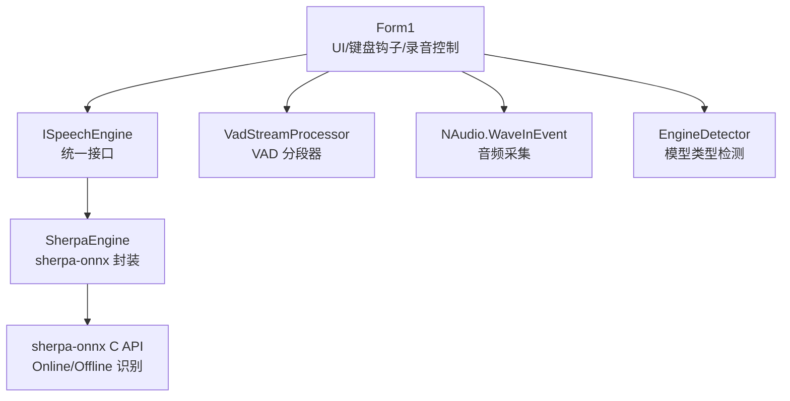
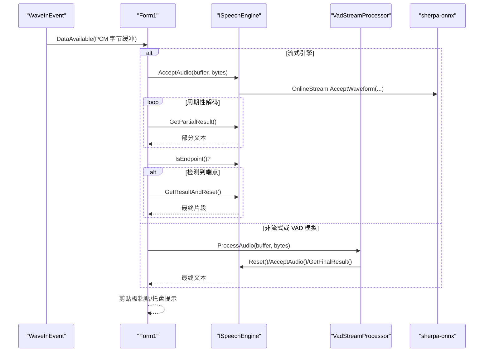
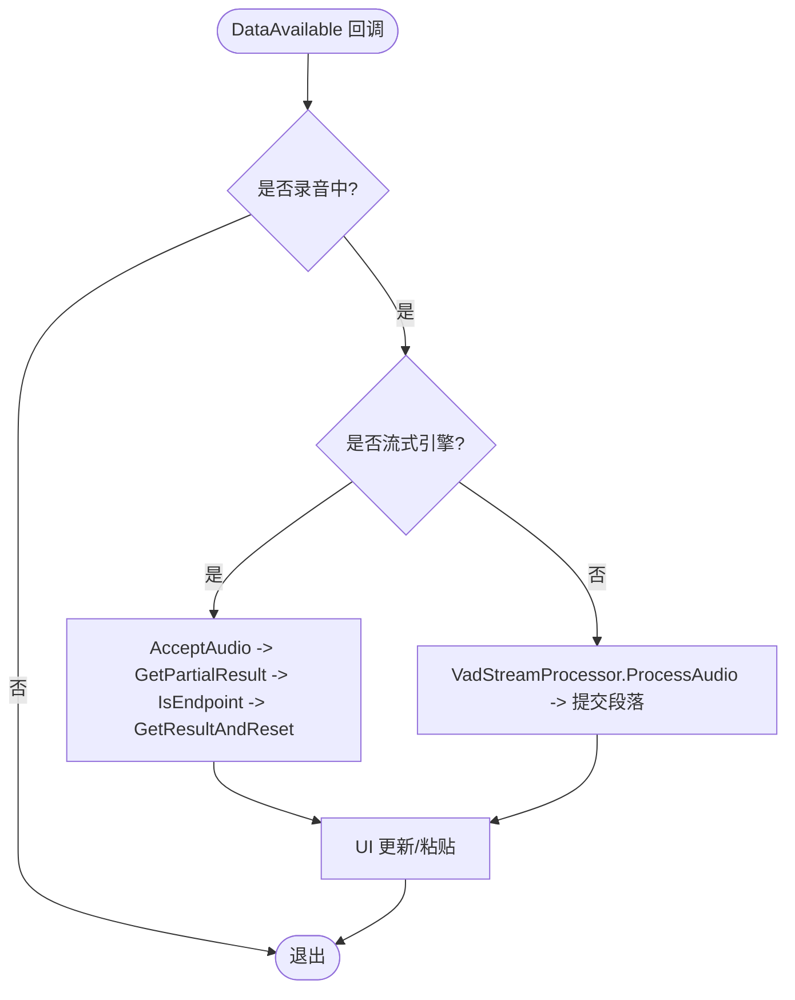
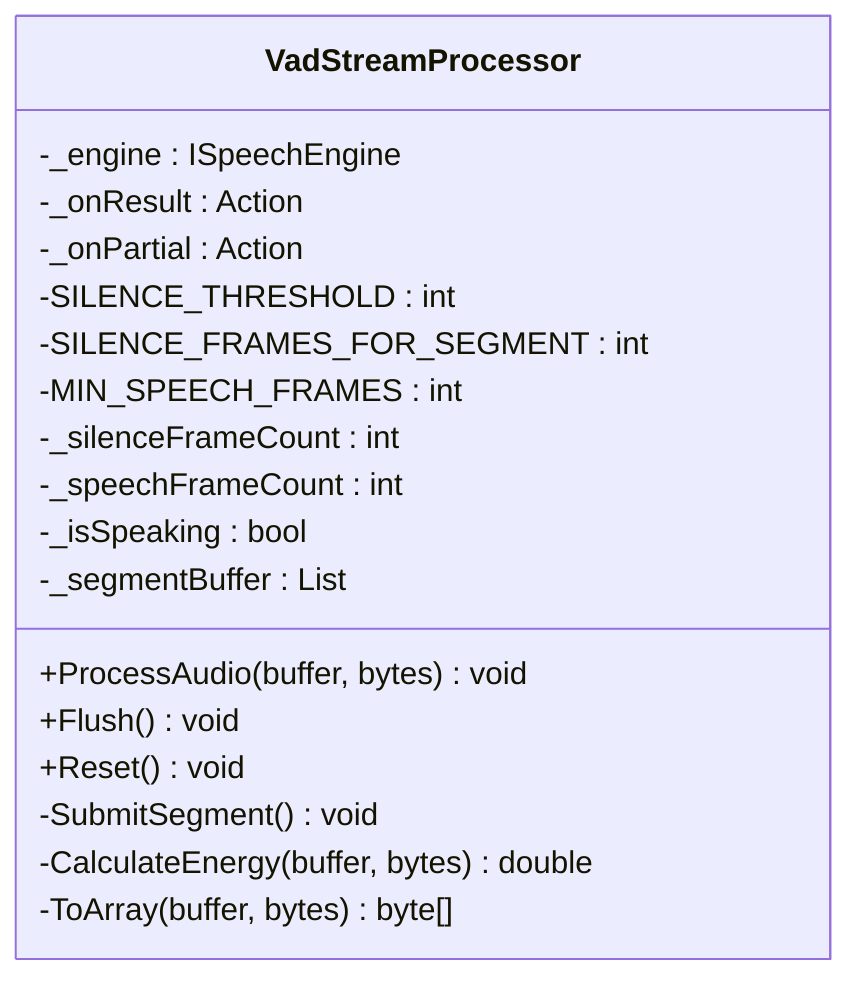
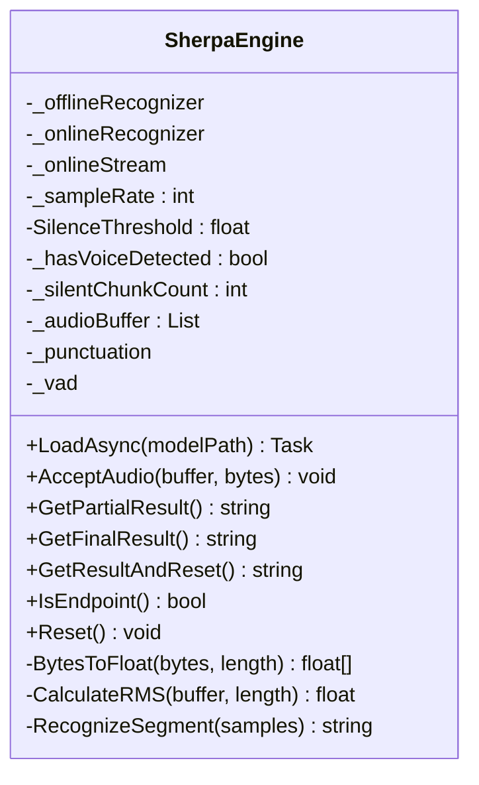
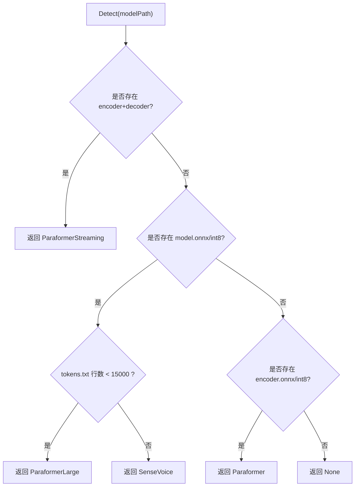
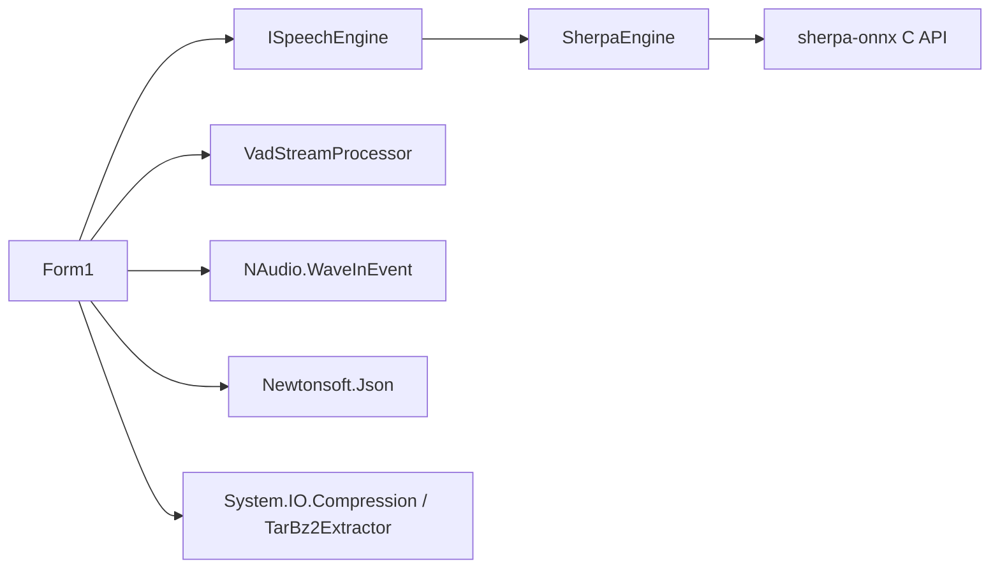

# 音频处理性能优化

<cite>
**本文引用的文件**
- [Program.cs](file://t9s2t/Program.cs)
- [Form1.cs](file://t9s2t/Form1.cs)
- [VadStreamProcessor.cs](file://t9s2t/Engines/VadStreamProcessor.cs)
- [SherpaEngine.cs](file://t9s2t/Engines/SherpaEngine.cs)
- [ISpeechEngine.cs](file://t9s2t/Engines/ISpeechEngine.cs)
- [EngineDetector.cs](file://t9s2t/Engines/EngineDetector.cs)
</cite>

## 目录
1. [简介](#简介)
2. [项目结构](#项目结构)
3. [核心组件](#核心组件)
4. [架构总览](#架构总览)
5. [详细组件分析](#详细组件分析)
6. [依赖关系分析](#依赖关系分析)
7. [性能考量与优化策略](#性能考量与优化策略)
8. [故障排查指南](#故障排查指南)
9. [结论](#结论)
10. [附录：测试与基准建议](#附录测试与基准建议)

## 简介
本技术文档围绕音频采集、语音活动检测（VAD）、流式与非流式识别引擎的集成，系统性地梳理并给出可落地的性能优化方案。重点覆盖以下方面：
- 采样率与缓冲区大小在不同场景下的最佳配置
- RMS 能量计算的性能优化（向量化、SIMD、复杂度降低）
- VAD 实时性优化（阈值动态调整、滑动窗口、计算缓存）
- 零拷贝数据流处理（Span<T>/Memory<T>、数组切片、内存对齐）
- 音频格式转换（PCM 处理、位深度转换、端序处理）
- 延迟优化与 CPU 使用率控制
- 质量与性能的平衡策略及实际测试案例

## 项目结构
本项目为 Windows 桌面应用，采用 NAudio 进行音频采集，通过自定义引擎抽象层对接 sherpa-onnx 推理后端，支持 SenseVoice、Paraformer（离线与大模型）、以及流式 Paraformer。UI 层负责键盘钩子、录音提示、结果粘贴等交互。

图表来源
- [Form1.cs:1057-1111](file://t9s2t/Form1.cs#L1057-L1111)
- [ISpeechEngine.cs:1-35](file://t9s2t/Engines/ISpeechEngine.cs#L1-L35)
- [SherpaEngine.cs:14-72](file://t9s2t/Engines/SherpaEngine.cs#L14-L72)
- [VadStreamProcessor.cs:12-33](file://t9s2t/Engines/VadStreamProcessor.cs#L12-L33)
- [EngineDetector.cs:22-75](file://t9s2t/Engines/EngineDetector.cs#L22-L75)

章节来源
- [Program.cs:10-24](file://t9s2t/Program.cs#L10-L24)
- [Form1.cs:1057-1111](file://t9s2t/Form1.cs#L1057-L1111)
- [ISpeechEngine.cs:1-35](file://t9s2t/Engines/ISpeechEngine.cs#L1-L35)
- [SherpaEngine.cs:14-72](file://t9s2t/Engines/SherpaEngine.cs#L14-L72)
- [VadStreamProcessor.cs:12-33](file://t9s2t/Engines/VadStreamProcessor.cs#L12-L33)
- [EngineDetector.cs:22-75](file://t9s2t/Engines/EngineDetector.cs#L22-L75)

## 核心组件
- ISpeechEngine：定义统一的识别引擎接口，屏蔽具体实现差异，便于扩展新引擎。
- SherpaEngine：基于 sherpa-onnx 的封装，支持在线/离线模式、标点恢复、内置 VAD 参数、端点检测等。
- VadStreamProcessor：对非流式模型提供“模拟流式”能力，通过能量阈值和静音帧计数切分语音段。
- Form1：整合 NAudio 采集、键盘钩子、UI 状态、结果粘贴；协调引擎与 VAD 处理器。
- EngineDetector：根据模型目录结构自动识别引擎类型并创建对应实例。

章节来源
- [ISpeechEngine.cs:1-35](file://t9s2t/Engines/ISpeechEngine.cs#L1-L35)
- [SherpaEngine.cs:14-72](file://t9s2t/Engines/SherpaEngine.cs#L14-L72)
- [VadStreamProcessor.cs:12-33](file://t9s2t/Engines/VadStreamProcessor.cs#L12-L33)
- [Form1.cs:1057-1111](file://t9s2t/Form1.cs#L1057-L1111)
- [EngineDetector.cs:22-75](file://t9s2t/Engines/EngineDetector.cs#L22-L75)

## 架构总览
下图展示了从音频采集到识别输出的关键路径，包括流式与非流式分支、VAD 分段、端点检测与结果输出。

图表来源
- [Form1.cs:1057-1111](file://t9s2t/Form1.cs#L1057-L1111)
- [SherpaEngine.cs:351-479](file://t9s2t/Engines/SherpaEngine.cs#L351-L479)
- [VadStreamProcessor.cs:38-136](file://t9s2t/Engines/VadStreamProcessor.cs#L38-L136)

## 详细组件分析

### 组件一：音频采集与输入管线（Form1 + NAudio）
- 采样率固定为 16kHz、单声道，符合多数 ASR 模型要求，减少重采样开销。
- 使用锁保护录音线程与 UI 线程的并发访问，避免竞态条件。
- 流式模式下优先调用引擎内部端点检测，减少上层判断成本。

图表来源
- [Form1.cs:1057-1111](file://t9s2t/Form1.cs#L1057-L1111)

章节来源
- [Form1.cs:1057-1111](file://t9s2t/Form1.cs#L1057-L1111)

### 组件二：VAD 流式处理器（VadStreamProcessor）
- 使用简化版平均振幅作为能量指标，按静音帧数触发分段。
- 提供 Flush 强制提交剩余片段，保证停止录音时不丢字。
- 当前能量计算为逐样本绝对值求和再取均值，时间复杂度 O(N)，空间 O(1)。

图表来源
- [VadStreamProcessor.cs:12-162](file://t9s2t/Engines/VadStreamProcessor.cs#L12-L162)

章节来源
- [VadStreamProcessor.cs:38-136](file://t9s2t/Engines/VadStreamProcessor.cs#L38-L136)
- [VadStreamProcessor.cs:141-152](file://t9s2t/Engines/VadStreamProcessor.cs#L141-L152)

### 组件三：sherpa-onnx 引擎封装（SherpaEngine）
- 支持在线/离线两种模式，自动加载标点与 VAD 模型（若存在）。
- 流式模式包含端点检测参数调优，兼顾出字速度与稳定性。
- 内置 RMS 计算用于静音过滤，避免将静音送入模型造成幻觉。

图表来源
- [SherpaEngine.cs:14-72](file://t9s2t/Engines/SherpaEngine.cs#L14-L72)
- [SherpaEngine.cs:351-479](file://t9s2t/Engines/SherpaEngine.cs#L351-L479)
- [SherpaEngine.cs:562-589](file://t9s2t/Engines/SherpaEngine.cs#L562-L589)

章节来源
- [SherpaEngine.cs:57-72](file://t9s2t/Engines/SherpaEngine.cs#L57-L72)
- [SherpaEngine.cs:351-479](file://t9s2t/Engines/SherpaEngine.cs#L351-L479)
- [SherpaEngine.cs:562-589](file://t9s2t/Engines/SherpaEngine.cs#L562-L589)

### 组件四：引擎类型检测（EngineDetector）
- 依据模型目录中的 ONNX 文件名与 tokens.txt 行数区分 SenseVoice、Paraformer-large、流式/非流式 Paraformer。
- 提供 Detect 与 CreateEngine 两步法，以及一步到位的 DetectAndCreate。

图表来源
- [EngineDetector.cs:27-75](file://t9s2t/Engines/EngineDetector.cs#L27-L75)

章节来源
- [EngineDetector.cs:27-75](file://t9s2t/Engines/EngineDetector.cs#L27-L75)

## 依赖关系分析
- 耦合关系
  - Form1 依赖 ISpeechEngine 抽象，松耦合便于替换引擎实现。
  - SherpaEngine 依赖 sherpa-onnx C API（通过 NuGet 包引入），同时可选依赖标点与 VAD 模型。
  - VadStreamProcessor 依赖 ISpeechEngine 以提交语音段。
- 外部依赖
  - NAudio.WaveInEvent 提供低延迟音频采集。
  - Newtonsoft.Json 用于远程模型列表解析。
  - System.IO.Compression 与 TarBz2Extractor 用于模型压缩包解压。

图表来源
- [Form1.cs:1057-1111](file://t9s2t/Form1.cs#L1057-L1111)
- [ISpeechEngine.cs:1-35](file://t9s2t/Engines/ISpeechEngine.cs#L1-L35)
- [SherpaEngine.cs:14-72](file://t9s2t/Engines/SherpaEngine.cs#L14-L72)
- [VadStreamProcessor.cs:12-33](file://t9s2t/Engines/VadStreamProcessor.cs#L12-L33)

章节来源
- [Form1.cs:1057-1111](file://t9s2t/Form1.cs#L1057-L1111)
- [ISpeechEngine.cs:1-35](file://t9s2t/Engines/ISpeechEngine.cs#L1-L35)
- [SherpaEngine.cs:14-72](file://t9s2t/Engines/SherpaEngine.cs#L14-L72)
- [VadStreamProcessor.cs:12-33](file://t9s2t/Engines/VadStreamProcessor.cs#L12-L33)

## 性能考量与优化策略

### 采样率与缓冲区大小优化
- 采样率
  - 当前固定 16kHz，满足大多数中文 ASR 模型需求，且能显著降低带宽与计算量。
  - 若目标模型支持更高采样率（如 24/48kHz），需权衡识别精度提升与 CPU/内存开销增加。
- 缓冲区大小
  - 小缓冲（如 10ms ~ 20ms）可降低端到端延迟，但会增加回调频率与上下文切换开销。
  - 大缓冲（如 40ms ~ 80ms）可减少回调次数，提高吞吐，但会增大首包延迟。
  - 建议：在流式模式下使用 20~40ms 缓冲；在非流式累积模式下可使用 40~80ms。
- 设备与驱动
  - 确保 NAudio 使用的设备驱动支持低延迟回调；必要时尝试不同设备号或 WASAPI/ASIO 后端（若可用）。

章节来源
- [Form1.cs:1057-1062](file://t9s2t/Form1.cs#L1057-L1062)

### RMS 能量计算的性能优化
- 现状
  - VadStreamProcessor 使用平均振幅（绝对值均值）作为能量指标，O(N) 时间，无额外分配。
  - SherpaEngine 使用标准 RMS（平方均值开方），同样 O(N)。
- 优化方向
  - 向量化与 SIMD：利用 System.Numerics.Vectors 或 Vectorized 算法批量处理 short 样本，减少分支与循环开销。
  - 预缩放与查表：将归一化与平方操作合并，或使用近似 sqrt 加速。
  - 降采样：对高频噪声不敏感的场景，可对每 2 或 4 个样本抽取一个进行能量估算，降低计算量。
  - 增量更新：滑动窗口内维护 sumAbs 或 sumSq，每次仅更新进出窗口的样本，将 O(N) 降至 O(1)。
- 复杂度对比
  - 原始：O(N)
  - 增量滑动窗口：O(1) 每帧
  - SIMD 向量化：常数级加速（通常 2x~4x，取决于硬件与 JIT）

章节来源
- [VadStreamProcessor.cs:141-152](file://t9s2t/Engines/VadStreamProcessor.cs#L141-L152)
- [SherpaEngine.cs:577-589](file://t9s2t/Engines/SherpaEngine.cs#L577-L589)

### VAD 实时性优化
- 阈值动态调整
  - 根据环境噪声水平自适应调整静音阈值，例如基于最近 N 帧能量的指数移动平均（EMA）动态设定阈值。
- 滑动窗口算法
  - 使用环形缓冲保存最近 K 帧能量，快速统计静音比例，避免全量扫描。
- 计算缓存机制
  - 缓存上一帧能量与状态机变量，避免重复计算；仅在有新数据到达时更新。
- 分段策略
  - 结合最小语音帧数与最大语音时长限制，防止过短片段或超长片段影响识别质量。

章节来源
- [VadStreamProcessor.cs:18-26](file://t9s2t/Engines/VadStreamProcessor.cs#L18-L26)
- [VadStreamProcessor.cs:38-86](file://t9s2t/Engines/VadStreamProcessor.cs#L38-L86)

### 零拷贝数据流处理（Span<T> 与 Memory<T>）
- 现状
  - 当前多处使用 byte[] 复制（如 ToArray、Array.Copy），存在额外分配与拷贝开销。
- 优化建议
  - 使用 Span<byte> 与 Memory<byte> 在热路径上避免分配，仅在跨边界或需要持久化时转换为数组。
  - 针对 PCM 16-bit LE 样本，使用 Span<short> 直接读取，减少中间转换。
  - 注意内存对齐：某些 SIMD 库要求 16/32 字节对齐，必要时使用堆栈分配或池化对象。
- 风险与注意事项
  - 生命周期管理：Span/Memory 不能逃逸到异步边界之外；需在回调内完成处理。
  - 兼容性：确保 .NET 运行时版本与 JIT 支持相关 API。

章节来源
- [VadStreamProcessor.cs:154-159](file://t9s2t/Engines/VadStreamProcessor.cs#L154-L159)
- [SherpaEngine.cs:562-572](file://t9s2t/Engines/SherpaEngine.cs#L562-L572)

### 音频格式转换（PCM、位深度、端序）
- 现状
  - 输入为 16kHz、单声道、16-bit PCM（LE），引擎内部转换为 float[] 并归一化至 [-1, 1]。
- 优化建议
  - 使用 Span<short> 直接映射输入缓冲，避免 Array.Copy。
  - 端序处理：确认平台字节序与模型期望一致（通常为 LE）；必要时进行字节交换。
  - 位深度转换：若上游为 24-bit/32-bit，先下采样到 16-bit 再进行归一化，减少浮点运算量。
- 复杂度与代价
  - 转换过程为 O(N)，通过向量化与 SIMD 可显著降低常数因子。

章节来源
- [SherpaEngine.cs:562-572](file://t9s2t/Engines/SherpaEngine.cs#L562-L572)

### 延迟优化与 CPU 使用率控制
- 延迟优化
  - 减小缓冲区大小，启用流式解码与端点检测，尽早输出部分结果。
  - 节流 UI 更新（已实现 partial 节流），避免频繁剪贴板操作。
- CPU 控制
  - 合理设置 sherpa-onnx 线程数（当前默认 4），在高负载时可下调至 2~3。
  - 在静音阶段跳过送入模型（已在流式模式中实现），降低无效计算。
  - 使用后台线程执行耗时任务（模型加载、网络请求），避免阻塞主线程。

章节来源
- [SherpaEngine.cs:229-255](file://t9s2t/Engines/SherpaEngine.cs#L229-L255)
- [Form1.cs:988-991](file://t9s2t/Form1.cs#L988-L991)

### 质量与性能的平衡策略
- 模型选择
  - 流式 Paraformer：低延迟、适合实时对话；离线 Paraformer-large：高精度、适合长句与复杂语境。
  - SenseVoice：多语言能力强，但可能需配合 VAD 模拟流式。
- 端点与静音阈值
  - 适当提高静音阈值以减少误触发，但需避免吞字；结合 Rule1/Rule2 参数微调。
- 标点与 VAD 模型
  - 启用标点模型可提升可读性，但增加少量推理开销；VAD 模型可辅助静音检测，但需权衡 CPU 占用。

章节来源
- [SherpaEngine.cs:246-255](file://t9s2t/Engines/SherpaEngine.cs#L246-L255)
- [SherpaEngine.cs:259-290](file://t9s2t/Engines/SherpaEngine.cs#L259-L290)
- [SherpaEngine.cs:314-347](file://t9s2t/Engines/SherpaEngine.cs#L314-L347)

## 故障排查指南
- 未检测到麦克风
  - 现象：界面提示未检测到麦克风。
  - 排查：检查设备枚举与权限，尝试更换设备号或驱动。
- 引擎 DLL 缺失
  - 现象：启动后提示缺少引擎组件。
  - 排查：运行下载流程，确认 onnxruntime.dll 与 sherpa-onnx-c-api.dll 存在且大小大于 0。
- 模型未找到
  - 现象：提示模型未找到。
  - 排查：确认 model 目录下存在 tokens.txt 与对应的 ONNX 文件；检查 EngineDetector 日志。
- 识别失败或结果为空
  - 现象：最终结果为空或异常。
  - 排查：检查 AcceptAudio 传入的 buffer 长度是否为偶数（16-bit PCM）；确认采样率与模型匹配；查看 Debug 日志。

章节来源
- [Form1.cs:1057-1062](file://t9s2t/Form1.cs#L1057-L1062)
- [Form1.cs:468-505](file://t9s2t/Form1.cs#L468-L505)
- [EngineDetector.cs:27-75](file://t9s2t/Engines/EngineDetector.cs#L27-L75)
- [SherpaEngine.cs:351-479](file://t9s2t/Engines/SherpaEngine.cs#L351-L479)

## 结论
本项目在音频采集、VAD 分段与 sherpa-onnx 引擎集成方面具备良好基础。通过进一步优化 RMS 计算（向量化/增量滑动窗口）、引入零拷贝数据流（Span/Memory）、精细调节采样率与缓冲区大小、以及合理控制线程与端点参数，可在保持识别质量的前提下显著降低延迟与 CPU 占用。建议在后续迭代中逐步落地上述优化，并结合真实场景进行基准测试与回归验证。

## 附录：测试与基准建议
- 基准指标
  - 端到端延迟（P50/P95）：从开始说话到首个字符出现的时间。
  - 吞吐：每秒处理的音频时长与识别字数。
  - CPU 占用：峰值与平均值，关注静音阶段的下降幅度。
  - 内存分配：热路径上的 GC 压力（byte[] 分配次数与总量）。
- 测试场景
  - 安静房间 vs 嘈杂环境：评估 VAD 阈值与静音检测鲁棒性。
  - 短句 vs 长句：评估端点检测与分句策略。
  - 不同缓冲区大小：比较延迟与稳定性的折中。
- 工具与方法
  - 使用 Stopwatch 与 PerformanceCounter 测量延迟与 CPU。
  - 使用 dotnet-counters 或 PerfView 分析 GC 与 CPU 热点。
  - 录制标准语料集，自动化回放与结果比对。

[本节为通用指导，不直接分析具体文件，故无章节来源]