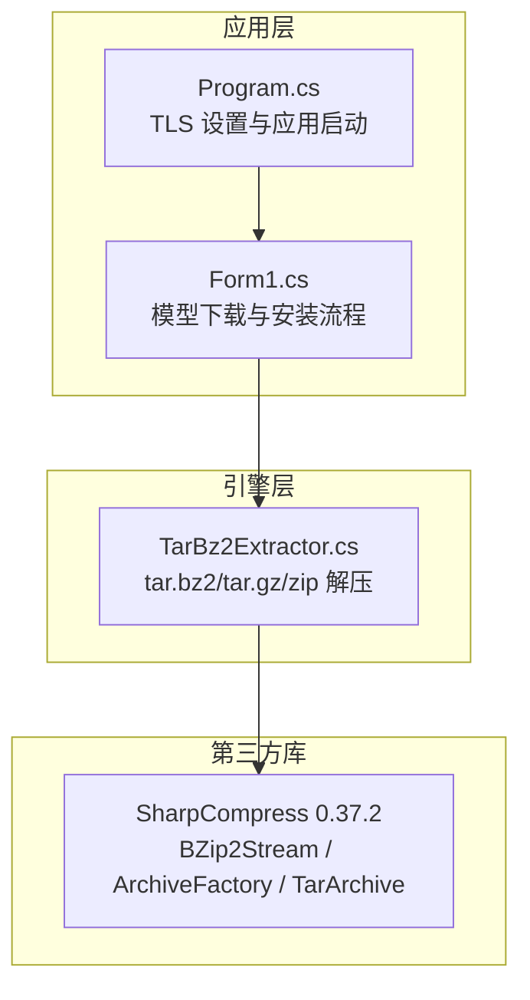
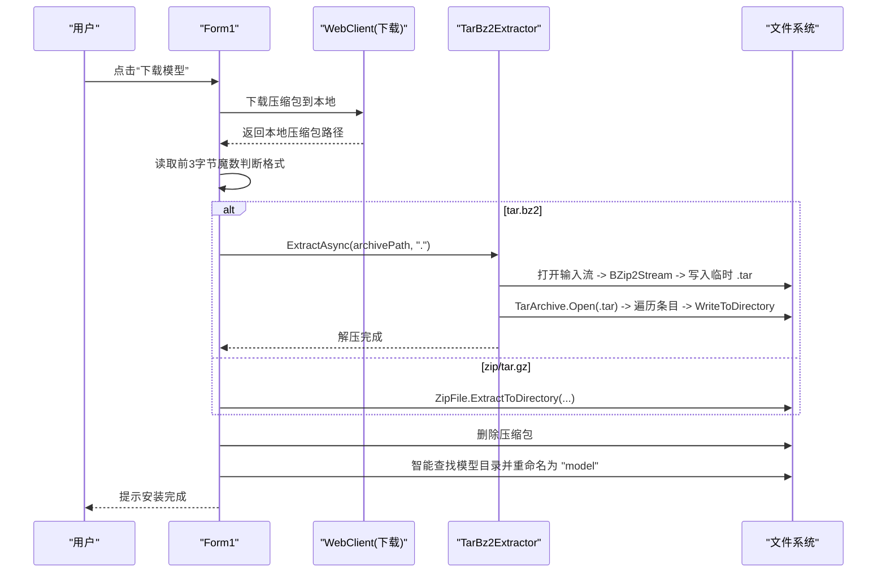
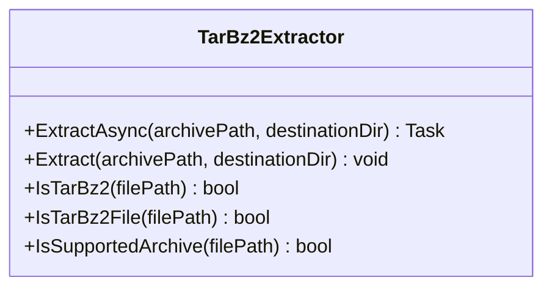
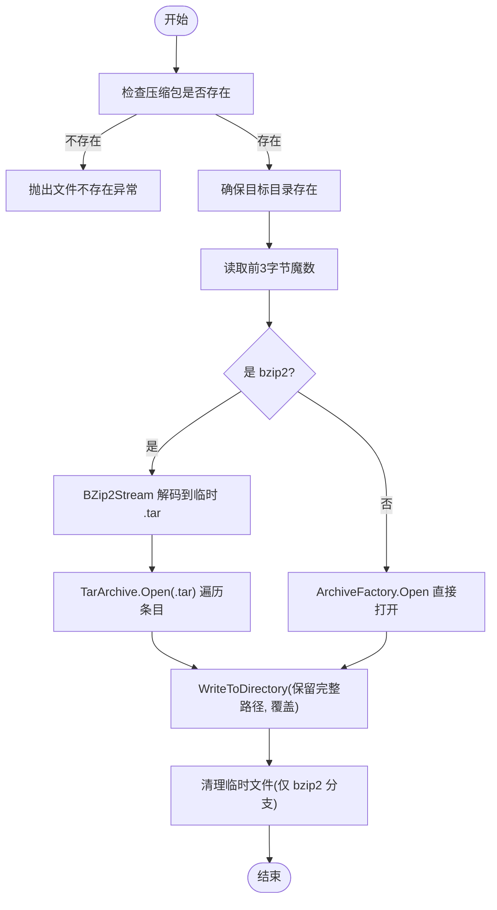
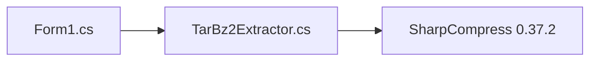

# 压缩文件解压处理

<cite>
**本文引用的文件**
- [TarBz2Extractor.cs](file://t9s2t/Engines/TarBz2Extractor.cs)
- [Form1.cs](file://t9s2t/Form1.cs)
- [Program.cs](file://t9s2t/Program.cs)
- [packages.config](file://t9s2t/packages.config)
- [SharpCompress README](file://packages/SharpCompress.0.37.2/README.md)
</cite>

## 目录
1. [简介](#简介)
2. [项目结构](#项目结构)
3. [核心组件](#核心组件)
4. [架构总览](#架构总览)
5. [详细组件分析](#详细组件分析)
6. [依赖关系分析](#依赖关系分析)
7. [性能考量](#性能考量)
8. [故障排查指南](#故障排查指南)
9. [结论](#结论)
10. [附录：扩展与示例](#附录扩展与示例)

## 简介
本技术文档围绕 t9s2t 项目的“压缩文件解压处理系统”，重点解析 TarBz2Extractor 类的实现原理与使用方式，涵盖 SharpCompress 库集成、tar.bz2 格式解析与提取流程、大文件分块解压策略（内存管理、缓冲区控制、进度反馈）、错误处理（损坏检测、权限检查、磁盘空间验证）、异步解压（Task、取消令牌、线程安全）、解压路径管理（目标目录创建、重名与冲突解决），以及性能优化技巧（多线程、I/O 缓冲、网络流处理）。同时提供扩展方法，展示如何支持更多压缩格式与自定义解压逻辑。

## 项目结构
本项目采用分层组织方式，核心解压逻辑位于 Engines 命名空间下，UI 层在 Form1.cs 中调用解压能力，程序入口在 Program.cs 中初始化 TLS 等运行时环境。SharpCompress 通过 NuGet 包引入，版本为 0.37.2。

图表来源
- [TarBz2Extractor.cs:1-142](file://t9s2t/Engines/TarBz2Extractor.cs#L1-L142)
- [Form1.cs:910-963](file://t9s2t/Form1.cs#L910-L963)
- [Program.cs:1-27](file://t9s2t/Program.cs#L1-L27)
- [packages.config:17-17](file://t9s2t/packages.config#L17-L17)

章节来源
- [TarBz2Extractor.cs:1-142](file://t9s2t/Engines/TarBz2Extractor.cs#L1-L142)
- [Form1.cs:910-963](file://t9s2t/Form1.cs#L910-L963)
- [Program.cs:1-27](file://t9s2t/Program.cs#L1-L27)
- [packages.config:1-20](file://t9s2t/packages.config#L1-L20)

## 核心组件
- TarBz2Extractor：静态类，封装 tar.bz2、tar.gz、zip 的解压能力，内部基于 SharpCompress 的 BZip2Stream、TarArchive 和 ArchiveFactory。
- Form1：负责模型下载、解压与安装，根据压缩包魔数选择解压路径，并智能定位模型目录进行重命名。
- Program：应用启动时配置 TLS 协议，确保网络请求兼容。

章节来源
- [TarBz2Extractor.cs:17-96](file://t9s2t/Engines/TarBz2Extractor.cs#L17-L96)
- [Form1.cs:910-963](file://t9s2t/Form1.cs#L910-L963)
- [Program.cs:18-24](file://t9s2t/Program.cs#L18-L24)

## 架构总览
整体流程如下：
- 用户点击“下载模型”后，Form1 从远程获取模型列表并下载压缩包到本地临时位置。
- 下载完成后，根据文件头部魔数判断是否为 tar.bz2；若是，则调用 TarBz2Extractor.ExtractAsync 进行解压；否则走 ZipFile 解压路径。
- 解压完成后，智能查找包含模型文件的目录并重命名为 model，完成安装。

图表来源
- [Form1.cs:910-963](file://t9s2t/Form1.cs#L910-L963)
- [TarBz2Extractor.cs:30-96](file://t9s2t/Engines/TarBz2Extractor.cs#L30-L96)

## 详细组件分析

### TarBz2Extractor 类分析
- 职责：统一解压接口，自动识别 tar.bz2 并通过两步法（先 bzip2 解出 tar，再 tar 解出文件）完成解压；其他格式直接交由 ArchiveFactory 处理。
- 关键方法：
  - ExtractAsync：将同步解压包装为 Task.Run，便于 UI 线程非阻塞调用。
  - Extract：主解压逻辑，含存在性校验、目标目录创建、魔数判断、bzip2 两步解压、条目遍历与写入。
  - IsTarBz2File：读取前 3 字节魔数（'B''Z''h'）判定 bzip2。
  - IsSupportedArchive：按扩展名快速判断是否支持。

图表来源
- [TarBz2Extractor.cs:17-142](file://t9s2t/Engines/TarBz2Extractor.cs#L17-L142)

#### 算法与数据流
- tar.bz2 解压流程：
  - 打开输入流 -> BZip2Stream 解码 -> 写入临时 .tar 文件 -> TarArchive.Open 打开 tar -> 遍历 Entries -> 对每个非目录条目调用 WriteToDirectory 写入目标目录。
- 其他格式：
  - ArchiveFactory.Open -> 遍历 Entries -> WriteToDirectory。

图表来源
- [TarBz2Extractor.cs:30-96](file://t9s2t/Engines/TarBz2Extractor.cs#L30-L96)

章节来源
- [TarBz2Extractor.cs:17-96](file://t9s2t/Engines/TarBz2Extractor.cs#L17-L96)

### Form1 中的解压集成
- 在下载完成后，根据魔数判断是否为 tar.bz2，若是则调用 TarBz2Extractor.ExtractAsync，否则使用 ZipFile.ExtractToDirectory。
- 解压后智能查找包含模型文件的目录并重命名为 model，完成安装。

章节来源
- [Form1.cs:910-963](file://t9s2t/Form1.cs#L910-L963)

### 程序入口与环境初始化
- Program.Main 设置 ServicePointManager.SecurityProtocol 为 TLS1.2/1.1/TLS，确保后续 WebClient 请求成功。

章节来源
- [Program.cs:18-24](file://t9s2t/Program.cs#L18-L24)

## 依赖关系分析
- 外部依赖：SharpCompress 0.37.2，提供 BZip2Stream、TarArchive、ArchiveFactory 等 API。
- 内部依赖：Form1 依赖 TarBz2Extractor；TarBz2Extractor 依赖 SharpCompress。

图表来源
- [packages.config:17-17](file://t9s2t/packages.config#L17-L17)
- [TarBz2Extractor.cs:1-9](file://t9s2t/Engines/TarBz2Extractor.cs#L1-L9)
- [Form1.cs:910-963](file://t9s2t/Form1.cs#L910-L963)

章节来源
- [packages.config:1-20](file://t9s2t/packages.config#L1-L20)
- [TarBz2Extractor.cs:1-9](file://t9s2t/Engines/TarBz2Extractor.cs#L1-L9)

## 性能考量
- I/O 缓冲：当前实现使用默认 CopyTo 缓冲，适合大多数场景。对于超大模型文件，可考虑增大缓冲区以提升吞吐。
- 临时文件：tar.bz2 解压需要中间 .tar 文件，会增加磁盘 I/O 与空间占用。若目标盘空间不足或 I/O 受限，建议优先使用原生支持多格式的 ArchiveFactory 路径（如 tar.gz、zip）。
- 异步执行：ExtractAsync 使用 Task.Run 将 CPU 密集与 I/O 操作移出 UI 线程，避免界面卡顿。
- 多线程解压：当前实现为单线程顺序解压条目。如需提升速度，可在不破坏目录结构的前提下并行处理多个条目，但需注意文件系统并发写入的安全性与目标路径唯一性。
- 网络流处理：SharpCompress 支持非 seekable 流，理论上可直接从网络流解压，减少磁盘落盘开销。当前实现仍采用下载到本地再解压的方式，便于重试与断点续传。

[本节为通用性能指导，不直接分析具体代码文件]

## 故障排查指南
- 文件不存在：当压缩包路径无效时，会抛出 FileNotFoundException。请确认下载路径与文件名正确。
- 权限问题：若目标目录不可写，WriteToDirectory 可能失败。需以管理员运行或调整目录权限。
- 磁盘空间不足：tar.bz2 解压会产生临时 .tar 文件，需确保临时目录有足够空间。
- 压缩包损坏：SharpCompress 在读取损坏的 bzip2 或 tar 头时会抛出异常。建议校验下载完整性（如 MD5/SHA）后再解压。
- 重名冲突：当前 Overwrite=true，同名文件会被覆盖。如需保留旧版本，请先备份或修改覆盖策略。
- 网络问题：TLS 协议未启用可能导致下载失败。Program.Main 已设置 TLS1.2/1.1/TLS，若仍失败，检查代理与证书。

章节来源
- [TarBz2Extractor.cs:30-96](file://t9s2t/Engines/TarBz2Extractor.cs#L30-L96)
- [Form1.cs:910-963](file://t9s2t/Form1.cs#L910-L963)
- [Program.cs:18-24](file://t9s2t/Program.cs#L18-L24)

## 结论
TarBz2Extractor 提供了简洁可靠的 tar.bz2/tar.gz/zip 解压能力，结合 Form1 的下载与安装流程，实现了端到端的模型部署自动化。当前实现稳定易用，但在大文件场景下可通过增强缓冲、并行解压、网络流直解等方式进一步优化性能与用户体验。

[本节为总结性内容，不直接分析具体代码文件]

## 附录：扩展与示例

### 支持更多压缩格式
- 扩展 IsSupportedArchive 以支持更多扩展名（如 .rar、.xz、.7z）。
- 在 Extract 中增加对应分支，使用 ArchiveFactory 或专用 Stream 类型（如 XZ、GZip）进行处理。

章节来源
- [TarBz2Extractor.cs:132-140](file://t9s2t/Engines/TarBz2Extractor.cs#L132-L140)

### 自定义解压逻辑
- 在遍历 Entries 时，可对特定文件进行过滤、转换或加密处理，再写入目标目录。
- 使用 ExtractionOptions 控制行为（如是否保留完整路径、是否覆盖）。

章节来源
- [TarBz2Extractor.cs:56-92](file://t9s2t/Engines/TarBz2Extractor.cs#L56-L92)

### 大文件分块解压与进度反馈
- 当前实现未提供进度回调。可在 WriteToDirectory 之前手动读取 Entry 的 Stream，按固定大小分块写入目标文件，并在每块完成后触发进度事件。
- 注意内存峰值控制：合理设置分块大小（如 1MB~8MB），避免一次性加载过大内容。

[本节为概念性扩展说明，不直接分析具体代码文件]

### 取消令牌支持与线程安全
- 当前 ExtractAsync 使用 Task.Run 包装，不支持取消。可改为接受 CancellationToken，并在循环与 I/O 操作中检查 token.IsCancellationRequested，适时抛出 OperationCanceledException。
- 多线程解压时需保证同一目录下的写入互斥，避免竞态条件导致文件损坏。

[本节为概念性扩展说明，不直接分析具体代码文件]

### 解压路径管理与冲突解决
- 当前实现会创建目标目录并覆盖同名文件。如需更严格的冲突处理，可在写入前检查目标路径是否存在，必要时生成唯一后缀或跳过。
- 建议在解压前先计算目标目录可用空间，确保大于压缩包解压后的预估大小。

章节来源
- [TarBz2Extractor.cs:35-36](file://t9s2t/Engines/TarBz2Extractor.cs#L35-L36)
- [TarBz2Extractor.cs:62-66](file://t9s2t/Engines/TarBz2Extractor.cs#L62-L66)

### SharpCompress 库特性参考
- 支持非 seekable 流，适合网络流直解。
- 推荐 GZip/BZip2/LZip 作为长期归档格式，Tar 常与这些压缩器组合使用。

章节来源
- [SharpCompress README:1-20](file://packages/SharpCompress.0.37.2/README.md#L1-L20)