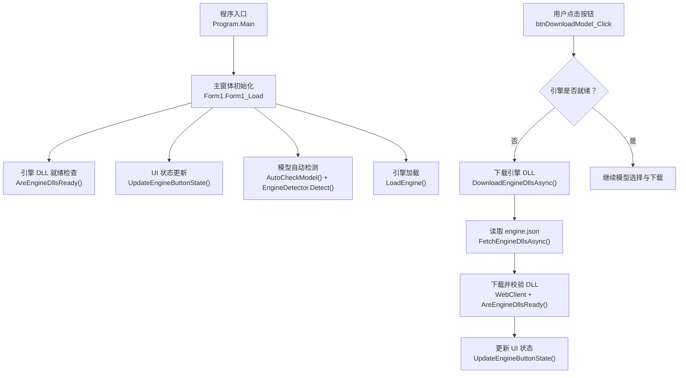
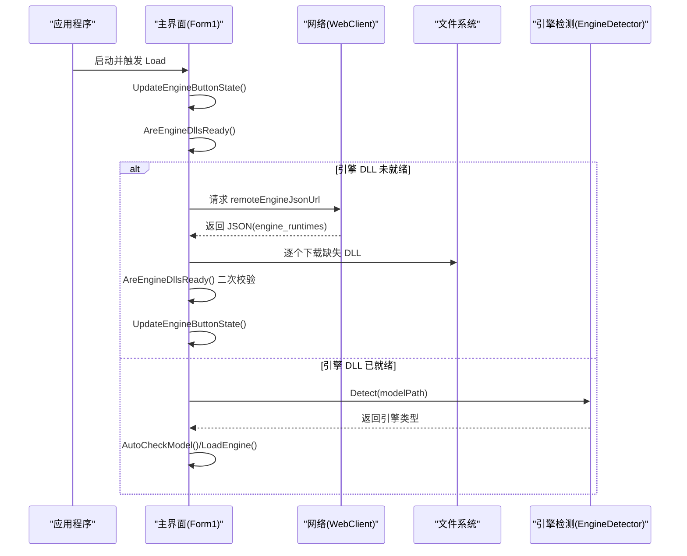
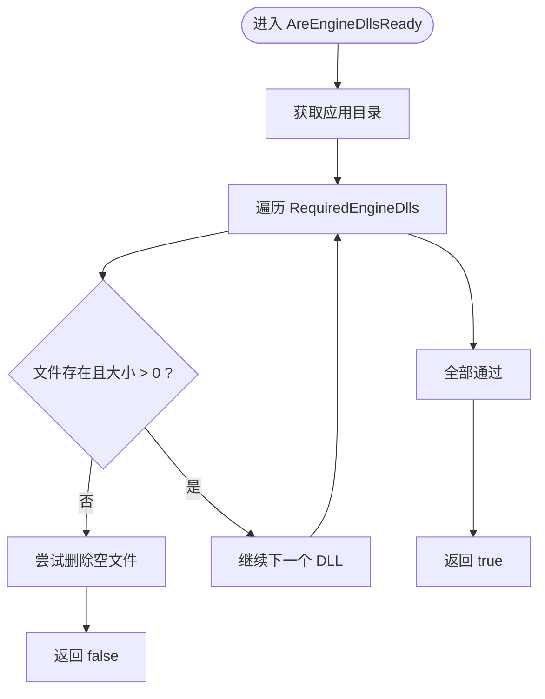
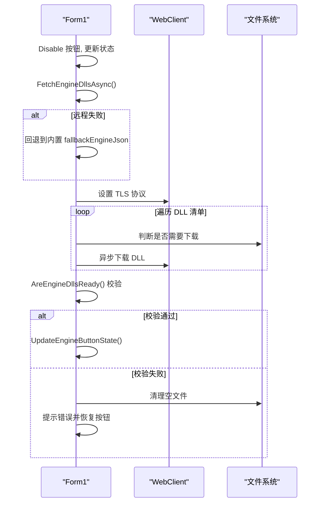
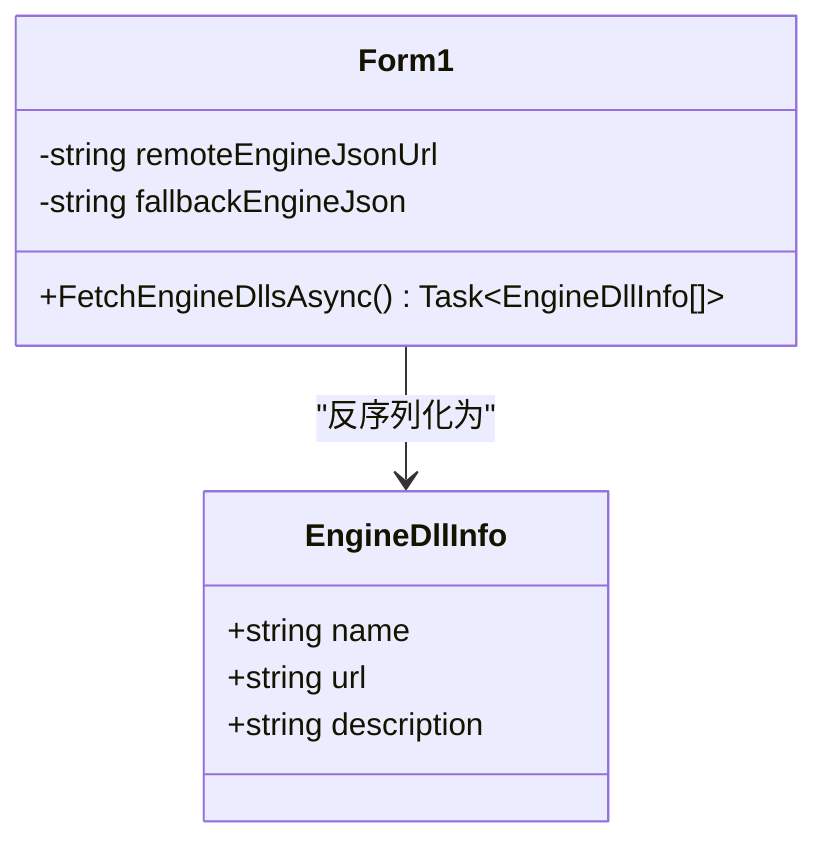
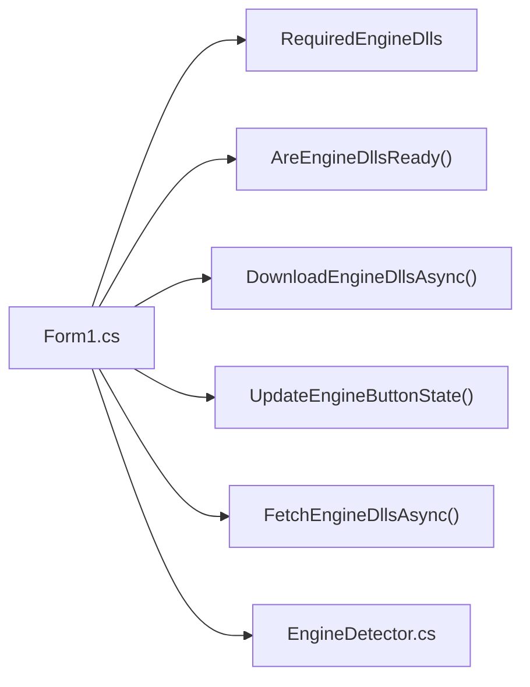

# 引擎运行时管理

<cite>
**本文引用的文件**
- [Form1.cs](file://t9s2t/Form1.cs)
- [Program.cs](file://t9s2t/Program.cs)
- [EngineDetector.cs](file://t9s2t/Engines/EngineDetector.cs)
</cite>

## 目录
1. [简介](#简介)
2. [项目结构](#项目结构)
3. [核心组件](#核心组件)
4. [架构总览](#架构总览)
5. [详细组件分析](#详细组件分析)
6. [依赖关系分析](#依赖关系分析)
7. [性能与健壮性](#性能与健壮性)
8. [故障排查指南](#故障排查指南)
9. [结论](#结论)
10. [附录：扩展示例](#附录扩展示例)

## 简介
本技术文档聚焦于 t9s2t 的“引擎运行时管理系统”，围绕以下目标展开：
- 深入解释引擎 DLL 的检测机制，包括 AreEngineDllsReady() 的实现原理与 RequiredEngineDlls 数组的配置。
- 详细说明 DownloadEngineDllsAsync() 的工作流程：engine.json 配置获取、DLL 下载与完整性验证。
- 阐述 EngineDllInfo 数据结构的定义与 JSON 反序列化过程。
- 介绍 UpdateEngineButtonState() 的 UI 状态管理逻辑（按钮文本、颜色、启用状态的动态更新）。
- 说明错误恢复机制：下载失败处理、文件清理与重试策略。
- 详细介绍 TLS 协议配置与安全连接设置。
- 提供具体代码示例路径，展示如何添加新的引擎依赖和自定义下载逻辑。

## 项目结构
与引擎运行时管理相关的核心实现集中在主窗体 Form1.cs 中，包含：
- 远程配置地址与本地备用配置
- 引擎 DLL 检测与下载
- UI 状态联动
- TLS 安全协议设置
- 模型自动检测与加载（与引擎运行相关）

图表来源
- [Program.cs:15-24](file://t9s2t/Program.cs#L15-L24)
- [Form1.cs:151-235](file://t9s2t/Form1.cs#L151-L235)
- [Form1.cs:462-505](file://t9s2t/Form1.cs#L462-L505)
- [Form1.cs:510-567](file://t9s2t/Form1.cs#L510-L567)
- [Form1.cs:569-606](file://t9s2t/Form1.cs#L569-L606)
- [Form1.cs:608-642](file://t9s2t/Form1.cs#L608-L642)
- [EngineDetector.cs:22-120](file://t9s2t/Engines/EngineDetector.cs#L22-L120)

章节来源
- [Program.cs:15-24](file://t9s2t/Program.cs#L15-L24)
- [Form1.cs:151-235](file://t9s2t/Form1.cs#L151-L235)
- [EngineDetector.cs:22-120](file://t9s2t/Engines/EngineDetector.cs#L22-L120)

## 核心组件
本节概述引擎运行时管理的核心方法与数据结构：
- RequiredEngineDlls：声明必须存在的运行时 DLL 列表。
- AreEngineDllsReady()：按文件名与大小校验 DLL 是否就绪。
- FetchEngineDllsAsync()：从远程 engine.json 或内置 fallback 解析出 DLL 清单。
- DownloadEngineDllsAsync()：遍历清单下载缺失的 DLL，完成后再次校验。
- UpdateEngineButtonState()：根据检测结果动态更新按钮文本、颜色与启用状态。
- EngineDllInfo：描述单个 DLL 的名称、URL 与说明。

章节来源
- [Form1.cs:462-505](file://t9s2t/Form1.cs#L462-L505)
- [Form1.cs:510-567](file://t9s2t/Form1.cs#L510-L567)
- [Form1.cs:569-606](file://t9s2t/Form1.cs#L569-L606)

## 架构总览
下图展示了“引擎运行时管理”在应用启动与用户交互中的整体流程，以及关键方法之间的调用关系。

图表来源
- [Form1.cs:151-235](file://t9s2t/Form1.cs#L151-L235)
- [Form1.cs:462-505](file://t9s2t/Form1.cs#L462-L505)
- [Form1.cs:510-567](file://t9s2t/Form1.cs#L510-L567)
- [Form1.cs:569-606](file://t9s2t/Form1.cs#L569-L606)
- [EngineDetector.cs:22-120](file://t9s2t/Engines/EngineDetector.cs#L22-L120)

## 详细组件分析

### 引擎 DLL 检测机制：RequiredEngineDlls 与 AreEngineDllsReady()
- RequiredEngineDlls 定义了必须存在的运行时 DLL 名称集合。
- AreEngineDllsReady() 对每个 DLL 执行存在性与非空大小校验；若发现空文件或损坏文件，会尝试删除后标记为未就绪。
- 该方法被多处调用：启动时、下载前后、自动检测前等，确保状态一致。

图表来源
- [Form1.cs:462-481](file://t9s2t/Form1.cs#L462-L481)

章节来源
- [Form1.cs:462-481](file://t9s2t/Form1.cs#L462-L481)

### 引擎 DLL 下载流程：DownloadEngineDllsAsync()
- 入口：当检测到引擎 DLL 未就绪时，由按钮点击事件触发。
- 步骤：
  1) 禁用按钮并提示“正在下载引擎组件”。
  2) 调用 FetchEngineDllsAsync() 获取 DLL 清单。
  3) 设置 TLS 安全协议，使用 WebClient 逐个下载缺失的 DLL。
  4) 下载完成后再次调用 AreEngineDllsReady() 进行完整性校验。
  5) 成功则更新 UI 状态；失败则清理空文件并提示错误。
- 异常处理：捕获网络或 IO 异常，记录日志，清理空文件，恢复按钮可用。

图表来源
- [Form1.cs:510-567](file://t9s2t/Form1.cs#L510-L567)
- [Form1.cs:569-599](file://t9s2t/Form1.cs#L569-L599)

章节来源
- [Form1.cs:510-567](file://t9s2t/Form1.cs#L510-L567)
- [Form1.cs:569-599](file://t9s2t/Form1.cs#L569-L599)

### 配置获取与反序列化：FetchEngineDllsAsync() 与 EngineDllInfo
- 远程配置：从 remoteEngineJsonUrl 拉取 JSON，解析根对象下的 engine_runtimes 数组。
- 回退策略：若远程失败，则解析内置 fallbackEngineJson 的同名字段。
- 反序列化：将 JArray 转换为 List<EngineDllInfo>。
- EngineDllInfo 字段：name、url、description。

图表来源
- [Form1.cs:569-606](file://t9s2t/Form1.cs#L569-L606)

章节来源
- [Form1.cs:569-606](file://t9s2t/Form1.cs#L569-L606)

### UI 状态管理：UpdateEngineButtonState()
- 当引擎 DLL 就绪：
  - 按钮文本恢复为“下载模型”，颜色与前景色恢复系统默认。
- 当引擎 DLL 未就绪：
  - 按钮文本改为“下载引擎组件”，背景设为橙色，前景白色，启用按钮。
  - 状态栏显示警告信息，颜色调整为警示色。
- 该函数在启动时、下载完成或失败后均会被调用，保证 UI 与真实状态一致。

章节来源
- [Form1.cs:485-505](file://t9s2t/Form1.cs#L485-L505)

### 错误恢复机制：下载失败处理、文件清理与重试策略
- 下载失败：
  - 捕获异常后记录日志，提示用户错误信息。
  - 针对 RequiredEngineDlls 中的每个 DLL，若存在且大小为 0，则尝试删除，避免脏文件影响后续重试。
- 重试策略：
  - 当前实现未内置自动重试循环，但通过恢复按钮可用状态，允许用户手动再次点击触发 DownloadEngineDllsAsync()。
  - 建议在外部增加指数退避与最大重试次数控制，以提升弱网环境下的成功率。

章节来源
- [Form1.cs:554-567](file://t9s2t/Form1.cs#L554-L567)

### TLS 协议配置与安全连接设置
- 全局设置：
  - Program.Main 在应用启动时统一设置 ServicePointManager.SecurityProtocol，支持 TLS 1.2、TLS 1.1 与 TLS。
- 局部设置：
  - 在网络请求前（如 FetchEngineDllsAsync、DownloadEngineDllsAsync、模型下载）再次设置 TLS 协议，确保所有 WebClient 请求均使用安全通道。
- 建议：
  - 优先仅启用 TLS 1.2，移除旧版本以增强安全性；如需兼容老旧服务器，可保留 TLS 1.1 作为降级选项。

章节来源
- [Program.cs:15-24](file://t9s2t/Program.cs#L15-L24)
- [Form1.cs:526-527](file://t9s2t/Form1.cs#L526-L527)
- [Form1.cs:573-574](file://t9s2t/Form1.cs#L573-L574)

## 依赖关系分析
- 模块耦合：
  - Form1 负责 UI 与业务流程编排，直接依赖文件系统与网络库。
  - EngineDetector 负责模型类型识别，与引擎实例创建解耦。
- 外部依赖：
  - Newtonsoft.Json 用于 JSON 解析。
  - System.Net.WebClient 用于 HTTP 下载。
  - Windows API 用于键盘钩子与窗口控制（与本主题关联度较低）。
- 潜在风险：
  - 强耦合于固定 DLL 名称与目录结构，新增依赖需同步修改 RequiredEngineDlls 与下载逻辑。
  - 缺少签名校验与哈希校验，存在中间人攻击或篡改风险。

图表来源
- [Form1.cs:462-505](file://t9s2t/Form1.cs#L462-L505)
- [Form1.cs:510-567](file://t9s2t/Form1.cs#L510-L567)
- [Form1.cs:569-606](file://t9s2t/Form1.cs#L569-L606)
- [EngineDetector.cs:22-120](file://t9s2t/Engines/EngineDetector.cs#L22-L120)

章节来源
- [Form1.cs:462-505](file://t9s2t/Form1.cs#L462-L505)
- [Form1.cs:510-567](file://t9s2t/Form1.cs#L510-L567)
- [Form1.cs:569-606](file://t9s2t/Form1.cs#L569-L606)
- [EngineDetector.cs:22-120](file://t9s2t/Engines/EngineDetector.cs#L22-L120)

## 性能与健壮性
- 性能：
  - 下载采用异步任务，不阻塞 UI。
  - 仅在必要时进行文件存在与大小检查，开销较小。
- 健壮性：
  - 远程配置失败时回退到内置配置，提升可用性。
  - 下载失败后进行空文件清理，避免脏状态。
- 改进建议：
  - 引入 SHA256 校验与数字签名验证，确保二进制完整性与来源可信。
  - 增加重试与退避策略，提高弱网稳定性。
  - 限制并发下载数量，避免带宽拥塞。

[本节为通用指导，无需引用具体文件]

## 故障排查指南
- 无法获取远程配置：
  - 检查网络连接与防火墙规则，确认 remoteEngineJsonUrl 可达。
  - 查看调试输出中的“远程引擎配置加载失败”日志。
- 下载失败：
  - 观察“引擎 DLL 下载失败”日志，定位具体异常原因。
  - 确认服务端 URL 有效，必要时切换至备用镜像。
- 下载不完整：
  - 检查 AreEngineDllsReady() 校验结果，确认文件大小大于 0。
  - 清理空文件后重试。
- TLS 握手失败：
  - 确认客户端与服务端支持的 TLS 版本，必要时调整 SecurityProtocol。
  - 参考 Program.Main 与网络请求前的 TLS 设置位置。

章节来源
- [Form1.cs:554-567](file://t9s2t/Form1.cs#L554-L567)
- [Form1.cs:569-599](file://t9s2t/Form1.cs#L569-L599)
- [Program.cs:15-24](file://t9s2t/Program.cs#L15-L24)

## 结论
t9s2t 的引擎运行时管理通过“远程配置 + 本地回退 + 按需下载 + 完整性校验”的组合策略，实现了良好的用户体验与鲁棒性。结合 UI 状态联动与错误恢复机制，用户在首次使用时即可快速获得可用的语音识别能力。未来可在安全性（签名与哈希校验）、可靠性（重试与退避）与可扩展性（插件化依赖管理）方面进一步增强。

[本节为总结，无需引用具体文件]

## 附录：扩展示例

### 添加新的引擎依赖
- 修改 RequiredEngineDlls 数组，加入新 DLL 名称。
- 在远程 engine.json 或内置 fallbackEngineJson 中添加对应条目（name、url、description）。
- 确保 DownloadEngineDllsAsync() 能正确遍历并下载新条目。
- 启动后通过 AreEngineDllsReady() 与 UpdateEngineButtonState() 验证 UI 状态。

章节来源
- [Form1.cs:462-481](file://t9s2t/Form1.cs#L462-L481)
- [Form1.cs:510-567](file://t9s2t/Form1.cs#L510-L567)
- [Form1.cs:569-599](file://t9s2t/Form1.cs#L569-L599)

### 自定义下载逻辑
- 在 DownloadEngineDllsAsync() 中替换 WebClient 为更高级的 HTTP 客户端（如 HttpClient），以实现进度回调、断点续传或代理支持。
- 在下载前后增加 SHA256 校验与签名验证，确保二进制完整性。
- 增加重试与退避策略，提升弱网环境下的成功率。

章节来源
- [Form1.cs:510-567](file://t9s2t/Form1.cs#L510-L567)