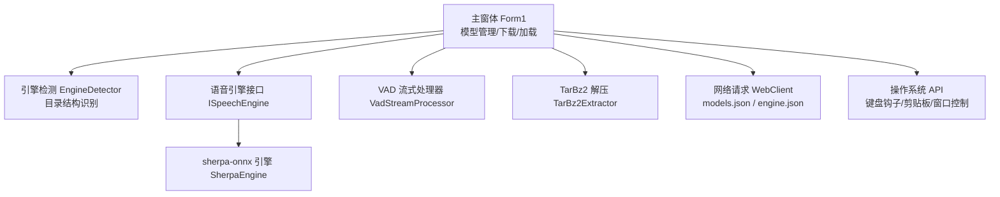
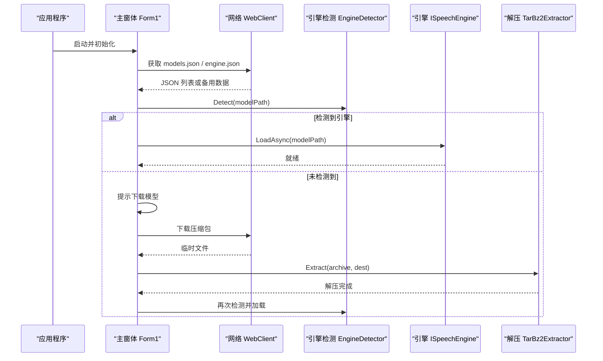
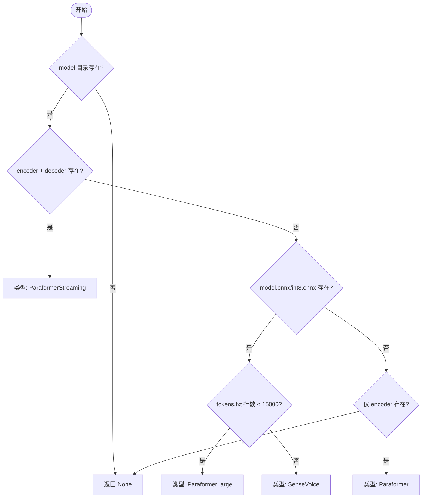
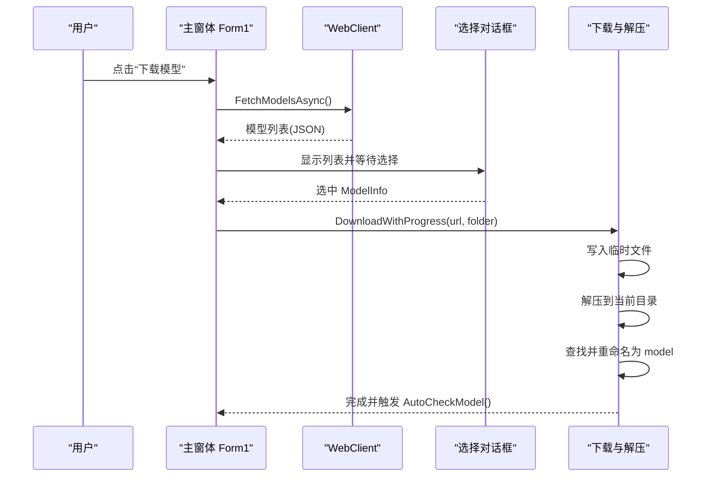
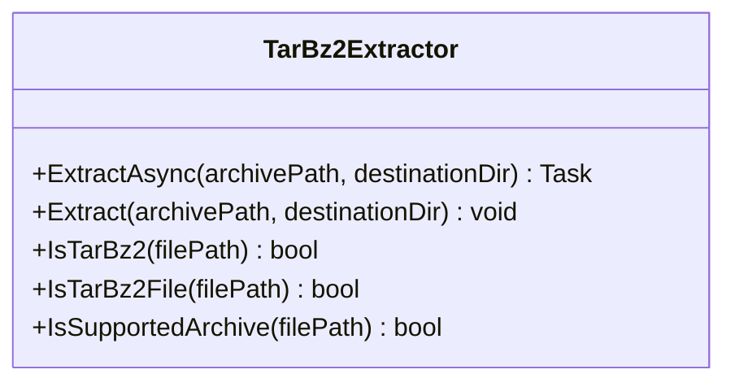
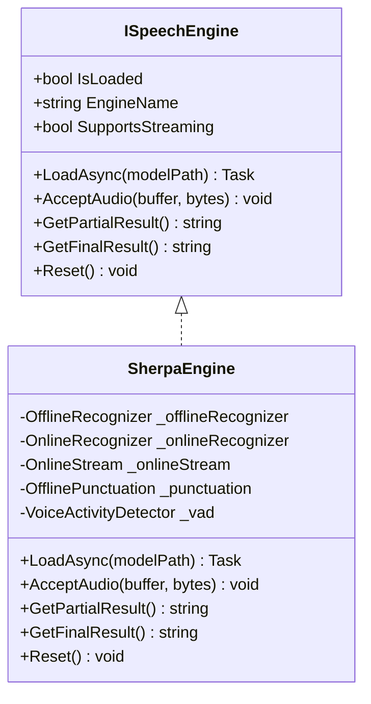
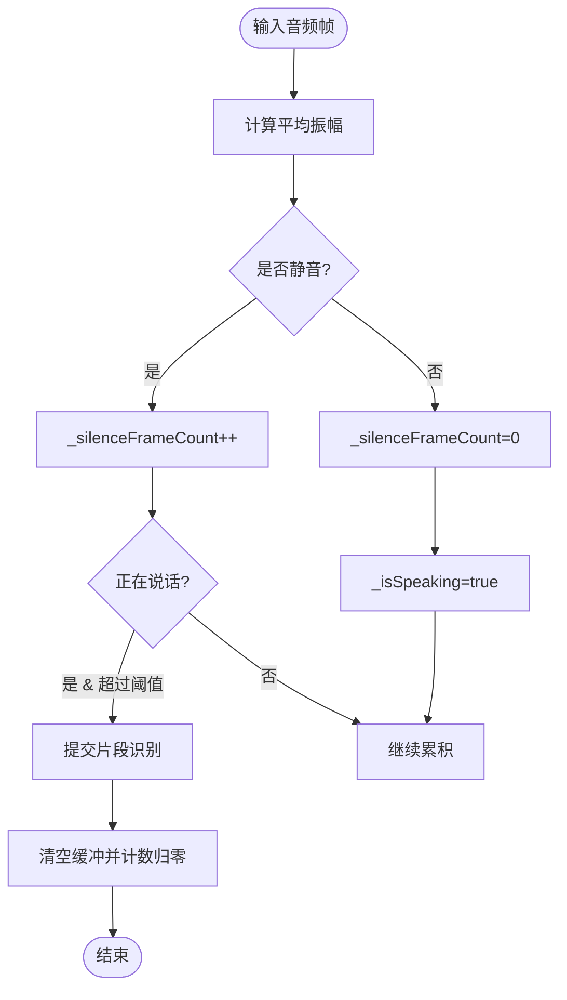
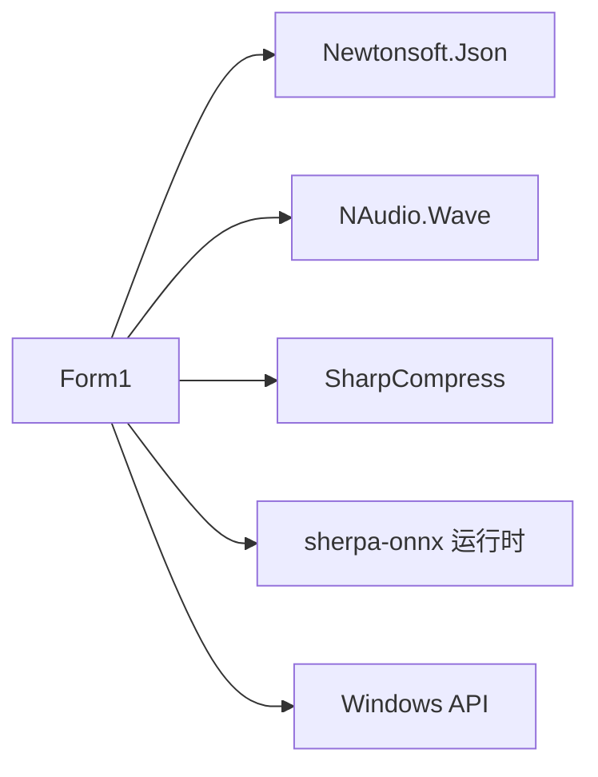

# 智能模型管理系统

<cite>
**本文引用的文件**   
- [Program.cs](file://t9s2t/Program.cs)
- [Form1.cs](file://t9s2t/Form1.cs)
- [EngineDetector.cs](file://t9s2t/Engines/EngineDetector.cs)
- [ISpeechEngine.cs](file://t9s2t/Engines/ISpeechEngine.cs)
- [SherpaEngine.cs](file://t9s2t/Engines/SherpaEngine.cs)
- [VadStreamProcessor.cs](file://t9s2t/Engines/VadStreamProcessor.cs)
- [TarBz2Extractor.cs](file://t9s2t/Engines/TarBz2Extractor.cs)
</cite>

## 目录
1. [简介](#简介)
2. [项目结构](#项目结构)
3. [核心组件](#核心组件)
4. [架构总览](#架构总览)
5. [详细组件分析](#详细组件分析)
6. [依赖关系分析](#依赖关系分析)
7. [性能与扩展性](#性能与扩展性)
8. [故障排查指南](#故障排查指南)
9. [结论](#结论)
10. [附录：新增模型类型与压缩格式支持示例](#附录新增模型类型与压缩格式支持示例)

## 简介
本技术文档面向 t9s2t 的智能模型管理系统，聚焦以下目标：
- 模型自动检测机制：目录结构分析、配置文件解析与引擎类型识别算法
- 远程模型下载流程：models.json 获取、动态列表展示与用户选择交互
- TarBz2 解压处理：SharpCompress 使用、大文件分块解压与进度反馈
- 模型版本管理与更新策略：本地存储结构、版本兼容性与增量更新逻辑
- 错误恢复机制：网络异常处理、断点续传支持与损坏文件修复
- 扩展指南：如何添加新模型类型与更多压缩格式

## 项目结构
系统采用分层组织方式：UI 层（WinForms）负责交互与流程编排；引擎抽象层定义统一接口；具体引擎实现封装 sherpa-onnx；工具层提供压缩解压能力。

图表来源
- [Form1.cs:144-235](file://t9s2t/Form1.cs#L144-L235)
- [EngineDetector.cs:22-121](file://t9s2t/Engines/EngineDetector.cs#L22-L121)
- [ISpeechEngine.cs:1-35](file://t9s2t/Engines/ISpeechEngine.cs#L1-L35)
- [SherpaEngine.cs:14-72](file://t9s2t/Engines/SherpaEngine.cs#L14-L72)
- [VadStreamProcessor.cs:12-33](file://t9s2t/Engines/VadStreamProcessor.cs#L12-L33)
- [TarBz2Extractor.cs:17-96](file://t9s2t/Engines/TarBz2Extractor.cs#L17-L96)

章节来源
- [Program.cs:10-26](file://t9s2t/Program.cs#L10-L26)
- [Form1.cs:144-235](file://t9s2t/Form1.cs#L144-L235)

## 核心组件
- 引擎检测器：通过模型目录中的关键文件组合判断引擎类型，并创建对应实例
- 语音引擎接口：统一加载、音频输入、部分/最终结果、重置等能力
- sherpa-onnx 引擎：支持 SenseVoice、离线 Paraformer、流式 Paraformer，可选标点与 VAD
- VAD 流式处理器：将非流式模型模拟为“静音分段”的类流式体验
- TarBz2 解压器：基于 SharpCompress 原生支持 tar.bz2/tar.gz/zip 等格式

章节来源
- [EngineDetector.cs:22-121](file://t9s2t/Engines/EngineDetector.cs#L22-L121)
- [ISpeechEngine.cs:1-35](file://t9s2t/Engines/ISpeechEngine.cs#L1-L35)
- [SherpaEngine.cs:14-72](file://t9s2t/Engines/SherpaEngine.cs#L14-L72)
- [VadStreamProcessor.cs:12-33](file://t9s2t/Engines/VadStreamProcessor.cs#L12-L33)
- [TarBz2Extractor.cs:17-96](file://t9s2t/Engines/TarBz2Extractor.cs#L17-L96)

## 架构总览
系统启动后，先确保 TLS 安全协议可用，随后初始化 UI、托盘、键盘钩子与麦克风。应用启动时检查引擎 DLL 与模型是否就绪：若缺失则引导下载；若存在则自动检测模型类型并加载引擎。模型管理由主窗体驱动，包括远程配置拉取、动态列表展示、下载与解压、安装到本地 model 目录。

图表来源
- [Program.cs:15-24](file://t9s2t/Program.cs#L15-L24)
- [Form1.cs:151-235](file://t9s2t/Form1.cs#L151-L235)
- [Form1.cs:818-851](file://t9s2t/Form1.cs#L818-L851)
- [Form1.cs:876-966](file://t9s2t/Form1.cs#L876-L966)
- [EngineDetector.cs:27-75](file://t9s2t/Engines/EngineDetector.cs#L27-L75)
- [TarBz2Extractor.cs:30-96](file://t9s2t/Engines/TarBz2Extractor.cs#L30-L96)

## 详细组件分析

### 引擎自动检测与类型识别
- 检测规则优先级
  - 流式 Paraformer：同时存在 encoder.onnx/int8.onnx 与 decoder.onnx/int8.onnx
  - 含 model.onnx/int8.onnx：读取 tokens.txt 行数区分 SenseVoice 与离线 Paraformer-large
  - 仅 encoder.onnx/int8.onnx：非流式 Paraformer
- 创建引擎实例：根据类型返回 SherpaEngine 的不同构造参数（是否流式）

图表来源
- [EngineDetector.cs:27-75](file://t9s2t/Engines/EngineDetector.cs#L27-L75)

章节来源
- [EngineDetector.cs:27-104](file://t9s2t/Engines/EngineDetector.cs#L27-L104)

### 远程模型下载与用户交互
- 远程配置
  - models.json：包含 name/description/url/folder/size_hint/version/published 字段
  - engine.json：包含 engine_runtimes 列表（onnxruntime.dll、sherpa-onnx-c-api.dll）
- 下载流程
  - 优先从远程拉取，失败回退至内置 fallbackJson/fallbackEngineJson
  - 动态弹出 ListView 展示大小/名称/说明，用户选择后执行下载
  - 下载完成后按内容魔数判断 tar.bz2 或 zip，调用相应解压方法
  - 智能定位解压后的模型目录并重命名为 model

图表来源
- [Form1.cs:818-851](file://t9s2t/Form1.cs#L818-L851)
- [Form1.cs:853-966](file://t9s2t/Form1.cs#L853-L966)

章节来源
- [Form1.cs:818-851](file://t9s2t/Form1.cs#L818-L851)
- [Form1.cs:853-966](file://t9s2t/Form1.cs#L853-L966)

### TarBz2 解压与多格式支持
- 使用 SharpCompress 原生库，无需外部工具
- tar.bz2 特殊处理：先解 bzip2 得到 .tar，再解 tar
- 其他格式（zip、tar.gz/tgz）直接解压
- 支持通过扩展名与魔数双重判断

图表来源
- [TarBz2Extractor.cs:17-141](file://t9s2t/Engines/TarBz2Extractor.cs#L17-L141)

章节来源
- [TarBz2Extractor.cs:30-96](file://t9s2t/Engines/TarBz2Extractor.cs#L30-L96)
- [TarBz2Extractor.cs:112-141](file://t9s2t/Engines/TarBz2Extractor.cs#L112-L141)

### 引擎加载与流式识别
- 引擎接口统一了加载、音频输入、部分/最终结果与重置
- sherpa-onnx 引擎内部根据模型类型选择 OfflineRecognizer 或 OnlineRecognizer
- 可选加载标点模型与 VAD 模型，提升可读性与端点检测
- 流式模式支持实时 partial 输出与非流式模式整段识别

图表来源
- [ISpeechEngine.cs:1-35](file://t9s2t/Engines/ISpeechEngine.cs#L1-L35)
- [SherpaEngine.cs:14-72](file://t9s2t/Engines/SherpaEngine.cs#L14-L72)

章节来源
- [ISpeechEngine.cs:1-35](file://t9s2t/Engines/ISpeechEngine.cs#L1-L35)
- [SherpaEngine.cs:57-72](file://t9s2t/Engines/SherpaEngine.cs#L57-L72)
- [SherpaEngine.cs:74-115](file://t9s2t/Engines/SherpaEngine.cs#L74-L115)
- [SherpaEngine.cs:259-347](file://t9s2t/Engines/SherpaEngine.cs#L259-L347)

### VAD 流式处理器（非流式模型的“类流式”体验）
- 基于能量阈值与连续静音帧判定语音段落
- 达到静音阈值后提交已积累片段进行识别，并回调结果
- 支持 partial 进度反馈（可选），用于 UI 状态提示

图表来源
- [VadStreamProcessor.cs:38-101](file://t9s2t/Engines/VadStreamProcessor.cs#L38-L101)

章节来源
- [VadStreamProcessor.cs:38-101](file://t9s2t/Engines/VadStreamProcessor.cs#L38-L101)

## 依赖关系分析
- UI 层依赖网络库（WebClient）、JSON 解析（Newtonsoft.Json）、音频采集（NAudio.Wave）
- 引擎层依赖 sherpa-onnx 运行时（onnxruntime.dll、sherpa-onnx-c-api.dll）
- 解压层依赖 SharpCompress
- 系统 API 用于键盘钩子、剪贴板与窗口控制

图表来源
- [Form1.cs:1-17](file://t9s2t/Form1.cs#L1-L17)
- [TarBz2Extractor.cs:1-9](file://t9s2t/Engines/TarBz2Extractor.cs#L1-L9)

章节来源
- [Form1.cs:1-17](file://t9s2t/Form1.cs#L1-L17)
- [TarBz2Extractor.cs:1-9](file://t9s2t/Engines/TarBz2Extractor.cs#L1-L9)

## 性能与扩展性
- 流式识别路径（Paraformer 流式）减少延迟，适合边说边出字
- 非流式路径（SenseVoice/Paraformer-large）在静音分段或录音结束后一次性识别
- 解压采用流式拷贝（bzip2 -> tar -> 目录），避免一次性加载大文件到内存
- 可扩展点
  - 新增引擎类型：在 EngineDetector 中增加文件特征判断与 CreateEngine 分支
  - 新增压缩格式：在 TarBz2Extractor 中扩展 IsSupportedArchive 与 Extract 分支
  - 新增远程配置字段：在 ModelInfo/EngineDllInfo 中扩展属性并在 JSON 反序列化中使用

[本节为通用指导，不直接分析具体文件]

## 故障排查指南
- 网络问题
  - 现象：无法获取 models.json/engine.json
  - 处理：自动回退到内置 fallback 列表；检查 TLS 设置与代理
  - 参考位置
    - [Form1.cs:818-851](file://t9s2t/Form1.cs#L818-L851)
    - [Form1.cs:569-599](file://t9s2t/Form1.cs#L569-L599)
- 下载不完整或中断
  - 现象：临时文件存在但体积为 0 或损坏
  - 处理：删除空文件并提示重试；建议在网络稳定环境重新下载
  - 参考位置
    - [Form1.cs:554-566](file://t9s2t/Form1.cs#L554-L566)
    - [Form1.cs:958-966](file://t9s2t/Form1.cs#L958-L966)
- 解压失败
  - 现象：tar.bz2 解压报错或缺少必要工具
  - 处理：确认 SharpCompress 引用正确；Windows 10+ 自带 tar.exe 可辅助；必要时安装 7-Zip
  - 参考位置
    - [TarBz2Extractor.cs:30-96](file://t9s2t/Engines/TarBz2Extractor.cs#L30-L96)
    - [Form1.cs:960-966](file://t9s2t/Form1.cs#L960-L966)
- 模型目录结构不匹配
  - 现象：解压后未找到有效模型目录
  - 处理：检查压缩包内是否包含 model.int8.onnx/encoder.int8.onnx/tokens.txt 等关键文件
  - 参考位置
    - [Form1.cs:928-955](file://t9s2t/Form1.cs#L928-L955)
- 引擎加载失败
  - 现象：无法识别模型类型或加载异常
  - 处理：查看调试输出；确认 tokens.txt 存在且行数合理；验证 onnx 模型完整性
  - 参考位置
    - [EngineDetector.cs:27-75](file://t9s2t/Engines/EngineDetector.cs#L27-L75)
    - [SherpaEngine.cs:74-115](file://t9s2t/Engines/SherpaEngine.cs#L74-L115)

章节来源
- [Form1.cs:818-851](file://t9s2t/Form1.cs#L818-L851)
- [Form1.cs:569-599](file://t9s2t/Form1.cs#L569-L599)
- [Form1.cs:554-566](file://t9s2t/Form1.cs#L554-L566)
- [Form1.cs:958-966](file://t9s2t/Form1.cs#L958-L966)
- [TarBz2Extractor.cs:30-96](file://t9s2t/Engines/TarBz2Extractor.cs#L30-L96)
- [Form1.cs:928-955](file://t9s2t/Form1.cs#L928-L955)
- [EngineDetector.cs:27-75](file://t9s2t/Engines/EngineDetector.cs#L27-L75)
- [SherpaEngine.cs:74-115](file://t9s2t/Engines/SherpaEngine.cs#L74-L115)

## 结论
t9s2t 的智能模型管理系统以清晰的职责划分实现了模型自动检测、远程配置拉取、动态下载与解压、以及多种引擎的统一接入。通过流式与非流式双路径识别，兼顾低延迟与高准确率。系统在错误恢复方面提供了回退机制与友好的用户提示，具备良好的可维护性与扩展性。

[本节为总结性内容，不直接分析具体文件]

## 附录：新增模型类型与压缩格式支持示例

### 新增模型类型（以示例形式说明步骤）
- 在引擎检测器中添加新的文件特征判断与类型枚举值
- 在 CreateEngine 中为新类型返回对应的引擎实例（如 SherpaEngine 的新构造参数）
- 在 UI 层 Ensure 新类型的加载与提示文案

参考位置
- [EngineDetector.cs:10-17](file://t9s2t/Engines/EngineDetector.cs#L10-L17)
- [EngineDetector.cs:27-75](file://t9s2t/Engines/EngineDetector.cs#L27-L75)
- [EngineDetector.cs:80-104](file://t9s2t/Engines/EngineDetector.cs#L80-L104)

章节来源
- [EngineDetector.cs:10-17](file://t9s2t/Engines/EngineDetector.cs#L10-L17)
- [EngineDetector.cs:27-75](file://t9s2t/Engines/EngineDetector.cs#L27-L75)
- [EngineDetector.cs:80-104](file://t9s2t/Engines/EngineDetector.cs#L80-L104)

### 新增压缩格式支持（以示例形式说明步骤）
- 扩展 IsSupportedArchive 以识别新扩展名
- 在 Extract 中增加新格式的分支逻辑（例如 rar、xz 等）
- 在 UI 层下载完成后调用统一的解压入口

参考位置
- [TarBz2Extractor.cs:132-141](file://t9s2t/Engines/TarBz2Extractor.cs#L132-L141)
- [TarBz2Extractor.cs:30-96](file://t9s2t/Engines/TarBz2Extractor.cs#L30-L96)

章节来源
- [TarBz2Extractor.cs:132-141](file://t9s2t/Engines/TarBz2Extractor.cs#L132-L141)
- [TarBz2Extractor.cs:30-96](file://t9s2t/Engines/TarBz2Extractor.cs#L30-L96)

### 远程配置字段扩展（models.json）
- 在 ModelInfo 中新增字段（如 tags、requirements）
- 在 FetchModelsAsync 中解析并过滤新字段
- 在 UI 列表中展示新信息

参考位置
- [Form1.cs:130-142](file://t9s2t/Form1.cs#L130-L142)
- [Form1.cs:818-851](file://t9s2t/Form1.cs#L818-L851)

章节来源
- [Form1.cs:130-142](file://t9s2t/Form1.cs#L130-L142)
- [Form1.cs:818-851](file://t9s2t/Form1.cs#L818-L851)