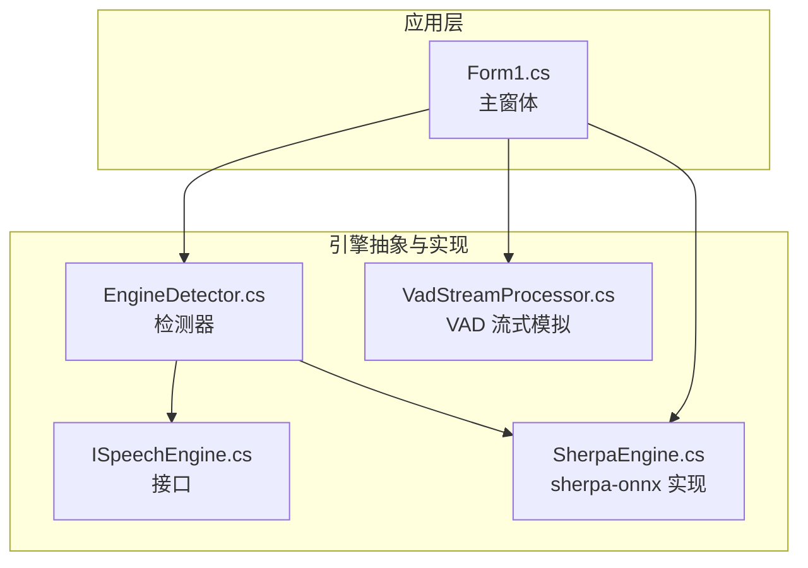
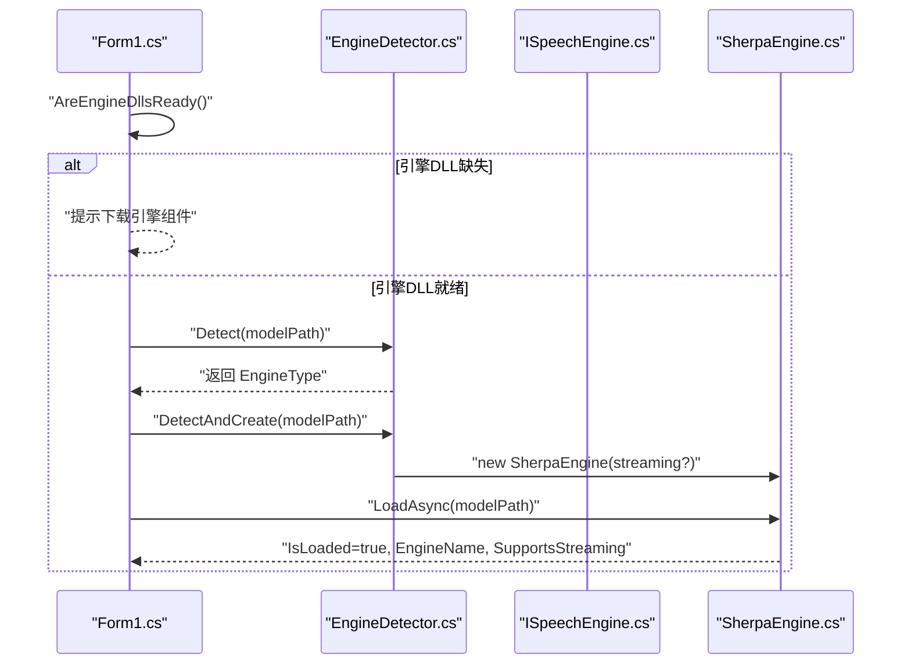
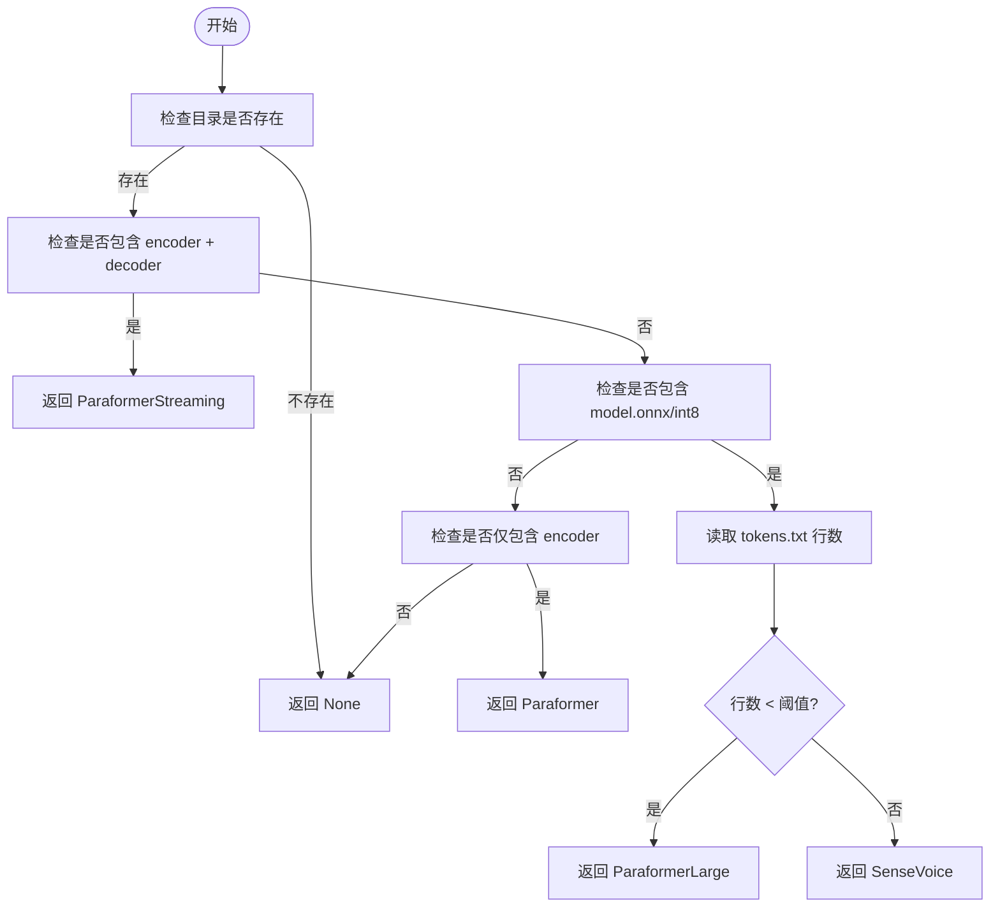
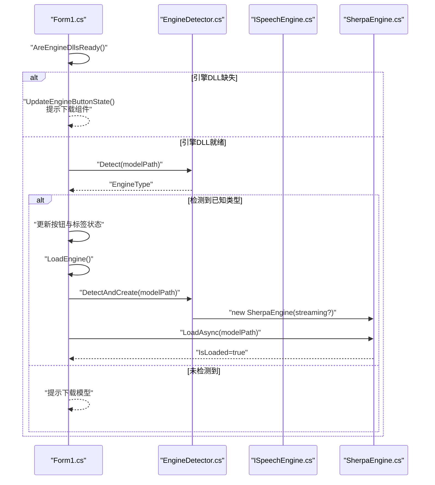
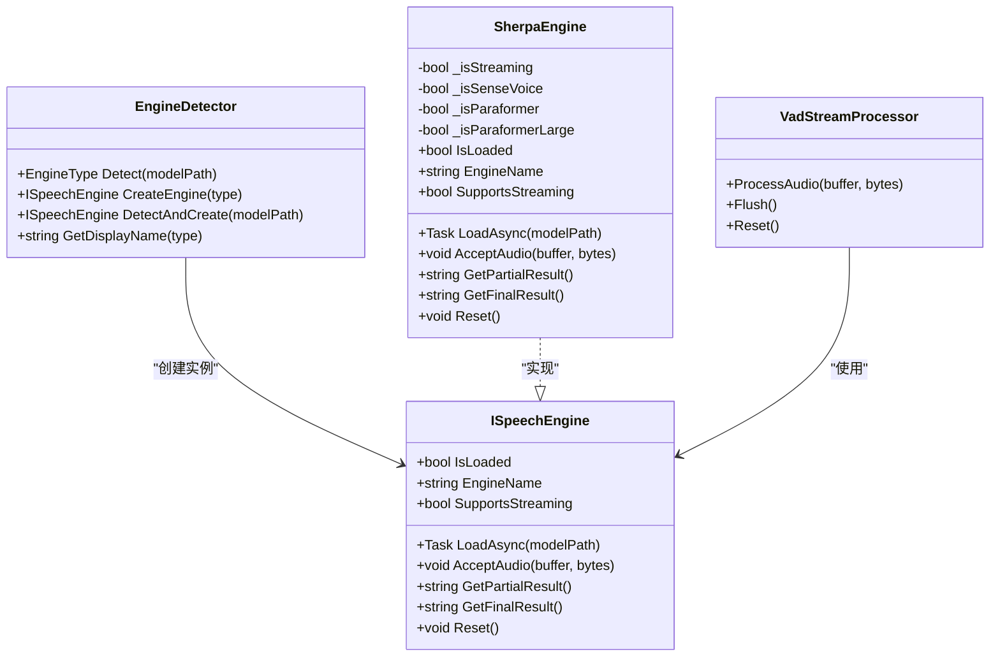

# 模型自动检测机制

<cite>
**本文引用的文件**
- [EngineDetector.cs](file://t9s2t/Engines/EngineDetector.cs)
- [ISpeechEngine.cs](file://t9s2t/Engines/ISpeechEngine.cs)
- [SherpaEngine.cs](file://t9s2t/Engines/SherpaEngine.cs)
- [VadStreamProcessor.cs](file://t9s2t/Engines/VadStreamProcessor.cs)
- [Form1.cs](file://t9s2t/Form1.cs)
</cite>

## 目录
1. [简介](#简介)
2. [项目结构](#项目结构)
3. [核心组件](#核心组件)
4. [架构总览](#架构总览)
5. [详细组件分析](#详细组件分析)
6. [依赖关系分析](#依赖关系分析)
7. [性能考量](#性能考量)
8. [故障排查指南](#故障排查指南)
9. [结论](#结论)
10. [附录：扩展新模型类型支持](#附录扩展新模型类型支持)

## 简介
本技术文档聚焦于 t9s2t 的“模型自动检测机制”，系统性阐述 EngineDetector.Detect() 的实现原理、支持的模型格式与特征匹配规则、AutoCheckModel() 的工作流程（引擎 DLL 检查、模型存在性验证、状态更新）、EngineType 枚举定义及错误处理策略，并提供扩展新模型类型的实践指引。目标是帮助开发者快速理解并安全地扩展系统能力。

## 项目结构
围绕模型自动检测的核心代码位于 Engines 命名空间下的若干类中，UI 层在 Form1.cs 中编排检测与加载流程。关键文件如下：
- EngineDetector.cs：引擎类型枚举与自动检测逻辑
- ISpeechEngine.cs：语音识别引擎抽象接口
- SherpaEngine.cs：sherpa-onnx 引擎实现（含模型类型二次判定与加载）
- VadStreamProcessor.cs：基于 VAD 的流式模拟处理器
- Form1.cs：应用入口，负责引擎 DLL 检查、模型检测、下载与 UI 状态更新

图表来源
- [EngineDetector.cs:1-121](file://t9s2t/Engines/EngineDetector.cs#L1-L121)
- [ISpeechEngine.cs:1-35](file://t9s2t/Engines/ISpeechEngine.cs#L1-L35)
- [SherpaEngine.cs:1-608](file://t9s2t/Engines/SherpaEngine.cs#L1-L608)
- [VadStreamProcessor.cs:1-162](file://t9s2t/Engines/VadStreamProcessor.cs#L1-L162)
- [Form1.cs:608-721](file://t9s2t/Form1.cs#L608-L721)

章节来源
- [EngineDetector.cs:1-121](file://t9s2t/Engines/EngineDetector.cs#L1-L121)
- [ISpeechEngine.cs:1-35](file://t9s2t/Engines/ISpeechEngine.cs#L1-L35)
- [SherpaEngine.cs:1-608](file://t9s2t/Engines/SherpaEngine.cs#L1-L608)
- [VadStreamProcessor.cs:1-162](file://t9s2t/Engines/VadStreamProcessor.cs#L1-L162)
- [Form1.cs:608-721](file://t9s2t/Form1.cs#L608-L721)

## 核心组件
- EngineType 枚举：定义当前支持的引擎类型标识符，包括 SenseVoice、Paraformer、ParaformerLarge、ParaformerStreaming 等。
- EngineDetector：提供 Detect() 方法，通过模型目录中的特征文件组合进行引擎类型识别；并提供 CreateEngine() 和 DetectAndCreate() 辅助方法。
- ISpeechEngine：统一引擎接口，屏蔽不同引擎差异，暴露加载、音频输入、结果获取、重置等方法。
- SherpaEngine：sherpa-onnx 引擎的具体实现，内部再次对模型类型进行细化判断，并按类型加载离线或流式识别器，同时可选加载标点恢复与 VAD 模型。
- VadStreamProcessor：将非流式模型（如 SenseVoice）包装为“近似流式”体验，依据静音段落切分提交识别。

章节来源
- [EngineDetector.cs:10-17](file://t9s2t/Engines/EngineDetector.cs#L10-L17)
- [EngineDetector.cs:27-104](file://t9s2t/Engines/EngineDetector.cs#L27-L104)
- [ISpeechEngine.cs:8-33](file://t9s2t/Engines/ISpeechEngine.cs#L8-L33)
- [SherpaEngine.cs:14-72](file://t9s2t/Engines/SherpaEngine.cs#L14-L72)
- [VadStreamProcessor.cs:12-33](file://t9s2t/Engines/VadStreamProcessor.cs#L12-L33)

## 架构总览
下图展示了从应用启动到模型检测、引擎创建与加载的整体流程，以及各组件之间的交互关系。

图表来源
- [Form1.cs:608-721](file://t9s2t/Form1.cs#L608-L721)
- [EngineDetector.cs:27-104](file://t9s2t/Engines/EngineDetector.cs#L27-L104)
- [SherpaEngine.cs:57-72](file://t9s2t/Engines/SherpaEngine.cs#L57-L72)

## 详细组件分析

### EngineDetector.Detect() 实现原理
Detect() 通过“特征文件组合 + tokens.txt 行数阈值”的策略识别引擎类型，优先级如下：
1. 流式 Paraformer：当目录中存在 encoder.onnx/encoder.int8.onnx 且 decoder.onnx/decoder.int8.onnx 时，判定为流式 Paraformer。
2. 单模型 model.onnx/model.int8.onnx：进一步读取 tokens.txt 的行数，若小于阈值则判定为离线 Paraformer-large，否则为 SenseVoice。
3. 仅 encoder.onnx/encoder.int8.onnx：判定为非流式 Paraformer。
4. 其他情况：返回 None。

该算法的时间复杂度主要受 tokens.txt 读取影响，通常为 O(N)，N 为词汇表行数；其余为常数级文件存在性检查。

图表来源
- [EngineDetector.cs:27-75](file://t9s2t/Engines/EngineDetector.cs#L27-L75)

章节来源
- [EngineDetector.cs:27-75](file://t9s2t/Engines/EngineDetector.cs#L27-L75)

### 支持的模型格式与特征文件匹配规则
- sherpa-onnx-sensevoice（多语言大词汇）
  - 特征文件：model.onnx 或 model.int8.onnx，且 tokens.txt 行数较大（大于阈值）
- sherpa-onnx-paraformer-large（中文大模型，离线）
  - 特征文件：model.onnx 或 model.int8.onnx，且 tokens.txt 行数较小（小于阈值）
- sherpa-onnx-paraformer（非流式）
  - 特征文件：encoder.onnx 或 encoder.int8.onnx，无 decoder
- sherpa-onnx-paraformer（流式）
  - 特征文件：encoder.onnx/encoder.int8.onnx 与 decoder.onnx/decoder.int8.onnx 同时存在

注意：tokens.txt 行数是区分 SenseVoice 与 Paraformer-large 的关键指标。

章节来源
- [EngineDetector.cs:32-71](file://t9s2t/Engines/EngineDetector.cs#L32-L71)
- [SherpaEngine.cs:74-115](file://t9s2t/Engines/SherpaEngine.cs#L74-L115)

### AutoCheckModel() 工作流程
AutoCheckModel() 负责“引擎 DLL 检查 → 模型检测 → 状态更新 → 引擎加载”的完整链路：
- 先调用 AreEngineDllsReady() 检查 onnxruntime.dll 与 sherpa-onnx-c-api.dll 是否存在且有效
- 若缺失，更新按钮状态并提示用户下载引擎组件
- 若就绪，调用 EngineDetector.Detect(modelPath) 进行模型类型检测
- 根据检测结果设置 UI 状态（启用/禁用下载与删除按钮、显示引擎名称），并调用 LoadEngine() 完成引擎实例化与加载
- 若无法识别模型类型，提示重新下载

图表来源
- [Form1.cs:608-721](file://t9s2t/Form1.cs#L608-L721)
- [EngineDetector.cs:27-104](file://t9s2t/Engines/EngineDetector.cs#L27-L104)
- [SherpaEngine.cs:57-72](file://t9s2t/Engines/SherpaEngine.cs#L57-L72)

章节来源
- [Form1.cs:608-721](file://t9s2t/Form1.cs#L608-L721)

### EngineType 枚举定义与标识符
- None：未检测到或无效
- SenseVoice：sherpa-onnx，非流式，多语言大词汇
- Paraformer：sherpa-onnx，非流式，仅 encoder
- ParaformerLarge：sherpa-onnx，非流式，中文大模型（离线）
- ParaformerStreaming：sherpa-onnx，流式，encoder + decoder

章节来源
- [EngineDetector.cs:10-17](file://t9s2t/Engines/EngineDetector.cs#L10-L17)

### 错误处理机制
- 目录不存在或路径为空：Detect() 直接返回 None
- tokens.txt 读取异常：捕获异常后按默认分支处理（不中断整体流程）
- 缺少必要文件（如 tokens.txt）：在 SherpaEngine 加载阶段抛出 FileNotFoundException，由上层捕获并提示
- 引擎 DLL 缺失或不完整：UI 层提示下载并阻止继续检测
- 模型类型无法识别：UI 层提示重新下载模型

章节来源
- [EngineDetector.cs:27-75](file://t9s2t/Engines/EngineDetector.cs#L27-L75)
- [SherpaEngine.cs:129-134](file://t9s2t/Engines/SherpaEngine.cs#L129-L134)
- [SherpaEngine.cs:159-167](file://t9s2t/Engines/SherpaEngine.cs#L159-L167)
- [SherpaEngine.cs:190-196](file://t9s2t/Engines/SherpaEngine.cs#L190-L196)
- [Form1.cs:608-721](file://t9s2t/Form1.cs#L608-L721)

## 依赖关系分析
- 耦合与内聚
  - EngineDetector 与 ISpeechEngine 松耦合，仅通过工厂方法创建具体引擎实例
  - SherpaEngine 实现 ISpeechEngine，内部依赖 sherpa-onnx 运行时（通过外部 DLL）
  - Form1 作为编排层，协调检测、下载、加载与 UI 状态更新
- 外部依赖
  - onnxruntime.dll、sherpa-onnx-c-api.dll 为必需运行时
  - 可选附加模型：punc.onnx/punc.int8.onnx（标点恢复）、vad.onnx（语音活动检测）

图表来源
- [ISpeechEngine.cs:8-33](file://t9s2t/Engines/ISpeechEngine.cs#L8-L33)
- [EngineDetector.cs:27-104](file://t9s2t/Engines/EngineDetector.cs#L27-L104)
- [SherpaEngine.cs:14-72](file://t9s2t/Engines/SherpaEngine.cs#L14-L72)
- [VadStreamProcessor.cs:12-33](file://t9s2t/Engines/VadStreamProcessor.cs#L12-L33)

章节来源
- [ISpeechEngine.cs:8-33](file://t9s2t/Engines/ISpeechEngine.cs#L8-L33)
- [EngineDetector.cs:27-104](file://t9s2t/Engines/EngineDetector.cs#L27-L104)
- [SherpaEngine.cs:14-72](file://t9s2t/Engines/SherpaEngine.cs#L14-L72)
- [VadStreamProcessor.cs:12-33](file://t9s2t/Engines/VadStreamProcessor.cs#L12-L33)

## 性能考量
- 检测阶段
  - 文件存在性检查为常数时间
  - tokens.txt 读取为线性时间，建议仅在必要时执行（当前实现已按需读取）
- 加载阶段
  - sherpa-onnx 初始化涉及 ONNX 模型加载，耗时取决于模型大小与硬件
  - 可选标点与 VAD 模型加载会增加额外开销，但可提升用户体验
- 流式处理
  - 流式模式减少等待时间，适合实时场景
  - 非流式模式需累积整段音频，延迟较高但稳定性好

[本节为通用指导，无需源码引用]

## 故障排查指南
- 引擎 DLL 缺失或不完整
  - 现象：界面提示“缺少引擎组件”，按钮变为橙色“下载引擎组件”
  - 处理：点击按钮下载 onnxruntime.dll 与 sherpa-onnx-c-api.dll，完成后自动重试检测
- 模型未找到或类型无法识别
  - 现象：界面提示“模型未找到”或“无法识别模型类型”
  - 处理：确认 modelPath 下存在正确的特征文件组合；必要时重新下载官方模型包
- tokens.txt 缺失或损坏
  - 现象：加载时报错“缺少 tokens.txt 文件”
  - 处理：确保模型包中包含 tokens.txt 且未被破坏
- 标点或 VAD 模型加载失败
  - 现象：日志提示“标点模型加载失败”或“VAD 模型加载失败”
  - 处理：这些为可选功能，不影响基础识别；如需启用，请放置正确的 punc.onnx/vad.onnx

章节来源
- [Form1.cs:468-505](file://t9s2t/Form1.cs#L468-L505)
- [Form1.cs:608-721](file://t9s2t/Form1.cs#L608-L721)
- [SherpaEngine.cs:259-290](file://t9s2t/Engines/SherpaEngine.cs#L259-L290)
- [SherpaEngine.cs:314-347](file://t9s2t/Engines/SherpaEngine.cs#L314-L347)

## 结论
t9s2t 的模型自动检测机制以“特征文件组合 + tokens.txt 行数阈值”为核心，结合 UI 层的引擎 DLL 检查与状态管理，实现了开箱即用的多引擎支持与良好的用户体验。通过清晰的接口抽象与可扩展的检测策略，新增模型类型只需遵循约定并在检测与加载两处补充相应逻辑即可。

[本节为总结，无需源码引用]

## 附录：扩展新模型类型支持
以下示例展示如何添加一种新的模型类型（例如“sherpa-onnx-whisper-zh”）。请按步骤修改检测与加载逻辑，并确保 UI 层正确显示。

步骤一：扩展 EngineType 枚举
- 在 EngineType 中添加新成员，例如 WhisperZh
- 在 GetDisplayName() 中为新类型提供显示名称

章节来源
- [EngineDetector.cs:10-17](file://t9s2t/Engines/EngineDetector.cs#L10-L17)
- [EngineDetector.cs:109-119](file://t9s2t/Engines/EngineDetector.cs#L109-L119)

步骤二：完善 Detect() 识别策略
- 在 Detect() 中增加对新模型的特征文件匹配条件（例如 whisper.zh.onnx 或特定 tokens 行数范围）
- 保持优先级顺序合理，避免与其他类型冲突

章节来源
- [EngineDetector.cs:27-75](file://t9s2t/Engines/EngineDetector.cs#L27-L75)

步骤三：在 CreateEngine() 中映射到新引擎实例
- 为新类型返回合适的 SherpaEngine 构造参数（streaming 标志）
- 若需要专用引擎实现，可在 ISpeechEngine 基础上新增实现类并在此处返回

章节来源
- [EngineDetector.cs:80-95](file://t9s2t/Engines/EngineDetector.cs#L80-L95)

步骤四：在 SherpaEngine 中实现加载逻辑
- 在 DetectModelType() 中增加对新模型的二次判定
- 在 LoadOfflineModel()/LoadOnlineModel() 中新增对应加载分支，配置相应的模型路径与参数
- 确保必要的配置文件（如 tokens.txt）存在性校验

章节来源
- [SherpaEngine.cs:74-115](file://t9s2t/Engines/SherpaEngine.cs#L74-L115)
- [SherpaEngine.cs:119-216](file://t9s2t/Engines/SherpaEngine.cs#L119-L216)
- [SherpaEngine.cs:220-255](file://t9s2t/Engines/SherpaEngine.cs#L220-L255)

步骤五：UI 层适配（可选）
- 若新类型需要特殊行为（如强制流式或非流式），可在 LoadEngine() 中针对 EngineType 做差异化处理
- 更新状态提示与按钮行为，保证用户反馈一致

章节来源
- [Form1.cs:645-721](file://t9s2t/Form1.cs#L645-L721)