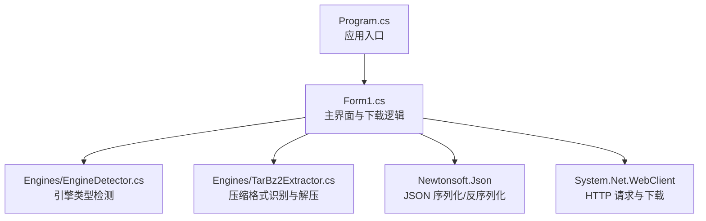
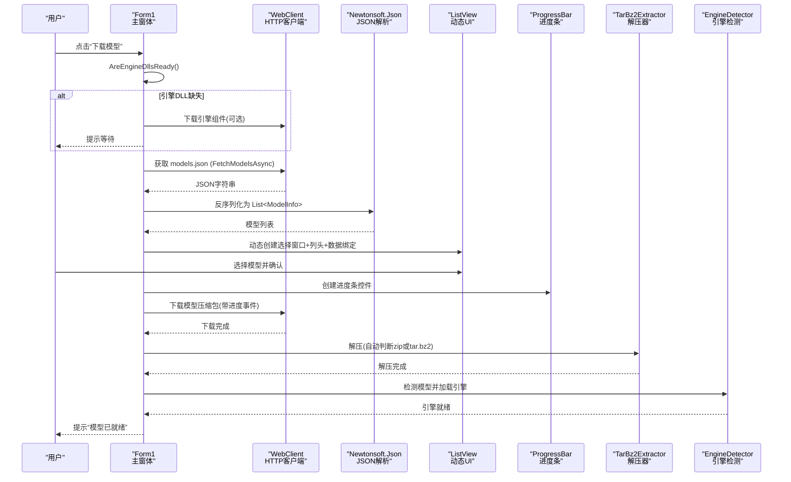
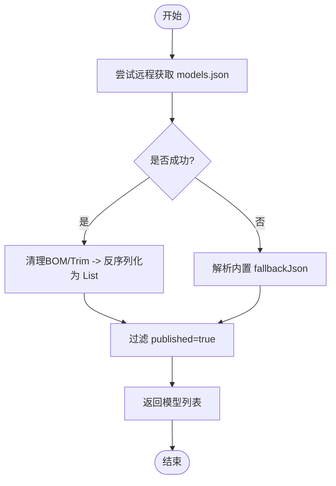
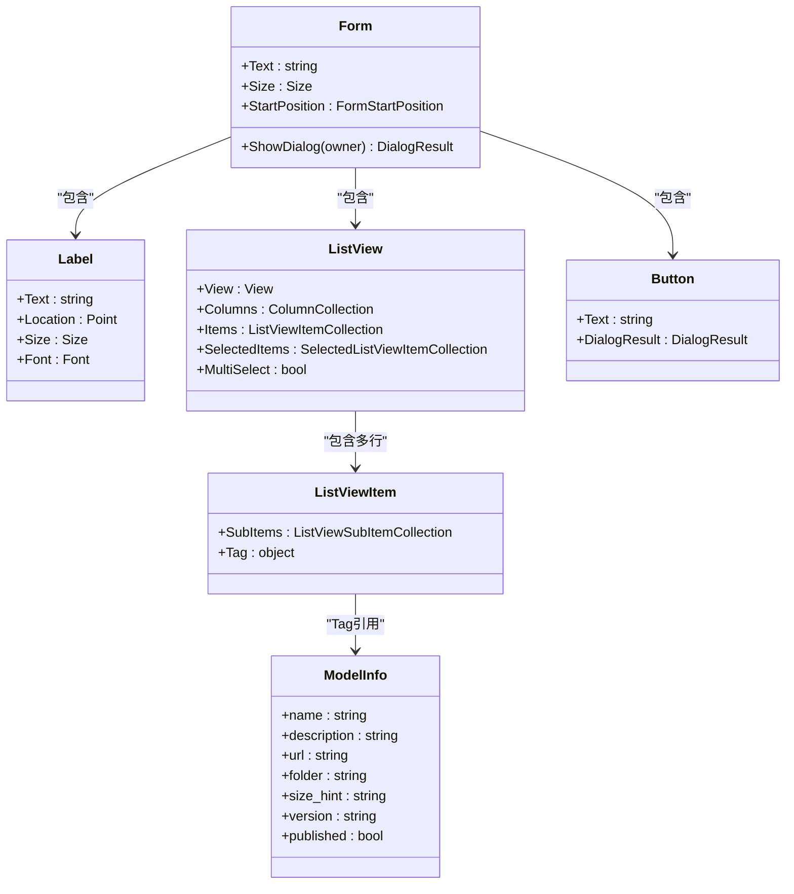
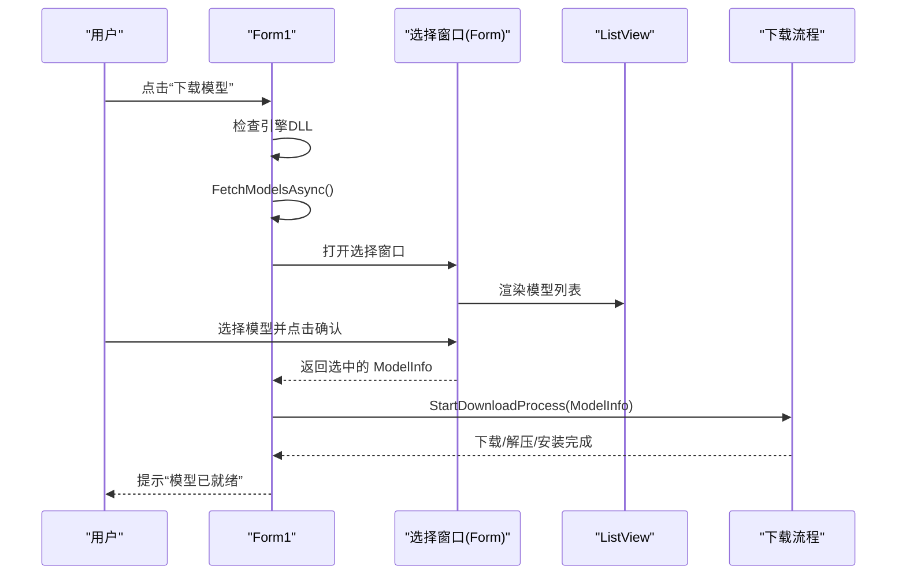
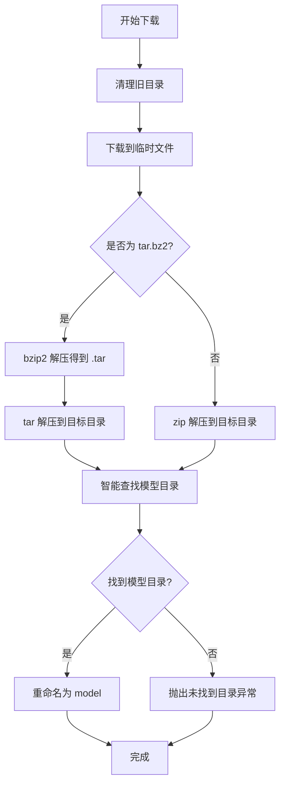
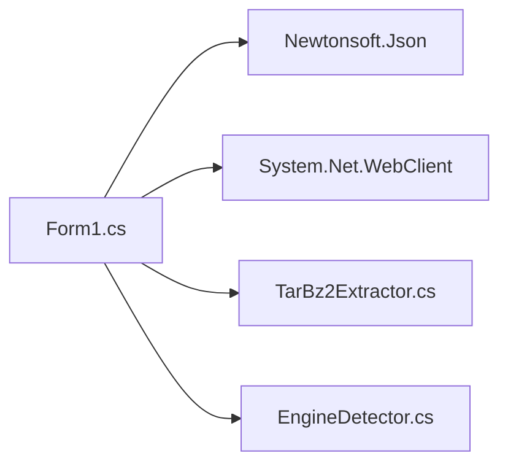

# 远程模型下载系统

<cite>
**本文引用的文件**   
- [Form1.cs](file://t9s2t/Form1.cs)
- [Program.cs](file://t9s2t/Program.cs)
- [EngineDetector.cs](file://t9s2t/Engines/EngineDetector.cs)
- [TarBz2Extractor.cs](file://t9s2t/Engines/TarBz2Extractor.cs)
</cite>

## 目录
1. [简介](#简介)
2. [项目结构](#项目结构)
3. [核心组件](#核心组件)
4. [架构总览](#架构总览)
5. [详细组件分析](#详细组件分析)
6. [依赖关系分析](#依赖关系分析)
7. [性能与可靠性](#性能与可靠性)
8. [故障排查指南](#故障排查指南)
9. [结论](#结论)
10. [附录：扩展指南](#附录扩展指南)

## 简介
本技术文档聚焦 t9s2t 的“远程模型下载系统”，围绕以下目标展开：
- 深入解释 FetchModelsAsync() 方法的工作原理，包括 models.json 配置获取、JSON 解析与 ModelInfo 对象映射。
- 详细说明动态模型列表生成过程（ListView 动态创建、列头设置、数据绑定）。
- 阐述用户交互流程（选择窗口创建、用户选择与确认）。
- 介绍网络请求处理（WebClient 使用、User-Agent 设置、异常处理机制）。
- 说明备用方案 fallbackJson 的作用与使用场景。
- 详细介绍下载进度显示、错误提示和用户反馈机制。
- 提供扩展新模型源和自定义下载行为的实践指引。

## 项目结构
远程模型下载相关代码主要位于主窗体 Form1.cs 中，配合引擎检测与解压工具类完成端到端流程。

图表来源
- [Program.cs:1-26](file://t9s2t/Program.cs#L1-L26)
- [Form1.cs:1-1318](file://t9s2t/Form1.cs#L1-L1318)
- [EngineDetector.cs:1-122](file://t9s2t/Engines/EngineDetector.cs#L1-L122)
- [TarBz2Extractor.cs:1-143](file://t9s2t/Engines/TarBz2Extractor.cs#L1-L143)

章节来源
- [Program.cs:1-26](file://t9s2t/Program.cs#L1-L26)
- [Form1.cs:1-1318](file://t9s2t/Form1.cs#L1-L1318)

## 核心组件
- 模型信息模型 ModelInfo：承载远程 models.json 中的字段，用于 UI 展示与下载流程。
- 远程配置获取 FetchModelsAsync()：负责从远程 models.json 拉取并解析模型清单，失败时回退到内置 fallbackJson。
- 动态模型选择窗口：在运行时动态创建包含 ListView 的选择对话框，支持列头与数据绑定。
- 下载流程 StartDownloadProcess()/DownloadWithProgress()：基于 WebClient 实现带进度的下载、解压与安装。
- 引擎检测 EngineDetector：根据模型目录结构自动识别引擎类型，辅助下载后状态刷新。
- 解压工具 TarBz2Extractor：统一处理 zip/tar.bz2/tar.gz 等格式，无需外部工具。

章节来源
- [Form1.cs:129-142](file://t9s2t/Form1.cs#L129-L142)
- [Form1.cs:818-851](file://t9s2t/Form1.cs#L818-L851)
- [Form1.cs:724-817](file://t9s2t/Form1.cs#L724-L817)
- [Form1.cs:853-966](file://t9s2t/Form1.cs#L853-L966)
- [EngineDetector.cs:1-122](file://t9s2t/Engines/EngineDetector.cs#L1-L122)
- [TarBz2Extractor.cs:1-143](file://t9s2t/Engines/TarBz2Extractor.cs#L1-L143)

## 架构总览
下图展示了从点击“下载模型”按钮到模型就绪的完整调用链与数据流。

图表来源
- [Form1.cs:724-817](file://t9s2t/Form1.cs#L724-L817)
- [Form1.cs:818-851](file://t9s2t/Form1.cs#L818-L851)
- [Form1.cs:853-966](file://t9s2t/Form1.cs#L853-L966)
- [TarBz2Extractor.cs:1-143](file://t9s2t/Engines/TarBz2Extractor.cs#L1-L143)
- [EngineDetector.cs:1-122](file://t9s2t/Engines/EngineDetector.cs#L1-L122)

## 详细组件分析

### 1) FetchModelsAsync() 工作原理
- 网络请求
  - 使用 System.Net.WebClient 异步获取远程 models.json。
  - 设置 User-Agent 为浏览器标识，便于兼容服务端策略。
  - 设置编码为 UTF-8，避免中文乱码。
- JSON 清洗与解析
  - 去除可能的 BOM（\uFEFF）与首尾空白。
  - 使用 Newtonsoft.Json 将 JSON 数组反序列化为 List<ModelInfo>。
- 过滤与返回
  - 仅保留 published=true 的条目，屏蔽测试/占位项。
  - 成功则返回模型列表；失败则进入备用分支。
- 备用方案 fallbackJson
  - 当网络不可用或远程链接失效时，直接解析内嵌的 fallbackJson 字符串，保证可用性。
  - 同样执行 published 过滤，确保 UI 只显示有效模型。

图表来源
- [Form1.cs:818-851](file://t9s2t/Form1.cs#L818-L851)

章节来源
- [Form1.cs:818-851](file://t9s2t/Form1.cs#L818-L851)

### 2) 动态模型列表生成（ListView 动态创建与数据绑定）
- 动态创建选择窗口
  - 新建 Form，设置标题、尺寸、固定边框、居中显示等属性。
- 动态创建 ListView
  - 设置 View=Details、FullRowSelect、GridLines、MultiSelect=false 等。
  - 添加三列：“大小”、“名称”、“说明”。
- 数据绑定
  - 遍历 List<ModelInfo>，逐行创建 ListViewItem，并将原始 ModelInfo 存入 Tag，便于后续取值。
  - 默认选中第一项，提升用户体验。
- 用户交互
  - 添加“开始下载选中模型”按钮，绑定 OK 结果。
  - 用户确认后，从 SelectedItems[0].Tag 取出 ModelInfo，进入下载流程。

图表来源
- [Form1.cs:751-817](file://t9s2t/Form1.cs#L751-L817)
- [Form1.cs:129-142](file://t9s2t/Form1.cs#L129-L142)

章节来源
- [Form1.cs:751-817](file://t9s2t/Form1.cs#L751-L817)
- [Form1.cs:129-142](file://t9s2t/Form1.cs#L129-L142)

### 3) 用户交互流程（选择与确认）
- 触发点：主界面“下载模型”按钮点击事件。
- 前置检查：若引擎 DLL 缺失，优先下载引擎组件，再自动继续模型检测。
- 获取模型列表：调用 FetchModelsAsync()，失败则弹窗提示并恢复按钮状态。
- 弹出选择窗口：动态创建并 ShowDialog，用户选择后点击确认。
- 启动下载：StartDownloadProcess(selectedModel)，完成后自动刷新引擎状态。

图表来源
- [Form1.cs:724-817](file://t9s2t/Form1.cs#L724-L817)
- [Form1.cs:853-966](file://t9s2t/Form1.cs#L853-L966)

章节来源
- [Form1.cs:724-817](file://t9s2t/Form1.cs#L724-L817)
- [Form1.cs:853-966](file://t9s2t/Form1.cs#L853-L966)

### 4) 网络请求处理（WebClient、User-Agent、异常处理）
- TLS 安全协议
  - 程序启动即设置 ServicePointManager.SecurityProtocol 为 TLS1.2/1.1/TLS，确保所有网络请求兼容现代服务器。
- WebClient 使用
  - 列表获取：设置 User-Agent 为浏览器标识，UTF-8 编码，异步 DownloadStringTaskAsync。
  - 模型下载：设置更完整的 User-Agent 与 Accept 头，异步 DownloadFileTaskAsync，并订阅 DownloadProgressChanged 事件。
- 异常处理
  - 列表获取失败：记录日志并回退到 fallbackJson。
  - 下载/解压失败：捕获异常，弹出友好提示，恢复按钮状态，必要时清理不完整文件。

章节来源
- [Program.cs:16-24](file://t9s2t/Program.cs#L16-L24)
- [Form1.cs:818-851](file://t9s2t/Form1.cs#L818-L851)
- [Form1.cs:876-966](file://t9s2t/Form1.cs#L876-L966)

### 5) 备用方案 fallbackJson 的作用与使用场景
- 作用：在网络不可达、DNS 解析失败、证书校验失败、服务端变更导致 models.json 不可用时，提供稳定的本地模型清单。
- 使用场景：
  - 离线环境首次安装。
  - 远端服务临时不可用。
  - 开发调试阶段快速验证功能。
- 行为：与远程列表一致进行 published 过滤，确保 UI 一致性。

章节来源
- [Form1.cs:43-80](file://t9s2t/Form1.cs#L43-L80)
- [Form1.cs:818-851](file://t9s2t/Form1.cs#L818-L851)

### 6) 下载进度显示、错误提示与用户反馈
- 进度显示
  - 动态创建 ProgressBar，根据 DownloadProgressChanged 事件更新百分比与样式（已知大小时使用 Blocks，未知时使用 Marquee）。
  - 状态栏实时显示下载百分比与已下载/总大小（MB）。
- 错误提示
  - 下载/解压失败时弹出 MessageBox，给出排查建议（链接过期、tar.bz2 依赖等）。
  - 恢复按钮可用状态，允许重试。
- 用户反馈
  - 下载前/中/后通过 lblStatus 文本与托盘图标提示当前状态。
  - 完成后自动检测并加载引擎，更新 UI 状态。

章节来源
- [Form1.cs:853-966](file://t9s2t/Form1.cs#L853-L966)

### 7) 解压与安装流程（ZIP 与 tar.bz2 统一处理）
- 解压前准备
  - 删除旧模型目录与目标文件夹，避免冲突。
  - 下载到临时路径，文件名含 GUID，避免覆盖。
- 格式识别
  - 读取文件魔数判断是否为 bzip2（tar.bz2），否则按 zip 处理。
- 解压与定位
  - 使用 SharpCompress 原生解压，无需外部工具。
  - 智能查找解压后的模型目录（依据 tokens.txt、encoder.int8.onnx 等特征文件）。
- 安装
  - 将找到的目录重命名为统一的 model 目录，供引擎检测与加载。

图表来源
- [Form1.cs:876-966](file://t9s2t/Form1.cs#L876-L966)
- [TarBz2Extractor.cs:1-143](file://t9s2t/Engines/TarBz2Extractor.cs#L1-L143)

章节来源
- [Form1.cs:876-966](file://t9s2t/Form1.cs#L876-L966)
- [TarBz2Extractor.cs:1-143](file://t9s2t/Engines/TarBz2Extractor.cs#L1-L143)

## 依赖关系分析
- 模块耦合
  - Form1 作为协调者，依赖 WebClient 进行网络通信，依赖 Newtonsoft.Json 进行 JSON 解析，依赖 TarBz2Extractor 进行解压，依赖 EngineDetector 进行模型识别与加载。
- 外部依赖
  - Newtonsoft.Json：JSON 序列化/反序列化。
  - SharpCompress：统一解压多种压缩格式。
  - NAudio：音频采集（与下载无关，但属于整体语音输入链路）。
- 潜在循环依赖
  - 当前未发现循环依赖；各模块职责清晰，单向依赖。

图表来源
- [Form1.cs:1-1318](file://t9s2t/Form1.cs#L1-L1318)
- [TarBz2Extractor.cs:1-143](file://t9s2t/Engines/TarBz2Extractor.cs#L1-L143)
- [EngineDetector.cs:1-122](file://t9s2t/Engines/EngineDetector.cs#L1-L122)

章节来源
- [Form1.cs:1-1318](file://t9s2t/Form1.cs#L1-L1318)
- [TarBz2Extractor.cs:1-143](file://t9s2t/Engines/TarBz2Extractor.cs#L1-L143)
- [EngineDetector.cs:1-122](file://t9s2t/Engines/EngineDetector.cs#L1-L122)

## 性能与可靠性
- 网络层
  - 启用 TLS1.2/1.1/TLS，提高兼容性。
  - 合理设置 User-Agent/Accept，降低被服务端拦截的概率。
- 并发与阻塞
  - 使用 async/await 与 Task 异步 IO，避免 UI 线程阻塞。
  - 下载进度回调在主线程更新 UI，注意频繁 Refresh 的性能开销（可考虑节流）。
- 磁盘 I/O
  - 先清理旧目录，避免残留影响；解压后统一重命名，简化后续识别。
- 容错与回退
  - 远程列表失败自动回退到 fallbackJson。
  - 下载/解压失败提供明确错误信息与重试入口。

[本节为通用指导，不直接分析具体文件]

## 故障排查指南
- 无法获取模型列表
  - 检查网络连接与 DNS。
  - 查看日志输出（Debug.WriteLine）确认远程请求是否成功。
  - 确认 fallbackJson 是否可用（本地内置）。
- 下载失败
  - 确认链接是否过期或被限制。
  - 检查防火墙/代理设置。
  - 对于 tar.bz2，确保 SharpCompress 能正确解压。
- 解压后找不到模型目录
  - 检查压缩包结构是否符合预期（包含 tokens.txt 或 encoder.int8.onnx 等）。
  - 查看智能查找逻辑是否匹配到目标目录。
- 引擎加载失败
  - 确认 model 目录存在且结构正确。
  - 查看 EngineDetector 的检测逻辑与日志。

章节来源
- [Form1.cs:818-851](file://t9s2t/Form1.cs#L818-L851)
- [Form1.cs:876-966](file://t9s2t/Form1.cs#L876-L966)
- [EngineDetector.cs:1-122](file://t9s2t/Engines/EngineDetector.cs#L1-L122)

## 结论
该远程模型下载系统以 Form1 为核心，结合 WebClient、Newtonsoft.Json、SharpCompress 与 EngineDetector，实现了从远程清单获取、动态 UI 展示、用户选择、带进度下载、解压安装到引擎加载的完整闭环。其关键优势在于：
- 高可用：远程失败自动回退到内置 fallbackJson。
- 易用性：动态 UI 与清晰的进度/错误提示。
- 可扩展：新增模型源仅需维护 models.json 与 fallbackJson，无需修改代码。

[本节为总结，不直接分析具体文件]

## 附录：扩展指南

### 如何扩展新的模型源
- 维护远程 models.json
  - 在远程服务器上新增一个模型条目，包含 name、description、url、folder、size_hint、version、published 等字段。
  - 确保 published=true，以便被 UI 显示。
- 同步更新 fallbackJson
  - 将相同条目复制到内置 fallbackJson，保持离线可用性。
- 验证
  - 运行程序，点击“下载模型”，确认新模型出现在列表中并可正常下载与安装。

章节来源
- [Form1.cs:129-142](file://t9s2t/Form1.cs#L129-L142)
- [Form1.cs:43-80](file://t9s2t/Form1.cs#L43-L80)
- [Form1.cs:818-851](file://t9s2t/Form1.cs#L818-L851)

### 如何自定义下载行为
- 自定义下载头
  - 在 DownloadWithProgress 中调整 WebClient.Headers（如增加鉴权 Token、Referer 等）。
- 自定义解压策略
  - 在 TarBz2Extractor 中扩展 IsSupportedArchive 与 Extract 逻辑，支持新的压缩格式。
- 自定义安装后处理
  - 在 StartDownloadProcess 中，下载完成后增加额外步骤（如复制配置文件、注册环境变量等）。
- 自定义 UI 反馈
  - 在 DownloadProgressChanged 中增强状态栏文案或增加通知气泡。

章节来源
- [Form1.cs:876-966](file://t9s2t/Form1.cs#L876-L966)
- [TarBz2Extractor.cs:1-143](file://t9s2t/Engines/TarBz2Extractor.cs#L1-L143)