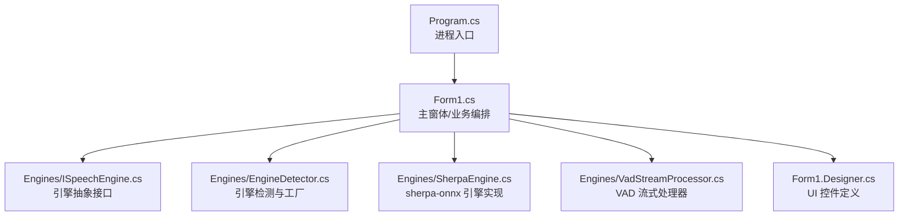
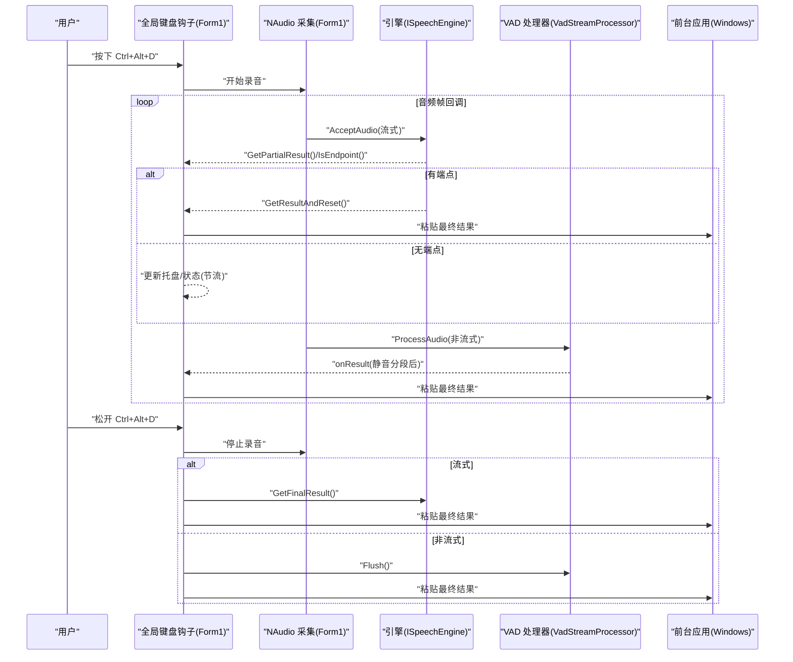
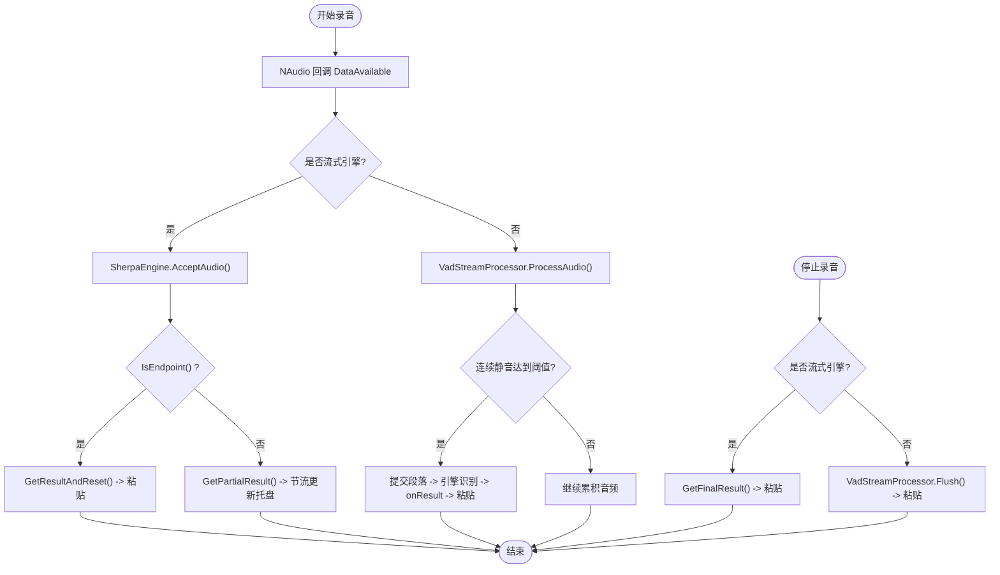
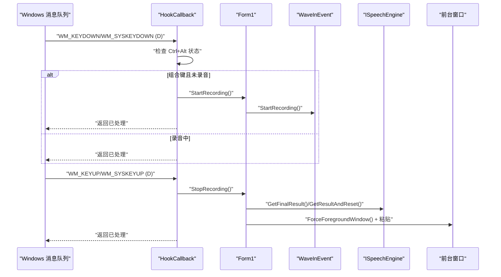
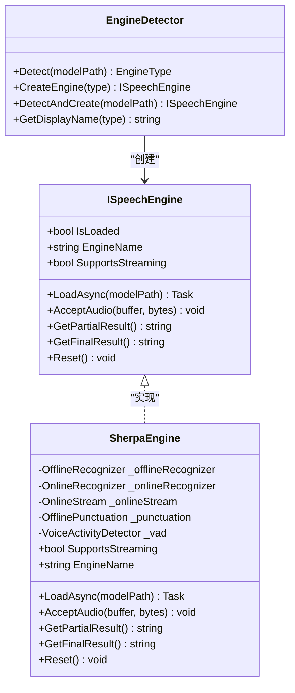
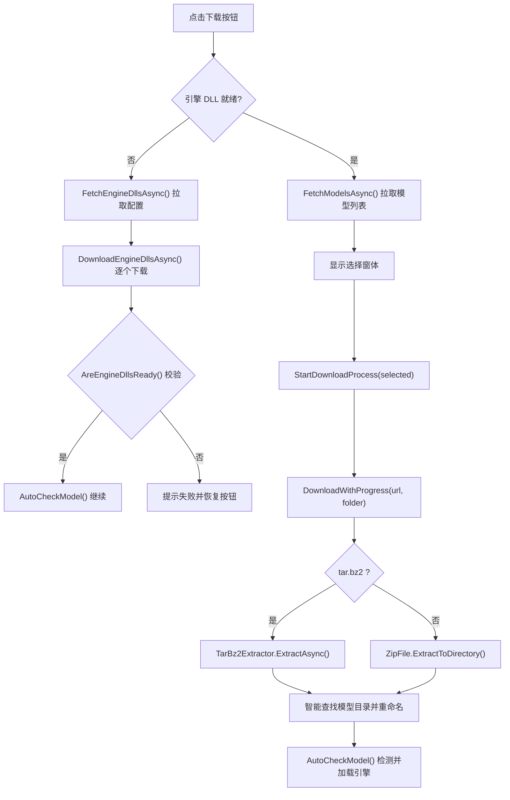
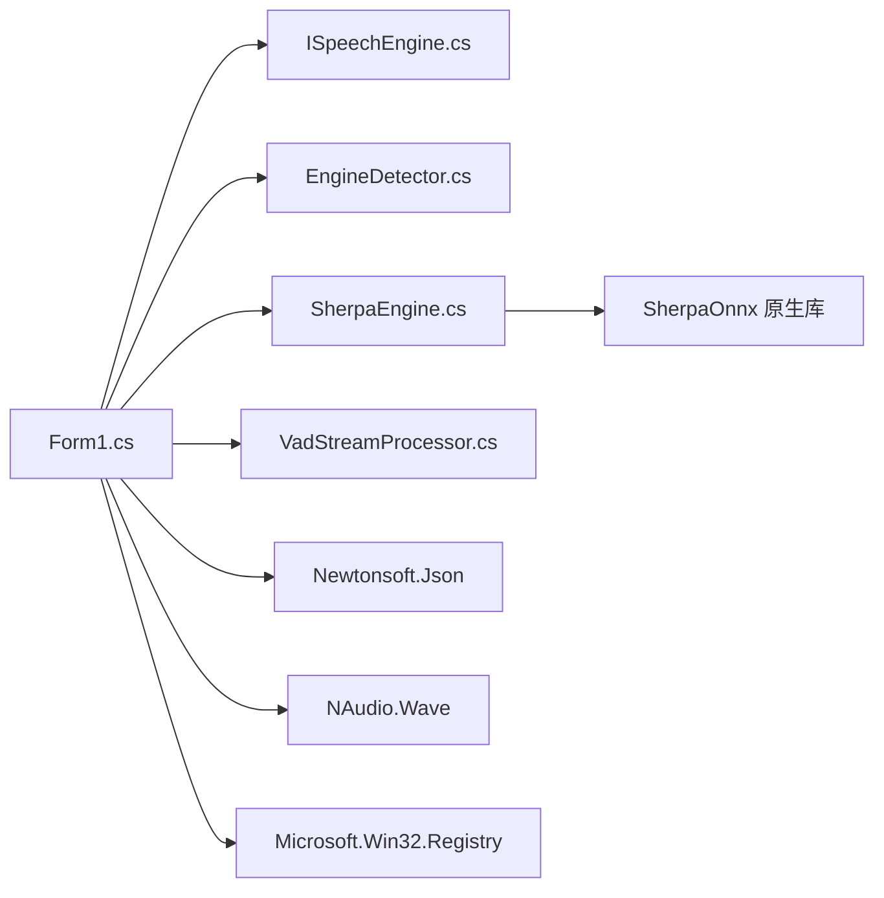

# 核心功能详解

<cite>
**本文引用的文件列表**
- [Program.cs](file://t9s2t/Program.cs)
- [Form1.cs](file://t9s2t/Form1.cs)
- [Form1.Designer.cs](file://t9s2t/Form1.Designer.cs)
- [ISpeechEngine.cs](file://t9s2t/Engines/ISpeechEngine.cs)
- [EngineDetector.cs](file://t9s2t/Engines/EngineDetector.cs)
- [SherpaEngine.cs](file://t9s2t/Engines/SherpaEngine.cs)
- [VadStreamProcessor.cs](file://t9s2t/Engines/VadStreamProcessor.cs)
</cite>

## 目录
1. [简介](#简介)
2. [项目结构](#项目结构)
3. [核心组件](#核心组件)
4. [架构总览](#架构总览)
5. [详细组件分析](#详细组件分析)
6. [依赖关系分析](#依赖关系分析)
7. [性能与稳定性考量](#性能与稳定性考量)
8. [故障排查指南](#故障排查指南)
9. [结论](#结论)
10. [附录：使用模式与示例路径](#附录使用模式与示例路径)

## 简介
本文件面向开发者，系统性阐述 t9s2t 的核心能力与实现细节，包括：
- 实时语音识别工作流：音频采集、语音活动检测（VAD）、引擎调用、结果处理与输入模拟。
- 键盘快捷键系统：全局低级别键盘钩子注册、事件拦截与处理逻辑。
- 多引擎支持架构：ISpeechEngine 接口设计与 EngineDetector 工厂模式应用。
- 智能模型管理：远程配置拉取、自动检测、下载解压与本地存储。
- 系统集成特性：托盘图标、非激活提示窗体、开机自启动等。

## 项目结构
本项目采用分层组织方式：
- 入口与主界面：Program.cs 负责进程初始化；Form1.cs 承载 UI、系统交互、录音流程与模型管理。
- 引擎抽象与实现：Engines 目录下定义 ISpeechEngine 接口、EngineDetector 工厂、SherpaEngine 具体实现以及 VAD 流式处理器。
- 资源与配置：Designer 文件描述 UI 控件布局；App.config 与 packages.config 声明依赖。

图表来源
- [Program.cs:1-27](file://t9s2t/Program.cs#L1-L27)
- [Form1.cs:1-200](file://t9s2t/Form1.cs#L1-L200)
- [ISpeechEngine.cs:1-35](file://t9s2t/Engines/ISpeechEngine.cs#L1-L35)
- [EngineDetector.cs:1-122](file://t9s2t/Engines/EngineDetector.cs#L1-L122)
- [SherpaEngine.cs:1-120](file://t9s2t/Engines/SherpaEngine.cs#L1-L120)
- [VadStreamProcessor.cs:1-60](file://t9s2t/Engines/VadStreamProcessor.cs#L1-L60)
- [Form1.Designer.cs:1-120](file://t9s2t/Form1.Designer.cs#L1-L120)

章节来源
- [Program.cs:1-27](file://t9s2t/Program.cs#L1-L27)
- [Form1.Designer.cs:1-120](file://t9s2t/Form1.Designer.cs#L1-L120)

## 核心组件
- 主窗体 Form1：负责全局键盘钩子、录音控制、模型与引擎生命周期管理、结果粘贴到前台窗口、托盘与开机自启等。
- 引擎抽象 ISpeechEngine：统一加载、接受音频、获取部分/最终结果、重置状态。
- 引擎检测 EngineDetector：基于模型目录结构判断引擎类型并创建对应实例。
- sherpa-onnx 引擎 SherpaEngine：封装 Online/Offline 识别器、标点恢复、VAD 模型加载与端点检测。
- VAD 流式处理器 VadStreamProcessor：对非流式模型进行“静音分段 + 即时提交”的流式模拟。

章节来源
- [Form1.cs:1-200](file://t9s2t/Form1.cs#L1-L200)
- [ISpeechEngine.cs:1-35](file://t9s2t/Engines/ISpeechEngine.cs#L1-L35)
- [EngineDetector.cs:1-122](file://t9s2t/Engines/EngineDetector.cs#L1-L122)
- [SherpaEngine.cs:1-120](file://t9s2t/Engines/SherpaEngine.cs#L1-L120)
- [VadStreamProcessor.cs:1-60](file://t9s2t/Engines/VadStreamProcessor.cs#L1-L60)

## 架构总览
整体数据与控制流如下：
- 用户按下 Ctrl+Alt+D 触发录音，松开结束。
- 音频由 NAudio 采集，按模式分流至 SherpaEngine（流式）或 VadStreamProcessor（非流式模拟）。
- 引擎返回部分/最终结果，Form1 将最终结果原子化粘贴到前台目标窗口。
- 模型与引擎 DLL 按需从远程配置拉取，本地缓存并按目录结构自动识别。

图表来源
- [Form1.cs:415-460](file://t9s2t/Form1.cs#L415-L460)
- [Form1.cs:1057-1111](file://t9s2t/Form1.cs#L1057-L1111)
- [Form1.cs:1146-1273](file://t9s2t/Form1.cs#L1146-L1273)
- [SherpaEngine.cs:351-479](file://t9s2t/Engines/SherpaEngine.cs#L351-L479)
- [VadStreamProcessor.cs:38-136](file://t9s2t/Engines/VadStreamProcessor.cs#L38-L136)

## 详细组件分析

### 实时语音识别工作流
- 音频采集：使用 NAudio.Wave 的 WaveInEvent，采样率 16kHz，单声道。
- 流式与非流式分支：
  - 流式（Paraformer 在线）：直接送入 SherpaEngine.AcceptAudio，周期性查询 GetPartialResult 和 IsEndpoint，端点到达时 GetResultAndReset 输出分句结果。
  - 非流式（SenseVoice 等）：通过 VadStreamProcessor 计算能量阈值，累积静音段落后提交整段识别。
- 结果处理：
  - partial 仅用于 UI 反馈（托盘文本），不写入前台窗口以避免闪烁。
  - final 结果通过剪贴板 + SendKeys 一次性粘贴，并附加空格；若失败则回退为逐字符输入。
- 线程安全：DataAvailable 回调与输入操作均受锁保护，避免并发冲突。

图表来源
- [Form1.cs:1057-1111](file://t9s2t/Form1.cs#L1057-L1111)
- [Form1.cs:1146-1273](file://t9s2t/Form1.cs#L1146-L1273)
- [SherpaEngine.cs:351-479](file://t9s2t/Engines/SherpaEngine.cs#L351-L479)
- [VadStreamProcessor.cs:38-136](file://t9s2t/Engines/VadStreamProcessor.cs#L38-L136)

章节来源
- [Form1.cs:1057-1111](file://t9s2t/Form1.cs#L1057-L1111)
- [Form1.cs:1146-1273](file://t9s2t/Form1.cs#L1146-L1273)
- [SherpaEngine.cs:351-479](file://t9s2t/Engines/SherpaEngine.cs#L351-L479)
- [VadStreamProcessor.cs:38-136](file://t9s2t/Engines/VadStreamProcessor.cs#L38-L136)

### 键盘快捷键系统（全局钩子）
- 注册：通过 SetWindowsHookEx 安装 WH_KEYBOARD_LL 钩子，回调函数 HookCallback 在消息队列中拦截按键。
- 触发键：Ctrl+Alt+D 组合键按下时开始录音，松开 D 键时停止录音。
- 拦截策略：
  - 按下时若满足组合键且未录音，则进入录音并返回已处理标志，阻止后续输入法/系统处理。
  - 录音中再次按下 D 键会被拦截，防止字符输入。
  - 松开 D 键时无论修饰键状态如何，都会停止录音并返回已处理标志。
- 焦点与输入：
  - 粘贴前尝试将前台窗口置前，必要时 AttachThreadInput 提升权限。
  - 若 Alt 仍按住，先临时释放，避免 Alt+Space 弹出系统菜单。
  - 优先使用剪贴板 + ^v 粘贴，失败则回退为逐字符发送。

图表来源
- [Form1.cs:415-460](file://t9s2t/Form1.cs#L415-L460)
- [Form1.cs:1146-1273](file://t9s2t/Form1.cs#L1146-L1273)
- [Form1.cs:993-1051](file://t9s2t/Form1.cs#L993-L1051)

章节来源
- [Form1.cs:415-460](file://t9s2t/Form1.cs#L415-L460)
- [Form1.cs:993-1051](file://t9s2t/Form1.cs#L993-L1051)
- [Form1.cs:1146-1273](file://t9s2t/Form1.cs#L1146-L1273)

### 多引擎支持与工厂模式
- 接口设计 ISpeechEngine：
  - 提供统一的 LoadAsync、AcceptAudio、GetPartialResult、GetFinalResult、Reset 等方法。
  - 暴露 SupportsStreaming、EngineName 等元信息，便于上层选择处理策略。
- 工厂与检测 EngineDetector：
  - Detect：根据 modelPath 下文件特征推断引擎类型（SenseVoice、Paraformer、Paraformer-large、Paraformer 流式）。
  - CreateEngine/DetectAndCreate：根据类型创建 SherpaEngine 实例（区分流式/非流式）。
- 引擎实现 SherpaEngine：
  - 内部维护 OnlineRecognizer/OfflineRecognizer、OnlineStream、Punctuation、VAD 等对象。
  - 支持离线/在线两种识别路径，并在加载阶段自动探测 tokens.txt 行数以区分大模型与 SenseVoice。
  - 可选加载 punc.onnx 与 vad.onnx，增强标点恢复与端点检测能力。

图表来源
- [ISpeechEngine.cs:1-35](file://t9s2t/Engines/ISpeechEngine.cs#L1-L35)
- [EngineDetector.cs:1-122](file://t9s2t/Engines/EngineDetector.cs#L1-L122)
- [SherpaEngine.cs:1-120](file://t9s2t/Engines/SherpaEngine.cs#L1-L120)

章节来源
- [ISpeechEngine.cs:1-35](file://t9s2t/Engines/ISpeechEngine.cs#L1-L35)
- [EngineDetector.cs:1-122](file://t9s2t/Engines/EngineDetector.cs#L1-L122)
- [SherpaEngine.cs:1-120](file://t9s2t/Engines/SherpaEngine.cs#L1-L120)

### 智能模型管理系统
- 远程配置：
  - 模型列表 JSON：从远程地址拉取，解析后过滤 published=true 的条目，展示动态选择窗体。
  - 引擎运行时 DLL 配置：从 engine.json 拉取所需 DLL 列表，缺失则自动下载。
- 下载与解压：
  - 支持 zip 与 tar.bz2 格式，自动判断魔数并解压。
  - 智能定位解压后的模型目录（优先匹配指定 folder，其次扫描包含 model.int8.onnx/encoder.int8.onnx/tokens.txt 的目录）。
  - 将模型目录重命名为固定名称，便于后续检测与加载。
- 本地存储与检测：
  - 模型目录存在即视为就绪，EngineDetector.Detect 自动识别类型。
  - 引擎 DLL 存在且大小大于 0 即视为就绪。
- 错误与回退：
  - 网络请求失败时使用内置 fallback JSON。
  - 下载失败清理空文件并提示重试。

图表来源
- [Form1.cs:462-606](file://t9s2t/Form1.cs#L462-L606)
- [Form1.cs:608-721](file://t9s2t/Form1.cs#L608-L721)
- [Form1.cs:724-966](file://t9s2t/Form1.cs#L724-L966)
- [EngineDetector.cs:27-75](file://t9s2t/Engines/EngineDetector.cs#L27-L75)

章节来源
- [Form1.cs:462-606](file://t9s2t/Form1.cs#L462-L606)
- [Form1.cs:608-721](file://t9s2t/Form1.cs#L608-L721)
- [Form1.cs:724-966](file://t9s2t/Form1.cs#L724-L966)
- [EngineDetector.cs:27-75](file://t9s2t/Engines/EngineDetector.cs#L27-L75)

### 系统集成特性
- 托盘图标：
  - 启动时创建 NotifyIcon，双击或菜单项可强制显示主界面。
  - 录音中/完成时更新托盘文本，提供即时反馈。
- 非激活提示窗体：
  - 自定义 NonActivatingForm，设置 WS_EX_NOACTIVATE 样式，避免抢夺焦点。
  - 录音开始时显示底部居中圆角提示条，结束时隐藏。
- 开机自启动：
  - 通过注册表 HKCU\Software\Microsoft\Windows\CurrentVersion\Run 写入/删除程序路径。
  - 界面提供复选框，勾选即启用/禁用。
- 防多开：
  - 使用全局 Mutex 确保单实例运行，重复启动时将消息发送至已有实例并退出当前进程。

章节来源
- [Form1.cs:164-170](file://t9s2t/Form1.cs#L164-L170)
- [Form1.cs:1177-1223](file://t9s2t/Form1.cs#L1177-L1223)
- [Form1.cs:1298-1309](file://t9s2t/Form1.cs#L1298-L1309)
- [Form1.cs:260-277](file://t9s2t/Form1.cs#L260-L277)
- [Form1.cs:154-162](file://t9s2t/Form1.cs#L154-L162)

## 依赖关系分析
- 外部库：
  - NAudio.Wave：音频采集与回调。
  - Newtonsoft.Json：JSON 解析（模型列表与引擎配置）。
  - Microsoft.Win32.Registry：开机自启注册表读写。
  - SherpaOnnx：底层推理引擎（C API 封装）。
- 模块耦合：
  - Form1 作为编排层，依赖 ISpeechEngine 抽象，屏蔽具体引擎差异。
  - EngineDetector 与 SherpaEngine 强耦合于 sherpa-onnx 模型结构与参数。
  - VadStreamProcessor 仅依赖 ISpeechEngine 接口，具备良好可替换性。

图表来源
- [Form1.cs:1-200](file://t9s2t/Form1.cs#L1-L200)
- [ISpeechEngine.cs:1-35](file://t9s2t/Engines/ISpeechEngine.cs#L1-L35)
- [EngineDetector.cs:1-122](file://t9s2t/Engines/EngineDetector.cs#L1-L122)
- [SherpaEngine.cs:1-120](file://t9s2t/Engines/SherpaEngine.cs#L1-L120)
- [VadStreamProcessor.cs:1-60](file://t9s2t/Engines/VadStreamProcessor.cs#L1-L60)

章节来源
- [Form1.cs:1-200](file://t9s2t/Form1.cs#L1-L200)
- [ISpeechEngine.cs:1-35](file://t9s2t/Engines/ISpeechEngine.cs#L1-L35)
- [EngineDetector.cs:1-122](file://t9s2t/Engines/EngineDetector.cs#L1-L122)
- [SherpaEngine.cs:1-120](file://t9s2t/Engines/SherpaEngine.cs#L1-L120)
- [VadStreamProcessor.cs:1-60](file://t9s2t/Engines/VadStreamProcessor.cs#L1-L60)

## 性能与稳定性考量
- 流式识别优化：
  - Paraformer 在线模式启用端点检测规则，平衡出字速度与吞字问题。
  - partial 结果节流与去重，降低 UI 刷新频率，避免抖动。
- 非流式模拟：
  - VadStreamProcessor 使用能量阈值与最小语音帧数过滤噪音，减少误触发。
- 输入粘贴稳定性：
  - 优先剪贴板 + ^v，失败回退为逐字符输入。
  - 粘贴前临时释放 Alt，避免系统菜单干扰。
- 资源管理：
  - 引擎与 VAD 对象实现 IDisposable，关闭时释放 Native 资源。
  - 录音结束后 Reset 引擎与 VAD 状态，避免跨会话污染。

[本节为通用指导，无需源码引用]

## 故障排查指南
- 无法检测到麦克风：
  - 现象：启动后提示未检测到麦克风。
  - 排查：确认设备计数 > 0，检查默认录音设备与权限。
- 引擎组件缺失：
  - 现象：按钮变为“下载引擎组件”，状态栏提示缺少组件。
  - 排查：点击按钮下载 onnxruntime.dll 与 sherpa-onnx-c-api.dll，完成后重新检测。
- 模型未找到：
  - 现象：状态栏提示模型未找到。
  - 排查：点击“下载模型”，选择最新列表中的模型，等待解压完成。
- 下载失败：
  - 现象：提示链接过期或解压失败。
  - 排查：检查网络连接与防火墙；tar.bz2 需要 Windows 10+ 自带 tar.exe 或安装 7-Zip。
- 粘贴异常：
  - 现象：结果未出现在目标窗口。
  - 排查：确认前台窗口可用；观察是否出现 Alt+Space 菜单；查看日志中的回退输入路径。

章节来源
- [Form1.cs:1057-1062](file://t9s2t/Form1.cs#L1057-L1062)
- [Form1.cs:462-505](file://t9s2t/Form1.cs#L462-L505)
- [Form1.cs:608-642](file://t9s2t/Form1.cs#L608-L642)
- [Form1.cs:958-966](file://t9s2t/Form1.cs#L958-L966)
- [Form1.cs:993-1051](file://t9s2t/Form1.cs#L993-L1051)

## 结论
t9s2t 通过清晰的抽象与模块化设计，实现了跨引擎的实时语音识别与稳定的系统集成。其关键优势在于：
- 灵活的引擎扩展：ISpeechEngine 接口与 EngineDetector 工厂使新增引擎成本极低。
- 完善的模型管理：远程配置 + 本地缓存 + 自动检测，提升用户体验。
- 健壮的输入粘贴：多种回退策略保障在不同前台应用下的可用性。
- 友好的交互体验：托盘提示、非激活提示窗体与开机自启，兼顾后台运行与可见性。

[本节为总结，无需源码引用]

## 附录：使用模式与示例路径
- 启动与初始化
  - 入口：Program.Main 设置 TLS 协议并运行主窗体。
  - 参考路径：[Program.cs:15-24](file://t9s2t/Program.cs#L15-L24)
- 注册全局键盘钩子
  - 参考路径：[Form1.cs:415-420](file://t9s2t/Form1.cs#L415-L420)
- 处理按键事件
  - 参考路径：[Form1.cs:422-460](file://t9s2t/Form1.cs#L422-L460)
- 开始/停止录音
  - 参考路径：[Form1.cs:1146-1173](file://t9s2t/Form1.cs#L1146-L1173), [Form1.cs:1228-1273](file://t9s2t/Form1.cs#L1228-L1273)
- 音频数据处理
  - 参考路径：[Form1.cs:1064-1111](file://t9s2t/Form1.cs#L1064-L1111)
- 引擎加载与检测
  - 参考路径：[Form1.cs:645-721](file://t9s2t/Form1.cs#L645-L721), [EngineDetector.cs:27-75](file://t9s2t/Engines/EngineDetector.cs#L27-L75)
- 引擎接口与实现
  - 参考路径：[ISpeechEngine.cs:1-35](file://t9s2t/Engines/ISpeechEngine.cs#L1-L35), [SherpaEngine.cs:57-120](file://t9s2t/Engines/SherpaEngine.cs#L57-L120)
- VAD 流式处理
  - 参考路径：[VadStreamProcessor.cs:38-136](file://t9s2t/Engines/VadStreamProcessor.cs#L38-L136)
- 模型下载与解压
  - 参考路径：[Form1.cs:724-966](file://t9s2t/Form1.cs#L724-L966)
- 结果粘贴与回退
  - 参考路径：[Form1.cs:993-1051](file://t9s2t/Form1.cs#L993-L1051)
- 托盘与开机自启
  - 参考路径：[Form1.cs:164-170](file://t9s2t/Form1.cs#L164-L170), [Form1.cs:260-277](file://t9s2t/Form1.cs#L260-L277)
- 非激活提示窗体
  - 参考路径：[Form1.cs:1177-1223](file://t9s2t/Form1.cs#L1177-L1223), [Form1.cs:1298-1309](file://t9s2t/Form1.cs#L1298-L1309)