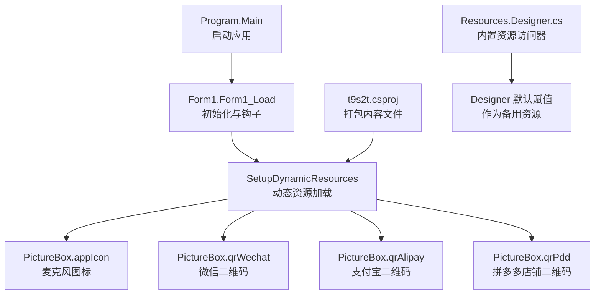
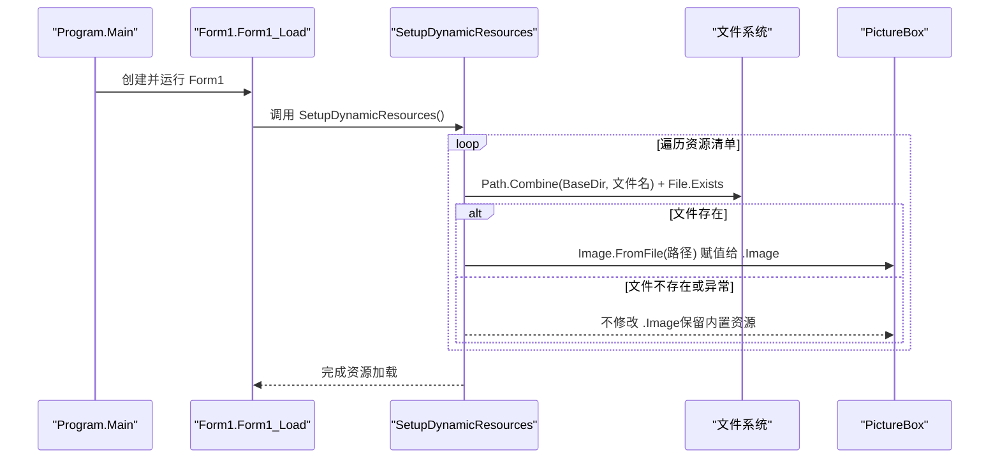
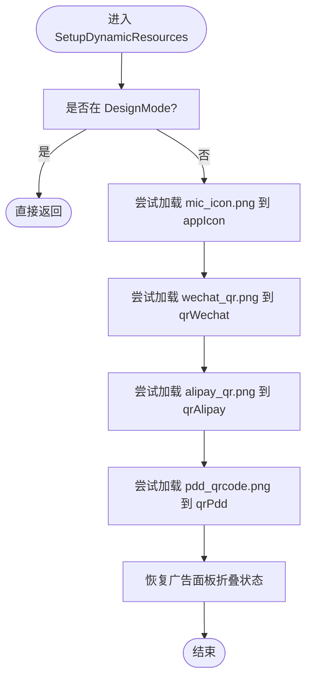
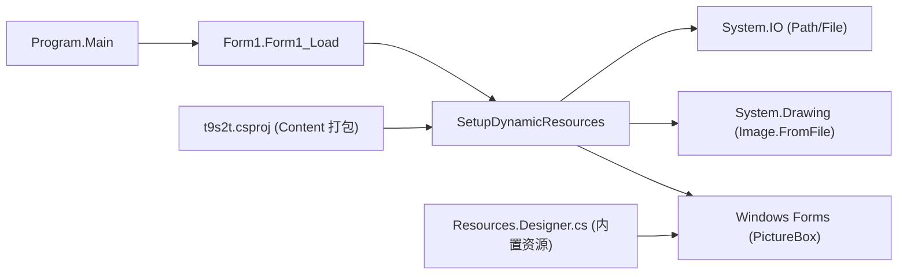

# 动态资源管理

<cite>
**本文引用的文件**
- [Form1.cs](file://t9s2t/Form1.cs)
- [Form1.Designer.cs](file://t9s2t/Form1.Designer.cs)
- [Program.cs](file://t9s2t/Program.cs)
- [t9s2t.csproj](file://t9s2t/t9s2t.csproj)
- [Resources.Designer.cs](file://t9s2t/Properties/Resources.Designer.cs)
</cite>

## 目录
1. [简介](#简介)
2. [项目结构](#项目结构)
3. [核心组件](#核心组件)
4. [架构总览](#架构总览)
5. [详细组件分析](#详细组件分析)
6. [依赖关系分析](#依赖关系分析)
7. [性能与内存优化](#性能与内存优化)
8. [故障排查指南](#故障排查指南)
9. [结论](#结论)
10. [附录：扩展与示例](#附录扩展与示例)

## 简介
本技术文档聚焦于 t9s2t 的动态资源管理系统，重点解析 SetupDynamicResources 方法的资源加载机制。该系统在运行时从应用程序目录动态加载图片资源（麦克风图标、微信二维码、支付宝二维码、拼多多店铺二维码），并具备路径解析、存在性检查、异常处理与备用资源回退策略。同时，文档对 Image.FromFile 的使用方式、资源释放与垃圾回收注意事项进行分析，并提供扩展更多动态资源类型、实现资源缓存与性能优化的实践建议。

## 项目结构
- 应用入口位于 Program.Main，负责初始化 Windows Forms 运行环境并启动主窗体。
- 主窗体 Form1 包含 UI 控件定义与业务逻辑，其中 SetupDynamicResources 负责动态资源加载。
- 设计器文件 Form1.Designer.cs 定义了 PictureBox 控件（appIcon、qrWechat、qrAlipay、qrPdd）及其默认内置资源引用。
- 项目文件 t9s2t.csproj 将若干图片作为内容文件打包到输出目录，便于运行时按路径访问。
- Properties/Resources.Designer.cs 暴露了嵌入资源的访问器，供设计期或静态资源使用。

图表来源
- [Program.cs:15-24](file://t9s2t/Program.cs#L15-L24)
- [Form1.cs:151-235](file://t9s2t/Form1.cs#L151-L235)
- [Form1.cs:290-303](file://t9s2t/Form1.cs#L290-L303)
- [t9s2t.csproj:165-170](file://t9s2t/t9s2t.csproj#L165-L170)
- [Form1.Designer.cs:132-161](file://t9s2t/Form1.Designer.cs#L132-L161)

章节来源
- [Program.cs:15-24](file://t9s2t/Program.cs#L15-L24)
- [Form1.cs:151-235](file://t9s2t/Form1.cs#L151-L235)
- [Form1.Designer.cs:132-161](file://t9s2t/Form1.Designer.cs#L132-L161)
- [t9s2t.csproj:165-170](file://t9s2t/t9s2t.csproj#L165-L170)
- [Resources.Designer.cs:66-101](file://t9s2t/Properties/Resources.Designer.cs#L66-L101)

## 核心组件
- SetupDynamicResources：负责在运行时检测并加载动态图片资源，若文件不存在则保持控件的默认内置资源不变。
- PictureBox 控件族：appIcon、qrWechat、qrAlipay、qrPdd，分别承载动态加载的图片。
- 项目内容文件：wechat_qr.png、alipay_qr.png、pdd_qrcode.png 等被打包到输出目录，供运行时按路径读取。
- 内置资源访问器：通过 Resources.Designer.cs 提供的属性返回 Bitmap，作为设计期默认值与备用资源。

章节来源
- [Form1.cs:290-303](file://t9s2t/Form1.cs#L290-L303)
- [Form1.Designer.cs:132-161](file://t9s2t/Form1.Designer.cs#L132-L161)
- [t9s2t.csproj:165-170](file://t9s2t/t9s2t.csproj#L165-L170)
- [Resources.Designer.cs:66-101](file://t9s2t/Properties/Resources.Designer.cs#L66-L101)

## 架构总览
动态资源加载流程如下：
- 应用启动后进入 Form1_Load，完成 UI 初始化、系统钩子设置、音频设备初始化等。
- 调用 SetupDynamicResources 进行动态资源加载。
- 对于每个目标图片，先计算完整路径（基于 AppDomain.CurrentDomain.BaseDirectory），再判断文件是否存在。
- 若存在，使用 Image.FromFile 加载并赋值给对应 PictureBox.Image；若不存在或加载失败，捕获异常并保持控件原有内置资源。
- 最后恢复广告面板折叠状态（与资源加载无关但同属初始化阶段）。

图表来源
- [Program.cs:15-24](file://t9s2t/Program.cs#L15-L24)
- [Form1.cs:151-235](file://t9s2t/Form1.cs#L151-L235)
- [Form1.cs:290-303](file://t9s2t/Form1.cs#L290-L303)

## 详细组件分析

### SetupDynamicResources 方法详解
- 设计模式检查：在 DesignMode 下直接返回，避免在设计期执行磁盘 IO。
- 路径解析：使用 AppDomain.CurrentDomain.BaseDirectory 拼接文件名，确保路径正确指向可执行文件所在目录。
- 存在性检查：File.Exists 判断文件是否可用，避免无效 IO 操作。
- 异常处理：每个资源加载均包裹 try-catch，防止单个资源失败影响整体初始化。
- 资源覆盖策略：仅当动态文件存在且成功加载时替换 PictureBox.Image；否则保持 Designer 中设置的内置资源。

图表来源
- [Form1.cs:290-303](file://t9s2t/Form1.cs#L290-L303)

章节来源
- [Form1.cs:290-303](file://t9s2t/Form1.cs#L290-L303)

### 支持的资源类型与映射
- 麦克风图标：mic_icon.png → appIcon
- 微信二维码：wechat_qr.png → qrWechat
- 支付宝二维码：alipay_qr.png → qrAlipay
- 拼多多店铺二维码：pdd_qrcode.png → qrPdd

这些资源在项目文件中以 Content 形式打包，确保部署后可通过相对路径访问。

章节来源
- [t9s2t.csproj:165-170](file://t9s2t/t9s2t.csproj#L165-L170)
- [Form1.Designer.cs:132-161](file://t9s2t/Form1.Designer.cs#L132-L161)
- [Form1.cs:290-303](file://t9s2t/Form1.cs#L290-L303)

### 资源文件的存在性检查机制
- 路径验证：Path.Combine(AppDomain.CurrentDomain.BaseDirectory, filename) 生成绝对路径。
- 存在性判断：File.Exists(path) 确保文件存在后再进行 IO。
- 空文件处理：在引擎 DLL 下载逻辑中存在对空文件的清理策略（参考 AreEngineDllsReady 的实现思路），可用于资源完整性校验的扩展。

章节来源
- [Form1.cs:290-303](file://t9s2t/Form1.cs#L290-L303)
- [Form1.cs:468-481](file://t9s2t/Form1.cs#L468-L481)

### 备用资源处理策略
- 设计期默认资源：Designer 为各 PictureBox 设置了内置资源（来自 Resources.Designer.cs 的属性）。
- 运行时覆盖：仅在动态文件存在且成功加载时才替换内置资源；否则保持默认显示。
- 容错性：即使动态资源缺失，UI 仍可正常展示，提升用户体验与鲁棒性。

章节来源
- [Form1.Designer.cs:132-161](file://t9s2t/Form1.Designer.cs#L132-L161)
- [Resources.Designer.cs:66-101](file://t9s2t/Properties/Resources.Designer.cs#L66-L101)
- [Form1.cs:290-303](file://t9s2t/Form1.cs#L290-L303)

## 依赖关系分析
- 程序入口 Program.Main 启动 Form1。
- Form1.Load 触发 SetupDynamicResources。
- SetupDynamicResources 依赖 System.IO（Path、File）、System.Drawing（Image.FromFile）、Windows Forms（PictureBox）。
- 项目文件 t9s2t.csproj 将图片资源打包到输出目录，使运行时路径有效。
- Designer 与 Resources.Designer.cs 提供内置资源作为备用。

图表来源
- [Program.cs:15-24](file://t9s2t/Program.cs#L15-L24)
- [Form1.cs:151-235](file://t9s2t/Form1.cs#L151-L235)
- [Form1.cs:290-303](file://t9s2t/Form1.cs#L290-L303)
- [t9s2t.csproj:165-170](file://t9s2t/t9s2t.csproj#L165-L170)
- [Resources.Designer.cs:66-101](file://t9s2t/Properties/Resources.Designer.cs#L66-L101)

章节来源
- [Program.cs:15-24](file://t9s2t/Program.cs#L15-L24)
- [Form1.cs:151-235](file://t9s2t/Form1.cs#L151-L235)
- [Form1.cs:290-303](file://t9s2t/Form1.cs#L290-L303)
- [t9s2t.csproj:165-170](file://t9s2t/t9s2t.csproj#L165-L170)
- [Resources.Designer.cs:66-101](file://t9s2t/Properties/Resources.Designer.cs#L66-L101)

## 性能与内存优化
- Image.FromFile 行为：该方法会锁定文件句柄直至对象被释放，可能导致后续无法删除或替换文件。当前实现未显式释放 Image 对象，长期运行可能累积未释放句柄。
- 资源释放建议：
  - 在替换旧 Image 前，先释放旧对象（例如保存旧引用并在赋值前 Dispose）。
  - 在窗体关闭或资源切换时集中释放已加载的 Image 实例。
- 垃圾回收考虑：
  - 及时解除对 Image 的强引用有助于 GC 回收。
  - 避免在高频路径上重复创建大量临时 Image。
- 缓存机制建议：
  - 引入字典缓存（键为文件名，值为 Image 实例），减少重复 IO。
  - 结合弱引用或 LRU 策略控制缓存大小，避免内存膨胀。
- 预解码与尺寸适配：
  - 对大图进行缩放后再赋值，降低渲染开销。
  - 使用 MemoryStream 配合 Image 构造器可在需要时避免文件锁问题（但仍需手动释放）。

[本节为通用性能指导，不直接分析具体代码文件]

## 故障排查指南
- 现象：动态图片未显示，仍显示内置资源。
  - 原因：动态文件不存在或加载异常。
  - 排查：确认文件存在于 BaseDirectory；检查文件是否为空或损坏；查看异常日志。
- 现象：替换图片后无法删除原文件。
  - 原因：Image.FromFile 持有文件句柄未释放。
  - 解决：在替换前释放旧 Image；或在应用退出时统一释放。
- 现象：部分二维码显示异常。
  - 原因：图片格式不支持或路径错误。
  - 解决：确保 PNG/JPG 等受支持格式；核对文件名与路径拼写。

章节来源
- [Form1.cs:290-303](file://t9s2t/Form1.cs#L290-L303)
- [Form1.Designer.cs:132-161](file://t9s2t/Form1.Designer.cs#L132-L161)

## 结论
SetupDynamicResources 实现了简单而稳健的动态资源加载机制：通过路径解析与存在性检查，在运行时按需覆盖内置资源；异常处理保证单点失败不影响整体初始化；内置资源作为备用提升了容错性与用户体验。为进一步优化，建议引入资源缓存、显式释放 Image 对象、以及文件句柄管理策略，以提升性能与稳定性。

[本节为总结性内容，不直接分析具体代码文件]

## 附录：扩展与示例

### 扩展更多动态资源类型
- 新增资源步骤：
  - 在项目中添加新图片文件，并在 t9s2t.csproj 中以 Content 形式打包。
  - 在 Form1.Designer.cs 中添加新的 PictureBox 控件，并设置其默认内置资源。
  - 在 SetupDynamicResources 中增加对应的路径拼接、存在性检查与赋值逻辑。
- 示例路径（示意）：
  - 新增 logo_dynamic.png → picLogo.Image = Image.FromFile(Path.Combine(appDir, "logo_dynamic.png"))

章节来源
- [t9s2t.csproj:165-170](file://t9s2t/t9s2t.csproj#L165-L170)
- [Form1.Designer.cs:132-161](file://t9s2t/Form1.Designer.cs#L132-L161)
- [Form1.cs:290-303](file://t9s2t/Form1.cs#L290-L303)

### 实现资源缓存机制
- 设计要点：
  - 使用字典缓存 Image 实例，键为文件名或唯一标识。
  - 首次加载后存入缓存，后续直接从缓存获取。
  - 在窗体关闭或资源切换时清理缓存并释放 Image。
- 示例伪代码（示意）：
  - 定义 Dictionary<string, Image> _imageCache
  - 加载时：if (_imageCache.TryGetValue(key, out img)) return img; 否则加载并加入缓存
  - 释放时：foreach(var kv in _imageCache) { kv.Value.Dispose(); }

[本节为概念性示例，不直接分析具体代码文件]

### 优化资源加载性能
- 批量加载：
  - 将多个资源加载合并为一次循环，减少重复代码与分支判断。
- 异步加载：
  - 使用异步 IO 与后台线程加载大图片，避免阻塞 UI 线程。
- 降级策略：
  - 若动态资源不可用，快速回退至内置资源，保障界面可用性。
- 监控与日志：
  - 记录加载成功/失败统计，便于定位问题与评估优化效果。

[本节为概念性示例，不直接分析具体代码文件]