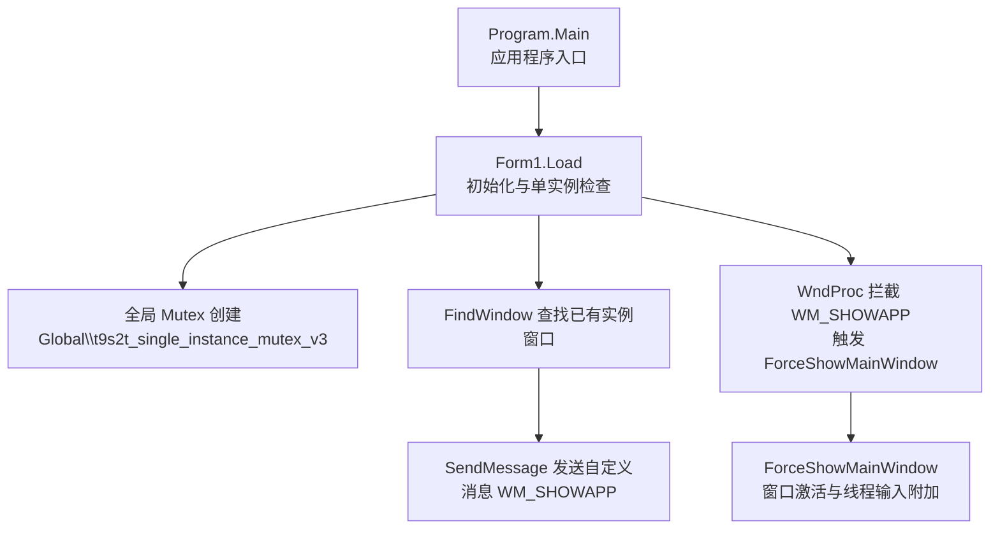
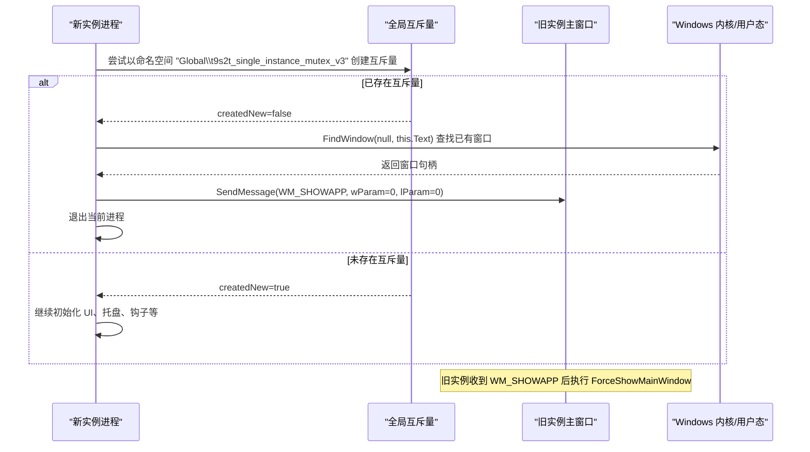
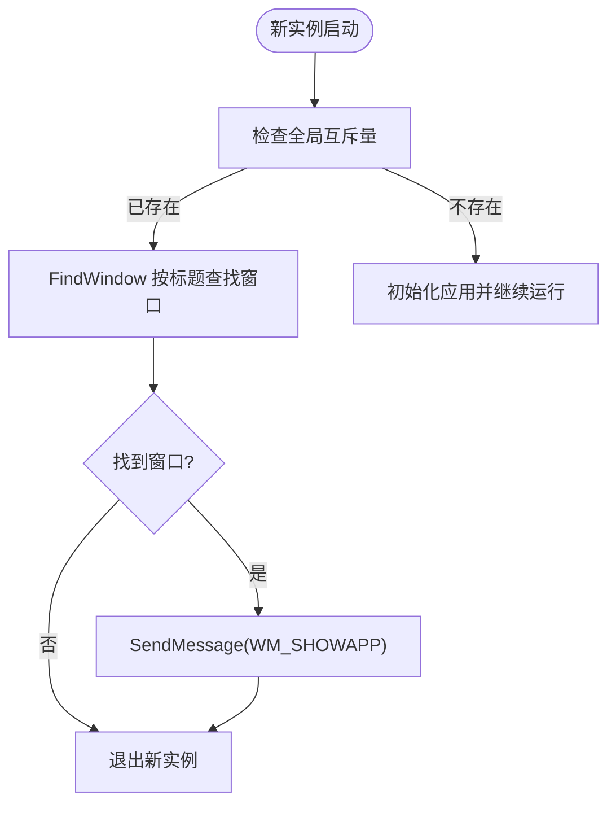
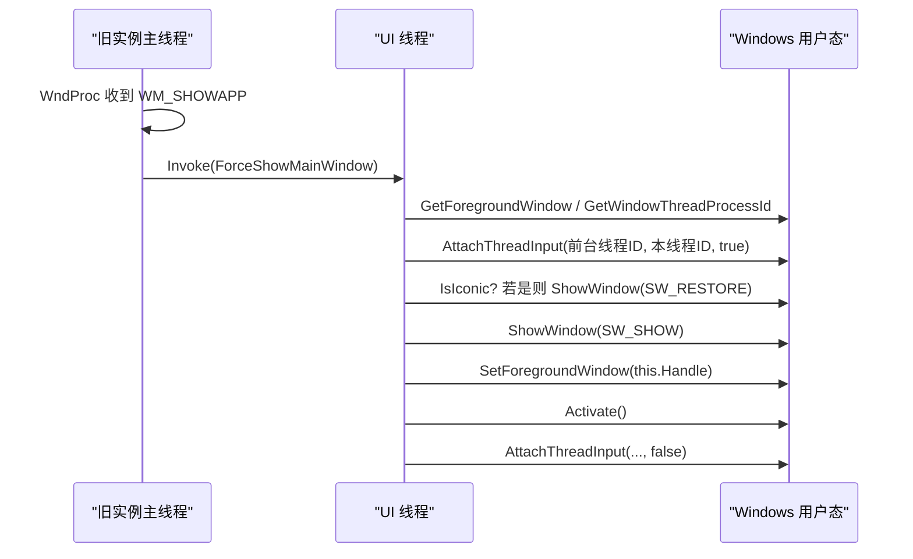
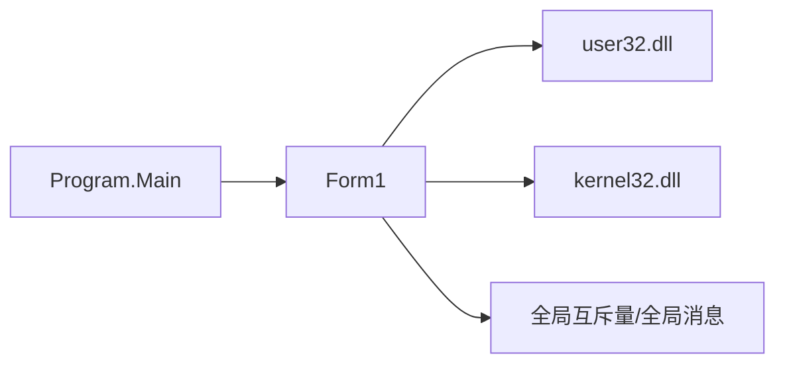

# 单实例运行控制

<cite>
**本文引用的文件**   
- [Program.cs](file://t9s2t/Program.cs)
- [Form1.cs](file://t9s2t/Form1.cs)
</cite>

## 目录
1. [简介](#简介)
2. [项目结构](#项目结构)
3. [核心组件](#核心组件)
4. [架构总览](#架构总览)
5. [详细组件分析](#详细组件分析)
6. [依赖关系分析](#依赖关系分析)
7. [性能与可靠性考虑](#性能与可靠性考虑)
8. [故障排查指南](#故障排查指南)
9. [结论](#结论)
10. [附录：扩展实践示例](#附录扩展实践示例)

## 简介
本技术文档聚焦 t9s2t 应用的“单实例运行控制”机制，系统性解析以下关键点：
- 全局互斥量（Mutex）的创建、命名空间与进程间同步原理
- FindWindow API 的窗口查找逻辑（句柄获取、标题匹配、进程标识符验证）
- 进程间通信（RegisterWindowMessage + SendMessage）的消息定义与处理流程
- 窗口激活策略（SetForegroundWindow、AttachThreadInput、窗口状态恢复）
- 面向复杂场景的扩展建议：更复杂的 IPC、多实例冲突处理、跨进程数据共享

## 项目结构
t9s2t 为 Windows Forms 应用，入口在 Program.Main，主界面逻辑集中在 Form1。单实例控制相关的关键实现位于 Form1 的加载流程与消息处理中。

图表来源
- [Program.cs:15-24](file://t9s2t/Program.cs#L15-L24)
- [Form1.cs:151-162](file://t9s2t/Form1.cs#L151-L162)
- [Form1.cs:237-241](file://t9s2t/Form1.cs#L237-L241)
- [Form1.cs:243-258](file://t9s2t/Form1.cs#L243-L258)

章节来源
- [Program.cs:15-24](file://t9s2t/Program.cs#L15-L24)
- [Form1.cs:151-162](file://t9s2t/Form1.cs#L151-L162)

## 核心组件
- 全局互斥量（Mutex）：用于确保同一时刻仅有一个应用实例运行。
- 窗口查找（FindWindow）：通过窗口标题定位已有实例的主窗口句柄。
- 自定义消息（WM_SHOWAPP）：跨进程通知已有实例将自身显示到前台。
- 窗口激活（SetForegroundWindow + AttachThreadInput）：提升目标窗口至前台并恢复其可见性。

章节来源
- [Form1.cs:126-127](file://t9s2t/Form1.cs#L126-L127)
- [Form1.cs:153-162](file://t9s2t/Form1.cs#L153-L162)
- [Form1.cs:118-124](file://t9s2t/Form1.cs#L118-L124)
- [Form1.cs:243-258](file://t9s2t/Form1.cs#L243-L258)

## 架构总览
下图展示了从新实例启动到旧实例被激活的完整时序。

图表来源
- [Form1.cs:153-162](file://t9s2t/Form1.cs#L153-L162)
- [Form1.cs:118-124](file://t9s2t/Form1.cs#L118-L124)
- [Form1.cs:237-241](file://t9s2t/Form1.cs#L237-L241)
- [Form1.cs:243-258](file://t9s2t/Form1.cs#L243-L258)

## 详细组件分析

### 全局互斥量（Mutex）机制
- 创建位置与命名空间
  - 在 Form1_Load 中创建全局互斥量，命名空间为 "Global\\t9s2t_single_instance_mutex_v3"。
  - 使用 out 参数判断是否首次创建成功（createdNew）。
- 进程间同步原理
  - 若 createdNew=false，说明系统级互斥量已存在，即已有实例在运行；此时新实例应退出。
  - 若 createdNew=true，则当前实例持有该互斥量，直到释放（FormClosing 中调用 ReleaseMutex）。
- 资源释放
  - 在 Form1_FormClosing 中显式释放互斥量，避免异常退出导致残留。

章节来源
- [Form1.cs:153-162](file://t9s2t/Form1.cs#L153-L162)
- [Form1.cs:279-288](file://t9s2t/Form1.cs#L279-L288)

### FindWindow 窗口查找逻辑
- 查找方式
  - 使用 FindWindow(null, this.Text) 基于窗口标题进行查找。
  - 当找到窗口句柄时，向该窗口发送自定义消息 WM_SHOWAPP。
- 标题匹配
  - 标题来自 Form1 的 Text 属性（设计器设置），因此要求标题唯一且稳定。
- 进程标识符验证
  - 当前实现未对窗口所属进程进行校验，仅依赖标题匹配。这在大多数情况下可行，但存在误匹配风险（例如其他程序恰好拥有相同标题）。
  - 如需增强安全性，可在找到窗口后使用 GetWindowThreadProcessId 对比进程 ID，或改用类名+标题双重匹配。

章节来源
- [Form1.cs:157-160](file://t9s2t/Form1.cs#L157-L160)
- [Form1.cs:102-106](file://t9s2t/Form1.cs#L102-L106)

### 进程间通信（IPC）：自定义消息
- 消息注册
  - 使用 RegisterWindowMessage("WM_SHOWAPP_T9S2T_UNIQUE") 注册全局唯一消息 ID。
- 消息发送
  - 新实例通过 SendMessage(existingHandle, WM_SHOWAPP, IntPtr.Zero, IntPtr.Zero) 通知旧实例。
- 消息处理
  - 旧实例在 WndProc 中拦截 WM_SHOWAPP，并调用 ForceShowMainWindow 完成窗口激活。

图表来源
- [Form1.cs:153-162](file://t9s2t/Form1.cs#L153-L162)
- [Form1.cs:118-124](file://t9s2t/Form1.cs#L118-L124)
- [Form1.cs:237-241](file://t9s2t/Form1.cs#L237-L241)

章节来源
- [Form1.cs:118-124](file://t9s2t/Form1.cs#L118-L124)
- [Form1.cs:237-241](file://t9s2t/Form1.cs#L237-L241)

### 窗口激活策略
- SetForegroundWindow
  - 将指定窗口置于前台。
- AttachThreadInput
  - 在调用 SetForegroundWindow 前后，临时将前台窗口的输入线程附加到当前线程，绕过 Windows 的前台切换限制。
- 窗口状态恢复
  - 若窗口处于最小化状态（IsIconic），先调用 ShowWindow(SW_RESTORE) 恢复，再 ShowWindow(SW_SHOW) 显示。
  - 同时设置 Visible、ShowInTaskbar、BringToFront、Activate 以确保完全可见与可交互。

图表来源
- [Form1.cs:237-241](file://t9s2t/Form1.cs#L237-L241)
- [Form1.cs:243-258](file://t9s2t/Form1.cs#L243-L258)
- [Form1.cs:100-106](file://t9s2t/Form1.cs#L100-L106)

章节来源
- [Form1.cs:243-258](file://t9s2t/Form1.cs#L243-L258)

## 依赖关系分析
- 模块耦合
  - Program.Main 负责应用初始化，不直接参与单实例控制。
  - Form1 集中实现了单实例检测、IPC 与窗口激活逻辑，耦合度较高但职责清晰。
- 外部依赖
  - user32.dll：FindWindow、SendMessage、SetForegroundWindow、AttachThreadInput、GetWindowThreadProcessId、IsIconic、ShowWindow。
  - 系统级对象：全局互斥量（命名空间 Global）、全局消息（RegisterWindowMessage）。

图表来源
- [Program.cs:15-24](file://t9s2t/Program.cs#L15-L24)
- [Form1.cs:84-124](file://t9s2t/Form1.cs#L84-L124)

章节来源
- [Program.cs:15-24](file://t9s2t/Program.cs#L15-L24)
- [Form1.cs:84-124](file://t9s2t/Form1.cs#L84-L124)

## 性能与可靠性考虑
- 互斥量创建开销极低，适合在应用启动早期执行。
- FindWindow 基于标题匹配，速度快但存在误匹配风险；必要时可加入进程 ID 校验以提升鲁棒性。
- SendMessage 为同步调用，通常很快；但在极端情况下（目标窗口无响应）可能阻塞，建议增加超时或异步重试策略。
- AttachThreadInput 的使用需谨慎，仅在必要时短暂附加，避免影响前台线程的输入处理。

[本节为通用指导，无需源码引用]

## 故障排查指南
- 症状：重复启动仍出现多个实例
  - 检查全局互斥量命名是否正确，是否存在拼写差异或大小写问题。
  - 确认 FormClosing 中是否调用了 ReleaseMutex。
- 症状：新实例无法激活旧实例窗口
  - 检查 FindWindow 使用的标题是否与 Form1.Text 一致。
  - 确认 WndProc 是否拦截了 WM_SHOWAPP 并正确调用 ForceShowMainWindow。
  - 观察 AttachThreadInput 调用是否成功，必要时记录返回值与错误码。
- 症状：窗口被最小化后无法恢复
  - 确认 IsIconic 分支是否正确执行 ShowWindow(SW_RESTORE)。
  - 检查 ShowWindow(SW_SHOW)、ShowInTaskbar、Visible、BringToFront 的顺序与条件。

章节来源
- [Form1.cs:153-162](file://t9s2t/Form1.cs#L153-L162)
- [Form1.cs:237-241](file://t9s2t/Form1.cs#L237-L241)
- [Form1.cs:243-258](file://t9s2t/Form1.cs#L243-L258)
- [Form1.cs:279-288](file://t9s2t/Form1.cs#L279-L288)

## 结论
t9s2t 的单实例运行控制采用“全局互斥量 + 窗口消息”的经典方案：
- 通过全局互斥量快速判定是否已有实例运行；
- 通过 FindWindow 定位旧实例窗口并发送自定义消息；
- 旧实例在消息处理中完成窗口激活与状态恢复。
该方案简洁可靠，适用于桌面应用。若需更强的健壮性与安全性，可引入进程 ID 校验、消息超时与异常恢复机制。

[本节为总结，无需源码引用]

## 附录：扩展实践示例

### 更复杂的进程间通信（IPC）
- 使用 RegisterWindowMessage 注册更多自定义消息，承载不同指令（如“打开设置”、“刷新模型列表”等）。
- 结合 SendMessage 的 wParam/lParam 传递简单参数；对于大数据，可使用内存映射文件或命名管道。
- 建议在旧实例侧维护一个消息路由表，根据消息类型分发到相应处理函数。

章节来源
- [Form1.cs:118-124](file://t9s2t/Form1.cs#L118-L124)
- [Form1.cs:237-241](file://t9s2t/Form1.cs#L237-L241)

### 处理多实例冲突
- 在 FindWindow 成功后，使用 GetWindowThreadProcessId 获取窗口所属进程 ID，并与当前进程 ID 比较，避免误操作同名窗口。
- 若检测到非本进程窗口，可选择忽略或提示用户选择正确的实例。

章节来源
- [Form1.cs:157-160](file://t9s2t/Form1.cs#L157-L160)
- [Form1.cs:105-106](file://t9s2t/Form1.cs#L105-L106)

### 跨进程数据共享
- 小数据：通过 RegisterWindowMessage + SendMessage 的 wParam/lParam 传递整型或指针（注意生命周期）。
- 大数据：使用命名管道（Named Pipe）或内存映射文件（Memory-Mapped File）实现高效共享。
- 文件共享：约定固定路径与文件锁（如使用 FileStream 独占模式）协调读写。

[本节为概念性扩展，无需源码引用]