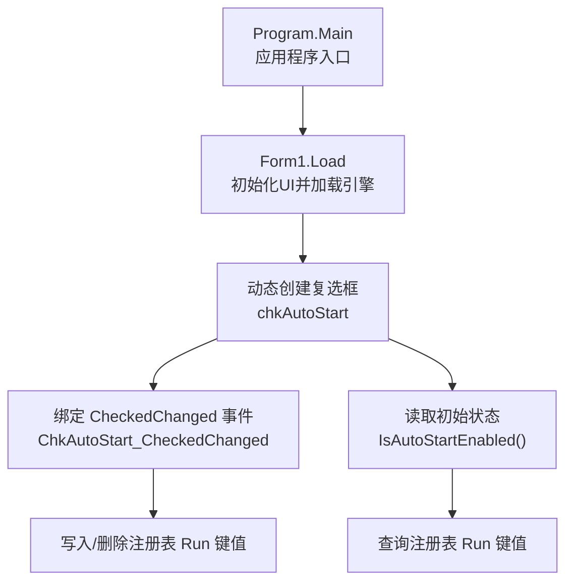
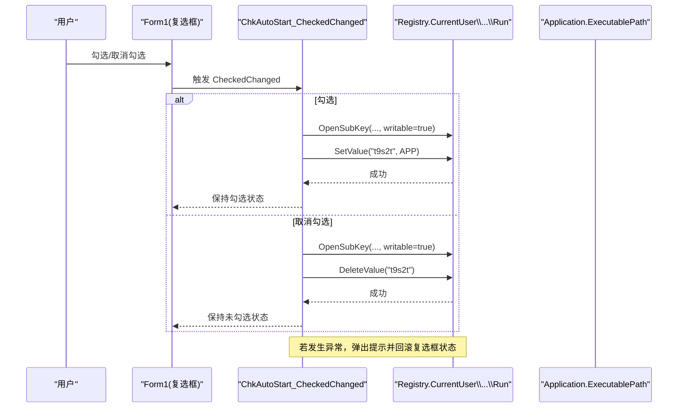
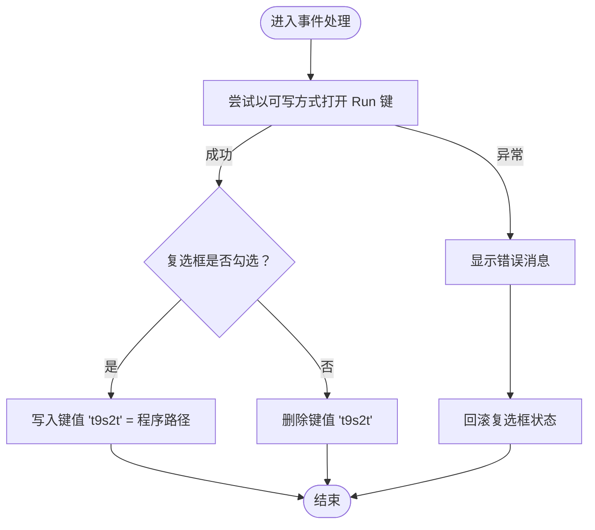
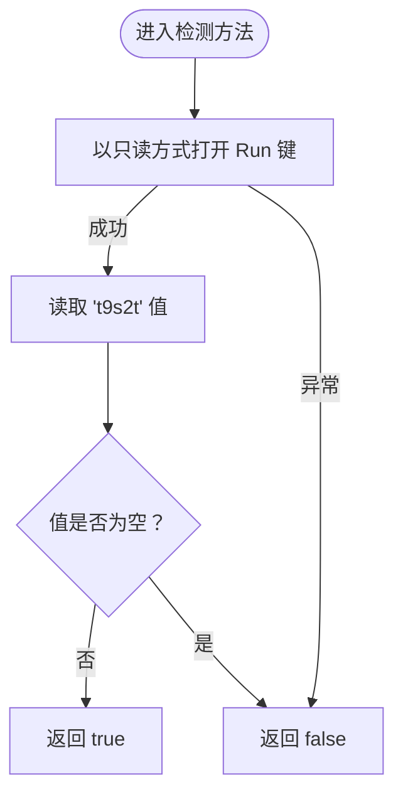

# 开机自启动管理

<cite>
**本文引用的文件**
- [Form1.cs](file://t9s2t/Form1.cs)
- [Program.cs](file://t9s2t/Program.cs)
</cite>

## 目录
1. [简介](#简介)
2. [项目结构](#项目结构)
3. [核心组件](#核心组件)
4. [架构总览](#架构总览)
5. [详细组件分析](#详细组件分析)
6. [依赖关系分析](#依赖关系分析)
7. [性能与可靠性考虑](#性能与可靠性考虑)
8. [故障排查指南](#故障排查指南)
9. [结论](#结论)
10. [附录：扩展实现建议](#附录扩展实现建议)

## 简介
本技术文档聚焦于 t9s2t 的“开机自启动”管理能力，围绕 Windows 注册表操作机制展开，重点说明以下方面：
- 使用 Microsoft.Win32.Registry 访问当前用户配置单元（CurrentUser）下的 Run 键值
- 复选框状态变化事件处理逻辑（创建/删除自启动项）
- 检测是否已启用自启动的方法（查询、异常处理与默认返回值）
- 权限处理与错误恢复策略（访问被拒绝异常、回滚 UI 状态等）
- 面向更灵活配置的改进建议（多用户支持、失败重试与回滚）

## 项目结构
本项目为 Windows Forms 应用，主入口在 Program.Main，主界面逻辑集中在 Form1。开机自启动功能由主窗体动态创建的复选框驱动，通过注册表 CurrentUser\Software\Microsoft\Windows\CurrentVersion\Run 进行读写。

图表来源
- [Program.cs:15-24](file://t9s2t/Program.cs#L15-L24)
- [Form1.cs:151-183](file://t9s2t/Form1.cs#L151-L183)
- [Form1.cs:260-277](file://t9s2t/Form1.cs#L260-L277)

章节来源
- [Program.cs:15-24](file://t9s2t/Program.cs#L15-L24)
- [Form1.cs:151-183](file://t9s2t/Form1.cs#L151-L183)

## 核心组件
- 动态复选框 chkAutoStart：用于切换“开机自动启动”开关
- ChkAutoStart_CheckedChanged：监听复选框状态变化，执行注册表写入或删除
- IsAutoStartEnabled：检测当前用户是否已启用自启动

章节来源
- [Form1.cs:171-183](file://t9s2t/Form1.cs#L171-L183)
- [Form1.cs:260-277](file://t9s2t/Form1.cs#L260-L277)

## 架构总览
开机自启动管理的整体流程如下：
- 应用启动时，主窗体加载后动态创建“开机自动启动”复选框，并根据当前注册表状态设置其勾选状态
- 用户勾选或取消勾选时，触发事件处理，向当前用户的 Run 键写入或删除程序路径
- 若注册表操作失败，显示错误提示并将复选框状态回滚到操作前的值

图表来源
- [Form1.cs:260-271](file://t9s2t/Form1.cs#L260-L271)
- [Form1.cs:272-277](file://t9s2t/Form1.cs#L272-L277)

## 详细组件分析

### 复选框与事件处理：ChkAutoStart_CheckedChanged
- 作用：根据复选框当前状态，向当前用户 Run 键写入或删除自启动项
- 关键行为：
  - 打开可写子键：使用 Registry.CurrentUser.OpenSubKey(@"Software\Microsoft\Windows\CurrentVersion\Run", true)
  - 勾选时：SetValue("t9s2t", Application.ExecutablePath)
  - 取消勾选时：DeleteValue("t9s2t", false)
  - 异常处理：捕获异常并弹窗提示；将复选框状态回滚到操作前值（Checked = !Checked）
- 注意事项：
  - 使用 using 确保 RegistryKey 释放
  - 删除值的第二个参数为 false，表示如果值不存在不抛出异常
  - 异常回滚保证 UI 与注册表状态一致

图表来源
- [Form1.cs:260-271](file://t9s2t/Form1.cs#L260-L271)

章节来源
- [Form1.cs:260-271](file://t9s2t/Form1.cs#L260-L271)

### 检测是否启用自启动：IsAutoStartEnabled
- 作用：判断当前用户 Run 键中是否存在名为 "t9s2t" 的值
- 关键行为：
  - 以只读方式打开 Run 键：OpenSubKey(..., false)
  - 获取值 GetValue("t9s2t")，非空即认为已启用
  - 异常处理：捕获所有异常并返回 false（默认禁用）
- 适用场景：
  - 初始化复选框勾选状态
  - 其他需要判断自启动状态的逻辑

图表来源
- [Form1.cs:272-277](file://t9s2t/Form1.cs#L272-L277)

章节来源
- [Form1.cs:272-277](file://t9s2t/Form1.cs#L272-L277)

### 注册表路径与权限模型
- 目标路径：HKEY_CURRENT_USER\Software\Microsoft\Windows\CurrentVersion\Run
- 当前用户上下文：Registry.CurrentUser 指向当前登录用户的配置单元，无需管理员权限即可读写
- 键名与值名：
  - 键名：Software\Microsoft\Windows\CurrentVersion\Run
  - 值名：t9s2t
  - 值数据：Application.ExecutablePath（当前进程可执行文件的完整路径）
- 权限要点：
  - 写入时需要可写句柄（OpenSubKey(..., true)）
  - 删除值时使用 DeleteValue(name, throwOnMissing=false) 避免值不存在时报错
  - 若遇到 UnauthorizedAccessException，通常意味着权限不足或被安全策略限制

章节来源
- [Form1.cs:260-277](file://t9s2t/Form1.cs#L260-L277)

## 依赖关系分析
- 运行时依赖：
  - System.Windows.Forms：提供 UI 控件与事件机制
  - Microsoft.Win32：提供 Registry 类访问注册表
- 调用链：
  - Program.Main 启动应用
  - Form1.Load 初始化 UI，动态创建复选框并绑定事件
  - 事件处理器直接操作注册表

图表来源
- [Program.cs:15-24](file://t9s2t/Program.cs#L15-L24)
- [Form1.cs:151-183](file://t9s2t/Form1.cs#L151-L183)
- [Form1.cs:260-277](file://t9s2t/Form1.cs#L260-L277)

章节来源
- [Program.cs:15-24](file://t9s2t/Program.cs#L15-L24)
- [Form1.cs:151-183](file://t9s2t/Form1.cs#L151-L183)
- [Form1.cs:260-277](file://t9s2t/Form1.cs#L260-L277)

## 性能与可靠性考虑
- 性能：
  - 注册表操作开销极小，对 UI 无阻塞影响
  - 使用 using 及时释放句柄，避免资源泄漏
- 可靠性：
  - 异常回滚：当写入失败时，将复选框状态恢复到操作前，保证 UI 与系统状态一致
  - 默认值：检测失败时返回 false，避免误判为已启用
- 可扩展性：
  - 可将注册表路径与键名抽取为常量或配置项，便于维护与测试
  - 可增加重试与日志记录，提升可观测性与排障效率

[本节为通用指导，不直接分析具体文件]

## 故障排查指南
- 常见问题：
  - 设置自启动失败：检查是否有权限写入当前用户 Run 键；确认防病毒软件或组策略是否阻止注册表修改
  - 复选框状态与实际不一致：查看异常回滚逻辑是否正确执行；确认 DeleteValue 的 throwOnMissing 参数为 false
- 定位方法：
  - 手动验证：打开 regedit，导航至 HKEY_CURRENT_USER\Software\Microsoft\Windows\CurrentVersion\Run，查看是否存在 "t9s2t" 值
  - 日志与提示：关注事件处理中的错误提示，必要时增加详细日志输出
- 恢复步骤：
  - 若出现异常，先回滚复选框状态，再尝试重新操作
  - 如权限问题，尝试以当前用户身份运行程序，避免跨用户上下文导致的权限差异

章节来源
- [Form1.cs:260-277](file://t9s2t/Form1.cs#L260-L277)

## 结论
t9s2t 的开机自启动管理采用简洁可靠的方案：基于当前用户 Run 键的注册表读写，配合复选框事件处理与异常回滚，实现了直观且稳健的用户体验。该实现满足大多数桌面应用的自启动需求，同时具备良好的可维护性与扩展空间。

[本节为总结性内容，不直接分析具体文件]

## 附录：扩展实现建议
以下为增强自启动功能的实践建议（概念性说明，不直接对应现有代码片段）：
- 更灵活的配置
  - 将注册表路径、键名与值名抽象为配置对象，支持不同环境或部署模式
  - 支持命令行参数或配置文件指定是否启用自启动
- 多用户支持
  - 当前实现仅针对当前用户；如需系统级自启动，需切换到 HKEY_LOCAL_MACHINE 并提升权限
  - 可在设置中提供“仅当前用户”和“所有用户”两种选项，并在需要时请求管理员权限
- 错误恢复与重试
  - 对注册表写入失败实施有限次重试，结合指数退避策略
  - 记录详细的异常信息（包括堆栈），便于远程诊断
- 回滚机制增强
  - 在执行写入前备份当前值，失败时恢复原值
  - 对于批量操作，引入事务式语义（先收集变更，再一次性提交）
- 安全性与合规
  - 校验 Application.ExecutablePath 的有效性，防止恶意路径注入
  - 遵循最小权限原则，仅在必要时请求更高权限

[本节为概念性建议，不包含具体代码片段]