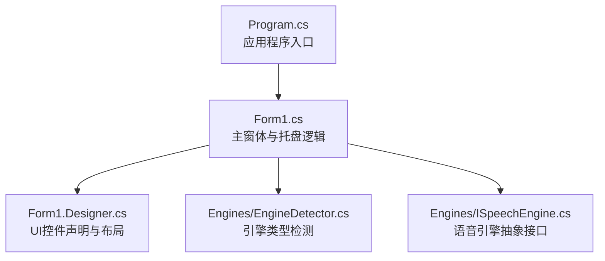
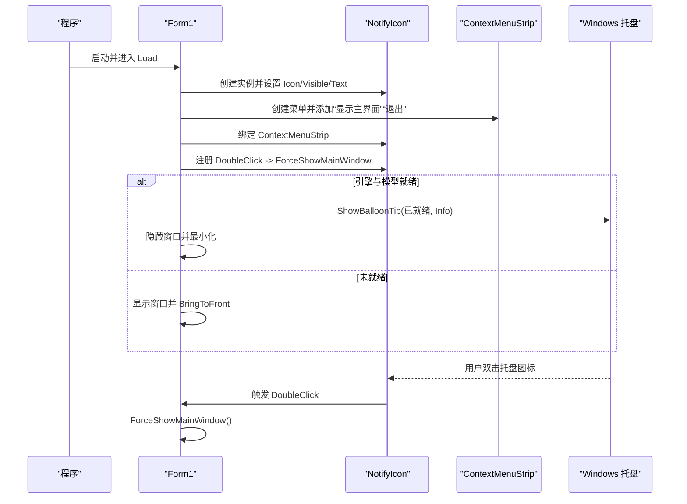
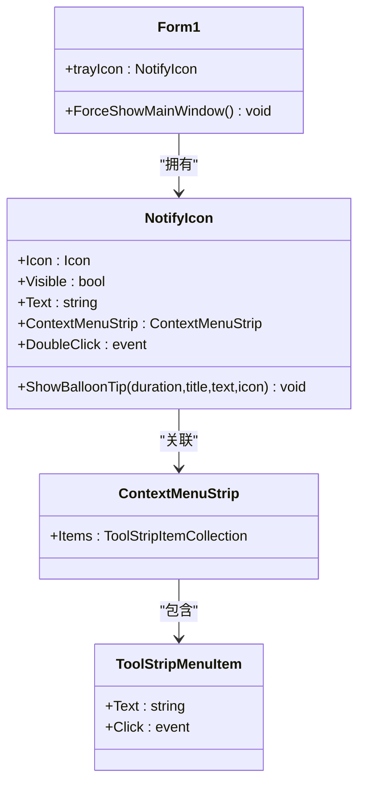
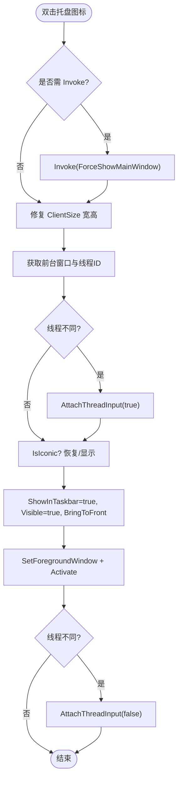
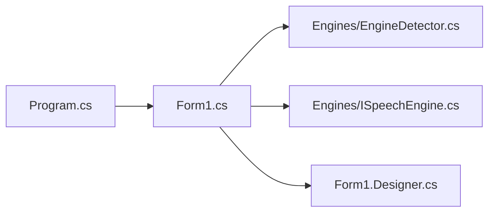

# 托盘图标系统

<cite>
**本文引用的文件**   
- [Form1.cs](file://t9s2t/Form1.cs)
- [Program.cs](file://t9s2t/Program.cs)
- [Form1.Designer.cs](file://t9s2t/Form1.Designer.cs)
- [EngineDetector.cs](file://t9s2t/Engines/EngineDetector.cs)
- [ISpeechEngine.cs](file://t9s2t/Engines/ISpeechEngine.cs)
</cite>

## 目录
1. [简介](#简介)
2. [项目结构](#项目结构)
3. [核心组件](#核心组件)
4. [架构总览](#架构总览)
5. [详细组件分析](#详细组件分析)
6. [依赖关系分析](#依赖关系分析)
7. [性能与线程同步](#性能与线程同步)
8. [故障排查指南](#故障排查指南)
9. [结论](#结论)
10. [附录：扩展示例（代码片段路径）](#附录扩展示例代码片段路径)

## 简介
本技术文档聚焦于 t9s2t 的托盘图标系统，围绕以下目标展开：
- 深入解释 NotifyIcon 组件的配置与初始化过程，包括图标设置、可见性控制与文本显示。
- 详细说明上下文菜单（ContextMenuStrip）的创建与管理，包括菜单项的动态添加、事件处理机制和用户交互响应。
- 阐述双击事件的处理逻辑，包括 ForceShowMainWindow 方法的实现细节、窗口激活策略与线程同步处理。
- 说明气球提示（BalloonTip）的使用场景与配置选项，包括提示信息的内容、显示时长与图标类型。
- 提供具体的代码示例路径，展示如何扩展托盘功能，如添加更多菜单项、实现右键快捷操作与自定义通知消息。

## 项目结构
本项目为 Windows Forms 应用，主窗体 Form1 负责托盘图标的生命周期管理、上下文菜单、双击行为与气球提示等；Program.cs 作为入口点启动 UI 线程；引擎检测与语音识别接口位于 Engines 目录下。

图表来源
- [Program.cs:15-24](file://t9s2t/Program.cs#L15-L24)
- [Form1.cs:144-170](file://t9s2t/Form1.cs#L144-L170)
- [Form1.Designer.cs:29-215](file://t9s2t/Form1.Designer.cs#L29-L215)
- [EngineDetector.cs:22-121](file://t9s2t/Engines/EngineDetector.cs#L22-L121)
- [ISpeechEngine.cs:8-33](file://t9s2t/Engines/ISpeechEngine.cs#L8-L33)

章节来源
- [Program.cs:15-24](file://t9s2t/Program.cs#L15-L24)
- [Form1.cs:144-170](file://t9s2t/Form1.cs#L144-L170)
- [Form1.Designer.cs:29-215](file://t9s2t/Form1.Designer.cs#L29-L215)

## 核心组件
- 托盘图标（NotifyIcon）：用于在系统托盘区常驻运行，承载状态文本、上下文菜单与气球提示。
- 上下文菜单（ContextMenuStrip）：提供“显示主界面”和“退出”等常用操作。
- 双击事件处理器：通过 ForceShowMainWindow 将最小化或隐藏的窗口恢复到前台并激活。
- 气球提示（BalloonTip）：用于向用户反馈关键状态（如就绪、最小化到托盘）。

章节来源
- [Form1.cs:163-170](file://t9s2t/Form1.cs#L163-L170)
- [Form1.cs:201-204](file://t9s2t/Form1.cs#L201-L204)
- [Form1.cs:243-258](file://t9s2t/Form1.cs#L243-L258)
- [Form1.cs:283-285](file://t9s2t/Form1.cs#L283-L285)

## 架构总览
托盘图标系统在主窗体加载时完成初始化，随后根据引擎与模型准备情况决定是后台运行还是保持窗口可见。托盘图标文本随识别状态动态更新，双击托盘图标可恢复主窗口。

图表来源
- [Form1.cs:163-170](file://t9s2t/Form1.cs#L163-L170)
- [Form1.cs:201-204](file://t9s2t/Form1.cs#L201-L204)
- [Form1.cs:243-258](file://t9s2t/Form1.cs#L243-L258)

## 详细组件分析

### NotifyIcon 组件配置与初始化
- 创建与基本属性
  - 在 Form1_Load 中创建 NotifyIcon，设置 Icon 为主窗体图标，Visible 为 true，初始 Text 为“启动中...”。
- 上下文菜单绑定
  - 创建 ContextMenuStrip，添加“显示主界面”和“退出”两个菜单项，并将 ContextMenuStrip 赋值给 trayIcon。
- 双击事件
  - 订阅 trayIcon.DoubleClick，回调 ForceShowMainWindow。
- 文本显示
  - 在不同阶段更新 trayIcon.Text，例如引擎加载成功后显示“t9s2t (引擎名)”，录音中显示“🎤 引擎名 录音中...”，输入完成后显示“✅ 已输入: ...”。

章节来源
- [Form1.cs:163-170](file://t9s2t/Form1.cs#L163-L170)
- [Form1.cs:706-708](file://t9s2t/Form1.cs#L706-L708)
- [Form1.cs:1003-1008](file://t9s2t/Form1.cs#L1003-L1008)
- [Form1.cs:1046-1050](file://t9s2t/Form1.cs#L1046-L1050)
- [Form1.cs:1167-1170](file://t9s2t/Form1.cs#L1167-L1170)
- [Form1.cs:1267-1270](file://t9s2t/Form1.cs#L1267-L1270)

### 上下文菜单（ContextMenuStrip）的创建与管理
- 动态创建与添加菜单项
  - 使用 new ContextMenuStrip() 创建菜单，Items.Add 添加“显示主界面”“退出”，并通过 lambda 表达式绑定点击事件。
- 事件处理机制
  - “显示主界面”调用 ForceShowMainWindow，确保跨线程安全地恢复窗口。
  - “退出”调用 Application.Exit 结束应用。
- 用户交互响应
  - 双击托盘图标同样触发 ForceShowMainWindow，保证一致的用户体验。

章节来源
- [Form1.cs:163-170](file://t9s2t/Form1.cs#L163-L170)

#### 上下文菜单类图

图表来源
- [Form1.cs:163-170](file://t9s2t/Form1.cs#L163-L170)

### 双击事件处理与 ForceShowMainWindow 实现
- 线程同步
  - 若当前线程非 UI 线程，则通过 this.Invoke 切换到 UI 线程执行，避免跨线程访问控件异常。
- 尺寸修复
  - 当窗口被最小化或隐藏后，ClientSize.Height 可能为 0，方法会先修正宽高再显示。
- 前台窗口激活策略
  - 获取前台窗口句柄与线程 ID，必要时 AttachThreadInput 以允许 SetForegroundWindow 成功。
  - 若窗口处于最小化状态则恢复，否则直接显示；最后调用 SetForegroundWindow 与 Activate 确保焦点。
- 线程解绑
  - 操作完成后恢复线程输入绑定，避免影响其他窗口。

图表来源
- [Form1.cs:243-258](file://t9s2t/Form1.cs#L243-L258)

章节来源
- [Form1.cs:243-258](file://t9s2t/Form1.cs#L243-L258)

### 气球提示（BalloonTip）的使用场景与配置
- 使用场景
  - 引擎与模型就绪后，显示“已就绪”提示，告知用户可在后台运行并使用快捷键。
  - 用户关闭主窗口时，显示“最小化到托盘”提示，引导用户理解行为。
- 配置选项
  - 显示时长：毫秒级参数，分别设置为 3000ms 与 2000ms。
  - 标题与内容：简洁明确的状态信息。
  - 图标类型：ToolTipIcon.Info，表示一般信息提示。

章节来源
- [Form1.cs:201-204](file://t9s2t/Form1.cs#L201-L204)
- [Form1.cs:283-285](file://t9s2t/Form1.cs#L283-L285)

## 依赖关系分析
- 入口与主窗体
  - Program.Main 启动 UI 线程并运行 Form1。
- 托盘与 UI
  - Form1 在 Load 中创建托盘图标与上下文菜单，并在生命周期内更新托盘文本与提示。
- 引擎与识别
  - Form1 通过 EngineDetector 检测模型类型并创建 ISpeechEngine 实例，结合音频采集与流式处理更新托盘状态。

图表来源
- [Program.cs:15-24](file://t9s2t/Program.cs#L15-L24)
- [Form1.cs:144-170](file://t9s2t/Form1.cs#L144-L170)
- [EngineDetector.cs:22-121](file://t9s2t/Engines/EngineDetector.cs#L22-L121)
- [ISpeechEngine.cs:8-33](file://t9s2t/Engines/ISpeechEngine.cs#L8-L33)
- [Form1.Designer.cs:29-215](file://t9s2t/Form1.Designer.cs#L29-L215)

章节来源
- [Program.cs:15-24](file://t9s2t/Program.cs#L15-L24)
- [Form1.cs:144-170](file://t9s2t/Form1.cs#L144-L170)
- [EngineDetector.cs:22-121](file://t9s2t/Engines/EngineDetector.cs#L22-L121)
- [ISpeechEngine.cs:8-33](file://t9s2t/Engines/ISpeechEngine.cs#L8-L33)
- [Form1.Designer.cs:29-215](file://t9s2t/Form1.Designer.cs#L29-L215)

## 性能与线程同步
- 跨线程 UI 更新
  - 使用 BeginInvoke/Invoke 将 UI 更新调度到 UI 线程，避免跨线程异常与界面卡顿。
- 键盘输入与剪贴板
  - 使用锁保护输入流程，防止并发导致的粘贴冲突；必要时临时释放修饰键以避免系统菜单弹出。
- 音频数据流
  - 流式模式下对 partial 结果进行节流与去重，减少 UI 刷新频率，提升用户体验。

章节来源
- [Form1.cs:1003-1008](file://t9s2t/Form1.cs#L1003-L1008)
- [Form1.cs:1012-1050](file://t9s2t/Form1.cs#L1012-L1050)
- [Form1.cs:1088-1098](file://t9s2t/Form1.cs#L1088-L1098)

## 故障排查指南
- 托盘图标不显示
  - 检查 Form1_Load 中 trayIcon.Visible 是否为 true，以及 ContextMenuStrip 是否正确绑定。
- 双击托盘无反应
  - 确认 DoubleClick 事件已订阅，且 ForceShowMainWindow 内部 Invoke 逻辑正常。
- 气球提示未出现
  - 检查 ShowBalloonTip 的调用时机与参数，确保在 UI 线程执行。
- 窗口无法置顶
  - 检查 AttachThreadInput 与 SetForegroundWindow 的调用顺序与线程 ID 匹配。

章节来源
- [Form1.cs:163-170](file://t9s2t/Form1.cs#L163-L170)
- [Form1.cs:243-258](file://t9s2t/Form1.cs#L243-L258)
- [Form1.cs:201-204](file://t9s2t/Form1.cs#L201-L204)

## 结论
t9s2t 的托盘图标系统通过 NotifyIcon 与 ContextMenuStrip 提供了稳定的后台运行能力与便捷的用户交互。ForceShowMainWindow 确保了窗口恢复的一致性与健壮性，而 BalloonTip 则在关键节点为用户提供清晰的状态反馈。结合引擎检测与流式识别，托盘文本能够实时反映识别进度与结果，整体架构清晰、可扩展性强。

## 附录：扩展示例（代码片段路径）
以下为可直接参考的代码片段路径，便于扩展托盘功能：

- 添加更多菜单项（右键快捷操作）
  - 参考路径：[Form1.cs:163-170](file://t9s2t/Form1.cs#L163-L170)
  - 建议：在 ContextMenuStrip.Items.Add 处新增菜单项，并绑定相应事件处理逻辑。

- 自定义通知消息（气球提示）
  - 参考路径：[Form1.cs:201-204](file://t9s2t/Form1.cs#L201-L204)
  - 建议：在业务关键节点调用 ShowBalloonTip，设置合适的时长、标题、内容与图标类型。

- 更新托盘文本（状态反馈）
  - 参考路径：
    - [Form1.cs:706-708](file://t9s2t/Form1.cs#L706-L708)
    - [Form1.cs:1003-1008](file://t9s2t/Form1.cs#L1003-L1008)
    - [Form1.cs:1046-1050](file://t9s2t/Form1.cs#L1046-L1050)
    - [Form1.cs:1167-1170](file://t9s2t/Form1.cs#L1167-L1170)
    - [Form1.cs:1267-1270](file://t9s2t/Form1.cs#L1267-L1270)
  - 建议：在引擎加载、录音开始、识别完成等阶段更新托盘文本，增强用户感知。

- 双击恢复主窗口（ForceShowMainWindow）
  - 参考路径：[Form1.cs:243-258](file://t9s2t/Form1.cs#L243-L258)
  - 建议：如需扩展行为（如切换主题、打开设置），可在该方法末尾追加逻辑。