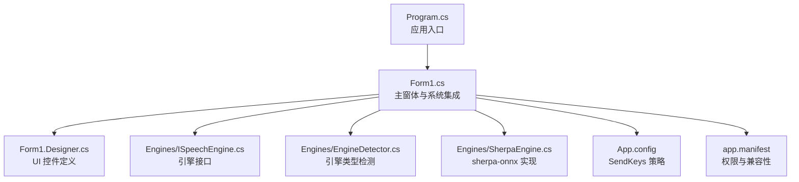
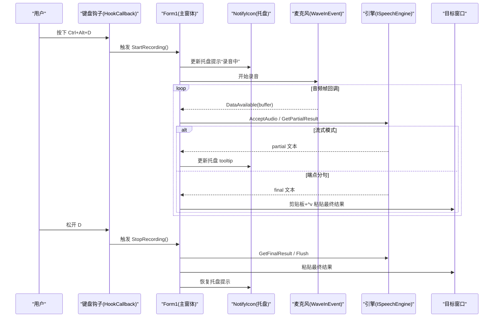
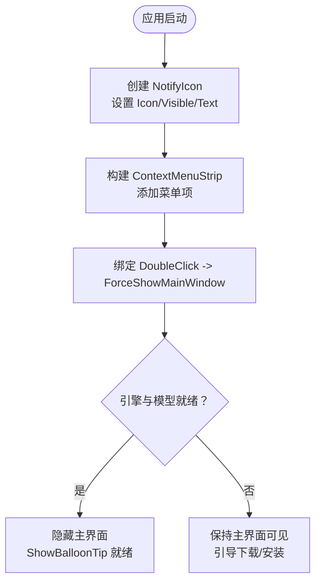
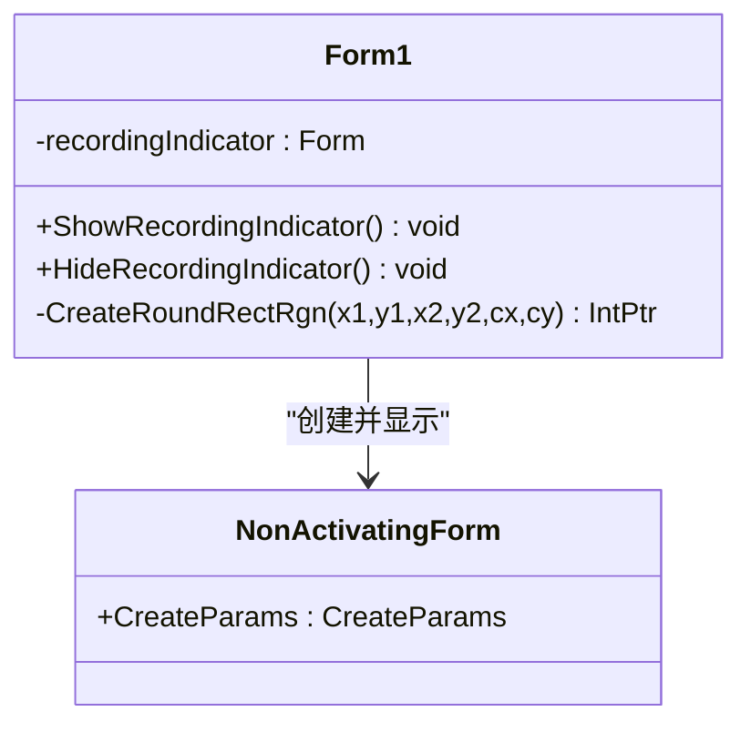
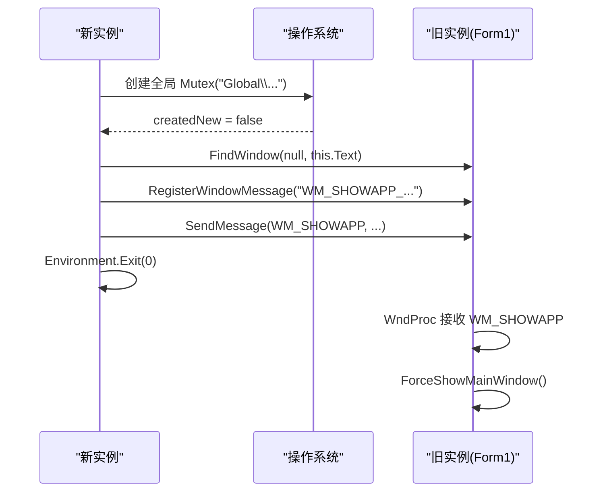
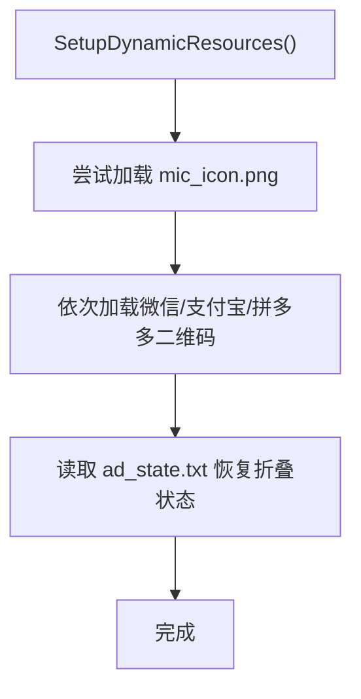
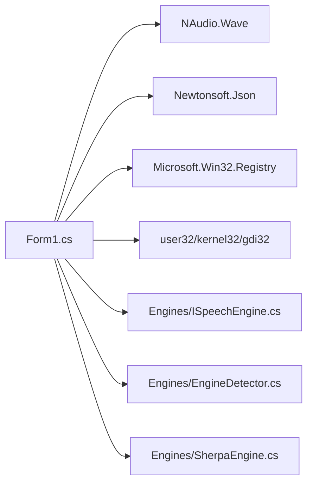

# 系统集成特性

<cite>
**本文引用的文件**
- [Program.cs](file://t9s2t/Program.cs)
- [Form1.cs](file://t9s2t/Form1.cs)
- [Form1.Designer.cs](file://t9s2t/Form1.Designer.cs)
- [App.config](file://t9s2t/App.config)
- [app.manifest](file://t9s2t/app.manifest)
- [EngineDetector.cs](file://t9s2t/Engines/EngineDetector.cs)
- [ISpeechEngine.cs](file://t9s2t/Engines/ISpeechEngine.cs)
- [SherpaEngine.cs](file://t9s2t/Engines/SherpaEngine.cs)
</cite>

## 目录
1. [简介](#简介)
2. [项目结构](#项目结构)
3. [核心组件](#核心组件)
4. [架构总览](#架构总览)
5. [详细组件分析](#详细组件分析)
6. [依赖关系分析](#依赖关系分析)
7. [性能与内存优化](#性能与内存优化)
8. [故障排查指南](#故障排查指南)
9. [结论](#结论)
10. [附录：扩展示例路径](#附录扩展示例路径)

## 简介
本技术文档聚焦 t9s2t 的系统集成能力，围绕以下主题展开：托盘图标（NotifyIcon）配置、上下文菜单与双击事件；非激活提示窗体（透明、无边框、鼠标穿透）；开机自启动（注册表读写、权限处理与错误恢复）；单实例运行控制（Mutex、进程间通信、窗口激活）；动态资源管理（运行时图片加载、资源文件管理与内存优化）。同时提供可扩展的集成点与自定义 UI 行为的具体代码片段路径，便于二次开发。

## 项目结构
- 应用入口与初始化：Program.cs 负责 TLS 策略与应用生命周期设置。
- 主界面与系统集成：Form1.cs 实现托盘、键盘钩子、录音流程、模型下载与引擎加载等。
- 界面设计器：Form1.Designer.cs 定义静态控件布局与默认样式。
- 运行时配置：App.config 强制 SendKeys 使用 SendInput API，避免 UI 线程阻塞死锁。
- 清单与权限：app.manifest 声明执行级别与兼容性。
- 语音引擎抽象与实现：Engines 目录包含接口、检测器与 sherpa-onnx 封装。



图表来源
- [Program.cs:1-27](file://t9s2t/Program.cs#L1-L27)
- [Form1.cs:1-235](file://t9s2t/Form1.cs#L1-L235)
- [Form1.Designer.cs:1-218](file://t9s2t/Form1.Designer.cs#L1-L218)
- [App.config:1-10](file://t9s2t/App.config#L1-L10)
- [app.manifest:1-18](file://t9s2t/app.manifest#L1-L18)
- [EngineDetector.cs:1-122](file://t9s2t/Engines/EngineDetector.cs#L1-L122)
- [ISpeechEngine.cs:1-35](file://t9s2t/Engines/ISpeechEngine.cs#L1-L35)
- [SherpaEngine.cs:1-608](file://t9s2t/Engines/SherpaEngine.cs#L1-L608)

章节来源
- [Program.cs:1-27](file://t9s2t/Program.cs#L1-L27)
- [Form1.cs:1-235](file://t9s2t/Form1.cs#L1-L235)
- [Form1.Designer.cs:1-218](file://t9s2t/Form1.Designer.cs#L1-L218)
- [App.config:1-10](file://t9s2t/App.config#L1-L10)
- [app.manifest:1-18](file://t9s2t/app.manifest#L1-L18)

## 核心组件
- 托盘与上下文菜单：在 Form1 中创建 NotifyIcon，绑定 ContextMenuStrip 与 DoubleClick 事件，用于显示主界面和退出。
- 非激活提示窗体：内部类 NonActivatingForm 通过扩展 CreateParams 注入 WS_EX_NOACTIVATE，结合无边框与圆角 Region 实现悬浮提示。
- 开机自启动：通过 CurrentUser\Run 注册表项写入/删除程序路径，并提供回退逻辑与用户提示。
- 单实例控制：全局 Mutex 确保唯一实例；若已存在，则通过 RegisterWindowMessage + SendMessage 唤醒旧实例并退出新实例。
- 动态资源管理：SetupDynamicResources 从应用目录加载 mic_icon.png 与二维码图片，失败时静默降级；广告面板状态持久化到本地文本文件。

章节来源
- [Form1.cs:151-235](file://t9s2t/Form1.cs#L151-L235)
- [Form1.cs:260-277](file://t9s2t/Form1.cs#L260-L277)
- [Form1.cs:1177-1226](file://t9s2t/Form1.cs#L1177-L1226)
- [Form1.cs:1292-1309](file://t9s2t/Form1.cs#L1292-L1309)
- [Form1.cs:290-303](file://t9s2t/Form1.cs#L290-L303)

## 架构总览
系统以 WinForms 为主界面，后台通过低层键盘钩子监听 Ctrl+Alt+D 组合键触发录音；音频数据经 NAudio 采集后送入 SherpaEngine 进行流式或离线识别；结果通过剪贴板与 SendKeys 粘贴至前台目标窗口；托盘图标提供常驻与交互入口；开机自启动与单实例保障用户体验一致性。



图表来源
- [Form1.cs:422-460](file://t9s2t/Form1.cs#L422-L460)
- [Form1.cs:1057-1111](file://t9s2t/Form1.cs#L1057-L1111)
- [Form1.cs:1146-1173](file://t9s2t/Form1.cs#L1146-L1173)
- [Form1.cs:1228-1273](file://t9s2t/Form1.cs#L1228-L1273)
- [Form1.cs:993-1051](file://t9s2t/Form1.cs#L993-L1051)
- [Form1.cs:164-169](file://t9s2t/Form1.cs#L164-L169)

## 详细组件分析

### 托盘图标与上下文菜单
- 托盘创建与可见性：在 Form1_Load 中创建 NotifyIcon，设置 Icon、Visible 与初始 Text。
- 上下文菜单：ContextMenuStrip 添加“显示主界面”与“退出”，分别调用 ForceShowMainWindow 与 Application.Exit。
- 双击事件：DoubleClick 直接调用 ForceShowMainWindow，快速唤起主界面。
- 气球提示：根据引擎就绪状态，使用 ShowBalloonTip 通知用户。



图表来源
- [Form1.cs:164-169](file://t9s2t/Form1.cs#L164-L169)
- [Form1.cs:196-214](file://t9s2t/Form1.cs#L196-L214)

章节来源
- [Form1.cs:164-169](file://t9s2t/Form1.cs#L164-L169)
- [Form1.cs:196-214](file://t9s2t/Form1.cs#L196-L214)

### 非激活提示窗体（透明、无边框、鼠标穿透）
- 无边框与置顶：BorderStyle=None、TopMost=true、ControlBox=false，保证提示浮于顶层且不干扰任务栏。
- 透明度与圆角：BackColor 半透明色配合 Opacity；Region 使用 CreateRoundRectRgn 绘制圆角矩形。
- 非激活与鼠标穿透：NonActivatingForm 重写 CreateParams，注入 WS_EX_NOACTIVATE 阻止激活；ShowWithoutActivate 语义由该扩展样式实现，点击不会抢占焦点。
- 定位策略：计算屏幕工作区尺寸，将提示窗置于底部居中位置。



图表来源
- [Form1.cs:1177-1226](file://t9s2t/Form1.cs#L1177-L1226)
- [Form1.cs:1292-1309](file://t9s2t/Form1.cs#L1292-L1309)

章节来源
- [Form1.cs:1177-1226](file://t9s2t/Form1.cs#L1177-L1226)
- [Form1.cs:1292-1309](file://t9s2t/Form1.cs#L1292-L1309)

### 开机自启动（注册表读写、权限处理与错误恢复）
- 读取状态：IsAutoStartEnabled 检查 HKCU\Software\Microsoft\Windows\CurrentVersion\Run 下是否存在 t9s2t 值。
- 写入/删除：ChkAutoStart_CheckedChanged 根据勾选状态 SetValue 或 DeleteValue。
- 权限与异常：捕获异常并弹窗提示，同时将复选框状态回滚，避免不一致。
- 建议：当前使用 CurrentUser 范围，无需管理员权限；如需所有用户生效可切换为 LocalMachine，但需提升权限。

```mermaid
flowchart TD
Check["用户勾选/取消"] --> TryOpen["打开 Run 注册表项"]
TryOpen --> |成功| SetOrDel{"是否勾选？"}
SetOrDel --> |是| SetValue["SetValue(\"t9s2t\", 可执行路径)"]
SetOrDel --> |否| DeleteValue["DeleteValue(\"t9s2t\")"]
TryOpen --> |异常| HandleErr["弹窗提示并回滚勾选状态"]
```

图表来源
- [Form1.cs:260-277](file://t9s2t/Form1.cs#L260-L277)

章节来源
- [Form1.cs:260-277](file://t9s2t/Form1.cs#L260-L277)

### 单实例运行控制（Mutex、IPC、窗口激活）
- 全局互斥量：使用 Global\t9s2t_single_instance_mutex_v3 命名空间下的 Mutex，确保仅一个实例运行。
- 进程间通信：注册自定义消息 WM_SHOWAPP_T9S2T_UNIQUE，通过 FindWindow 查找已有窗口句柄，SendMessage 发送消息。
- 窗口激活：ForceShowMainWindow 使用 AttachThreadInput 与 SetForegroundWindow 提升前台优先级，必要时还原最小化窗口。



图表来源
- [Form1.cs:151-162](file://t9s2t/Form1.cs#L151-L162)
- [Form1.cs:237-241](file://t9s2t/Form1.cs#L237-L241)
- [Form1.cs:243-258](file://t9s2t/Form1.cs#L243-L258)

章节来源
- [Form1.cs:151-162](file://t9s2t/Form1.cs#L151-L162)
- [Form1.cs:237-241](file://t9s2t/Form1.cs#L237-L241)
- [Form1.cs:243-258](file://t9s2t/Form1.cs#L243-L258)

### 动态资源管理（运行时图片加载、资源文件管理与内存优化）
- 运行时图片加载：SetupDynamicResources 从应用目录加载 mic_icon.png 与多个二维码图片，不存在则跳过，避免崩溃。
- 资源文件管理：广告面板折叠状态持久化到 ad_state.txt，启动时 RestoreAdPanelState 恢复用户偏好。
- 内存优化策略：
  - 按需加载图片，避免嵌入大资源导致启动慢。
  - 使用 try/catch 包裹文件操作，失败时静默降级。
  - 对临时下载的文件（如模型压缩包）使用临时目录并在解压完成后清理。



图表来源
- [Form1.cs:290-303](file://t9s2t/Form1.cs#L290-L303)
- [Form1.cs:385-411](file://t9s2t/Form1.cs#L385-L411)

章节来源
- [Form1.cs:290-303](file://t9s2t/Form1.cs#L290-L303)
- [Form1.cs:385-411](file://t9s2t/Form1.cs#L385-L411)

### 输入模拟与前台窗口管理
- 前台窗口选择：ForceForegroundWindow 优先使用当前前台窗口，若自身或提示窗在前台则回退到录音前保存的目标窗口句柄。
- 输入策略：先复制文本到剪贴板，再发送 ^v 粘贴，最后追加空格；若 Alt 仍按住，先释放以避免系统菜单弹出。
- 兜底方案：FallbackTypeText 逐字符发送，最慢但最稳。

```mermaid
flowchart TD
Start(["SimulateKeyboardInput(text,isFinal)"]) --> Partial{"isFinal ?"}
Partial --> |否| UpdateTray["BeginInvoke 更新托盘 tooltip"]
UpdateTray --> End(["返回"])
Partial --> |是| Lock["lock(_inputLock)"]
Lock --> Fore["ForceForegroundWindow()"]
Fore --> AltCheck{"Alt 是否仍按着？"}
AltCheck --> |是| ReleaseAlt["keybd_event(Menu, KEYUP)"]
AltCheck --> |否| SkipAlt["跳过"]
ReleaseAlt --> SleepA["Sleep(20ms)"]
SkipAlt --> Clipboard["Clipboard.SetText(text)"]
SleepA --> Clipboard
Clipboard --> SleepB["Sleep(50ms)"]
SleepB --> Paste["SendKeys.SendWait(\"^v\")"]
Paste --> Space["SendKeys.SendWait(\" \")"]
Space --> UIUpdate["BeginInvoke 更新 UI"]
UIUpdate --> End
```

图表来源
- [Form1.cs:993-1051](file://t9s2t/Form1.cs#L993-L1051)
- [Form1.cs:1114-1144](file://t9s2t/Form1.cs#L1114-L1144)
- [Form1.cs:1279-1290](file://t9s2t/Form1.cs#L1279-L1290)

章节来源
- [Form1.cs:993-1051](file://t9s2t/Form1.cs#L993-L1051)
- [Form1.cs:1114-1144](file://t9s2t/Form1.cs#L1114-L1144)
- [Form1.cs:1279-1290](file://t9s2t/Form1.cs#L1279-L1290)

## 依赖关系分析
- 外部库与平台 API：
  - NAudio.Wave：音频采集与回调。
  - Newtonsoft.Json：远程 JSON 解析。
  - Microsoft.Win32.Registry：注册表访问。
  - user32.dll/kernel32.dll/gdi32.dll：键盘钩子、窗口控制、圆角区域。
- 引擎抽象：
  - ISpeechEngine：统一接口屏蔽不同引擎差异。
  - EngineDetector：基于模型目录结构自动识别引擎类型。
  - SherpaEngine：sherpa-onnx 封装，支持 SenseVoice、Paraformer（含 large）、流式 Paraformer。



图表来源
- [Form1.cs:1-20](file://t9s2t/Form1.cs#L1-L20)
- [ISpeechEngine.cs:1-35](file://t9s2t/Engines/ISpeechEngine.cs#L1-L35)
- [EngineDetector.cs:1-122](file://t9s2t/Engines/EngineDetector.cs#L1-L122)
- [SherpaEngine.cs:1-608](file://t9s2t/Engines/SherpaEngine.cs#L1-L608)

章节来源
- [Form1.cs:1-20](file://t9s2t/Form1.cs#L1-L20)
- [ISpeechEngine.cs:1-35](file://t9s2t/Engines/ISpeechEngine.cs#L1-L35)
- [EngineDetector.cs:1-122](file://t9s2t/Engines/EngineDetector.cs#L1-L122)
- [SherpaEngine.cs:1-608](file://t9s2t/Engines/SherpaEngine.cs#L1-L608)

## 性能与内存优化
- 流式识别节流与去重：partial 结果仅在文本变化且超过阈值时间才更新 UI，减少频繁刷新带来的开销。
- 静音检测与端点分句：流式模式下基于 RMS 音量与内置端点规则，避免无意义数据处理与误触发。
- 资源按需加载：图片与二维码仅在文件存在时加载，避免无效 IO 与内存占用。
- 临时文件清理：模型下载与解压过程使用临时路径，完成后删除，降低磁盘碎片与残留风险。
- 线程安全：关键输入与引擎操作使用 lock 保护，避免竞态条件导致的重复粘贴或丢帧。

[本节为通用指导，不直接分析具体文件]

## 故障排查指南
- 托盘图标不可见：确认 Visible 设置为 true，并确保未在主界面关闭时意外释放 trayIcon。
- 开机自启动无效：检查 HKCU\Run 权限与杀毒软件拦截；查看异常弹窗提示并回滚勾选状态。
- 单实例失效：确认全局 Mutex 名称一致；检查 FindWindow 是否能找到已有窗口句柄。
- 输入粘贴失败：确认 App.config 中 SendKeys=SendInput；检查前台窗口句柄是否正确；必要时启用 FallbackTypeText。
- 引擎 DLL 缺失：查看 AreEngineDllsReady 与 DownloadEngineDllsAsync 日志，确认网络与 TLS 策略。

章节来源
- [Form1.cs:260-277](file://t9s2t/Form1.cs#L260-L277)
- [Form1.cs:151-162](file://t9s2t/Form1.cs#L151-L162)
- [App.config:1-10](file://t9s2t/App.config#L1-L10)
- [Form1.cs:468-567](file://t9s2t/Form1.cs#L468-L567)

## 结论
t9s2t 在系统集成方面提供了完善的托盘交互、非激活提示窗体、开机自启动、单实例控制与动态资源管理机制。通过清晰的抽象接口与模块化实现，系统具备良好的扩展性与稳定性。建议在后续迭代中继续优化资源缓存策略、增强错误恢复与日志记录，以提升用户体验与可维护性。

[本节为总结，不直接分析具体文件]

## 附录：扩展示例路径
- 扩展更多系统集成特性（例如右键菜单新增“关于”、“设置”）：
  - 参考托盘菜单构建与事件绑定：[Form1.cs:164-169](file://t9s2t/Form1.cs#L164-L169)
- 自定义用户界面行为（例如增加快捷键提示气泡）：
  - 参考托盘气球提示与 UI 更新：[Form1.cs:196-214](file://t9s2t/Form1.cs#L196-L214)
- 扩展非激活提示窗体（例如增加进度条或状态指示）：
  - 参考 NonActivatingForm 与圆角 Region 设置：[Form1.cs:1177-1226](file://t9s2t/Form1.cs#L1177-L1226), [Form1.cs:1292-1309](file://t9s2t/Form1.cs#L1292-L1309)
- 扩展开机自启动（例如增加多语言说明或卸载逻辑）：
  - 参考注册表读写与异常回滚：[Form1.cs:260-277](file://t9s2t/Form1.cs#L260-L277)
- 扩展单实例控制（例如增加版本比较或升级提示）：
  - 参考 Mutex 与 IPC 消息：[Form1.cs:151-162](file://t9s2t/Form1.cs#L151-L162), [Form1.cs:237-241](file://t9s2t/Form1.cs#L237-L241)
- 扩展动态资源管理（例如增加主题切换或图标热更新）：
  - 参考 SetupDynamicResources 与 ad_state.txt 持久化：[Form1.cs:290-303](file://t9s2t/Form1.cs#L290-L303), [Form1.cs:385-411](file://t9s2t/Form1.cs#L385-L411)