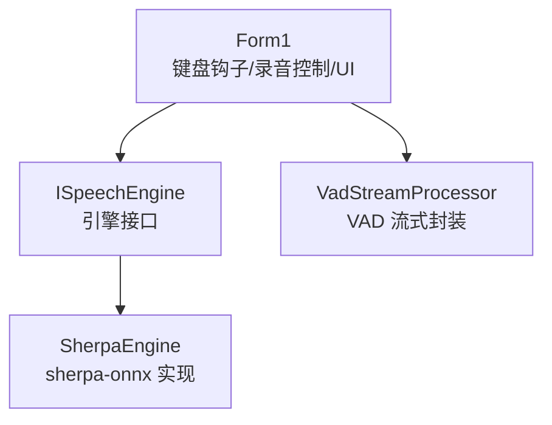
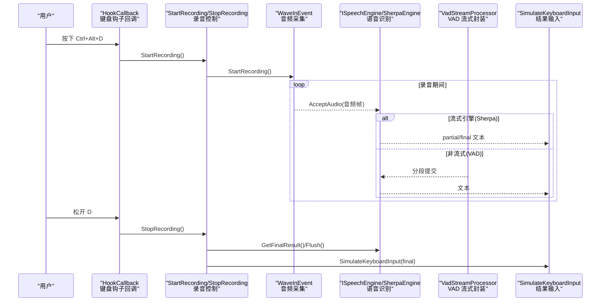
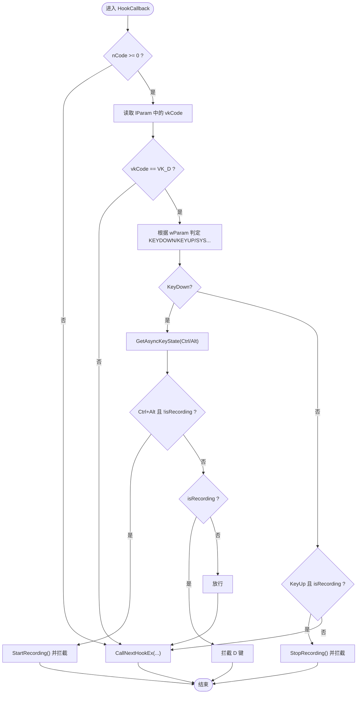
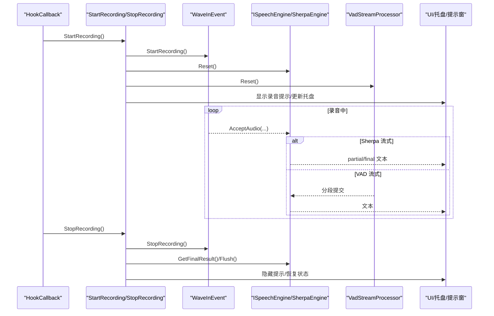
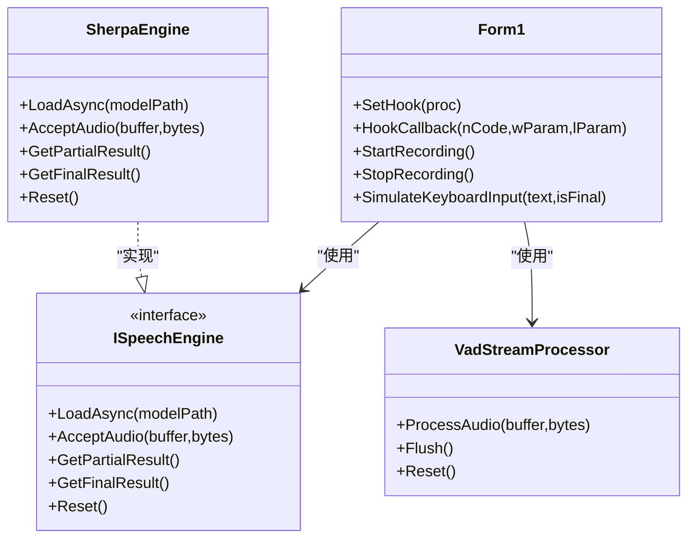

# 键盘钩子系统

<cite>
**本文引用的文件**   
- [Form1.cs](file://t9s2t/Form1.cs)
- [ISpeechEngine.cs](file://t9s2t/Engines/ISpeechEngine.cs)
- [SherpaEngine.cs](file://t9s2t/Engines/SherpaEngine.cs)
- [VadStreamProcessor.cs](file://t9s2t/Engines/VadStreamProcessor.cs)
</cite>

## 目录
1. [简介](#简介)
2. [项目结构](#项目结构)
3. [核心组件](#核心组件)
4. [架构总览](#架构总览)
5. [详细组件分析](#详细组件分析)
6. [依赖关系分析](#依赖关系分析)
7. [性能考量](#性能考量)
8. [故障排查指南](#故障排查指南)
9. [结论](#结论)
10. [附录：扩展与示例](#附录扩展与示例)

## 简介
本技术文档聚焦于 t9s2t 的键盘钩子系统，围绕低级别键盘钩子（WH_KEYBOARD_LL）的实现原理、回调注册与钩子链管理展开，深入解析 HookCallback 的事件处理逻辑，包括对 WM_KEYDOWN、WM_KEYUP、WM_SYSKEYDOWN、WM_SYSKEYUP 消息的区分与策略。同时阐述快捷键组合检测机制（如 Ctrl+Alt+D）、修饰键状态检查与按键拦截策略；并说明录音控制流程（StartRecording 与 StopRecording）的触发时机、状态管理与资源清理。最后提供扩展更多快捷键组合、自定义按键映射与处理特殊按键事件的具体方法指引。

## 项目结构
本项目采用“主窗体 + 引擎抽象 + 具体引擎实现”的分层组织方式：
- Form1.cs：承载 UI、托盘、全局键盘钩子、录音控制、结果输入等核心逻辑。
- Engines/ISpeechEngine.cs：语音识别引擎抽象接口。
- Engines/SherpaEngine.cs：基于 sherpa-onnx 的引擎实现，支持流式与非流式识别、标点恢复、VAD 集成。
- Engines/VadStreamProcessor.cs：将非流式模型模拟为流式识别的 VAD 处理器。

图表来源
- [Form1.cs:82-127](file://t9s2t/Form1.cs#L82-L127)
- [ISpeechEngine.cs:1-35](file://t9s2t/Engines/ISpeechEngine.cs#L1-L35)
- [SherpaEngine.cs:1-608](file://t9s2t/Engines/SherpaEngine.cs#L1-L608)
- [VadStreamProcessor.cs:1-162](file://t9s2t/Engines/VadStreamProcessor.cs#L1-L162)

章节来源
- [Form1.cs:1-235](file://t9s2t/Form1.cs#L1-L235)
- [ISpeechEngine.cs:1-35](file://t9s2t/Engines/ISpeechEngine.cs#L1-L35)
- [SherpaEngine.cs:1-120](file://t9s2t/Engines/SherpaEngine.cs#L1-L120)
- [VadStreamProcessor.cs:1-60](file://t9s2t/Engines/VadStreamProcessor.cs#L1-L60)

## 核心组件
- 低级别键盘钩子：通过 SetWindowsHookEx 安装 WH_KEYBOARD_LL，使用 LowLevelKeyboardProc 委托作为回调，在 HookCallback 中处理按键消息。
- 快捷键组合检测：在 HookCallback 中判断 VK_D 按下时，结合 GetAsyncKeyState 检查 Ctrl 与 Alt 是否同时按下，从而触发录音。
- 录音控制：StartRecording 启动录音设备与引擎，StopRecording 停止录音并输出最终结果；两者配合 isRecording 状态标志进行互斥保护。
- 结果输入：SimulateKeyboardInput 负责将识别文本原子化粘贴到目标窗口，避免闪烁与系统菜单干扰。

章节来源
- [Form1.cs:82-127](file://t9s2t/Form1.cs#L82-L127)
- [Form1.cs:415-460](file://t9s2t/Form1.cs#L415-L460)
- [Form1.cs:1146-1173](file://t9s2t/Form1.cs#L1146-L1173)
- [Form1.cs:1228-1273](file://t9s2t/Form1.cs#L1228-L1273)
- [Form1.cs:993-1051](file://t9s2t/Form1.cs#L993-L1051)

## 架构总览
下图展示了从键盘事件到语音识别再到文本输入的完整调用链。

图表来源
- [Form1.cs:422-460](file://t9s2t/Form1.cs#L422-L460)
- [Form1.cs:1146-1173](file://t9s2t/Form1.cs#L1146-L1173)
- [Form1.cs:1228-1273](file://t9s2t/Form1.cs#L1228-L1273)
- [Form1.cs:1064-1111](file://t9s2t/Form1.cs#L1064-L1111)
- [Form1.cs:993-1051](file://t9s2t/Form1.cs#L993-L1051)
- [VadStreamProcessor.cs:38-86](file://t9s2t/Engines/VadStreamProcessor.cs#L38-L86)
- [SherpaEngine.cs:351-479](file://t9s2t/Engines/SherpaEngine.cs#L351-L479)

## 详细组件分析

### 低级别键盘钩子（WH_KEYBOARD_LL）
- 安装钩子：SetHook 使用 SetWindowsHookEx(WH_KEYBOARD_LL, proc, GetModuleHandle(...), 0) 在当前进程模块上安装全局键盘钩子。
- 回调函数：LowLevelKeyboardProc 委托指向 HookCallback，接收 nCode、wParam、lParam。nCode >= 0 表示可处理消息。
- 钩子链管理：若未拦截，则调用 CallNextHookEx(_hookID, ...) 继续传递消息；返回非零值以拦截消息，阻止后续处理。

图表来源
- [Form1.cs:415-460](file://t9s2t/Form1.cs#L415-L460)

章节来源
- [Form1.cs:82-127](file://t9s2t/Form1.cs#L82-L127)
- [Form1.cs:415-460](file://t9s2t/Form1.cs#L415-L460)

### 消息类型与处理策略
- WM_KEYDOWN / WM_KEYUP：普通按键按下与释放。
- WM_SYSKEYDOWN / WM_SYSKEYUP：当 Alt 按住时，Windows 发送系统级消息而非普通消息。
- 处理策略：
  - 统一将 wParam 归类为 isKeyDown 或 isKeyUp，兼容普通与系统消息。
  - 在 KeyDown 分支中检查修饰键状态（Ctrl、Alt），仅在组合键满足条件时触发录音。
  - 在录音状态下拦截 D 键，防止字符输入；在 KeyUp 分支中停止录音。

章节来源
- [Form1.cs:108-117](file://t9s2t/Form1.cs#L108-L117)
- [Form1.cs:422-460](file://t9s2t/Form1.cs#L422-L460)

### 快捷键组合检测机制（Ctrl+Alt+D）
- 检测入口：HookCallback 中针对 VK_D 的 KeyDown 分支。
- 修饰键检查：使用 GetAsyncKeyState(VK_CONTROL) 与 GetAsyncKeyState(VK_MENU) 判断当前是否同时按下 Ctrl 与 Alt。
- 状态保护：isRecording 用于防止重复触发；仅在 !isRecording 时开始录音。
- 拦截策略：满足组合键条件时，调用 StartRecording 并返回非零值拦截按键；否则放行。

章节来源
- [Form1.cs:422-460](file://t9s2t/Form1.cs#L422-L460)

### 录音控制流程（StartRecording / StopRecording）
- StartRecording：
  - 双重检查 isRecording 与引擎/麦克风就绪。
  - 重置引擎与 VAD 处理器，启动 WaveInEvent 录音。
  - 保存前台窗口句柄，更新 UI 状态与悬浮提示。
- StopRecording：
  - 先停止录音设备，确保最后几帧数据被处理。
  - 在锁内设置 isRecording=false，并根据引擎模式获取最终结果或刷新 VAD。
  - 调用 SimulateKeyboardInput 将结果原子化粘贴到目标窗口。
  - 隐藏录音提示，恢复 UI 状态。

图表来源
- [Form1.cs:1146-1173](file://t9s2t/Form1.cs#L1146-L1173)
- [Form1.cs:1228-1273](file://t9s2t/Form1.cs#L1228-L1273)
- [Form1.cs:1064-1111](file://t9s2t/Form1.cs#L1064-L1111)
- [VadStreamProcessor.cs:88-101](file://t9s2t/Engines/VadStreamProcessor.cs#L88-L101)
- [SherpaEngine.cs:417-479](file://t9s2t/Engines/SherpaEngine.cs#L417-L479)

章节来源
- [Form1.cs:1146-1173](file://t9s2t/Form1.cs#L1146-L1173)
- [Form1.cs:1228-1273](file://t9s2t/Form1.cs#L1228-L1273)
- [Form1.cs:1064-1111](file://t9s2t/Form1.cs#L1064-L1111)

### 结果输入与防干扰策略
- SimulateKeyboardInput：
  - partial 结果仅更新托盘提示，不模拟到目标窗口，避免“删除-粘贴”闪烁。
  - final 结果在锁内执行：强制前台窗口、临时释放 Alt（避免 Alt+Space 弹出系统菜单）、复制文本到剪贴板、发送 ^v 与空格完成输入。
  - 异常回退：FallbackTypeText 逐字符模拟输入。

章节来源
- [Form1.cs:993-1051](file://t9s2t/Form1.cs#L993-L1051)
- [Form1.cs:1279-1290](file://t9s2t/Form1.cs#L1279-L1290)

### 引擎与 VAD 流式处理
- ISpeechEngine：定义加载、接受音频、部分/最终结果、重置等能力。
- SherpaEngine：
  - 自动检测模型类型（SenseVoice、Paraformer、离线 Paraformer-large）。
  - 支持流式（OnlineRecognizer）与非流式（OfflineRecognizer）两种路径。
  - 可选标点恢复与 VAD 模型加载。
- VadStreamProcessor：
  - 基于能量阈值与连续静音帧数进行分段，将非流式模型模拟为流式识别。
  - 提供 Flush 与 Reset 方法，适配录音结束与新一轮录音。

章节来源
- [ISpeechEngine.cs:1-35](file://t9s2t/Engines/ISpeechEngine.cs#L1-L35)
- [SherpaEngine.cs:74-127](file://t9s2t/Engines/SherpaEngine.cs#L74-L127)
- [SherpaEngine.cs:351-479](file://t9s2t/Engines/SherpaEngine.cs#L351-L479)
- [VadStreamProcessor.cs:38-86](file://t9s2t/Engines/VadStreamProcessor.cs#L38-L86)
- [VadStreamProcessor.cs:88-101](file://t9s2t/Engines/VadStreamProcessor.cs#L88-L101)

## 依赖关系分析
- Form1 依赖 Windows API（user32.dll、kernel32.dll）进行钩子安装、消息转发与窗口控制。
- Form1 通过 ISpeechEngine 抽象与 SherpaEngine 具体实现解耦，便于替换不同引擎。
- VadStreamProcessor 依赖 ISpeechEngine 提供的 AcceptAudio/GetFinalResult/Reset 能力。

图表来源
- [Form1.cs:82-127](file://t9s2t/Form1.cs#L82-L127)
- [Form1.cs:415-460](file://t9s2t/Form1.cs#L415-L460)
- [Form1.cs:1146-1173](file://t9s2t/Form1.cs#L1146-L1173)
- [Form1.cs:1228-1273](file://t9s2t/Form1.cs#L1228-L1273)
- [ISpeechEngine.cs:1-35](file://t9s2t/Engines/ISpeechEngine.cs#L1-L35)
- [SherpaEngine.cs:1-608](file://t9s2t/Engines/SherpaEngine.cs#L1-L608)
- [VadStreamProcessor.cs:1-162](file://t9s2t/Engines/VadStreamProcessor.cs#L1-L162)

章节来源
- [Form1.cs:82-127](file://t9s2t/Form1.cs#L82-L127)
- [ISpeechEngine.cs:1-35](file://t9s2t/Engines/ISpeechEngine.cs#L1-L35)
- [SherpaEngine.cs:1-608](file://t9s2t/Engines/SherpaEngine.cs#L1-L608)
- [VadStreamProcessor.cs:1-162](file://t9s2t/Engines/VadStreamProcessor.cs#L1-L162)

## 性能考量
- 钩子回调性能：HookCallback 中仅做轻量判断与状态切换，避免阻塞；必要时调用 CallNextHookEx 快速放行。
- 录音线程安全：使用 _inputLock 保护录音、引擎与输入操作的并发访问，防止竞态条件。
- 流式识别节流：partial 结果更新有最小间隔与去重逻辑，减少 UI 抖动与频繁输入。
- 输入稳定性：final 结果采用剪贴板 + 快捷键粘贴，辅以临时释放 Alt 的策略，降低系统菜单误触概率。

[本节为通用指导，无需特定文件引用]

## 故障排查指南
- 钩子未生效：
  - 确认 SetHook 已调用且 _hookID 非空；检查 UnhookWindowsHookEx 是否在退出时正确释放。
  - 参考：[Form1.cs:415-420](file://t9s2t/Form1.cs#L415-L420)、[Form1.cs:279-288](file://t9s2t/Form1.cs#L279-L288)
- 快捷键无响应：
  - 检查 GetAsyncKeyState 返回值是否为负数（高位为 1 表示按下）；确认 isRecording 状态未被意外置位。
  - 参考：[Form1.cs:433-448](file://t9s2t/Form1.cs#L433-L448)
- 录音中断或丢帧：
  - 确认 StopRecording 先停止录音设备再设置 isRecording=false，保证最后几帧被处理。
  - 参考：[Form1.cs:1228-1273](file://t9s2t/Form1.cs#L1228-L1273)
- 输入闪烁或系统菜单弹出：
  - 检查 SimulateKeyboardInput 中临时释放 Alt 的逻辑与等待时间是否足够。
  - 参考：[Form1.cs:1018-1033](file://t9s2t/Form1.cs#L1018-L1033)

章节来源
- [Form1.cs:415-420](file://t9s2t/Form1.cs#L415-L420)
- [Form1.cs:279-288](file://t9s2t/Form1.cs#L279-L288)
- [Form1.cs:433-448](file://t9s2t/Form1.cs#L433-L448)
- [Form1.cs:1228-1273](file://t9s2t/Form1.cs#L1228-L1273)
- [Form1.cs:1018-1033](file://t9s2t/Form1.cs#L1018-L1033)

## 结论
t9s2t 的键盘钩子系统通过低级别钩子捕获全局按键，结合修饰键状态检查与录音状态机，实现了稳定可靠的快捷键触发与按键拦截。录音控制流程在多线程环境下通过锁与顺序控制保障数据完整性，结果输入采用剪贴板与快捷键粘贴提升用户体验。整体架构清晰、职责分离良好，易于扩展新的快捷键组合与识别引擎。

[本节为总结性内容，无需特定文件引用]

## 附录：扩展与示例

### 扩展更多快捷键组合
- 思路：
  - 在 HookCallback 中增加对其它虚拟键码的判断（例如 VK_A、VK_S 等）。
  - 在 KeyDown 分支中组合不同的修饰键状态（Ctrl、Alt、Shift），形成新的触发条件。
  - 对于新组合键，可在满足条件时调用 StartRecording 或其他业务方法，并返回非零值拦截按键。
- 参考位置：
  - 钩子回调与组合键判断：[Form1.cs:422-460](file://t9s2t/Form1.cs#L422-L460)
  - 虚拟键常量定义：[Form1.cs:108-117](file://t9s2t/Form1.cs#L108-L117)

### 实现自定义按键映射
- 思路：
  - 维护一个映射表（如 Dictionary<int, Action>），将虚拟键码映射到具体动作。
  - 在 HookCallback 中查找映射表，找到匹配项后执行对应动作并决定是否拦截。
  - 注意保持线程安全，必要时加锁或使用不可变集合。
- 参考位置：
  - 钩子回调入口与拦截策略：[Form1.cs:422-460](file://t9s2t/Form1.cs#L422-L460)

### 处理特殊按键事件
- 思路：
  - 在 HookCallback 中扩展对系统消息（WM_SYSKEYDOWN/WM_SYSKEYUP）的处理，例如拦截 Alt+F4、Win 键等。
  - 根据业务需求选择拦截或放行，必要时调用 keybd_event 模拟按键释放以避免系统菜单弹出。
- 参考位置：
  - 系统消息常量与处理分支：[Form1.cs:108-117](file://t9s2t/Form1.cs#L108-L117)、[Form1.cs:429-431](file://t9s2t/Form1.cs#L429-L431)
  - 临时释放 Alt 的模拟按键：[Form1.cs:1018-1033](file://t9s2t/Form1.cs#L1018-L1033)

### 录音控制流程最佳实践
- 触发时机：
  - 组合键按下时立即开始录音，松开时停止录音，确保用户体验一致。
- 状态管理：
  - 使用 isRecording 与锁保护避免重复触发与竞态。
- 资源清理：
  - StopRecording 中先停止录音设备，再在锁内设置状态，最后清理 UI 与提示窗。
- 参考位置：
  - 开始录音：[Form1.cs:1146-1173](file://t9s2t/Form1.cs#L1146-L1173)
  - 停止录音：[Form1.cs:1228-1273](file://t9s2t/Form1.cs#L1228-L1273)