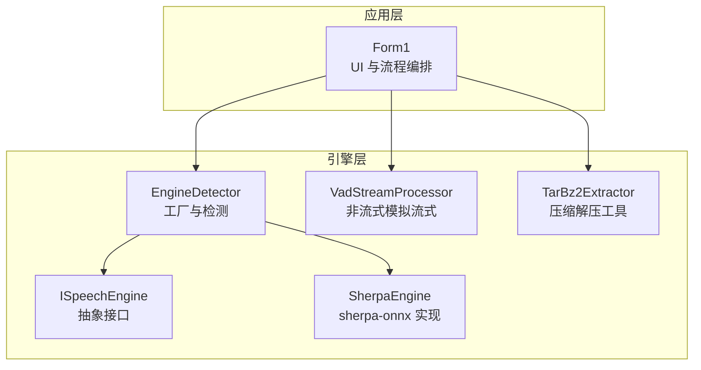
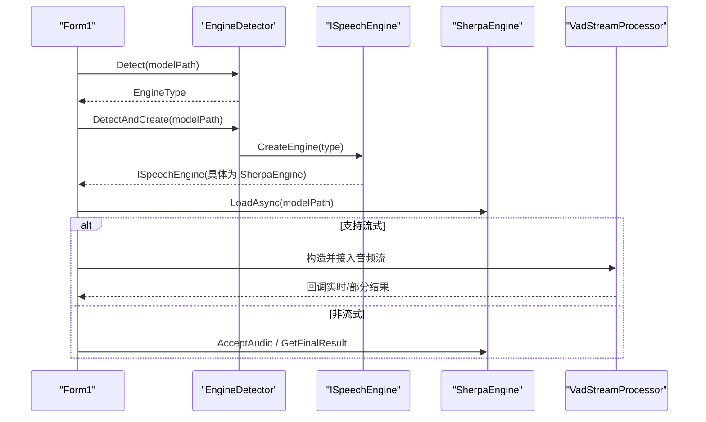
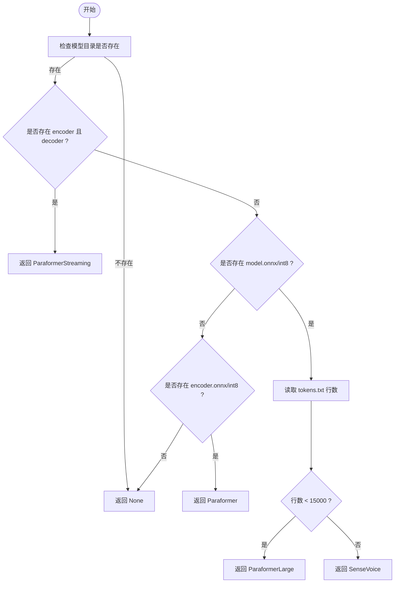
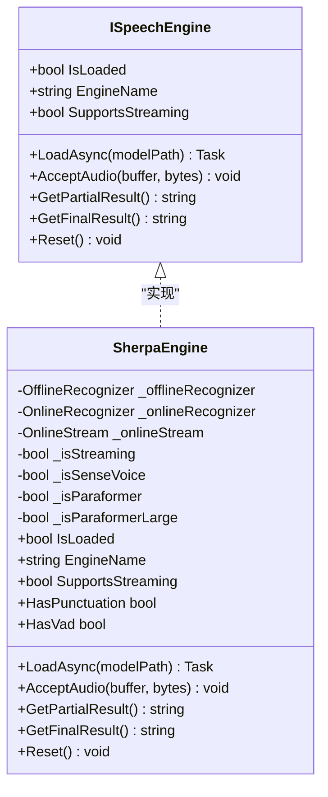
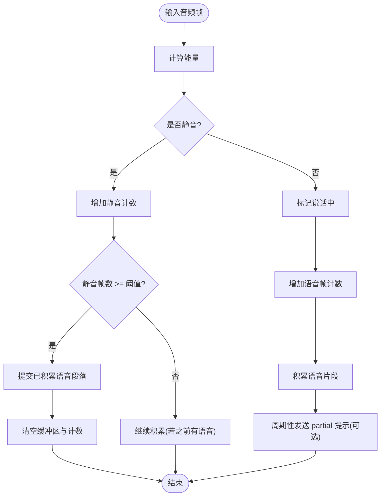
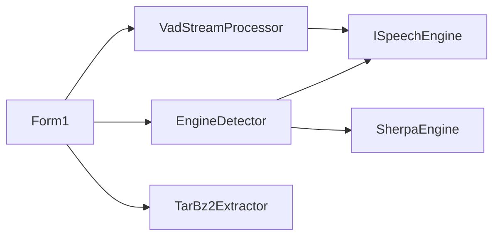

# EngineDetector 工厂模式

<cite>
**本文引用的文件**   
- [EngineDetector.cs](file://t9s2t/Engines/EngineDetector.cs)
- [ISpeechEngine.cs](file://t9s2t/Engines/ISpeechEngine.cs)
- [SherpaEngine.cs](file://t9s2t/Engines/SherpaEngine.cs)
- [VadStreamProcessor.cs](file://t9s2t/Engines/VadStreamProcessor.cs)
- [TarBz2Extractor.cs](file://t9s2t/Engines/TarBz2Extractor.cs)
- [Form1.cs](file://t9s2t/Form1.cs)
</cite>

## 目录
1. [简介](#简介)
2. [项目结构](#项目结构)
3. [核心组件](#核心组件)
4. [架构总览](#架构总览)
5. [详细组件分析](#详细组件分析)
6. [依赖关系分析](#依赖关系分析)
7. [性能与资源管理](#性能与资源管理)
8. [故障排查指南](#故障排查指南)
9. [结论](#结论)
10. [附录：使用示例与扩展指南](#附录使用示例与扩展指南)

## 简介
本技术文档围绕 EngineDetector 类及其相关组件，系统性阐述基于工厂模式的语音识别引擎自动检测与实例创建机制。内容涵盖：
- 引擎类型枚举（SenseVoice、Paraformer、Paraformer-large、ParaformerStreaming）及特性差异
- 模型目录扫描与类型识别算法
- 引擎实例的创建策略与多引擎支持
- 流式与非流式处理路径
- 扩展新引擎类型的步骤与配置要求
- 结合 UI 层的使用示例与最佳实践

## 项目结构
本项目采用分层组织方式：
- Engines 目录：封装各语音识别引擎实现与工具类
- Form1.cs：UI 与业务编排，负责调用 EngineDetector 完成检测与加载
- 其他辅助工具：压缩解压、VAD 流式模拟等

图表来源
- [EngineDetector.cs:1-122](file://t9s2t/Engines/EngineDetector.cs#L1-L122)
- [ISpeechEngine.cs:1-35](file://t9s2t/Engines/ISpeechEngine.cs#L1-L35)
- [SherpaEngine.cs:1-608](file://t9s2t/Engines/SherpaEngine.cs#L1-L608)
- [VadStreamProcessor.cs:1-162](file://t9s2t/Engines/VadStreamProcessor.cs#L1-L162)
- [TarBz2Extractor.cs:1-143](file://t9s2t/Engines/TarBz2Extractor.cs#L1-L143)
- [Form1.cs:608-721](file://t9s2t/Form1.cs#L608-L721)

章节来源
- [EngineDetector.cs:1-122](file://t9s2t/Engines/EngineDetector.cs#L1-L122)
- [Form1.cs:608-721](file://t9s2t/Form1.cs#L608-L721)

## 核心组件
- EngineDetector：提供静态方法用于“检测 + 创建”引擎，内部通过模型目录结构判断引擎类型并返回对应 ISpeechEngine 实例。
- ISpeechEngine：定义统一的引擎能力契约，包括异步加载、音频输入、部分结果、最终结果、重置等。
- SherpaEngine：基于 sherpa-onnx 的具体实现，同时支持 SenseVoice、离线 Paraformer、离线 Paraformer-large 以及流式 Paraformer。
- VadStreamProcessor：将非流式引擎包装为“伪流式”，通过静音分段触发识别，提升交互体验。
- TarBz2Extractor：提供 tar.bz2/tar.gz/zip 等格式的解压能力，便于模型部署。

章节来源
- [EngineDetector.cs:1-122](file://t9s2t/Engines/EngineDetector.cs#L1-L122)
- [ISpeechEngine.cs:1-35](file://t9s2t/Engines/ISpeechEngine.cs#L1-L35)
- [SherpaEngine.cs:1-608](file://t9s2t/Engines/SherpaEngine.cs#L1-L608)
- [VadStreamProcessor.cs:1-162](file://t9s2t/Engines/VadStreamProcessor.cs#L1-L162)
- [TarBz2Extractor.cs:1-143](file://t9s2t/Engines/TarBz2Extractor.cs#L1-L143)

## 架构总览
下图展示了从 UI 到引擎层的完整调用链，包括自动检测、实例创建、模型加载与流式处理分支。

图表来源
- [Form1.cs:608-721](file://t9s2t/Form1.cs#L608-L721)
- [EngineDetector.cs:27-104](file://t9s2t/Engines/EngineDetector.cs#L27-L104)
- [SherpaEngine.cs:57-72](file://t9s2t/Engines/SherpaEngine.cs#L57-L72)
- [VadStreamProcessor.cs:28-86](file://t9s2t/Engines/VadStreamProcessor.cs#L28-L86)

## 详细组件分析

### EngineDetector 工厂与检测算法
- 职责
  - 根据模型目录中的关键文件特征推断引擎类型
  - 根据类型创建对应的 ISpeechEngine 实例
  - 提供显示名称映射，便于 UI 展示
- 支持的引擎类型
  - None：未检测到已知引擎
  - SenseVoice：sherpa-onnx 非流式，模型文件 model.onnx/model.int8.onnx，词汇表 tokens.txt 行数较大
  - Paraformer：sherpa-onnx 非流式，仅存在 encoder.onnx/encoder.int8.onnx
  - ParaformerLarge：sherpa-onnx 非流式，model.onnx/model.int8.onnx + tokens.txt 行数较小（中文大模型）
  - ParaformerStreaming：sherpa-onnx 流式，同时存在 encoder.onnx/decoder.onnx
- 检测优先级与规则
  - 优先判断流式 Paraformer（同时存在 encoder 与 decoder）
  - 其次判断是否存在 model.onnx/int8，并通过 tokens.txt 行数区分 SenseVoice 与 Paraformer-large
  - 最后判断是否仅有 encoder.onnx/int8（非流式 Paraformer）
- 实例创建
  - 统一返回 ISpeechEngine 实例；当前所有类型均返回 SherpaEngine，其中流式类型传入 streaming=true

图表来源
- [EngineDetector.cs:27-75](file://t9s2t/Engines/EngineDetector.cs#L27-L75)

章节来源
- [EngineDetector.cs:10-17](file://t9s2t/Engines/EngineDetector.cs#L10-L17)
- [EngineDetector.cs:27-104](file://t9s2t/Engines/EngineDetector.cs#L27-L104)

### ISpeechEngine 接口契约
- 关键属性与方法
  - IsLoaded：引擎是否已加载就绪
  - EngineName：引擎显示名
  - SupportsStreaming：是否支持流式识别
  - LoadAsync(modelPath)：异步加载模型
  - AcceptAudio(buffer, bytes)：送入音频数据
  - GetPartialResult()：获取部分结果（流式）
  - GetFinalResult()：获取最终结果
  - Reset()：重置状态
- 设计要点
  - 面向接口编程，屏蔽底层引擎差异
  - 统一资源释放与生命周期管理

章节来源
- [ISpeechEngine.cs:1-35](file://t9s2t/Engines/ISpeechEngine.cs#L1-L35)

### SherpaEngine 实现细节
- 模型类型识别
  - 在 LoadAsync 中先进行类型识别，设置内部标志位（SenseVoice、Paraformer、Paraformer-large、流式）
  - 依据标志位选择不同加载路径（Offline/Online），并构建相应配置
- 非流式加载
  - SenseVoice：使用 OfflineSenseVoiceModelConfig
  - Paraformer-large：使用 OfflineParaformerModelConfig，优先 int8 量化模型
  - 非流式 Paraformer：使用 encoder.onnx/int8
- 流式加载
  - 使用 OnlineRecognizer，配置端点检测参数以平衡出字速度与稳定性
- 可选增强
  - 标点恢复：加载 punc.onnx/punc.int8.onnx
  - 语音活动检测：加载 vad.onnx（Silero VAD）
- 音频处理
  - 流式：按帧送入 OnlineStream，计算 RMS 音量抑制静音段
  - 非流式：累积字节缓冲，一次性识别
- 结果获取
  - GetPartialResult：流式模式下解码并返回临时文本
  - GetFinalResult：流式模式结束流后解码全部剩余数据；非流式模式直接整段识别
  - GetResultAndReset：流式中间分句时获取结果并重置 stream

图表来源
- [ISpeechEngine.cs:1-35](file://t9s2t/Engines/ISpeechEngine.cs#L1-L35)
- [SherpaEngine.cs:14-46](file://t9s2t/Engines/SherpaEngine.cs#L14-L46)

章节来源
- [SherpaEngine.cs:57-72](file://t9s2t/Engines/SherpaEngine.cs#L57-L72)
- [SherpaEngine.cs:74-115](file://t9s2t/Engines/SherpaEngine.cs#L74-L115)
- [SherpaEngine.cs:119-216](file://t9s2t/Engines/SherpaEngine.cs#L119-L216)
- [SherpaEngine.cs:220-255](file://t9s2t/Engines/SherpaEngine.cs#L220-L255)
- [SherpaEngine.cs:259-347](file://t9s2t/Engines/SherpaEngine.cs#L259-L347)
- [SherpaEngine.cs:351-479](file://t9s2t/Engines/SherpaEngine.cs#L351-L479)

### VadStreamProcessor 非流式模拟流式
- 目标
  - 对不支持原生流式的引擎（如 SenseVoice）进行“伪流式”包装
- 工作原理
  - 计算每帧能量，超过阈值视为语音，否则视为静音
  - 连续静音达到阈值后提交已积累的语音段落进行识别
  - 支持 Flush 强制提交，Reset 清理状态
- 回调
  - onResult：识别到文字时的回调
  - onPartial：可选的部分结果反馈（例如提示“正在听...”）

图表来源
- [VadStreamProcessor.cs:38-101](file://t9s2t/Engines/VadStreamProcessor.cs#L38-L101)

章节来源
- [VadStreamProcessor.cs:1-162](file://t9s2t/Engines/VadStreamProcessor.cs#L1-L162)

### TarBz2Extractor 压缩解压工具
- 功能
  - 支持 tar.bz2、tar.gz、zip 等格式解压
  - 针对 tar.bz2 采用两步解压（bzip2 -> tar）
- 适用场景
  - 模型包下载后的本地解压部署

章节来源
- [TarBz2Extractor.cs:1-143](file://t9s2t/Engines/TarBz2Extractor.cs#L1-L143)

## 依赖关系分析
- 耦合与内聚
  - EngineDetector 与 ISpeechEngine 松耦合，仅依赖接口契约
  - SherpaEngine 作为唯一实现，集中了 sherpa-onnx 的配置与推理逻辑
  - VadStreamProcessor 依赖 ISpeechEngine，不感知具体实现
- 外部依赖
  - sherpa-onnx C API（通过 NuGet 引入）
  - SharpCompress（压缩解压）
  - NAudio（录音与音频采集，位于 UI 层）

图表来源
- [EngineDetector.cs:1-122](file://t9s2t/Engines/EngineDetector.cs#L1-L122)
- [ISpeechEngine.cs:1-35](file://t9s2t/Engines/ISpeechEngine.cs#L1-L35)
- [SherpaEngine.cs:1-608](file://t9s2t/Engines/SherpaEngine.cs#L1-L608)
- [VadStreamProcessor.cs:1-162](file://t9s2t/Engines/VadStreamProcessor.cs#L1-L162)
- [TarBz2Extractor.cs:1-143](file://t9s2t/Engines/TarBz2Extractor.cs#L1-L143)
- [Form1.cs:608-721](file://t9s2t/Form1.cs#L608-L721)

章节来源
- [Form1.cs:608-721](file://t9s2t/Form1.cs#L608-L721)

## 性能与资源管理
- 模型加载
  - 优先使用 int8 量化模型以降低内存占用与推理延迟
  - 合理设置线程数（默认 4）以平衡 CPU 占用与吞吐
- 流式识别
  - 端点检测参数调优：Rule1MinTrailingSilence、Rule2MinTrailingSilence、Rule3MinUtteranceLength
  - RMS 音量阈值过滤静音，避免无意义推理
- 资源释放
  - ISpeechEngine 实现 IDisposable，确保在线/离线识别器、流、标点与 VAD 对象正确释放
- 内存与缓冲
  - 非流式模式使用 List<byte> 累积音频，注意及时 Reset 与清理

章节来源
- [SherpaEngine.cs:159-216](file://t9s2t/Engines/SherpaEngine.cs#L159-L216)
- [SherpaEngine.cs:220-255](file://t9s2t/Engines/SherpaEngine.cs#L220-L255)
- [SherpaEngine.cs:351-479](file://t9s2t/Engines/SherpaEngine.cs#L351-L479)
- [SherpaEngine.cs:591-605](file://t9s2t/Engines/SherpaEngine.cs#L591-L605)

## 故障排查指南
- 常见错误与定位
  - 缺少 tokens.txt：在非流式加载路径抛出异常，需确认模型完整性
  - 无法识别模型类型：当目录不符合任何已知模式时返回 None，需检查文件名与结构
  - 流式识别失败：GetPartialResult/GetFinalResult 捕获异常并记录日志，建议检查端点参数与音频采样率
  - 标点/VAD 加载失败：不影响主流程，但会跳过相应增强功能
- 调试建议
  - 关注 Debug 输出中的引擎检测与加载信息
  - 使用 GetDisplayName 快速确认当前引擎类型
  - 在 UI 层观察 lblStatus/lblEngine 的状态提示

章节来源
- [EngineDetector.cs:27-75](file://t9s2t/Engines/EngineDetector.cs#L27-L75)
- [SherpaEngine.cs:129-157](file://t9s2t/Engines/SherpaEngine.cs#L129-L157)
- [SherpaEngine.cs:259-347](file://t9s2t/Engines/SherpaEngine.cs#L259-L347)
- [SherpaEngine.cs:388-479](file://t9s2t/Engines/SherpaEngine.cs#L388-L479)

## 结论
EngineDetector 通过简洁的工厂方法与目录结构检测算法，实现了多引擎的统一接入与自动选择。配合 ISpeechEngine 抽象与 SherpaEngine 的具体实现，系统具备良好的可扩展性与可维护性。VadStreamProcessor 为非流式引擎提供了近似流式的用户体验，而 TarBz2Extractor 简化了模型部署流程。整体架构清晰、职责分明，适合持续演进与新增引擎类型。

## 附录：使用示例与扩展指南

### 使用示例（代码片段路径）
- 启动时检测并加载引擎
  - [Form1.cs:190-204](file://t9s2t/Form1.cs#L190-L204)
- 自动检查模型并更新 UI
  - [Form1.cs:608-642](file://t9s2t/Form1.cs#L608-L642)
- 创建并加载引擎实例
  - [Form1.cs:645-721](file://t9s2t/Form1.cs#L645-L721)
- 引擎检测与显示名称
  - [EngineDetector.cs:27-119](file://t9s2t/Engines/EngineDetector.cs#L27-L119)

### 扩展新引擎类型步骤
- 定义新的引擎类型
  - 在 EngineType 枚举中添加新成员（例如 NewEngine）
  - 参考路径：[EngineDetector.cs:10-17](file://t9s2t/Engines/EngineDetector.cs#L10-L17)
- 完善检测算法
  - 在 Detect 方法中增加对新模型目录结构的判断逻辑
  - 参考路径：[EngineDetector.cs:27-75](file://t9s2t/Engines/EngineDetector.cs#L27-L75)
- 实现引擎适配
  - 若已有通用实现（如 SherpaEngine），可在 CreateEngine 中为新类型返回该实现，并传入合适的构造参数
  - 若无通用实现，则新增一个实现类并实现 ISpeechEngine 接口
  - 参考路径：[EngineDetector.cs:80-95](file://t9s2t/Engines/EngineDetector.cs#L80-L95)、[ISpeechEngine.cs:1-35](file://t9s2t/Engines/ISpeechEngine.cs#L1-L35)
- 更新显示名称
  - 在 GetDisplayName 中为新类型添加友好名称
  - 参考路径：[EngineDetector.cs:109-119](file://t9s2t/Engines/EngineDetector.cs#L109-L119)
- 配置要求
  - 明确新引擎所需的模型文件清单（如 *.onnx、tokens.txt、punc.onnx、vad.onnx 等）
  - 在 UI 或部署脚本中提供相应的下载与解压流程（可复用 TarBz2Extractor）
  - 参考路径：[TarBz2Extractor.cs:1-143](file://t9s2t/Engines/TarBz2Extractor.cs#L1-L143)