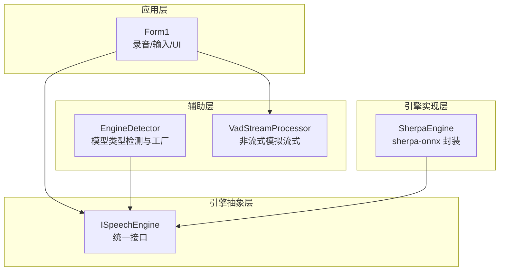
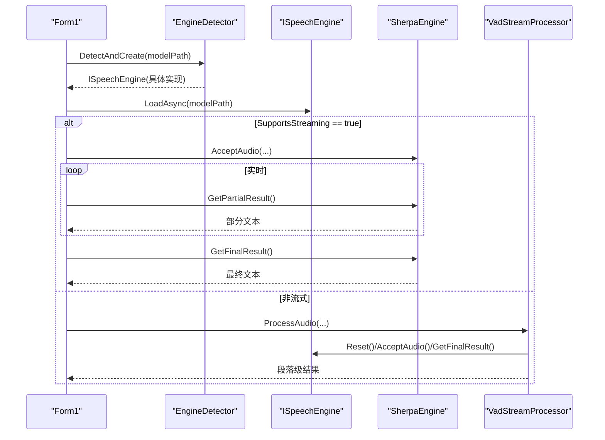
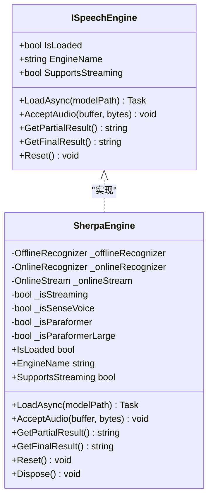
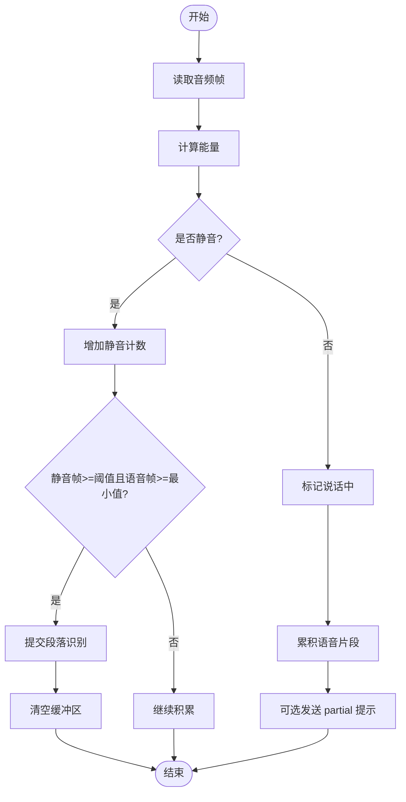
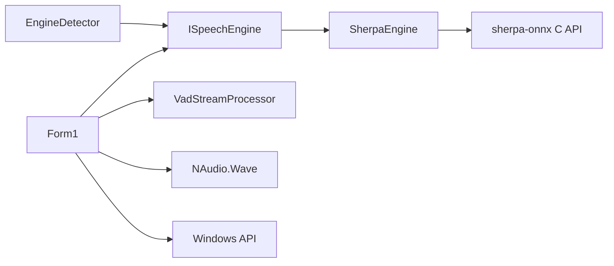

# ISpeechEngine 接口设计

<cite>
**本文引用的文件**   
- [ISpeechEngine.cs](file://t9s2t/Engines/ISpeechEngine.cs)
- [SherpaEngine.cs](file://t9s2t/Engines/SherpaEngine.cs)
- [EngineDetector.cs](file://t9s2t/Engines/EngineDetector.cs)
- [VadStreamProcessor.cs](file://t9s2t/Engines/VadStreamProcessor.cs)
- [Form1.cs](file://t9s2t/Form1.cs)
</cite>

## 目录
1. [简介](#简介)
2. [项目结构](#项目结构)
3. [核心组件](#核心组件)
4. [架构总览](#架构总览)
5. [详细组件分析](#详细组件分析)
6. [依赖关系分析](#依赖关系分析)
7. [性能考量](#性能考量)
8. [故障排查指南](#故障排查指南)
9. [结论](#结论)
10. [附录：自定义引擎实现指南与最佳实践](#附录自定义引擎实现指南与最佳实践)

## 简介
本技术文档围绕 ISpeechEngine 接口展开，系统阐述其抽象设计理念、统一方法定义、生命周期管理与错误处理机制。文档深入解释各属性与方法的作用，并结合现有 SherpaEngine 实现与上层调用流程，给出实现自定义语音识别引擎的规范与最佳实践建议。

## 项目结构
本项目采用“接口 + 具体引擎实现 + 检测器 + 流式处理器”的分层组织方式：
- 接口层：ISpeechEngine 定义统一的识别能力契约
- 实现层：SherpaEngine 基于 sherpa-onnx 提供多模型支持（SenseVoice、Paraformer、流式 Paraformer）
- 检测层：EngineDetector 根据模型目录结构自动选择并创建对应引擎实例
- 适配层：VadStreamProcessor 将非流式模型模拟为“类流式”体验
- 应用层：Form1 负责录音、UI、键盘输入等交互逻辑

图表来源
- [ISpeechEngine.cs:1-34](file://t9s2t/Engines/ISpeechEngine.cs#L1-L34)
- [SherpaEngine.cs:14-46](file://t9s2t/Engines/SherpaEngine.cs#L14-L46)
- [EngineDetector.cs:22-104](file://t9s2t/Engines/EngineDetector.cs#L22-L104)
- [VadStreamProcessor.cs:12-33](file://t9s2t/Engines/VadStreamProcessor.cs#L12-L33)
- [Form1.cs:645-721](file://t9s2t/Form1.cs#L645-L721)

章节来源
- [ISpeechEngine.cs:1-34](file://t9s2t/Engines/ISpeechEngine.cs#L1-L34)
- [EngineDetector.cs:22-104](file://t9s2t/Engines/EngineDetector.cs#L22-L104)
- [VadStreamProcessor.cs:12-162](file://t9s2t/Engines/VadStreamProcessor.cs#L12-L162)
- [Form1.cs:645-721](file://t9s2t/Form1.cs#L645-L721)

## 核心组件
- ISpeechEngine：定义统一的语音识别能力契约，包括状态属性、异步加载、音频输入、部分结果、最终结果与重置。
- SherpaEngine：基于 sherpa-onnx 的具体实现，支持多种模型（SenseVoice、离线/流式 Paraformer），并提供标点恢复与 VAD 集成。
- EngineDetector：通过模型目录结构自动判断引擎类型并创建对应引擎实例。
- VadStreamProcessor：对非流式模型进行静音分段与批量提交，模拟流式体验。
- Form1：应用主窗体，负责录音、按键钩子、结果粘贴到目标窗口等。

章节来源
- [ISpeechEngine.cs:1-34](file://t9s2t/Engines/ISpeechEngine.cs#L1-L34)
- [SherpaEngine.cs:14-608](file://t9s2t/Engines/SherpaEngine.cs#L14-L608)
- [EngineDetector.cs:22-121](file://t9s2t/Engines/EngineDetector.cs#L22-L121)
- [VadStreamProcessor.cs:12-162](file://t9s2t/Engines/VadStreamProcessor.cs#L12-L162)
- [Form1.cs:645-721](file://t9s2t/Form1.cs#L645-L721)

## 架构总览
ISpeechEngine 作为统一抽象，屏蔽底层不同引擎的差异；上层仅依赖接口进行录音、识别与结果输出。EngineDetector 在启动时根据模型目录结构自动选择合适引擎；对于不支持原生流式的模型，VadStreamProcessor 通过静音检测与分段提交，达到“边说边出字”的体验。

图表来源
- [Form1.cs:645-721](file://t9s2t/Form1.cs#L645-L721)
- [EngineDetector.cs:100-104](file://t9s2t/Engines/EngineDetector.cs#L100-L104)
- [SherpaEngine.cs:57-72](file://t9s2t/Engines/SherpaEngine.cs#L57-L72)
- [VadStreamProcessor.cs:38-136](file://t9s2t/Engines/VadStreamProcessor.cs#L38-L136)

## 详细组件分析

### ISpeechEngine 接口设计
- 设计理念
  - 统一方法定义：所有引擎暴露一致的加载、输入、结果获取与重置方法，便于上层无差别调用。
  - 生命周期管理：通过 IDisposable 与 Reset 明确资源释放与状态复位点，避免跨轮次污染。
  - 错误处理机制：接口方法返回空字符串或 null 表示无结果；异常由实现层捕获并记录日志，上层以健壮性处理为主。
- 属性说明
  - IsLoaded：指示引擎是否已加载就绪，用于 UI 显示与可用性检查。
  - EngineName：引擎显示名称，如 “SenseVoice”、“Paraformer” 等，便于用户识别当前使用的引擎。
  - SupportsStreaming：标识是否支持流式识别（边说边出字），决定上层走原生流式还是 VAD 模拟流式路径。
- 方法说明
  - LoadAsync(string modelPath)：异步加载模型，内部可包含模型类型检测、初始化 recognizer/stream 等耗时操作。
  - AcceptAudio(byte[] buffer, int bytes)：接收 PCM 音频数据，流式模式下直接送入在线识别器，非流式模式累积缓冲。
  - GetPartialResult()：流式模式下返回临时结果，非流式通常返回空。
  - GetFinalResult()：结束一轮识别后返回最终文本，可能包含标点恢复等后处理。
  - Reset()：清理内部状态，准备新一轮录音。

章节来源
- [ISpeechEngine.cs:1-34](file://t9s2t/Engines/ISpeechEngine.cs#L1-L34)

### SherpaEngine 实现要点
- 模型类型检测与加载
  - 根据目录内文件特征（model.onnx/int8、encoder/decoder、tokens.txt）区分 SenseVoice、离线 Paraformer-large、流式 Paraformer。
  - 流式模式使用 OnlineRecognizer + OnlineStream；非流式使用 OfflineRecognizer。
- 流式与非流式差异
  - 流式：AcceptAudio 直接喂入 OnlineStream，GetPartialResult 周期性解码并返回中间文本；GetFinalResult 通知输入结束并做最终解码与标点恢复。
  - 非流式：AcceptAudio 累积字节至内存列表，GetFinalResult 一次性转换并识别整段音频。
- 静音与端点检测
  - 内置 RMS 音量阈值与连续静音计数，避免静音幻觉；流式模式结合 OnlineRecognizer 的端点检测参数控制分句。
- 标点恢复与 VAD
  - 可选加载 punc.onnx 进行标点恢复；可选加载 vad.onnx 进行语音活动检测。
- 资源释放
  - Dispose 中释放 OnlineStream、OnlineRecognizer、OfflineRecognizer、Punctuation、VAD 等资源。

图表来源
- [ISpeechEngine.cs:1-34](file://t9s2t/Engines/ISpeechEngine.cs#L1-L34)
- [SherpaEngine.cs:14-608](file://t9s2t/Engines/SherpaEngine.cs#L14-L608)

章节来源
- [SherpaEngine.cs:57-72](file://t9s2t/Engines/SherpaEngine.cs#L57-L72)
- [SherpaEngine.cs:351-479](file://t9s2t/Engines/SherpaEngine.cs#L351-L479)
- [SherpaEngine.cs:591-605](file://t9s2t/Engines/SherpaEngine.cs#L591-L605)

### EngineDetector 自动检测与工厂
- 检测规则
  - 流式 Paraformer：存在 encoder + decoder 文件
  - SenseVoice / 离线 Paraformer-large：存在 model.onnx/int8，并通过 tokens.txt 行数区分
  - 非流式 Paraformer：仅存在 encoder 文件
- 工厂方法
  - CreateEngine(type) 根据类型返回对应的 ISpeechEngine 实例（均为 SherpaEngine，但 streaming 标志不同）
  - DetectAndCreate(modelPath) 一步完成检测与创建

章节来源
- [EngineDetector.cs:27-75](file://t9s2t/Engines/EngineDetector.cs#L27-L75)
- [EngineDetector.cs:80-104](file://t9s2t/Engines/EngineDetector.cs#L80-L104)

### VadStreamProcessor 非流式模拟流式
- 原理
  - 计算每帧能量，超过阈值视为语音，低于阈值视为静音
  - 当连续静音帧数达到阈值且满足最小语音帧数时，提交一段音频进行识别
- 回调机制
  - onResult：段落级最终结果回调
  - onPartial：可选的部分反馈（例如“正在听...”）
- 适用场景
  - 针对不支持原生流式的模型（如 SenseVoice），通过静音分段获得近似流式体验

图表来源
- [VadStreamProcessor.cs:38-136](file://t9s2t/Engines/VadStreamProcessor.cs#L38-L136)

章节来源
- [VadStreamProcessor.cs:12-162](file://t9s2t/Engines/VadStreamProcessor.cs#L12-L162)

### 应用层调用流程（Form1）
- 启动阶段
  - 检测引擎 DLL 与模型，使用 EngineDetector.DetectAndCreate 创建引擎
  - 调用 engine.LoadAsync 异步加载模型
  - 根据 SupportsStreaming 决定是否启用 VadStreamProcessor
- 录音阶段
  - 流式：持续 AcceptAudio，周期调用 GetPartialResult 更新 UI，遇到端点则 GetResultAndReset 输出段落
  - 非流式：累积音频，停止录音后调用 GetFinalResult 输出最终结果
- 输入阶段
  - 将最终结果复制到剪贴板并模拟 Ctrl+V 粘贴到前台窗口，必要时追加空格

章节来源
- [Form1.cs:645-721](file://t9s2t/Form1.cs#L645-L721)
- [Form1.cs:1064-1111](file://t9s2t/Form1.cs#L1064-L1111)
- [Form1.cs:1228-1273](file://t9s2t/Form1.cs#L1228-L1273)

## 依赖关系分析
- 耦合与内聚
  - ISpeechEngine 与上层解耦，SherpaEngine 高内聚地封装 sherpa-onnx 细节
  - EngineDetector 与 SherpaEngine 低耦合，通过枚举与工厂方法扩展新引擎类型
  - VadStreamProcessor 仅依赖 ISpeechEngine 接口，具备良好可替换性
- 外部依赖
  - sherpa-onnx C API（onnxruntime.dll、sherpa-onnx-c-api.dll）
  - NAudio.Wave 用于麦克风采集
  - Windows API 用于键盘钩子与前台窗口控制

图表来源
- [Form1.cs:645-721](file://t9s2t/Form1.cs#L645-L721)
- [EngineDetector.cs:80-104](file://t9s2t/Engines/EngineDetector.cs#L80-L104)
- [SherpaEngine.cs:1-10](file://t9s2t/Engines/SherpaEngine.cs#L1-L10)

章节来源
- [Form1.cs:645-721](file://t9s2t/Form1.cs#L645-L721)
- [EngineDetector.cs:80-104](file://t9s2t/Engines/EngineDetector.cs#L80-L104)
- [SherpaEngine.cs:1-10](file://t9s2t/Engines/SherpaEngine.cs#L1-L10)

## 性能考量
- 流式识别
  - 合理设置端点检测参数，平衡出字速度与吞字问题
  - 节流与去重：对 GetPartialResult 的结果进行时间间隔与内容变化过滤，减少 UI 刷新压力
- 非流式识别
  - 音频缓冲策略：避免频繁复制与分配，尽量批量处理
  - 标点恢复与 VAD 模型按需加载，降低启动开销
- 资源管理
  - 及时调用 Reset 与 Dispose，避免内存泄漏与状态污染
  - 流式模式下注意 stream 的重置时机，确保下一轮识别正确

[本节为通用指导，不直接分析具体文件]

## 故障排查指南
- 模型未找到或无法识别
  - 检查模型目录是否存在必要文件（model.onnx/int8、encoder/decoder、tokens.txt）
  - 查看 EngineDetector 的调试输出，确认检测到的引擎类型
- 引擎 DLL 缺失或不完整
  - 确保 onnxruntime.dll 与 sherpa-onnx-c-api.dll 存在且大小大于 0
  - 若下载失败，检查网络与 TLS 协议设置
- 流式识别卡顿或误触发
  - 调整静音阈值与端点检测参数
  - 检查 GetPartialResult 的节流与去重逻辑
- 标点恢复失败
  - 确认 punc.onnx 或 punc.int8.onnx 存在且可读
  - 关注异常日志，必要时回退到无标点模式

章节来源
- [EngineDetector.cs:27-75](file://t9s2t/Engines/EngineDetector.cs#L27-L75)
- [SherpaEngine.cs:259-290](file://t9s2t/Engines/SherpaEngine.cs#L259-L290)
- [Form1.cs:468-567](file://t9s2t/Form1.cs#L468-L567)

## 结论
ISpeechEngine 通过简洁而完备的抽象，屏蔽了不同语音识别引擎的差异，使上层应用能够以一致的方式完成加载、输入、结果获取与状态管理。SherpaEngine 提供了强大的多模型支持与流式/非流式双模式，EngineDetector 简化了引擎选择与初始化，VadStreamProcessor 为非流式模型提供了近似流式的用户体验。遵循本文档的实现规范与最佳实践，开发者可以高效地扩展新的语音识别引擎并保持系统的稳定与可维护性。

[本节为总结性内容，不直接分析具体文件]

## 附录：自定义引擎实现指南与最佳实践

- 实现要求
  - 实现 ISpeechEngine 的所有属性与方法
  - 正确处理资源释放（IDisposable）与状态复位（Reset）
  - 在 LoadAsync 中完成模型加载与初始化，避免阻塞 UI 线程
  - AcceptAudio 需兼容 PCM 输入格式（采样率、位深），并在流式模式下增量处理
  - GetPartialResult 在非流式模式下应返回空或 null
  - GetFinalResult 应在结束一轮识别后返回最终文本，并进行必要的后处理（如标点恢复）
- 错误处理
  - 捕获并记录异常，避免向上抛出导致 UI 崩溃
  - 返回空字符串或 null 表示无结果，上层据此进行健壮性处理
- 性能优化
  - 流式模式：合理设置端点检测与静音阈值，避免误触发与延迟
  - 非流式模式：批量处理音频，减少内存分配与拷贝
  - 按需加载附加模型（标点、VAD），降低启动开销
- 示例参考路径
  - 接口定义：[ISpeechEngine.cs:1-34](file://t9s2t/Engines/ISpeechEngine.cs#L1-L34)
  - 流式与非流式实现：[SherpaEngine.cs:57-72](file://t9s2t/Engines/SherpaEngine.cs#L57-L72)、[SherpaEngine.cs:351-479](file://t9s2t/Engines/SherpaEngine.cs#L351-L479)
  - 引擎检测与工厂：[EngineDetector.cs:80-104](file://t9s2t/Engines/EngineDetector.cs#L80-L104)
  - 非流式模拟流式：[VadStreamProcessor.cs:38-136](file://t9s2t/Engines/VadStreamProcessor.cs#L38-L136)
  - 应用层调用流程：[Form1.cs:645-721](file://t9s2t/Form1.cs#L645-L721)、[Form1.cs:1064-1111](file://t9s2t/Form1.cs#L1064-L1111)

章节来源
- [ISpeechEngine.cs:1-34](file://t9s2t/Engines/ISpeechEngine.cs#L1-L34)
- [SherpaEngine.cs:57-72](file://t9s2t/Engines/SherpaEngine.cs#L57-L72)
- [SherpaEngine.cs:351-479](file://t9s2t/Engines/SherpaEngine.cs#L351-L479)
- [EngineDetector.cs:80-104](file://t9s2t/Engines/EngineDetector.cs#L80-L104)
- [VadStreamProcessor.cs:38-136](file://t9s2t/Engines/VadStreamProcessor.cs#L38-L136)
- [Form1.cs:645-721](file://t9s2t/Form1.cs#L645-L721)
- [Form1.cs:1064-1111](file://t9s2t/Form1.cs#L1064-L1111)