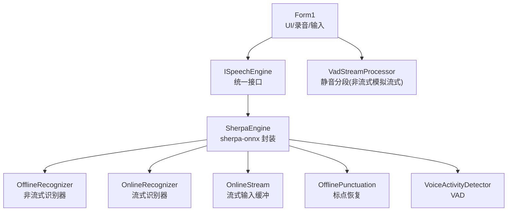
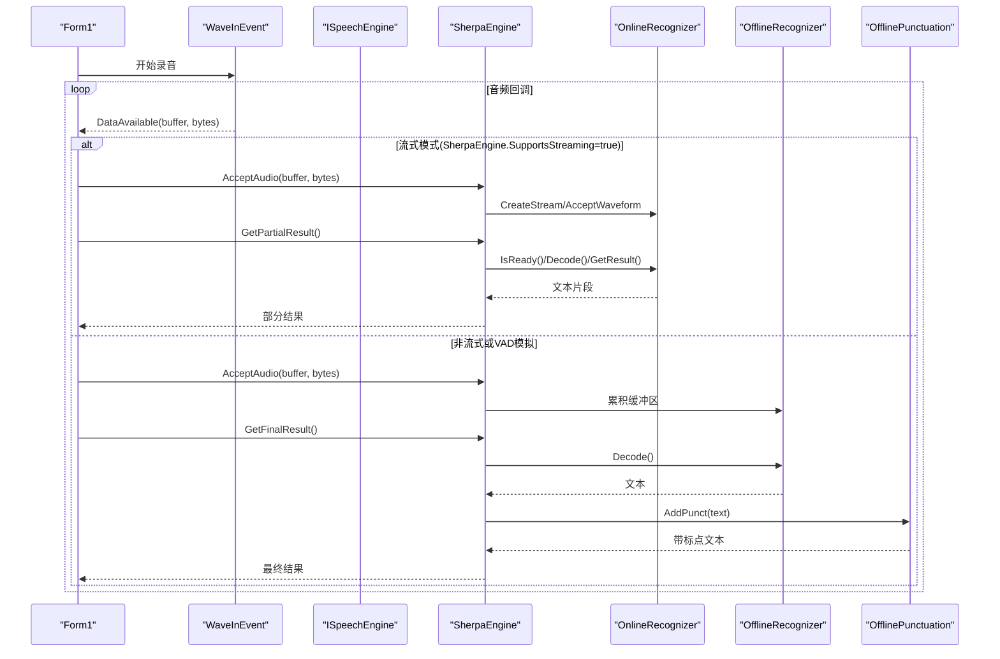
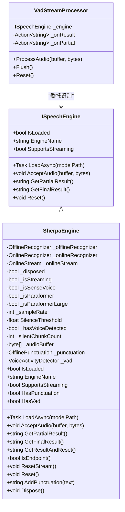
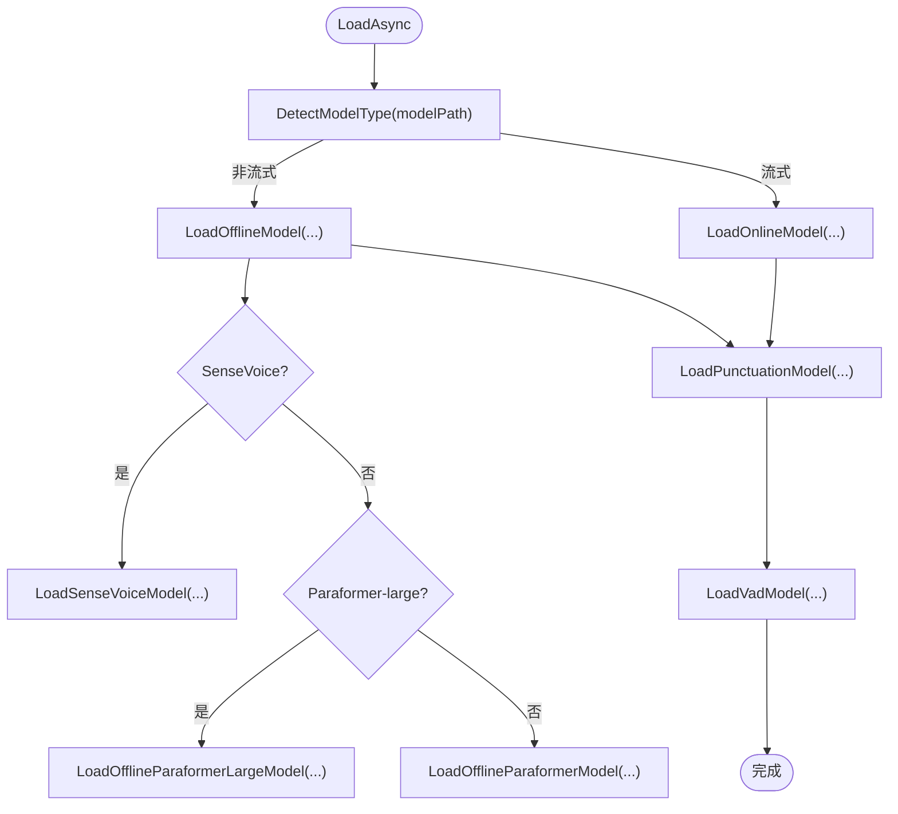
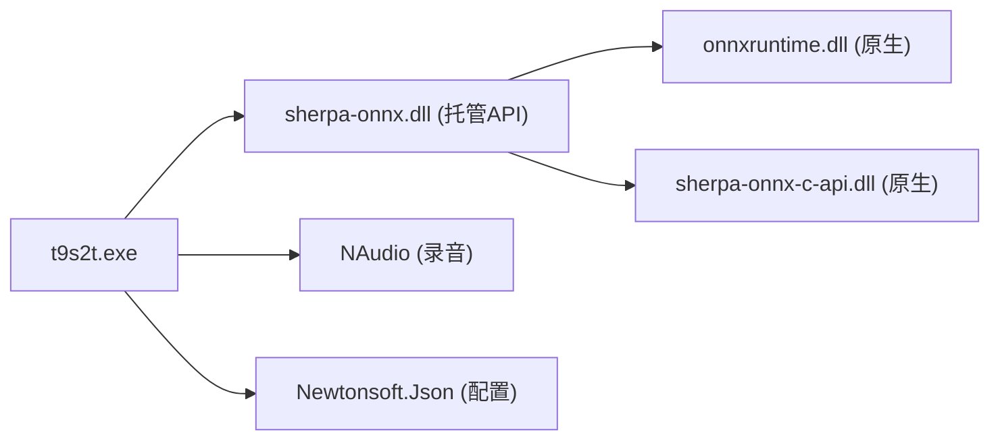

# SherpaEngine 具体实现

<cite>
**本文引用的文件**   
- [SherpaEngine.cs](file://t9s2t/Engines/SherpaEngine.cs)
- [ISpeechEngine.cs](file://t9s2t/Engines/ISpeechEngine.cs)
- [EngineDetector.cs](file://t9s2t/Engines/EngineDetector.cs)
- [VadStreamProcessor.cs](file://t9s2t/Engines/VadStreamProcessor.cs)
- [Form1.cs](file://t9s2t/Form1.cs)
- [packages.config](file://t9s2t/packages.config)
- [t9s2t.csproj](file://t9s2t/t9s2t.csproj)
- [org.k2fsa.sherpa.onnx.nuspec](file://packages/org.k2fsa.sherpa.onnx.1.13.3/org.k2fsa.sherpa.onnx.nuspec)
- [org.k2fsa.sherpa.onnx.runtime.win-x64.nuspec](file://packages/org.k2fsa.sherpa.onnx.runtime.win-x64.1.13.3/org.k2fsa.sherpa.onnx.runtime.win-x64.nuspec)
</cite>

## 目录
1. [简介](#简介)
2. [项目结构](#项目结构)
3. [核心组件](#核心组件)
4. [架构总览](#架构总览)
5. [详细组件分析](#详细组件分析)
6. [依赖关系分析](#依赖关系分析)
7. [性能考量](#性能考量)
8. [故障排查指南](#故障排查指南)
9. [结论](#结论)
10. [附录：使用示例与常见问题](#附录使用示例与常见问题)

## 简介
本文件聚焦于 SherpaEngine 类的技术实现，围绕 sherpa-onnx 原生库集成、模型加载流程、音频数据格式转换、识别结果处理（实时与最终）、流式与非流式差异、以及性能优化策略进行系统化说明。同时提供基于仓库代码的引用路径，便于读者对照源码定位实现细节。

## 项目结构
本项目采用“引擎抽象 + 具体引擎实现”的分层组织方式：
- ISpeechEngine：语音识别引擎的统一接口
- SherpaEngine：sherpa-onnx 的具体实现，支持 SenseVoice、离线 Paraformer、流式 Paraformer
- EngineDetector：根据模型目录结构自动检测引擎类型并创建对应实例
- VadStreamProcessor：对非流式模型（如 SenseVoice）通过静音分段模拟“类流式”体验
- Form1：UI 与录音管线，负责键盘钩子、麦克风采集、结果粘贴到前台窗口

图表来源
- [Form1.cs:1057-1111](file://t9s2t/Form1.cs#L1057-L1111)
- [ISpeechEngine.cs:1-35](file://t9s2t/Engines/ISpeechEngine.cs#L1-L35)
- [SherpaEngine.cs:14-608](file://t9s2t/Engines/SherpaEngine.cs#L14-L608)
- [VadStreamProcessor.cs:1-162](file://t9s2t/Engines/VadStreamProcessor.cs#L1-L162)

章节来源
- [ISpeechEngine.cs:1-35](file://t9s2t/Engines/ISpeechEngine.cs#L1-L35)
- [EngineDetector.cs:1-122](file://t9s2t/Engines/EngineDetector.cs#L1-L122)
- [SherpaEngine.cs:14-608](file://t9s2t/Engines/SherpaEngine.cs#L14-L608)
- [VadStreamProcessor.cs:1-162](file://t9s2t/Engines/VadStreamProcessor.cs#L1-L162)
- [Form1.cs:1057-1111](file://t9s2t/Form1.cs#L1057-L1111)

## 核心组件
- ISpeechEngine：定义统一的加载、音频输入、部分/最终结果获取、重置等能力。
- SherpaEngine：封装 sherpa-onnx 的 OfflineRecognizer/OnlineRecognizer/OnlineStream/Punctuation/VAD，并提供音频格式转换、静音阈值控制、端点检测、标点恢复等功能。
- EngineDetector：依据模型目录中的文件特征（model.onnx、encoder.int8.onnx、decoder.int8.onnx、tokens.txt）判断引擎类型并构造相应引擎实例。
- VadStreamProcessor：对不支持原生流式的模型，按静音段落切分后提交识别，模拟“边说边出字”。

章节来源
- [ISpeechEngine.cs:1-35](file://t9s2t/Engines/ISpeechEngine.cs#L1-L35)
- [EngineDetector.cs:1-122](file://t9s2t/Engines/EngineDetector.cs#L1-L122)
- [VadStreamProcessor.cs:1-162](file://t9s2t/Engines/VadStreamProcessor.cs#L1-L162)
- [SherpaEngine.cs:14-608](file://t9s2t/Engines/SherpaEngine.cs#L14-L608)

## 架构总览
下图展示从 UI 录音到 sherpa-onnx 推理的关键调用链，包括流式与非流式两条路径。

图表来源
- [Form1.cs:1057-1111](file://t9s2t/Form1.cs#L1057-L1111)
- [SherpaEngine.cs:351-479](file://t9s2t/Engines/SherpaEngine.cs#L351-L479)

## 详细组件分析

### SherpaEngine 类设计
- 职责
  - 管理 sherpa-onnx 的非流式/流式识别器与流对象
  - 自动检测模型类型（SenseVoice、离线 Paraformer、流式 Paraformer）
  - 可选加载标点恢复与 VAD 模型
  - 提供音频输入、部分/最终结果、端点检测、重置与资源释放
- 关键状态
  - _offlineRecognizer/_onlineRecognizer/_onlineStream
  - _isStreaming/_isSenseVoice/_isParaformer/_isParaformerLarge
  - _punctuation/_vad
  - 静音检测相关：_hasVoiceDetected/_silentChunkCount
  - 非流式音频缓冲：_audioBuffer

图表来源
- [ISpeechEngine.cs:1-35](file://t9s2t/Engines/ISpeechEngine.cs#L1-L35)
- [SherpaEngine.cs:14-608](file://t9s2t/Engines/SherpaEngine.cs#L14-L608)
- [VadStreamProcessor.cs:1-162](file://t9s2t/Engines/VadStreamProcessor.cs#L1-L162)

章节来源
- [SherpaEngine.cs:14-608](file://t9s2t/Engines/SherpaEngine.cs#L14-L608)

### sherpa-onnx 原生库集成与 DLL 依赖管理
- NuGet 包
  - org.k2fsa.sherpa.onnx：提供 .NET 托管 API（sherpa-onnx.dll），版本 1.13.3
  - org.k2fsa.sherpa.onnx.runtime.win-x64：提供 Windows x64 运行时（包含 onnxruntime.dll、sherpa-onnx-c-api.dll 等）
- 应用侧动态下载
  - 启动时检查 onnxruntime.dll 与 sherpa-onnx-c-api.dll 是否存在且大小大于 0；若缺失则从远程配置拉取并写入应用目录
  - 该机制确保运行期所需 C/C++ 原生 DLL 可用，避免手动分发
- 加载时机
  - 在首次加载模型前完成 DLL 校验与下载，随后由 .NET 运行时自动解析 sherpa-onnx 托管程序集及其依赖的原生 DLL

章节来源
- [Form1.cs:462-567](file://t9s2t/Form1.cs#L462-L567)
- [packages.config:15-16](file://t9s2t/packages.config#L15-L16)
- [t9s2t.csproj:112-114](file://t9s2t/t9s2t.csproj#L112-L114)
- [org.k2fsa.sherpa.onnx.nuspec:1-117](file://packages/org.k2fsa.sherpa.onnx.1.13.3/org.k2fsa.sherpa.onnx.nuspec#L1-L117)
- [org.k2fsa.sherpa.onnx.runtime.win-x64.nuspec:1-32](file://packages/org.k2fsa.sherpa.onnx.runtime.win-x64.1.13.3/org.k2fsa.sherpa.onnx.runtime.win-x64.nuspec#L1-L32)

### 模型加载流程
- 模型类型检测
  - 流式 Paraformer：存在 encoder.onnx/int8.onnx 与 decoder.onnx/int8.onnx
  - 非流式：存在 model.onnx/int8.onnx，结合 tokens.txt 行数区分 SenseVoice 与离线 Paraformer-large
  - 非流式 Paraformer：仅存在 encoder.onnx/int8.onnx
- 初始化参数
  - 采样率固定为 16kHz，特征维度 80
  - 线程数默认 4（识别器），标点与 VAD 可独立设置线程数
  - 流式端点检测参数：Rule1MinTrailingSilence=1.2s、Rule2MinTrailingSilence=0.5s、Rule3MinUtteranceLength=12s
- 可选组件
  - 标点恢复：加载 punc.onnx 或 punc.int8.onnx
  - VAD：加载 vad.onnx（SileroVadModelConfig）

图表来源
- [EngineDetector.cs:27-75](file://t9s2t/Engines/EngineDetector.cs#L27-L75)
- [SherpaEngine.cs:74-127](file://t9s2t/Engines/SherpaEngine.cs#L74-L127)
- [SherpaEngine.cs:129-216](file://t9s2t/Engines/SherpaEngine.cs#L129-L216)
- [SherpaEngine.cs:220-255](file://t9s2t/Engines/SherpaEngine.cs#L220-L255)
- [SherpaEngine.cs:259-347](file://t9s2t/Engines/SherpaEngine.cs#L259-L347)

章节来源
- [EngineDetector.cs:27-75](file://t9s2t/Engines/EngineDetector.cs#L27-L75)
- [SherpaEngine.cs:74-127](file://t9s2t/Engines/SherpaEngine.cs#L74-L127)
- [SherpaEngine.cs:129-216](file://t9s2t/Engines/SherpaEngine.cs#L129-L216)
- [SherpaEngine.cs:220-255](file://t9s2t/Engines/SherpaEngine.cs#L220-L255)
- [SherpaEngine.cs:259-347](file://t9s2t/Engines/SherpaEngine.cs#L259-L347)

### 音频数据格式转换与缓冲区管理
- 输入格式
  - NAudio 以 16kHz 单声道 PCM 16-bit 采集，回调中传入 byte[] 与长度
- 转换逻辑
  - BytesToFloat：将 int16 样本归一化到 [-1,1] 的 float 数组
  - RMS 音量计算：用于静音检测，低于阈值视为静音
- 缓冲区策略
  - 流式：直接送入 OnlineStream.AcceptWaveform，内部维护帧缓冲
  - 非流式：累积到 List<byte>，最终一次性转换为 float[] 整段识别
- 静音过滤
  - 未检测到人声前不送入模型，避免“静音幻觉”
  - 已检测到人声后，连续静音超过一定帧数才停止送入，减少误触发

章节来源
- [Form1.cs:1057-1062](file://t9s2t/Form1.cs#L1057-L1062)
- [SherpaEngine.cs:351-384](file://t9s2t/Engines/SherpaEngine.cs#L351-L384)
- [SherpaEngine.cs:562-589](file://t9s2t/Engines/SherpaEngine.cs#L562-L589)

### 识别结果处理与错误处理
- 流式
  - GetPartialResult：当 IsReady 时 Decode 并返回当前文本片段
  - GetFinalResult：InputFinished 后循环解码至就绪，再 GetResult，最后 Reset 流
  - GetResultAndReset：不调用 InputFinished，适合录音中端点分句
  - 端点检测：IsEndpoint 配合 GetResultAndReset 实现停顿分句
- 非流式
  - GetFinalResult：将累积音频转为 float[]，整段识别，必要时进行标点恢复
- 错误处理
  - 各识别分支均捕获异常并记录日志，返回 null 保证上层健壮性
  - 标点恢复失败回退原始文本

章节来源
- [SherpaEngine.cs:388-509](file://t9s2t/Engines/SherpaEngine.cs#L388-L509)
- [SherpaEngine.cs:516-543](file://t9s2t/Engines/SherpaEngine.cs#L516-L543)
- [SherpaEngine.cs:548-558](file://t9s2t/Engines/SherpaEngine.cs#L548-L558)
- [SherpaEngine.cs:295-310](file://t9s2t/Engines/SherpaEngine.cs#L295-L310)

### 流式与非流式识别的差异
- 流式（OnlineRecognizer）
  - 优点：低延迟、边说边出字
  - 适用：Paraformer 流式模型
  - 特点：需要合理设置端点规则，避免长句被过早截断
- 非流式（OfflineRecognizer）
  - 优点：整体一致性更好，适合长句
  - 适用：SenseVoice、离线 Paraformer、离线 Paraformer-large
  - 特点：需等待完整音频段，可通过 VAD 分段模拟“类流式”

章节来源
- [EngineDetector.cs:27-75](file://t9s2t/Engines/EngineDetector.cs#L27-L75)
- [VadStreamProcessor.cs:1-162](file://t9s2t/Engines/VadStreamProcessor.cs#L1-L162)
- [SherpaEngine.cs:220-255](file://t9s2t/Engines/SherpaEngine.cs#L220-L255)

### 性能优化技巧
- 量化模型优先：优先加载 .int8.onnx，体积更小、推理更快
- 线程数调优：识别器默认 4 线程，标点与 VAD 可独立设置较低线程数
- 静音过滤：降低无效音频送入，减少无谓推理
- 节流与去重：UI 层对 partial 结果做时间间隔与内容去重，避免频繁粘贴
- 端点参数平衡：兼顾出字速度与吞字问题，避免过短静音触发

章节来源
- [SherpaEngine.cs:159-188](file://t9s2t/Engines/SherpaEngine.cs#L159-L188)
- [SherpaEngine.cs:246-254](file://t9s2t/Engines/SherpaEngine.cs#L246-L254)
- [Form1.cs:988-1009](file://t9s2t/Form1.cs#L988-L1009)

## 依赖关系分析
- 托管依赖
  - sherpa-onnx（v1.13.3）：提供 OfflineRecognizer/OnlineRecognizer/OnlineStream/OfflinePunctuation/VAD 等托管 API
  - NAudio：录音采集
  - Newtonsoft.Json：远程模型/引擎配置解析
- 原生依赖
  - onnxruntime.dll、sherpa-onnx-c-api.dll：由 runtime-win-x64 包提供，应用启动时按需下载
- 构建引用
  - t9s2t.csproj 引用了 sherpa-onnx 托管程序集

图表来源
- [t9s2t.csproj:112-114](file://t9s2t/t9s2t.csproj#L112-L114)
- [packages.config:15-16](file://t9s2t/packages.config#L15-L16)
- [org.k2fsa.sherpa.onnx.nuspec:1-117](file://packages/org.k2fsa.sherpa.onnx.1.13.3/org.k2fsa.sherpa.onnx.nuspec#L1-L117)
- [org.k2fsa.sherpa.onnx.runtime.win-x64.nuspec:1-32](file://packages/org.k2fsa.sherpa.onnx.runtime.win-x64.1.13.3/org.k2fsa.sherpa.onnx.runtime.win-x64.nuspec#L1-L32)

章节来源
- [t9s2t.csproj:112-114](file://t9s2t/t9s2t.csproj#L112-L114)
- [packages.config:15-16](file://t9s2t/packages.config#L15-L16)

## 性能考量
- 模型选择
  - 优先使用 int8 量化模型，显著降低内存占用与推理耗时
- 线程与 I/O
  - 识别器多线程并行，注意与 UI 线程解耦（异步加载、后台处理）
- 音频处理
  - 保持 16kHz 单声道，避免重复重采样
  - 静音过滤减少无效推理
- 输出节流
  - partial 结果节流与去重，避免剪贴板频繁操作导致卡顿

[本节为通用指导，无需特定文件引用]

## 故障排查指南
- 缺少引擎 DLL
  - 现象：无法加载 sherpa-onnx 原生库
  - 排查：确认 onnxruntime.dll 与 sherpa-onnx-c-api.dll 是否齐全且大小 > 0；必要时重新下载
- 模型目录不正确
  - 现象：无法识别模型类型
  - 排查：确认存在 tokens.txt 及对应的 model/encoder/decoder 文件
- 标点/VAD 加载失败
  - 现象：控制台提示加载失败
  - 影响：不影响主识别流程，仅功能降级
- 流式端点误触发
  - 现象：长句被过早截断
  - 调整：增大 Rule2MinTrailingSilence 或 Rule1MinTrailingSilence

章节来源
- [Form1.cs:462-567](file://t9s2t/Form1.cs#L462-L567)
- [SherpaEngine.cs:259-347](file://t9s2t/Engines/SherpaEngine.cs#L259-L347)
- [EngineDetector.cs:27-75](file://t9s2t/Engines/EngineDetector.cs#L27-L75)

## 结论
SherpaEngine 通过统一的 ISpeechEngine 接口屏蔽了 sherpa-onnx 的复杂细节，实现了多模型类型的自动识别与加载，并在 UI 层提供了健壮的录音、粘贴与用户体验优化。其流式与非流式双路径、静音过滤、标点恢复与 VAD 扩展，使其在中文语音转写场景中具备较好的准确性与可用性。

[本节为总结，无需特定文件引用]

## 附录：使用示例与常见问题

### 基本用法（参考路径）
- 初始化与加载
  - 通过 EngineDetector.DetectAndCreate 自动创建 SherpaEngine，并调用 LoadAsync(modelPath)
  - 参考：[Form1.cs:645-721](file://t9s2t/Form1.cs#L645-L721)、[EngineDetector.cs:100-104](file://t9s2t/Engines/EngineDetector.cs#L100-L104)
- 录音与识别
  - 流式：AcceptAudio -> GetPartialResult / GetResultAndReset -> GetFinalResult
  - 非流式：AcceptAudio 累积 -> GetFinalResult
  - 参考：[Form1.cs:1057-1111](file://t9s2t/Form1.cs#L1057-L1111)、[SherpaEngine.cs:351-479](file://t9s2t/Engines/SherpaEngine.cs#L351-L479)
- 标点恢复
  - 若存在标点模型，GetFinalResult 会自动调用 AddPunctuation
  - 参考：[SherpaEngine.cs:295-310](file://t9s2t/Engines/SherpaEngine.cs#L295-L310)

### 常见问题
- Q：为什么有时没有声音却输出了文字？
  - A：可能是静音阈值过低或环境噪声较大，建议提高 SilenceThreshold 或启用 VAD
  - 参考：[SherpaEngine.cs:351-384](file://t9s2t/Engines/SherpaEngine.cs#L351-L384)
- Q：如何关闭标点恢复？
  - A：不提供标点模型即可跳过加载；或在业务层忽略 AddPunctuation 的结果
  - 参考：[SherpaEngine.cs:259-290](file://t9s2t/Engines/SherpaEngine.cs#L259-L290)
- Q：流式识别出现“吞字”怎么办？
  - A：适当增大 Rule2MinTrailingSilence 或 Rule1MinTrailingSilence，避免说话中自然停顿触发端点
  - 参考：[SherpaEngine.cs:246-254](file://t9s2t/Engines/SherpaEngine.cs#L246-L254)