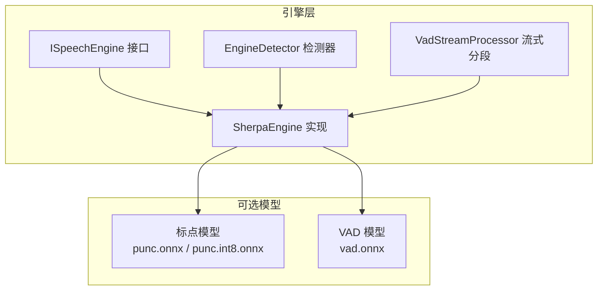
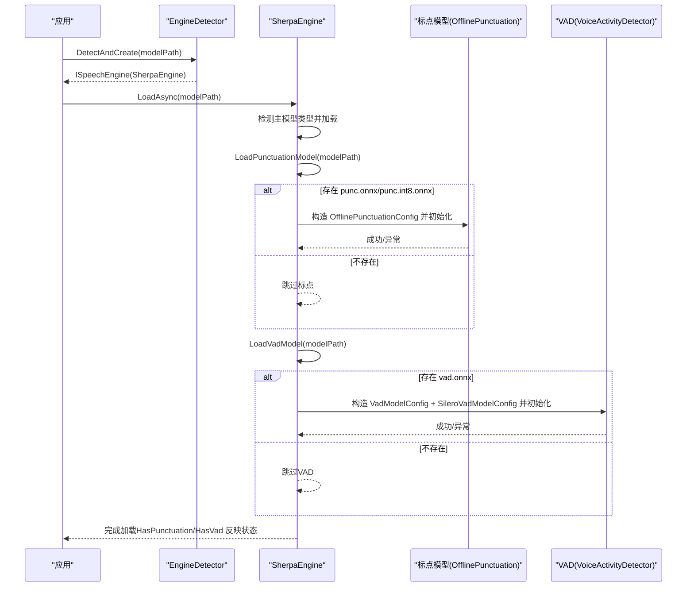
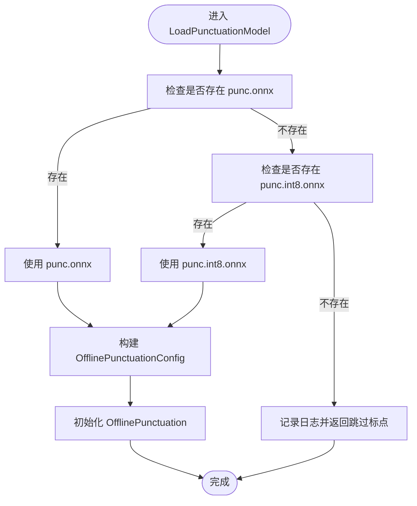
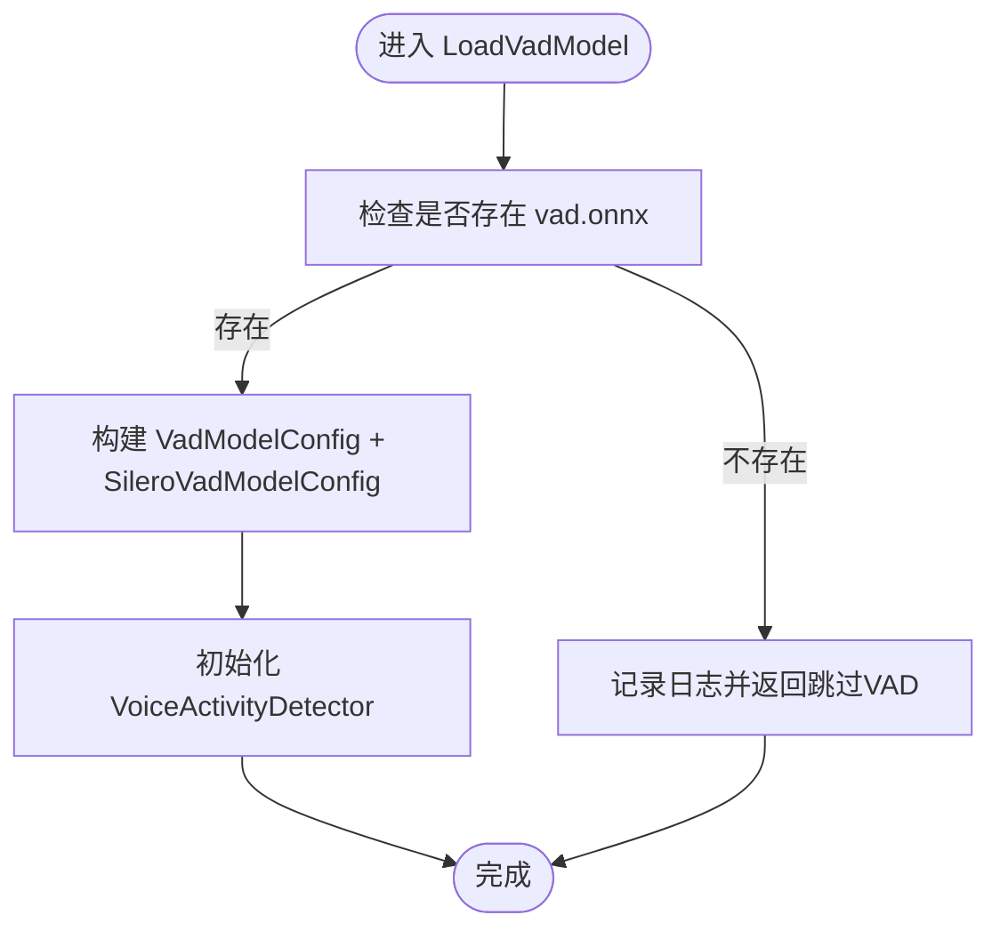
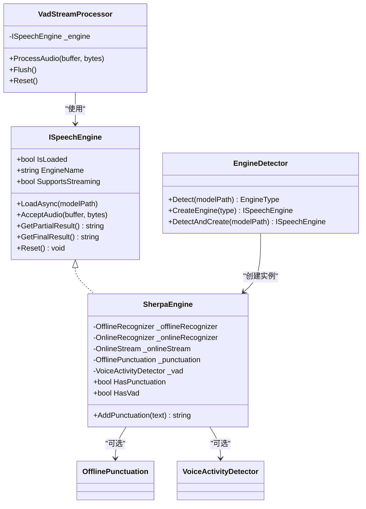

# 可选模型加载

<cite>
**本文引用的文件**
- [SherpaEngine.cs](file://t9s2t/Engines/SherpaEngine.cs)
- [ISpeechEngine.cs](file://t9s2t/Engines/ISpeechEngine.cs)
- [VadStreamProcessor.cs](file://t9s2t/Engines/VadStreamProcessor.cs)
- [EngineDetector.cs](file://t9s2t/Engines/EngineDetector.cs)
</cite>

## 目录
1. [简介](#简介)
2. [项目结构](#项目结构)
3. [核心组件](#核心组件)
4. [架构总览](#架构总览)
5. [详细组件分析](#详细组件分析)
6. [依赖关系分析](#依赖关系分析)
7. [性能与调优建议](#性能与调优建议)
8. [故障排查指南](#故障排查指南)
9. [结论](#结论)
10. [附录：模型组织与配置示例](#附录模型组织与配置示例)

## 简介
本技术文档聚焦 SherpaEngine 的“可选模型加载”能力，重点阐述以下两点：
- 标点恢复模型（punc.onnx / punc.int8.onnx）的自动检测与加载逻辑
- 语音活动检测模型（vad.onnx）的自动检测与加载逻辑

同时说明相关配置对象的结构与参数含义（OfflinePunctuationConfig、VadModelConfig、SileroVadModelConfig），并给出失败降级策略、模型文件组织结构、阈值调优与性能优化建议。目标是确保在可选模型缺失或加载失败时，主引擎功能仍保持稳定可用。

## 项目结构
与可选模型加载相关的代码主要位于 t9s2t/Engines 目录下：
- SherpaEngine.cs：封装 sherpa-onnx 识别引擎，包含可选模型（标点、VAD）的加载与使用
- ISpeechEngine.cs：定义统一的语音识别引擎接口
- VadStreamProcessor.cs：基于能量阈值的流式分段处理器（用于非流式模型模拟流式体验）
- EngineDetector.cs：根据模型目录结构自动识别引擎类型并创建对应实例

图表来源
- [ISpeechEngine.cs:1-35](file://t9s2t/Engines/ISpeechEngine.cs#L1-L35)
- [SherpaEngine.cs:14-72](file://t9s2t/Engines/SherpaEngine.cs#L14-L72)
- [EngineDetector.cs:22-104](file://t9s2t/Engines/EngineDetector.cs#L22-L104)
- [VadStreamProcessor.cs:12-33](file://t9s2t/Engines/VadStreamProcessor.cs#L12-L33)

章节来源
- [ISpeechEngine.cs:1-35](file://t9s2t/Engines/ISpeechEngine.cs#L1-L35)
- [EngineDetector.cs:1-122](file://t9s2t/Engines/EngineDetector.cs#L1-L122)
- [VadStreamProcessor.cs:1-162](file://t9s2t/Engines/VadStreamProcessor.cs#L1-L162)
- [SherpaEngine.cs:1-608](file://t9s2t/Engines/SherpaEngine.cs#L1-L608)

## 核心组件
- 接口 ISpeechEngine：统一暴露加载、音频输入、部分结果、最终结果、重置等能力
- 引擎 SherpaEngine：支持 SenseVoice、离线 Paraformer、流式 Paraformer；并在 LoadAsync 中尝试加载可选模型（标点、VAD）
- 检测器 EngineDetector：按目录结构推断引擎类型并创建 SherpaEngine 实例
- 流式分段 VadStreamProcessor：对非流式模型进行静音分段，模拟流式体验

章节来源
- [ISpeechEngine.cs:1-35](file://t9s2t/Engines/ISpeechEngine.cs#L1-L35)
- [EngineDetector.cs:1-122](file://t9s2t/Engines/EngineDetector.cs#L1-L122)
- [VadStreamProcessor.cs:1-162](file://t9s2t/Engines/VadStreamProcessor.cs#L1-L162)
- [SherpaEngine.cs:14-72](file://t9s2t/Engines/SherpaEngine.cs#L14-L72)

## 架构总览
下图展示了可选模型加载在主流程中的位置与交互关系。LoadAsync 在完成主模型加载后，会依次尝试加载标点与 VAD 模型；若任一可选模型缺失或加载失败，不会中断主引擎初始化，从而保证稳定性。

图表来源
- [EngineDetector.cs:100-104](file://t9s2t/Engines/EngineDetector.cs#L100-L104)
- [SherpaEngine.cs:57-72](file://t9s2t/Engines/SherpaEngine.cs#L57-L72)
- [SherpaEngine.cs:259-290](file://t9s2t/Engines/SherpaEngine.cs#L259-L290)
- [SherpaEngine.cs:314-347](file://t9s2t/Engines/SherpaEngine.cs#L314-L347)

## 详细组件分析

### 标点恢复模型加载（LoadPunctuationModel）
- 自动检测顺序：优先查找 modelPath/punc.onnx，若不存在则回退到 modelPath/punc.int8.onnx
- 若两者均不存在：记录日志并直接返回，不抛异常，不影响主引擎
- 若找到模型文件：构造 OfflinePunctuationConfig，设置 CtTransformer 指向模型路径，并指定线程数与调试开关；随后初始化 OfflinePunctuation 实例
- 异常处理：捕获异常并记录日志，保持 HasPunctuation 为 false，后续调用 AddPunctuation 将直接返回原始文本

图表来源
- [SherpaEngine.cs:259-290](file://t9s2t/Engines/SherpaEngine.cs#L259-L290)

章节来源
- [SherpaEngine.cs:259-290](file://t9s2t/Engines/SherpaEngine.cs#L259-L290)

### 语音活动检测模型加载（LoadVadModel）
- 自动检测：仅查找 modelPath/vad.onnx
- 若不存在：记录日志并直接返回，不抛异常，不影响主引擎
- 若存在：构造 VadModelConfig，内部嵌套 SileroVadModelConfig，设置模型路径、阈值、最小静音时长、最小语音时长、窗口大小、最大语音时长等参数；随后初始化 VoiceActivityDetector 实例
- 异常处理：捕获异常并记录日志，保持 HasVad 为 false

图表来源
- [SherpaEngine.cs:314-347](file://t9s2t/Engines/SherpaEngine.cs#L314-L347)

章节来源
- [SherpaEngine.cs:314-347](file://t9s2t/Engines/SherpaEngine.cs#L314-L347)

### 配置对象结构与参数含义
- OfflinePunctuationConfig
  - Model.CtTransformer：指向标点模型文件路径（punc.onnx 或 punc.int8.onnx）
  - NumThreads：推理线程数
  - Debug：调试开关
- VadModelConfig
  - SileroVad.Model：指向 VAD 模型文件路径（vad.onnx）
  - SileroVad.Threshold：说话概率阈值，高于该值判定为有声音
  - SileroVad.MinSilenceDuration：最小静音持续时间（秒）
  - SileroVad.MinSpeechDuration：最小语音持续时间（秒）
  - SileroVad.WindowSize：帧窗口大小（样本数）
  - SileroVad.MaxSpeechDuration：最大语音时长（秒）
  - SampleRate：采样率（与主引擎一致，默认 16000）
  - NumThreads：推理线程数
  - Debug：调试开关

章节来源
- [SherpaEngine.cs:273-284](file://t9s2t/Engines/SherpaEngine.cs#L273-L284)
- [SherpaEngine.cs:324-340](file://t9s2t/Engines/SherpaEngine.cs#L324-L340)

### 可选模型的使用与降级策略
- 使用点
  - 标点：在 GetFinalResult 与 GetPartialResult 之后，若 HasPunctuation 为 true 且文本非空，则调用 AddPunctuation 进行标点恢复
  - VAD：通过 HasVad 属性判断是否可用；当前实现未在主流程中主动调用 VAD，但已提供 Reset 与 Dispose 生命周期管理
- 降级策略
  - 缺失模型：LoadPunctuationModel 与 LoadVadModel 在找不到模型文件时直接返回，不抛出异常
  - 加载异常：try-catch 捕获异常并记录日志，HasPunctuation/HasVad 保持为 false，后续调用 AddPunctuation 直接返回原文本
  - 主引擎稳定：可选模型的缺失或失败不会影响主识别流程

章节来源
- [SherpaEngine.cs:295-310](file://t9s2t/Engines/SherpaEngine.cs#L295-L310)
- [SherpaEngine.cs:417-479](file://t9s2t/Engines/SherpaEngine.cs#L417-L479)
- [SherpaEngine.cs:533-543](file://t9s2t/Engines/SherpaEngine.cs#L533-L543)
- [SherpaEngine.cs:591-605](file://t9s2t/Engines/SherpaEngine.cs#L591-L605)

### 与流式分段的协作（VadStreamProcessor）
- 当使用非流式模型（如 SenseVoice）时，可通过 VadStreamProcessor 基于能量阈值进行静音分段，模拟流式体验
- 该处理器独立于 VAD 模型加载，采用固定阈值与连续静音帧计数触发提交识别
- 适用于需要快速出字但不具备流式模型的场景

章节来源
- [VadStreamProcessor.cs:12-33](file://t9s2t/Engines/VadStreamProcessor.cs#L12-L33)
- [VadStreamProcessor.cs:38-86](file://t9s2t/Engines/VadStreamProcessor.cs#L38-L86)
- [VadStreamProcessor.cs:114-136](file://t9s2t/Engines/VadStreamProcessor.cs#L114-L136)

## 依赖关系分析
- SherpaEngine 依赖 ISpeechEngine 接口以提供统一能力
- EngineDetector 根据目录结构选择 SherpaEngine 的流式或非流式模式
- 可选模型（标点、VAD）作为附加能力，被 SherpaEngine 按需加载并使用
- VadStreamProcessor 依赖 ISpeechEngine 接口，用于非流式模型的流式化

图表来源
- [ISpeechEngine.cs:1-35](file://t9s2t/Engines/ISpeechEngine.cs#L1-L35)
- [SherpaEngine.cs:14-46](file://t9s2t/Engines/SherpaEngine.cs#L14-L46)
- [EngineDetector.cs:22-104](file://t9s2t/Engines/EngineDetector.cs#L22-L104)
- [VadStreamProcessor.cs:12-33](file://t9s2t/Engines/VadStreamProcessor.cs#L12-L33)

章节来源
- [ISpeechEngine.cs:1-35](file://t9s2t/Engines/ISpeechEngine.cs#L1-L35)
- [EngineDetector.cs:1-122](file://t9s2t/Engines/EngineDetector.cs#L1-L122)
- [VadStreamProcessor.cs:1-162](file://t9s2t/Engines/VadStreamProcessor.cs#L1-L162)
- [SherpaEngine.cs:14-46](file://t9s2t/Engines/SherpaEngine.cs#L14-L46)

## 性能与调优建议
- 标点模型
  - 优先使用 int8 量化版本（punc.int8.onnx）以降低内存占用与提升推理速度
  - 合理设置 NumThreads，避免与主识别线程竞争导致延迟
- VAD 模型
  - Threshold：提高可抑制误触发，降低可能漏检；建议从 0.5 起逐步微调
  - MinSilenceDuration/MinSpeechDuration：根据实际语速与环境噪声调整，减少短促噪音导致的误切分
  - WindowSize：影响时间分辨率与计算开销，通常 512 是平衡点
  - MaxSpeechDuration：限制单次最长语音时长，防止长句累积过多上下文
- 主引擎端点参数（流式 Paraformer）
  - Rule1MinTrailingSilence、Rule2MinTrailingSilence、Rule3MinUtteranceLength：用于控制分句时机，避免自然停顿误触发或吞字

章节来源
- [SherpaEngine.cs:246-254](file://t9s2t/Engines/SherpaEngine.cs#L246-L254)
- [SherpaEngine.cs:324-340](file://t9s2t/Engines/SherpaEngine.cs#L324-L340)

## 故障排查指南
- 现象：无标点输出
  - 检查模型目录是否存在 punc.onnx 或 punc.int8.onnx
  - 查看日志中是否有“未找到标点模型”或“标点模型加载失败”的记录
  - 确认 HasPunctuation 是否为 true
- 现象：VAD 未生效
  - 检查模型目录是否存在 vad.onnx
  - 查看日志中是否有“未找到 VAD 模型”或“VAD 模型加载失败”的记录
  - 确认 HasVad 是否为 true
- 现象：主识别异常
  - 可选模型加载失败不应影响主引擎；若出现异常，请检查主模型文件完整性与 tokens.txt 是否存在
  - 关注日志中的具体异常信息，必要时降低 NumThreads 或切换 fp32 模型

章节来源
- [SherpaEngine.cs:259-290](file://t9s2t/Engines/SherpaEngine.cs#L259-L290)
- [SherpaEngine.cs:314-347](file://t9s2t/Engines/SherpaEngine.cs#L314-L347)
- [SherpaEngine.cs:295-310](file://t9s2t/Engines/SherpaEngine.cs#L295-L310)

## 结论
SherpaEngine 的可选模型加载机制遵循“发现即加载、失败即降级”的原则：
- 标点与 VAD 模型均为可选，缺失或加载失败不会中断主引擎
- 通过 HasPunctuation/HasVad 暴露可用性，上层可按需启用增强功能
- 合理的阈值与线程配置可在精度与性能之间取得良好平衡

## 附录：模型组织与配置示例
- 推荐目录结构
  - 主模型目录（例如 models/sensevoice 或 models/paraformer-streaming）
    - 必需文件：model.onnx/model.int8.onnx 或 encoder*.onnx + decoder*.onnx + tokens.txt
    - 可选文件：
      - punc.onnx 或 punc.int8.onnx（标点恢复）
      - vad.onnx（语音活动检测）
- 配置要点
  - 标点模型：CtTransformer 指向模型路径；NumThreads 建议 2；Debug 关闭
  - VAD 模型：Threshold 初始 0.5；MinSilenceDuration 0.5；MinSpeechDuration 0.25；WindowSize 512；MaxSpeechDuration 20.0；SampleRate 16000；NumThreads 1；Debug 关闭
- 调优建议
  - 环境安静、麦克风增益较低时，可适当提高 VAD Threshold 并增大 MinSilenceDuration
  - 实时性要求高时，优先使用 int8 量化模型并减少 NumThreads
  - 长句场景下，适当增大 Rule3MinUtteranceLength 以避免过早分句

章节来源
- [EngineDetector.cs:27-75](file://t9s2t/Engines/EngineDetector.cs#L27-L75)
- [SherpaEngine.cs:273-284](file://t9s2t/Engines/SherpaEngine.cs#L273-L284)
- [SherpaEngine.cs:324-340](file://t9s2t/Engines/SherpaEngine.cs#L324-L340)