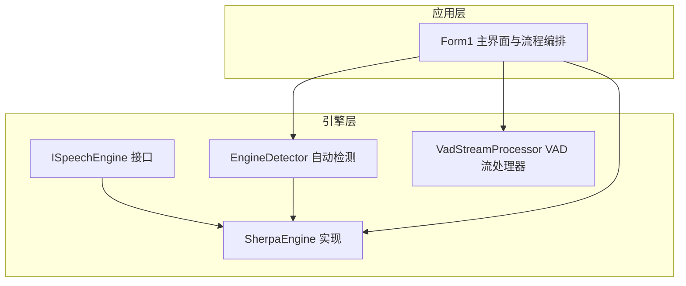
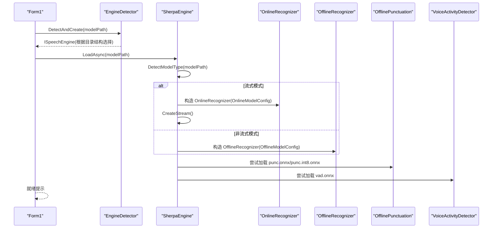
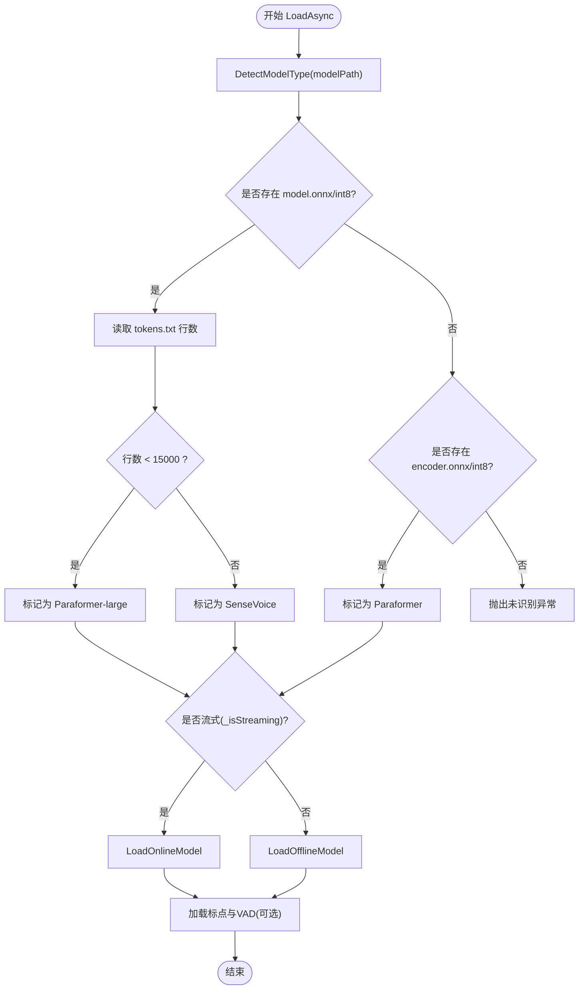
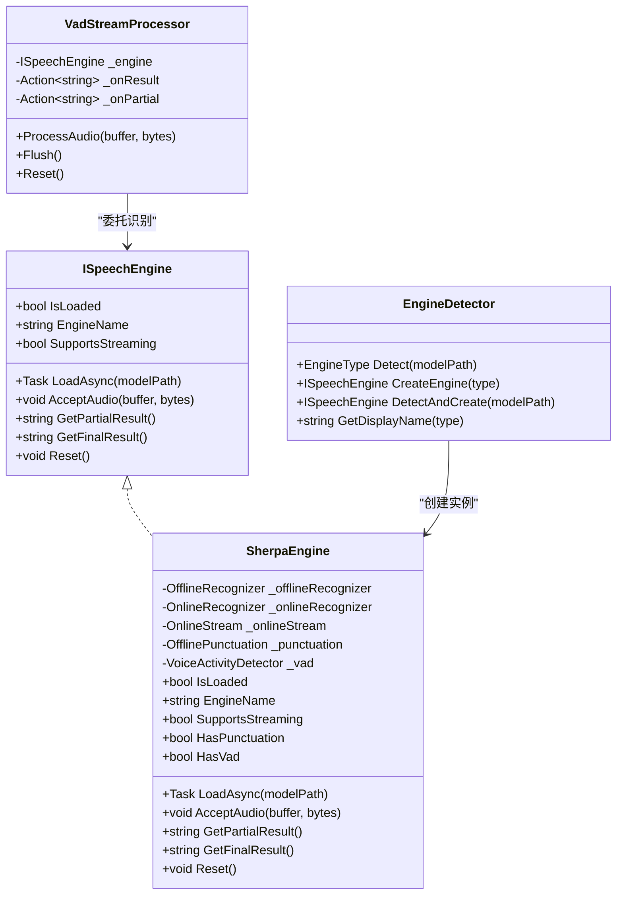
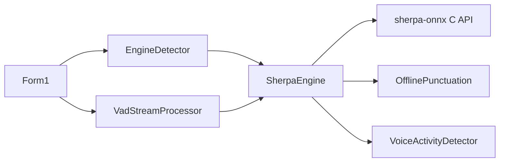

# 引擎初始化与模型加载

<cite>
**本文引用的文件**   
- [SherpaEngine.cs](file://t9s2t/Engines/SherpaEngine.cs)
- [EngineDetector.cs](file://t9s2t/Engines/EngineDetector.cs)
- [ISpeechEngine.cs](file://t9s2t/Engines/ISpeechEngine.cs)
- [VadStreamProcessor.cs](file://t9s2t/Engines/VadStreamProcessor.cs)
- [Form1.cs](file://t9s2t/Form1.cs)
</cite>

## 目录
1. [简介](#简介)
2. [项目结构](#项目结构)
3. [核心组件](#核心组件)
4. [架构总览](#架构总览)
5. [详细组件分析](#详细组件分析)
6. [依赖关系分析](#依赖关系分析)
7. [性能考量](#性能考量)
8. [故障排查指南](#故障排查指南)
9. [结论](#结论)
10. [附录：使用示例与最佳实践](#附录使用示例与最佳实践)

## 简介
本技术文档聚焦于 SherpaEngine 的初始化与模型加载机制，重点解析 LoadAsync 异步加载流程、DetectModelType 模型类型检测逻辑，以及流式与非流式模型的差异化加载策略。文档还详细说明三种模型类型的识别机制（SenseVoice、Paraformer-large、Paraformer），阐述 OfflineRecognizer 与 OnlineRecognizer 的初始化过程及关键配置参数（FeatureConfig、OfflineModelConfig、OnlineModelConfig），并解释标点恢复模型（punc.onnx）与 VAD 模型（vad.onnx）的可选加载机制。最后提供具体代码示例路径与错误处理建议，帮助读者正确配置和加载不同类型的语音识别模型。

## 项目结构
本项目围绕语音识别引擎封装与自动检测展开，核心位于 Engines 目录，UI 层通过 Form1 完成模型下载、检测与加载编排。

图表来源
- [ISpeechEngine.cs:1-35](file://t9s2t/Engines/ISpeechEngine.cs#L1-L35)
- [SherpaEngine.cs:1-608](file://t9s2t/Engines/SherpaEngine.cs#L1-L608)
- [EngineDetector.cs:1-122](file://t9s2t/Engines/EngineDetector.cs#L1-L122)
- [VadStreamProcessor.cs:1-162](file://t9s2t/Engines/VadStreamProcessor.cs#L1-L162)
- [Form1.cs:645-721](file://t9s2t/Form1.cs#L645-L721)

章节来源
- [ISpeechEngine.cs:1-35](file://t9s2t/Engines/ISpeechEngine.cs#L1-L35)
- [EngineDetector.cs:1-122](file://t9s2t/Engines/EngineDetector.cs#L1-L122)
- [SherpaEngine.cs:1-608](file://t9s2t/Engines/SherpaEngine.cs#L1-L608)
- [VadStreamProcessor.cs:1-162](file://t9s2t/Engines/VadStreamProcessor.cs#L1-L162)
- [Form1.cs:645-721](file://t9s2t/Form1.cs#L645-L721)

## 核心组件
- ISpeechEngine：定义统一的语音识别引擎接口，包括异步加载、音频输入、部分结果与最终结果获取、重置等能力。
- EngineDetector：根据模型目录结构自动检测引擎类型（SenseVoice、Paraformer、Paraformer-large、ParaformerStreaming），并创建对应引擎实例。
- SherpaEngine：基于 sherpa-onnx 的引擎封装，支持 SenseVoice、离线 Paraformer、流式 Paraformer；内置标点恢复与 VAD 可选加载；提供流式与非流式两种识别路径。
- VadStreamProcessor：将非流式模型（如 SenseVoice）模拟为“类流式”体验，通过静音段落切分触发识别，回调实时结果。
- Form1：负责 UI 交互、模型下载、引擎 DLL 检查、自动检测与加载编排，以及录音数据流接入。

章节来源
- [ISpeechEngine.cs:1-35](file://t9s2t/Engines/ISpeechEngine.cs#L1-L35)
- [EngineDetector.cs:1-122](file://t9s2t/Engines/EngineDetector.cs#L1-L122)
- [SherpaEngine.cs:1-608](file://t9s2t/Engines/SherpaEngine.cs#L1-L608)
- [VadStreamProcessor.cs:1-162](file://t9s2t/Engines/VadStreamProcessor.cs#L1-L162)
- [Form1.cs:645-721](file://t9s2t/Form1.cs#L645-L721)

## 架构总览
下图展示了从 UI 到引擎的完整加载与识别流程，包含模型类型检测、异步加载、可选模块（标点、VAD）加载，以及流式与非流式分支。

图表来源
- [Form1.cs:645-721](file://t9s2t/Form1.cs#L645-L721)
- [EngineDetector.cs:27-104](file://t9s2t/Engines/EngineDetector.cs#L27-L104)
- [SherpaEngine.cs:57-115](file://t9s2t/Engines/SherpaEngine.cs#L57-L115)
- [SherpaEngine.cs:219-255](file://t9s2t/Engines/SherpaEngine.cs#L219-L255)
- [SherpaEngine.cs:119-216](file://t9s2t/Engines/SherpaEngine.cs#L119-L216)
- [SherpaEngine.cs:259-290](file://t9s2t/Engines/SherpaEngine.cs#L259-L290)
- [SherpaEngine.cs:314-347](file://t9s2t/Engines/SherpaEngine.cs#L314-L347)

## 详细组件分析

### 模型类型检测与加载流程（LoadAsync 与 DetectModelType）
- LoadAsync 在后台线程执行：先调用 DetectModelType 判断模型类型，再根据是否流式分别进入 LoadOnlineModel 或 LoadOfflineModel，随后尝试加载标点与 VAD 模型。
- DetectModelType 依据目录内文件特征进行区分：
  - 若存在 model.int8.onnx 或 model.onnx：进一步读取 tokens.txt 行数，小于阈值判定为离线 Paraformer-large，否则为 SenseVoice。
  - 若存在 encoder.int8.onnx 或 encoder.onnx：判定为 Paraformer（可能为非流式或流式，结合 _isStreaming 标志）。
  - 否则抛出未识别异常。

图表来源
- [SherpaEngine.cs:57-115](file://t9s2t/Engines/SherpaEngine.cs#L57-L115)
- [SherpaEngine.cs:219-255](file://t9s2t/Engines/SherpaEngine.cs#L219-L255)
- [SherpaEngine.cs:119-216](file://t9s2t/Engines/SherpaEngine.cs#L119-L216)

章节来源
- [SherpaEngine.cs:57-115](file://t9s2t/Engines/SherpaEngine.cs#L57-L115)

### 三种模型类型的识别机制与文件结构差异
- SenseVoice
  - 文件特征：model.int8.onnx 或 model.onnx + tokens.txt
  - 识别方式：非流式 OfflineRecognizer，使用 OfflineSenseVoiceModelConfig
  - 语言设置：Language = "auto"，启用逆文本归一化
- Paraformer-large（离线大模型）
  - 文件特征：model.int8.onnx 或 model.onnx + tokens.txt，tokens.txt 行数较少（<15000）
  - 识别方式：非流式 OfflineRecognizer，使用 OfflineParaformerModelConfig
  - 回退策略：优先 int8，不存在则回退 fp32
- Paraformer（流式/非流式）
  - 文件特征：encoder.int8.onnx 或 encoder.onnx；流式还需 decoder.int8.onnx 或 decoder.onnx
  - 识别方式：
    - 流式：OnlineRecognizer，使用 OnlineParaformerModelConfig（Encoder/Decoder）
    - 非流式：OfflineRecognizer，使用 OfflineParaformerModelConfig（仅 Encoder）

章节来源
- [EngineDetector.cs:27-75](file://t9s2t/Engines/EngineDetector.cs#L27-L75)
- [SherpaEngine.cs:129-157](file://t9s2t/Engines/SherpaEngine.cs#L129-L157)
- [SherpaEngine.cs:159-188](file://t9s2t/Engines/SherpaEngine.cs#L159-L188)
- [SherpaEngine.cs:190-216](file://t9s2t/Engines/SherpaEngine.cs#L190-L216)
- [SherpaEngine.cs:219-255](file://t9s2t/Engines/SherpaEngine.cs#L219-L255)

### OfflineRecognizer 与 OnlineRecognizer 初始化与配置
- OfflineRecognizer（非流式）
  - FeatureConfig：SampleRate=16000，FeatureDim=80
  - OfflineModelConfig：
    - SenseVoice：OfflineSenseVoiceModelConfig(Model, Language="auto", UseInverseTextNormalization=1)
    - Paraformer：OfflineParaformerModelConfig(Model=encoder.onnx/int8)
  - Tokens：tokens.txt
  - NumThreads：4，Debug：0
- OnlineRecognizer（流式）
  - FeatureConfig：SampleRate=16000，FeatureDim=80
  - OnlineModelConfig：
    - Paraformer：OnlineParaformerModelConfig(Encoder, Decoder)
  - Tokens：tokens.txt
  - 端点检测：EnableEndpoint=1，Rule1MinTrailingSilence=1.2f，Rule2MinTrailingSilence=0.5f，Rule3MinUtteranceLength=12.0f
  - NumThreads：4，Debug：0

章节来源
- [SherpaEngine.cs:129-157](file://t9s2t/Engines/SherpaEngine.cs#L129-L157)
- [SherpaEngine.cs:159-188](file://t9s2t/Engines/SherpaEngine.cs#L159-L188)
- [SherpaEngine.cs:190-216](file://t9s2t/Engines/SherpaEngine.cs#L190-L216)
- [SherpaEngine.cs:219-255](file://t9s2t/Engines/SherpaEngine.cs#L219-L255)

### 标点恢复模型（punc.onnx）与 VAD 模型（vad.onnx）的可选加载
- 标点恢复
  - 查找顺序：punc.onnx → punc.int8.onnx
  - 配置：OfflinePunctuationConfig，CtTransformer 指向模型文件，NumThreads=2，Debug=0
  - 失败处理：捕获异常并记录日志，不影响主识别流程
- VAD
  - 查找：vad.onnx
  - 配置：VadModelConfig，SileroVadModelConfig（Threshold、MinSilenceDuration、MinSpeechDuration、WindowSize、MaxSpeechDuration），SampleRate=16000，NumThreads=1，Debug=0
  - 失败处理：捕获异常并记录日志，不影响主识别流程

章节来源
- [SherpaEngine.cs:259-290](file://t9s2t/Engines/SherpaEngine.cs#L259-L290)
- [SherpaEngine.cs:314-347](file://t9s2t/Engines/SherpaEngine.cs#L314-L347)

### 流式与非流式差异化加载策略
- 流式（OnlineRecognizer）
  - 需要 encoder 与 decoder 文件
  - 支持端点检测与中间结果返回（GetPartialResult）
  - 录音中按端点分句，GetResultAndReset 可获取当前段落的最终结果并重置 stream
- 非流式（OfflineRecognizer）
  - 仅需 encoder（Paraformer）或单模型（SenseVoice/Paraformer-large）
  - 录音时累积音频片段，结束时一次性识别（GetFinalResult）
  - 对含静音的长音频具备较好鲁棒性（尤其是 Paraformer-large）

章节来源
- [SherpaEngine.cs:219-255](file://t9s2t/Engines/SherpaEngine.cs#L219-L255)
- [SherpaEngine.cs:388-479](file://t9s2t/Engines/SherpaEngine.cs#L388-L479)

### 类图：核心对象关系

图表来源
- [ISpeechEngine.cs:1-35](file://t9s2t/Engines/ISpeechEngine.cs#L1-L35)
- [SherpaEngine.cs:1-608](file://t9s2t/Engines/SherpaEngine.cs#L1-L608)
- [EngineDetector.cs:1-122](file://t9s2t/Engines/EngineDetector.cs#L1-L122)
- [VadStreamProcessor.cs:1-162](file://t9s2t/Engines/VadStreamProcessor.cs#L1-L162)

## 依赖关系分析
- UI 层（Form1）依赖 EngineDetector 进行模型类型检测与引擎创建，随后调用 ISpeechEngine.LoadAsync 完成加载。
- SherpaEngine 内部依赖 sherpa-onnx 的 C API（通过 NuGet 包引入），并可选择加载标点与 VAD 模型。
- VadStreamProcessor 作为适配器，将非流式引擎包装成“类流式”行为，通过回调输出结果。

图表来源
- [Form1.cs:645-721](file://t9s2t/Form1.cs#L645-L721)
- [EngineDetector.cs:27-104](file://t9s2t/Engines/EngineDetector.cs#L27-L104)
- [SherpaEngine.cs:57-115](file://t9s2t/Engines/SherpaEngine.cs#L57-L115)
- [VadStreamProcessor.cs:1-162](file://t9s2t/Engines/VadStreamProcessor.cs#L1-L162)

章节来源
- [Form1.cs:645-721](file://t9s2t/Form1.cs#L645-L721)
- [EngineDetector.cs:27-104](file://t9s2t/Engines/EngineDetector.cs#L27-L104)
- [SherpaEngine.cs:57-115](file://t9s2t/Engines/SherpaEngine.cs#L57-L115)
- [VadStreamProcessor.cs:1-162](file://t9s2t/Engines/VadStreamProcessor.cs#L1-L162)

## 性能考量
- 量化模型优先：优先加载 .int8.onnx 以减小体积与提升推理速度，不存在时回退 fp32。
- 线程数配置：默认 NumThreads=4，可根据设备 CPU 核数调整。
- 流式端点参数：平衡出字速度与吞字问题，避免过短静音导致误触发。
- 静音过滤：RMS 音量阈值与连续静音帧计数用于减少无效数据处理。
- 节流与去重：UI 层对 partial 结果进行节流与去重，降低频繁更新带来的开销。

[本节为通用性能建议，不直接分析具体文件]

## 故障排查指南
- 模型未识别
  - 现象：抛出未识别异常
  - 排查：确认目录中存在 model.onnx/int8 或 encoder.onnx/int8，且 tokens.txt 存在
  - 参考路径：[SherpaEngine.cs:110-115](file://t9s2t/Engines/SherpaEngine.cs#L110-L115)
- 缺少 tokens.txt
  - 现象：FileNotFoundException
  - 排查：确保模型目录包含 tokens.txt
  - 参考路径：[SherpaEngine.cs:131-134](file://t9s2t/Engines/SherpaEngine.cs#L131-L134)、[SherpaEngine.cs:165-167](file://t9s2t/Engines/SherpaEngine.cs#L165-L167)、[SherpaEngine.cs:193-195](file://t9s2t/Engines/SherpaEngine.cs#L193-L195)
- 标点模型加载失败
  - 现象：加载失败但继续运行
  - 排查：确认 punc.onnx 或 punc.int8.onnx 存在且可读
  - 参考路径：[SherpaEngine.cs:259-290](file://t9s2t/Engines/SherpaEngine.cs#L259-L290)
- VAD 模型加载失败
  - 现象：加载失败但继续运行
  - 排查：确认 vad.onnx 存在且格式正确
  - 参考路径：[SherpaEngine.cs:314-347](file://t9s2t/Engines/SherpaEngine.cs#L314-L347)
- 流式识别无结果
  - 现象：GetPartialResult 为空
  - 排查：检查端点参数与静音阈值，确认音频采样率与特征维度配置一致
  - 参考路径：[SherpaEngine.cs:246-255](file://t9s2t/Engines/SherpaEngine.cs#L246-L255)、[SherpaEngine.cs:388-415](file://t9s2t/Engines/SherpaEngine.cs#L388-L415)

章节来源
- [SherpaEngine.cs:110-115](file://t9s2t/Engines/SherpaEngine.cs#L110-L115)
- [SherpaEngine.cs:131-134](file://t9s2t/Engines/SherpaEngine.cs#L131-L134)
- [SherpaEngine.cs:165-167](file://t9s2t/Engines/SherpaEngine.cs#L165-L167)
- [SherpaEngine.cs:193-195](file://t9s2t/Engines/SherpaEngine.cs#L193-L195)
- [SherpaEngine.cs:259-290](file://t9s2t/Engines/SherpaEngine.cs#L259-L290)
- [SherpaEngine.cs:314-347](file://t9s2t/Engines/SherpaEngine.cs#L314-L347)
- [SherpaEngine.cs:246-255](file://t9s2t/Engines/SherpaEngine.cs#L246-L255)
- [SherpaEngine.cs:388-415](file://t9s2t/Engines/SherpaEngine.cs#L388-L415)

## 结论
SherpaEngine 通过统一的接口与自动检测机制，简化了多模型类型的加载与使用。LoadAsync 的异步流程确保了 UI 响应性，DetectModelType 的文件结构判别逻辑覆盖 SenseVoice、Paraformer-large 与 Paraformer 三类模型。标点与 VAD 的可选加载增强了用户体验与鲁棒性。结合流式与非流式的差异化策略，系统能够在不同场景下取得良好的识别效果与性能表现。

[本节为总结性内容，不直接分析具体文件]

## 附录：使用示例与最佳实践

### 示例一：自动检测并加载模型（推荐）
- 步骤
  - 调用 EngineDetector.DetectAndCreate(modelPath) 获取 ISpeechEngine
  - 调用 engine.LoadAsync(modelPath) 完成加载
  - 根据 SupportsStreaming 决定使用流式或非流式流程
- 参考路径
  - [Form1.cs:645-721](file://t9s2t/Form1.cs#L645-L721)
  - [EngineDetector.cs:100-104](file://t9s2t/Engines/EngineDetector.cs#L100-L104)

### 示例二：手动指定流式/非流式加载
- 步骤
  - new SherpaEngine(streaming: true/false)
  - 调用 LoadAsync(modelPath)
  - 流式：AcceptAudio → GetPartialResult / GetResultAndReset → GetFinalResult
  - 非流式：AcceptAudio（累积）→ GetFinalResult
- 参考路径
  - [SherpaEngine.cs:52-55](file://t9s2t/Engines/SherpaEngine.cs#L52-L55)
  - [SherpaEngine.cs:388-479](file://t9s2t/Engines/SherpaEngine.cs#L388-L479)

### 示例三：启用标点与 VAD
- 步骤
  - 确保模型目录包含 punc.onnx（或 punc.int8.onnx）与 vad.onnx
  - LoadAsync 会自动尝试加载，HasPunctuation/HasVad 可用于状态判断
- 参考路径
  - [SherpaEngine.cs:259-290](file://t9s2t/Engines/SherpaEngine.cs#L259-L290)
  - [SherpaEngine.cs:314-347](file://t9s2t/Engines/SherpaEngine.cs#L314-L347)
  - [SherpaEngine.cs:42-46](file://t9s2t/Engines/SherpaEngine.cs#L42-L46)

### 示例四：错误处理与异常恢复
- 建议
  - 捕获 LoadAsync 过程中的异常，提示用户重新检查模型目录或网络资源
  - 对于标点与 VAD 加载失败，记录日志并继续运行，保证主功能可用
  - 流式模式下对 GetPartialResult/GetFinalResult 增加 try-catch，防止崩溃
- 参考路径
  - [Form1.cs:712-721](file://t9s2t/Form1.cs#L712-L721)
  - [SherpaEngine.cs:286-290](file://t9s2t/Engines/SherpaEngine.cs#L286-L290)
  - [SherpaEngine.cs:343-347](file://t9s2t/Engines/SherpaEngine.cs#L343-L347)
  - [SherpaEngine.cs:405-410](file://t9s2t/Engines/SherpaEngine.cs#L405-L410)
  - [SherpaEngine.cs:446-451](file://t9s2t/Engines/SherpaEngine.cs#L446-L451)