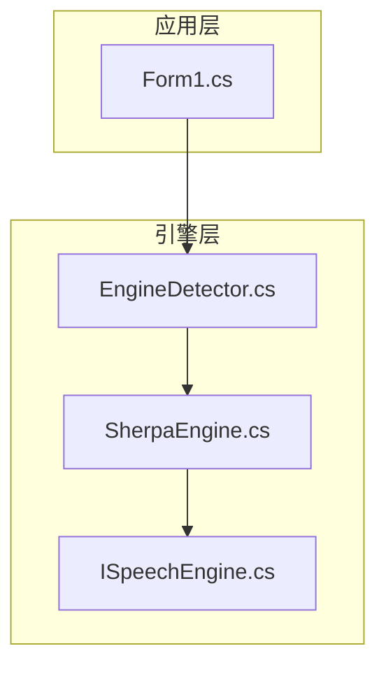
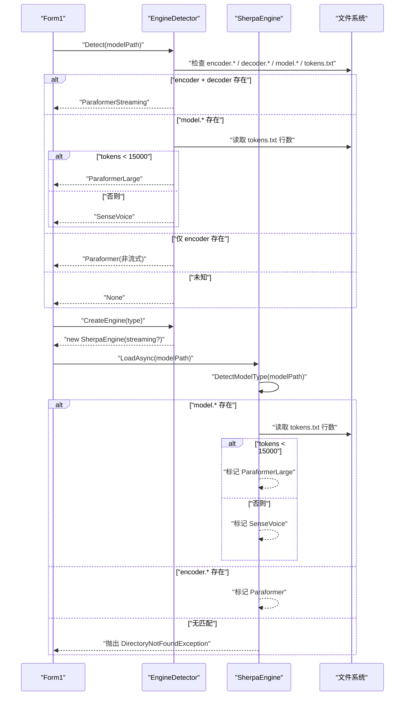
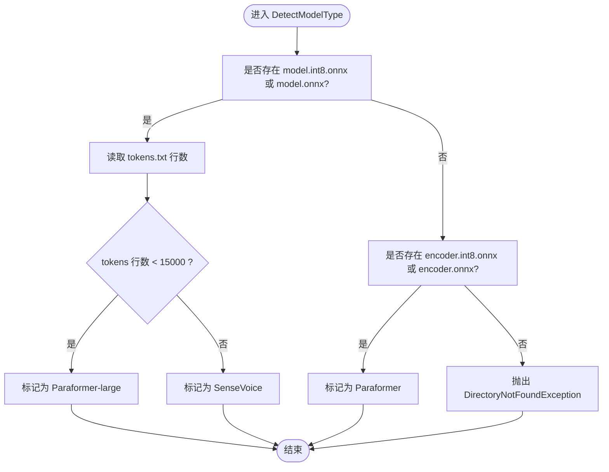
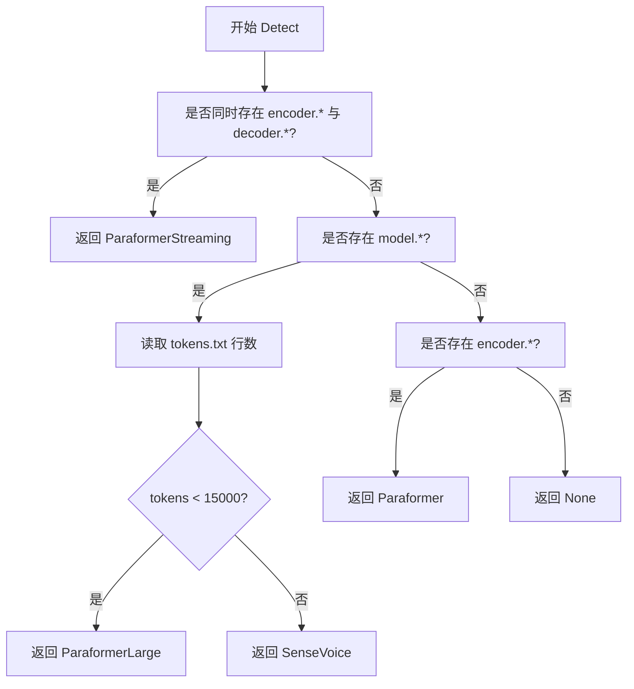
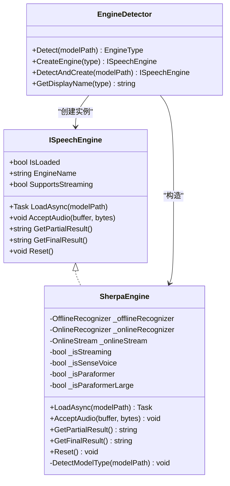

# 模型类型检测机制

<cite>
**本文引用的文件**
- [SherpaEngine.cs](file://t9s2t/Engines/SherpaEngine.cs)
- [EngineDetector.cs](file://t9s2t/Engines/EngineDetector.cs)
- [ISpeechEngine.cs](file://t9s2t/Engines/ISpeechEngine.cs)
- [Form1.cs](file://t9s2t/Form1.cs)
</cite>

## 目录
1. [简介](#简介)
2. [项目结构](#项目结构)
3. [核心组件](#核心组件)
4. [架构总览](#架构总览)
5. [详细组件分析](#详细组件分析)
6. [依赖关系分析](#依赖关系分析)
7. [性能与行为特征](#性能与行为特征)
8. [故障排查指南](#故障排查指南)
9. [结论](#结论)
10. [附录：模型目录结构与示例](#附录模型目录结构与示例)

## 简介
本技术文档聚焦 SherpaEngine 的模型类型检测机制，深入解析 DetectModelType 方法的实现逻辑与优先级规则，覆盖三种模型类型的识别策略：
- SenseVoice 模型：通过 model.int8.onnx 或 model.onnx 文件存在性检测；当同时存在 tokens.txt 且行数小于阈值时，会被判定为离线 Paraformer-large。
- 离线 Paraformer-large 模型：同样具备 model.int8.onnx 或 model.onnx，但通过 tokens.txt 行数（小于 15000）进行区分。
- 流式 Paraformer 模型：通过 encoder.int8.onnx 或 encoder.onnx 文件检测，并在加载阶段要求 decoder 文件参与构建 OnlineRecognizer。

文档还将说明每种模型类型的文件结构特征、检测优先级、错误处理与异常恢复策略、调试信息输出位置，以及如何在工程中正确组织不同模型的目录结构。

## 项目结构
本项目采用分层与按功能模块组织的结构，核心引擎封装位于 Engines 目录，UI 层在 Form1.cs 中调用检测与加载流程。

图表来源
- [EngineDetector.cs:22-75](file://t9s2t/Engines/EngineDetector.cs#L22-L75)
- [SherpaEngine.cs:14-115](file://t9s2t/Engines/SherpaEngine.cs#L14-L115)
- [ISpeechEngine.cs:8-33](file://t9s2t/Engines/ISpeechEngine.cs#L8-L33)
- [Form1.cs:618-660](file://t9s2t/Form1.cs#L618-L660)

章节来源
- [EngineDetector.cs:22-75](file://t9s2t/Engines/EngineDetector.cs#L22-L75)
- [SherpaEngine.cs:14-115](file://t9s2t/Engines/SherpaEngine.cs#L14-L115)
- [ISpeechEngine.cs:8-33](file://t9s2t/Engines/ISpeechEngine.cs#L8-L33)
- [Form1.cs:618-660](file://t9s2t/Form1.cs#L618-L660)

## 核心组件
- ISpeechEngine：定义统一的语音识别引擎接口，包括加载、音频输入、部分结果、最终结果、重置等能力。
- EngineDetector：提供基于模型目录结构的自动检测能力，返回 EngineType 并创建对应引擎实例。
- SherpaEngine：具体实现，内部维护非流式与流式识别器，负责 DetectModelType 与后续模型加载、标点恢复、VAD 等。

章节来源
- [ISpeechEngine.cs:8-33](file://t9s2t/Engines/ISpeechEngine.cs#L8-L33)
- [EngineDetector.cs:22-121](file://t9s2t/Engines/EngineDetector.cs#L22-L121)
- [SherpaEngine.cs:14-115](file://t9s2t/Engines/SherpaEngine.cs#L14-L115)

## 架构总览
下图展示了从 UI 到引擎的检测与加载流程，重点体现 DetectModelType 的决策路径与分支。

图表来源
- [EngineDetector.cs:27-75](file://t9s2t/Engines/EngineDetector.cs#L27-L75)
- [SherpaEngine.cs:74-115](file://t9s2t/Engines/SherpaEngine.cs#L74-L115)
- [Form1.cs:618-660](file://t9s2t/Form1.cs#L618-L660)

## 详细组件分析

### DetectModelType 方法详解
DetectModelType 是 SherpaEngine 的核心检测逻辑，其判断顺序与规则如下：
- 第一步：若目录中存在 model.int8.onnx 或 model.onnx，则进入“单模型”分支。
  - 进一步读取同目录下的 tokens.txt，统计行数。
  - 如果 tokens.txt 行数小于 15000，则判定为离线 Paraformer-large。
  - 否则判定为 SenseVoice。
- 第二步：若不存在上述文件，但存在 encoder.int8.onnx 或 encoder.onnx，则判定为 Paraformer（流式或非流式由外部参数决定）。
- 第三步：以上条件均不满足，抛出 DirectoryNotFoundException，提示无法识别 sherpa-onnx 模型类型。

该方法的调试输出包含检测到的模型类型及关键信息（如 tokens 行数），便于定位问题。

图表来源
- [SherpaEngine.cs:74-115](file://t9s2t/Engines/SherpaEngine.cs#L74-L115)

章节来源
- [SherpaEngine.cs:74-115](file://t9s2t/Engines/SherpaEngine.cs#L74-L115)

### EngineDetector 检测逻辑与优先级
EngineDetector.Detect 提供了与 SherpaEngine 一致的检测策略，用于在 UI 层快速判断模型类型并创建引擎实例。其优先级顺序为：
- 最高优先级：流式 Paraformer（需要 encoder.* 与 decoder.* 同时存在）。
- 次高优先级：单模型分支（model.* 存在），再依据 tokens.txt 行数区分 Paraformer-large 与 SenseVoice。
- 再次：非流式 Paraformer（仅有 encoder.*）。
- 最后：未检测到已知引擎，返回 None。

图表来源
- [EngineDetector.cs:27-75](file://t9s2t/Engines/EngineDetector.cs#L27-L75)

章节来源
- [EngineDetector.cs:27-75](file://t9s2t/Engines/EngineDetector.cs#L27-L75)

### 模型类型与文件结构特征
- SenseVoice
  - 文件特征：存在 model.int8.onnx 或 model.onnx；通常伴随 tokens.txt（词汇量较大，行数一般大于等于 15000）。
  - 检测优先级：低于流式 Paraformer，高于非流式 Paraformer。
- 离线 Paraformer-large
  - 文件特征：存在 model.int8.onnx 或 model.onnx；tokens.txt 行数小于 15000。
  - 检测优先级：与 SenseVoice 同属单模型分支，但通过 tokens 行数区分。
- 流式 Paraformer
  - 文件特征：同时存在 encoder.int8.onnx 或 encoder.onnx，以及 decoder.int8.onnx 或 decoder.onnx。
  - 检测优先级：最高，优先于所有单模型分支与非流式 Paraformer。
- 非流式 Paraformer
  - 文件特征：仅存在 encoder.int8.onnx 或 encoder.onnx（没有 decoder）。
  - 检测优先级：低于单模型分支。

章节来源
- [EngineDetector.cs:27-75](file://t9s2t/Engines/EngineDetector.cs#L27-L75)
- [SherpaEngine.cs:74-115](file://t9s2t/Engines/SherpaEngine.cs#L74-L115)

### 错误处理与异常恢复策略
- 模型类型无法识别
  - SherpaEngine.DetectModelType 会抛出 DirectoryNotFoundException，提示目录与无法识别的类型。
  - UI 层捕获异常后，显示“加载失败”并允许用户重新下载模型。
- 缺失必要文件
  - 各加载方法在缺少 tokens.txt 时会抛出 FileNotFoundException，明确指示缺失的文件路径。
  - 对于标点恢复与 VAD 模型，若文件不存在则跳过并记录调试信息，不影响主识别流程。
- 异常恢复
  - 流式与非流式识别过程中对异常进行 try/catch，记录调试信息并返回空结果，避免崩溃。
  - 资源释放使用 Dispose 模式，确保在线/离线识别器、流、标点与 VAD 对象被正确释放。

章节来源
- [SherpaEngine.cs:110-115](file://t9s2t/Engines/SherpaEngine.cs#L110-L115)
- [SherpaEngine.cs:129-157](file://t9s2t/Engines/SherpaEngine.cs#L129-L157)
- [SherpaEngine.cs:159-188](file://t9s2t/Engines/SherpaEngine.cs#L159-L188)
- [SherpaEngine.cs:190-216](file://t9s2t/Engines/SherpaEngine.cs#L190-L216)
- [SherpaEngine.cs:259-290](file://t9s2t/Engines/SherpaEngine.cs#L259-L290)
- [SherpaEngine.cs:314-347](file://t9s2t/Engines/SherpaEngine.cs#L314-L347)
- [Form1.cs:645-721](file://t9s2t/Form1.cs#L645-L721)

### 调试信息输出
- 检测阶段
  - EngineDetector 与 SherpaEngine 在 Detect/DetectModelType 中输出检测到的模型类型与 tokens 行数。
- 加载阶段
  - 各模型加载完成后输出完成日志，包含使用的模型文件名（如 model.int8.onnx 或 model.onnx）。
- 可选组件
  - 标点恢复与 VAD 加载失败或未找到时，输出相应调试信息，便于定位配置问题。

章节来源
- [EngineDetector.cs:37-74](file://t9s2t/Engines/EngineDetector.cs#L37-L74)
- [SherpaEngine.cs:91-109](file://t9s2t/Engines/SherpaEngine.cs#L91-L109)
- [SherpaEngine.cs:186-188](file://t9s2t/Engines/SherpaEngine.cs#L186-L188)
- [SherpaEngine.cs:284-289](file://t9s2t/Engines/SherpaEngine.cs#L284-L289)
- [SherpaEngine.cs:341-346](file://t9s2t/Engines/SherpaEngine.cs#L341-L346)

## 依赖关系分析
- UI 层依赖 EngineDetector 进行模型类型检测与引擎创建。
- EngineDetector 依赖文件系统 API 检查特定文件的存在性与 tokens.txt 行数。
- SherpaEngine 依赖 SherpaOnnx 库提供的 OfflineRecognizer、OnlineRecognizer、OfflinePunctuation、VoiceActivityDetector 等组件。
- 接口 ISpeechEngine 定义了统一契约，屏蔽底层差异。

图表来源
- [ISpeechEngine.cs:8-33](file://t9s2t/Engines/ISpeechEngine.cs#L8-L33)
- [EngineDetector.cs:80-104](file://t9s2t/Engines/EngineDetector.cs#L80-L104)
- [SherpaEngine.cs:14-115](file://t9s2t/Engines/SherpaEngine.cs#L14-L115)

章节来源
- [ISpeechEngine.cs:8-33](file://t9s2t/Engines/ISpeechEngine.cs#L8-L33)
- [EngineDetector.cs:80-104](file://t9s2t/Engines/EngineDetector.cs#L80-L104)
- [SherpaEngine.cs:14-115](file://t9s2t/Engines/SherpaEngine.cs#L14-L115)

## 性能与行为特征
- 量化模型优先：离线 Paraformer-large 加载时优先使用 model.int8.onnx，回退到 model.onnx，以兼顾体积与速度。
- 线程数配置：默认 NumThreads=4，有助于提升多核 CPU 上的推理性能。
- 端点检测参数：流式模式下启用端点检测，平衡出字速度与误触发风险，避免说话中自然停顿导致 left context 丢失。
- 静音过滤：流式模式下根据 RMS 音量阈值过滤静音片段，减少无效计算与幻觉。

章节来源
- [SherpaEngine.cs:159-188](file://t9s2t/Engines/SherpaEngine.cs#L159-L188)
- [SherpaEngine.cs:246-255](file://t9s2t/Engines/SherpaEngine.cs#L246-L255)
- [SherpaEngine.cs:351-384](file://t9s2t/Engines/SherpaEngine.cs#L351-L384)

## 故障排查指南
- 无法识别模型类型
  - 现象：抛出 DirectoryNotFoundException，提示目录与无法识别的类型。
  - 排查：确认模型目录是否包含正确的文件组合（model.* 或 encoder.*+decoder.*），并确保 tokens.txt 存在且可读。
- 缺少 tokens.txt
  - 现象：抛出 FileNotFoundException，指明缺失文件路径。
  - 排查：将 tokens.txt 放入模型目录，确保编码与格式符合预期。
- 标点恢复或 VAD 未生效
  - 现象：调试输出提示未找到 punc.onnx/vad.onnx 或加载失败。
  - 排查：将对应模型文件放入目录，或忽略这些可选组件继续运行。
- 流式识别吞字或过早分句
  - 现象：出现中间停顿导致分句或 left context 丢失。
  - 排查：调整端点检测参数（Rule1MinTrailingSilence、Rule2MinTrailingSilence、Rule3MinUtteranceLength），或优化静音阈值与连续静音帧计数。

章节来源
- [SherpaEngine.cs:110-115](file://t9s2t/Engines/SherpaEngine.cs#L110-L115)
- [SherpaEngine.cs:129-157](file://t9s2t/Engines/SherpaEngine.cs#L129-L157)
- [SherpaEngine.cs:259-290](file://t9s2t/Engines/SherpaEngine.cs#L259-L290)
- [SherpaEngine.cs:314-347](file://t9s2t/Engines/SherpaEngine.cs#L314-L347)
- [Form1.cs:645-721](file://t9s2t/Form1.cs#L645-L721)

## 结论
SherpaEngine 的模型类型检测机制通过严格的文件存在性与 tokens.txt 行数阈值，实现了 SenseVoice、离线 Paraformer-large 与流式/非流式 Paraformer 的准确识别。检测优先级清晰、错误处理完善、调试信息充分，配合 UI 层的健壮处理，能够为用户提供良好的体验与可维护性。建议在实际部署中严格遵循推荐的模型目录结构，并根据场景微调端点检测与静音阈值以获得最佳效果。

## 附录：模型目录结构与示例
以下为不同模型类型的推荐目录结构示例（不包含代码内容，仅提供路径组织方式）：

- SenseVoice 模型
  - 目录示例
    - models/sensevoice/model.int8.onnx
    - models/sensevoice/tokens.txt
  - 说明：存在 model.int8.onnx 或 model.onnx，且 tokens.txt 行数通常不小于 15000。

- 离线 Paraformer-large 模型
  - 目录示例
    - models/paraformer_large/model.int8.onnx
    - models/paraformer_large/tokens.txt
  - 说明：存在 model.int8.onnx 或 model.onnx，且 tokens.txt 行数小于 15000。

- 流式 Paraformer 模型
  - 目录示例
    - models/paraformer_streaming/encoder.int8.onnx
    - models/paraformer_streaming/decoder.int8.onnx
    - models/paraformer_streaming/tokens.txt
  - 说明：同时存在 encoder.* 与 decoder.*，tokens.txt 必需。

- 非流式 Paraformer 模型
  - 目录示例
    - models/paraformer_offline/encoder.int8.onnx
    - models/paraformer_offline/tokens.txt
  - 说明：仅存在 encoder.*，没有 decoder.*。

- 可选组件（标点与 VAD）
  - 目录示例
    - models/<engine>/punc.onnx 或 punc.int8.onnx
    - models/<engine>/vad.onnx
  - 说明：可选，缺失时跳过并记录调试信息。

章节来源
- [EngineDetector.cs:27-75](file://t9s2t/Engines/EngineDetector.cs#L27-L75)
- [SherpaEngine.cs:74-115](file://t9s2t/Engines/SherpaEngine.cs#L74-L115)
- [SherpaEngine.cs:259-290](file://t9s2t/Engines/SherpaEngine.cs#L259-L290)
- [SherpaEngine.cs:314-347](file://t9s2t/Engines/SherpaEngine.cs#L314-L347)