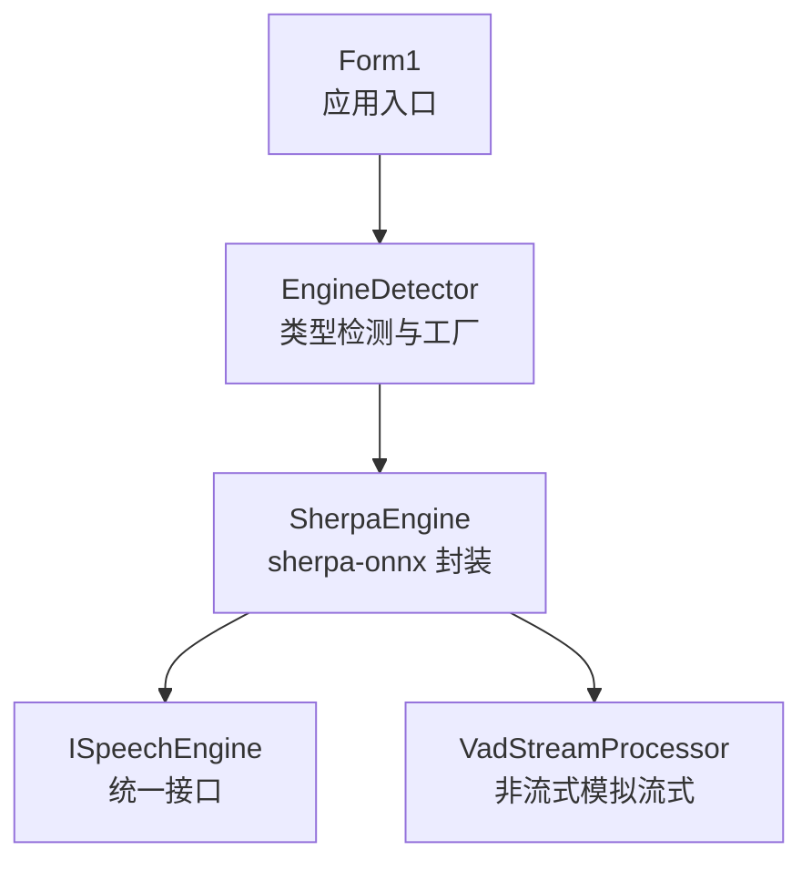
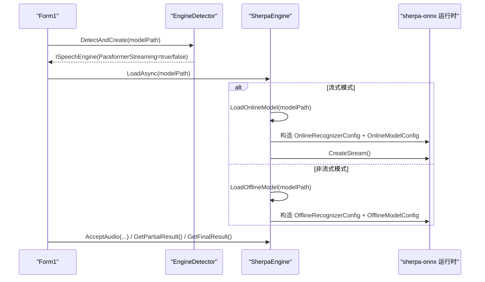
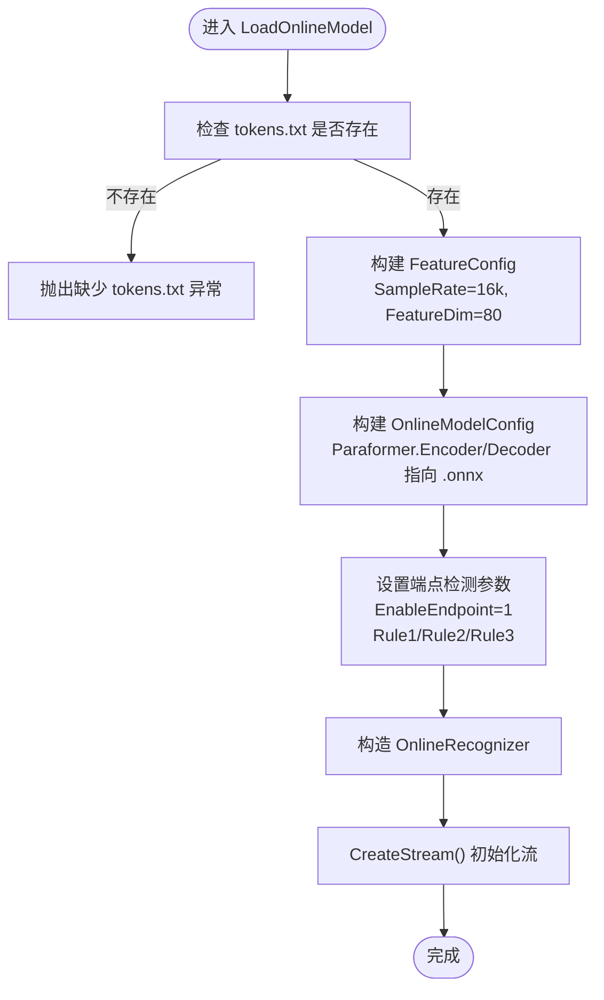
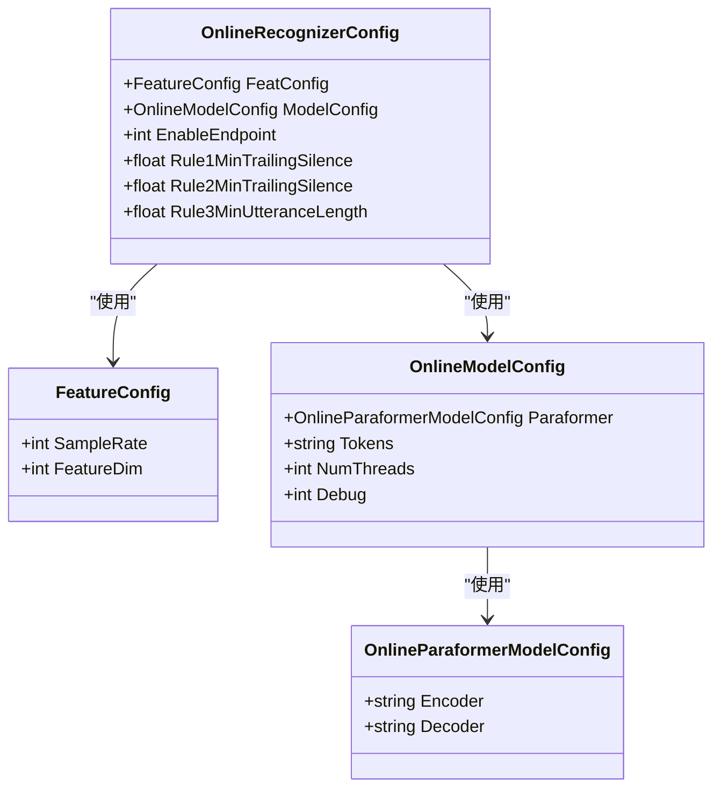
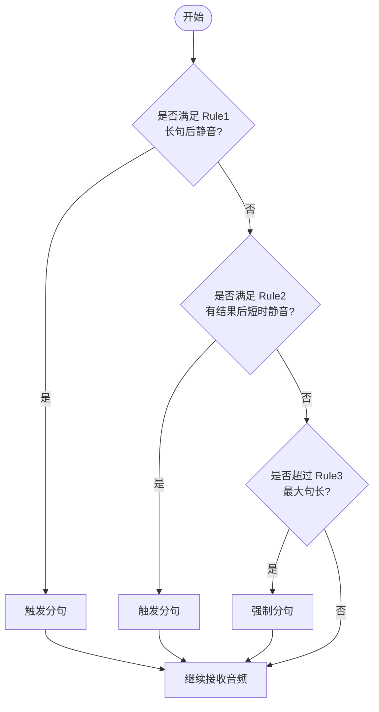
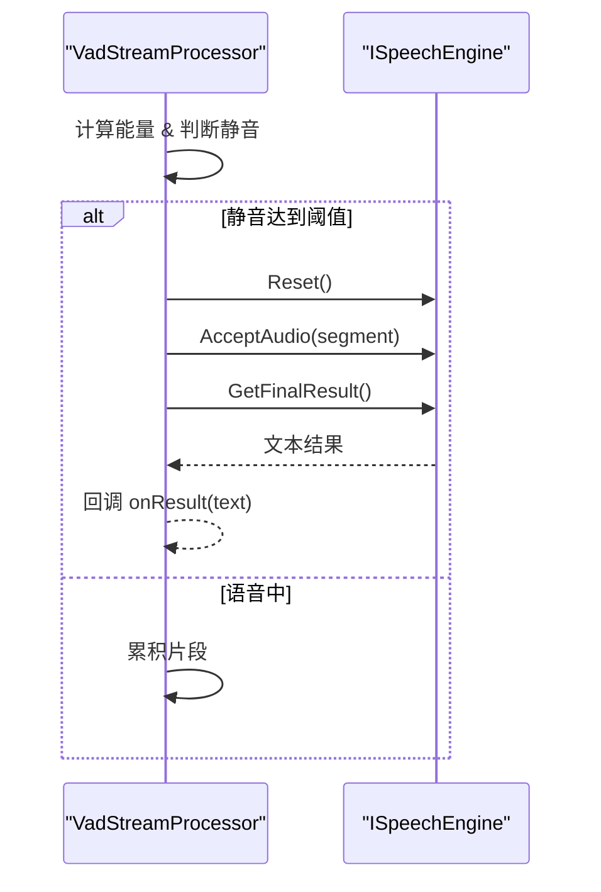
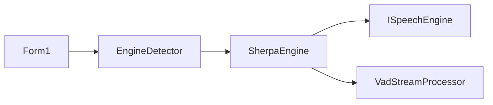

# 流式模型加载配置

<cite>
**本文引用的文件**   
- [SherpaEngine.cs](file://t9s2t/Engines/SherpaEngine.cs)
- [EngineDetector.cs](file://t9s2t/Engines/EngineDetector.cs)
- [ISpeechEngine.cs](file://t9s2t/Engines/ISpeechEngine.cs)
- [VadStreamProcessor.cs](file://t9s2t/Engines/VadStreamProcessor.cs)
- [Form1.cs](file://t9s2t/Form1.cs)
</cite>

## 目录
1. [简介](#简介)
2. [项目结构](#项目结构)
3. [核心组件](#核心组件)
4. [架构总览](#架构总览)
5. [详细组件分析](#详细组件分析)
6. [依赖关系分析](#依赖关系分析)
7. [性能与优化建议](#性能与优化建议)
8. [故障排查指南](#故障排查指南)
9. [结论](#结论)
10. [附录：配置示例与调优清单](#附录配置示例与调优清单)

## 简介
本技术文档聚焦于 SherpaEngine 的流式模型加载配置，重点解析 LoadOnlineModel 方法的实现细节，包括 OnlineRecognizerConfig、OnlineModelConfig、OnlineParaformerModelConfig 的配置项设置；说明编码器（encoder.int8.onnx）与解码器（decoder.int8.onnx）文件的加载机制，以及 tokens.txt 词表文件的配置要求。同时，深入阐述端点检测参数的配置策略与调优方法，包括 Rule1MinTrailingSilence（长句后静音触发）、Rule2MinTrailingSilence（有结果后静音触发）、Rule3MinUtteranceLength（强制分句长度），并提供实际效果分析与优化建议。

## 项目结构
本项目采用分层与按功能组织的方式：
- 引擎抽象层：ISpeechEngine 定义统一接口
- 引擎实现层：SherpaEngine 封装 sherpa-onnx 的离线与流式识别能力
- 引擎检测层：EngineDetector 根据模型目录结构自动识别并创建对应引擎实例
- VAD 流式处理器：VadStreamProcessor 为非流式模型提供“模拟流式”的分段识别
- UI 集成层：Form1 负责资源下载、模型检测、引擎加载与录音流程编排

图表来源
- [Form1.cs:645-721](file://t9s2t/Form1.cs#L645-L721)
- [EngineDetector.cs:27-104](file://t9s2t/Engines/EngineDetector.cs#L27-L104)
- [ISpeechEngine.cs:8-33](file://t9s2t/Engines/ISpeechEngine.cs#L8-L33)
- [VadStreamProcessor.cs:12-136](file://t9s2t/Engines/VadStreamProcessor.cs#L12-L136)

章节来源
- [Form1.cs:645-721](file://t9s2t/Form1.cs#L645-L721)
- [EngineDetector.cs:27-104](file://t9s2t/Engines/EngineDetector.cs#L27-L104)
- [ISpeechEngine.cs:8-33](file://t9s2t/Engines/ISpeechEngine.cs#L8-L33)
- [VadStreamProcessor.cs:12-136](file://t9s2t/Engines/VadStreamProcessor.cs#L12-L136)

## 核心组件
- ISpeechEngine：定义统一的语音识别引擎接口，包含加载、音频输入、部分/最终结果获取、重置等能力。
- EngineDetector：通过模型目录中的关键文件（如 encoder.int8.onnx、decoder.int8.onnx、model.onnx、tokens.txt）自动判断引擎类型（SenseVoice、Paraformer、Paraformer-large、Paraformer 流式），并创建对应的 SherpaEngine 实例。
- SherpaEngine：封装 sherpa-onnx 的离线与非流式 Paraformer、SenseVoice 以及流式 Paraformer 的加载与识别流程，内置标点恢复与可选 VAD 模型加载。
- VadStreamProcessor：对非流式模型进行分段处理，基于能量阈值与连续静音帧数触发提交识别，从而模拟流式体验。

章节来源
- [ISpeechEngine.cs:8-33](file://t9s2t/Engines/ISpeechEngine.cs#L8-L33)
- [EngineDetector.cs:27-104](file://t9s2t/Engines/EngineDetector.cs#L27-L104)
- [SherpaEngine.cs:14-72](file://t9s2t/Engines/SherpaEngine.cs#L14-L72)
- [VadStreamProcessor.cs:12-136](file://t9s2t/Engines/VadStreamProcessor.cs#L12-L136)

## 架构总览
下图展示了从 UI 到引擎加载与识别的整体流程，特别标注了流式模式下的模型加载与端点检测路径。

图表来源
- [Form1.cs:645-721](file://t9s2t/Form1.cs#L645-L721)
- [EngineDetector.cs:27-104](file://t9s2t/Engines/EngineDetector.cs#L27-L104)
- [SherpaEngine.cs:57-72](file://t9s2t/Engines/SherpaEngine.cs#L57-L72)
- [SherpaEngine.cs:220-255](file://t9s2t/Engines/SherpaEngine.cs#L220-L255)

## 详细组件分析

### 流式模型加载：LoadOnlineModel 详解
LoadOnlineModel 是流式 Paraformer 的核心加载逻辑，负责构建 OnlineRecognizerConfig、OnlineModelConfig 与 OnlineParaformerModelConfig，并启用端点检测参数。

- 模型文件定位
  - 编码器：encoder.int8.onnx（优先 int8 量化版，兼顾速度与内存占用）
  - 解码器：decoder.int8.onnx（同上）
  - 词表：tokens.txt（必须存在，用于输出 token 映射）
- 特征配置
  - SampleRate：16kHz
  - FeatureDim：80
- 推理线程与调试
  - NumThreads：4（平衡吞吐与延迟）
  - Debug：0（生产环境关闭调试日志）
- 端点检测参数（关键）
  - EnableEndpoint：1（启用）
  - Rule1MinTrailingSilence：1.2f（长句后静音触发）
  - Rule2MinTrailingSilence：0.5f（已有识别结果后的静音触发，防止说话中停顿误触发）
  - Rule3MinUtteranceLength：12.0f（超过该时长强制分句，避免超长上下文导致 left context 丢失）

图表来源
- [SherpaEngine.cs:220-255](file://t9s2t/Engines/SherpaEngine.cs#L220-L255)

章节来源
- [SherpaEngine.cs:220-255](file://t9s2t/Engines/SherpaEngine.cs#L220-L255)

### 在线识别配置对象关系
以下类图展示与流式加载相关的配置对象及其字段关系（仅列出与本主题相关的关键字段）。

图表来源
- [SherpaEngine.cs:229-245](file://t9s2t/Engines/SherpaEngine.cs#L229-L245)

章节来源
- [SherpaEngine.cs:229-245](file://t9s2t/Engines/SherpaEngine.cs#L229-L245)

### 编码器与解码器加载机制
- 编码器（encoder.int8.onnx）：负责将音频特征编码为隐状态序列，流式模式下增量更新。
- 解码器（decoder.int8.onnx）：基于编码器输出的隐状态生成 token 序列，支持自回归解码。
- tokens.txt：词表文件，每行一个 token，顺序与模型输出索引一一对应。缺失会导致加载失败。

章节来源
- [SherpaEngine.cs:222-227](file://t9s2t/Engines/SherpaEngine.cs#L222-L227)

### 端点检测参数配置策略与调优
端点检测在流式识别中至关重要，直接影响出字速度、吞字率与分句质量。

- Rule1MinTrailingSilence（长句后静音触发）
  - 作用：当句子较长且出现持续静音时，触发分句。
  - 调优建议：适当增大可减少误触发，但会延迟出字；减小可提升实时性，但可能在中途停顿处误切分。
- Rule2MinTrailingSilence（有结果后静音触发）
  - 作用：在已有识别结果的情况下，若出现较短静音则触发分句，用于快速收尾。
  - 调优建议：通常小于 Rule1，以避免说话中自然停顿导致的误切分。
- Rule3MinUtteranceLength（强制分句长度）
  - 作用：当单句长度超过该阈值时，强制分句，防止 left context 过长影响后续识别。
  - 调优建议：根据业务场景设定，中文口语常见 10~15 秒范围。

图表来源
- [SherpaEngine.cs:246-251](file://t9s2t/Engines/SherpaEngine.cs#L246-L251)

章节来源
- [SherpaEngine.cs:246-251](file://t9s2t/Engines/SherpaEngine.cs#L246-L251)

### 非流式模型的“模拟流式”处理（VAD）
对于 SenseVoice 等非流式模型，系统通过 VadStreamProcessor 基于能量阈值与连续静音帧数进行分段识别，以模拟流式体验。

- 静音阈值与帧计数
  - 静音振幅阈值：降低以兼容低增益麦克风
  - 连续静音帧数：约 0.5 秒触发分段
  - 最少语音帧数：过滤噪音片段
- 提交识别流程
  - 检测到语音结束 -> 提交当前积累片段 -> 调用引擎 GetFinalResult -> 回调返回结果

图表来源
- [VadStreamProcessor.cs:38-136](file://t9s2t/Engines/VadStreamProcessor.cs#L38-L136)

章节来源
- [VadStreamProcessor.cs:38-136](file://t9s2t/Engines/VadStreamProcessor.cs#L38-L136)

## 依赖关系分析
- 引擎检测与创建
  - EngineDetector 根据模型目录结构判断引擎类型，并创建 SherpaEngine 实例（流式或非流式）。
- UI 集成
  - Form1 负责检测引擎 DLL、下载模型、加载引擎并根据 SupportsStreaming 决定是否使用 VadStreamProcessor。
- 流式与非流式差异
  - 流式：使用 OnlineRecognizer + OnlineStream，配合端点检测参数自动分句。
  - 非流式：使用 OfflineRecognizer + 整段识别，或通过 VAD 分段模拟流式。

图表来源
- [Form1.cs:645-721](file://t9s2t/Form1.cs#L645-L721)
- [EngineDetector.cs:27-104](file://t9s2t/Engines/EngineDetector.cs#L27-L104)
- [ISpeechEngine.cs:8-33](file://t9s2t/Engines/ISpeechEngine.cs#L8-L33)
- [VadStreamProcessor.cs:12-136](file://t9s2t/Engines/VadStreamProcessor.cs#L12-L136)

章节来源
- [Form1.cs:645-721](file://t9s2t/Form1.cs#L645-L721)
- [EngineDetector.cs:27-104](file://t9s2t/Engines/EngineDetector.cs#L27-L104)
- [ISpeechEngine.cs:8-33](file://t9s2t/Engines/ISpeechEngine.cs#L8-L33)
- [VadStreamProcessor.cs:12-136](file://t9s2t/Engines/VadStreamProcessor.cs#L12-L136)

## 性能与优化建议
- 模型选择
  - 优先使用 int8 量化版本（encoder.int8.onnx、decoder.int8.onnx），以降低内存占用与推理延迟。
- 线程数
  - NumThreads 设置为 4 可在多数桌面环境中取得较好的吞吐与延迟平衡。
- 端点检测调优
  - 若出现“吞字”或过早分句，可适当增大 Rule1MinTrailingSilence 与 Rule2MinTrailingSilence。
  - 若出字过慢，可适当减小上述静音阈值，或缩短 Rule3MinUtteranceLength。
- 特征配置
  - SampleRate=16k、FeatureDim=80 为默认稳定配置，不建议随意更改，以免与模型不匹配。
- 标点恢复与 VAD
  - 若需要更自然的文本输出，可启用标点恢复模型（punc.onnx/punc.int8.onnx）。
  - 对于非流式模型，合理调整 VadStreamProcessor 的能量阈值与静音帧数，以提升分段准确性。

[本节为通用指导，无需具体文件引用]

## 故障排查指南
- 缺少 tokens.txt
  - 现象：加载时报错提示缺少 tokens.txt。
  - 解决：确保模型目录下存在 tokens.txt，且内容与模型一致。
- 无法识别模型类型
  - 现象：未检测到已知引擎。
  - 解决：确认模型目录包含正确的文件组合（流式需 encoder+decoder；非流式需 model 或 encoder）。
- 流式识别无结果或频繁分句
  - 现象：出字延迟大或中途错误切分。
  - 解决：调整端点检测参数（Rule1/Rule2/Rule3），并结合实际语速与停顿习惯微调。
- 非流式模拟流式不准确
  - 现象：分段过碎或漏掉片段。
  - 解决：调整 VadStreamProcessor 的能量阈值与静音帧数，必要时增加最小语音帧数。

章节来源
- [SherpaEngine.cs:220-255](file://t9s2t/Engines/SherpaEngine.cs#L220-L255)
- [EngineDetector.cs:27-75](file://t9s2t/Engines/EngineDetector.cs#L27-L75)
- [VadStreamProcessor.cs:38-136](file://t9s2t/Engines/VadStreamProcessor.cs#L38-L136)

## 结论
SherpaEngine 的流式模型加载通过清晰的配置对象与严格的文件校验，实现了稳定的端到端识别流程。LoadOnlineModel 方法在构建 OnlineRecognizerConfig 与 OnlineModelConfig 的基础上，结合端点检测参数有效平衡了出字速度与分句质量。针对不同的应用场景，可通过调整 Rule1/Rule2/Rule3 与线程数、模型量化版本等参数，获得更佳的识别体验。

[本节为总结性内容，无需具体文件引用]

## 附录：配置示例与调优清单
- 基本配置要点
  - 模型文件：encoder.int8.onnx、decoder.int8.onnx、tokens.txt
  - 特征配置：SampleRate=16000、FeatureDim=80
  - 推理线程：NumThreads=4
  - 端点检测：EnableEndpoint=1，Rule1/Rule2/Rule3 按场景调优
- 调优步骤建议
  - 先固定 Rule3MinUtteranceLength（如 12s），观察超长句表现
  - 再调整 Rule1MinTrailingSilence（如 1.2s），减少长句后误切分
  - 最后调整 Rule2MinTrailingSilence（如 0.5s），平衡有结果后的快速收尾
- 非流式模拟流式
  - 调整能量阈值与静音帧数，确保分段符合用户语速与停顿习惯
  - 增加最小语音帧数以过滤噪声片段

[本节为操作清单，无需具体文件引用]