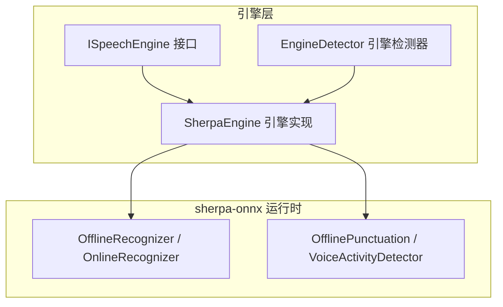
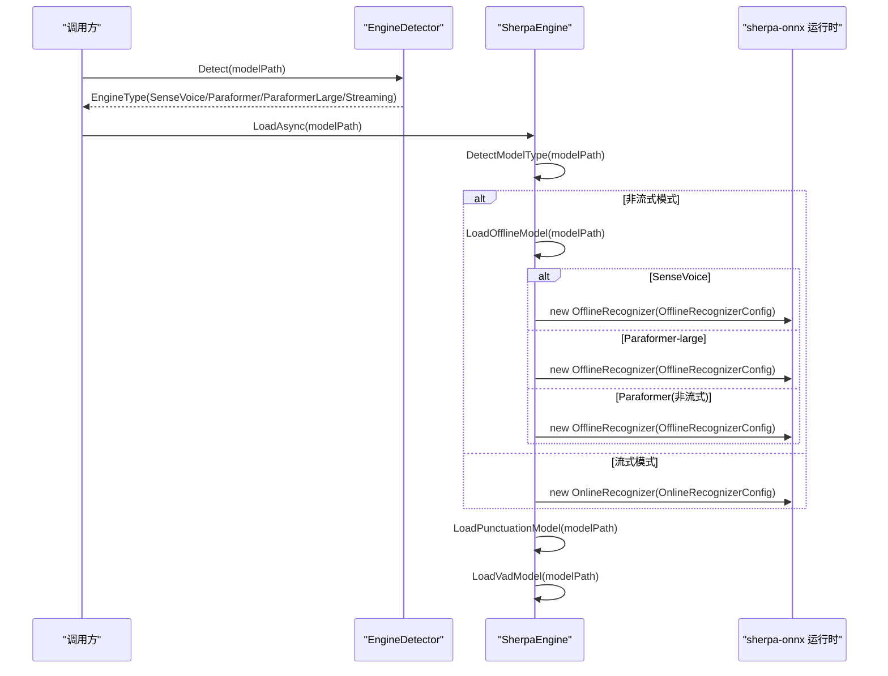
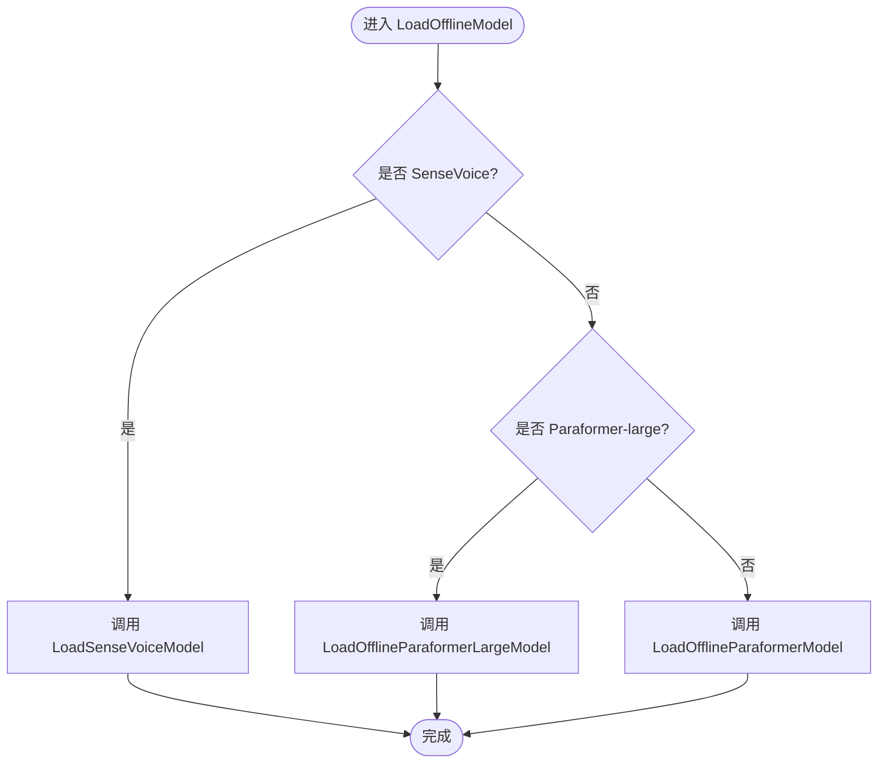
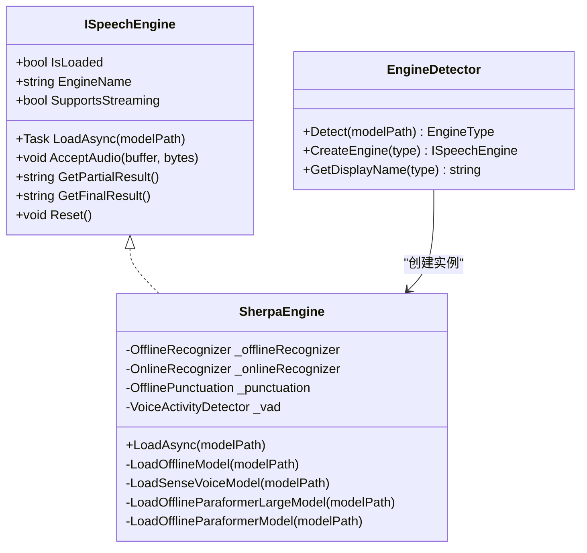

# 离线模型加载配置

<cite>
**本文引用的文件**   
- [SherpaEngine.cs](file://t9s2t/Engines/SherpaEngine.cs)
- [ISpeechEngine.cs](file://t9s2t/Engines/ISpeechEngine.cs)
- [EngineDetector.cs](file://t9s2t/Engines/EngineDetector.cs)
</cite>

## 目录
1. [简介](#简介)
2. [项目结构](#项目结构)
3. [核心组件](#核心组件)
4. [架构总览](#架构总览)
5. [详细组件分析](#详细组件分析)
6. [依赖关系分析](#依赖关系分析)
7. [性能与内存优化建议](#性能与内存优化建议)
8. [故障排查指南](#故障排查指南)
9. [结论](#结论)
10. [附录：配置参数速查](#附录配置参数速查)

## 简介
本技术文档聚焦于 SherpaEngine 的离线模型加载配置，重点解析 LoadOfflineModel 的分发逻辑以及三种具体实现：LoadSenseVoiceModel、LoadOfflineParaformerLargeModel、LoadOfflineParaformerModel。文档同时详细说明 OfflineRecognizerConfig、FeatureConfig、OfflineModelConfig 等配置对象的参数设置（采样率、特征维度、线程数等），阐述 SenseVoice 模型的 Language 与 UseInverseTextNormalization 配置含义，并解释 Paraformer 模型优先加载 int8 量化版本的策略。文末提供最佳实践与调优建议，帮助在内存与性能之间取得平衡。

## 项目结构
本项目采用按功能模块组织的方式，语音识别引擎相关代码集中在 Engines 目录下：
- ISpeechEngine.cs：定义统一的语音识别引擎接口
- EngineDetector.cs：根据模型目录结构自动检测引擎类型并创建对应实例
- SherpaEngine.cs：sherpa-onnx 引擎封装，支持 SenseVoice、非流式 Paraformer、流式 Paraformer；包含离线模型加载分发与具体实现

图表来源
- [ISpeechEngine.cs:1-35](file://t9s2t/Engines/ISpeechEngine.cs#L1-L35)
- [EngineDetector.cs:1-122](file://t9s2t/Engines/EngineDetector.cs#L1-L122)
- [SherpaEngine.cs:1-120](file://t9s2t/Engines/SherpaEngine.cs#L1-L120)

章节来源
- [ISpeechEngine.cs:1-35](file://t9s2t/Engines/ISpeechEngine.cs#L1-L35)
- [EngineDetector.cs:1-122](file://t9s2t/Engines/EngineDetector.cs#L1-L122)
- [SherpaEngine.cs:1-120](file://t9s2t/Engines/SherpaEngine.cs#L1-L120)

## 核心组件
- ISpeechEngine：统一抽象，屏蔽底层引擎差异，暴露加载、音频输入、结果获取、重置等方法
- EngineDetector：通过模型目录中的关键文件（如 model.onnx、encoder.int8.onnx、decoder.int8.onnx）及 tokens.txt 行数区分 SenseVoice 与 Paraformer-large，并返回相应引擎类型
- SherpaEngine：实现 ISpeechEngine，内部维护离线与非流式识别器、标点恢复与 VAD 能力；负责离线模型加载分发与具体实现

章节来源
- [ISpeechEngine.cs:1-35](file://t9s2t/Engines/ISpeechEngine.cs#L1-L35)
- [EngineDetector.cs:1-122](file://t9s2t/Engines/EngineDetector.cs#L1-L122)
- [SherpaEngine.cs:1-120](file://t9s2t/Engines/SherpaEngine.cs#L1-L120)

## 架构总览
下图展示了从模型目录到离线识别器的完整加载流程，包括模型类型检测、分发与具体加载实现。

图表来源
- [EngineDetector.cs:27-75](file://t9s2t/Engines/EngineDetector.cs#L27-L75)
- [SherpaEngine.cs:57-127](file://t9s2t/Engines/SherpaEngine.cs#L57-L127)
- [SherpaEngine.cs:129-216](file://t9s2t/Engines/SherpaEngine.cs#L129-L216)
- [SherpaEngine.cs:220-255](file://t9s2t/Engines/SherpaEngine.cs#L220-L255)
- [SherpaEngine.cs:259-347](file://t9s2t/Engines/SherpaEngine.cs#L259-L347)

## 详细组件分析

### 离线模型加载分发：LoadOfflineModel
- 作用：根据已检测到的模型类型，将加载任务分派给具体的实现方法
- 分支逻辑：
  - 若为 SenseVoice：调用 LoadSenseVoiceModel
  - 若为 Paraformer-large：调用 LoadOfflineParaformerLargeModel
  - 否则为非流式 Paraformer：调用 LoadOfflineParaformerModel

图表来源
- [SherpaEngine.cs:119-127](file://t9s2t/Engines/SherpaEngine.cs#L119-L127)

章节来源
- [SherpaEngine.cs:119-127](file://t9s2t/Engines/SherpaEngine.cs#L119-L127)

### 具体实现一：LoadSenseVoiceModel
- 模型文件：优先使用 model.int8.onnx；词表文件 tokens.txt 必须存在
- 配置要点：
  - FeatureConfig：SampleRate=16000，FeatureDim=80
  - OfflineModelConfig.SenseVoice：
    - Model：指向 model.int8.onnx
    - Language="auto"：自动语言检测
    - UseInverseTextNormalization=1：启用逆文本规范化（对数字、单位等进行还原）
  - OfflineModelConfig：Tokens=tokens.txt，NumThreads=4，Debug=0
- 行为说明：
  - 自动语言检测适合多语言场景
  - 逆文本规范化可提升可读性，但可能引入额外处理开销

章节来源
- [SherpaEngine.cs:129-157](file://t9s2t/Engines/SherpaEngine.cs#L129-L157)

### 具体实现二：LoadOfflineParaformerLargeModel
- 模型文件选择策略：优先 model.int8.onnx，不存在则回退到 model.onnx
- 词表文件：tokens.txt 必须存在
- 配置要点：
  - FeatureConfig：SampleRate=16000，FeatureDim=80
  - OfflineModelConfig.Paraformer.Model：指向选定的模型文件
  - OfflineModelConfig：Tokens=tokens.txt，NumThreads=4，Debug=0
- 行为说明：
  - int8 量化版本体积更小、推理更快，适合资源受限环境
  - 回退 fp32 保证兼容性

章节来源
- [SherpaEngine.cs:159-188](file://t9s2t/Engines/SherpaEngine.cs#L159-L188)

### 具体实现三：LoadOfflineParaformerModel
- 模型文件：使用 encoder.int8.onnx（非流式 Paraformer 仅编码器）
- 词表文件：tokens.txt 必须存在
- 配置要点：
  - FeatureConfig：SampleRate=16000，FeatureDim=80
  - OfflineModelConfig.Paraformer.Model：指向 encoder.int8.onnx
  - OfflineModelConfig：Tokens=tokens.txt，NumThreads=4，Debug=0
- 行为说明：
  - 非流式模式下，整段音频一次性送入识别器进行解码

章节来源
- [SherpaEngine.cs:190-216](file://t9s2t/Engines/SherpaEngine.cs#L190-L216)

### 配置对象详解
- OfflineRecognizerConfig
  - FeatConfig：定义音频特征提取参数
    - SampleRate：采样率，固定为 16000 Hz
    - FeatureDim：特征维度，固定为 80
  - ModelConfig：定义模型与运行参数
    - Tokens：词表路径（tokens.txt）
    - NumThreads：并行线程数，默认 4
    - Debug：调试开关，默认 0
- FeatureConfig
  - SampleRate：音频采样率
  - FeatureDim：特征向量维度
- OfflineModelConfig
  - SenseVoice：SenseVoice 专用配置
    - Model：模型文件路径
    - Language：语言设置（示例为 "auto"）
    - UseInverseTextNormalization：是否启用逆文本规范化（示例为 1）
  - Paraformer：Paraformer 专用配置
    - Model：模型或编码器文件路径

章节来源
- [SherpaEngine.cs:136-153](file://t9s2t/Engines/SherpaEngine.cs#L136-L153)
- [SherpaEngine.cs:169-184](file://t9s2t/Engines/SherpaEngine.cs#L169-L184)
- [SherpaEngine.cs:197-212](file://t9s2t/Engines/SherpaEngine.cs#L197-L212)

### 模型类型检测与分发
- 检测依据：
  - 流式 Paraformer：存在 encoder.int8.onnx + decoder.int8.onnx
  - 非流式 Paraformer：仅存在 encoder.int8.onnx（无 decoder）
  - 单模型（model.onnx 或 model.int8.onnx）：通过 tokens.txt 行数区分
    - tokens.txt 行数 < 15000：判定为 Paraformer-large（中文大模型词汇量较小）
    - 否则：判定为 SenseVoice（多语言大词汇）
- 创建引擎：
  - 根据检测结果返回对应的 ISpeechEngine 实例（非流式或流式）

章节来源
- [EngineDetector.cs:27-75](file://t9s2t/Engines/EngineDetector.cs#L27-L75)
- [EngineDetector.cs:80-95](file://t9s2t/Engines/EngineDetector.cs#L80-L95)
- [SherpaEngine.cs:74-115](file://t9s2t/Engines/SherpaEngine.cs#L74-L115)

## 依赖关系分析
- 外部依赖：
  - sherpa-onnx 运行时库（通过命名空间 SherpaOnnx 引用）
- 内部依赖：
  - ISpeechEngine 接口约束了引擎能力边界
  - EngineDetector 负责模型类型识别与工厂式创建
  - SherpaEngine 实现具体加载与识别流程

图表来源
- [ISpeechEngine.cs:1-35](file://t9s2t/Engines/ISpeechEngine.cs#L1-L35)
- [EngineDetector.cs:1-122](file://t9s2t/Engines/EngineDetector.cs#L1-L122)
- [SherpaEngine.cs:1-120](file://t9s2t/Engines/SherpaEngine.cs#L1-L120)

章节来源
- [ISpeechEngine.cs:1-35](file://t9s2t/Engines/ISpeechEngine.cs#L1-L35)
- [EngineDetector.cs:1-122](file://t9s2t/Engines/EngineDetector.cs#L1-L122)
- [SherpaEngine.cs:1-120](file://t9s2t/Engines/SherpaEngine.cs#L1-L120)

## 性能与内存优化建议
- 模型选择
  - 优先使用 int8 量化模型（model.int8.onnx 或 encoder.int8.onnx），以降低内存占用并提升推理速度；当量化模型缺失时回退至 fp32 版本
- 线程数调整
  - NumThreads 默认 4，可根据 CPU 核心数与应用并发需求调整；过高可能导致上下文切换开销增大
- 特征参数
  - SampleRate=16000、FeatureDim=80 为当前实现固定值，如需适配不同模型需同步更新
- 逆文本规范化
  - SenseVoice 的 UseInverseTextNormalization=1 可提升输出可读性，但在高吞吐场景下可考虑关闭以换取更低延迟
- 标点恢复与 VAD
  - 可选加载 punc.onnx 与 vad.onnx；在不需要的场景下跳过加载可减少启动时间与内存占用
- 端点检测（流式）
  - 合理设置 Rule1MinTrailingSilence、Rule2MinTrailingSilence、Rule3MinUtteranceLength，避免误触发导致 left context 丢失

[本节为通用指导，不直接分析具体文件]

## 故障排查指南
- 缺少 tokens.txt
  - 现象：抛出“缺少 tokens.txt 文件”异常
  - 排查：确认模型目录包含 tokens.txt，且路径正确
- 无法识别模型类型
  - 现象：抛出“无法识别 sherpa-onnx 模型类型”异常
  - 排查：检查是否存在 model.onnx/model.int8.onnx 或 encoder.onnx/encoder.int8.onnx；对于单模型，确保 tokens.txt 存在并可读取
- 标点/VAD 加载失败
  - 现象：日志提示未找到或加载失败
  - 排查：确认 punc.onnx/punc.int8.onnx 与 vad.onnx 存在；忽略不影响主流程，但会失去标点恢复与静音检测能力

章节来源
- [SherpaEngine.cs:133-134](file://t9s2t/Engines/SherpaEngine.cs#L133-L134)
- [SherpaEngine.cs:166-167](file://t9s2t/Engines/SherpaEngine.cs#L166-L167)
- [SherpaEngine.cs:194-195](file://t9s2t/Engines/SherpaEngine.cs#L194-L195)
- [SherpaEngine.cs:226-227](file://t9s2t/Engines/SherpaEngine.cs#L226-L227)
- [SherpaEngine.cs:259-290](file://t9s2t/Engines/SherpaEngine.cs#L259-L290)
- [SherpaEngine.cs:314-347](file://t9s2t/Engines/SherpaEngine.cs#L314-L347)

## 结论
SherpaEngine 通过统一的接口与自动化的模型类型检测，简化了 SenseVoice 与 Paraformer 系列模型的接入与使用。离线加载分发逻辑清晰，三种实现分别针对多语言大词汇、中文大模型与非流式编码器场景进行了优化。结合 int8 量化优先策略与合理的线程数、端点检测参数，可在内存与性能之间取得良好平衡。

[本节为总结性内容，不直接分析具体文件]

## 附录：配置参数速查
- 通用配置
  - SampleRate：16000
  - FeatureDim：80
  - NumThreads：4（可根据硬件调整）
  - Debug：0（生产环境建议关闭）
- SenseVoice 特有
  - Language："auto"（自动语言检测）
  - UseInverseTextNormalization：1（启用逆文本规范化）
- Paraformer 特有
  - 非流式：Model 指向 encoder.int8.onnx
  - 离线 large：Model 优先 model.int8.onnx，回退 model.onnx
  - 流式：Encoder=encoder.int8.onnx，Decoder=decoder.int8.onnx
- 可选增强
  - 标点恢复：punc.onnx 或 punc.int8.onnx
  - 语音活动检测：vad.onnx

章节来源
- [SherpaEngine.cs:136-153](file://t9s2t/Engines/SherpaEngine.cs#L136-L153)
- [SherpaEngine.cs:169-184](file://t9s2t/Engines/SherpaEngine.cs#L169-L184)
- [SherpaEngine.cs:197-212](file://t9s2t/Engines/SherpaEngine.cs#L197-L212)
- [SherpaEngine.cs:229-255](file://t9s2t/Engines/SherpaEngine.cs#L229-L255)
- [SherpaEngine.cs:259-347](file://t9s2t/Engines/SherpaEngine.cs#L259-L347)