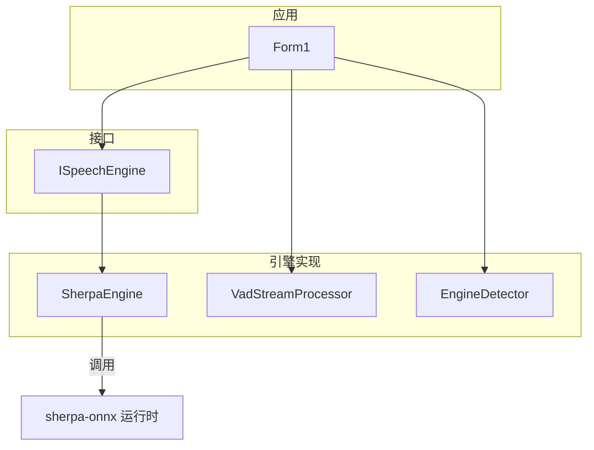
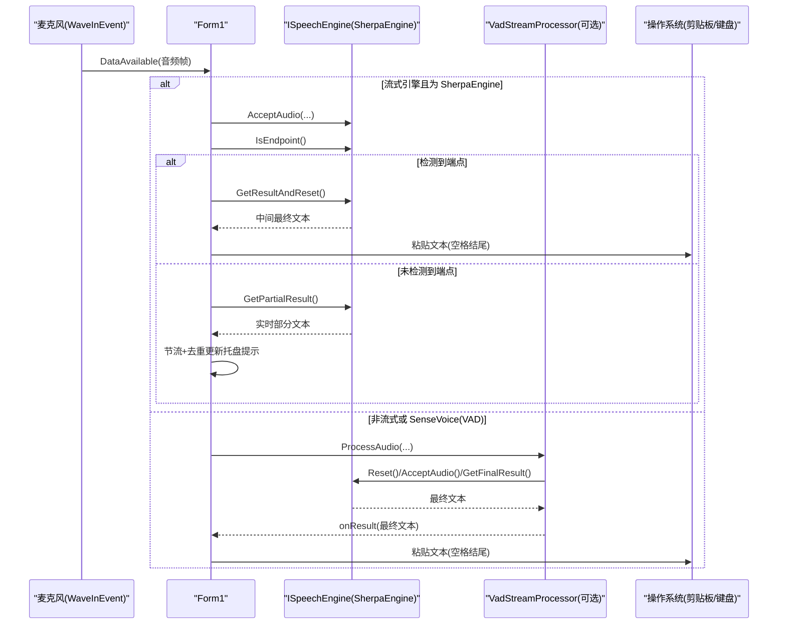
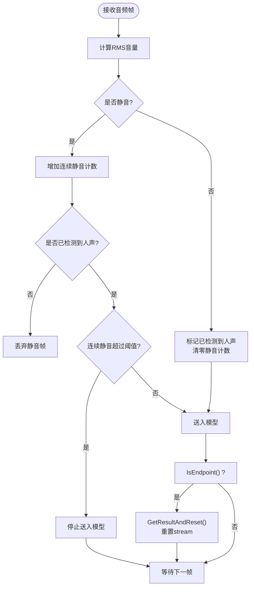
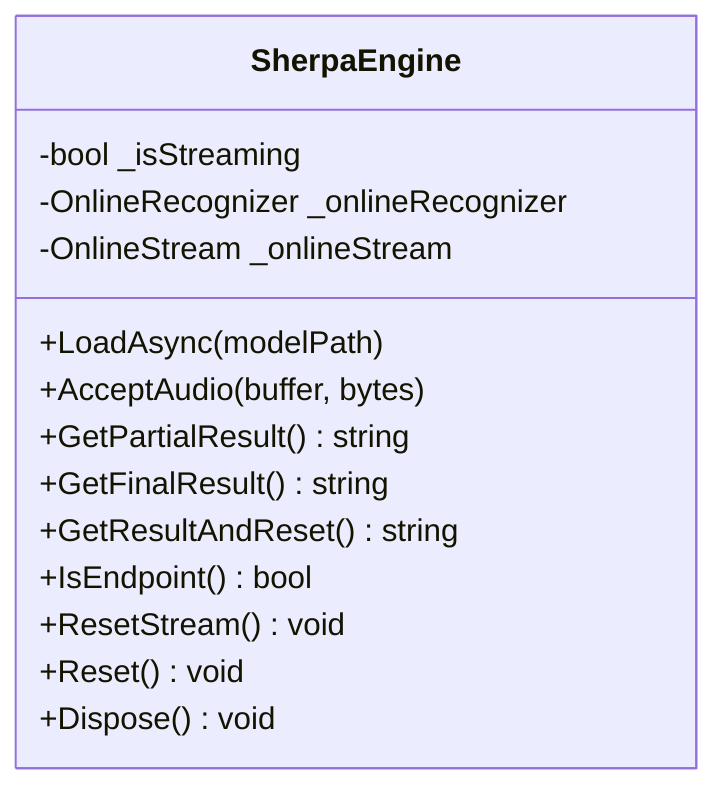
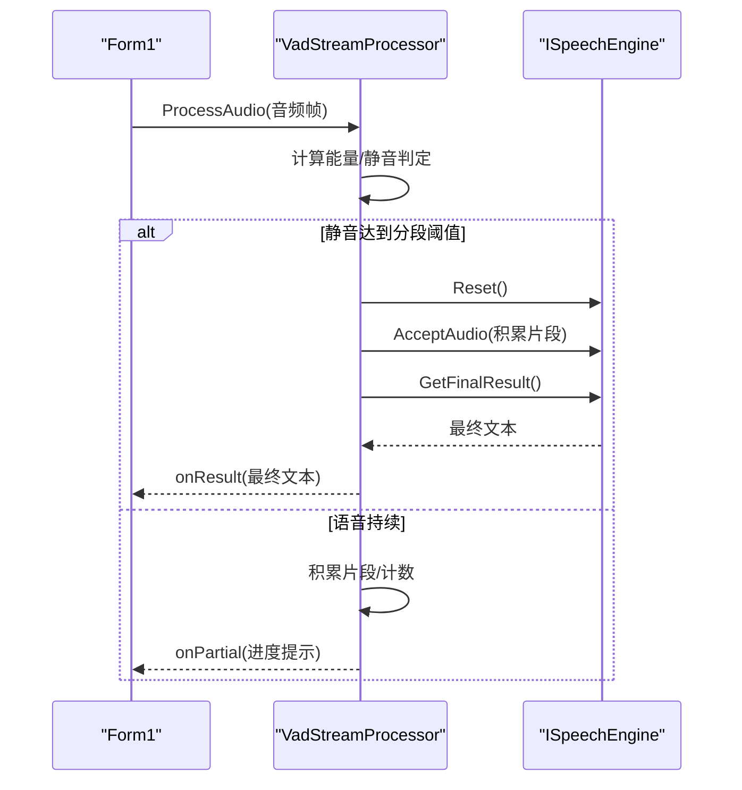
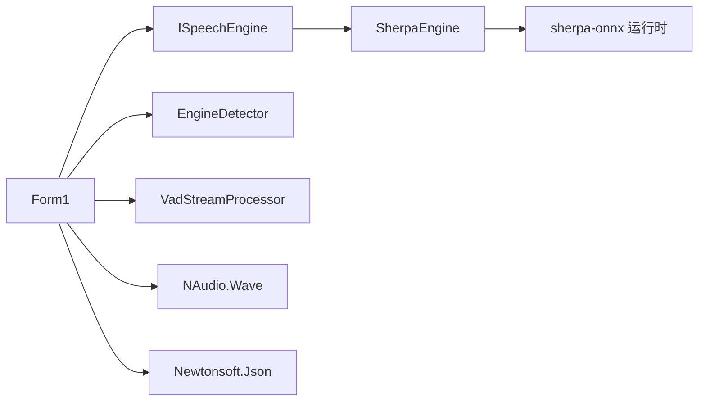

# 识别结果处理

<cite>
**本文引用的文件**   
- [SherpaEngine.cs](file://t9s2t/Engines/SherpaEngine.cs)
- [ISpeechEngine.cs](file://t9s2t/Engines/ISpeechEngine.cs)
- [VadStreamProcessor.cs](file://t9s2t/Engines/VadStreamProcessor.cs)
- [EngineDetector.cs](file://t9s2t/Engines/EngineDetector.cs)
- [Form1.cs](file://t9s2t/Form1.cs)
</cite>

## 目录
1. [简介](#简介)
2. [项目结构](#项目结构)
3. [核心组件](#核心组件)
4. [架构总览](#架构总览)
5. [详细组件分析](#详细组件分析)
6. [依赖关系分析](#依赖关系分析)
7. [性能考量](#性能考量)
8. [故障排查指南](#故障排查指南)
9. [结论](#结论)
10. [附录：使用示例与最佳实践](#附录使用示例与最佳实践)

## 简介
本技术文档聚焦于 SherpaEngine 的识别结果处理系统，围绕以下目标展开：
- 深入解释 GetPartialResult 与 GetFinalResult 的区别与适用场景（流式实时结果 vs 非流式最终结果）
- 阐述流式端点检测机制 IsEndpoint 的实现原理（静音检测、自动分句）
- 说明 GetResultAndReset 的使用场景（录音中基于端点的分句处理）
- 介绍识别结果的文本后处理流程（标点恢复 AddPunctuation、文本清洗）
- 梳理流式识别的状态管理（stream 创建、重置、生命周期）
- 提供具体代码示例路径，展示不同识别模式的使用方法、错误处理、异常捕获与调试输出

## 项目结构
本项目采用“引擎抽象 + 具体实现 + UI 编排”的分层组织方式：
- 接口层：定义统一的语音识别引擎能力
- 引擎实现层：封装 sherpa-onnx 的离线/流式识别、标点恢复、VAD 等能力
- 应用层：负责音频采集、UI 交互、键盘模拟输入、模型下载与加载

图表来源
- [ISpeechEngine.cs:1-35](file://t9s2t/Engines/ISpeechEngine.cs#L1-L35)
- [SherpaEngine.cs:1-608](file://t9s2t/Engines/SherpaEngine.cs#L1-L608)
- [VadStreamProcessor.cs:1-162](file://t9s2t/Engines/VadStreamProcessor.cs#L1-L162)
- [EngineDetector.cs:1-122](file://t9s2t/Engines/EngineDetector.cs#L1-L122)
- [Form1.cs:1-1318](file://t9s2t/Form1.cs#L1-L1318)

章节来源
- [ISpeechEngine.cs:1-35](file://t9s2t/Engines/ISpeechEngine.cs#L1-L35)
- [EngineDetector.cs:1-122](file://t9s2t/Engines/EngineDetector.cs#L1-L122)
- [Form1.cs:1-1318](file://t9s2t/Form1.cs#L1-L1318)

## 核心组件
- ISpeechEngine：统一抽象，定义加载、音频输入、部分/最终结果获取、重置等能力
- SherpaEngine：sherpa-onnx 的具体实现，支持 SenseVoice、离线 Paraformer、流式 Paraformer；内置静音阈值过滤、标点恢复、VAD 集成
- VadStreamProcessor：对非流式模型（如 SenseVoice）进行“伪流式”分段识别，通过能量阈值检测静音段落并触发识别
- EngineDetector：根据模型目录结构自动判断引擎类型并创建对应实例
- Form1：应用主窗体，负责音频采集、识别流程编排、UI 反馈与键盘模拟输入

章节来源
- [ISpeechEngine.cs:1-35](file://t9s2t/Engines/ISpeechEngine.cs#L1-L35)
- [SherpaEngine.cs:1-608](file://t9s2t/Engines/SherpaEngine.cs#L1-L608)
- [VadStreamProcessor.cs:1-162](file://t9s2t/Engines/VadStreamProcessor.cs#L1-L162)
- [EngineDetector.cs:1-122](file://t9s2t/Engines/EngineDetector.cs#L1-L122)
- [Form1.cs:1-1318](file://t9s2t/Form1.cs#L1-L1318)

## 架构总览
下图展示了从音频采集到识别结果输出的关键数据流与控制流。

图表来源
- [Form1.cs:1064-1111](file://t9s2t/Form1.cs#L1064-L1111)
- [Form1.cs:1228-1273](file://t9s2t/Form1.cs#L1228-L1273)
- [SherpaEngine.cs:388-509](file://t9s2t/Engines/SherpaEngine.cs#L388-L509)
- [VadStreamProcessor.cs:38-136](file://t9s2t/Engines/VadStreamProcessor.cs#L38-L136)

## 详细组件分析

### 流式与非流式结果获取：GetPartialResult 与 GetFinalResult
- GetPartialResult
  - 仅流式模式有效，内部会尝试解码就绪数据并返回当前临时文本
  - 适合边说边出字，用于 UI 实时反馈（托盘提示、状态栏等）
  - 非流式模式下直接返回空
- GetFinalResult
  - 流式模式：通知输入结束、循环解码剩余数据、获取最终文本、重置 stream、可选标点恢复
  - 非流式模式：将累积的整段音频一次性识别，再执行标点恢复与文本清洗
- 区别与使用场景
  - 流式实时：优先用 GetPartialResult 做低延迟反馈；在端点或停止时再用 GetFinalResult 收尾
  - 非流式：仅在录音结束时调用一次 GetFinalResult

章节来源
- [SherpaEngine.cs:388-415](file://t9s2t/Engines/SherpaEngine.cs#L388-L415)
- [SherpaEngine.cs:417-479](file://t9s2t/Engines/SherpaEngine.cs#L417-L479)
- [Form1.cs:1072-1111](file://t9s2t/Form1.cs#L1072-L1111)
- [Form1.cs:1241-1257](file://t9s2t/Form1.cs#L1241-L1257)

### 流式端点检测：IsEndpoint 与自动分句
- 端点参数配置
  - 启用端点检测，设置三类规则：长句后静音阈值、有结果后的静音阈值、最大语句长度强制切分
- 静音检测与缓冲策略
  - 计算 RMS 音量，低于阈值视为静音；在未检测到人声前丢弃静音片段，避免幻觉
  - 已检测到人声后，连续静音超过一定帧数才停止送入模型，减少误停
- 自动分句流程
  - 每帧音频进入时，若 IsEndpoint 为真，则调用 GetResultAndReset 获取当前最终结果并重置 stream，继续下一句

图表来源
- [SherpaEngine.cs:220-255](file://t9s2t/Engines/SherpaEngine.cs#L220-L255)
- [SherpaEngine.cs:351-384](file://t9s2t/Engines/SherpaEngine.cs#L351-L384)
- [SherpaEngine.cs:516-531](file://t9s2t/Engines/SherpaEngine.cs#L516-L531)
- [Form1.cs:1072-1111](file://t9s2t/Form1.cs#L1072-L1111)

章节来源
- [SherpaEngine.cs:220-255](file://t9s2t/Engines/SherpaEngine.cs#L220-L255)
- [SherpaEngine.cs:351-384](file://t9s2t/Engines/SherpaEngine.cs#L351-L384)
- [SherpaEngine.cs:516-531](file://t9s2t/Engines/SherpaEngine.cs#L516-L531)
- [Form1.cs:1072-1111](file://t9s2t/Form1.cs#L1072-L1111)

### 录音中端点分句：GetResultAndReset
- 与 GetFinalResult 的关键差异
  - 不调用 InputFinished，适用于录音仍在继续时的“中间最终结果”
  - 内部会循环解码所有就绪数据，然后重置 stream，以便继续后续音频
- 典型用法
  - 在流式模式下，当 IsEndpoint 为真时，调用 GetResultAndReset 获取当前句子文本并立即输出，随后继续录音

章节来源
- [SherpaEngine.cs:485-509](file://t9s2t/Engines/SherpaEngine.cs#L485-L509)
- [Form1.cs:1072-1111](file://t9s2t/Form1.cs#L1072-L1111)

### 文本后处理：标点恢复与文本清洗
- 标点恢复
  - 加载 punc.onnx 或 punc.int8.onnx 模型，失败则跳过
  - 在 GetFinalResult（流式/非流式）和离线识别完成后，若存在标点模型则调用 AddPunctuation
- 文本清洗
  - 对识别文本进行 Trim 去除首尾空白
  - 应用层在粘贴前追加空格，提升可读性

章节来源
- [SherpaEngine.cs:259-310](file://t9s2t/Engines/SherpaEngine.cs#L259-L310)
- [SherpaEngine.cs:417-479](file://t9s2t/Engines/SherpaEngine.cs#L417-L479)
- [Form1.cs:1028-1032](file://t9s2t/Form1.cs#L1028-L1032)

### 流式识别状态管理：stream 的创建、重置与生命周期
- 创建
  - 流式模式初始化时创建 OnlineRecognizer 与 OnlineStream
- 重置
  - 每次端点分句或一轮录音结束后，调用 Reset 清空状态，确保下一轮识别不受影响
- 生命周期
  - Dispose 释放 recognizer、stream、punctuation、vad 等资源

图表来源
- [SherpaEngine.cs:1-608](file://t9s2t/Engines/SherpaEngine.cs#L1-L608)

章节来源
- [SherpaEngine.cs:220-255](file://t9s2t/Engines/SherpaEngine.cs#L220-L255)
- [SherpaEngine.cs:525-543](file://t9s2t/Engines/SherpaEngine.cs#L525-L543)
- [SherpaEngine.cs:591-605](file://t9s2t/Engines/SherpaEngine.cs#L591-L605)

### 非流式模型的“伪流式”处理：VadStreamProcessor
- 设计目的
  - 对不支持原生流式的模型（如 SenseVoice），通过能量阈值检测静音段落，将语音切分为若干片段，逐段提交识别，从而模拟流式体验
- 核心逻辑
  - 计算平均振幅，低于阈值视为静音；达到静音帧阈值后提交上一段语音
  - 最少语音帧数过滤噪音；每隔若干帧发送 partial 回调用于 UI 反馈
- 与 SherpaEngine 的关系
  - 由应用层在检测到非流式但需要“伪流式”时选择 VadStreamProcessor 包裹引擎

图表来源
- [VadStreamProcessor.cs:38-136](file://t9s2t/Engines/VadStreamProcessor.cs#L38-L136)
- [Form1.cs:1100-1111](file://t9s2t/Form1.cs#L1100-L1111)

章节来源
- [VadStreamProcessor.cs:1-162](file://t9s2t/Engines/VadStreamProcessor.cs#L1-L162)
- [Form1.cs:1100-1111](file://t9s2t/Form1.cs#L1100-L1111)

## 依赖关系分析
- 接口与实现
  - Form1 通过 ISpeechEngine 抽象与 SherpaEngine 解耦
  - EngineDetector 根据模型目录结构决定创建 SherpaEngine(true/false)
- 外部依赖
  - sherpa-onnx 运行时（C API DLL）
  - NAudio.Wave 用于音频采集
  - Newtonsoft.Json 用于远程模型列表解析
- 可能的耦合点
  - 应用层对 SherpaEngine 的特判（如 SupportsStreaming 分支）
  - 标点与 VAD 模型的存在与否会影响行为

图表来源
- [Form1.cs:1-1318](file://t9s2t/Form1.cs#L1-L1318)
- [ISpeechEngine.cs:1-35](file://t9s2t/Engines/ISpeechEngine.cs#L1-L35)
- [SherpaEngine.cs:1-608](file://t9s2t/Engines/SherpaEngine.cs#L1-L608)
- [EngineDetector.cs:1-122](file://t9s2t/Engines/EngineDetector.cs#L1-L122)
- [VadStreamProcessor.cs:1-162](file://t9s2t/Engines/VadStreamProcessor.cs#L1-L162)

章节来源
- [EngineDetector.cs:1-122](file://t9s2t/Engines/EngineDetector.cs#L1-L122)
- [Form1.cs:1-1318](file://t9s2t/Form1.cs#L1-L1318)

## 性能考量
- 流式识别
  - 合理设置端点规则，避免过短的静音导致频繁分句，降低重复识别开销
  - 节流与去重：应用层对 partial 更新进行最小间隔与内容去重，减少 UI 刷新压力
- 非流式识别
  - 整段识别适合长音频，但需控制单次音频长度，避免内存占用过大
- 资源释放
  - 及时调用 Reset/Dispose，避免 stream 与模型对象长期驻留

[本节为通用指导，不直接分析具体文件]

## 故障排查指南
- 常见错误与定位
  - 流式 partial/final 识别失败：检查 IsReady/Decode 调用链与异常日志
  - 端点检测过于敏感或不触发：调整 Rule1/Rule2/Rule3 参数与静音阈值
  - 标点恢复失败：确认标点模型是否存在且可加载
  - 非流式无结果：检查音频缓冲区是否为空、采样率与特征维度是否正确
- 调试建议
  - 关注 Debug.WriteLine 输出，快速定位问题阶段
  - 在应用层打印引擎名称、是否流式、是否具备标点/VAD 能力

章节来源
- [SherpaEngine.cs:388-479](file://t9s2t/Engines/SherpaEngine.cs#L388-L479)
- [SherpaEngine.cs:259-310](file://t9s2t/Engines/SherpaEngine.cs#L259-L310)
- [Form1.cs:1064-1111](file://t9s2t/Form1.cs#L1064-L1111)

## 结论
SherpaEngine 提供了统一的流式与非流式识别能力，并通过端点检测与静音过滤实现自然的自动分句。结合标点恢复与文本清洗，可获得更高质量的输出。应用层通过节流、去重与健壮的错误处理，确保了良好的用户体验。对于非流式模型，VadStreamProcessor 以较低成本实现了“伪流式”体验。

[本节为总结，不直接分析具体文件]

## 附录：使用示例与最佳实践
以下为不同识别模式的端到端使用示例路径（不包含具体代码内容）：

- 流式识别（Paraformer 原生流式）
  - 开始录音：[Form1.cs:1146-1173](file://t9s2t/Form1.cs#L1146-L1173)
  - 音频回调处理与端点检测：[Form1.cs:1064-1111](file://t9s2t/Form1.cs#L1064-L1111)
  - 获取部分结果与节流去重：[Form1.cs:1086-1098](file://t9s2t/Form1.cs#L1086-L1098)
  - 获取最终结果并粘贴：[Form1.cs:1241-1257](file://t9s2t/Form1.cs#L1241-L1257)
  - 引擎方法参考：
    - GetPartialResult：[SherpaEngine.cs:388-415](file://t9s2t/Engines/SherpaEngine.cs#L388-L415)
    - GetFinalResult：[SherpaEngine.cs:417-479](file://t9s2t/Engines/SherpaEngine.cs#L417-L479)
    - GetResultAndReset：[SherpaEngine.cs:485-509](file://t9s2t/Engines/SherpaEngine.cs#L485-L509)
    - IsEndpoint：[SherpaEngine.cs:516-520](file://t9s2t/Engines/SherpaEngine.cs#L516-L520)

- 非流式识别（SenseVoice / Paraformer-large）
  - 音频累积与最终识别：[Form1.cs:1105-1111](file://t9s2t/Form1.cs#L1105-L1111)
  - 停止录音后识别：[Form1.cs:1251-1257](file://t9s2t/Form1.cs#L1251-L1257)
  - 引擎方法参考：
    - GetFinalResult（非流式分支）：[SherpaEngine.cs:454-479](file://t9s2t/Engines/SherpaEngine.cs#L454-L479)

- “伪流式”识别（SenseVoice + VAD）
  - 音频处理与分段识别：[VadStreamProcessor.cs:38-136](file://t9s2t/Engines/VadStreamProcessor.cs#L38-L136)
  - 应用层选择 VAD 处理器：[Form1.cs:1100-1111](file://t9s2t/Form1.cs#L1100-L1111)

- 文本后处理（标点恢复与清洗）
  - 标点模型加载与 AddPunctuation：[SherpaEngine.cs:259-310](file://t9s2t/Engines/SherpaEngine.cs#L259-L310)
  - 最终结果中的标点恢复与 Trim：[SherpaEngine.cs:417-479](file://t9s2t/Engines/SherpaEngine.cs#L417-L479)
  - 应用层粘贴前追加空格：[Form1.cs:1028-1032](file://t9s2t/Form1.cs#L1028-L1032)

- 错误处理与调试
  - 流式 partial/final 异常捕获与日志：[SherpaEngine.cs:388-479](file://t9s2t/Engines/SherpaEngine.cs#L388-L479)
  - 应用层异常回退方案（FallbackTypeText）：[Form1.cs:1279-1290](file://t9s2t/Form1.cs#L1279-L1290)

[本节为示例指引，不直接分析具体文件]