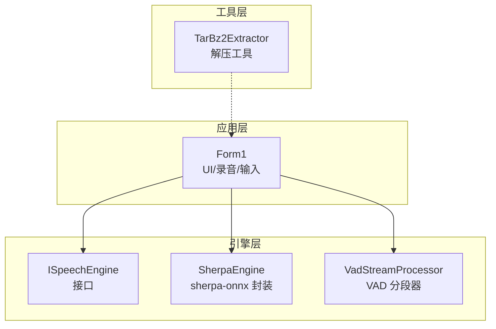
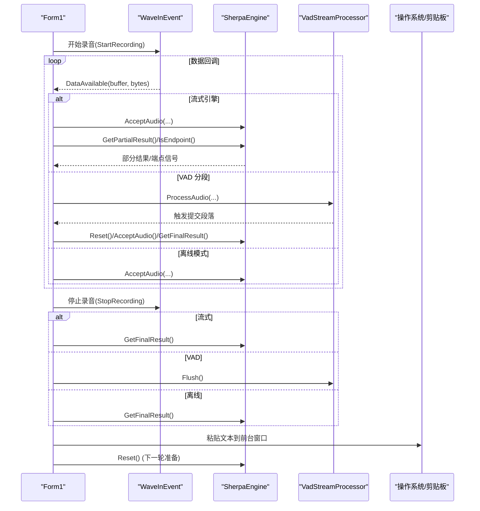
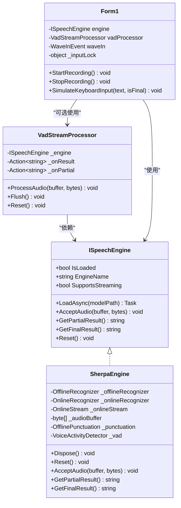

# 资源管理与生命周期

<cite>
**本文引用的文件**   
- [SherpaEngine.cs](file://t9s2t/Engines/SherpaEngine.cs)
- [ISpeechEngine.cs](file://t9s2t/Engines/ISpeechEngine.cs)
- [VadStreamProcessor.cs](file://t9s2t/Engines/VadStreamProcessor.cs)
- [Form1.cs](file://t9s2t/Form1.cs)
- [TarBz2Extractor.cs](file://t9s2t/Engines/TarBz2Extractor.cs)
</cite>

## 目录
1. [简介](#简介)
2. [项目结构](#项目结构)
3. [核心组件](#核心组件)
4. [架构总览](#架构总览)
5. [详细组件分析](#详细组件分析)
6. [依赖关系分析](#依赖关系分析)
7. [性能考量](#性能考量)
8. [故障排查指南](#故障排查指南)
9. [结论](#结论)
10. [附录：最佳实践与示例路径](#附录最佳实践与示例路径)

## 简介
本技术文档聚焦 SherpaEngine 的资源管理与对象生命周期控制，围绕以下目标展开：
- 深入解释 Dispose 方法的资源清理机制，包括原生对象（_onlineStream、_onlineRecognizer、_offlineRecognizer）和托管对象的释放顺序。
- 详细说明 Reset 方法的重置逻辑，包括状态变量清理与流对象的重新初始化。
- 阐述内存管理策略，特别是音频缓冲区的动态分配与及时释放。
- 说明线程安全考虑，包括多线程环境下的资源共享保护机制。
- 介绍资源泄漏防护措施，包括异常处理中的资源清理和资源监控。
- 提供具体代码示例路径，展示正确的资源使用模式，包括 using 语句的最佳实践与异常安全的资源管理策略。

## 项目结构
本项目采用分层与按功能组织相结合的结构：
- 引擎层：ISpeechEngine 接口定义统一能力；SherpaEngine 实现 sherpa-onnx 的多种识别模式；VadStreamProcessor 为非流式模型提供“类流式”体验。
- 应用层：Form1 负责 UI、录音设备、键盘钩子、输入模拟以及资源生命周期编排。
- 工具层：TarBz2Extractor 提供压缩文件解压能力，遵循 using 模式确保句柄及时释放。

图表来源
- [Form1.cs:144-235](file://t9s2t/Form1.cs#L144-L235)
- [ISpeechEngine.cs:1-35](file://t9s2t/Engines/ISpeechEngine.cs#L1-L35)
- [SherpaEngine.cs:14-56](file://t9s2t/Engines/SherpaEngine.cs#L14-L56)
- [VadStreamProcessor.cs:12-33](file://t9s2t/Engines/VadStreamProcessor.cs#L12-L33)
- [TarBz2Extractor.cs:17-30](file://t9s2t/Engines/TarBz2Extractor.cs#L17-L30)

章节来源
- [Form1.cs:144-235](file://t9s2t/Form1.cs#L144-L235)
- [ISpeechEngine.cs:1-35](file://t9s2t/Engines/ISpeechEngine.cs#L1-L35)
- [SherpaEngine.cs:14-56](file://t9s2t/Engines/SherpaEngine.cs#L14-L56)
- [VadStreamProcessor.cs:12-33](file://t9s2t/Engines/VadStreamProcessor.cs#L12-L33)
- [TarBz2Extractor.cs:17-30](file://t9s2t/Engines/TarBz2Extractor.cs#L17-L30)

## 核心组件
- ISpeechEngine：定义统一的语音识别能力，包含加载、接受音频、获取部分/最终结果、重置等。
- SherpaEngine：实现 sherpa-onnx 的离线与非流式、流式识别，并集成标点恢复与 VAD 模型加载。
- VadStreamProcessor：对非流式模型进行静音检测与分段，模拟流式输出。
- Form1：编排录音、识别、输入模拟，并对所有外部资源进行生命周期管理。

章节来源
- [ISpeechEngine.cs:1-35](file://t9s2t/Engines/ISpeechEngine.cs#L1-L35)
- [SherpaEngine.cs:14-56](file://t9s2t/Engines/SherpaEngine.cs#L14-L56)
- [VadStreamProcessor.cs:12-33](file://t9s2t/Engines/VadStreamProcessor.cs#L12-L33)
- [Form1.cs:144-235](file://t9s2t/Form1.cs#L144-L235)

## 架构总览
下图展示了从录音到识别再到输入的完整流程，以及关键资源在何时创建、使用和释放。

图表来源
- [Form1.cs:1146-1273](file://t9s2t/Form1.cs#L1146-L1273)
- [Form1.cs:1064-1111](file://t9s2t/Form1.cs#L1064-L1111)
- [SherpaEngine.cs:351-479](file://t9s2t/Engines/SherpaEngine.cs#L351-L479)
- [VadStreamProcessor.cs:38-136](file://t9s2t/Engines/VadStreamProcessor.cs#L38-L136)

## 详细组件分析

### SherpaEngine 资源与生命周期
- 关键原生对象
  - _onlineStream：流式输入流，需在使用后或结束时释放。
  - _onlineRecognizer：流式识别器，持有编码器/解码器状态。
  - _offlineRecognizer：离线识别器，用于整段音频识别。
  - _punctuation：标点恢复模型。
  - _vad：语音活动检测模型。
- 关键托管对象
  - _audioBuffer：非流式模式下累积的音频字节列表。
  - 状态变量：_isStreaming、_hasVoiceDetected、_silentChunkCount 等。

#### Dispose 方法与释放顺序
- 释放顺序设计原则：先释放细粒度资源，再释放容器型资源，最后清空引用避免悬挂指针。
- 当前实现顺序：
  1) _onlineStream.Dispose()
  2) _onlineRecognizer.Dispose()
  3) _offlineRecognizer.Dispose()
  4) _punctuation.Dispose()
  5) _vad.Dispose()
  6) 将上述字段置空，防止重复释放与悬垂引用。
- 该顺序符合“先子后父”的原则，确保在线流被识别器释放前已关闭，避免底层句柄冲突。

章节来源
- [SherpaEngine.cs:591-605](file://t9s2t/Engines/SherpaEngine.cs#L591-L605)

#### Reset 方法与重置逻辑
- 作用：为新一轮录音或识别做准备，清理中间状态但不销毁模型。
- 主要操作：
  - 清空 _audioBuffer，释放非流式模式的累积内存。
  - 重置静音检测相关状态：_hasVoiceDetected = false，_silentChunkCount = 0。
  - 若处于流式模式且存在 _onlineStream，调用 _onlineRecognizer.Reset(_onlineStream) 以清空内部缓存与上下文。
  - 调用 _vad?.Reset() 重置 VAD 内部状态。
- 注意：Reset 不改变 IsLoaded 状态，仅重置运行时状态。

章节来源
- [SherpaEngine.cs:533-543](file://t9s2t/Engines/SherpaEngine.cs#L533-L543)

#### 内存管理策略
- 音频缓冲区
  - 非流式模式：使用 List<byte> 累积音频片段，在 GetFinalResult 中一次性转换为 float[] 并识别，随后 Clear 释放内存。
  - 流式模式：通过 OnlineStream.AcceptWaveform 直接推送帧，避免大数组累积。
- 临时对象
  - BytesToFloat 每次生成新的 float[]，识别完成后由 GC 回收；建议在高吞吐场景下复用池化数组以降低分配压力。
- 异常路径清理
  - 在非流式识别失败时，显式 _audioBuffer.Clear() 防止内存泄漏。
  - 流式 partial/final 识别失败时返回 null 并记录日志，避免抛出未捕获异常导致上层崩溃。

章节来源
- [SherpaEngine.cs:351-479](file://t9s2t/Engines/SherpaEngine.cs#L351-L479)
- [SherpaEngine.cs:562-589](file://t9s2t/Engines/SherpaEngine.cs#L562-L589)

#### 线程安全考虑
- SherpaEngine 本身未引入锁，其对外暴露的方法假设由调用方保证串行访问。
- 实际并发保护由 Form1 通过 lock(_inputLock) 在录音回调与输入模拟处统一加锁，确保同一时刻只有一个线程访问引擎与系统输入。
- 建议在后续版本中为 SherpaEngine 增加内部同步原语（如 ReaderWriterLockSlim），以减少上层锁粒度。

章节来源
- [Form1.cs:1064-1111](file://t9s2t/Form1.cs#L1064-L1111)
- [Form1.cs:1146-1273](file://t9s2t/Form1.cs#L1146-L1273)

#### 资源泄漏防护
- 异常处理
  - 标点恢复与 VAD 加载失败时记录日志并降级运行，不影响主流程。
  - 识别过程中的异常均被 try/catch 包裹，返回空结果并记录错误信息。
- 资源监控
  - 通过 Debug.WriteLine 输出关键事件（模型加载、识别结果、错误），便于定位问题。
- 外部资源
  - TarBz2Extractor 使用 using 语句确保 FileStream、Archive 等资源在异常路径也能正确释放。

章节来源
- [SherpaEngine.cs:259-347](file://t9s2t/Engines/SherpaEngine.cs#L259-L347)
- [SherpaEngine.cs:295-310](file://t9s2t/Engines/SherpaEngine.cs#L295-L310)
- [TarBz2Extractor.cs:46-74](file://t9s2t/Engines/TarBz2Extractor.cs#L46-L74)

### VadStreamProcessor 资源与生命周期
- 职责：对非流式模型进行静音检测与分段，自动提交识别并回调结果。
- 资源管理：
  - 内部维护 _segmentBuffer 累积语音片段，在提交后 Clear 释放。
  - 提供 Reset 与 Flush 方法，分别用于中断与强制提交剩余数据。
- 与 SherpaEngine 协作：
  - 在 SubmitSegment 中调用 engine.Reset() -> AcceptAudio(...) -> GetFinalResult()，形成一次完整的识别周期。

章节来源
- [VadStreamProcessor.cs:38-136](file://t9s2t/Engines/VadStreamProcessor.cs#L38-L136)

### Form1 资源编排与线程安全
- 资源编排
  - 在 LoadEngine 中创建引擎实例并异步加载模型，必要时替换旧引擎并调用 Dispose。
  - 在 FormClosing 中释放 WaveInEvent、引擎、托盘图标与互斥量。
- 线程安全
  - 使用 lock(_inputLock) 保护录音回调、输入模拟与状态切换，避免竞态条件。
  - 使用 BeginInvoke 更新 UI，避免跨线程访问控件。
- 异常安全
  - 输入模拟失败时回退到逐字符输入方案，确保用户体验稳定。

章节来源
- [Form1.cs:645-721](file://t9s2t/Form1.cs#L645-L721)
- [Form1.cs:279-288](file://t9s2t/Form1.cs#L279-L288)
- [Form1.cs:1011-1051](file://t9s2t/Form1.cs#L1011-L1051)
- [Form1.cs:1146-1273](file://t9s2t/Form1.cs#L1146-L1273)

## 依赖关系分析
- SherpaEngine 依赖 SherpaOnnx 原生库（OnlineRecognizer、OfflineRecognizer、OnlineStream、OfflinePunctuation、VoiceActivityDetector）。
- VadStreamProcessor 依赖 ISpeechEngine 抽象，解耦具体引擎实现。
- Form1 依赖 NAudio.Wave 进行录音，依赖 Windows API 进行键盘钩子与输入模拟。
- TarBz2Extractor 依赖 SharpCompress 进行压缩文件解压。

图表来源
- [ISpeechEngine.cs:1-35](file://t9s2t/Engines/ISpeechEngine.cs#L1-L35)
- [SherpaEngine.cs:14-56](file://t9s2t/Engines/SherpaEngine.cs#L14-L56)
- [VadStreamProcessor.cs:12-33](file://t9s2t/Engines/VadStreamProcessor.cs#L12-L33)
- [Form1.cs:144-235](file://t9s2t/Form1.cs#L144-L235)

章节来源
- [ISpeechEngine.cs:1-35](file://t9s2t/Engines/ISpeechEngine.cs#L1-L35)
- [SherpaEngine.cs:14-56](file://t9s2t/Engines/SherpaEngine.cs#L14-L56)
- [VadStreamProcessor.cs:12-33](file://t9s2t/Engines/VadStreamProcessor.cs#L12-L33)
- [Form1.cs:144-235](file://t9s2t/Form1.cs#L144-L235)

## 性能考量
- 流式模式优先：对于实时性要求高的场景，使用 SherpaEngine 的流式识别路径，减少中间缓冲与复制开销。
- 音频转换优化：BytesToFloat 每帧分配新数组，可考虑对象池或 Span<T>/Memory<T> 降低 GC 压力。
- 节流与去重：Form1 中对 partial 结果进行节流与去重，避免频繁 UI 更新与输入抖动。
- 端点检测参数：流式端点阈值影响出字速度与吞字问题，需根据实际场景调优。

[本节为通用指导，无需特定文件来源]

## 故障排查指南
- 常见症状与定位
  - 无结果或结果不完整：检查 GetFinalResult 是否成功调用 InputFinished 并完成 Decode 循环。
  - 内存持续增长：确认非流式模式下 _audioBuffer 是否在异常路径也被 Clear。
  - 线程冲突导致的崩溃：确认录音回调与输入模拟均在 lock(_inputLock) 内执行。
- 日志与调试
  - 关注 Debug.WriteLine 输出的模型加载、识别结果与错误信息。
  - 在异常分支中查看具体异常消息，快速定位问题源。

章节来源
- [SherpaEngine.cs:417-479](file://t9s2t/Engines/SherpaEngine.cs#L417-L479)
- [Form1.cs:1011-1051](file://t9s2t/Form1.cs#L1011-L1051)

## 结论
SherpaEngine 的资源管理与生命周期控制遵循“先子后父、尽早释放、异常安全”的原则：
- Dispose 明确定义了原生与托管资源的释放顺序，避免句柄冲突与悬挂引用。
- Reset 专注于运行时状态清理，为下一次识别做好准备。
- 内存管理上，流式模式避免大缓冲，非流式模式在识别后及时释放。
- 线程安全由 Form1 统一加锁保障，降低并发风险。
- 异常处理与日志输出提升了系统的健壮性与可观测性。

[本节为总结，无需特定文件来源]

## 附录：最佳实践与示例路径
- using 语句的最佳实践
  - 在 TarBz2Extractor 中使用 using 管理 FileStream、Archive 等资源，确保异常路径也能释放。
  - 参考路径：[TarBz2Extractor.cs:46-74](file://t9s2t/Engines/TarBz2Extractor.cs#L46-L74)
- 异常安全的资源管理策略
  - 在识别过程中使用 try/catch 包裹，失败时返回空结果并记录日志，避免上层崩溃。
  - 参考路径：[SherpaEngine.cs:388-479](file://t9s2t/Engines/SherpaEngine.cs#L388-L479)
- 正确的资源使用模式
  - 在应用层使用 using 或显式 Dispose 管理引擎实例，避免进程退出时的资源泄漏。
  - 参考路径：[Form1.cs:645-721](file://t9s2t/Form1.cs#L645-L721)、[Form1.cs:279-288](file://t9s2t/Form1.cs#L279-L288)
- 线程安全的关键区域
  - 录音回调与输入模拟均需加锁，确保原子性。
  - 参考路径：[Form1.cs:1064-1111](file://t9s2t/Form1.cs#L1064-L1111)、[Form1.cs:1146-1273](file://t9s2t/Form1.cs#L1146-L1273)