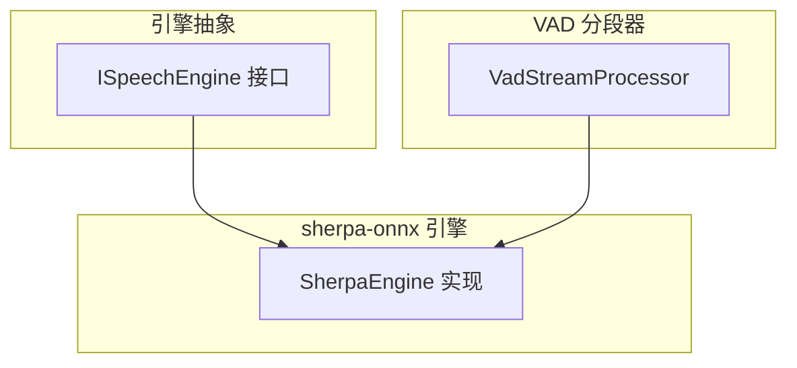
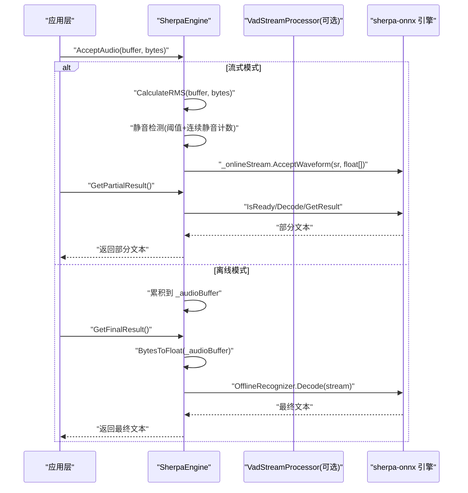
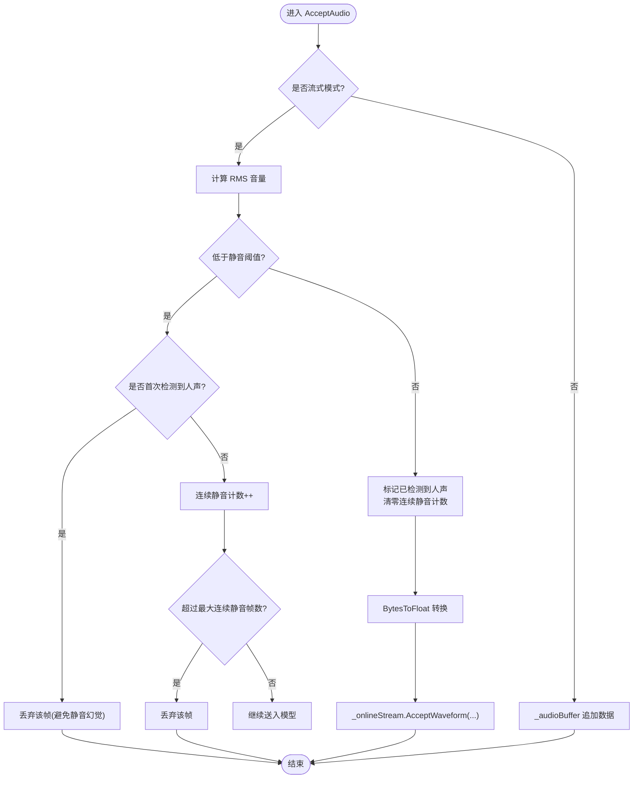
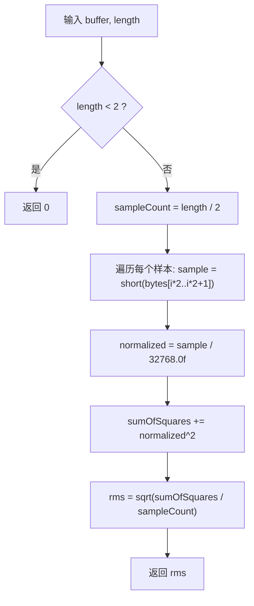
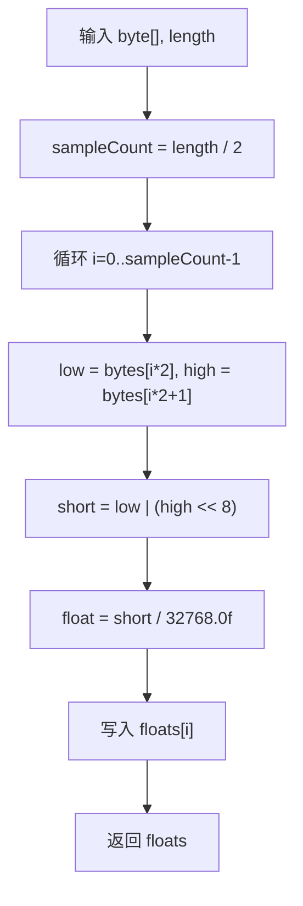
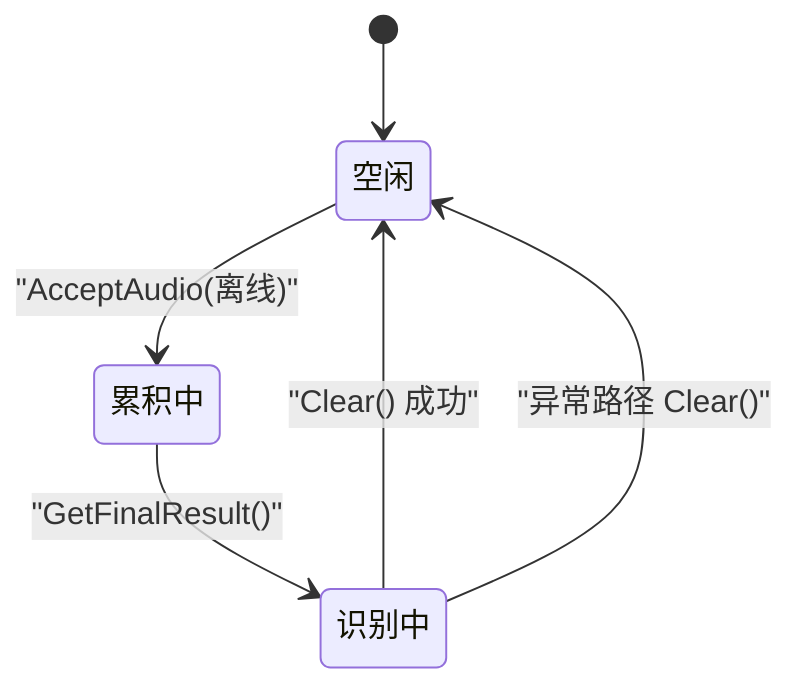
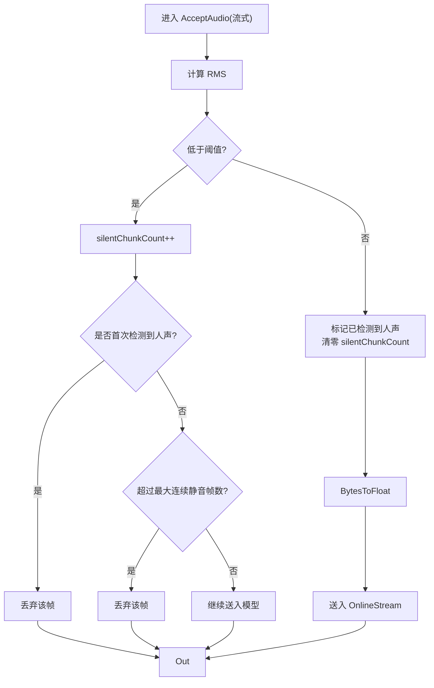
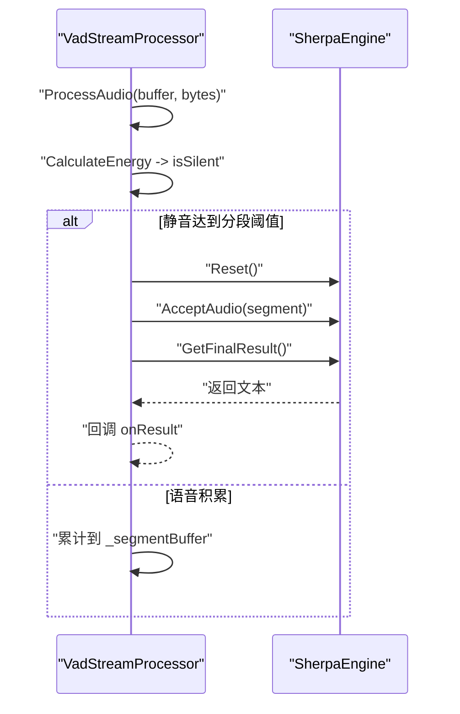
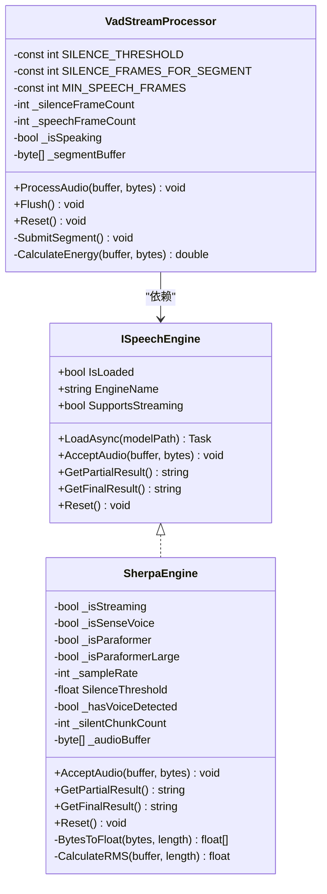

# 音频数据处理

<cite>
**本文引用的文件**   
- [SherpaEngine.cs](file://t9s2t/Engines/SherpaEngine.cs)
- [VadStreamProcessor.cs](file://t9s2t/Engines/VadStreamProcessor.cs)
- [ISpeechEngine.cs](file://t9s2t/Engines/ISpeechEngine.cs)
</cite>

## 目录
1. [简介](#简介)
2. [项目结构](#项目结构)
3. [核心组件](#核心组件)
4. [架构总览](#架构总览)
5. [详细组件分析](#详细组件分析)
6. [依赖关系分析](#依赖关系分析)
7. [性能与内存优化](#性能与内存优化)
8. [故障排查指南](#故障排查指南)
9. [结论](#结论)
10. [附录：处理流程示例路径](#附录处理流程示例路径)

## 简介
本技术文档聚焦 SherpaEngine 的音频数据处理系统，围绕以下目标展开：
- AcceptAudio 方法的双模式处理逻辑（流式与离线）
- RMS 音量计算算法 CalculateRMS 的实现原理、静音阈值与语音活动判断
- 字节数组到浮点数组转换 BytesToFloat 的采样格式与归一化
- 音频缓冲区 _audioBuffer 的内存管理与清理策略
- 静音检测算法：连续静音帧计数与语音开始/结束判定
- 提供具体代码片段路径，展示完整处理流程，并给出性能优化与内存管理最佳实践

## 项目结构
本项目采用“引擎抽象 + 具体实现”的分层组织方式。核心音频处理逻辑位于 Engines 目录下：
- ISpeechEngine：定义统一的语音识别引擎接口
- SherpaEngine：基于 sherpa-onnx 的具体实现，支持 SenseVoice、Paraformer（含 large）、流式与非流式两种模式
- VadStreamProcessor：用于将非流式模型模拟为“类流式”体验的 VAD 分段处理器

图表来源
- [ISpeechEngine.cs:1-35](file://t9s2t/Engines/ISpeechEngine.cs#L1-L35)
- [SherpaEngine.cs:1-608](file://t9s2t/Engines/SherpaEngine.cs#L1-L608)
- [VadStreamProcessor.cs:1-162](file://t9s2t/Engines/VadStreamProcessor.cs#L1-L162)

章节来源
- [ISpeechEngine.cs:1-35](file://t9s2t/Engines/ISpeechEngine.cs#L1-L35)
- [SherpaEngine.cs:1-608](file://t9s2t/Engines/SherpaEngine.cs#L1-L608)
- [VadStreamProcessor.cs:1-162](file://t9s2t/Engines/VadStreamProcessor.cs#L1-L162)

## 核心组件
- ISpeechEngine：统一暴露加载、输入、结果获取与重置等能力，屏蔽底层引擎差异
- SherpaEngine：封装 sherpa-onnx 的在线/离线识别器、标点恢复与可选 VAD 模型；内部维护静音检测状态与离线缓冲
- VadStreamProcessor：对非流式模型进行“伪流式”处理，按静音段落切分并提交识别

章节来源
- [ISpeechEngine.cs:1-35](file://t9s2t/Engines/ISpeechEngine.cs#L1-L35)
- [SherpaEngine.cs:1-608](file://t9s2t/Engines/SherpaEngine.cs#L1-L608)
- [VadStreamProcessor.cs:1-162](file://t9s2t/Engines/VadStreamProcessor.cs#L1-L162)

## 架构总览
下图展示了音频数据从采集到识别的关键路径，以及双模式分支与静音检测的作用点。

图表来源
- [SherpaEngine.cs:351-479](file://t9s2t/Engines/SherpaEngine.cs#L351-L479)
- [SherpaEngine.cs:562-589](file://t9s2t/Engines/SherpaEngine.cs#L562-L589)

## 详细组件分析

### AcceptAudio 双模式处理逻辑
- 流式模式
  - 先计算当前帧的 RMS 音量，结合 SilenceThreshold 与连续静音计数控制是否送入模型
  - 若尚未检测到过人声且处于静音，直接丢弃该帧以避免“静音幻觉”
  - 已检测到人声后，允许一定长度的尾随静音（约 1.5 秒）后再停止送入，避免长句中途截断
  - 通过 BytesToFloat 转换为浮点样本后，写入 OnlineStream
- 离线模式
  - 将每段音频追加到 _audioBuffer，等待 GetFinalResult 时一次性识别
  - 识别完成后清空缓冲，释放内存

图表来源
- [SherpaEngine.cs:351-384](file://t9s2t/Engines/SherpaEngine.cs#L351-L384)
- [SherpaEngine.cs:357-372](file://t9s2t/Engines/SherpaEngine.cs#L357-L372)

章节来源
- [SherpaEngine.cs:351-384](file://t9s2t/Engines/SherpaEngine.cs#L351-L384)

### RMS 音量计算与静音检测
- CalculateRMS
  - 将每帧 PCM 样本解析为 short，归一化为 [-1, 1] 范围
  - 计算平方和均值再开方得到 RMS，输出 0~1 之间的能量指标
- 静音阈值与语音活动判断
  - SilenceThreshold = 0.01f，低于此值视为静音
  - _hasVoiceDetected 记录是否曾检测到人声，避免在首段静音阶段误判
  - _silentChunkCount 统计连续静音帧数，超过阈值（约 25 帧，对应 ~1.5 秒）则停止送入模型，起到“尾随静音”作用

图表来源
- [SherpaEngine.cs:577-589](file://t9s2t/Engines/SherpaEngine.cs#L577-L589)

章节来源
- [SherpaEngine.cs:577-589](file://t9s2t/Engines/SherpaEngine.cs#L577-L589)
- [SherpaEngine.cs:29-33](file://t9s2t/Engines/SherpaEngine.cs#L29-L33)
- [SherpaEngine.cs:357-372](file://t9s2t/Engines/SherpaEngine.cs#L357-L372)

### 字节数组到浮点数组转换（BytesToFloat）
- 采样格式：假设输入为 16-bit PCM（Little-Endian），每两个字节构成一个样本
- 转换步骤：
  - 读取低字节和高字节，组合成 short
  - 除以 32768.0f 归一化到 [-1, 1] 区间
- 用途：供 OnlineStream/OfflineStream 接受波形数据

图表来源
- [SherpaEngine.cs:562-572](file://t9s2t/Engines/SherpaEngine.cs#L562-L572)

章节来源
- [SherpaEngine.cs:562-572](file://t9s2t/Engines/SherpaEngine.cs#L562-L572)

### 音频缓冲区管理机制（_audioBuffer）
- 职责：在非流式模式下累积整段音频，直到调用 GetFinalResult 触发识别
- 生命周期与清理：
  - 成功识别后调用 Clear 释放内存
  - 异常路径也确保 Clear，防止泄漏
  - Reset 会清空缓冲，保证新一轮录音前状态干净

图表来源
- [SherpaEngine.cs:377-384](file://t9s2t/Engines/SherpaEngine.cs#L377-L384)
- [SherpaEngine.cs:453-478](file://t9s2t/Engines/SherpaEngine.cs#L453-L478)
- [SherpaEngine.cs:534-543](file://t9s2t/Engines/SherpaEngine.cs#L534-L543)

章节来源
- [SherpaEngine.cs:377-384](file://t9s2t/Engines/SherpaEngine.cs#L377-L384)
- [SherpaEngine.cs:453-478](file://t9s2t/Engines/SherpaEngine.cs#L453-L478)
- [SherpaEngine.cs:534-543](file://t9s2t/Engines/SherpaEngine.cs#L534-L543)

### 静音检测算法（连续静音帧计数与起止判定）
- 起始判定：当 rms < SilenceThreshold 且 _hasVoiceDetected == false 时，直接丢弃该帧，避免在初始阶段把环境噪声当作语音
- 持续判定：一旦检测到非静音，设置 _hasVoiceDetected = true 并清零 _silentChunkCount
- 结束判定：在已检测到人声的前提下，若连续静音帧数超过阈值（约 25 帧），则停止送入模型，达到“尾随静音”效果
- Reset 时重置所有相关状态，确保多轮使用一致性

图表来源
- [SherpaEngine.cs:357-372](file://t9s2t/Engines/SherpaEngine.cs#L357-L372)
- [SherpaEngine.cs:534-543](file://t9s2t/Engines/SherpaEngine.cs#L534-L543)

章节来源
- [SherpaEngine.cs:357-372](file://t9s2t/Engines/SherpaEngine.cs#L357-L372)
- [SherpaEngine.cs:534-543](file://t9s2t/Engines/SherpaEngine.cs#L534-L543)

### 非流式模型的“伪流式”处理（VadStreamProcessor）
- 目的：在不改变底层非流式模型的前提下，通过静音检测将长音频切分为若干语音片段，逐段提交识别，从而获得近似流式的交互体验
- 关键参数：
  - SILENCE_THRESHOLD：平均振幅阈值，用于区分静音与语音
  - SILENCE_FRAMES_FOR_SEGMENT：连续静音帧数阈值，达到后认为一段语音结束
  - MIN_SPEECH_FRAMES：最少语音帧数，过滤短促噪音
- 处理流程：
  - 计算当前帧能量，更新说话/静音状态与计数
  - 满足条件时提交片段，调用引擎的 AcceptAudio 与 GetFinalResult
  - 提供 Flush 强制提交剩余内容，Reset 清理状态

图表来源
- [VadStreamProcessor.cs:38-86](file://t9s2t/Engines/VadStreamProcessor.cs#L38-L86)
- [VadStreamProcessor.cs:114-136](file://t9s2t/Engines/VadStreamProcessor.cs#L114-L136)

章节来源
- [VadStreamProcessor.cs:18-26](file://t9s2t/Engines/VadStreamProcessor.cs#L18-L26)
- [VadStreamProcessor.cs:38-86](file://t9s2t/Engines/VadStreamProcessor.cs#L38-L86)
- [VadStreamProcessor.cs:114-136](file://t9s2t/Engines/VadStreamProcessor.cs#L114-L136)

## 依赖关系分析
- ISpeechEngine 定义了统一入口，SherpaEngine 作为具体实现
- VadStreamProcessor 依赖 ISpeechEngine，以非流式模型实现“伪流式”
- SherpaEngine 内部依赖 sherpa-onnx 的 Online/Offline 识别器、可选标点与 VAD 模型

图表来源
- [ISpeechEngine.cs:1-35](file://t9s2t/Engines/ISpeechEngine.cs#L1-L35)
- [SherpaEngine.cs:1-608](file://t9s2t/Engines/SherpaEngine.cs#L1-L608)
- [VadStreamProcessor.cs:1-162](file://t9s2t/Engines/VadStreamProcessor.cs#L1-L162)

章节来源
- [ISpeechEngine.cs:1-35](file://t9s2t/Engines/ISpeechEngine.cs#L1-L35)
- [SherpaEngine.cs:1-608](file://t9s2t/Engines/SherpaEngine.cs#L1-L608)
- [VadStreamProcessor.cs:1-162](file://t9s2t/Engines/VadStreamProcessor.cs#L1-L162)

## 性能与内存优化
- 减少不必要的拷贝
  - 在流式模式下，尽量复用或池化 float[] 缓冲，避免频繁分配
  - 在离线模式下，_audioBuffer 增长可能引发多次扩容，可考虑预分配容量或使用固定大小环形缓冲
- 批量处理与批量化解码
  - 流式模式下合并相邻小帧，降低 Decode 调用频率
  - 合理设置端点规则与尾随静音阈值，平衡延迟与吞字问题
- 数值计算优化
  - RMS 计算中的除法与开方可在必要时使用查表或近似方法（需权衡精度）
  - 注意整数溢出风险，累加平方和时使用更高精度类型
- 资源释放
  - Dispose 中确保所有原生对象被释放，避免长期运行导致内存泄漏
  - Reset 时及时清空 _audioBuffer 与静音状态，避免跨会话污染

[本节为通用指导，不直接分析具体文件]

## 故障排查指南
- 无结果或结果为空
  - 检查 AcceptAudio 是否正确调用，确认传入的 bytes 长度与采样率一致
  - 离线模式下确认 _audioBuffer 有数据且 GetFinalResult 被调用
- 流式模式出现“静音幻觉”
  - 调整 SilenceThreshold 或增加最小语音帧数要求
  - 确认 _hasVoiceDetected 逻辑未被意外重置
- 长句被过早截断
  - 增大尾随静音阈值（如 _silentChunkCount 上限）
  - 调整 sherpa-onnx 端点规则（Rule1MinTrailingSilence、Rule2MinTrailingSilence）
- 内存占用持续增长
  - 检查 _audioBuffer 是否在异常路径下被 Clear
  - 确认 Dispose 是否被调用，原生对象是否释放

章节来源
- [SherpaEngine.cs:453-478](file://t9s2t/Engines/SherpaEngine.cs#L453-L478)
- [SherpaEngine.cs:591-605](file://t9s2t/Engines/SherpaEngine.cs#L591-L605)

## 结论
SherpaEngine 通过双模式设计兼顾了实时性与易用性：流式模式适合边说边出字场景，离线模式适合整段音频识别。其内置的 RMS 静音检测与连续静音计数有效抑制了环境噪声与误触发，配合 _audioBuffer 的清晰生命周期管理，保证了稳定性与可维护性。对于需要“伪流式”的非流式模型，VadStreamProcessor 提供了简洁可靠的分段方案。

[本节为总结性内容，不直接分析具体文件]

## 附录：处理流程示例路径
- 流式模式主流程
  - 输入与静音判断：[AcceptAudio:351-384](file://t9s2t/Engines/SherpaEngine.cs#L351-L384)
  - 部分结果获取：[GetPartialResult:388-415](file://t9s2t/Engines/SherpaEngine.cs#L388-L415)
  - 最终结果与重置：[GetFinalResult:417-479](file://t9s2t/Engines/SherpaEngine.cs#L417-L479)
- 离线模式主流程
  - 缓冲累积：[AcceptAudio(离线分支):377-384](file://t9s2t/Engines/SherpaEngine.cs#L377-L384)
  - 识别与清理：[GetFinalResult(离线分支):453-478](file://t9s2t/Engines/SherpaEngine.cs#L453-L478)
- 工具方法
  - 字节转浮点：[BytesToFloat:562-572](file://t9s2t/Engines/SherpaEngine.cs#L562-L572)
  - RMS 计算：[CalculateRMS:577-589](file://t9s2t/Engines/SherpaEngine.cs#L577-L589)
- 静音检测与状态重置
  - 静音阈值与状态变量：[常量与字段:29-33](file://t9s2t/Engines/SherpaEngine.cs#L29-L33)
  - 静音判定与计数：[静音分支:357-372](file://t9s2t/Engines/SherpaEngine.cs#L357-L372)
  - 重置状态：[Reset:534-543](file://t9s2t/Engines/SherpaEngine.cs#L534-L543)
- 非流式“伪流式”处理
  - 分段与提交：[ProcessAudio:38-86](file://t9s2t/Engines/VadStreamProcessor.cs#L38-L86)
  - 提交识别：[SubmitSegment:114-136](file://t9s2t/Engines/VadStreamProcessor.cs#L114-L136)
  - 能量计算：[CalculateEnergy:141-152](file://t9s2t/Engines/VadStreamProcessor.cs#L141-L152)