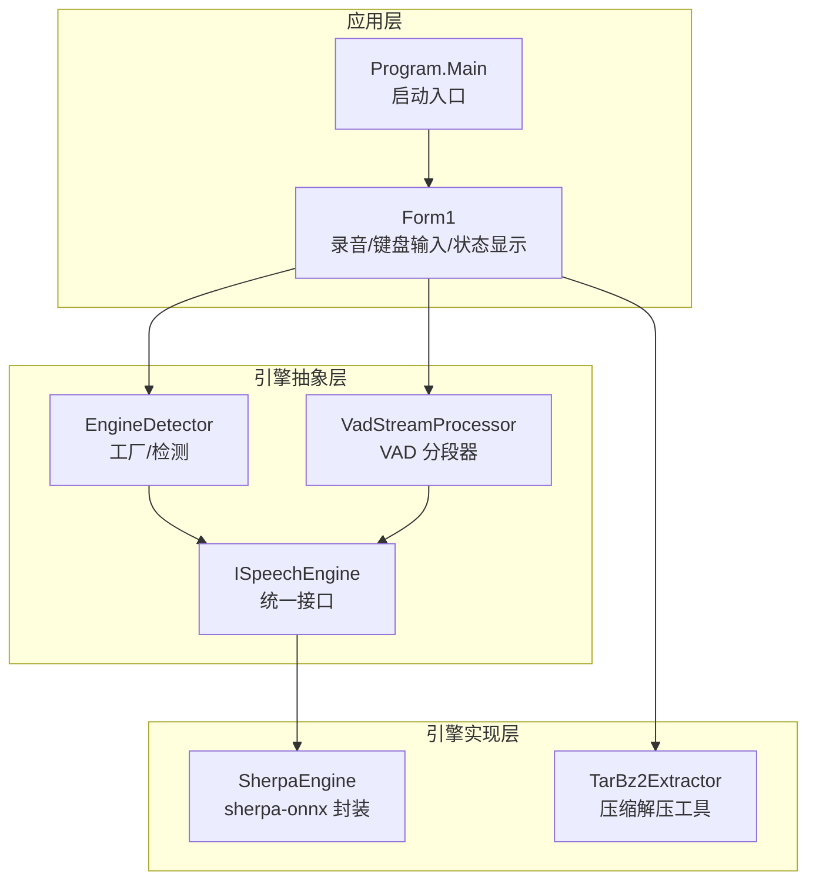
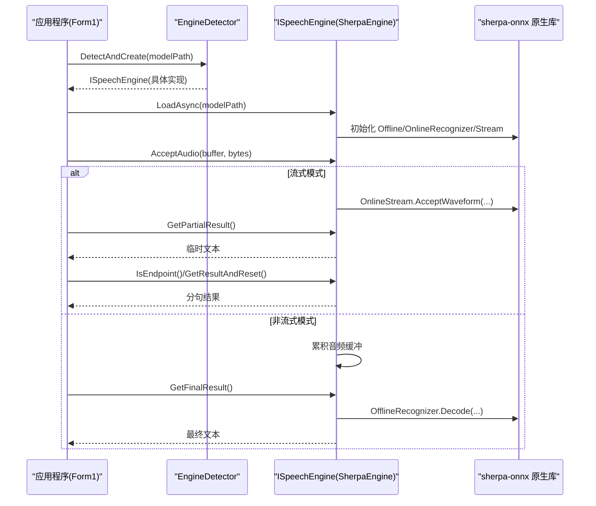
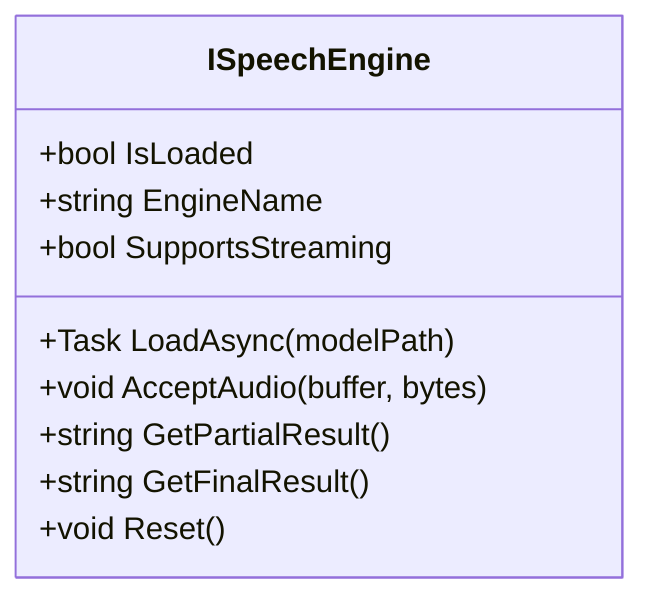
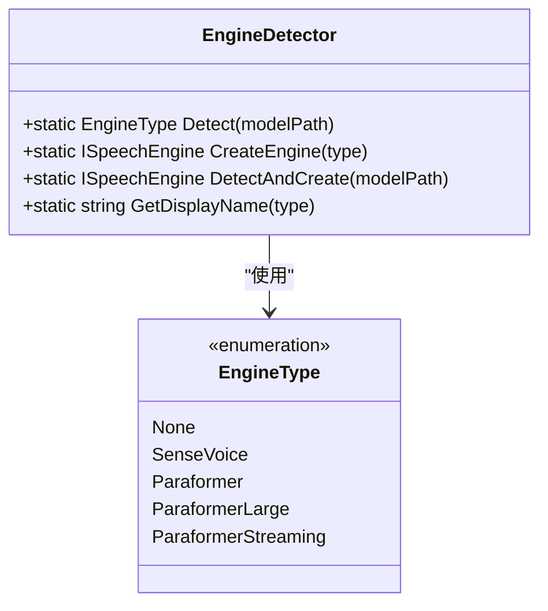
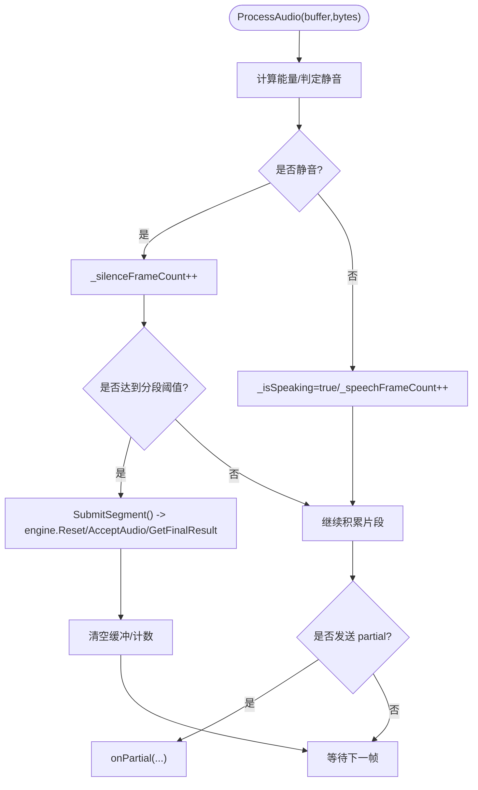
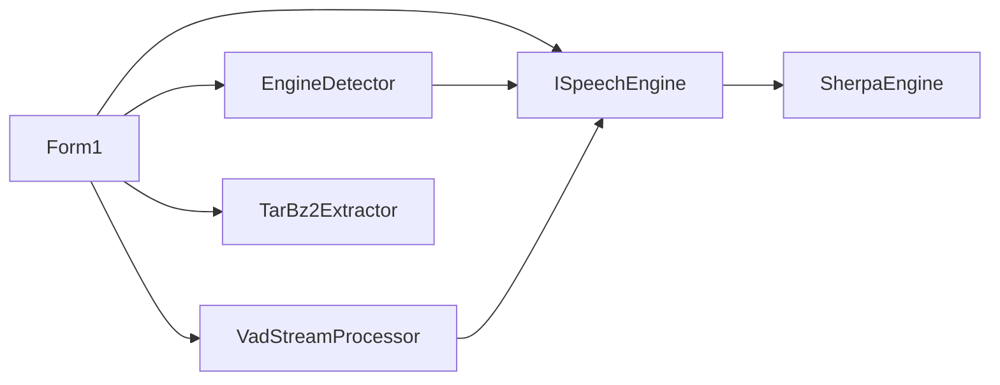

# 语音识别引擎架构

<cite>
**本文引用的文件**   
- [ISpeechEngine.cs](file://t9s2t/Engines/ISpeechEngine.cs)
- [SherpaEngine.cs](file://t9s2t/Engines/SherpaEngine.cs)
- [EngineDetector.cs](file://t9s2t/Engines/EngineDetector.cs)
- [VadStreamProcessor.cs](file://t9s2t/Engines/VadStreamProcessor.cs)
- [TarBz2Extractor.cs](file://t9s2t/Engines/TarBz2Extractor.cs)
- [Form1.cs](file://t9s2t/Form1.cs)
- [Program.cs](file://t9s2t/Program.cs)
</cite>

## 目录
1. [简介](#简介)
2. [项目结构](#项目结构)
3. [核心组件](#核心组件)
4. [架构总览](#架构总览)
5. [详细组件分析](#详细组件分析)
6. [依赖关系分析](#依赖关系分析)
7. [性能考量](#性能考量)
8. [故障排查指南](#故障排查指南)
9. [结论](#结论)
10. [附录：扩展新引擎最佳实践](#附录扩展新引擎最佳实践)

## 简介
本技术文档围绕 t9s2t 的语音识别引擎架构展开，重点阐述以下方面：
- ISpeechEngine 接口的设计理念与抽象层次（统一方法、生命周期管理、错误处理）
- SherpaEngine 对 sherpa-onnx 原生库的集成方式、模型加载流程、音频格式转换与结果处理
- EngineDetector 工厂模式实现（引擎类型检测算法、多引擎支持策略、实例创建逻辑）
- 流式与非流式识别的差异，以及 VadStreamProcessor 在模拟流式识别中的作用
- 如何扩展新的语音识别引擎（接口要求与最佳实践）

## 项目结构
本项目采用“引擎抽象 + 具体实现 + 工厂检测”的分层组织方式。核心代码位于 Engines 目录，UI 与录音控制位于 Form1.cs，程序入口为 Program.cs。



图表来源
- [Form1.cs:640-720](file://t9s2t/Form1.cs#L640-L720)
- [EngineDetector.cs:22-122](file://t9s2t/Engines/EngineDetector.cs#L22-L122)
- [ISpeechEngine.cs:1-35](file://t9s2t/Engines/ISpeechEngine.cs#L1-L35)
- [SherpaEngine.cs:1-120](file://t9s2t/Engines/SherpaEngine.cs#L1-L120)
- [VadStreamProcessor.cs:1-60](file://t9s2t/Engines/VadStreamProcessor.cs#L1-L60)
- [TarBz2Extractor.cs:1-40](file://t9s2t/Engines/TarBz2Extractor.cs#L1-L40)
- [Program.cs:1-27](file://t9s2t/Program.cs#L1-L27)

章节来源
- [Program.cs:1-27](file://t9s2t/Program.cs#L1-L27)
- [Form1.cs:640-720](file://t9s2t/Form1.cs#L640-L720)

## 核心组件
- ISpeechEngine：定义统一的引擎能力边界，包括是否已加载、引擎名称、是否支持流式、异步加载、接受音频、获取部分/最终结果、重置等。
- SherpaEngine：基于 sherpa-onnx 的具体实现，支持 SenseVoice、Paraformer（离线）、Paraformer-large（离线）、Paraformer（流式），并可选加载标点恢复与 VAD 模型。
- EngineDetector：根据模型目录结构自动判断引擎类型并创建对应引擎实例，提供一步到位的检测+创建方法。
- VadStreamProcessor：通过静音检测将非流式模型（如 SenseVoice）包装成“类流式”体验，按静音段落提交识别并回调结果。
- TarBz2Extractor：用于解压模型压缩包（tar.bz2/tar.gz/zip），无需外部工具。

章节来源
- [ISpeechEngine.cs:1-35](file://t9s2t/Engines/ISpeechEngine.cs#L1-L35)
- [SherpaEngine.cs:1-120](file://t9s2t/Engines/SherpaEngine.cs#L1-L120)
- [EngineDetector.cs:1-122](file://t9s2t/Engines/EngineDetector.cs#L1-L122)
- [VadStreamProcessor.cs:1-162](file://t9s2t/Engines/VadStreamProcessor.cs#L1-L162)
- [TarBz2Extractor.cs:1-143](file://t9s2t/Engines/TarBz2Extractor.cs#L1-L143)

## 架构总览
整体架构遵循“接口抽象 + 工厂选择 + 具体实现”的模式，UI 层仅依赖 ISpeechEngine 接口，屏蔽底层差异；EngineDetector 负责根据模型目录结构推断引擎类型并返回合适的 ISpeechEngine 实例；SherpaEngine 内部再根据模型特征选择具体的 sherpa-onnx 配置路径。



图表来源
- [Form1.cs:640-720](file://t9s2t/Form1.cs#L640-L720)
- [EngineDetector.cs:80-104](file://t9s2t/Engines/EngineDetector.cs#L80-L104)
- [SherpaEngine.cs:57-120](file://t9s2t/Engines/SherpaEngine.cs#L57-L120)
- [SherpaEngine.cs:350-479](file://t9s2t/Engines/SherpaEngine.cs#L350-L479)

## 详细组件分析

### ISpeechEngine 接口设计
- 统一方法定义：LoadAsync、AcceptAudio、GetPartialResult、GetFinalResult、Reset
- 生命周期管理：IsLoaded 表示就绪；Dispose 由调用方在退出时释放资源
- 能力标识：EngineName、SupportsStreaming 便于上层适配不同行为
- 错误处理：各方法内部捕获异常并记录日志，对外返回空或默认值，避免崩溃传播



图表来源
- [ISpeechEngine.cs:1-35](file://t9s2t/Engines/ISpeechEngine.cs#L1-L35)

章节来源
- [ISpeechEngine.cs:1-35](file://t9s2t/Engines/ISpeechEngine.cs#L1-L35)

### SherpaEngine 实现要点
- 模型类型检测：依据目录内文件组合（model.onnx/int8、encoder/decoder、tokens.txt 行数）区分 SenseVoice、Paraformer、Paraformer-large、流式 Paraformer
- 加载流程：
  - 非流式：OfflineRecognizer + OfflineModelConfig（SenseVoice/Paraformer/Paraformer-large）
  - 流式：OnlineRecognizer + OnlineModelConfig（encoder + decoder），开启端点检测规则
- 音频数据格式转换：将 PCM 16bit 转换为 float[]（归一化到 [-1,1]），采样率固定 16kHz
- 识别结果处理：
  - 流式：GetPartialResult 实时返回临时文本；GetResultAndReset 用于分句；GetFinalResult 通知结束并输出最终文本
  - 非流式：累积音频后一次性识别，返回最终文本
- 可选增强：
  - 标点恢复：加载 punc.onnx/punc.int8.onnx，对最终文本进行标点补全
  - VAD：加载 vad.onnx，辅助静音检测（内部使用 RMS 阈值与连续静音帧计数）
- 错误处理：关键路径 try/catch 包裹，失败时记录调试信息并返回空字符串或 null

```mermaid
flowchart TD
Start(["进入 LoadAsync"]) --> Detect["DetectModelType(modelPath)"]
Detect --> Type{"模型类型?"}
Type --> |SenseVoice| LoadSV["LoadSenseVoiceModel"]
Type --> |Paraformer-large| LoadPL["LoadOfflineParaformerLargeModel"]
Type --> |Paraformer(离线)| LoadPOff["LoadOfflineParaformerModel"]
Type --> |Paraformer(流式)| LoadPOn["LoadOnlineModel"]
LoadSV --> Punct["LoadPunctuationModel"]
LoadPL --> Punct
LoadPOff --> Punct
LoadPOn --> Punct
Punct --> VAD["LoadVadModel"]
VAD --> End(["完成"])
```

图表来源
- [SherpaEngine.cs:57-120](file://t9s2t/Engines/SherpaEngine.cs#L57-L120)
- [SherpaEngine.cs:119-255](file://t9s2t/Engines/SherpaEngine.cs#L119-L255)
- [SherpaEngine.cs:259-347](file://t9s2t/Engines/SherpaEngine.cs#L259-L347)

章节来源
- [SherpaEngine.cs:57-120](file://t9s2t/Engines/SherpaEngine.cs#L57-L120)
- [SherpaEngine.cs:119-255](file://t9s2t/Engines/SherpaEngine.cs#L119-L255)
- [SherpaEngine.cs:259-347](file://t9s2t/Engines/SherpaEngine.cs#L259-L347)
- [SherpaEngine.cs:350-479](file://t9s2t/Engines/SherpaEngine.cs#L350-L479)
- [SherpaEngine.cs:562-589](file://t9s2t/Engines/SherpaEngine.cs#L562-L589)

### EngineDetector 工厂模式
- 检测算法：
  - 优先匹配流式 Paraformer（存在 encoder + decoder）
  - 其次匹配 model.onnx/int8，结合 tokens.txt 行数区分 SenseVoice 与 Paraformer-large
  - 最后匹配非流式 Paraformer（仅有 encoder）
- 多引擎支持策略：返回 ISpeechEngine 的不同构造参数（streaming=true/false）以适配不同推理路径
- 实例创建：CreateEngine 根据 EngineType 返回 SherpaEngine 实例；DetectAndCreate 一步完成检测与创建



图表来源
- [EngineDetector.cs:1-122](file://t9s2t/Engines/EngineDetector.cs#L1-L122)

章节来源
- [EngineDetector.cs:1-122](file://t9s2t/Engines/EngineDetector.cs#L1-L122)

### VadStreamProcessor 模拟流式识别
- 作用：将非流式模型（如 SenseVoice）包装为“类流式”，通过静音检测切分语音段落，逐段提交识别并回调结果
- 核心逻辑：
  - 计算音频能量（简化 RMS），低于阈值视为静音
  - 连续静音达到阈值则触发提交识别；语音期间积累缓冲区
  - 支持 Flush 强制提交剩余内容；Reset 清空状态
- 回调机制：onResult 返回最终文本；onPartial 可反馈中间状态（如“正在听...”）



图表来源
- [VadStreamProcessor.cs:38-136](file://t9s2t/Engines/VadStreamProcessor.cs#L38-L136)

章节来源
- [VadStreamProcessor.cs:1-162](file://t9s2t/Engines/VadStreamProcessor.cs#L1-L162)

### 流式与非流式识别对比
- 流式识别（SherpaEngine streaming=true）：
  - 使用 OnlineRecognizer + OnlineStream，边录边推
  - 支持端点检测（静音停顿）自动分句，GetResultAndReset 获取分句结果
  - GetPartialResult 提供低延迟的临时文本
- 非流式识别（SherpaEngine streaming=false）：
  - 使用 OfflineRecognizer，先累积音频，结束时一次性识别
  - 适合长句、含静音的完整音频（如 Paraformer-large）
- VadStreamProcessor 的作用：
  - 为非流式模型提供“类流式”体验，按静音段落切分并提交识别
  - 适用于 SenseVoice 等非流式但希望有即时反馈的场景

章节来源
- [Form1.cs:1070-1110](file://t9s2t/Form1.cs#L1070-L1110)
- [Form1.cs:1240-1273](file://t9s2t/Form1.cs#L1240-L1273)
- [VadStreamProcessor.cs:38-136](file://t9s2t/Engines/VadStreamProcessor.cs#L38-L136)

## 依赖关系分析
- UI 层（Form1）依赖 ISpeechEngine 接口，不直接耦合具体实现
- EngineDetector 作为工厂，根据模型目录结构返回 ISpeechEngine 实例
- SherpaEngine 依赖 sherpa-onnx 原生库（通过 NuGet 包引入）
- VadStreamProcessor 依赖 ISpeechEngine，用于包装非流式引擎
- TarBz2Extractor 独立工具，供 UI 层解压模型压缩包



图表来源
- [Form1.cs:640-720](file://t9s2t/Form1.cs#L640-L720)
- [EngineDetector.cs:80-104](file://t9s2t/Engines/EngineDetector.cs#L80-L104)
- [SherpaEngine.cs:1-60](file://t9s2t/Engines/SherpaEngine.cs#L1-L60)
- [VadStreamProcessor.cs:1-40](file://t9s2t/Engines/VadStreamProcessor.cs#L1-L40)
- [TarBz2Extractor.cs:1-40](file://t9s2t/Engines/TarBz2Extractor.cs#L1-L40)

章节来源
- [Form1.cs:640-720](file://t9s2t/Form1.cs#L640-L720)
- [EngineDetector.cs:80-104](file://t9s2t/Engines/EngineDetector.cs#L80-L104)

## 性能考量
- 模型量化：优先使用 .int8.onnx 以降低内存占用与提升推理速度
- 线程数配置：Offline/Online 模型配置中设置 NumThreads，平衡 CPU 占用与吞吐
- 端点检测参数：合理设置 Rule1MinTrailingSilence、Rule2MinTrailingSilence、Rule3MinUtteranceLength，减少误触发与吞字
- 音频格式转换：PCM 16bit 转 float[] 时注意归一化与采样率一致性（16kHz）
- 节流与去重：UI 层对 GetPartialResult 的结果进行节流与去重，降低频繁更新带来的开销

[本节为通用指导，不直接分析具体文件]

## 故障排查指南
- 模型未找到或结构不正确：
  - 检查 modelPath 是否存在必要文件（model.onnx/int8、encoder/decoder、tokens.txt）
  - 参考 EngineDetector 的检测逻辑定位问题
- 缺少 tokens.txt：
  - 非流式/流式加载均会抛出 FileNotFoundException，需确保模型目录包含该文件
- 标点/VAD 模型缺失：
  - 若未找到 punc.onnx/vad.onnx，将跳过相应功能并记录调试信息
- 流式识别无结果或卡顿：
  - 检查端点检测参数与静音阈值，适当调整 Rule 参数
  - 确认 AcceptAudio 调用频率与数据长度符合模型期望
- 资源未释放导致内存泄漏：
  - 确保在应用退出时调用 Dispose，释放 Recognizer/Stream/Punctuation/VAD

章节来源
- [EngineDetector.cs:27-75](file://t9s2t/Engines/EngineDetector.cs#L27-L75)
- [SherpaEngine.cs:129-216](file://t9s2t/Engines/SherpaEngine.cs#L129-L216)
- [SherpaEngine.cs:259-347](file://t9s2t/Engines/SherpaEngine.cs#L259-L347)
- [SherpaEngine.cs:591-605](file://t9s2t/Engines/SherpaEngine.cs#L591-L605)

## 结论
t9s2t 的语音识别引擎架构通过清晰的接口抽象与工厂模式，实现了多引擎的统一接入与灵活切换。SherpaEngine 对 sherpa-onnx 的原生集成提供了高性能的流式与非流式识别能力，并结合标点恢复与 VAD 增强了用户体验。VadStreamProcessor 为非流式模型提供了“类流式”体验，使系统在不同场景下都能保持良好响应性。整体设计具备良好的可扩展性与可维护性。

[本节为总结，不直接分析具体文件]

## 附录：扩展新引擎最佳实践
- 新增引擎步骤
  - 实现 ISpeechEngine 接口，遵循统一方法语义（LoadAsync、AcceptAudio、GetPartialResult、GetFinalResult、Reset）
  - 在 EngineDetector.Detect 中添加模型目录特征匹配逻辑，返回新的 EngineType
  - 在 EngineDetector.CreateEngine 中为新类型返回新引擎实例
- 接口实现要求
  - 正确设置 EngineName 与 SupportsStreaming，便于 UI 层差异化处理
  - 在 LoadAsync 中完成模型初始化与资源分配，必要时异步执行
  - AcceptAudio 应保证线程安全，避免并发写入冲突
  - GetPartialResult 与 GetFinalResult 需妥善处理异常，返回空或默认值而非抛错
  - Reset 应清理内部状态，确保新一轮录音可用
- 最佳实践建议
  - 使用 try/catch 包裹关键路径，记录调试信息，避免崩溃传播
  - 对于大模型加载，考虑后台线程与进度提示
  - 音频格式转换与采样率应与模型配置一致
  - 合理设置端点检测与静音阈值，平衡延迟与稳定性
  - 在应用退出时调用 Dispose，释放原生资源

章节来源
- [ISpeechEngine.cs:1-35](file://t9s2t/Engines/ISpeechEngine.cs#L1-L35)
- [EngineDetector.cs:27-104](file://t9s2t/Engines/EngineDetector.cs#L27-L104)
- [SherpaEngine.cs:57-120](file://t9s2t/Engines/SherpaEngine.cs#L57-L120)
- [Form1.cs:640-720](file://t9s2t/Form1.cs#L640-L720)