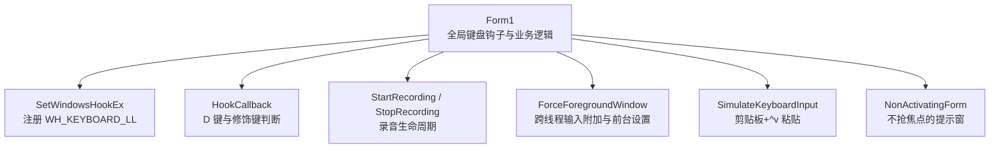
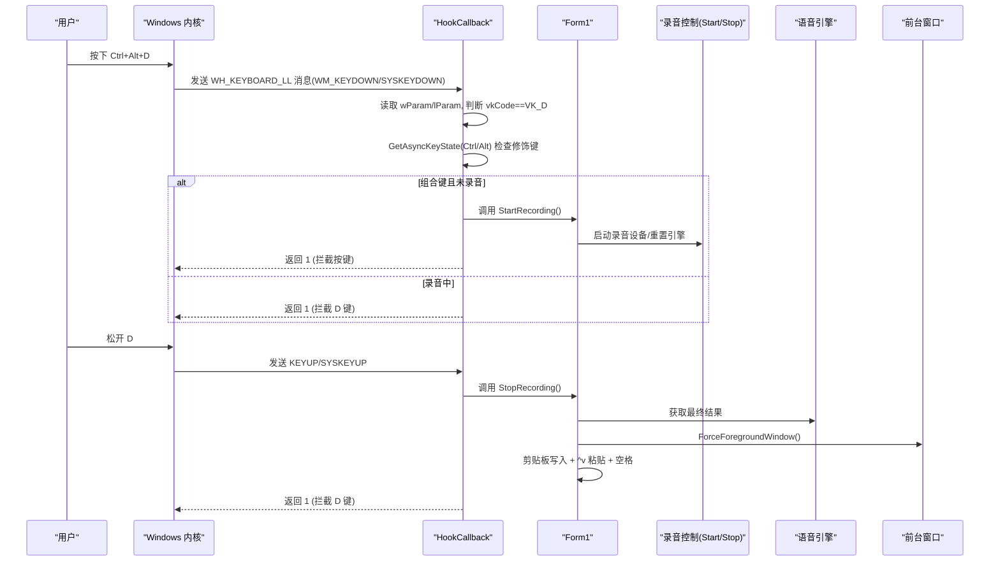
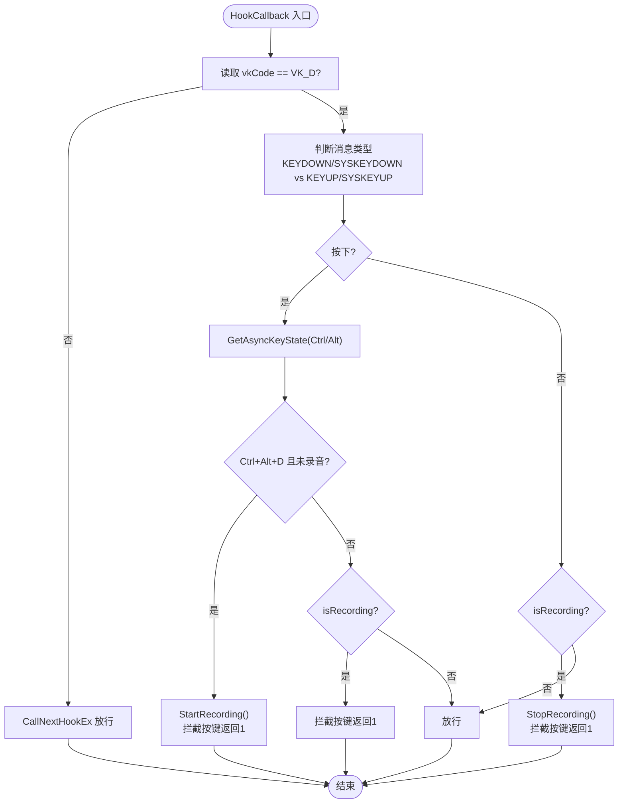
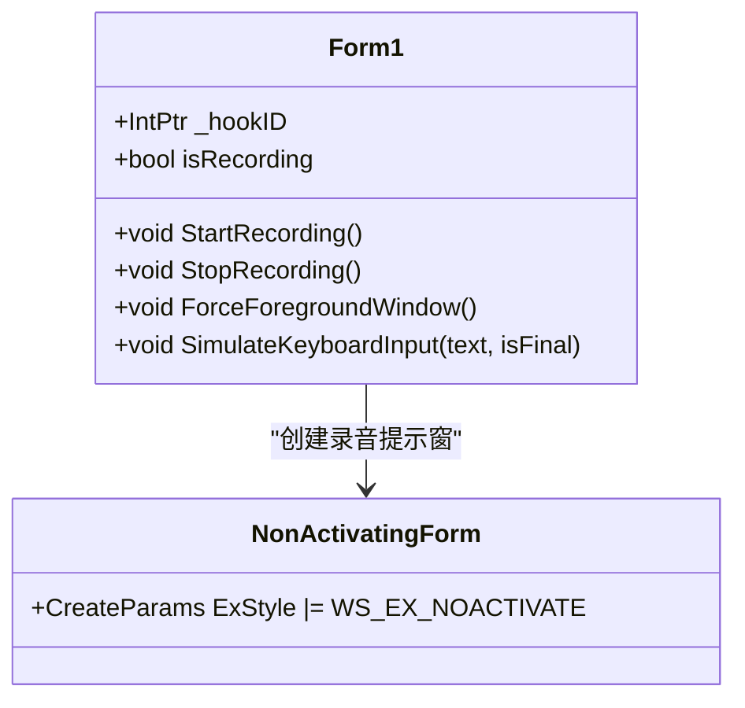
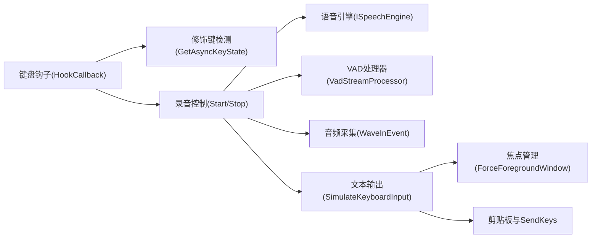

# 键盘快捷键系统

<cite>
**本文引用的文件**   
- [Form1.cs](file://t9s2t/Form1.cs)
</cite>

## 目录
1. [简介](#简介)
2. [项目结构](#项目结构)
3. [核心组件](#核心组件)
4. [架构总览](#架构总览)
5. [详细组件分析](#详细组件分析)
6. [依赖关系分析](#依赖关系分析)
7. [性能与稳定性考量](#性能与稳定性考量)
8. [故障排查指南](#故障排查指南)
9. [结论](#结论)
10. [附录：扩展自定义快捷键组合](#附录扩展自定义快捷键组合)

## 简介
本技术文档聚焦 t9s2t 的键盘快捷键系统，重点阐述全局低级别键盘钩子的实现原理、Ctrl+Alt+D 组合键的检测机制、按键拦截与放行控制逻辑、非激活窗体的焦点管理策略，并提供扩展更多功能键的实践指引。该系统的目标是：在任意前台应用下，通过按住 Ctrl+Alt+D 触发语音识别并自动将结果粘贴到目标窗口，同时避免 D 键在录音期间产生字符输入。

## 项目结构
本项目为 Windows Forms 应用，键盘快捷键相关逻辑集中在主窗体 Form1 中，包括：
- 全局低级别键盘钩子注册与回调处理
- 修饰键状态检测（Ctrl/Alt）
- 录音生命周期控制（开始/停止）
- 非激活提示窗体与前台窗口恢复
- 文本输出模拟（剪贴板 + 快捷键粘贴）

图表来源
- [Form1.cs:82-127](file://t9s2t/Form1.cs#L82-L127)
- [Form1.cs:415-460](file://t9s2t/Form1.cs#L415-L460)
- [Form1.cs:1114-1144](file://t9s2t/Form1.cs#L1114-L1144)
- [Form1.cs:993-1051](file://t9s2t/Form1.cs#L993-L1051)
- [Form1.cs:1298-1309](file://t9s2t/Form1.cs#L1298-L1309)

章节来源
- [Form1.cs:82-127](file://t9s2t/Form1.cs#L82-L127)
- [Form1.cs:415-460](file://t9s2t/Form1.cs#L415-L460)
- [Form1.cs:1114-1144](file://t9s2t/Form1.cs#L1114-L1144)
- [Form1.cs:993-1051](file://t9s2t/Form1.cs#L993-L1051)
- [Form1.cs:1298-1309](file://t9s2t/Form1.cs#L1298-L1309)

## 核心组件
- 低级别键盘钩子子系统
  - 使用 SetWindowsHookEx 注册 WH_KEYBOARD_LL 钩子，回调函数 HookCallback 负责解析消息类型与虚拟键码，判断是否为 D 键以及是否处于录音状态。
- 修饰键检测子系统
  - 使用 GetAsyncKeyState 查询 Ctrl 与 Alt 的实时状态，结合 WM_KEYDOWN/WM_SYSKEYDOWN 与 WM_KEYUP/WM_SYSKEYUP 消息完成组合键判定。
- 录音控制子系统
  - StartRecording/StopRecording 管理音频采集、引擎重置与结果输出；isRecording 标志位用于拦截 D 键输入。
- 前台窗口与焦点管理子系统
  - ForceForegroundWindow 使用 AttachThreadInput 与 SetForegroundWindow 确保最终文本粘贴到正确的前台窗口，避免被自身提示窗抢占焦点。
- 文本输出子系统
  - SimulateKeyboardInput 采用“临时释放 Alt -> 写入剪贴板 -> ^v 粘贴 -> 追加空格”的策略，保证原子化粘贴且不触发系统菜单。

章节来源
- [Form1.cs:82-127](file://t9s2t/Form1.cs#L82-L127)
- [Form1.cs:415-460](file://t9s2t/Form1.cs#L415-L460)
- [Form1.cs:1146-1173](file://t9s2t/Form1.cs#L1146-L1173)
- [Form1.cs:1228-1273](file://t9s2t/Form1.cs#L1228-L1273)
- [Form1.cs:1114-1144](file://t9s2t/Form1.cs#L1114-L1144)
- [Form1.cs:993-1051](file://t9s2t/Form1.cs#L993-L1051)

## 架构总览
下图展示了从用户按下 Ctrl+Alt+D 到文本粘贴的关键调用链与数据流。

图表来源
- [Form1.cs:415-460](file://t9s2t/Form1.cs#L415-L460)
- [Form1.cs:1146-1173](file://t9s2t/Form1.cs#L1146-L1173)
- [Form1.cs:1228-1273](file://t9s2t/Form1.cs#L1228-L1273)
- [Form1.cs:1114-1144](file://t9s2t/Form1.cs#L1114-L1144)
- [Form1.cs:993-1051](file://t9s2t/Form1.cs#L993-L1051)

## 详细组件分析

### 全局键盘钩子与回调处理
- 钩子注册
  - 通过 SetWindowsHookEx 以 WH_KEYBOARD_LL 注册全局键盘钩子，回调委托指向 HookCallback。
- 回调处理流程
  - 解析 lParam 中的虚拟键码，仅关注 VK_D。
  - 区分 WM_KEYDOWN/WM_SYSKEYDOWN 与 WM_KEYUP/WM_SYSKEYUP，兼容 Alt 按下时的系统消息。
  - 在按下时检查 Ctrl 与 Alt 的状态，若满足 Ctrl+Alt+D 且未录音，则进入录音流程并拦截按键。
  - 在录音中，无论是否组合键，均拦截 D 键防止字符输入。
  - 在松开时结束录音并拦截按键。
  - 其他情况调用 CallNextHookEx 放行。

图表来源
- [Form1.cs:415-460](file://t9s2t/Form1.cs#L415-L460)

章节来源
- [Form1.cs:82-127](file://t9s2t/Form1.cs#L82-L127)
- [Form1.cs:415-460](file://t9s2t/Form1.cs#L415-L460)

### Ctrl+Alt+D 组合键检测机制
- 修饰键状态
  - 使用 GetAsyncKeyState(VK_CONTROL) 与 GetAsyncKeyState(VK_MENU) 判断当前 Ctrl/Alt 是否按下。
- 消息类型兼容
  - 当 Alt 按住时，Windows 会发送 WM_SYSKEYDOWN/WM_SYSKEYUP 而非普通键消息，代码对两类消息均做兼容处理。
- 组合键判定
  - 仅在按下阶段进行组合键判定；松开阶段不检查修饰键，因为松开顺序不确定，只要处于录音中即结束录音。

章节来源
- [Form1.cs:415-460](file://t9s2t/Form1.cs#L415-L460)

### 按键拦截与放行控制逻辑
- 拦截条件
  - 按下阶段：满足 Ctrl+Alt+D 且未录音时，开始录音并拦截按键。
  - 录音中：任何 D 键按下或松开均拦截，避免产生字符输入。
- 放行条件
  - 非 D 键或 D 键在非录音且非组合键情况下，调用 CallNextHookEx 放行，允许正常打字。

章节来源
- [Form1.cs:415-460](file://t9s2t/Form1.cs#L415-L460)

### 非激活窗体的焦点管理
- 问题背景
  - 录音提示窗体若抢夺焦点，会导致最终文本粘贴到错误窗口。
- 解决方案
  - 使用 NonActivatingForm 创建不会激活的悬浮提示窗，避免焦点切换。
  - 在显示提示窗前保存当前前台窗口句柄 _lastTargetWindow。
  - 在粘贴前调用 ForceForegroundWindow：
    - 若前台窗口是自身或提示窗，回退到 _lastTargetWindow。
    - 使用 AttachThreadInput 将前台窗口线程与当前线程输入队列关联，再调用 SetForegroundWindow 设置前台窗口。
    - 完成后解除线程输入附加。

图表来源
- [Form1.cs:1114-1144](file://t9s2t/Form1.cs#L1114-L1144)
- [Form1.cs:1298-1309](file://t9s2t/Form1.cs#L1298-L1309)

章节来源
- [Form1.cs:1114-1144](file://t9s2t/Form1.cs#L1114-L1144)
- [Form1.cs:1298-1309](file://t9s2t/Form1.cs#L1298-L1309)

### 文本输出与防系统菜单干扰
- 输出策略
  - 先尝试将前台窗口设置为目标窗口，然后临时释放可能仍按住的 Alt，以避免 Alt+Space 触发系统菜单。
  - 将识别结果写入剪贴板，等待短暂时间后发送 ^v 粘贴，并在末尾追加一个空格。
- 容错方案
  - 若上述流程异常，回退到逐字符模拟输入（较慢但稳定）。

章节来源
- [Form1.cs:993-1051](file://t9s2t/Form1.cs#L993-L1051)
- [Form1.cs:1279-1290](file://t9s2t/Form1.cs#L1279-L1290)

## 依赖关系分析
- 外部 API 依赖
  - user32.dll: SetWindowsHookEx、UnhookWindowsHookEx、CallNextHookEx、GetAsyncKeyState、keybd_event、SetForegroundWindow、ShowWindow、IsIconic、FindWindow、GetForegroundWindow、GetWindowThreadProcessId、AttachThreadInput、RegisterWindowMessage、SendMessage
  - kernel32.dll: GetModuleHandle
  - gdi32.dll: CreateRoundRectRgn
- 内部模块依赖
  - 录音控制与引擎接口（ISpeechEngine、VadStreamProcessor、WaveInEvent）
  - UI 控件（NotifyIcon、Label、ProgressBar 等）

图表来源
- [Form1.cs:82-127](file://t9s2t/Form1.cs#L82-L127)
- [Form1.cs:415-460](file://t9s2t/Form1.cs#L415-L460)
- [Form1.cs:1146-1173](file://t9s2t/Form1.cs#L1146-L1173)
- [Form1.cs:1228-1273](file://t9s2t/Form1.cs#L1228-L1273)
- [Form1.cs:993-1051](file://t9s2t/Form1.cs#L993-L1051)
- [Form1.cs:1114-1144](file://t9s2t/Form1.cs#L1114-L1144)

章节来源
- [Form1.cs:82-127](file://t9s2t/Form1.cs#L82-L127)
- [Form1.cs:415-460](file://t9s2t/Form1.cs#L415-L460)
- [Form1.cs:1146-1173](file://t9s2t/Form1.cs#L1146-L1173)
- [Form1.cs:1228-1273](file://t9s2t/Form1.cs#L1228-L1273)
- [Form1.cs:993-1051](file://t9s2t/Form1.cs#L993-L1051)
- [Form1.cs:1114-1144](file://t9s2t/Form1.cs#L1114-L1144)

## 性能与稳定性考量
- 节流与去重
  - partial 结果更新存在最小间隔与去重逻辑，避免频繁 UI 刷新与闪烁。
- 线程安全
  - 使用锁保护录音与输入操作，确保 DataAvailable 回调与停止流程的并发安全。
- 用户体验优化
  - 非激活提示窗避免焦点切换；临时释放 Alt 避免系统菜单弹出；剪贴板粘贴一次性出现，减少视觉闪烁。

[本节为通用指导，无需具体文件引用]

## 故障排查指南
- 无法触发录音
  - 确认已安装麦克风且 WaveInEvent.DeviceCount >= 1。
  - 检查引擎 DLL 与模型是否就绪，按钮状态与日志提示可辅助定位。
- 文本未粘贴到目标窗口
  - 检查 ForceForegroundWindow 是否正确回退到 _lastTargetWindow。
  - 观察是否存在 Alt 仍按着导致系统菜单弹出的情况。
- 录音中 D 键仍产生字符
  - 确认 HookCallback 在 isRecording 状态下返回 1 拦截按键。
  - 检查 WM_SYSKEYDOWN/WM_SYSKEYUP 分支是否覆盖 Alt 场景。

章节来源
- [Form1.cs:1057-1062](file://t9s2t/Form1.cs#L1057-L1062)
- [Form1.cs:1114-1144](file://t9s2t/Form1.cs#L1114-L1144)
- [Form1.cs:415-460](file://t9s2t/Form1.cs#L415-L460)

## 结论
t9s2t 的键盘快捷键系统通过低级别键盘钩子与修饰键状态检测，实现了可靠的 Ctrl+Alt+D 组合键触发录音与智能拦截。配合非激活提示窗与前台窗口恢复策略，确保了文本输出的准确性与用户体验的流畅性。整体设计兼顾了性能、稳定性与可扩展性，便于后续扩展更多快捷键组合与功能键。

[本节为总结性内容，无需具体文件引用]

## 附录：扩展自定义快捷键组合
以下提供基于现有实现的扩展思路与步骤，帮助添加更多快捷键组合（例如 Ctrl+Alt+F 触发特定功能）：

- 新增虚拟键常量
  - 在常量区增加新的 VK_XXX 定义（如 VK_F）。
- 修改 HookCallback 判定逻辑
  - 在 vkCode 判断分支中增加新键的处理路径。
  - 在按下阶段检查修饰键状态（Ctrl/Alt），满足组合键条件时执行对应功能。
  - 在录音中保持拦截行为，避免干扰。
- 新增功能方法
  - 在 Form1 中新增对应的处理方法（如 DoFeatureF），并在 HookCallback 中调用。
- 测试与验证
  - 在不同前台应用下验证组合键触发与拦截效果。
  - 检查是否有系统菜单冲突（如 Alt+Space），必要时在输出前临时释放修饰键。

示例参考路径（不包含具体代码内容）：
- 常量与 API 声明位置：[Form1.cs:82-127](file://t9s2t/Form1.cs#L82-L127)
- 钩子注册与回调处理：[Form1.cs:415-460](file://t9s2t/Form1.cs#L415-L460)
- 录音控制与输出流程：[Form1.cs:1146-1173](file://t9s2t/Form1.cs#L1146-L1173), [Form1.cs:1228-1273](file://t9s2t/Form1.cs#L1228-L1273), [Form1.cs:993-1051](file://t9s2t/Form1.cs#L993-L1051)

章节来源
- [Form1.cs:82-127](file://t9s2t/Form1.cs#L82-L127)
- [Form1.cs:415-460](file://t9s2t/Form1.cs#L415-L460)
- [Form1.cs:1146-1173](file://t9s2t/Form1.cs#L1146-L1173)
- [Form1.cs:1228-1273](file://t9s2t/Form1.cs#L1228-L1273)
- [Form1.cs:993-1051](file://t9s2t/Form1.cs#L993-L1051)