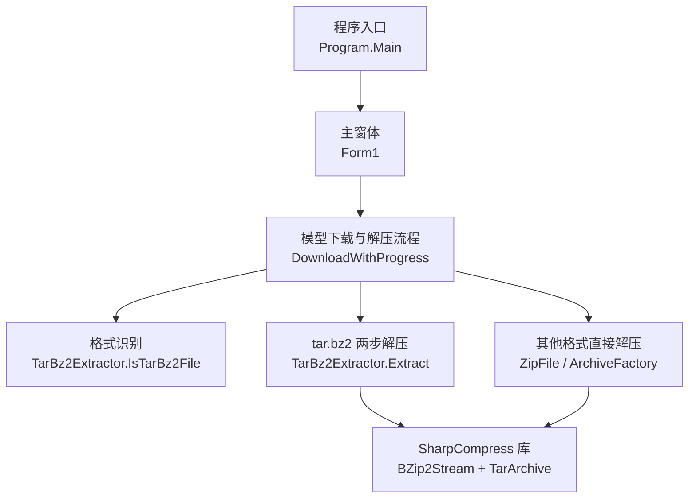
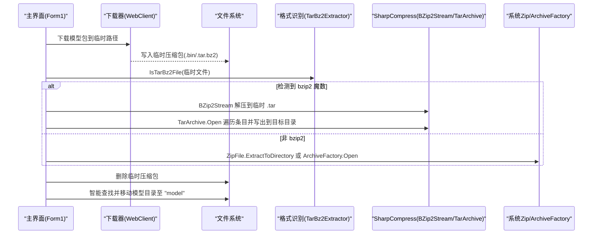
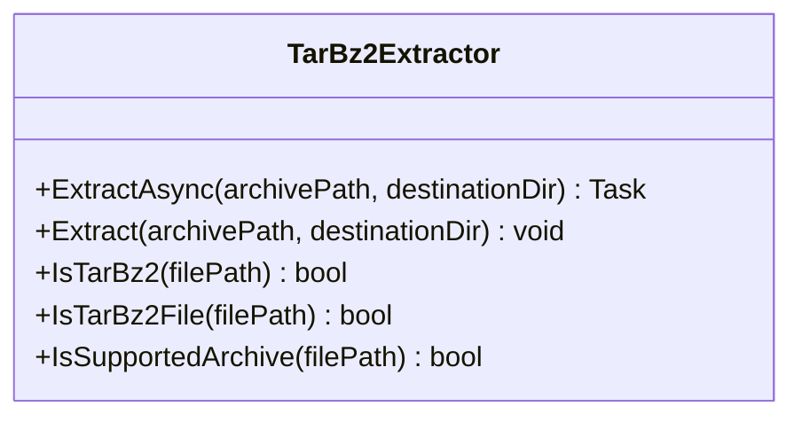
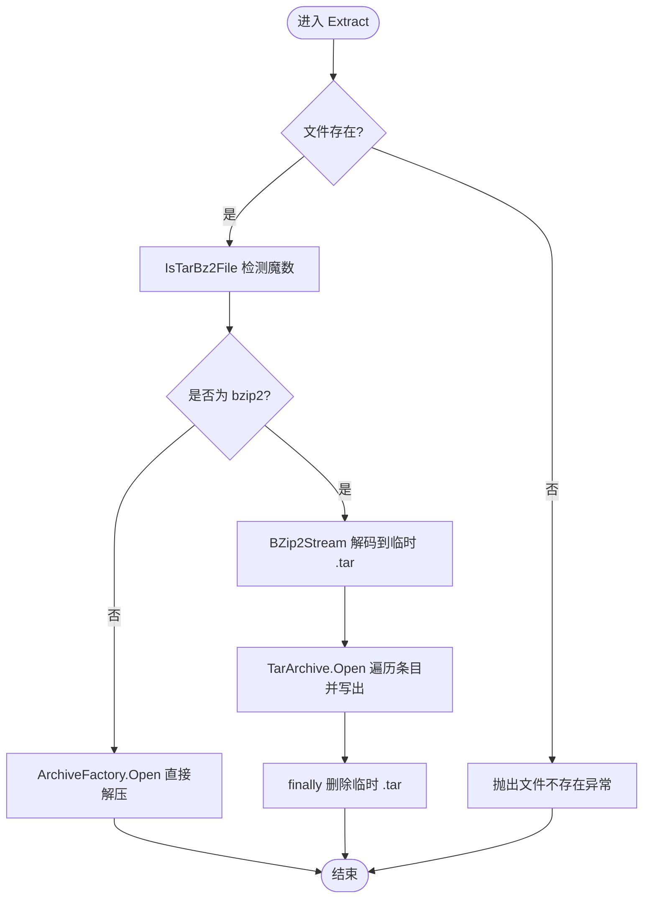
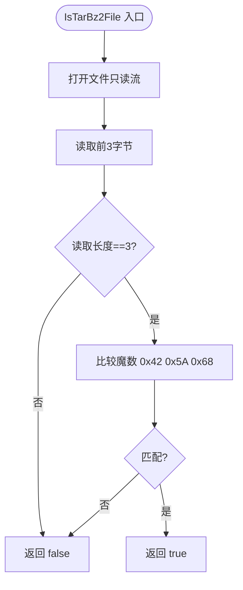
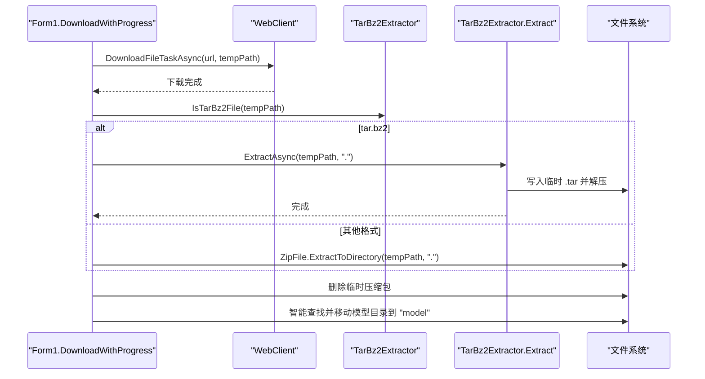
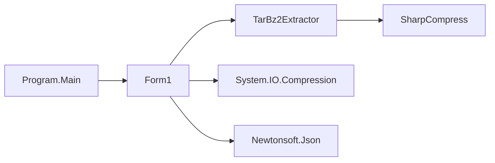

# 压缩文件解压

<cite>
**本文引用的文件**   
- [TarBz2Extractor.cs](file://t9s2t/Engines/TarBz2Extractor.cs)
- [Form1.cs](file://t9s2t/Form1.cs)
- [Program.cs](file://t9s2t/Program.cs)
- [packages.config](file://t9s2t/packages.config)
</cite>

## 目录
1. [简介](#简介)
2. [项目结构](#项目结构)
3. [核心组件](#核心组件)
4. [架构总览](#架构总览)
5. [详细组件分析](#详细组件分析)
6. [依赖关系分析](#依赖关系分析)
7. [性能与内存管理](#性能与内存管理)
8. [故障排除指南](#故障排除指南)
9. [结论](#结论)
10. [附录：使用示例与最佳实践](#附录使用示例与最佳实践)

## 简介
本技术文档聚焦于“压缩文件解压”能力，围绕 TarBz2Extractor 类实现 tar.bz2 的两步解压流程、bzip2 魔数检测与格式识别算法、SharpCompress 库的集成方式（流式处理、内存管理与资源释放）、支持的压缩格式列表与扩展性设计、临时文件管理机制，以及下载与解压的整体工作流。文档同时提供使用示例、性能优化建议与故障排除方法，帮助读者快速理解并正确使用该解压工具。

## 项目结构
本项目为 Windows 桌面应用，包含语音识别引擎加载、模型下载与解压等能力。与解压相关的核心代码位于 Engines 目录下的 TarBz2Extractor.cs，并在主窗体 Form1.cs 中调用以完成模型包的自动下载与解压。

图表来源
- [Program.cs:15-24](file://t9s2t/Program.cs#L15-L24)
- [Form1.cs:876-966](file://t9s2t/Form1.cs#L876-L966)
- [TarBz2Extractor.cs:30-96](file://t9s2t/Engines/TarBz2Extractor.cs#L30-L96)

章节来源
- [Program.cs:15-24](file://t9s2t/Program.cs#L15-L24)
- [Form1.cs:876-966](file://t9s2t/Form1.cs#L876-L966)
- [TarBz2Extractor.cs:17-142](file://t9s2t/Engines/TarBz2Extractor.cs#L17-L142)

## 核心组件
- TarBz2Extractor：静态解压工具类，负责 tar.bz2 的特殊处理与通用压缩包解压；提供 bzip2 魔数检测、支持格式判断、异步解压接口。
- Form1：主界面逻辑，负责远程模型列表获取、下载进度展示、根据内容识别压缩格式并调用解压工具，最后智能定位并重命名模型目录。
- SharpCompress：第三方压缩库，用于 bzip2 解码与 tar 归档读取；同时通过 ArchiveFactory 统一打开多种归档类型。

章节来源
- [TarBz2Extractor.cs:17-142](file://t9s2t/Engines/TarBz2Extractor.cs#L17-L142)
- [Form1.cs:876-966](file://t9s2t/Form1.cs#L876-L966)
- [packages.config:17](file://t9s2t/packages.config#L17)

## 架构总览
整体流程从用户点击“下载模型”开始，到最终将模型目录放置到固定路径，期间涉及网络请求、临时文件写入、格式识别、两步解压与目录整理。

图表来源
- [Form1.cs:876-966](file://t9s2t/Form1.cs#L876-L966)
- [TarBz2Extractor.cs:30-96](file://t9s2t/Engines/TarBz2Extractor.cs#L30-L96)

## 详细组件分析

### TarBz2Extractor 类分析
该类是解压能力的核心，提供以下关键功能：
- 异步与同步解压入口：ExtractAsync 包装 Extract 在后台线程执行。
- tar.bz2 两步解压：先通过 BZip2Stream 将 bzip2 数据流解码为 .tar 文件，再使用 TarArchive 打开并逐条写出到目标目录。
- bzip2 魔数检测：读取前三个字节并与 'B' 'Z' 'h' 比较，准确识别 bzip2 压缩数据。
- 支持格式判断：基于扩展名判断是否支持 zip、tar.bz2、tbz2、tar.gz、tgz。

图表来源
- [TarBz2Extractor.cs:17-142](file://t9s2t/Engines/TarBz2Extractor.cs#L17-L142)

#### tar.bz2 特殊处理与两步解压机制
- 第一步：使用 BZip2Stream 对输入流进行解压缩，输出到临时 .tar 文件。
- 第二步：使用 TarArchive.Open 打开临时 .tar，遍历 Entries，过滤目录项，将文件条目写出到目标目录。
- 临时文件清理：在 finally 块中尝试删除临时 .tar，确保异常情况下也能尽量清理。

图表来源
- [TarBz2Extractor.cs:30-96](file://t9s2t/Engines/TarBz2Extractor.cs#L30-L96)

章节来源
- [TarBz2Extractor.cs:30-96](file://t9s2t/Engines/TarBz2Extractor.cs#L30-L96)

#### bzip2 魔数检测与文件格式识别算法
- 魔数字节：bzip2 头部前三个字节为 0x42('B')、0x5A('Z')、0x68('h')。
- 算法步骤：
  - 打开文件只读流。
  - 读取前 3 个字节。
  - 若成功读取且等于魔数，则判定为 bzip2；否则返回 false。
- 错误处理：捕获 IO 异常并返回 false，避免影响上层流程。

图表来源
- [TarBz2Extractor.cs:112-127](file://t9s2t/Engines/TarBz2Extractor.cs#L112-L127)

章节来源
- [TarBz2Extractor.cs:112-127](file://t9s2t/Engines/TarBz2Extractor.cs#L112-L127)

#### SharpCompress 库集成与使用
- 流式处理：BZip2Stream 以流的方式解码，无需将整个压缩包载入内存，适合大文件。
- 资源释放：使用 using 语句确保 FileStream、BZip2Stream、TarArchive 等资源及时释放。
- 多格式支持：ArchiveFactory.Open 可自动识别并打开 zip、tar.gz 等归档类型。
- 条目写出：Entry.WriteToDirectory 支持保留完整路径与覆盖策略。

章节来源
- [TarBz2Extractor.cs:48-92](file://t9s2t/Engines/TarBz2Extractor.cs#L48-L92)
- [packages.config:17](file://t9s2t/packages.config#L17)

#### 支持的压缩格式与扩展性设计
- 当前支持：
  - zip
  - tar.bz2 / tbz2
  - tar.gz / tgz
- 扩展新格式的方法：
  - 在 IsSupportedArchive 中添加新的扩展名判断。
  - 若为新压缩算法（如 zstd），可在 Extract 中增加分支，使用对应解码器（例如 ZstdSharp）生成中间文件或直出到目标目录。
  - 保持统一的临时文件命名与清理策略，确保异常安全。

章节来源
- [TarBz2Extractor.cs:132-140](file://t9s2t/Engines/TarBz2Extractor.cs#L132-L140)

#### 临时文件管理机制
- 命名策略：
  - 临时 .tar 文件名采用“model_temp_”前缀 + GUID 后缀，避免冲突。
  - 下载的临时压缩包命名为“model_temp_” + GUID + “.bin”。
- 清理策略：
  - tar.bz2 解压完成后在 finally 中删除临时 .tar。
  - 下载完成后删除临时压缩包。
- 异常处理：
  - 删除操作包裹 try/catch，防止因权限或占用导致异常中断主流程。

章节来源
- [TarBz2Extractor.cs:45-74](file://t9s2t/Engines/TarBz2Extractor.cs#L45-L74)
- [Form1.cs:908-926](file://t9s2t/Form1.cs#L908-L926)

### 主界面下载与解压流程（Form1）
- 下载阶段：
  - 设置 TLS 协议版本，创建 WebClient，显示下载进度。
  - 下载文件到临时路径，完成后提示“正在解压”。
- 解压阶段：
  - 调用 TarBz2Extractor.IsTarBz2File 进行魔数检测。
  - 若是 tar.bz2，调用 ExtractAsync 进行两步解压。
  - 否则使用 ZipFile.ExtractToDirectory 或 ArchiveFactory 直接解压。
- 目录整理：
  - 优先检查 JSON 中指定的 folder 是否存在。
  - 若不存在，扫描当前目录下包含已知模型文件的子目录，将其移动到固定路径 "model"。

图表来源
- [Form1.cs:876-966](file://t9s2t/Form1.cs#L876-L966)
- [TarBz2Extractor.cs:30-96](file://t9s2t/Engines/TarBz2Extractor.cs#L30-L96)

章节来源
- [Form1.cs:876-966](file://t9s2t/Form1.cs#L876-L966)

## 依赖关系分析
- 外部库：
  - SharpCompress：用于 bzip2 解码与 tar 归档读取。
  - Newtonsoft.Json：解析远程模型配置。
  - NAudio：音频采集与处理（与解压无直接耦合）。
  - System.IO.Compression：用于 zip 解压。
- 内部模块：
  - TarBz2Extractor 被 Form1 调用，作为解压能力提供者。
  - Program 仅初始化应用环境，不直接参与解压。

图表来源
- [Program.cs:15-24](file://t9s2t/Program.cs#L15-L24)
- [Form1.cs:876-966](file://t9s2t/Form1.cs#L876-L966)
- [TarBz2Extractor.cs:17-142](file://t9s2t/Engines/TarBz2Extractor.cs#L17-L142)
- [packages.config:17](file://t9s2t/packages.config#L17)

章节来源
- [packages.config:1-20](file://t9s2t/packages.config#L1-20)
- [Program.cs:15-24](file://t9s2t/Program.cs#L15-L24)
- [Form1.cs:876-966](file://t9s2t/Form1.cs#L876-L966)
- [TarBz2Extractor.cs:17-142](file://t9s2t/Engines/TarBz2Extractor.cs#L17-L142)

## 性能与内存管理
- 流式处理：
  - BZip2Stream 以流方式解码，避免一次性加载整个压缩包到内存，降低峰值内存占用。
- 资源释放：
  - 使用 using 语句确保 FileStream、BZip2Stream、TarArchive 等资源及时释放，避免句柄泄漏。
- I/O 优化：
  - 临时文件命名使用 GUID，减少冲突概率。
  - 解压完成后立即删除临时文件，释放磁盘空间。
- 并发考虑：
  - ExtractAsync 在后台线程执行，避免阻塞 UI 线程。
- 潜在优化点：
  - 对于超大 tar.bz2，可考虑分块写出与并行写入（需评估文件系统与磁盘并发能力）。
  - 在解压过程中加入取消令牌，支持用户主动中止。

[本节为通用性能讨论，不直接分析具体文件]

## 故障排除指南
- 常见问题：
  - 链接失效或网络问题：确认远程地址可达，重试下载。
  - 压缩包损坏：重新下载或校验完整性。
  - tar.bz2 解压失败：确认 SharpCompress 版本兼容，检查临时目录权限。
  - 未找到模型目录：检查压缩包结构是否符合预期（包含 model.int8.onnx、encoder.int8.onnx、tokens.txt 等）。
- 排查建议：
  - 查看调试输出，确认解压流程各阶段日志。
  - 手动解压临时文件验证内容。
  - 检查目标目录是否有写权限。

章节来源
- [Form1.cs:958-966](file://t9s2t/Form1.cs#L958-L966)

## 结论
TarBz2Extractor 提供了稳定可靠的 tar.bz2 解压能力，结合 SharpCompress 的流式处理与资源管理，实现了高效、低内存占用的解压流程。主界面 Form1 将下载、格式识别、解压与目录整理整合成自动化工作流，提升了用户体验。通过扩展 IsSupportedArchive 与 Extract 分支，可轻松添加对新压缩格式的支持。

[本节为总结性内容，不直接分析具体文件]

## 附录：使用示例与最佳实践
- 基本用法：
  - 调用 ExtractAsync 传入压缩包路径与目标目录，等待任务完成。
  - 使用 IsTarBz2File 进行格式识别，再选择相应解压路径。
- 最佳实践：
  - 始终使用 using 语句管理流与归档对象。
  - 在 finally 中清理临时文件，确保异常安全。
  - 在下载与解压过程中更新 UI 状态，提升用户感知。
  - 对大文件启用异步与流式处理，避免 UI 卡顿与内存溢出。
- 性能优化：
  - 合理设置缓冲区大小（由库默认实现）。
  - 避免重复解压同一文件，缓存结果或记录解压状态。
  - 在多线程环境下注意临时文件命名冲突与并发写入。

章节来源
- [TarBz2Extractor.cs:22-96](file://t9s2t/Engines/TarBz2Extractor.cs#L22-L96)
- [Form1.cs:876-966](file://t9s2t/Form1.cs#L876-L966)