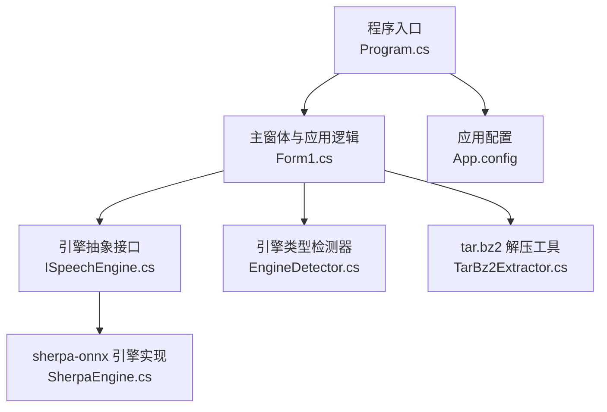
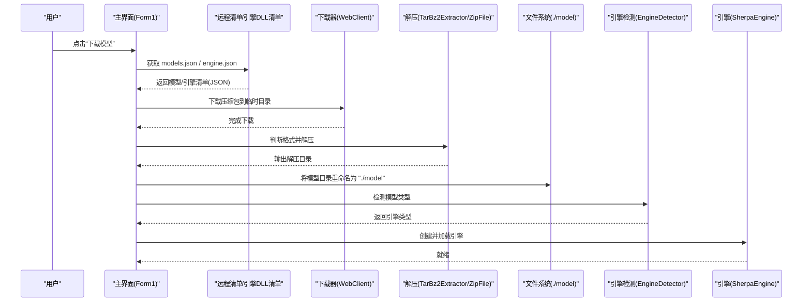
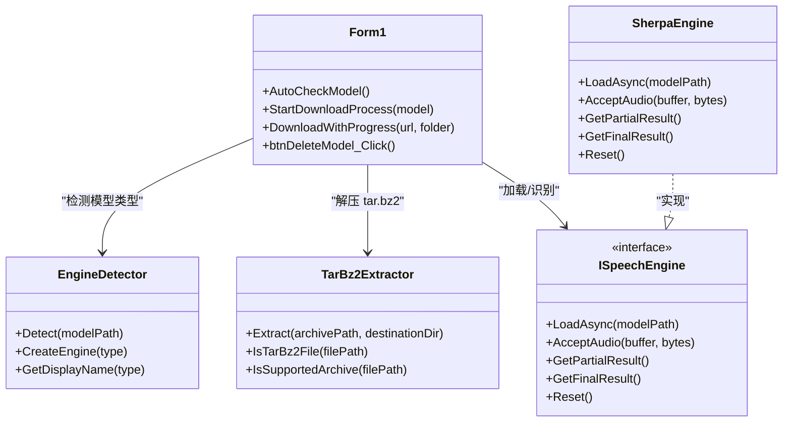

# 存储管理

<cite>
**本文引用的文件列表**
- [Form1.cs](file://t9s2t/Form1.cs)
- [EngineDetector.cs](file://t9s2t/Engines/EngineDetector.cs)
- [SherpaEngine.cs](file://t9s2t/Engines/SherpaEngine.cs)
- [TarBz2Extractor.cs](file://t9s2t/Engines/TarBz2Extractor.cs)
- [ISpeechEngine.cs](file://t9s2t/Engines/ISpeechEngine.cs)
- [Program.cs](file://t9s2t/Program.cs)
- [App.config](file://t9s2t/App.config)
</cite>

## 目录
1. [简介](#简介)
2. [项目结构](#项目结构)
3. [核心组件](#核心组件)
4. [架构总览](#架构总览)
5. [详细组件分析](#详细组件分析)
6. [依赖关系分析](#依赖关系分析)
7. [性能与容量优化](#性能与容量优化)
8. [故障排查指南](#故障排查指南)
9. [结论](#结论)
10. [附录：配置与扩展接口](#附录配置与扩展接口)

## 简介
本技术文档聚焦于“模型存储管理”，围绕语音识别模型的下载、解压、安装、检测、加载、删除等全生命周期，系统梳理存储结构设计、目录组织规范、版本控制策略、备份机制、存储空间管理、过期清理、索引与元数据、压缩与去重、碎片整理、监控指标与日志记录，以及配置项与扩展点。文档面向开发者与维护者，兼顾非技术读者的可理解性。

## 项目结构
本项目采用分层+按功能模块组织的代码结构：
- 应用入口与主界面：Program.cs、Form1.cs（含 UI 与存储管理流程）
- 引擎抽象与实现：ISpeechEngine.cs、SherpaEngine.cs
- 引擎类型检测：EngineDetector.cs
- 压缩解压工具：TarBz2Extractor.cs
- 运行配置：App.config

图示来源
- [Program.cs:1-27](file://t9s2t/Program.cs#L1-L27)
- [Form1.cs:1-120](file://t9s2t/Form1.cs#L1-L120)
- [ISpeechEngine.cs:1-35](file://t9s2t/Engines/ISpeechEngine.cs#L1-L35)
- [SherpaEngine.cs:1-120](file://t9s2t/Engines/SherpaEngine.cs#L1-L120)
- [EngineDetector.cs:1-122](file://t9s2t/Engines/EngineDetector.cs#L1-L122)
- [TarBz2Extractor.cs:1-143](file://t9s2t/Engines/TarBz2Extractor.cs#L1-L143)
- [App.config:1-10](file://t9s2t/App.config#L1-L10)

章节来源
- [Program.cs:1-27](file://t9s2t/Program.cs#L1-L27)
- [Form1.cs:1-120](file://t9s2t/Form1.cs#L1-L120)
- [App.config:1-10](file://t9s2t/App.config#L1-L10)

## 核心组件
- 模型存储根目录：固定为当前工作目录下的 "model" 子目录，用于存放已安装的模型文件。
- 模型包来源：远程 JSON 清单提供模型名称、描述、下载地址、目标文件夹名、大小提示、版本号等信息；网络不可用时回退到内置备用清单。
- 下载与解压：支持 zip、tar.gz/tgz、tar.bz2/tbz2；对 tar.bz2 使用两步解压（bzip2 -> tar），其他格式直接解压。
- 模型安装：智能定位解压后的模型目录（优先匹配清单中的 folder，其次扫描包含 model.onnx/encoder.onnx/tokens.txt 的目录），统一重命名为 "model"。
- 引擎检测与加载：根据目录内文件特征自动识别引擎类型并创建对应引擎实例，按需加载标点与 VAD 模型。
- 模型删除：用户确认后递归删除 "model" 目录，释放空间并重置状态。

章节来源
- [Form1.cs:26-26](file://t9s2t/Form1.cs#L26-L26)
- [Form1.cs:39-80](file://t9s2t/Form1.cs#L39-L80)
- [Form1.cs:832-851](file://t9s2t/Form1.cs#L832-L851)
- [Form1.cs:904-956](file://t9s2t/Form1.cs#L904-L956)
- [EngineDetector.cs:27-75](file://t9s2t/Engines/EngineDetector.cs#L27-L75)
- [SherpaEngine.cs:57-72](file://t9s2t/Engines/SherpaEngine.cs#L57-L72)
- [Form1.cs:971-984](file://t9s2t/Form1.cs#L971-L984)

## 架构总览
下图展示从“获取模型清单”到“安装模型并加载引擎”的端到端流程，以及关键存储路径与临时文件的流转。

图示来源
- [Form1.cs:724-851](file://t9s2t/Form1.cs#L724-L851)
- [Form1.cs:876-956](file://t9s2t/Form1.cs#L876-L956)
- [TarBz2Extractor.cs:30-96](file://t9s2t/Engines/TarBz2Extractor.cs#L30-L96)
- [EngineDetector.cs:27-75](file://t9s2t/Engines/EngineDetector.cs#L27-L75)
- [SherpaEngine.cs:57-72](file://t9s2t/Engines/SherpaEngine.cs#L57-L72)

## 详细组件分析

### 存储结构与目录组织规范
- 根目录约定：应用工作目录下固定存在 "model" 目录作为模型安装根目录。
- 模型文件命名约定：
  - 单模型：model.onnx 或 model.int8.onnx
  - 分词表：tokens.txt
  - 流式编码器/解码器：encoder.onnx/encoder.int8.onnx 与 decoder.onnx/decoder.int8.onnx
  - 可选增强：punc.onnx/punc.int8.onnx（标点恢复）、vad.onnx（VAD）
- 目录识别规则：
  - 若存在 encoder + decoder 则判定为流式 Paraformer
  - 若存在 model.onnx/int8 且 tokens.txt 行数小于阈值，则为离线 Paraformer-large；否则为 SenseVoice
  - 仅存在 encoder 则为非流式 Paraformer
- 安装后统一归一化：无论压缩包内目录名如何，最终都会移动到并命名为 "model"。

章节来源
- [Form1.cs:26-26](file://t9s2t/Form1.cs#L26-L26)
- [Form1.cs:928-956](file://t9s2t/Form1.cs#L928-L956)
- [EngineDetector.cs:27-75](file://t9s2t/Engines/EngineDetector.cs#L27-L75)
- [SherpaEngine.cs:74-115](file://t9s2t/Engines/SherpaEngine.cs#L74-L115)

### 版本控制策略
- 清单字段：每个模型条目包含 name、description、url、folder、size_hint、version、published 等字段，其中 version 表示发布版本时间戳或标识。
- 选择策略：通过 UI 展示 size_hint 与 description，由用户选择具体版本进行下载。
- 覆盖策略：下载前会先删除旧的 "model" 目录与可能的同名 targetFolder，确保安装干净。

章节来源
- [Form1.cs:130-142](file://t9s2t/Form1.cs#L130-L142)
- [Form1.cs:832-851](file://t9s2t/Form1.cs#L832-L851)
- [Form1.cs:904-906](file://t9s2t/Form1.cs#L904-L906)

### 备份机制
- 当前实现未内置多版本保留或增量备份。
- 建议实践：在自动化脚本中基于 version 字段建立归档目录（如 backups/<version>/），并在下载前执行快照复制，以便快速回滚。

[本节为通用建议，不直接分析具体文件]

### 存储空间管理策略
- 容量监控：可在下载前后统计 "model" 目录大小，结合磁盘剩余空间阈值触发告警。
- 使用统计：记录各模型版本的占用大小与最后使用时间，便于制定保留策略。
- 清理触发条件：当磁盘可用空间低于阈值或达到最大模型数量时，触发清理。

[本节为通用建议，不直接分析具体文件]

### 过期模型删除机制
- 保留策略：可按版本时间、使用频率、是否最新推荐等维度保留最近 N 个版本。
- 回收算法：按 LRU/LFU 淘汰旧版本，或按 published=false 过滤掉测试占位版本。
- 安全删除流程：
  - 预检查：确认目录存在且不为空
  - 二次确认：弹窗提示用户
  - 原子替换：先移动至回收站或临时备份目录，再删除
  - 失败回滚：删除失败时尝试恢复

章节来源
- [Form1.cs:971-984](file://t9s2t/Form1.cs#L971-L984)

### 模型索引与元数据存储
- 当前实现：无独立数据库或索引文件，依赖目录结构推断模型类型。
- 建议设计：
  - 元数据文件：在 "model" 同级或内部维护一个 models.json，记录版本、哈希、大小、发布日期、是否启用等
  - 缓存策略：启动时读取本地缓存，网络失败时使用内置 fallback 清单
  - 同步机制：定期拉取远程清单并与本地缓存比对，增量更新

章节来源
- [Form1.cs:39-80](file://t9s2t/Form1.cs#L39-L80)
- [Form1.cs:832-851](file://t9s2t/Form1.cs#L832-L851)

### 存储优化技术
- 文件压缩：
  - 支持 zip、tar.gz/tgz、tar.bz2/tbz2
  - tar.bz2 采用两步解压（bzip2 -> tar），避免外部依赖
- 去重算法：
  - 基于模型文件哈希（如 SHA-256）建立内容地址存储，避免重复下载相同版本
- 碎片整理：
  - 批量写入大文件后，建议在空闲时段执行磁盘碎片整理（Windows defrag）
  - 对于频繁小文件场景，考虑合并为归档包减少元数据开销

章节来源
- [TarBz2Extractor.cs:30-96](file://t9s2t/Engines/TarBz2Extractor.cs#L30-L96)
- [TarBz2Extractor.cs:132-140](file://t9s2t/Engines/TarBz2Extractor.cs#L132-L140)

### 监控指标与日志记录
- 日志记录：
  - 使用 Debug.WriteLine 输出关键步骤（下载进度、解压过程、引擎加载、错误信息）
  - 建议接入结构化日志框架，支持分级与轮转
- 监控指标：
  - 下载成功率、平均耗时、失败原因分布
  - 模型加载耗时、内存占用峰值
  - 磁盘使用率、模型目录大小变化趋势

章节来源
- [Form1.cs:876-956](file://t9s2t/Form1.cs#L876-L956)
- [TarBz2Extractor.cs:38-96](file://t9s2t/Engines/TarBz2Extractor.cs#L38-L96)
- [SherpaEngine.cs:57-72](file://t9s2t/Engines/SherpaEngine.cs#L57-L72)

## 依赖关系分析
- 组件耦合：
  - Form1 负责整体编排：清单获取、下载、解压、安装、检测、加载、删除
  - EngineDetector 与 SherpaEngine 共同解析模型目录结构，形成强耦合的类型识别逻辑
  - TarBz2Extractor 提供解压能力，被 Form1 调用
- 外部依赖：
  - SharpCompress（tar/bzip2 解压）
  - System.IO.Compression（zip 解压）
  - Newtonsoft.Json（JSON 解析）
  - Windows API（键盘钩子、剪贴板、窗口焦点）

图示来源
- [Form1.cs:724-956](file://t9s2t/Form1.cs#L724-L956)
- [EngineDetector.cs:27-122](file://t9s2t/Engines/EngineDetector.cs#L27-L122)
- [ISpeechEngine.cs:1-35](file://t9s2t/Engines/ISpeechEngine.cs#L1-L35)
- [SherpaEngine.cs:1-120](file://t9s2t/Engines/SherpaEngine.cs#L1-L120)
- [TarBz2Extractor.cs:1-143](file://t9s2t/Engines/TarBz2Extractor.cs#L1-L143)

章节来源
- [Form1.cs:724-956](file://t9s2t/Form1.cs#L724-L956)
- [EngineDetector.cs:27-122](file://t9s2t/Engines/EngineDetector.cs#L27-L122)
- [ISpeechEngine.cs:1-35](file://t9s2t/Engines/ISpeechEngine.cs#L1-L35)
- [SherpaEngine.cs:1-120](file://t9s2t/Engines/SherpaEngine.cs#L1-L120)
- [TarBz2Extractor.cs:1-143](file://t9s2t/Engines/TarBz2Extractor.cs#L1-L143)

## 性能与容量优化
- 下载阶段：
  - 断点续传：WebClient 不支持，可改用支持 Range 请求的 HTTP 客户端
  - 并发下载：并行下载多个引擎 DLL 或模型资源
- 解压阶段：
  - 流式解压：边读边写，降低内存峰值
  - 校验完整性：解压前后计算哈希，失败即重试
- 存储阶段：
  - 预分配目录：提前创建 "model" 目录，减少随机 I/O
  - 顺序写入：尽量按块顺序写入大文件，提升磁盘吞吐
- 容量治理：
  - 设置最大模型数量与总容量上限
  - 自动清理长时间未使用的旧版本

[本节为通用建议，不直接分析具体文件]

## 故障排查指南
- 常见问题
  - 无法获取远程清单：检查 TLS 设置与网络连通性
  - 下载不完整：校验文件大小与哈希，重新下载
  - 解压失败：确认压缩包格式与魔数，必要时安装 7-Zip
  - 模型未识别：检查目录内是否存在必要文件（model.onnx/encoder.onnx/tokens.txt）
  - 引擎加载失败：查看调试日志，确认模型路径与参数
- 定位方法
  - 观察 UI 状态栏与托盘提示
  - 查看调试输出（Debug.WriteLine）
  - 手动验证目录结构与文件完整性

章节来源
- [Program.cs:18-19](file://t9s2t/Program.cs#L18-L19)
- [Form1.cs:876-956](file://t9s2t/Form1.cs#L876-L956)
- [TarBz2Extractor.cs:38-96](file://t9s2t/Engines/TarBz2Extractor.cs#L38-L96)
- [EngineDetector.cs:27-75](file://t9s2t/Engines/EngineDetector.cs#L27-L75)
- [SherpaEngine.cs:57-72](file://t9s2t/Engines/SherpaEngine.cs#L57-L72)

## 结论
本项目实现了以 "model" 为中心的模型存储管理闭环：从远程清单获取、下载、解压、安装、类型检测到引擎加载与删除，具备较好的易用性与鲁棒性。为进一步满足生产环境需求，建议引入元数据索引、版本保留与清理策略、完整性校验、监控与日志体系，并对下载与解压流程进行性能优化。

[本节为总结，不直接分析具体文件]

## 附录：配置与扩展接口
- 配置项
  - SendKeys 模式：强制使用 SendInput 以避免阻塞死锁
  - TLS 协议：全局启用 TLS 1.2/1.1/SSL
- 扩展点
  - 新增引擎类型：在 EngineDetector 中添加新的文件特征识别规则
  - 新增压缩格式：在 TarBz2Extractor 中扩展 IsSupportedArchive 与解压分支
  - 自定义清单源：替换远程 URL 或内置 fallback JSON
  - 存储后端：将 "model" 目录迁移到网络挂载或对象存储，保持接口不变

章节来源
- [App.config:4-6](file://t9s2t/App.config#L4-L6)
- [Program.cs:18-19](file://t9s2t/Program.cs#L18-L19)
- [EngineDetector.cs:27-75](file://t9s2t/Engines/EngineDetector.cs#L27-L75)
- [TarBz2Extractor.cs:132-140](file://t9s2t/Engines/TarBz2Extractor.cs#L132-L140)
- [Form1.cs:39-80](file://t9s2t/Form1.cs#L39-L80)