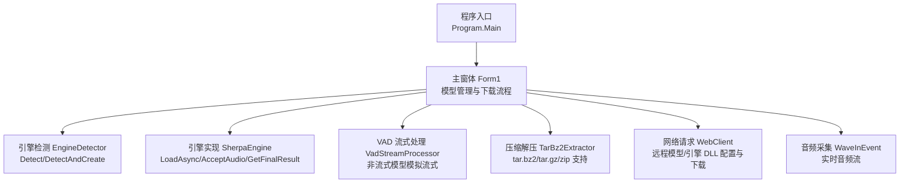
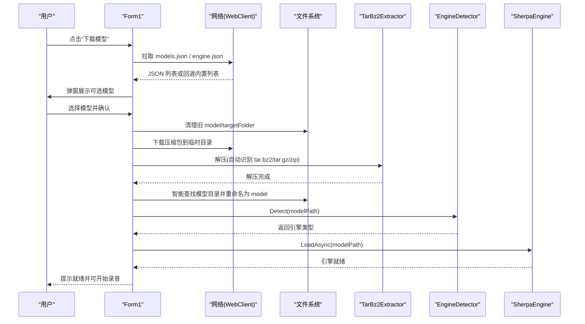
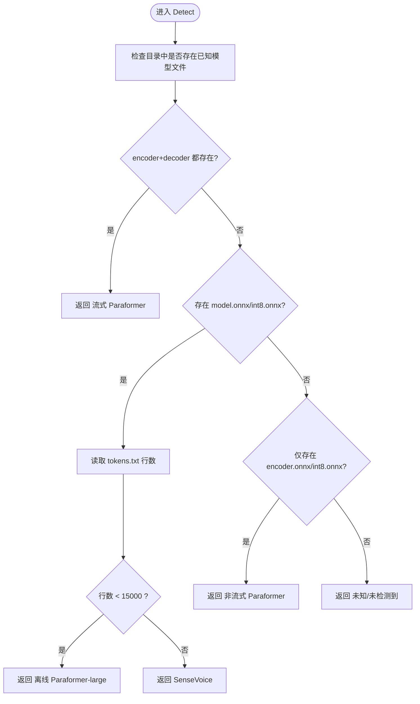
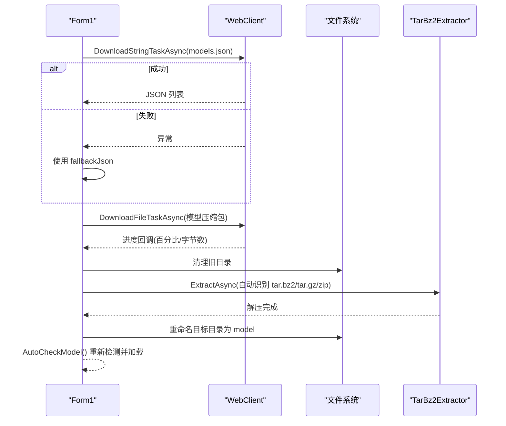
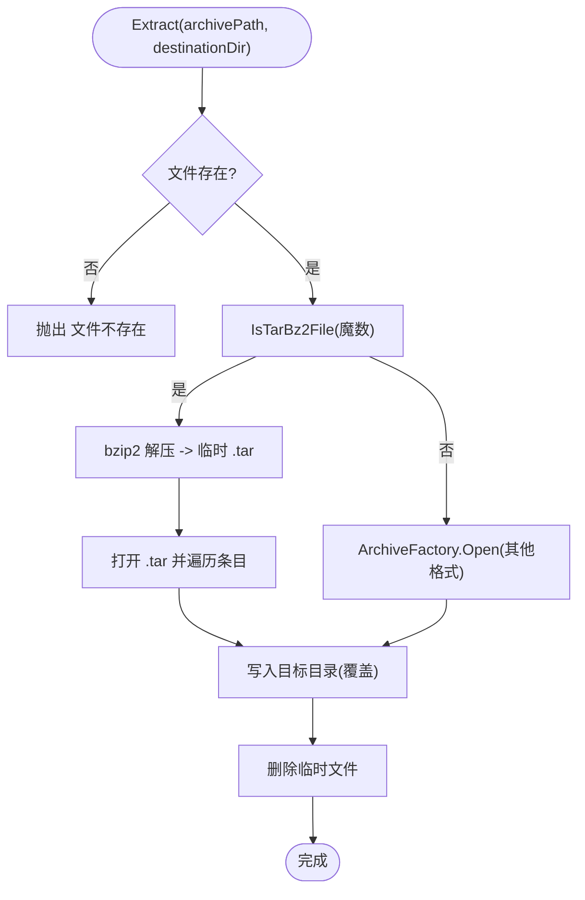
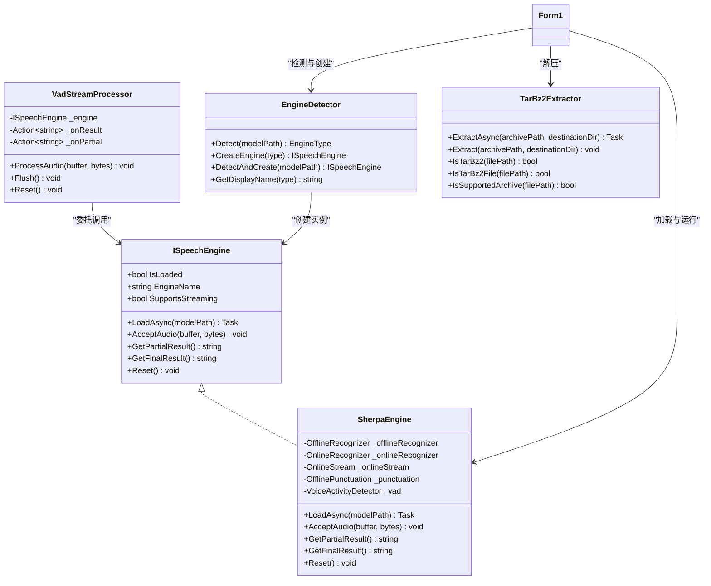

# 模型管理系统

<cite>
**本文引用的文件**   
- [Form1.cs](file://t9s2t/Form1.cs)
- [Program.cs](file://t9s2t/Program.cs)
- [EngineDetector.cs](file://t9s2t/Engines/EngineDetector.cs)
- [ISpeechEngine.cs](file://t9s2t/Engines/ISpeechEngine.cs)
- [SherpaEngine.cs](file://t9s2t/Engines/SherpaEngine.cs)
- [VadStreamProcessor.cs](file://t9s2t/Engines/VadStreamProcessor.cs)
- [TarBz2Extractor.cs](file://t9s2t/Engines/TarBz2Extractor.cs)
</cite>

## 目录
1. [简介](#简介)
2. [项目结构](#项目结构)
3. [核心组件](#核心组件)
4. [架构总览](#架构总览)
5. [详细组件分析](#详细组件分析)
6. [依赖关系分析](#依赖关系分析)
7. [性能与资源管理](#性能与资源管理)
8. [故障排除指南](#故障排除指南)
9. [结论](#结论)
10. [附录：API 参考与扩展指南](#附录api-参考与扩展指南)

## 简介
本系统是一个面向 Windows 的语音识别应用，提供“模型自动检测、远程下载与解压安装、引擎加载与流式/离线识别、键盘钩子触发录音、结果粘贴到前台窗口”等能力。文档聚焦于模型管理子系统，包括：
- 本地模型扫描与元数据解析（通过目录结构与 tokens.txt 行数推断模型类型）
- 版本兼容性检查（基于文件存在性与阈值判断）
- 远程模型下载（网络请求、进度显示、错误恢复与回退列表）
- TarBz2Extractor 压缩工具（tar.bz2 解析、提取与完整性校验思路）
- 模型存储结构与目录组织规范
- 更新策略与增量更新建议
- 缓存与清理策略
- API 参考与扩展开发指南
- 代码示例路径与常见问题排查

## 项目结构
- 入口与 UI 主窗体负责模型管理流程编排、网络请求、UI 交互与音频采集
- Engines 目录包含引擎抽象接口、sherpa-onnx 封装、VAD 流式处理器、压缩解压工具与引擎类型检测器
- Program.cs 设置 TLS 安全协议，确保网络访问可用

图表来源
- [Program.cs:15-24](file://t9s2t/Program.cs#L15-L24)
- [Form1.cs:151-235](file://t9s2t/Form1.cs#L151-L235)
- [EngineDetector.cs:22-120](file://t9s2t/Engines/EngineDetector.cs#L22-L120)
- [SherpaEngine.cs:57-72](file://t9s2t/Engines/SherpaEngine.cs#L57-L72)
- [VadStreamProcessor.cs:28-33](file://t9s2t/Engines/VadStreamProcessor.cs#L28-L33)
- [TarBz2Extractor.cs:17-96](file://t9s2t/Engines/TarBz2Extractor.cs#L17-L96)

章节来源
- [Program.cs:15-24](file://t9s2t/Program.cs#L15-L24)
- [Form1.cs:151-235](file://t9s2t/Form1.cs#L151-L235)

## 核心组件
- 引擎类型枚举与检测器：根据模型目录中的文件组合与 tokens.txt 行数区分 SenseVoice、Paraformer、Paraformer-large、流式 Paraformer
- 引擎抽象接口 ISpeechEngine：统一加载、输入、结果获取与重置
- sherpa-onnx 引擎封装 SherpaEngine：支持多种模型格式、标点恢复、VAD 集成、流式与非流式识别
- VAD 流式处理器 VadStreamProcessor：将非流式模型包装为“静音分段即出字”的类流式体验
- 压缩解压 TarBz2Extractor：原生支持 tar.bz2/tar.gz/zip，无需外部工具
- 主窗体 Form1：模型检测、远程列表拉取、下载与解压、安装到 model 目录、引擎加载与运行

章节来源
- [EngineDetector.cs:10-120](file://t9s2t/Engines/EngineDetector.cs#L10-L120)
- [ISpeechEngine.cs:8-33](file://t9s2t/Engines/ISpeechEngine.cs#L8-L33)
- [SherpaEngine.cs:14-72](file://t9s2t/Engines/SherpaEngine.cs#L14-L72)
- [VadStreamProcessor.cs:12-33](file://t9s2t/Engines/VadStreamProcessor.cs#L12-L33)
- [TarBz2Extractor.cs:17-96](file://t9s2t/Engines/TarBz2Extractor.cs#L17-L96)
- [Form1.cs:608-721](file://t9s2t/Form1.cs#L608-L721)

## 架构总览
系统以 Form1 为中心，协调模型检测、远程下载、解压安装、引擎加载与音频流处理。关键流程如下：

图表来源
- [Form1.cs:724-966](file://t9s2t/Form1.cs#L724-L966)
- [TarBz2Extractor.cs:22-96](file://t9s2t/Engines/TarBz2Extractor.cs#L22-L96)
- [EngineDetector.cs:27-75](file://t9s2t/Engines/EngineDetector.cs#L27-L75)
- [SherpaEngine.cs:57-72](file://t9s2t/Engines/SherpaEngine.cs#L57-L72)

## 详细组件分析

### 模型自动检测机制（本地扫描、元数据解析、版本兼容）
- 检测逻辑
  - 流式 Paraformer：同时存在 encoder.onnx/int8.onnx 与 decoder.onnx/int8.onnx
  - 单 onnx + tokens.txt：通过 tokens.txt 行数区分 SenseVoice 与离线 Paraformer-large（小于阈值判定为 Paraformer-large）
  - 仅 encoder.onnx/int8.onnx：非流式 Paraformer
- 元数据解析
  - 读取 tokens.txt 行数作为“词汇表规模”指标，用于区分多语言大词表与中文大模型
- 版本兼容性
  - 优先使用 int8 量化模型；不存在时回退 fp32
  - 缺失必要文件（如 tokens.txt）抛出异常，阻止错误加载

图表来源
- [EngineDetector.cs:27-75](file://t9s2t/Engines/EngineDetector.cs#L27-L75)
- [SherpaEngine.cs:74-115](file://t9s2t/Engines/SherpaEngine.cs#L74-L115)

章节来源
- [EngineDetector.cs:27-75](file://t9s2t/Engines/EngineDetector.cs#L27-L75)
- [SherpaEngine.cs:74-115](file://t9s2t/Engines/SherpaEngine.cs#L74-L115)

### 远程模型下载功能（网络请求、断点续传、进度显示、错误恢复）
- 网络请求
  - 使用 WebClient 异步拉取 models.json 与 engine.json，设置 User-Agent 与 UTF-8 编码
  - 若远程失败，回退到内置 fallbackJson/fallbackEngineJson
- 进度显示
  - DownloadProgressChanged 事件驱动 ProgressBar 百分比与状态文本更新
- 断点续传
  - 当前实现未启用 Range 头与断点续传；如需增强可改用 HttpClient 并实现分片下载与合并
- 错误恢复
  - 下载失败时清理空大小文件、提示用户重试
  - 解压失败时给出明确错误信息与排查建议
  - 模型安装后自动重新检测并加载引擎

图表来源
- [Form1.cs:818-966](file://t9s2t/Form1.cs#L818-L966)
- [TarBz2Extractor.cs:22-96](file://t9s2t/Engines/TarBz2Extractor.cs#L22-L96)

章节来源
- [Form1.cs:818-966](file://t9s2t/Form1.cs#L818-L966)

### TarBz2Extractor 压缩文件解压工具（tar.bz2 解析、文件提取、完整性验证）
- 支持格式
  - tar.bz2/tbz2、tar.gz/tgz、zip
- 解析流程
  - 通过魔数判断是否为 bzip2；若是则先解压 bzip2 得到 .tar，再解 tar
  - 其他格式直接通过 ArchiveFactory 打开并遍历条目写入目标目录
- 完整性验证
  - 当前实现未进行哈希校验；可在下载完成后计算 SHA-256 并与服务器提供的校验值比对
- 注意事项
  - 临时 tar 文件在 finally 中删除，避免残留

图表来源
- [TarBz2Extractor.cs:30-96](file://t9s2t/Engines/TarBz2Extractor.cs#L30-L96)
- [TarBz2Extractor.cs:112-127](file://t9s2t/Engines/TarBz2Extractor.cs#L112-L127)

章节来源
- [TarBz2Extractor.cs:30-96](file://t9s2t/Engines/TarBz2Extractor.cs#L30-L96)
- [TarBz2Extractor.cs:112-127](file://t9s2t/Engines/TarBz2Extractor.cs#L112-L127)

### 模型存储结构与目录组织规范
- 根目录约定
  - 模型目录固定为 “model”
- 模型文件要求
  - SenseVoice：model.int8.onnx 或 model.onnx + tokens.txt
  - 离线 Paraformer-large：同上，tokens.txt 行数较小
  - 非流式 Paraformer：encoder.int8.onnx 或 encoder.onnx + tokens.txt
  - 流式 Paraformer：encoder.int8.onnx + decoder.int8.onnx + tokens.txt
  - 可选增强：punc.onnx/punc.int8.onnx（标点）、vad.onnx（VAD）
- 安装流程
  - 下载压缩包到临时目录
  - 解压后智能查找包含上述文件的目录，并重命名为 “model”

章节来源
- [Form1.cs:903-956](file://t9s2t/Form1.cs#L903-L956)
- [EngineDetector.cs:32-75](file://t9s2t/Engines/EngineDetector.cs#L32-L75)
- [SherpaEngine.cs:129-216](file://t9s2t/Engines/SherpaEngine.cs#L129-L216)

### 模型更新策略与增量更新机制
- 当前策略
  - 每次下载前清理旧的 model 与 targetFolder，然后全量解压并覆盖
- 增量更新建议
  - 引入版本字段与变更清单（新增/修改/删除的文件列表）
  - 下载差异包，按清单执行增删改
  - 下载前后进行哈希校验，失败则回滚
  - 保留上一版本快照以便快速回滚

[本节为概念性说明，不直接分析具体文件]

### 模型缓存与清理策略（存储空间管理、过期模型删除）
- 当前实现
  - 无持久化缓存索引；下载前直接删除旧目录
- 建议策略
  - 维护模型清单与最后使用时间戳
  - 定期扫描并删除长时间未使用的模型
  - 限制最大磁盘占用，超过阈值时按 LRU 淘汰
  - 对大型模型采用懒加载与按需卸载

[本节为概念性说明，不直接分析具体文件]

## 依赖关系分析

图表来源
- [ISpeechEngine.cs:8-33](file://t9s2t/Engines/ISpeechEngine.cs#L8-L33)
- [SherpaEngine.cs:14-72](file://t9s2t/Engines/SherpaEngine.cs#L14-L72)
- [VadStreamProcessor.cs:12-33](file://t9s2t/Engines/VadStreamProcessor.cs#L12-L33)
- [EngineDetector.cs:22-120](file://t9s2t/Engines/EngineDetector.cs#L22-L120)
- [TarBz2Extractor.cs:17-96](file://t9s2t/Engines/TarBz2Extractor.cs#L17-L96)
- [Form1.cs:608-721](file://t9s2t/Form1.cs#L608-L721)

章节来源
- [ISpeechEngine.cs:8-33](file://t9s2t/Engines/ISpeechEngine.cs#L8-L33)
- [SherpaEngine.cs:14-72](file://t9s2t/Engines/SherpaEngine.cs#L14-L72)
- [VadStreamProcessor.cs:12-33](file://t9s2t/Engines/VadStreamProcessor.cs#L12-L33)
- [EngineDetector.cs:22-120](file://t9s2t/Engines/EngineDetector.cs#L22-L120)
- [TarBz2Extractor.cs:17-96](file://t9s2t/Engines/TarBz2Extractor.cs#L17-L96)
- [Form1.cs:608-721](file://t9s2t/Form1.cs#L608-L721)

## 性能与资源管理
- 线程与并发
  - 引擎加载与解压使用异步任务，避免阻塞 UI
  - 音频数据处理使用锁保护剪贴板与键盘模拟，防止竞态
- 内存与缓冲
  - 非流式模式累积音频缓冲区，注意控制长度以避免过大内存占用
  - 流式模式逐帧送入，降低峰值内存
- I/O 优化
  - 解压过程尽量顺序写入，避免频繁小文件操作
  - 临时文件及时清理，减少磁盘碎片
- 网络
  - 设置 TLS 1.2/1.1/1.0 兼容，提升连接成功率
  - 建议后续增加超时与重试策略

[本节为通用指导，不直接分析具体文件]

## 故障排除指南
- 无法识别模型类型
  - 检查 model 目录是否包含 tokens.txt 与对应 onnx 文件
  - 查看引擎加载日志输出，确认是否缺少必要文件
- 下载失败
  - 检查网络连接与证书（TLS），确认 URL 有效
  - 查看状态栏错误信息，必要时手动重试
- 解压失败
  - 确认压缩包格式正确（tar.bz2/tar.gz/zip）
  - 解压后是否包含 tokens.txt 与相应 onnx 文件
- 流式识别卡顿或误触发
  - 调整端点检测参数（静音阈值、最小尾随静音时长、最小语句长度）
  - 检查麦克风增益与环境噪音
- 结果粘贴异常
  - 确认前台窗口句柄获取正常，避免 Alt 键干扰
  - 观察剪贴板是否被其他进程占用

章节来源
- [Form1.cs:645-721](file://t9s2t/Form1.cs#L645-L721)
- [Form1.cs:957-966](file://t9s2t/Form1.cs#L957-L966)
- [SherpaEngine.cs:259-347](file://t9s2t/Engines/SherpaEngine.cs#L259-L347)

## 结论
本系统在模型管理方面实现了从远程列表拉取、下载解压、目录规范化到引擎自动检测与加载的完整闭环。通过 tokens.txt 行数与文件组合进行模型类型推断，结合流式与非流式两种识别路径，兼顾了易用性与性能。后续可在断点续传、增量更新、完整性校验与缓存策略方面进一步增强，以提升鲁棒性与用户体验。

[本节为总结，不直接分析具体文件]

## 附录：API 参考与扩展指南

### 引擎接口 ISpeechEngine
- 属性
  - IsLoaded：是否已加载就绪
  - EngineName：引擎显示名称
  - SupportsStreaming：是否支持流式识别
- 方法
  - LoadAsync(modelPath)：异步加载模型
  - AcceptAudio(buffer, bytes)：送入音频数据
  - GetPartialResult()：获取部分结果（流式）
  - GetFinalResult()：获取最终结果
  - Reset()：重置识别器状态

章节来源
- [ISpeechEngine.cs:8-33](file://t9s2t/Engines/ISpeechEngine.cs#L8-L33)

### 引擎检测 EngineDetector
- 方法
  - Detect(modelPath)：检测模型类型
  - CreateEngine(type)：根据类型创建引擎实例
  - DetectAndCreate(modelPath)：一步到位检测并创建
  - GetDisplayName(type)：获取显示名称

章节来源
- [EngineDetector.cs:27-120](file://t9s2t/Engines/EngineDetector.cs#L27-L120)

### sherpa-onnx 引擎 SherpaEngine
- 关键流程
  - LoadAsync：检测模型类型，加载离线/流式模型，可选加载标点与 VAD
  - AcceptAudio：流式模式下送入波形，非流式模式下累积缓冲区
  - GetPartialResult/GetFinalResult：分别返回中间与最终结果
  - Reset：重置状态与内部流
- 扩展点
  - 自定义端点检测参数
  - 集成更多增强模型（如降噪、说话人分离）

章节来源
- [SherpaEngine.cs:57-72](file://t9s2t/Engines/SherpaEngine.cs#L57-L72)
- [SherpaEngine.cs:351-479](file://t9s2t/Engines/SherpaEngine.cs#L351-L479)

### VAD 流式处理器 VadStreamProcessor
- 作用
  - 将非流式模型包装为“静音分段即出字”的类流式体验
- 关键方法
  - ProcessAudio：按能量阈值检测语音/静音，积累片段并在静音段提交识别
  - Flush：强制提交当前片段
  - Reset：重置状态

章节来源
- [VadStreamProcessor.cs:28-112](file://t9s2t/Engines/VadStreamProcessor.cs#L28-L112)

### 压缩解压 TarBz2Extractor
- 方法
  - Extract/ExtractAsync：解压到指定目录
  - IsTarBz2/IsTarBz2File：判断 tar.bz2 格式（扩展名与魔数）
  - IsSupportedArchive：判断支持的压缩格式
- 完整性验证建议
  - 在下载完成后计算 SHA-256 并与服务器提供的校验值比对

章节来源
- [TarBz2Extractor.cs:22-96](file://t9s2t/Engines/TarBz2Extractor.cs#L22-L96)
- [TarBz2Extractor.cs:132-140](file://t9s2t/Engines/TarBz2Extractor.cs#L132-L140)

### 主窗体 Form1 模型管理 API
- 模型列表
  - FetchModelsAsync：拉取远程 models.json，失败回退内置列表
- 下载与安装
  - StartDownloadProcess：启动下载流程
  - DownloadWithProgress：带进度下载的完整流程（清理、下载、解压、重命名）
- 引擎加载
  - AutoCheckModel：检测引擎 DLL 与模型，加载引擎并更新 UI
  - LoadEngine：创建并加载引擎，配置流式/非流式处理路径

章节来源
- [Form1.cs:818-966](file://t9s2t/Form1.cs#L818-L966)
- [Form1.cs:608-721](file://t9s2t/Form1.cs#L608-L721)

### 扩展开发指南
- 新增模型类型
  - 在 EngineDetector.Detect 中添加新的文件组合判断
  - 在 SherpaEngine.LoadAsync 中实现对应的加载逻辑
- 增强下载能力
  - 替换 WebClient 为 HttpClient，实现断点续传与分片下载
  - 增加下载校验（SHA-256）与失败重试
- 改进缓存与清理
  - 引入模型清单数据库或 JSON 索引，记录版本、大小、更新时间
  - 实现 LRU 淘汰与空间上限控制
- 提升稳定性
  - 增加更详细的日志与错误码
  - 完善异常恢复与用户提示

[本节为概念性说明，不直接分析具体文件]