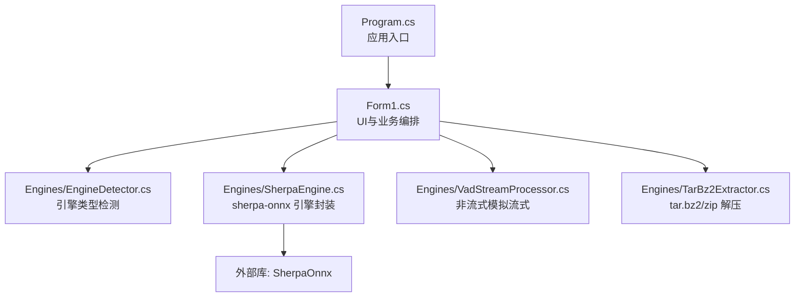
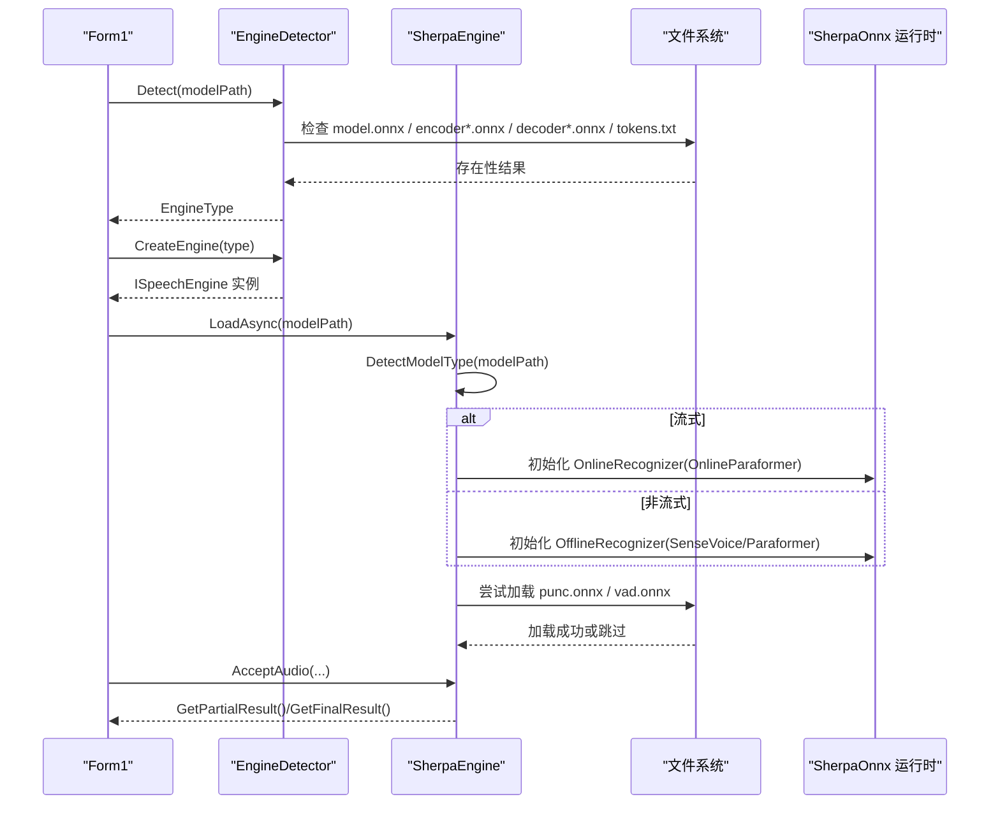
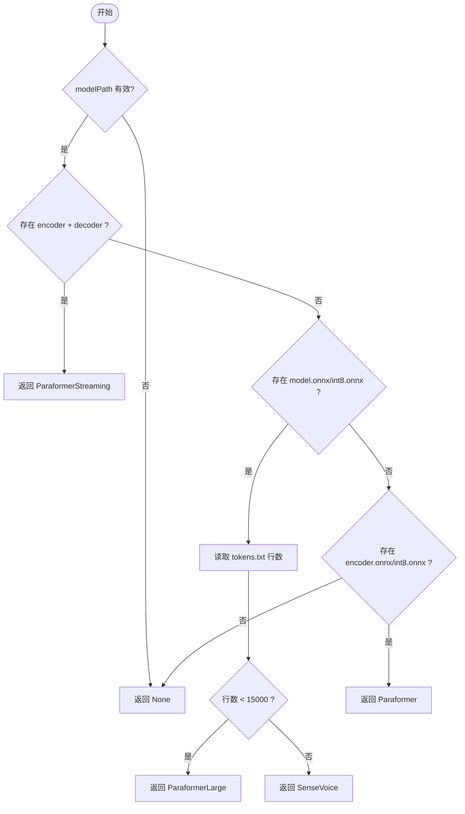
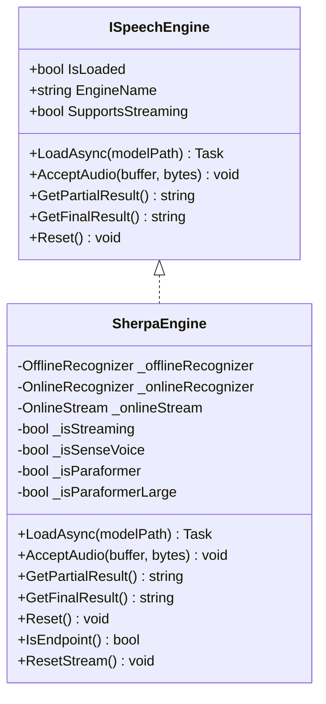
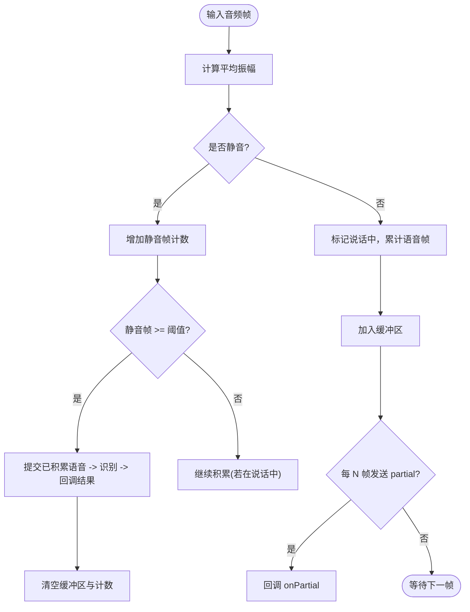
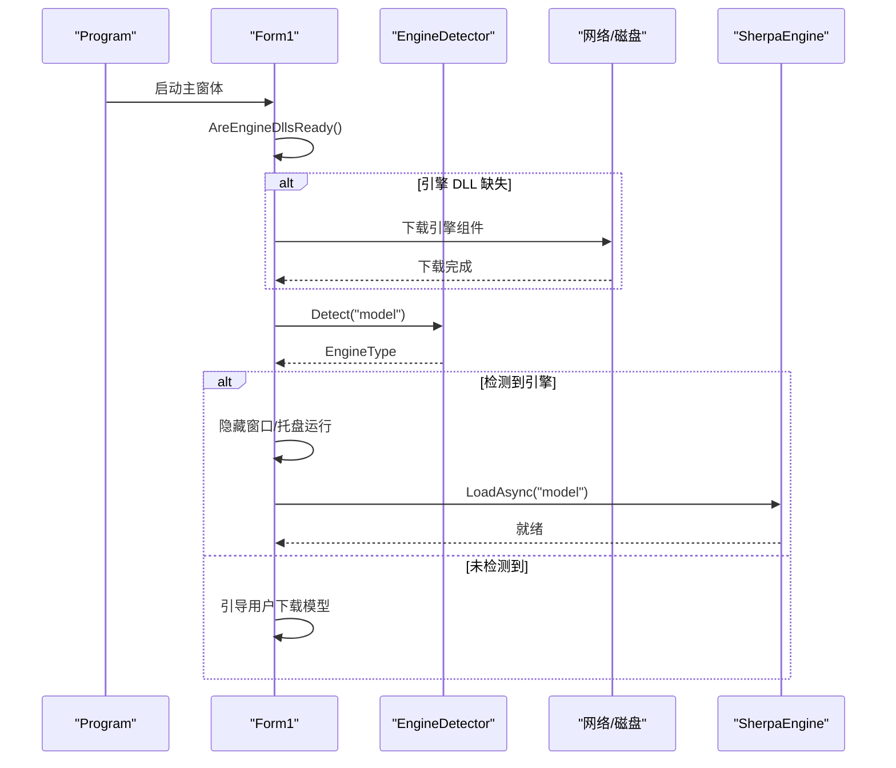
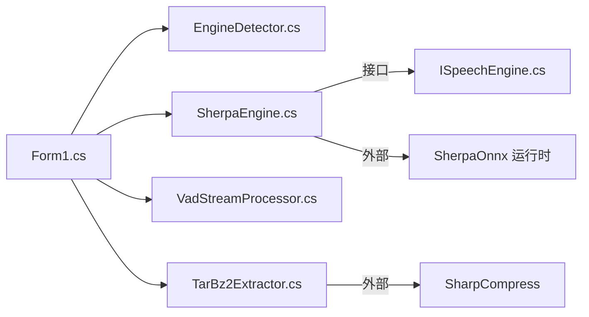

# 模型自动检测

<cite>
**本文引用的文件**   
- [EngineDetector.cs](file://t9s2t/Engines/EngineDetector.cs)
- [ISpeechEngine.cs](file://t9s2t/Engines/ISpeechEngine.cs)
- [SherpaEngine.cs](file://t9s2t/Engines/SherpaEngine.cs)
- [VadStreamProcessor.cs](file://t9s2t/Engines/VadStreamProcessor.cs)
- [TarBz2Extractor.cs](file://t9s2t/Engines/TarBz2Extractor.cs)
- [Form1.cs](file://t9s2t/Form1.cs)
- [Program.cs](file://t9s2t/Program.cs)
</cite>

## 目录
1. [简介](#简介)
2. [项目结构](#项目结构)
3. [核心组件](#核心组件)
4. [架构总览](#架构总览)
5. [详细组件分析](#详细组件分析)
6. [依赖关系分析](#依赖关系分析)
7. [性能与缓存策略](#性能与缓存策略)
8. [故障排查指南](#故障排查指南)
9. [结论](#结论)
10. [附录：API 参考与使用示例](#附录api-参考与使用示例)

## 简介
本技术文档聚焦于“模型自动检测”能力，围绕本地模型扫描机制、引擎类型识别、模型加载流程、发现策略、信息提取、错误处理与异常恢复、以及性能优化与缓存策略进行系统化说明。该功能通过检查模型目录中的关键文件（如 model.onnx、encoder.int8.onnx、decoder.int8.onnx、tokens.txt 等）来推断模型类型并创建对应的推理引擎实例，从而支持多种 sherpa-onnx 模型（SenseVoice、离线 Paraformer、离线 Paraformer-large、流式 Paraformer）。

## 项目结构
本项目采用分层组织方式：
- 引擎抽象与实现位于 Engines 目录，包含接口定义、引擎封装、VAD 流式处理器、压缩解压工具等。
- UI 层 Form1 负责用户交互、模型下载与安装、自动检测与加载、录音与结果输出。
- Program 为应用入口，设置 TLS 安全协议并启动主窗体。

图表来源
- [Program.cs:1-27](file://t9s2t/Program.cs#L1-L27)
- [Form1.cs:1-120](file://t9s2t/Form1.cs#L1-L120)
- [EngineDetector.cs:1-122](file://t9s2t/Engines/EngineDetector.cs#L1-L122)
- [SherpaEngine.cs:1-120](file://t9s2t/Engines/SherpaEngine.cs#L1-L120)
- [VadStreamProcessor.cs:1-60](file://t9s2t/Engines/VadStreamProcessor.cs#L1-L60)
- [TarBz2Extractor.cs:1-60](file://t9s2t/Engines/TarBz2Extractor.cs#L1-L60)

章节来源
- [Program.cs:1-27](file://t9s2t/Program.cs#L1-L27)
- [Form1.cs:1-120](file://t9s2t/Form1.cs#L1-L120)

## 核心组件
- 引擎类型枚举与检测器：提供基于目录结构的引擎类型判断与工厂方法。
- 语音引擎接口：统一加载、音频输入、部分/最终结果获取、重置等能力。
- sherpa-onnx 引擎封装：根据模型类型选择在线/离线识别路径，并可选加载标点与 VAD 模型。
- VAD 流式处理器：将非流式模型（如 SenseVoice）模拟为流式行为。
- 压缩解压工具：支持 tar.bz2、zip 等格式，用于模型包解压。
- UI 编排：负责模型发现、下载、安装、自动检测与加载、录音与结果粘贴。

章节来源
- [EngineDetector.cs:1-122](file://t9s2t/Engines/EngineDetector.cs#L1-L122)
- [ISpeechEngine.cs:1-35](file://t9s2t/Engines/ISpeechEngine.cs#L1-L35)
- [SherpaEngine.cs:1-120](file://t9s2t/Engines/SherpaEngine.cs#L1-L120)
- [VadStreamProcessor.cs:1-60](file://t9s2t/Engines/VadStreamProcessor.cs#L1-L60)
- [TarBz2Extractor.cs:1-60](file://t9s2t/Engines/TarBz2Extractor.cs#L1-L60)
- [Form1.cs:600-720](file://t9s2t/Form1.cs#L600-L720)

## 架构总览
下图展示了从 UI 到引擎的调用链路与数据流向，包括模型检测、引擎创建、模型加载、音频输入与结果返回。

图表来源
- [Form1.cs:608-721](file://t9s2t/Form1.cs#L608-L721)
- [EngineDetector.cs:27-104](file://t9s2t/Engines/EngineDetector.cs#L27-L104)
- [SherpaEngine.cs:57-115](file://t9s2t/Engines/SherpaEngine.cs#L57-L115)
- [SherpaEngine.cs:119-255](file://t9s2t/Engines/SherpaEngine.cs#L119-L255)

## 详细组件分析

### 引擎类型检测与创建（EngineDetector）
- 检测规则优先级：
  - 流式 Paraformer：同时存在 encoder.onnx/int8.onnx 与 decoder.onnx/int8.onnx。
  - 单模型 onnx：存在 model.onnx/int8.onnx 时，读取 tokens.txt 行数区分：
    - 小于阈值（约 15000）视为离线 Paraformer-large。
    - 否则视为 SenseVoice。
  - 仅 encoder.onnx/int8.onnx：非流式 Paraformer。
  - 其他情况返回 None。
- 工厂方法：根据 EngineType 创建对应 ISpeechEngine 实例（当前均为 SherpaEngine，通过 streaming 参数区分流式与非流式）。
- 显示名称映射：便于 UI 展示。

图表来源
- [EngineDetector.cs:27-75](file://t9s2t/Engines/EngineDetector.cs#L27-L75)

章节来源
- [EngineDetector.cs:1-122](file://t9s2t/Engines/EngineDetector.cs#L1-L122)

### 语音引擎接口（ISpeechEngine）
- 职责：统一暴露加载、音频输入、部分/最终结果、重置与资源释放等能力。
- 关键属性与方法：
  - IsLoaded、EngineName、SupportsStreaming
  - LoadAsync(modelPath)、AcceptAudio(buffer, bytes)
  - GetPartialResult()、GetFinalResult()、Reset()、Dispose()

章节来源
- [ISpeechEngine.cs:1-35](file://t9s2t/Engines/ISpeechEngine.cs#L1-L35)

### sherpa-onnx 引擎封装（SherpaEngine）
- 模型类型二次判定：在 LoadAsync 中再次确认模型类型，决定走 OnlineRecognizer 还是 OfflineRecognizer。
- 离线模式：
  - SenseVoice：配置 OfflineSenseVoiceModelConfig，指定 model.int8.onnx 与 tokens.txt。
  - 离线 Paraformer-large：优先 model.int8.onnx，回退 model.onnx；配置 OfflineParaformerModelConfig。
  - 非流式 Paraformer：使用 encoder.int8.onnx 作为模型文件。
- 流式模式：
  - 配置 OnlineParaformerModelConfig，指定 encoder 与 decoder 文件，开启端点检测与静音规则。
- 可选增强：
  - 标点恢复：若存在 punc.onnx 或 punc.int8.onnx，则加载 OfflinePunctuation。
  - VAD：若存在 vad.onnx，则加载 SileroVad 模型。
- 音频输入与结果：
  - 流式：AcceptAudio 送入 OnlineStream，GetPartialResult 实时解码，GetFinalResult 结束流后收尾并可选标点恢复。
  - 非流式：累积音频缓冲，GetFinalResult 一次性识别并可选标点恢复。
- 静音与端点：
  - 流式模式下内置 RMS 音量阈值与连续静音计数，避免静音幻觉。
  - 提供 IsEndpoint 与 ResetStream 辅助分句。

图表来源
- [ISpeechEngine.cs:1-35](file://t9s2t/Engines/ISpeechEngine.cs#L1-L35)
- [SherpaEngine.cs:14-115](file://t9s2t/Engines/SherpaEngine.cs#L14-L115)
- [SherpaEngine.cs:119-255](file://t9s2t/Engines/SherpaEngine.cs#L119-L255)
- [SherpaEngine.cs:351-479](file://t9s2t/Engines/SherpaEngine.cs#L351-L479)

章节来源
- [SherpaEngine.cs:1-608](file://t9s2t/Engines/SherpaEngine.cs#L1-L608)

### VAD 流式处理器（VadStreamProcessor）
- 目标：为非流式模型（如 SenseVoice）模拟流式体验。
- 原理：计算帧能量，当检测到持续静音达到阈值时，提交已积累的语音片段进行识别，并回调结果。
- 参数：
  - 静音阈值、分段静音帧数、最小语音帧数。
- 回调：
  - onResult：识别完成文字。
  - onPartial：可选中间提示。

图表来源
- [VadStreamProcessor.cs:38-101](file://t9s2t/Engines/VadStreamProcessor.cs#L38-L101)

章节来源
- [VadStreamProcessor.cs:1-162](file://t9s2t/Engines/VadStreamProcessor.cs#L1-L162)

### 压缩解压工具（TarBz2Extractor）
- 支持格式：tar.bz2、tbz2、zip、tar.gz、tgz。
- 检测方式：
  - 扩展名判断。
  - 魔数判断（bzip2 头 'B' 'Z' 'h'）。
- 解压流程：
  - tar.bz2：先解 bzip2 得到 .tar，再解 tar。
  - 其他格式：直接解压。

章节来源
- [TarBz2Extractor.cs:1-143](file://t9s2t/Engines/TarBz2Extractor.cs#L1-L143)

### UI 编排与模型发现（Form1）
- 默认模型路径：程序根目录下名为 "model" 的文件夹。
- 自动检测流程：
  - 启动时检查引擎 DLL 是否就绪（onnxruntime.dll、sherpa-onnx-c-api.dll）。
  - 若就绪，调用 EngineDetector.Detect(modelPath) 进行类型检测。
  - 若检测到已知引擎，隐藏窗口进入托盘后台运行，并异步加载引擎。
- 动态模型列表与下载：
  - 远程 JSON 列表（含 name、url、folder、size_hint、version、published 等字段），失败时使用内置备用列表。
  - 下载压缩包后智能解压，自动查找包含 model/encoder/tokens 的目录并重命名为 "model"。
- 加载引擎：
  - 使用 EngineDetector.DetectAndCreate(modelPath) 创建引擎实例。
  - 根据 SupportsStreaming 决定是否启用 VadStreamProcessor。
  - 显示引擎名称、是否支持流式、是否加载了标点与 VAD。

图表来源
- [Program.cs:15-24](file://t9s2t/Program.cs#L15-L24)
- [Form1.cs:151-235](file://t9s2t/Form1.cs#L151-L235)
- [Form1.cs:608-721](file://t9s2t/Form1.cs#L608-L721)
- [Form1.cs:818-966](file://t9s2t/Form1.cs#L818-L966)

章节来源
- [Form1.cs:1-1318](file://t9s2t/Form1.cs#L1-L1318)

## 依赖关系分析
- 组件耦合：
  - Form1 依赖 EngineDetector 与 SherpaEngine，并通过 ISpeechEngine 接口解耦具体实现。
  - SherpaEngine 依赖外部 SherpaOnnx 运行时与系统文件 I/O。
  - VadStreamProcessor 依赖 ISpeechEngine 以复用其识别能力。
  - TarBz2Extractor 被 Form1 用于解压模型包。
- 潜在循环依赖：无直接循环引用。
- 外部依赖：
  - SherpaOnnx（C API 封装）
  - SharpCompress（tar.bz2/zip 解压）
  - Newtonsoft.Json（JSON 解析）
  - NAudio.Wave（录音）

图表来源
- [Form1.cs:1-120](file://t9s2t/Form1.cs#L1-L120)
- [EngineDetector.cs:1-122](file://t9s2t/Engines/EngineDetector.cs#L1-L122)
- [SherpaEngine.cs:1-120](file://t9s2t/Engines/SherpaEngine.cs#L1-L120)
- [VadStreamProcessor.cs:1-60](file://t9s2t/Engines/VadStreamProcessor.cs#L1-L60)
- [TarBz2Extractor.cs:1-60](file://t9s2t/Engines/TarBz2Extractor.cs#L1-L60)

章节来源
- [Form1.cs:1-120](file://t9s2t/Form1.cs#L1-L120)
- [EngineDetector.cs:1-122](file://t9s2t/Engines/EngineDetector.cs#L1-L122)
- [SherpaEngine.cs:1-120](file://t9s2t/Engines/SherpaEngine.cs#L1-L120)
- [VadStreamProcessor.cs:1-60](file://t9s2t/Engines/VadStreamProcessor.cs#L1-L60)
- [TarBz2Extractor.cs:1-60](file://t9s2t/Engines/TarBz2Extractor.cs#L1-L60)

## 性能与缓存策略
- 模型加载与线程：
  - LoadAsync 内部使用 Task.Run 执行耗时操作，避免阻塞 UI 线程。
- 流式识别优化：
  - 流式模式使用端点检测与静音规则减少误触发，平衡出字速度与吞字问题。
  - 非流式模式累积整段音频，适合长句识别（如 Paraformer-large）。
- 标点与 VAD 可选加载：
  - 仅在存在相应模型文件时加载，降低内存占用与启动时间。
- 节流与去重：
  - partial 结果更新有最小间隔与文本去重，避免频繁 UI 刷新与剪贴板操作。
- 缓存建议（通用指导）：
  - 对 tokens.txt 的行数统计可考虑缓存结果，避免重复 IO（当前实现每次检测都会读取）。
  - 对模型元数据（如 EngineName、SupportsStreaming）可在引擎实例内缓存，避免重复判断。
  - 对于远程模型列表与引擎 DLL 清单，可增加本地缓存与版本校验以减少网络请求。

[本节为通用性能讨论，不直接分析具体代码文件]

## 故障排查指南
- 常见错误与定位：
  - 引擎 DLL 缺失：检查 onnxruntime.dll 与 sherpa-onnx-c-api.dll 是否存在且大小大于 0。
  - 模型未找到：确认 "model" 目录存在且包含 model.onnx/int8.onnx 或 encoder*.onnx 与 tokens.txt。
  - 模型类型无法识别：检查文件命名是否符合约定（如 tokens.txt 必须存在）。
  - 标点/VAD 加载失败：查看调试输出，确认 punc.onnx/vad.onnx 路径正确。
- 异常恢复：
  - 网络请求失败时自动回退到内置备用列表。
  - 下载失败会清理不完整文件并提示重试。
  - 识别过程中捕获异常并记录日志，保证程序稳定性。

章节来源
- [Form1.cs:468-567](file://t9s2t/Form1.cs#L468-L567)
- [Form1.cs:818-966](file://t9s2t/Form1.cs#L818-L966)
- [SherpaEngine.cs:259-347](file://t9s2t/Engines/SherpaEngine.cs#L259-L347)

## 结论
本项目的模型自动检测通过严格的目录结构与文件约定实现多引擎类型的自动识别与加载，结合流式与非流式两种识别路径，提供了良好的用户体验与可扩展性。通过可选的标点与 VAD 增强、完善的错误处理与回退机制，系统在易用性与稳定性方面表现良好。后续可在缓存策略与远程配置管理上进一步优化，以提升性能与可维护性。

[本节为总结，不直接分析具体代码文件]

## 附录：API 参考与使用示例

### 引擎类型检测 API
- 方法
  - Detect(string modelPath): 返回 EngineType。
  - CreateEngine(EngineType type): 返回 ISpeechEngine 实例。
  - DetectAndCreate(string modelPath): 一步到位检测并创建引擎。
  - GetDisplayName(EngineType type): 返回显示名称。
- 使用示例（概念性步骤）：
  - 调用 Detect 判断模型类型。
  - 根据类型调用 CreateEngine 或直接使用 DetectAndCreate。
  - 调用 ISpeechEngine.LoadAsync 加载模型。
  - 录音期间调用 AcceptAudio，按需获取 GetPartialResult 或 GetFinalResult。

章节来源
- [EngineDetector.cs:27-119](file://t9s2t/Engines/EngineDetector.cs#L27-L119)
- [ISpeechEngine.cs:19-33](file://t9s2t/Engines/ISpeechEngine.cs#L19-L33)

### 引擎接口 API
- 属性
  - IsLoaded: 引擎是否已加载就绪。
  - EngineName: 引擎显示名称。
  - SupportsStreaming: 是否支持流式识别。
- 方法
  - LoadAsync(string modelPath): 异步加载模型。
  - AcceptAudio(byte[] buffer, int bytes): 送入音频数据。
  - GetPartialResult(): 获取部分识别结果（流式）。
  - GetFinalResult(): 获取最终识别结果。
  - Reset(): 重置状态。
  - Dispose(): 释放资源。

章节来源
- [ISpeechEngine.cs:1-35](file://t9s2t/Engines/ISpeechEngine.cs#L1-L35)

### 模型发现策略
- 默认路径：程序根目录下的 "model" 文件夹。
- 自定义路径：可通过修改 Form1 中的 modelPath 变量指向其他目录。
- 动态发现：
  - 启动时自动检测模型并加载。
  - 支持从远程 JSON 获取最新模型列表，失败时回退到内置备用列表。
  - 下载完成后智能解压并自动重命名为 "model"。

章节来源
- [Form1.cs:26](file://t9s2t/Form1.cs#L26)
- [Form1.cs:608-721](file://t9s2t/Form1.cs#L608-L721)
- [Form1.cs:818-966](file://t9s2t/Form1.cs#L818-L966)

### 模型信息提取过程
- 配置文件解析：
  - 远程 JSON 列表包含 name、description、url、folder、size_hint、version、published 等字段。
  - 内置备用 JSON 作为网络不可用时的回退。
- 模型类型识别：
  - 依据文件存在性与 tokens.txt 行数进行区分。
- 属性读取：
  - EngineName、SupportsStreaming、HasPunctuation、HasVad 等由引擎实例提供。

章节来源
- [Form1.cs:129-142](file://t9s2t/Form1.cs#L129-L142)
- [Form1.cs:818-851](file://t9s2t/Form1.cs#L818-L851)
- [SherpaEngine.cs:42-46](file://t9s2t/Engines/SherpaEngine.cs#L42-L46)

### 错误处理与异常恢复
- 引擎 DLL 下载失败：清理不完整文件并提示重试。
- 模型下载/解压失败：给出明确错误信息与排查建议。
- 识别异常：捕获并记录日志，返回空结果以保证稳定。
- 网络请求失败：回退到本地备用列表。

章节来源
- [Form1.cs:510-567](file://t9s2t/Form1.cs#L510-L567)
- [Form1.cs:876-966](file://t9s2t/Form1.cs#L876-L966)
- [SherpaEngine.cs:286-347](file://t9s2t/Engines/SherpaEngine.cs#L286-L347)