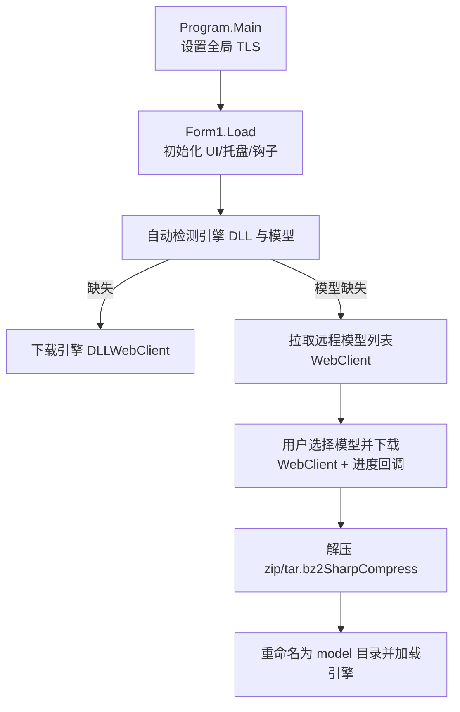
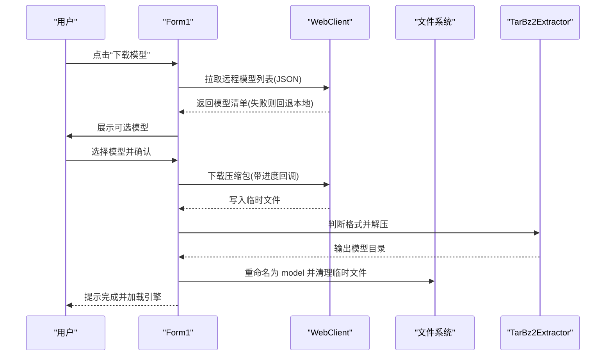
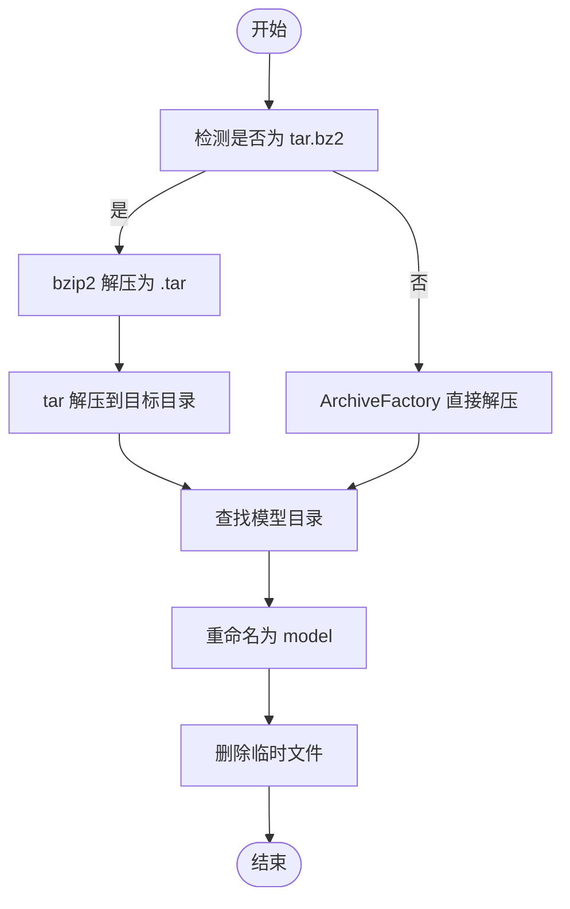
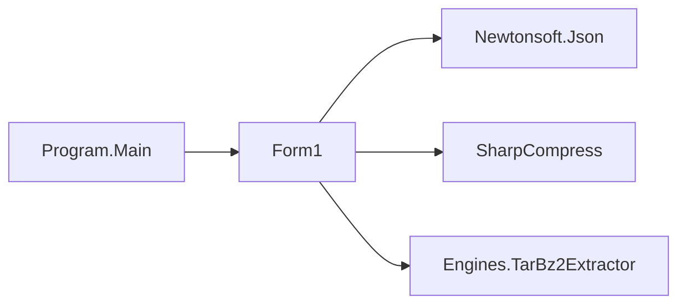

# 远程下载管理

<cite>
**本文引用的文件**   
- [Program.cs](file://t9s2t/Program.cs)
- [Form1.cs](file://t9s2t/Form1.cs)
- [TarBz2Extractor.cs](file://t9s2t/Engines/TarBz2Extractor.cs)
</cite>

## 目录
1. [简介](#简介)
2. [项目结构](#项目结构)
3. [核心组件](#核心组件)
4. [架构总览](#架构总览)
5. [详细组件分析](#详细组件分析)
6. [依赖关系分析](#依赖关系分析)
7. [性能与并发](#性能与并发)
8. [故障排查指南](#故障排查指南)
9. [结论](#结论)
10. [附录：API 参考与集成示例](#附录api-参考与集成示例)

## 简介
本技术文档围绕“远程下载管理”展开，聚焦于语音模型与引擎运行时 DLL 的远程获取、解压安装与状态恢复。文档覆盖网络请求处理机制（TLS、请求头、超时）、断点续传能力现状与扩展建议、进度显示与用户反馈、错误恢复策略、并发控制与资源管理，并提供 API 参考与集成示例，帮助开发者在现有代码基础上进行安全加固与性能调优。

## 项目结构
本项目为 Windows Forms 应用，主流程入口在 Program.Main，UI 与业务逻辑集中在 Form1，压缩解压工具封装在 Engines/TarBz2Extractor。

图表来源
- [Program.cs:16-24](file://t9s2t/Program.cs#L16-L24)
- [Form1.cs:151-235](file://t9s2t/Form1.cs#L151-L235)
- [Form1.cs:510-567](file://t9s2t/Form1.cs#L510-L567)
- [Form1.cs:818-851](file://t9s2t/Form1.cs#L818-L851)
- [Form1.cs:876-966](file://t9s2t/Form1.cs#L876-L966)
- [TarBz2Extractor.cs:17-96](file://t9s2t/Engines/TarBz2Extractor.cs#L17-L96)

章节来源
- [Program.cs:16-24](file://t9s2t/Program.cs#L16-L24)
- [Form1.cs:151-235](file://t9s2t/Form1.cs#L151-L235)

## 核心组件
- 全局 TLS 配置：在程序启动时统一设置支持的 TLS 版本，确保后续所有网络请求兼容现代服务端。
- 引擎 DLL 按需下载：根据远程 JSON 配置或内置备用配置，串行下载所需 DLL 到应用目录。
- 模型列表动态获取：优先从远程 JSON 拉取已发布模型清单，失败则回退至内置备用清单。
- 带进度的模型下载：使用 WebClient 异步下载压缩包，订阅 DownloadProgressChanged 更新 UI；完成后解压并智能定位模型目录。
- 解压工具：基于 SharpCompress 原生支持 zip 与 tar.bz2，无需外部工具。

章节来源
- [Program.cs:16-24](file://t9s2t/Program.cs#L16-L24)
- [Form1.cs:510-567](file://t9s2t/Form1.cs#L510-L567)
- [Form1.cs:818-851](file://t9s2t/Form1.cs#L818-L851)
- [Form1.cs:876-966](file://t9s2t/Form1.cs#L876-L966)
- [TarBz2Extractor.cs:17-96](file://t9s2t/Engines/TarBz2Extractor.cs#L17-L96)

## 架构总览
下图展示了从“点击按钮”到“模型就绪”的关键调用链与数据流。

图表来源
- [Form1.cs:724-817](file://t9s2t/Form1.cs#L724-L817)
- [Form1.cs:818-851](file://t9s2t/Form1.cs#L818-L851)
- [Form1.cs:876-966](file://t9s2t/Form1.cs#L876-L966)
- [TarBz2Extractor.cs:17-96](file://t9s2t/Engines/TarBz2Extractor.cs#L17-L96)

## 详细组件分析

### 网络请求处理机制
- TLS 与安全协议
  - 全局启用 TLS 1.2/1.1/SSL3，保证与多数 HTTPS 服务器兼容。
  - 多处方法内再次设置 TLS，避免被其他线程修改影响。
- 客户端与请求头
  - 使用 System.Net.WebClient 发起 GET 与文件下载。
  - 设置 User-Agent 与 Accept 等常见请求头，便于服务端识别与统计。
- 超时处理
  - 当前未显式设置 Timeout 属性，默认由底层系统决定。
  - 建议在关键路径增加合理超时与重试，提升鲁棒性。
- 编码与 BOM
  - 读取 JSON 时强制 UTF-8，并去除可能的 BOM 字符，避免解析异常。

章节来源
- [Program.cs:16-24](file://t9s2t/Program.cs#L16-L24)
- [Form1.cs:510-567](file://t9s2t/Form1.cs#L510-L567)
- [Form1.cs:818-851](file://t9s2t/Form1.cs#L818-L851)
- [Form1.cs:876-901](file://t9s2t/Form1.cs#L876-L901)

### 断点续传与分块下载
- 现状
  - 当前实现采用 WebClient.DownloadFileTaskAsync 一次性下载，不支持 Range 头与分块断点续传。
- 影响
  - 大文件中断后需从头开始，用户体验与带宽成本不佳。
- 改进建议（概念性）
  - 使用 HttpClient 配合 Range 头实现断点续传。
  - 维护本地“已下载字节范围”元数据，失败后从上次位置继续。
  - 对每个分块计算校验和，确保完整性。
  - 注意：本节为通用设计建议，不直接对应仓库具体实现。

[本节为概念性说明，无源码映射]

### 进度跟踪与用户反馈
- 百分比与总量
  - 通过 DownloadProgressChanged 事件，当 TotalBytesToReceive > 0 时以 Blocks 模式显示百分比。
- 未知总量的降级
  - 当服务端未提供 Content-Length 时，切换为 Marquee 样式，仅显示已下载 MB 数。
- 状态文本
  - 实时更新状态栏，包含百分比、已下载/总量（MB），以及解压阶段提示。
- 预计时间与速度
  - 当前未实现速度与 ETA 估算，可在进度回调中基于时间窗口滑动平均计算。

章节来源
- [Form1.cs:876-901](file://t9s2t/Form1.cs#L876-L901)
- [Form1.cs:912-914](file://t9s2t/Form1.cs#L912-L914)

### 错误恢复策略
- 网络异常
  - 拉取远程列表失败时，自动回退到内置备用 JSON，保障可用性。
  - 下载过程中抛出异常会提示错误信息并恢复按钮状态。
- 重试机制
  - 当前未实现指数退避或最大重试次数。
  - 建议：对网络 I/O 与 JSON 解析分别包装重试策略。
- 降级方案
  - 引擎 DLL 与模型清单均具备本地 fallback，确保离线可用。
- 解压失败
  - 若解压后找不到有效模型目录，抛出明确错误并引导用户检查压缩包。

章节来源
- [Form1.cs:818-851](file://t9s2t/Form1.cs#L818-L851)
- [Form1.cs:958-966](file://t9s2t/Form1.cs#L958-L966)

### 并发下载控制与资源管理
- 并发控制
  - 引擎 DLL 与模型下载均为串行执行，避免竞争与重复下载。
- 连接池
  - 使用 WebClient 共享底层连接池，未做显式限制。
- 内存优化
  - 下载目标位于临时目录，完成后立即解压并删除临时文件，降低磁盘占用峰值。
- 资源释放
  - WebClient 使用 using 语句确保及时释放。

章节来源
- [Form1.cs:510-567](file://t9s2t/Form1.cs#L510-L567)
- [Form1.cs:876-966](file://t9s2t/Form1.cs#L876-L966)

### 解压与安装流程
- 格式识别
  - 先尝试按 tar.bz2 处理（魔数判断），否则走通用 ArchiveFactory 解压。
- 解压策略
  - tar.bz2 先解 bzip2 得到 .tar，再解 tar；其他格式直接解压。
- 目录整理
  - 优先匹配 JSON 中的 folder 名称，其次扫描已知模型文件特征，最终统一重命名为 model。

图表来源
- [TarBz2Extractor.cs:17-96](file://t9s2t/Engines/TarBz2Extractor.cs#L17-L96)
- [Form1.cs:916-955](file://t9s2t/Form1.cs#L916-L955)

章节来源
- [TarBz2Extractor.cs:17-96](file://t9s2t/Engines/TarBz2Extractor.cs#L17-L96)
- [Form1.cs:916-955](file://t9s2t/Form1.cs#L916-L955)

## 依赖关系分析
- 外部库
  - Newtonsoft.Json：JSON 序列化/反序列化。
  - SharpCompress：原生支持 zip/tar.bz2 等归档格式。
  - NAudio：音频采集与流式处理（与下载无关）。
- 内部模块
  - Engines.TarBz2Extractor：解压工具，被 Form1 调用。
  - Form1：集中了下载、解压、安装与 UI 交互。
  - Program：全局 TLS 配置。

图表来源
- [Program.cs:16-24](file://t9s2t/Program.cs#L16-L24)
- [Form1.cs:818-851](file://t9s2t/Form1.cs#L818-L851)
- [TarBz2Extractor.cs:17-96](file://t9s2t/Engines/TarBz2Extractor.cs#L17-L96)

章节来源
- [Program.cs:16-24](file://t9s2t/Program.cs#L16-L24)
- [Form1.cs:818-851](file://t9s2t/Form1.cs#L818-L851)
- [TarBz2Extractor.cs:17-96](file://t9s2t/Engines/TarBz2Extractor.cs#L17-L96)

## 性能与并发
- 连接复用
  - WebClient 内部复用底层连接，减少握手开销。
- 磁盘 I/O
  - 临时文件落盘后再解压，避免内存峰值过高；但大文件场景可考虑边下边解压以降低磁盘占用。
- 进度刷新频率
  - 当前每次回调都刷新 UI，建议节流合并，降低 UI 压力。
- 超时与重试
  - 建议引入可配置的超时与重试策略，结合指数退避与熔断。
- 并发度
  - 当前串行下载有利于稳定性；未来可按资源上限控制并发度，避免拥塞。

[本节为通用指导，不直接分析具体文件]

## 故障排查指南
- 无法获取远程列表
  - 现象：提示“无法获取模型列表”。
  - 排查：检查网络连通性与 DNS；确认远程地址可达；查看是否触发 fallback。
- 下载失败
  - 现象：弹出“下载或解压失败”，并给出排查建议。
  - 排查：链接是否过期；防火墙/代理拦截；Windows 10+ 自带 tar.exe 或安装 7-Zip（针对 tar.bz2）。
- 解压后未找到模型目录
  - 现象：提示“解压后未找到有效的模型目录结构”。
  - 排查：压缩包内容是否符合预期；是否存在已知模型文件；手动解压验证。
- 引擎 DLL 不完整
  - 现象：提示“引擎组件下载不完整”。
  - 排查：逐个校验文件大小；重新下载；检查磁盘空间与权限。

章节来源
- [Form1.cs:818-851](file://t9s2t/Form1.cs#L818-L851)
- [Form1.cs:958-966](file://t9s2t/Form1.cs#L958-L966)
- [Form1.cs:510-567](file://t9s2t/Form1.cs#L510-L567)

## 结论
当前远程下载管理实现了“远程清单 + 本地回退”的高可用策略，并通过 WebClient 与 SharpCompress 完成了模型与引擎 DLL 的下载与解压安装。整体链路清晰、容错良好。下一步重点在于增强断点续传、完善超时与重试、优化进度与速度/ETA 展示，并在高并发场景下做好资源与连接池治理。

[本节为总结，不直接分析具体文件]

## 附录：API 参考与集成示例

### 远程清单接口
- 模型清单
  - 用途：获取已发布模型列表（含名称、描述、下载地址、大小提示、版本等）。
  - 行为：成功返回 JSON 数组；失败回退到内置备用清单。
- 引擎运行时清单
  - 用途：获取所需 DLL 的名称、URL 与描述。
  - 行为：成功返回 JSON 对象包含 engine_runtimes 数组；失败回退到内置备用配置。

章节来源
- [Form1.cs:818-851](file://t9s2t/Form1.cs#L818-L851)
- [Form1.cs:569-599](file://t9s2t/Form1.cs#L569-L599)

### 下载与安装流程（调用序列）
- 步骤
  - 拉取清单 → 用户选择 → 下载压缩包（带进度）→ 解压 → 重命名 → 加载引擎。
- 关键点
  - 进度回调用于 UI 更新；解压失败有明确错误提示；临时文件及时清理。

章节来源
- [Form1.cs:724-817](file://t9s2t/Form1.cs#L724-L817)
- [Form1.cs:876-966](file://t9s2t/Form1.cs#L876-L966)

### 安全与合规建议
- 传输安全
  - 保持 TLS 1.2 及以上；必要时启用证书校验与固定公钥（Pin）。
- 输入校验
  - 对远程 JSON 字段进行白名单校验，防止恶意构造。
- 最小权限
  - 仅授予必要的文件系统写入权限；避免写入系统目录。
- 日志脱敏
  - 记录必要诊断信息，避免泄露敏感路径或密钥。

[本节为通用建议，不直接分析具体文件]

### 性能调优建议
- 超时与重试
  - 为清单与下载分别设置合理的超时与最大重试次数，结合指数退避。
- 进度与 UI 节流
  - 合并 UI 更新，降低频繁刷新带来的卡顿。
- 并发与限速
  - 如需多任务下载，限制最大并发与单任务速率，避免拥塞。
- 缓存与增量
  - 对清单与小型资源实施缓存；对大文件引入断点续传与校验。

[本节为通用建议，不直接分析具体文件]