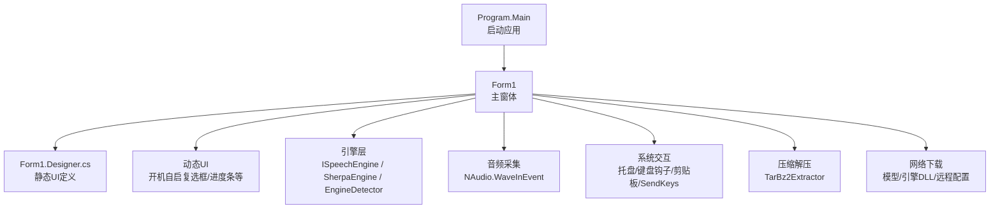
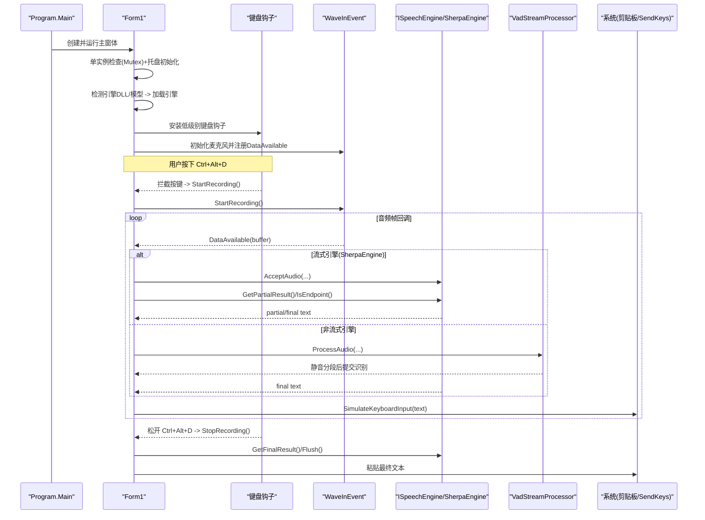
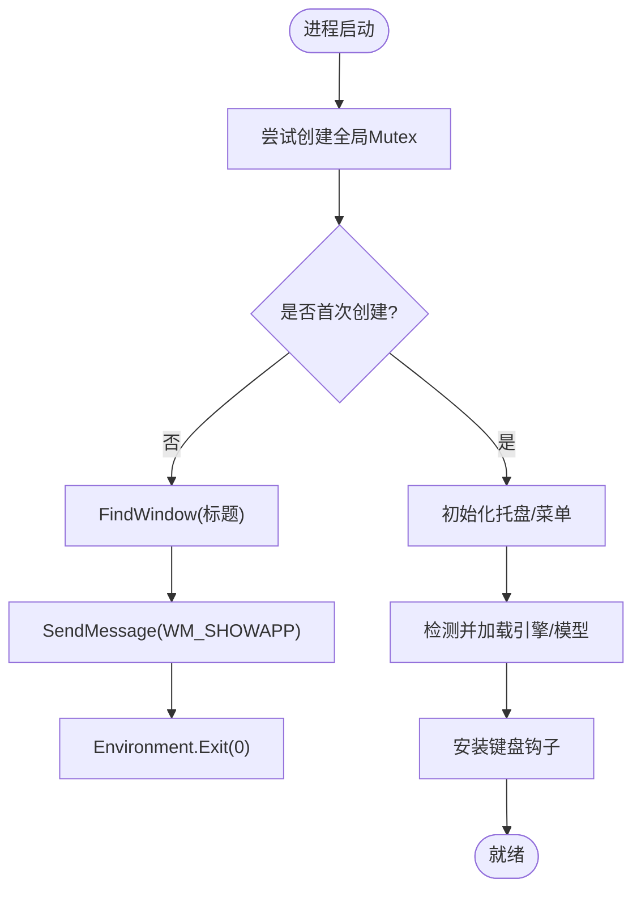
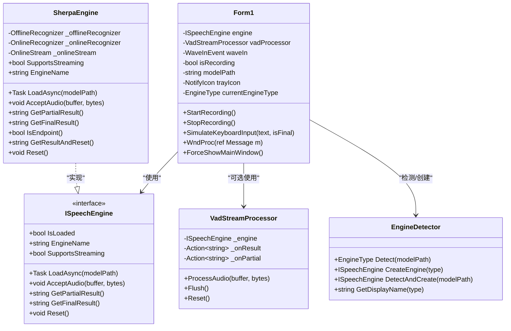
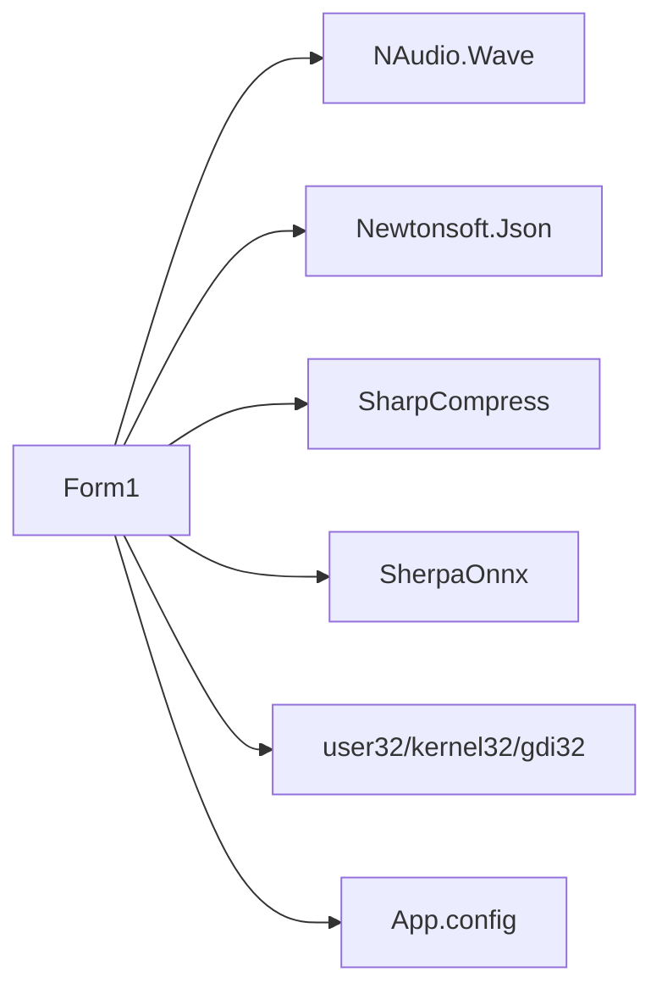

# 主窗体架构设计

<cite>
**本文引用的文件列表**
- [Form1.cs](file://t9s2t/Form1.cs)
- [Form1.Designer.cs](file://t9s2t/Form1.Designer.cs)
- [Program.cs](file://t9s2t/Program.cs)
- [App.config](file://t9s2t/App.config)
- [ISpeechEngine.cs](file://t9s2t/Engines/ISpeechEngine.cs)
- [SherpaEngine.cs](file://t9s2t/Engines/SherpaEngine.cs)
- [EngineDetector.cs](file://t9s2t/Engines/EngineDetector.cs)
- [VadStreamProcessor.cs](file://t9s2t/Engines/VadStreamProcessor.cs)
- [TarBz2Extractor.cs](file://t9s2t/Engines/TarBz2Extractor.cs)
</cite>

## 目录
1. [简介](#简介)
2. [项目结构](#项目结构)
3. [核心组件](#核心组件)
4. [架构总览](#架构总览)
5. [详细组件分析](#详细组件分析)
6. [依赖关系分析](#依赖关系分析)
7. [性能考量](#性能考量)
8. [故障排查指南](#故障排查指南)
9. [结论](#结论)
10. [附录：扩展与定制指南](#附录扩展与定制指南)

## 简介
本技术文档聚焦于主窗体 Form1 的架构设计与实现，涵盖以下关键主题：
- 窗体生命周期管理、事件处理机制与组件初始化流程
- 单实例运行控制（全局 Mutex + 进程间消息唤醒）
- 窗体状态管理（最小化到托盘、窗口置顶与焦点控制）
- 动态控件创建与管理模式（运行时 UI 生成与事件绑定）
- 自定义消息 WM_SHOWAPP 的消息处理机制
- 语音识别引擎集成与流式/非流式处理路径
- 键盘钩子与输入模拟（Ctrl+Alt+D 触发录音、结果粘贴）
- 扩展与定制开发指南（含最佳实践）

## 项目结构
本项目采用 WinForms 应用结构，主入口在 Program.Main，主界面为 Form1。语音识别能力通过 Engines 命名空间下的接口与实现解耦，支持多引擎类型自动检测与加载。UI 由 Designer 生成的控件与运行时动态创建的控件共同组成。

图表来源
- [Program.cs:15-24](file://t9s2t/Program.cs#L15-L24)
- [Form1.cs:144-235](file://t9s2t/Form1.cs#L144-L235)
- [Form1.Designer.cs:29-215](file://t9s2t/Form1.Designer.cs#L29-L215)
- [ISpeechEngine.cs:8-33](file://t9s2t/Engines/ISpeechEngine.cs#L8-L33)
- [SherpaEngine.cs:57-72](file://t9s2t/Engines/SherpaEngine.cs#L57-L72)
- [EngineDetector.cs:27-75](file://t9s2t/Engines/EngineDetector.cs#L27-L75)
- [TarBz2Extractor.cs:22-96](file://t9s2t/Engines/TarBz2Extractor.cs#L22-L96)

章节来源
- [Program.cs:15-24](file://t9s2t/Program.cs#L15-L24)
- [Form1.Designer.cs:29-215](file://t9s2t/Form1.Designer.cs#L29-L215)

## 核心组件
- 主窗体 Form1：负责应用生命周期、单实例控制、托盘、键盘钩子、音频采集、引擎加载、动态 UI、消息处理与输入模拟。
- 引擎抽象 ISpeechEngine：统一识别接口，屏蔽不同引擎差异。
- SherpaEngine：基于 sherpa-onnx 的具体实现，支持 SenseVoice、Paraformer（离线/流式）、标点恢复与 VAD。
- EngineDetector：根据模型目录结构自动识别引擎类型并创建对应引擎实例。
- VadStreamProcessor：对非流式引擎进行“静音分段”以模拟流式体验。
- TarBz2Extractor：跨平台解压工具，支持 tar.bz2、zip 等格式。
- NAudio.WaveInEvent：音频采集回调驱动数据流。
- 系统交互：NotifyIcon、SetWindowsHookEx、SendMessage、SendKeys、剪贴板、前台窗口切换。

章节来源
- [Form1.cs:144-235](file://t9s2t/Form1.cs#L144-L235)
- [ISpeechEngine.cs:8-33](file://t9s2t/Engines/ISpeechEngine.cs#L8-L33)
- [SherpaEngine.cs:57-72](file://t9s2t/Engines/SherpaEngine.cs#L57-L72)
- [EngineDetector.cs:27-75](file://t9s2t/Engines/EngineDetector.cs#L27-L75)
- [VadStreamProcessor.cs:28-86](file://t9s2t/Engines/VadStreamProcessor.cs#L28-L86)
- [TarBz2Extractor.cs:22-96](file://t9s2t/Engines/TarBz2Extractor.cs#L22-L96)

## 架构总览
下图展示了从程序启动到语音识别输出的整体调用链与组件交互。

图表来源
- [Program.cs:15-24](file://t9s2t/Program.cs#L15-L24)
- [Form1.cs:144-235](file://t9s2t/Form1.cs#L144-L235)
- [Form1.cs:415-460](file://t9s2t/Form1.cs#L415-L460)
- [Form1.cs:1057-1111](file://t9s2t/Form1.cs#L1057-L1111)
- [Form1.cs:1146-1273](file://t9s2t/Form1.cs#L1146-L1273)
- [Form1.cs:993-1051](file://t9s2t/Form1.cs#L993-L1051)
- [VadStreamProcessor.cs:38-86](file://t9s2t/Engines/VadStreamProcessor.cs#L38-L86)
- [SherpaEngine.cs:351-479](file://t9s2t/Engines/SherpaEngine.cs#L351-L479)

## 详细组件分析

### 单实例运行控制与进程间通信
- 使用全局 Mutex 确保仅一个实例运行。若检测到已有实例，则通过 FindWindow 查找同名窗口句柄，并使用 RegisterWindowMessage 注册的自定义消息 WM_SHOWAPP 唤醒旧实例，然后退出当前进程。
- 自定义消息 WM_SHOWAPP 在 WndProc 中捕获，调用 ForceShowMainWindow 将隐藏或最小化的主窗体恢复到前台。

图表来源
- [Form1.cs:144-162](file://t9s2t/Form1.cs#L144-L162)
- [Form1.cs:237-241](file://t9s2t/Form1.cs#L237-L241)
- [Form1.cs:243-258](file://t9s2t/Form1.cs#L243-L258)

章节来源
- [Form1.cs:119-127](file://t9s2t/Form1.cs#L119-L127)
- [Form1.cs:144-162](file://t9s2t/Form1.cs#L144-L162)
- [Form1.cs:237-258](file://t9s2t/Form1.cs#L237-L258)

### 窗体生命周期与事件处理
- 构造函数中订阅 Load 与 FormClosing 事件；Load 内完成单实例检查、托盘初始化、动态控件添加、引擎与模型检测、键盘钩子安装、麦克风初始化与资源准备。
- FormClosing 中取消用户关闭行为，改为最小化到托盘；释放钩子、引擎、托盘等资源。

章节来源
- [Form1.cs:144-149](file://t9s2t/Form1.cs#L144-L149)
- [Form1.cs:151-235](file://t9s2t/Form1.cs#L151-L235)
- [Form1.cs:279-288](file://t9s2t/Form1.cs#L279-L288)

### 窗体状态管理（托盘、置顶、焦点）
- 托盘：创建 NotifyIcon 与 ContextMenuStrip，双击或菜单项可强制显示主窗体。
- 置顶与焦点：ForceShowMainWindow 使用 AttachThreadInput 提升激活成功率，结合 ShowWindow/SetForegroundWindow/Activate 确保窗口可见且处于前台。
- 录音提示浮窗：NonActivatingForm 使用 WS_EX_NOACTIVATE 避免抢夺焦点，TopMost=true 悬浮于底部居中位置。

章节来源
- [Form1.cs:164-169](file://t9s2t/Form1.cs#L164-L169)
- [Form1.cs:243-258](file://t9s2t/Form1.cs#L243-L258)
- [Form1.cs:1177-1223](file://t9s2t/Form1.cs#L1177-L1223)
- [Form1.cs:1298-1309](file://t9s2t/Form1.cs#L1298-L1309)

### 动态控件创建与管理模式
- 开机自启复选框：运行时创建 CheckBox，设置字体、颜色、位置，绑定 CheckedChanged 事件，写入/读取注册表 Run 键。
- 广告面板折叠：通过保存/恢复 ad_state.txt 记录折叠状态，点击按钮切换宽度与可见性。
- 动态选择模型弹窗：运行时创建 Form、Label、ListView、Button，填充列与行，绑定 Click 事件执行下载流程。
- 下载进度条：运行时创建 ProgressBar，订阅 DownloadProgressChanged 更新 UI。

章节来源
- [Form1.cs:171-183](file://t9s2t/Form1.cs#L171-L183)
- [Form1.cs:260-277](file://t9s2t/Form1.cs#L260-L277)
- [Form1.cs:353-413](file://t9s2t/Form1.cs#L353-L413)
- [Form1.cs:751-816](file://t9s2t/Form1.cs#L751-L816)
- [Form1.cs:853-874](file://t9s2t/Form1.cs#L853-L874)

### 键盘钩子与输入模拟
- 低级别键盘钩子：WH_KEYBOARD_LL 监听全局按键，当检测到 Ctrl+Alt+D 组合时开始录音，并在 D 键释放时停止录音。
- 输入模拟：优先使用剪贴板+SendKeys("^v")一次性粘贴，辅以临时释放 Alt 避免误触系统菜单；失败时回退到逐字符发送。

章节来源
- [Form1.cs:415-460](file://t9s2t/Form1.cs#L415-L460)
- [Form1.cs:993-1051](file://t9s2t/Form1.cs#L993-L1051)
- [Form1.cs:1279-1290](file://t9s2t/Form1.cs#L1279-L1290)
- [App.config:4-6](file://t9s2t/App.config#L4-L6)

### 音频采集与识别流水线
- 音频采集：WaveInEvent 以 16kHz 单声道采样，DataAvailable 回调送入引擎。
- 流式引擎（SherpaEngine）：AcceptAudio 直接喂入 OnlineStream，GetPartialResult 返回实时文本，IsEndpoint 用于分句；GetFinalResult 结束流并返回最终结果。
- 非流式引擎：VadStreamProcessor 计算能量阈值，按静音段落切分并提交识别，模拟流式效果。
- 线程安全：使用 _inputLock 保护录音、引擎与输入模拟的并发访问。

章节来源
- [Form1.cs:1057-1111](file://t9s2t/Form1.cs#L1057-L1111)
- [Form1.cs:1146-1273](file://t9s2t/Form1.cs#L1146-L1273)
- [VadStreamProcessor.cs:38-86](file://t9s2t/Engines/VadStreamProcessor.cs#L38-L86)
- [SherpaEngine.cs:351-479](file://t9s2t/Engines/SherpaEngine.cs#L351-L479)

### 引擎检测与加载
- EngineDetector.Detect 依据模型目录中的文件特征（encoder/decoder、model.onnx、tokens.txt 行数）判断引擎类型（SenseVoice、Paraformer、Paraformer-large、ParaformerStreaming）。
- DetectAndCreate 一步到位创建对应引擎实例；Form1.LoadEngine 调用引擎 LoadAsync 并配置流式/非流式处理路径。

章节来源
- [EngineDetector.cs:27-75](file://t9s2t/Engines/EngineDetector.cs#L27-L75)
- [EngineDetector.cs:100-104](file://t9s2t/Engines/EngineDetector.cs#L100-L104)
- [Form1.cs:645-721](file://t9s2t/Form1.cs#L645-L721)
- [SherpaEngine.cs:57-72](file://t9s2t/Engines/SherpaEngine.cs#L57-L72)

### 模型与引擎 DLL 的动态获取
- 引擎 DLL：远程 JSON 配置列出所需 onnxruntime.dll、sherpa-onnx-c-api.dll，本地缺失则自动下载；失败时使用内置 fallback 配置。
- 模型列表：远程 models.json 提供最新模型清单，包含名称、描述、大小、版本、下载地址；失败时回退到内置 fallbackJson。
- 下载与解压：WebClient 异步下载，支持 zip 与 tar.bz2（魔数判断），智能定位解压后的模型目录并重命名为 model。

章节来源
- [Form1.cs:462-606](file://t9s2t/Form1.cs#L462-L606)
- [Form1.cs:818-851](file://t9s2t/Form1.cs#L818-L851)
- [Form1.cs:876-966](file://t9s2t/Form1.cs#L876-L966)
- [TarBz2Extractor.cs:22-96](file://t9s2t/Engines/TarBz2Extractor.cs#L22-L96)

### 类关系图（代码级）

图表来源
- [Form1.cs:20-28](file://t9s2t/Form1.cs#L20-L28)
- [Form1.cs:1146-1273](file://t9s2t/Form1.cs#L1146-L1273)
- [ISpeechEngine.cs:8-33](file://t9s2t/Engines/ISpeechEngine.cs#L8-L33)
- [SherpaEngine.cs:14-72](file://t9s2t/Engines/SherpaEngine.cs#L14-L72)
- [EngineDetector.cs:22-104](file://t9s2t/Engines/EngineDetector.cs#L22-L104)
- [VadStreamProcessor.cs:12-33](file://t9s2t/Engines/VadStreamProcessor.cs#L12-L33)

## 依赖关系分析
- 外部库：NAudio.Wave（音频采集）、Newtonsoft.Json（JSON解析）、SharpCompress（tar.bz2/zip解压）、SherpaOnnx（底层推理）。
- 系统 API：user32.dll（窗口/消息/钩子）、kernel32.dll（模块句柄）、gdi32.dll（圆角区域）。
- 配置文件：App.config 强制 SendKeys 使用 SendInput 以避免 UI 线程阻塞死锁。

图表来源
- [Form1.cs:1-16](file://t9s2t/Form1.cs#L1-L16)
- [App.config:4-6](file://t9s2t/App.config#L4-L6)

章节来源
- [Form1.cs:1-16](file://t9s2t/Form1.cs#L1-L16)
- [App.config:4-6](file://t9s2t/App.config#L4-L6)

## 性能考量
- 流式识别：SherpaEngine 在线流式路径减少延迟，配合端点检测规则平衡出字速度与吞字问题。
- 节流与去重：partial 结果更新设置最小间隔与去重，避免频繁 UI 刷新与重复输入。
- 线程安全：_inputLock 保护录音、引擎与输入模拟的并发访问，防止竞态条件。
- 资源释放：FormClosing 中释放钩子、引擎、托盘，避免内存泄漏。

[本节为通用指导，不直接分析具体文件]

## 故障排查指南
- 无法获取远程配置或模型列表：检查 TLS 设置与网络连接；确认 ServicePointManager.SecurityProtocol 已启用 TLS1.2。
- 引擎 DLL 下载不完整：删除空大小文件重试；查看日志输出定位失败原因。
- 模型解压失败：确认压缩包格式（zip/tar.bz2）；tar.bz2 需要正确解压流程。
- 输入粘贴异常：检查前台窗口句柄是否正确；必要时使用 FallbackTypeText 逐字符输入。
- 未检测到麦克风：确认设备计数与权限；调整 WaveInEvent 参数。

章节来源
- [Form1.cs:510-567](file://t9s2t/Form1.cs#L510-L567)
- [Form1.cs:876-966](file://t9s2t/Form1.cs#L876-L966)
- [Form1.cs:1279-1290](file://t9s2t/Form1.cs#L1279-L1290)
- [Form1.cs:1057-1062](file://t9s2t/Form1.cs#L1057-L1062)

## 结论
Form1 作为应用的核心控制器，整合了单实例控制、托盘常驻、键盘钩子、音频采集、引擎加载与动态 UI 管理，形成一套完整的语音输入工作流。通过接口抽象与自动检测机制，系统具备良好的可扩展性与鲁棒性。建议后续在错误上报、用户体验反馈与性能监控方面持续优化。

[本节为总结，不直接分析具体文件]

## 附录：扩展与定制指南

### 新增引擎类型
- 在 EngineDetector.Detect 中添加新的模型文件特征判断逻辑，返回新 EngineType。
- 在 EngineDetector.CreateEngine 中为新类型创建对应引擎实例。
- 在 SherpaEngine 或新建引擎类中实现 ISpeechEngine 接口，保证 AcceptAudio/GetFinalResult/GetPartialResult/Reset 等行为一致。

章节来源
- [EngineDetector.cs:27-75](file://t9s2t/Engines/EngineDetector.cs#L27-L75)
- [EngineDetector.cs:80-95](file://t9s2t/Engines/EngineDetector.cs#L80-L95)
- [ISpeechEngine.cs:8-33](file://t9s2t/Engines/ISpeechEngine.cs#L8-L33)

### 自定义消息与进程间通信
- 如需扩展自定义消息，可在 Form1 中新增 RegisterWindowMessage 常量，并在 WndProc 中处理；在单实例分支中使用 SendMessage 通知旧实例。

章节来源
- [Form1.cs:119-127](file://t9s2t/Form1.cs#L119-L127)
- [Form1.cs:237-241](file://t9s2t/Form1.cs#L237-L241)

### 动态 UI 最佳实践
- 所有 UI 更新需通过 BeginInvoke/Invoke 切换到 UI 线程，避免跨线程操作异常。
- 动态控件应妥善管理生命周期，及时移除与释放资源。
- 复杂布局建议使用 Panel 容器与 Dock/Anchor 策略，提高自适应能力。

章节来源
- [Form1.cs:171-183](file://t9s2t/Form1.cs#L171-L183)
- [Form1.cs:853-874](file://t9s2t/Form1.cs#L853-L874)

### 输入模拟与焦点控制
- 优先使用剪贴板+SendKeys 一次性粘贴，减少闪烁与卡顿。
- 注意 Alt 键状态，必要时临时释放再恢复，避免系统菜单弹出。
- 使用 AttachThreadInput 提升 SetForegroundWindow 的成功率。

章节来源
- [Form1.cs:993-1051](file://t9s2t/Form1.cs#L993-L1051)
- [Form1.cs:1114-1144](file://t9s2t/Form1.cs#L1114-L1144)