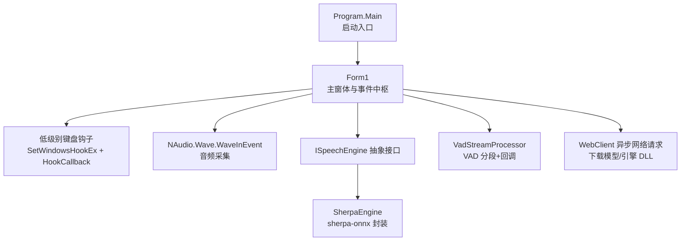
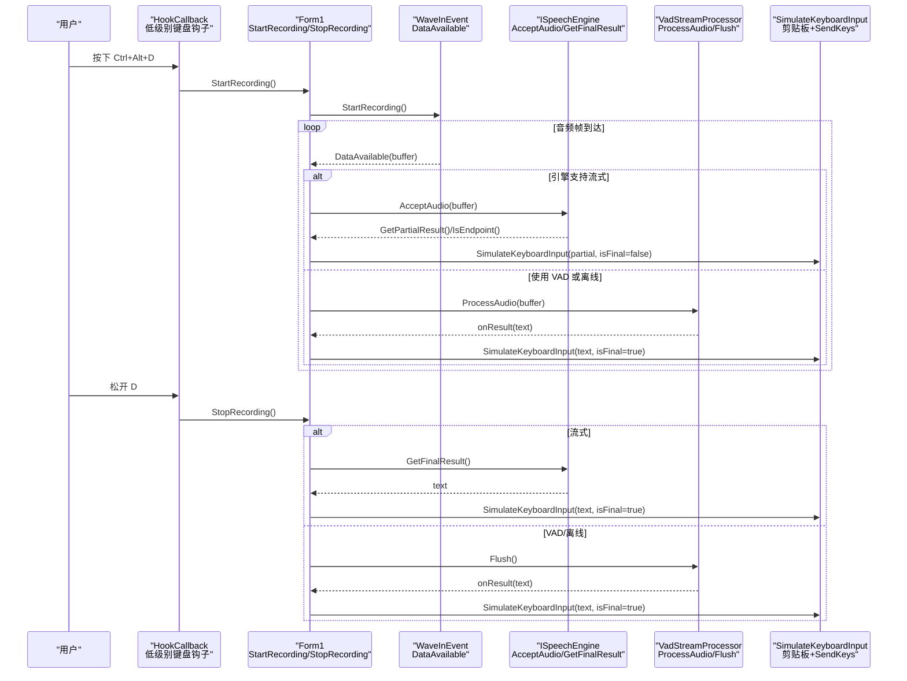
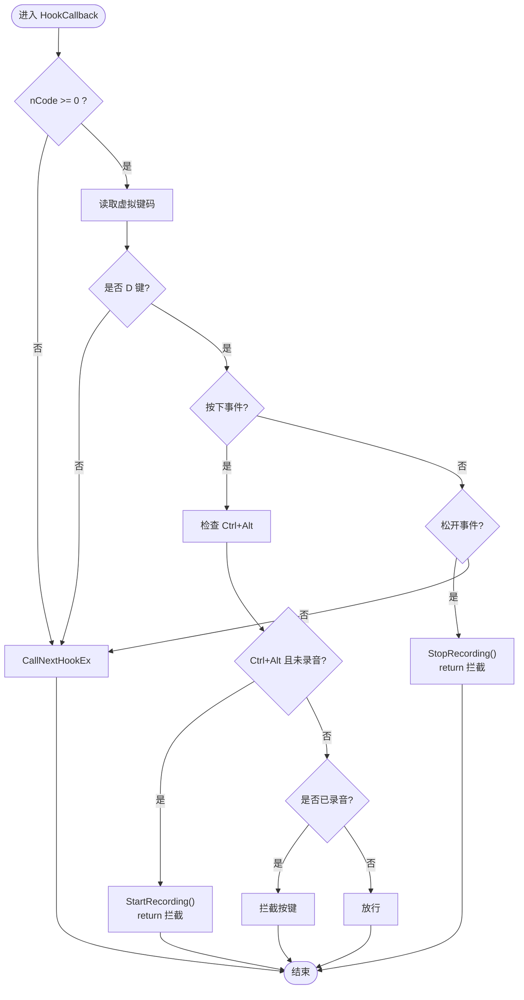
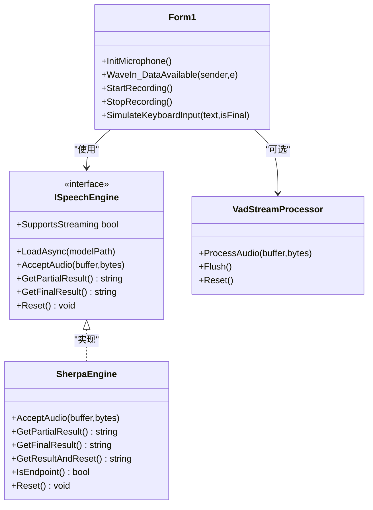
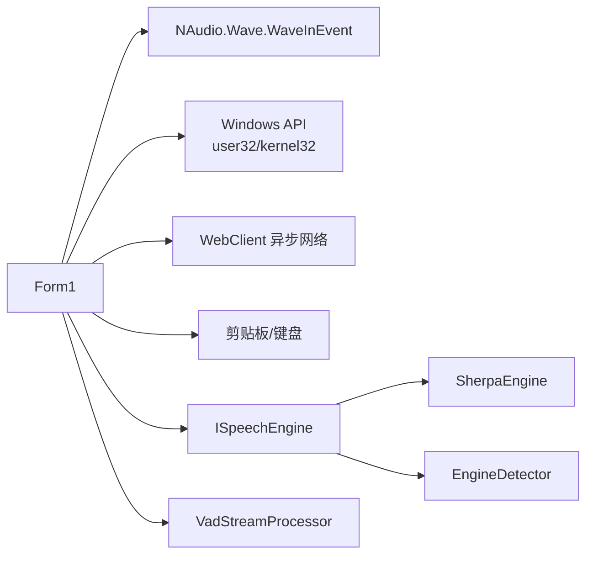

# 事件处理系统

<cite>
**本文引用的文件列表**
- [Form1.cs](file://t9s2t/Form1.cs)
- [Program.cs](file://t9s2t/Program.cs)
- [ISpeechEngine.cs](file://t9s2t/Engines/ISpeechEngine.cs)
- [SherpaEngine.cs](file://t9s2t/Engines/SherpaEngine.cs)
- [VadStreamProcessor.cs](file://t9s2t/Engines/VadStreamProcessor.cs)
- [EngineDetector.cs](file://t9s2t/Engines/EngineDetector.cs)
</cite>

## 目录
1. [简介](#简介)
2. [项目结构](#项目结构)
3. [核心组件](#核心组件)
4. [架构总览](#架构总览)
5. [详细组件分析](#详细组件分析)
6. [依赖关系分析](#依赖关系分析)
7. [性能考虑](#性能考虑)
8. [故障排查指南](#故障排查指南)
9. [结论](#结论)

## 简介
本技术文档聚焦于主窗体的事件处理架构，系统性阐述键盘钩子、用户界面事件与系统事件的统一处理机制；深入解析 HookCallback 方法在低级别键盘钩子安装与回调中的实现原理；说明异步事件处理模式（async/await）在音频采集、网络请求与模型加载中的应用；解释事件委托与回调设计模式（含 Lambda 表达式与匿名方法）的使用方式；并提供错误处理与调试技巧以及性能优化建议。

## 项目结构
该应用采用 WinForms 作为 UI 层，通过 Windows 低级别键盘钩子捕获全局按键，结合 NAudio 的 WaveInEvent 进行音频采集，使用 ISpeechEngine 抽象接口对接多种语音识别引擎（如 SherpaEngine），并通过 VadStreamProcessor 对非流式模型模拟流式体验。

图表来源
- [Program.cs:10-24](file://t9s2t/Program.cs#L10-L24)
- [Form1.cs:82-127](file://t9s2t/Form1.cs#L82-L127)
- [Form1.cs:1057-1111](file://t9s2t/Form1.cs#L1057-L1111)
- [ISpeechEngine.cs:8-33](file://t9s2t/Engines/ISpeechEngine.cs#L8-L33)
- [SherpaEngine.cs:14-56](file://t9s2t/Engines/SherpaEngine.cs#L14-L56)
- [VadStreamProcessor.cs:12-33](file://t9s2t/Engines/VadStreamProcessor.cs#L12-L33)

章节来源
- [Program.cs:10-24](file://t9s2t/Program.cs#L10-L24)
- [Form1.cs:144-235](file://t9s2t/Form1.cs#L144-L235)

## 核心组件
- 主窗体 Form1：负责全局键盘钩子的安装与回调、UI 事件绑定、录音控制、结果粘贴、托盘交互、资源动态加载与网络下载等。
- 语音引擎接口 ISpeechEngine：定义统一的加载、音频输入、部分/最终结果获取与重置能力。
- SherpaEngine：基于 sherpa-onnx 的具体实现，支持 SenseVoice、离线 Paraformer、流式 Paraformer，并可选标点恢复与 VAD。
- VadStreamProcessor：将非流式模型“模拟”为流式，按静音段提交识别并触发回调。
- EngineDetector：根据模型目录结构自动检测引擎类型并创建对应实例。

章节来源
- [ISpeechEngine.cs:8-33](file://t9s2t/Engines/ISpeechEngine.cs#L8-L33)
- [SherpaEngine.cs:14-56](file://t9s2t/Engines/SherpaEngine.cs#L14-L56)
- [VadStreamProcessor.cs:12-33](file://t9s2t/Engines/VadStreamProcessor.cs#L12-L33)
- [EngineDetector.cs:22-104](file://t9s2t/Engines/EngineDetector.cs#L22-L104)

## 架构总览
下图展示了从键盘按下到文本输出的完整事件链路，包括钩子拦截、录音控制、音频流处理、引擎识别与结果粘贴。

图表来源
- [Form1.cs:422-460](file://t9s2t/Form1.cs#L422-L460)
- [Form1.cs:1146-1173](file://t9s2t/Form1.cs#L1146-L1173)
- [Form1.cs:1057-1111](file://t9s2t/Form1.cs#L1057-L1111)
- [Form1.cs:1228-1273](file://t9s2t/Form1.cs#L1228-L1273)
- [Form1.cs:993-1051](file://t9s2t/Form1.cs#L993-L1051)
- [VadStreamProcessor.cs:38-136](file://t9s2t/Engines/VadStreamProcessor.cs#L38-L136)
- [ISpeechEngine.cs:20-32](file://t9s2t/Engines/ISpeechEngine.cs#L20-L32)

## 详细组件分析

### 低级别键盘钩子与 HookCallback
- 安装与卸载
  - 使用 SetWindowsHookEx 安装 WH_KEYBOARD_LL 钩子，回调函数为 HookCallback。
  - 程序退出时调用 UnhookWindowsHookEx 释放钩子。
- 回调处理逻辑
  - 仅关注 VK_D 键，区分 WM_KEYDOWN/WM_SYSKEYDOWN 与 WM_KEYUP/WM_SYSKEYUP。
  - 按下时检查修饰键 Ctrl 和 Alt，若同时按下且未录音则开始录音，并拦截按键返回以阻止字符输入。
  - 录音中再次按下 D 也拦截，避免干扰。
  - 松开 D 时停止录音，同样拦截按键。
  - 其他情况调用 CallNextHookEx 放行。

图表来源
- [Form1.cs:422-460](file://t9s2t/Form1.cs#L422-L460)
- [Form1.cs:415-420](file://t9s2t/Form1.cs#L415-L420)

章节来源
- [Form1.cs:82-127](file://t9s2t/Form1.cs#L82-L127)
- [Form1.cs:415-460](file://t9s2t/Form1.cs#L415-L460)

### 音频采集与流式处理
- 初始化麦克风
  - 使用 WaveInEvent 设置采样率与通道，订阅 DataAvailable 事件。
- 数据可用回调
  - 若引擎支持流式：直接送入引擎，查询 partial 结果或端点分句；节流与去重后更新 UI。
  - 若使用 VAD：交给 VadStreamProcessor 按静音段提交识别并触发回调。
  - 若离线模式：累积音频，等待松开后一次性识别。
- 停止录音
  - 先停止设备，再在锁内设置状态；根据模式调用引擎或 VAD 的最终结果，统一走 SimulateKeyboardInput。

图表来源
- [Form1.cs:1057-1111](file://t9s2t/Form1.cs#L1057-L1111)
- [Form1.cs:1146-1173](file://t9s2t/Form1.cs#L1146-L1173)
- [Form1.cs:1228-1273](file://t9s2t/Form1.cs#L1228-L1273)
- [ISpeechEngine.cs:8-33](file://t9s2t/Engines/ISpeechEngine.cs#L8-L33)
- [SherpaEngine.cs:351-479](file://t9s2t/Engines/SherpaEngine.cs#L351-L479)
- [VadStreamProcessor.cs:38-136](file://t9s2t/Engines/VadStreamProcessor.cs#L38-L136)

章节来源
- [Form1.cs:1057-1111](file://t9s2t/Form1.cs#L1057-L1111)
- [Form1.cs:1146-1173](file://t9s2t/Form1.cs#L1146-L1173)
- [Form1.cs:1228-1273](file://t9s2t/Form1.cs#L1228-L1273)
- [ISpeechEngine.cs:8-33](file://t9s2t/Engines/ISpeechEngine.cs#L8-L33)
- [SherpaEngine.cs:351-479](file://t9s2t/Engines/SherpaEngine.cs#L351-L479)
- [VadStreamProcessor.cs:38-136](file://t9s2t/Engines/VadStreamProcessor.cs#L38-L136)

### 异步事件处理模式（async/await）
- 网络请求
  - 使用 WebClient.DownloadStringTaskAsync/DownloadFileTaskAsync 异步拉取远程配置与模型包，并在 UI 线程更新进度与状态。
- 模型与引擎加载
  - LoadAsync 内部通过 Task.Run 执行模型检测与加载，避免阻塞 UI。
- 音频处理
  - DataAvailable 回调中同步处理音频，但 UI 更新通过 BeginInvoke 回到 UI 线程，避免跨线程异常。

章节来源
- [Form1.cs:510-567](file://t9s2t/Form1.cs#L510-L567)
- [Form1.cs:818-851](file://t9s2t/Form1.cs#L818-L851)
- [Form1.cs:876-966](file://t9s2t/Form1.cs#L876-L966)
- [SherpaEngine.cs:57-72](file://t9s2t/Engines/SherpaEngine.cs#L57-L72)
- [Form1.cs:1057-1111](file://t9s2t/Form1.cs#L1057-L1111)

### 事件委托与回调机制（Lambda 与匿名方法）
- UI 事件绑定
  - 使用 Lambda 表达式为按钮 Click、复选框 CheckedChanged、托盘菜单项等注册处理逻辑。
- 网络进度回调
  - DownloadProgressChanged 使用匿名方法更新进度条与状态标签。
- 引擎回调
  - VadStreamProcessor 构造时接收 Action<string> 类型的 onResult/onPartial 回调，用于在检测到语音段落或部分结果时通知上层。

章节来源
- [Form1.cs:164-182](file://t9s2t/Form1.cs#L164-L182)
- [Form1.cs:887-901](file://t9s2t/Form1.cs#L887-L901)
- [VadStreamProcessor.cs:28-33](file://t9s2t/Engines/VadStreamProcessor.cs#L28-L33)

### 结果粘贴与焦点管理
- 目标窗口定位
  - 使用 GetForegroundWindow 获取前台窗口，必要时 AttachThreadInput 提升权限，确保 SetForegroundWindow 成功。
- 防冲突处理
  - 若 Alt 仍按住，临时发送 KEYUP 避免弹出系统菜单；复制文本后延时再发送 ^v，最后追加空格。
- 降级方案
  - 若剪贴板/发送失败，回退为逐字符 SendKeys 输入。

章节来源
- [Form1.cs:1114-1144](file://t9s2t/Form1.cs#L1114-L1144)
- [Form1.cs:993-1051](file://t9s2t/Form1.cs#L993-L1051)
- [Form1.cs:1279-1290](file://t9s2t/Form1.cs#L1279-L1290)

## 依赖关系分析
- 模块耦合
  - Form1 依赖 NAudio 进行音频采集，依赖 ISpeechEngine 抽象进行识别，依赖 VadStreamProcessor 提供 VAD 分段能力。
  - SherpaEngine 依赖 sherpa-onnx 原生库（通过 C API 封装）。
  - EngineDetector 仅依赖文件系统判断模型类型，不引入运行时推理库。
- 外部集成点
  - Windows API：SetWindowsHookEx、UnhookWindowsHookEx、CallNextHookEx、GetModuleHandle、GetAsyncKeyState、keybd_event、SetForegroundWindow、ShowWindow、FindWindow、AttachThreadInput、RegisterWindowMessage、SendMessage。
  - 网络：WebClient 异步下载模型与引擎 DLL。
  - 剪贴板与键盘：Clipboard.SetText、SendKeys.SendWait。

图表来源
- [Form1.cs:82-127](file://t9s2t/Form1.cs#L82-L127)
- [Form1.cs:510-567](file://t9s2t/Form1.cs#L510-L567)
- [Form1.cs:993-1051](file://t9s2t/Form1.cs#L993-L1051)
- [ISpeechEngine.cs:8-33](file://t9s2t/Engines/ISpeechEngine.cs#L8-L33)
- [SherpaEngine.cs:14-56](file://t9s2t/Engines/SherpaEngine.cs#L14-L56)
- [EngineDetector.cs:22-104](file://t9s2t/Engines/EngineDetector.cs#L22-L104)

章节来源
- [Form1.cs:82-127](file://t9s2t/Form1.cs#L82-L127)
- [Form1.cs:510-567](file://t9s2t/Form1.cs#L510-L567)
- [Form1.cs:993-1051](file://t9s2t/Form1.cs#L993-L1051)
- [ISpeechEngine.cs:8-33](file://t9s2t/Engines/ISpeechEngine.cs#L8-L33)
- [SherpaEngine.cs:14-56](file://t9s2t/Engines/SherpaEngine.cs#L14-L56)
- [EngineDetector.cs:22-104](file://t9s2t/Engines/EngineDetector.cs#L22-L104)

## 性能考虑
- 钩子回调最小化开销
  - HookCallback 仅做按键判定与状态切换，避免复杂计算；所有耗时操作（录音、识别、网络）均在独立线程或异步任务中执行。
- 音频处理节流与去重
  - partial 结果更新增加时间间隔与文本去重，减少 UI 刷新频率与剪贴板压力。
- 流式与离线路径选择
  - 流式引擎优先使用 GetPartialResult 与端点检测，降低延迟；离线模型在录音结束后一次性识别，减少中间状态。
- 网络下载优化
  - 使用异步下载与进度回调，避免 UI 卡顿；TLS 协议在启动时统一设置，减少重复配置。
- 资源释放
  - 在关闭时释放钩子、录音设备、引擎对象与托盘图标，防止内存泄漏。

[本节为通用指导，无需具体文件引用]

## 故障排查指南
- 键盘钩子无效
  - 确认已安装钩子且回调返回正确值（拦截返回 1，放行调用 CallNextHookEx）。
  - 检查 WM_KEYDOWN/WM_SYSKEYDOWN 与 WM_KEYUP/WM_SYSKEYUP 分支是否正确覆盖 Alt 场景。
- 无法粘贴或弹出系统菜单
  - 检查是否在粘贴前释放了 Alt 键；适当增加剪贴板就绪等待时间。
- 无麦克风或无声
  - 确认 WaveInEvent.DeviceCount > 0；检查采样率与格式是否与引擎要求一致。
- 模型未识别或加载失败
  - 查看 EngineDetector 日志输出；确认 tokens.txt、encoder/decoder 文件存在；必要时重新下载模型。
- 网络下载失败
  - 检查 TLS 设置与代理；确认远程地址可达；查看本地备用 JSON 是否生效。

章节来源
- [Form1.cs:422-460](file://t9s2t/Form1.cs#L422-L460)
- [Form1.cs:993-1051](file://t9s2t/Form1.cs#L993-L1051)
- [Form1.cs:1057-1111](file://t9s2t/Form1.cs#L1057-L1111)
- [EngineDetector.cs:27-75](file://t9s2t/Engines/EngineDetector.cs#L27-L75)
- [Form1.cs:510-567](file://t9s2t/Form1.cs#L510-L567)

## 结论
本事件处理系统以 Form1 为核心，整合低级别键盘钩子、音频采集、语音识别引擎与网络下载，形成统一的事件驱动架构。通过异步模式与回调机制，系统在保持 UI 流畅的同时实现了高效的实时语音输入。合理的节流与去重策略、健壮的错误处理与降级方案，进一步提升了用户体验与稳定性。

[本节为总结性内容，无需具体文件引用]