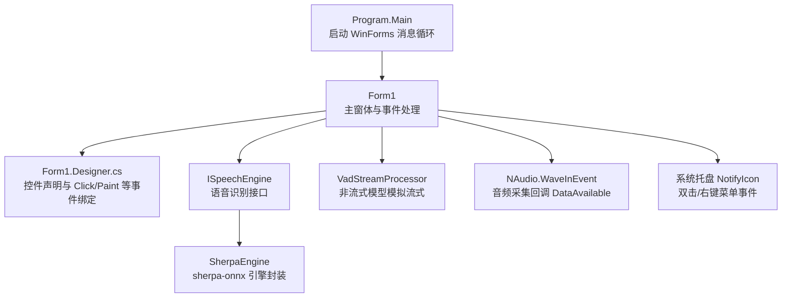
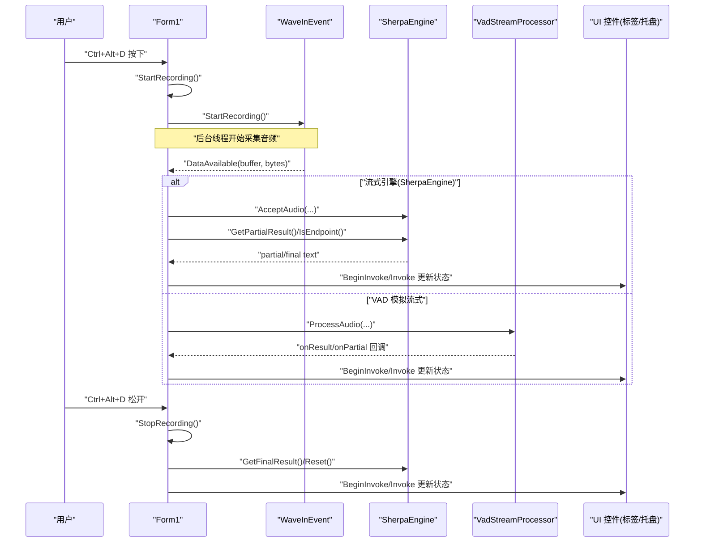
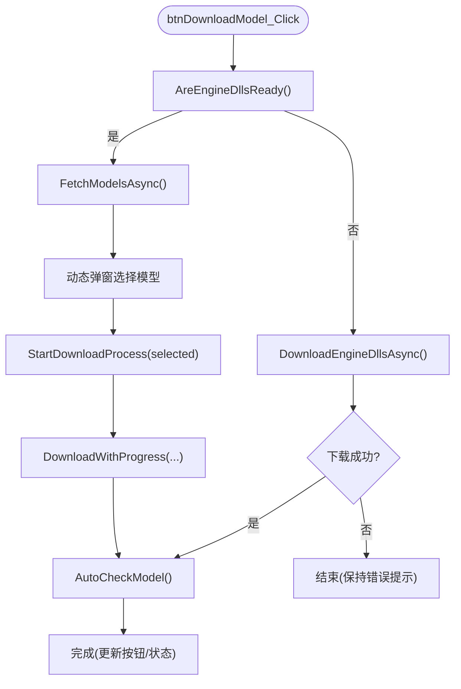
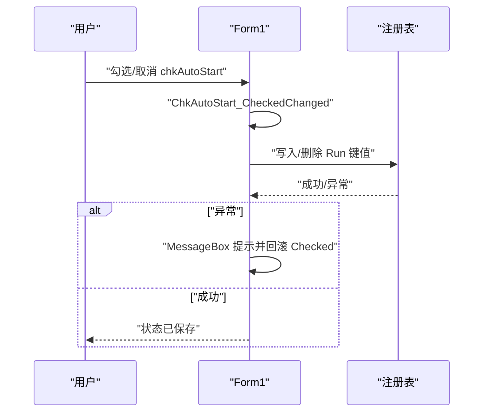
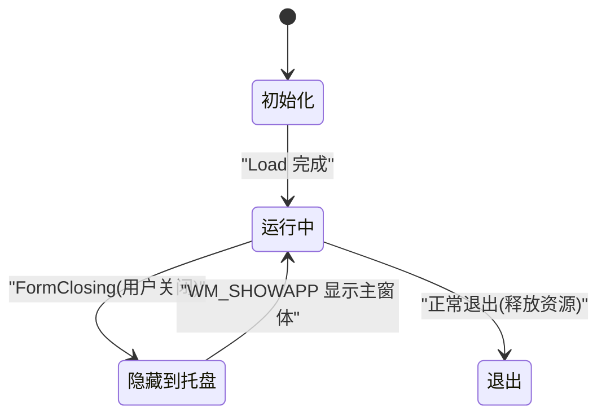
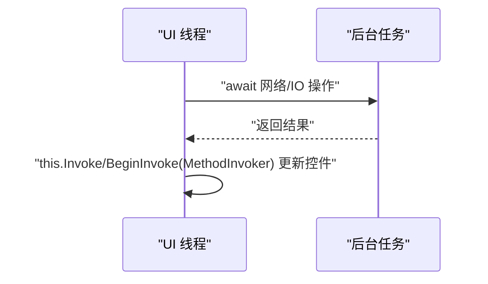
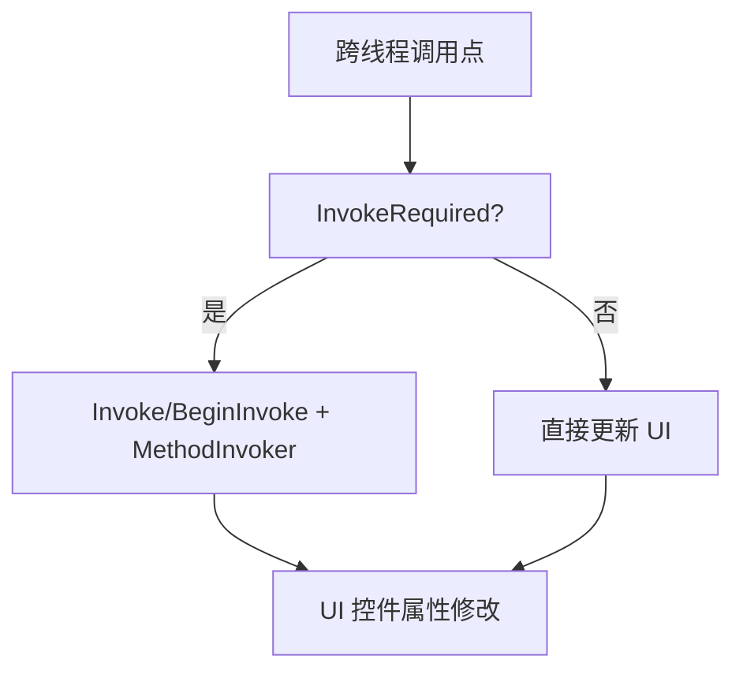
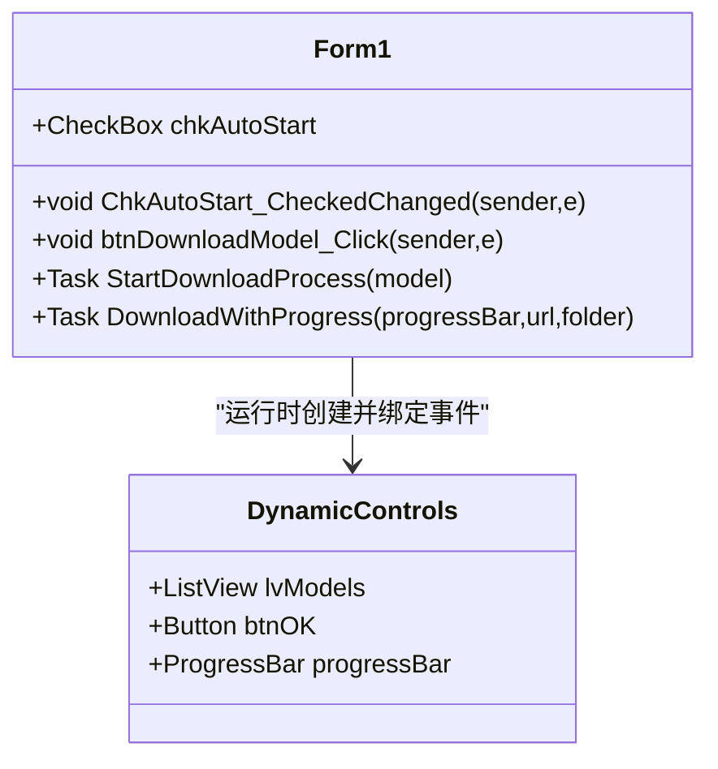
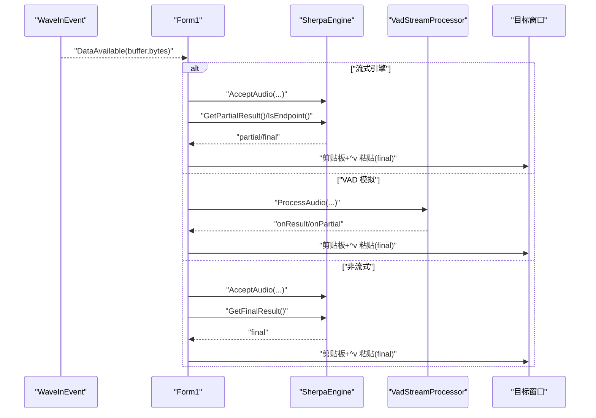
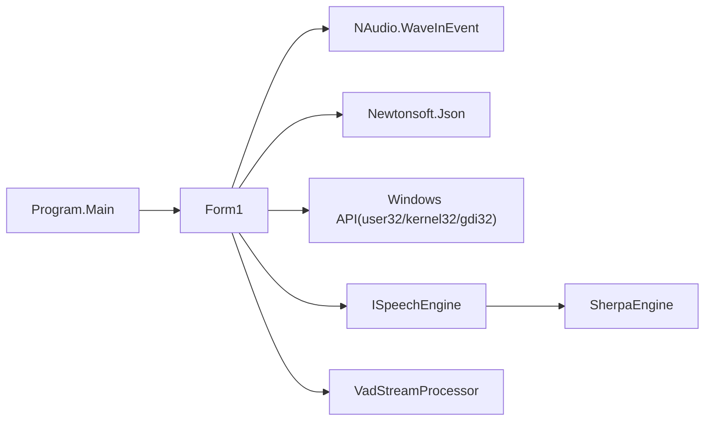

# 用户界面事件处理

<cite>
**本文引用的文件**   
- [Form1.cs](file://t9s2t/Form1.cs)
- [Form1.Designer.cs](file://t9s2t/Form1.Designer.cs)
- [Program.cs](file://t9s2t/Program.cs)
- [ISpeechEngine.cs](file://t9s2t/Engines/ISpeechEngine.cs)
- [VadStreamProcessor.cs](file://t9s2t/Engines/VadStreamProcessor.cs)
- [SherpaEngine.cs](file://t9s2t/Engines/SherpaEngine.cs)
</cite>

## 目录
1. [简介](#简介)
2. [项目结构](#项目结构)
3. [核心组件](#核心组件)
4. [架构总览](#架构总览)
5. [详细组件分析](#详细组件分析)
6. [依赖关系分析](#依赖关系分析)
7. [性能考虑](#性能考虑)
8. [故障排查指南](#故障排查指南)
9. [结论](#结论)
10. [附录](#附录)

## 简介
本技术文档聚焦于该 WinForms 应用程序中的用户界面事件处理机制，覆盖以下主题：
- 按钮点击事件、复选框状态变更事件与窗体生命周期事件的处理方式
- 异步事件处理方法（async/await）在 UI 更新中的应用
- 跨线程 UI 更新的 Invoke 机制（this.Invoke / this.BeginInvoke 与 MethodInvoker 委托）
- 动态控件的事件绑定与 Lambda 表达式的应用
- UI 事件处理的性能优化技巧与最佳实践，并给出调试方法

## 项目结构
该项目为典型的 WinForms 桌面应用，主窗体为 Form1，UI 初始化在 Designer 中完成，业务逻辑集中在 Form1.cs；语音识别引擎通过接口 ISpeechEngine 抽象，具体实现包括 SherpaEngine 与 VAD 流式处理器 VadStreamProcessor。程序入口在 Program.cs。

图表来源
- [Program.cs:15-24](file://t9s2t/Program.cs#L15-L24)
- [Form1.Designer.cs:29-215](file://t9s2t/Form1.Designer.cs#L29-L215)
- [Form1.cs:144-235](file://t9s2t/Form1.cs#L144-L235)
- [ISpeechEngine.cs:8-33](file://t9s2t/Engines/ISpeechEngine.cs#L8-L33)
- [VadStreamProcessor.cs:12-33](file://t9s2t/Engines/VadStreamProcessor.cs#L12-L33)
- [SherpaEngine.cs:14-55](file://t9s2t/Engines/SherpaEngine.cs#L14-L55)

章节来源
- [Program.cs:15-24](file://t9s2t/Program.cs#L15-L24)
- [Form1.Designer.cs:29-215](file://t9s2t/Form1.Designer.cs#L29-L215)
- [Form1.cs:144-235](file://t9s2t/Form1.cs#L144-L235)

## 核心组件
- 主窗体 Form1：承载所有 UI 事件处理、异步任务编排、跨线程 UI 更新、动态控件创建与事件绑定、键盘钩子与录音流程控制。
- 设计器 Form1.Designer.cs：声明静态控件并注册 Click、Paint 等事件。
- 引擎接口 ISpeechEngine：定义加载、接受音频、获取部分/最终结果、重置等能力。
- SherpaEngine：基于 sherpa-onnx 的多种模型支持（SenseVoice、Paraformer 流式/离线）。
- VadStreamProcessor：对非流式模型进行静音检测分段，模拟流式体验。
- NAudio WaveInEvent：音频采集回调 DataAvailable，驱动识别流程。

章节来源
- [Form1.cs:144-235](file://t9s2t/Form1.cs#L144-L235)
- [Form1.Designer.cs:29-215](file://t9s2t/Form1.Designer.cs#L29-L215)
- [ISpeechEngine.cs:8-33](file://t9s2t/Engines/ISpeechEngine.cs#L8-L33)
- [SherpaEngine.cs:14-55](file://t9s2t/Engines/SherpaEngine.cs#L14-L55)
- [VadStreamProcessor.cs:12-33](file://t9s2t/Engines/VadStreamProcessor.cs#L12-L33)

## 架构总览
下图展示了从 UI 事件到识别结果输入的关键调用链，以及跨线程 UI 更新的调度路径。

图表来源
- [Form1.cs:1146-1273](file://t9s2t/Form1.cs#L1146-L1273)
- [Form1.cs:1057-1111](file://t9s2t/Form1.cs#L1057-L1111)
- [VadStreamProcessor.cs:38-136](file://t9s2t/Engines/VadStreamProcessor.cs#L38-L136)
- [SherpaEngine.cs:351-479](file://t9s2t/Engines/SherpaEngine.cs#L351-L479)

## 详细组件分析

### 按钮点击事件与异步下载流程
- 按钮 btnDownloadModel 的 Click 事件在 Designer 中绑定到 btnDownloadModel_Click。
- 点击后根据引擎 DLL 是否就绪，先触发 DownloadEngineDllsAsync 或进入模型列表选择与下载流程。
- 使用 async/await 模式进行网络请求与进度更新，避免阻塞 UI 线程。
- 下载完成后自动恢复按钮状态并重新检测模型。

图表来源
- [Form1.Designer.cs:90-106](file://t9s2t/Form1.Designer.cs#L90-L106)
- [Form1.cs:723-817](file://t9s2t/Form1.cs#L723-L817)
- [Form1.cs:509-567](file://t9s2t/Form1.cs#L509-L567)
- [Form1.cs:607-642](file://t9s2t/Form1.cs#L607-L642)
- [Form1.cs:853-966](file://t9s2t/Form1.cs#L853-L966)

章节来源
- [Form1.Designer.cs:90-106](file://t9s2t/Form1.Designer.cs#L90-L106)
- [Form1.cs:723-817](file://t9s2t/Form1.cs#L723-L817)
- [Form1.cs:509-567](file://t9s2t/Form1.cs#L509-L567)
- [Form1.cs:607-642](file://t9s2t/Form1.cs#L607-L642)
- [Form1.cs:853-966](file://t9s2t/Form1.cs#L853-L966)

### 复选框状态变更事件（开机自启）
- 动态创建的 CheckBox chkAutoStart 在运行时添加到窗体，并通过 CheckedChanged 事件绑定到 ChkAutoStart_CheckedChanged。
- 事件处理读写注册表项以启用/禁用开机自启，并在失败时回滚 UI 状态。

图表来源
- [Form1.cs:171-182](file://t9s2t/Form1.cs#L171-L182)
- [Form1.cs:260-277](file://t9s2t/Form1.cs#L260-L277)

章节来源
- [Form1.cs:171-182](file://t9s2t/Form1.cs#L171-L182)
- [Form1.cs:260-277](file://t9s2t/Form1.cs#L260-L277)

### 窗体生命周期事件
- Load：单实例互斥检查、托盘图标初始化、动态控件添加、引擎与模型检测、键盘钩子安装、麦克风初始化、资源加载。
- FormClosing：最小化到托盘而非退出；释放钩子、互斥量、音频设备、引擎与托盘资源。
- WndProc：接收自定义窗口消息 WM_SHOWAPP，用于多实例显示主窗体。

图表来源
- [Form1.cs:144-235](file://t9s2t/Form1.cs#L144-L235)
- [Form1.cs:279-288](file://t9s2t/Form1.cs#L279-L288)
- [Form1.cs:237-241](file://t9s2t/Form1.cs#L237-L241)

章节来源
- [Form1.cs:144-235](file://t9s2t/Form1.cs#L144-L235)
- [Form1.cs:279-288](file://t9s2t/Form1.cs#L279-L288)
- [Form1.cs:237-241](file://t9s2t/Form1.cs#L237-L241)

### 异步事件处理方法与 UI 更新
- 多处使用 async void 作为事件处理入口（如 Form1_Load、btnDownloadModel_Click），内部 await 网络请求与 I/O 操作。
- UI 更新统一通过 this.Invoke 或 this.BeginInvoke 配合 MethodInvoker 委托，确保在 UI 线程执行。
- 典型场景：
  - 引擎加载成功后更新 lblEngine/lblStatus/trayIcon 文本与颜色。
  - 下载进度更新 ProgressBar 与状态标签。
  - 录音状态与识别结果更新。

图表来源
- [Form1.cs:151-235](file://t9s2t/Form1.cs#L151-L235)
- [Form1.cs:644-721](file://t9s2t/Form1.cs#L644-L721)
- [Form1.cs:876-966](file://t9s2t/Form1.cs#L876-L966)
- [Form1.cs:1165-1173](file://t9s2t/Form1.cs#L1165-L1173)
- [Form1.cs:1265-1273](file://t9s2t/Form1.cs#L1265-L1273)

章节来源
- [Form1.cs:151-235](file://t9s2t/Form1.cs#L151-L235)
- [Form1.cs:644-721](file://t9s2t/Form1.cs#L644-L721)
- [Form1.cs:876-966](file://t9s2t/Form1.cs#L876-L966)
- [Form1.cs:1165-1173](file://t9s2t/Form1.cs#L1165-L1173)
- [Form1.cs:1265-1273](file://t9s2t/Form1.cs#L1265-L1273)

### 跨线程 UI 更新的 Invoke 机制
- this.InvokeRequired 判断是否需要跨线程调度。
- this.Invoke((MethodInvoker)delegate{...}) 同步切换到 UI 线程执行。
- this.BeginInvoke((MethodInvoker)delegate{...}) 异步切换到 UI 线程执行，适合高频更新（如录音状态）。
- 典型用法：
  - 引擎加载失败/成功时的 UI 反馈。
  - 录音开始/结束的状态更新。
  - 实时 partial 结果仅更新托盘文本，避免闪烁。

图表来源
- [Form1.cs:244-258](file://t9s2t/Form1.cs#L244-L258)
- [Form1.cs:653-721](file://t9s2t/Form1.cs#L653-L721)
- [Form1.cs:1003-1051](file://t9s2t/Form1.cs#L1003-L1051)
- [Form1.cs:1165-1173](file://t9s2t/Form1.cs#L1165-L1173)
- [Form1.cs:1265-1273](file://t9s2t/Form1.cs#L1265-L1273)

章节来源
- [Form1.cs:244-258](file://t9s2t/Form1.cs#L244-L258)
- [Form1.cs:653-721](file://t9s2t/Form1.cs#L653-L721)
- [Form1.cs:1003-1051](file://t9s2t/Form1.cs#L1003-L1051)
- [Form1.cs:1165-1173](file://t9s2t/Form1.cs#L1165-L1173)
- [Form1.cs:1265-1273](file://t9s2t/Form1.cs#L1265-L1273)

### 动态控件的事件绑定与 Lambda 表达式
- 动态创建 CheckBox 并设置 Text/Location/Size/Font/ForeColor/Checked，随后绑定 CheckedChanged 事件。
- 动态创建模型选择窗体中的 ListView、Button，并使用匿名委托/Lambda 绑定 Click 事件。
- 动态创建 ProgressBar 并订阅 DownloadProgressChanged 事件，实时更新进度与状态。

图表来源
- [Form1.cs:171-182](file://t9s2t/Form1.cs#L171-L182)
- [Form1.cs:751-817](file://t9s2t/Form1.cs#L751-L817)
- [Form1.cs:853-966](file://t9s2t/Form1.cs#L853-L966)

章节来源
- [Form1.cs:171-182](file://t9s2t/Form1.cs#L171-L182)
- [Form1.cs:751-817](file://t9s2t/Form1.cs#L751-L817)
- [Form1.cs:853-966](file://t9s2t/Form1.cs#L853-L966)

### 音频采集与识别结果输入流程
- WaveInEvent.DataAvailable 回调在后台线程触发，根据引擎类型走不同分支：
  - SherpaEngine 流式：AcceptAudio -> GetPartialResult/IsEndpoint -> SimulateKeyboardInput(partial/final)。
  - VadStreamProcessor：ProcessAudio -> onResult/onPartial -> SimulateKeyboardInput。
  - 非流式：AcceptAudio 积累音频，停止后 GetFinalResult -> SimulateKeyboardInput。
- SimulateKeyboardInput 负责将识别结果粘贴到前台目标窗口，并对 partial 做节流与去重，避免闪烁。

图表来源
- [Form1.cs:1057-1111](file://t9s2t/Form1.cs#L1057-L1111)
- [Form1.cs:993-1051](file://t9s2t/Form1.cs#L993-L1051)
- [VadStreamProcessor.cs:38-136](file://t9s2t/Engines/VadStreamProcessor.cs#L38-L136)
- [SherpaEngine.cs:351-479](file://t9s2t/Engines/SherpaEngine.cs#L351-L479)

章节来源
- [Form1.cs:1057-1111](file://t9s2t/Form1.cs#L1057-L1111)
- [Form1.cs:993-1051](file://t9s2t/Form1.cs#L993-L1051)
- [VadStreamProcessor.cs:38-136](file://t9s2t/Engines/VadStreamProcessor.cs#L38-L136)
- [SherpaEngine.cs:351-479](file://t9s2t/Engines/SherpaEngine.cs#L351-L479)

## 依赖关系分析
- 外部库与平台 API：
  - NAudio.Wave：音频采集与回调。
  - Newtonsoft.Json：JSON 解析（远程模型/引擎配置）。
  - Windows API：SetWindowsHookEx、FindWindow、SendMessage、SetForegroundWindow、AttachThreadInput、keybd_event 等。
- 内部模块：
  - ISpeechEngine 接口被 SherpaEngine 实现，Form1 通过接口与引擎解耦。
  - VadStreamProcessor 依赖 ISpeechEngine 提供最终识别能力。

图表来源
- [Program.cs:15-24](file://t9s2t/Program.cs#L15-L24)
- [Form1.cs:82-127](file://t9s2t/Form1.cs#L82-L127)
- [ISpeechEngine.cs:8-33](file://t9s2t/Engines/ISpeechEngine.cs#L8-L33)
- [SherpaEngine.cs:14-55](file://t9s2t/Engines/SherpaEngine.cs#L14-L55)
- [VadStreamProcessor.cs:12-33](file://t9s2t/Engines/VadStreamProcessor.cs#L12-L33)

章节来源
- [Program.cs:15-24](file://t9s2t/Program.cs#L15-L24)
- [Form1.cs:82-127](file://t9s2t/Form1.cs#L82-L127)
- [ISpeechEngine.cs:8-33](file://t9s2t/Engines/ISpeechEngine.cs#L8-L33)
- [SherpaEngine.cs:14-55](file://t9s2t/Engines/SherpaEngine.cs#L14-L55)
- [VadStreamProcessor.cs:12-33](file://t9s2t/Engines/VadStreamProcessor.cs#L12-L33)

## 性能考虑
- 使用 BeginInvoke 替代 Invoke 进行高频 UI 更新（如录音状态），避免阻塞后台线程。
- 对 partial 结果进行节流与去重（时间间隔与文本变化判断），减少 UI 刷新频率与重复输入。
- 在锁内执行关键临界区（剪贴板与发送按键），锁外进行 UI 更新，降低锁持有时间。
- 网络请求使用 WebClient 的异步方法与 Task，避免 UI 卡顿。
- 动态控件按需创建与移除（如 ProgressBar），减少内存占用。
- 使用 ServicePointManager.SecurityProtocol 统一 TLS 版本，减少握手失败重试开销。

[本节为通用指导，不直接分析具体文件]

## 故障排查指南
- 无法获取远程模型/引擎配置：
  - 检查网络连接与 TLS 设置；查看日志输出与异常信息。
  - 确认备用 JSON 是否能正确解析。
- 引擎 DLL 下载不完整：
  - 校验文件大小是否为 0；清理损坏文件后重试。
- 识别结果未粘贴到目标窗口：
  - 检查前台窗口句柄是否正确；必要时强制提升目标窗口焦点。
  - 注意 Alt 键状态，避免误触系统菜单。
- 录音提示窗抢焦点：
  - 使用 NonActivatingForm 阻止激活；记录并恢复录音前目标窗口句柄。

章节来源
- [Form1.cs:509-567](file://t9s2t/Form1.cs#L509-L567)
- [Form1.cs:818-851](file://t9s2t/Form1.cs#L818-L851)
- [Form1.cs:1114-1144](file://t9s2t/Form1.cs#L1114-L1144)
- [Form1.cs:1298-1309](file://t9s2t/Form1.cs#L1298-L1309)

## 结论
该 WinForms 应用在 UI 事件处理方面展现了成熟的工程实践：
- 清晰的事件绑定与生命周期管理
- 完善的异步与跨线程 UI 更新策略
- 灵活的动态控件与事件绑定
- 针对高频 UI 更新的节流与去重优化
- 健壮的错误处理与降级方案

这些模式可复用到其他 WinForms 项目中，以提升用户体验与稳定性。

[本节为总结性内容，不直接分析具体文件]

## 附录
- 关键代码片段路径（便于快速定位）：
  - 按钮点击与异步下载：[Form1.cs:723-817](file://t9s2t/Form1.cs#L723-L817)、[Form1.cs:853-966](file://t9s2t/Form1.cs#L853-L966)
  - 复选框自启事件：[Form1.cs:171-182](file://t9s2t/Form1.cs#L171-L182)、[Form1.cs:260-277](file://t9s2t/Form1.cs#L260-L277)
  - 窗体生命周期：[Form1.cs:144-235](file://t9s2t/Form1.cs#L144-L235)、[Form1.cs:279-288](file://t9s2t/Form1.cs#L279-L288)
  - 异步与跨线程 UI 更新：[Form1.cs:644-721](file://t9s2t/Form1.cs#L644-L721)、[Form1.cs:1003-1051](file://t9s2t/Form1.cs#L1003-L1051)
  - 动态控件与事件绑定：[Form1.cs:751-817](file://t9s2t/Form1.cs#L751-L817)
  - 音频采集与识别流程：[Form1.cs:1057-1111](file://t9s2t/Form1.cs#L1057-L1111)、[VadStreamProcessor.cs:38-136](file://t9s2t/Engines/VadStreamProcessor.cs#L38-L136)、[SherpaEngine.cs:351-479](file://t9s2t/Engines/SherpaEngine.cs#L351-L479)