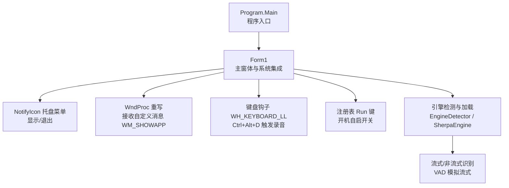
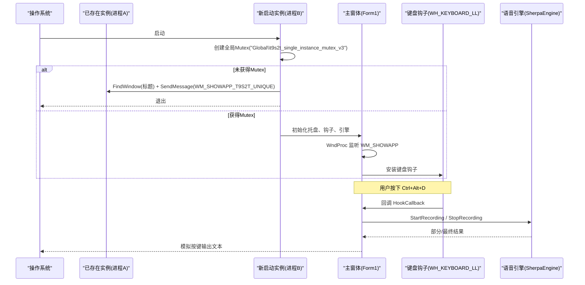
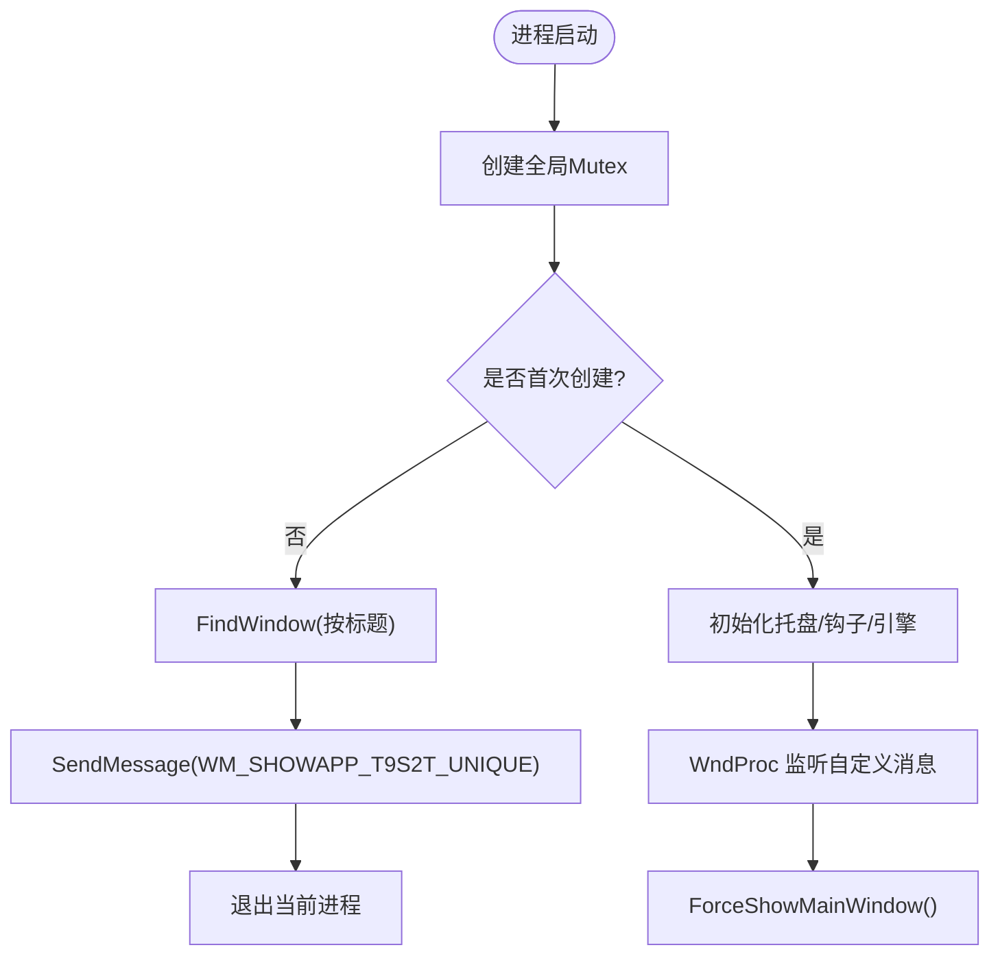
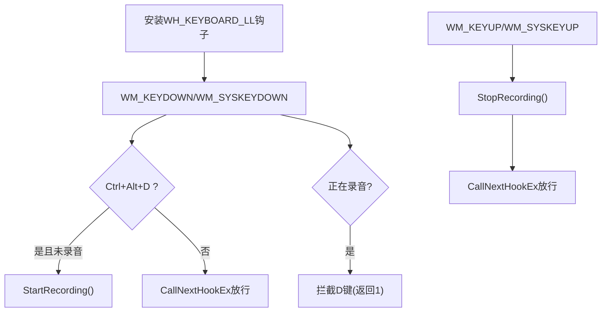
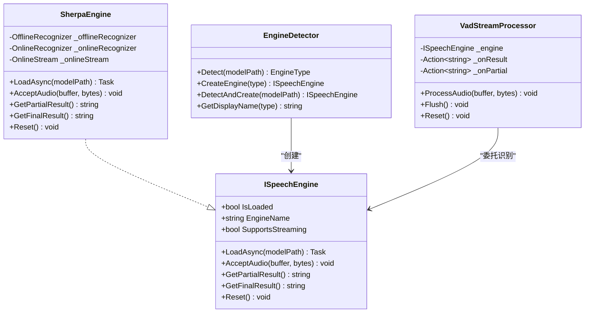
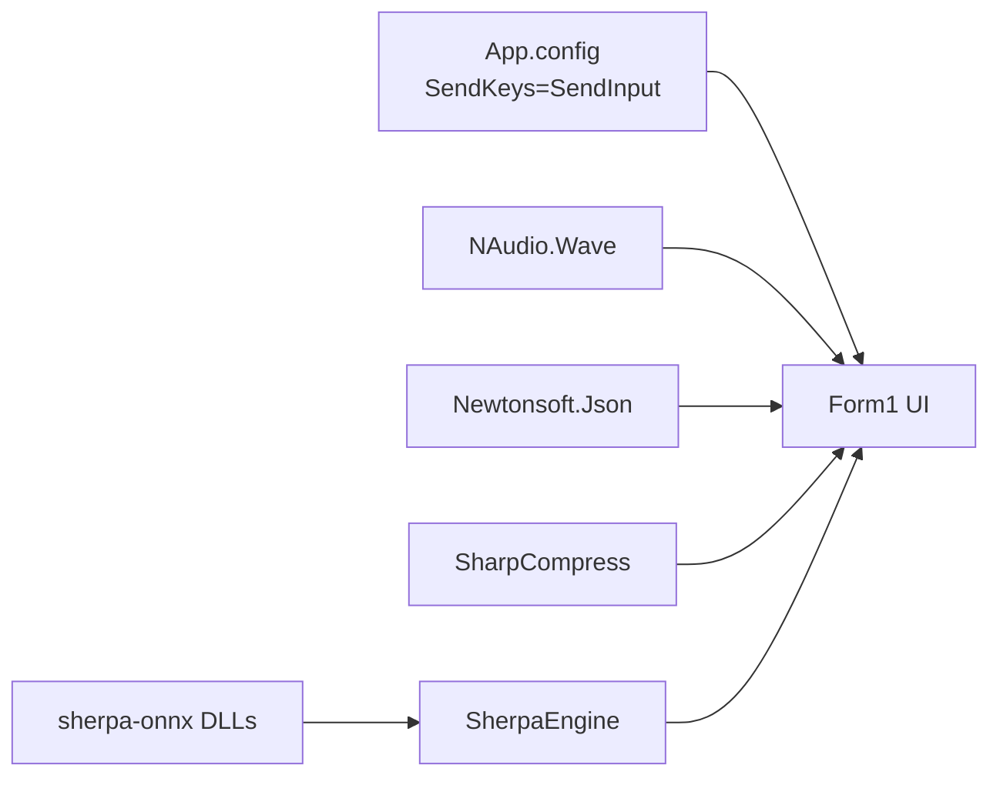

# 系统集成事件处理

<cite>
**本文引用的文件**   
- [Program.cs](file://t9s2t/Program.cs)
- [Form1.cs](file://t9s2t/Form1.cs)
- [Form1.Designer.cs](file://t9s2t/Form1.Designer.cs)
- [App.config](file://t9s2t/App.config)
- [EngineDetector.cs](file://t9s2t/Engines/EngineDetector.cs)
- [ISpeechEngine.cs](file://t9s2t/Engines/ISpeechEngine.cs)
- [SherpaEngine.cs](file://t9s2t/Engines/SherpaEngine.cs)
- [VadStreamProcessor.cs](file://t9s2t/Engines/VadStreamProcessor.cs)
- [TarBz2Extractor.cs](file://t9s2t/Engines/TarBz2Extractor.cs)
</cite>

## 目录
1. [简介](#简介)
2. [项目结构](#项目结构)
3. [核心组件](#核心组件)
4. [架构总览](#架构总览)
5. [详细组件分析](#详细组件分析)
6. [依赖关系分析](#依赖关系分析)
7. [性能与兼容性考虑](#性能与兼容性考虑)
8. [故障排查指南](#故障排查指南)
9. [结论](#结论)

## 简介
本技术文档聚焦于 t9s2t 应用程序的系统集成事件处理机制，涵盖以下关键主题：
- 托盘图标事件、窗口焦点管理事件
- 进程间通信（IPC）：使用 RegisterWindowMessage 自定义消息 WM_SHOWAPP_T9S2T_UNIQUE 实现单实例应用唤醒
- 单实例应用原理：基于全局 Mutex 的互斥控制
- 开机自启动：通过注册表 Run 键进行读写
- 错误处理与权限策略：针对系统 API 调用、注册表访问、线程同步等场景的健壮性设计

该文档旨在帮助开发者理解并扩展系统的系统集成能力，同时提供可操作的排错建议。

## 项目结构
本项目为 Windows Forms 应用，主入口在 Program.Main，UI 逻辑集中在 Form1，语音识别引擎封装在 Engines 命名空间下。



图表来源
- [Program.cs:10-24](file://t9s2t/Program.cs#L10-L24)
- [Form1.cs:151-241](file://t9s2t/Form1.cs#L151-L241)
- [EngineDetector.cs:22-122](file://t9s2t/Engines/EngineDetector.cs#L22-L122)
- [SherpaEngine.cs:57-72](file://t9s2t/Engines/SherpaEngine.cs#L57-L72)

章节来源
- [Program.cs:10-24](file://t9s2t/Program.cs#L10-L24)
- [Form1.Designer.cs:29-218](file://t9s2t/Form1.Designer.cs#L29-L218)

## 核心组件
- 单实例与 IPC：
  - 使用全局 Mutex 确保仅一个实例运行；若检测到已有实例，则通过 FindWindow 获取其句柄并使用 SendMessage 发送自定义消息以唤醒。
  - 自定义消息名 WM_SHOWAPP_T9S2T_UNIQUE 通过 RegisterWindowMessage 注册，跨进程唯一。
- 托盘图标事件：
  - 创建 NotifyIcon 并绑定上下文菜单与双击事件，用于显示主界面或退出应用。
- 窗口焦点管理：
  - ForceShowMainWindow 中结合 SetForegroundWindow、AttachThreadInput、IsIconic、ShowWindow 等 API 提升窗口可见性与前台激活。
- 开机自启动：
  - 通过 RegistryKey 写入/删除 CurrentUser\Software\Microsoft\Windows\CurrentVersion\Run 下的值，实现用户级自启动。
- 键盘钩子与录音触发：
  - 使用低级别键盘钩子拦截 Ctrl+Alt+D 组合键，开始/停止录音，并在录音期间屏蔽 D 键输入。

章节来源
- [Form1.cs:119-127](file://t9s2t/Form1.cs#L119-L127)
- [Form1.cs:151-162](file://t9s2t/Form1.cs#L151-L162)
- [Form1.cs:237-241](file://t9s2t/Form1.cs#L237-L241)
- [Form1.cs:243-258](file://t9s2t/Form1.cs#L243-L258)
- [Form1.cs:260-277](file://t9s2t/Form1.cs#L260-L277)
- [Form1.cs:415-460](file://t9s2t/Form1.cs#L415-L460)

## 架构总览
下图展示了从进程启动到事件处理的完整流程，包括单实例检查、托盘交互、自定义消息传递、窗口激活以及键盘钩子触发的录音流程。



图表来源
- [Form1.cs:151-162](file://t9s2t/Form1.cs#L151-L162)
- [Form1.cs:237-241](file://t9s2t/Form1.cs#L237-L241)
- [Form1.cs:415-460](file://t9s2t/Form1.cs#L415-L460)
- [SherpaEngine.cs:57-72](file://t9s2t/Engines/SherpaEngine.cs#L57-L72)

## 详细组件分析

### 进程间通信与单实例应用
- 自定义消息定义与注册：
  - 使用 RegisterWindowMessage 注册字符串“WM_SHOWAPP_T9S2T_UNIQUE”，返回整型消息 ID，供跨进程使用。
  - 通过 SendMessage 向目标窗口句柄发送该消息。
- 单实例控制：
  - 在 Form1_Load 中尝试创建全局 Mutex，名称为“Global\t9s2t_single_instance_mutex_v3”。
  - 若 createdNew 为 false，说明已有实例运行，则查找现有窗口句柄并发送自定义消息，随后退出当前进程。
- 消息处理：
  - 重写 WndProc，当收到 WM_SHOWAPP 时调用 ForceShowMainWindow 将隐藏/最小化的主界面恢复到前台。



图表来源
- [Form1.cs:119-127](file://t9s2t/Form1.cs#L119-L127)
- [Form1.cs:151-162](file://t9s2t/Form1.cs#L151-L162)
- [Form1.cs:237-241](file://t9s2t/Form1.cs#L237-L241)

章节来源
- [Form1.cs:119-127](file://t9s2t/Form1.cs#L119-L127)
- [Form1.cs:151-162](file://t9s2t/Form1.cs#L151-L162)
- [Form1.cs:237-241](file://t9s2t/Form1.cs#L237-L241)

### 托盘图标事件与窗口焦点管理
- 托盘图标：
  - 创建 NotifyIcon，设置图标、提示文本与上下文菜单项（显示主界面、退出）。
  - 绑定双击事件，直接调用 ForceShowMainWindow。
- 窗口激活与焦点：
  - ForceShowMainWindow 内部：
    - 修正 ClientSize（避免最小化后尺寸异常）
    - 获取前台窗口线程 ID 与本进程线程 ID，必要时 AttachThreadInput 以允许跨线程操作
    - 根据 IsIconic 决定 Restore 或 Show
    - 设置 ShowInTaskbar、Visible、BringToFront、SetForegroundWindow、Activate
    - 完成后恢复线程输入关联

```mermaid
sequenceDiagram
participant User as "用户"
participant Tray as "NotifyIcon"
participant Form as "Form1"
participant WinAPI as "Win32 API"
User->>Tray : 双击托盘图标
Tray->>Form : 触发 ForceShowMainWindow
Form->>Form : InvokeRequired? 若是则跨线程Invoke
Form->>WinAPI : GetForegroundWindow / GetWindowThreadProcessId
Form->>WinAPI : AttachThreadInput(可选)
Form->>WinAPI : IsIconic / ShowWindow(SW_RESTORE|SW_SHOW)
Form->>Form : ShowInTaskbar = true; Visible = true; BringToFront
Form->>WinAPI : SetForegroundWindow / Activate
Form->>WinAPI : AttachThreadInput(还原)
```

图表来源
- [Form1.cs:164-169](file://t9s2t/Form1.cs#L164-L169)
- [Form1.cs:243-258](file://t9s2t/Form1.cs#L243-L258)

章节来源
- [Form1.cs:164-169](file://t9s2t/Form1.cs#L164-L169)
- [Form1.cs:243-258](file://t9s2t/Form1.cs#L243-L258)

### 键盘钩子与录音触发
- 低级别键盘钩子：
  - 使用 SetWindowsHookEx 安装 WH_KEYBOARD_LL 钩子，回调函数 HookCallback 处理 WM_KEYDOWN/WM_SYSKEYDOWN 与 WM_KEYUP/WM_SYSKEYUP。
  - 检测修饰键状态（GetAsyncKeyState），当 Ctrl+Alt+D 按下且未录音时开始录音；录音中拦截 D 键防止字符输入；松开 D 键停止录音。
- 录音流程：
  - StartRecording/StopRecording 由 HookCallback 调用（具体实现在 Form1 的其他方法中，此处关注事件处理路径）。
  - 音频数据经引擎处理后，通过 SimulateKeyboardInput 模拟按键输出。



图表来源
- [Form1.cs:415-460](file://t9s2t/Form1.cs#L415-L460)

章节来源
- [Form1.cs:415-460](file://t9s2t/Form1.cs#L415-L460)

### 开机自启动的注册表操作
- 读取状态：
  - IsAutoStartEnabled 打开 CurrentUser\Software\Microsoft\Windows\CurrentVersion\Run，查询是否存在“t9s2t”值。
- 写入/删除：
  - ChkAutoStart_CheckedChanged 根据勾选状态写入或删除该值，值为 Application.ExecutablePath。
- 异常处理：
  - 捕获异常并回滚勾选状态，提示用户失败原因。

```mermaid
flowchart TD
Toggle["切换开机自启复选框"] --> OpenKey["OpenSubKey(Run, writable?)"]
OpenKey --> Checked{"是否勾选?"}
Checked -- "是" --> SetValue["SetValue(\"t9s2t\", 可执行路径)"]
Checked -- "否" --> DeleteValue["DeleteValue(\"t9s2t\")"]
SetValue --> Done["完成"]
DeleteValue --> Done
OpenKey --> CatchErr["捕获异常并提示"]
```

图表来源
- [Form1.cs:260-277](file://t9s2t/Form1.cs#L260-L277)

章节来源
- [Form1.cs:260-277](file://t9s2t/Form1.cs#L260-L277)

### 引擎与流式处理（与系统集成相关）
- 引擎检测与创建：
  - EngineDetector.Detect 依据模型目录结构判断引擎类型（SenseVoice、Paraformer、Paraformer-large、ParaformerStreaming）。
  - DetectAndCreate 一步到位创建对应 ISpeechEngine 实例。
- SherpaEngine：
  - 支持离线与非流式模式（OfflineRecognizer）与流式模式（OnlineRecognizer）。
  - 可选标点恢复（punc.onnx）与 VAD（vad.onnx）。
- VadStreamProcessor：
  - 对非流式模型进行静音分段，模拟流式体验，提交片段后立即返回结果。



图表来源
- [ISpeechEngine.cs:8-33](file://t9s2t/Engines/ISpeechEngine.cs#L8-L33)
- [SherpaEngine.cs:14-72](file://t9s2t/Engines/SherpaEngine.cs#L14-L72)
- [EngineDetector.cs:22-122](file://t9s2t/Engines/EngineDetector.cs#L22-L122)
- [VadStreamProcessor.cs:12-162](file://t9s2t/Engines/VadStreamProcessor.cs#L12-L162)

章节来源
- [EngineDetector.cs:22-122](file://t9s2t/Engines/EngineDetector.cs#L22-L122)
- [SherpaEngine.cs:57-72](file://t9s2t/Engines/SherpaEngine.cs#L57-L72)
- [VadStreamProcessor.cs:28-112](file://t9s2t/Engines/VadStreamProcessor.cs#L28-L112)

## 依赖关系分析
- 外部库与配置：
  - App.config 强制 SendKeys 使用 SendInput，避免 JournalHook 模式在 UI 线程阻塞时死锁。
  - NAudio.Wave 用于麦克风采集（在 Form1 中初始化 waveIn）。
  - Newtonsoft.Json 解析远程模型与引擎配置 JSON。
  - SharpCompress 解压 tar.bz2/tar.gz/zip 等压缩格式。
- 运行时依赖：
  - sherpa-onnx 原生 DLL（onnxruntime.dll、sherpa-onnx-c-api.dll）按需下载与校验。



图表来源
- [App.config:4-6](file://t9s2t/App.config#L4-L6)
- [Form1.cs:463-567](file://t9s2t/Form1.cs#L463-L567)
- [TarBz2Extractor.cs:17-96](file://t9s2t/Engines/TarBz2Extractor.cs#L17-L96)

章节来源
- [App.config:4-6](file://t9s2t/App.config#L4-L6)
- [Form1.cs:463-567](file://t9s2t/Form1.cs#L463-L567)
- [TarBz2Extractor.cs:17-96](file://t9s2t/Engines/TarBz2Extractor.cs#L17-L96)

## 性能与兼容性考虑
- TLS 协议设置：
  - 在 Program.Main 与网络请求处设置 ServicePointManager.SecurityProtocol 包含 TLS1.2/1.1/TLS，确保 HTTPS 兼容。
- 键盘钩子性能：
  - 低级别钩子在回调中快速判断并返回，避免阻塞系统事件队列。
- 流式识别优化：
  - SherpaEngine 流式模式下合理设置端点规则，平衡出字速度与吞字问题。
- 资源释放：
  - FormClosing 中释放钩子、Mutex、WaveIn、引擎与托盘图标，避免资源泄漏。
- 线程安全：
  - ForceShowMainWindow 使用 Invoke 确保 UI 线程安全；AttachThreadInput 仅在必要时临时附加。

章节来源
- [Program.cs:18-24](file://t9s2t/Program.cs#L18-L24)
- [Form1.cs:279-288](file://t9s2t/Form1.cs#L279-L288)
- [Form1.cs:243-258](file://t9s2t/Form1.cs#L243-L258)
- [SherpaEngine.cs:246-255](file://t9s2t/Engines/SherpaEngine.cs#L246-L255)

## 故障排查指南
- 无法显示主界面：
  - 检查 WM_SHOWAPP 是否正确注册与接收；确认 FindWindow 能获取到现有窗口句柄。
  - 验证 ForceShowMainWindow 中的线程附加与窗口状态设置是否成功。
- 托盘无响应：
  - 确认 NotifyIcon 的 ContextMenuStrip 与 DoubleClick 事件已绑定。
- 开机自启失败：
  - 检查注册表路径权限（CurrentUser 通常无需管理员权限）；捕获异常并提示用户。
- 键盘钩子不生效：
  - 确认 SetWindowsHookEx 返回值有效；回调中正确区分 WM_KEYDOWN/WM_SYSKEYDOWN 与 WM_KEYUP/WM_SYSKEYUP。
- 引擎组件缺失：
  - 检查 AreEngineDllsReady 与 DownloadEngineDllsAsync 流程；确认网络可达与 TLS 设置。

章节来源
- [Form1.cs:119-127](file://t9s2t/Form1.cs#L119-L127)
- [Form1.cs:164-169](file://t9s2t/Form1.cs#L164-L169)
- [Form1.cs:260-277](file://t9s2t/Form1.cs#L260-L277)
- [Form1.cs:415-460](file://t9s2t/Form1.cs#L415-L460)
- [Form1.cs:463-567](file://t9s2t/Form1.cs#L463-L567)

## 结论
t9s2t 在系统集成方面实现了较为完善的方案：
- 通过全局 Mutex 与自定义消息 WM_SHOWAPP_T9S2T_UNIQUE 达成单实例与跨进程唤醒。
- 利用托盘图标与窗口焦点 API 提供友好的后台运行与前台激活体验。
- 借助低级别键盘钩子实现快捷键触发录音，并结合引擎与 VAD 提供流畅的语音输入。
- 开机自启动通过注册表 Run 键实现，具备基本的异常处理与用户体验反馈。

建议在后续迭代中进一步细化权限提示与错误日志，增强在不同 Windows 版本上的兼容性与稳定性。