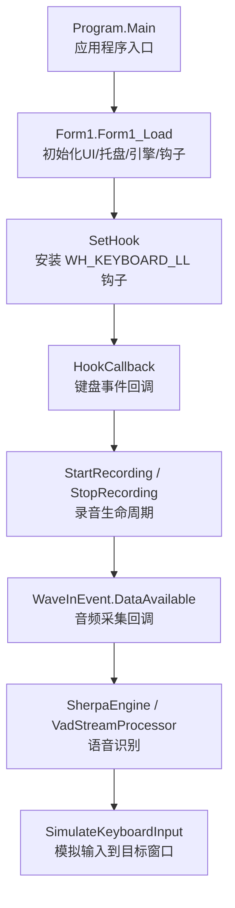
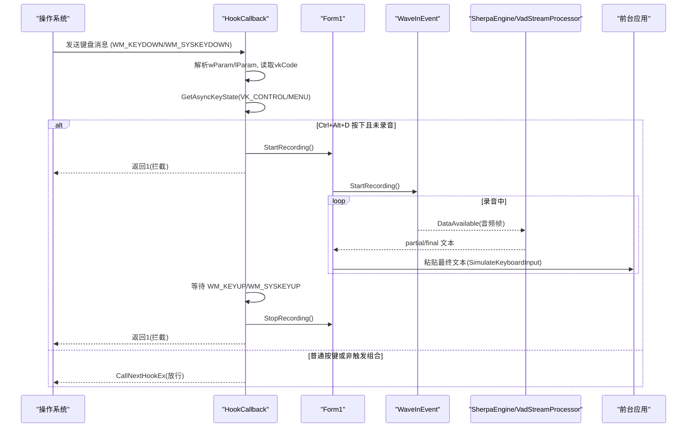
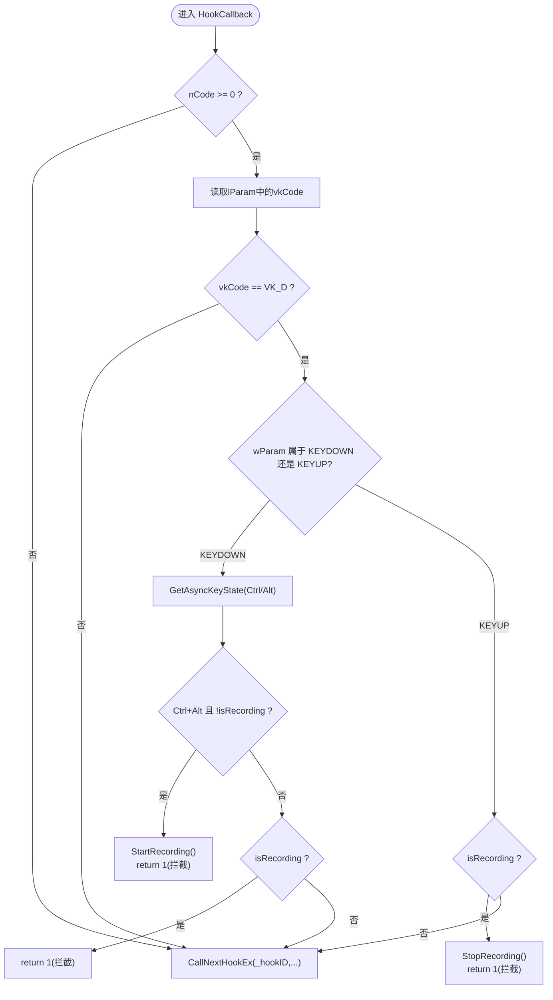
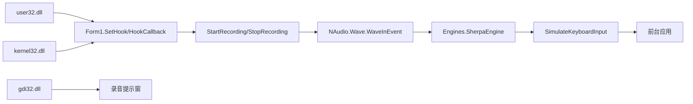

# 键盘钩子事件处理

<cite>
**本文引用的文件**   
- [Form1.cs](file://t9s2t/Form1.cs)
- [Program.cs](file://t9s2t/Program.cs)
- [App.config](file://t9s2t/App.config)
- [EngineDetector.cs](file://t9s2t/Engines/EngineDetector.cs)
- [SherpaEngine.cs](file://t9s2t/Engines/SherpaEngine.cs)
</cite>

## 目录
1. [简介](#简介)
2. [项目结构](#项目结构)
3. [核心组件](#核心组件)
4. [架构总览](#架构总览)
5. [详细组件分析](#详细组件分析)
6. [依赖关系分析](#依赖关系分析)
7. [性能与稳定性考量](#性能与稳定性考量)
8. [故障排查指南](#故障排查指南)
9. [结论](#结论)

## 简介
本技术文档聚焦于低级别键盘钩子的安装与回调处理机制，围绕 HookCallback 方法深入解析其实现原理。文档涵盖以下要点：
- SetWindowsHookEx API 的调用方式、WH_KEYBOARD_LL 常量使用以及 LowLevelKeyboardProc 委托定义
- WM_KEYDOWN、WM_KEYUP、WM_SYSKEYDOWN、WM_SYSKEYUP 等消息类型的区别与处理逻辑
- Ctrl+Alt+D 组合键的检测算法（GetAsyncKeyState 的使用与修饰键状态判断）
- 键盘事件的拦截与放行控制机制
- 错误处理策略与最佳实践

## 项目结构
本项目为 Windows Forms 应用，主窗体 Form1 负责：
- 注册并维护低级别键盘钩子
- 监听 Ctrl+Alt+D 组合键以启动/停止录音
- 将语音识别结果粘贴到前台窗口
- 管理引擎与模型资源

图表来源
- [Program.cs:15-24](file://t9s2t/Program.cs#L15-L24)
- [Form1.cs:151-235](file://t9s2t/Form1.cs#L151-L235)
- [Form1.cs:415-460](file://t9s2t/Form1.cs#L415-L460)
- [Form1.cs:1146-1273](file://t9s2t/Form1.cs#L1146-L1273)
- [Form1.cs:1057-1111](file://t9s2t/Form1.cs#L1057-L1111)
- [SherpaEngine.cs:351-509](file://t9s2t/Engines/SherpaEngine.cs#L351-L509)
- [Form1.cs:993-1051](file://t9s2t/Form1.cs#L993-L1051)

章节来源
- [Program.cs:15-24](file://t9s2t/Program.cs#L15-L24)
- [Form1.cs:151-235](file://t9s2t/Form1.cs#L151-L235)

## 核心组件
- 低级别键盘钩子系统
  - 委托与API声明：LowLevelKeyboardProc 委托、SetWindowsHookEx、UnhookWindowsHookEx、CallNextHookEx、GetModuleHandle、GetAsyncKeyState
  - 常量：WH_KEYBOARD_LL、WM_KEYDOWN、WM_KEYUP、WM_SYSKEYDOWN、WM_SYSKEYUP、VK_D、VK_CONTROL、VK_MENU
- 键盘事件处理流程
  - HookCallback：解析 wParam/lParam，判断按键与修饰键状态，决定拦截或放行
  - StartRecording/StopRecording：控制录音生命周期
  - SimulateKeyboardInput：将识别文本粘贴到前台窗口
- 音频采集与识别
  - WaveInEvent：采集麦克风数据
  - SherpaEngine：支持多种模型（SenseVoice、Paraformer、流式/非流式）
  - VadStreamProcessor：对不支持原生流式的引擎进行VAD模拟

章节来源
- [Form1.cs:82-127](file://t9s2t/Form1.cs#L82-L127)
- [Form1.cs:415-460](file://t9s2t/Form1.cs#L415-L460)
- [Form1.cs:1146-1273](file://t9s2t/Form1.cs#L1146-L1273)
- [Form1.cs:1057-1111](file://t9s2t/Form1.cs#L1057-L1111)
- [SherpaEngine.cs:351-509](file://t9s2t/Engines/SherpaEngine.cs#L351-L509)

## 架构总览
下图展示了从键盘事件到语音识别再到输入模拟的整体流程。

图表来源
- [Form1.cs:415-460](file://t9s2t/Form1.cs#L415-L460)
- [Form1.cs:1146-1273](file://t9s2t/Form1.cs#L1146-L1273)
- [Form1.cs:1057-1111](file://t9s2t/Form1.cs#L1057-L1111)
- [Form1.cs:993-1051](file://t9s2t/Form1.cs#L993-L1051)
- [SherpaEngine.cs:351-509](file://t9s2t/Engines/SherpaEngine.cs#L351-L509)

## 详细组件分析

### 低级别键盘钩子安装与回调
- 安装钩子
  - 通过 SetWindowsHookEx(WH_KEYBOARD_LL, proc, GetModuleHandle(...), 0) 在当前进程模块上安装全局键盘钩子
  - 保存 _hookID 以便后续卸载
- 回调函数 HookCallback
  - nCode >= 0 时继续处理
  - 从 lParam 读取 vkCode（当前按键虚拟码）
  - 仅处理 VK_D（D 键），其他按键直接放行
  - 根据 wParam 区分按下与松开：
    - isKeyDown = WM_KEYDOWN 或 WM_SYSKEYDOWN
    - isKeyUp = WM_KEYUP 或 WM_SYSKEYUP
  - 按下时检测修饰键：
    - GetAsyncKeyState(VK_CONTROL) & 0x8000 != 0 表示 Ctrl 按下
    - GetAsyncKeyState(VK_MENU) & 0x8000 != 0 表示 Alt 按下
  - 若同时按下 Ctrl+Alt 且未处于录音状态，则开始录音并拦截该按键（返回 1）
  - 若已处于录音状态，则在按下时也拦截 D 键，防止字符输入
  - 在松开时（isKeyUp 且 isRecording），停止录音并拦截该按键（返回 1）
  - 否则调用 CallNextHookEx 放行

图表来源
- [Form1.cs:415-460](file://t9s2t/Form1.cs#L415-L460)

章节来源
- [Form1.cs:82-127](file://t9s2t/Form1.cs#L82-L127)
- [Form1.cs:415-460](file://t9s2t/Form1.cs#L415-L460)

### 消息类型与处理逻辑
- WM_KEYDOWN（0x0100）：普通按键按下
- WM_KEYUP（0x0101）：普通按键松开
- WM_SYSKEYDOWN（0x0104）：系统键按下（例如 Alt 按住时的按键）
- WM_SYSKEYUP（0x0105）：系统键松开（例如 Alt 按住时的按键）
- 处理差异
  - 当 Alt 被按住时，Windows 会将 D 键作为系统键处理，因此需要兼容 WM_SYSKEYDOWN/WM_SYSKEYUP
  - 代码中将这两类消息统一归类为“按下”和“松开”，从而简化分支逻辑

章节来源
- [Form1.cs:108-117](file://t9s2t/Form1.cs#L108-L117)
- [Form1.cs:422-460](file://t9s2t/Form1.cs#L422-L460)

### Ctrl+Alt+D 组合键检测算法
- 使用 GetAsyncKeyState 查询修饰键状态
  - VK_CONTROL（0x11）：检查 Ctrl 是否按下
  - VK_MENU（0x12）：检查 Alt 是否按下
- 判定条件
  - 按下 D 键且 wParam 为 WM_KEYDOWN 或 WM_SYSKEYDOWN
  - GetAsyncKeyState(VK_CONTROL) 最高位为 1 且 GetAsyncKeyState(VK_MENU) 最高位为 1
  - 当前不在录音状态（!isRecording）
- 行为
  - 满足条件则开始录音并拦截该按键（返回 1）
  - 不满足条件则按常规逻辑处理（可能放行或拦截，取决于录音状态）

章节来源
- [Form1.cs:93-94](file://t9s2t/Form1.cs#L93-L94)
- [Form1.cs:113-116](file://t9s2t/Form1.cs#L113-L116)
- [Form1.cs:422-460](file://t9s2t/Form1.cs#L422-L460)

### 键盘事件拦截与放行控制
- 拦截
  - 当检测到 Ctrl+Alt+D 按下且未录音：拦截 D 键，避免字符输入，并开始录音
  - 录音中按下 D 键：拦截 D 键，避免字符输入
  - 录音中松开 D 键：停止录音并拦截 D 键
- 放行
  - 非 D 键：直接调用 CallNextHookEx 放行
  - D 键但非 Ctrl+Alt+D 且未录音：放行，允许正常打字

章节来源
- [Form1.cs:415-460](file://t9s2t/Form1.cs#L415-L460)

### 录音生命周期与输入模拟
- StartRecording
  - 设置 isRecording=true，重置引擎与 VAD，启动 WaveInEvent 录音
  - 显示录音提示浮窗，更新托盘与状态栏
- StopRecording
  - 停止录音设备，确保最后几帧音频不被丢弃
  - 在锁内设置 isRecording=false，并根据引擎模式获取最终文本
  - 调用 SimulateKeyboardInput 粘贴结果
- SimulateKeyboardInput
  - 非最终结果（partial）：仅更新托盘提示，不粘贴到目标窗口
  - 最终结果（final）：
    - 尝试将前台窗口设为目标窗口（ForceForegroundWindow）
    - 若 Alt 仍按下，先临时释放以避免 Alt+Space 弹出系统菜单
    - 复制文本到剪贴板，等待后发送 ^v 粘贴，再发送空格
    - 异常时回退为逐字符输入（FallbackTypeText）

章节来源
- [Form1.cs:1146-1273](file://t9s2t/Form1.cs#L1146-L1273)
- [Form1.cs:993-1051](file://t9s2t/Form1.cs#L993-L1051)
- [Form1.cs:1114-1144](file://t9s2t/Form1.cs#L1114-L1144)

### 音频采集与识别集成
- WaveInEvent
  - 初始化设备与采样格式（16kHz 单声道）
  - DataAvailable 回调中根据引擎模式处理音频帧
- SherpaEngine
  - 支持 SenseVoice、Paraformer（离线）、流式 Paraformer
  - AcceptAudio 接收音频帧；GetPartialResult/GetFinalResult 获取识别结果
  - 标点恢复与 VAD 可选加载
- VadStreamProcessor
  - 对不支持原生流式的引擎进行 VAD 模拟，分句输出

章节来源
- [Form1.cs:1057-1111](file://t9s2t/Form1.cs#L1057-L1111)
- [SherpaEngine.cs:351-509](file://t9s2t/Engines/SherpaEngine.cs#L351-L509)
- [EngineDetector.cs:27-75](file://t9s2t/Engines/EngineDetector.cs#L27-L75)

## 依赖关系分析
- 外部系统调用
  - user32.dll：SetWindowsHookEx、UnhookWindowsHookEx、CallNextHookEx、GetAsyncKeyState、keybd_event、窗口相关 API
  - kernel32.dll：GetModuleHandle
  - gdi32.dll：CreateRoundRectRgn（用于圆角提示窗）
- 内部模块
  - Engines.EngineDetector：自动检测模型类型并创建引擎实例
  - Engines.SherpaEngine：封装 sherpa-onnx 推理能力
  - NAudio.Wave：WaveInEvent 音频采集
  - Newtonsoft.Json：远程配置与模型列表解析
  - System.Windows.Forms：UI 与 SendKeys 输入模拟

图表来源
- [Form1.cs:82-127](file://t9s2t/Form1.cs#L82-L127)
- [Form1.cs:415-460](file://t9s2t/Form1.cs#L415-L460)
- [Form1.cs:1146-1273](file://t9s2t/Form1.cs#L1146-L1273)
- [Form1.cs:1057-1111](file://t9s2t/Form1.cs#L1057-L1111)
- [SherpaEngine.cs:351-509](file://t9s2t/Engines/SherpaEngine.cs#L351-L509)

章节来源
- [Form1.cs:82-127](file://t9s2t/Form1.cs#L82-L127)
- [EngineDetector.cs:27-75](file://t9s2t/Engines/EngineDetector.cs#L27-L75)
- [SherpaEngine.cs:351-509](file://t9s2t/Engines/SherpaEngine.cs#L351-L509)

## 性能与稳定性考量
- 钩子回调性能
  - HookCallback 应尽量轻量，避免阻塞；当前实现仅做按键判断与状态切换，符合高性能要求
- 线程安全
  - 使用 lock(_inputLock) 保护录音与输入操作，避免并发冲突
- 输入稳定性
  - 优先使用剪贴板 + SendKeys 粘贴，失败时回退为逐字符输入
  - 针对 Alt 仍按下的情况，临时释放 Alt 以避免系统菜单弹出
- 网络与资源
  - 程序启动即设置 TLS 协议版本，确保远程下载稳定
  - 引擎 DLL 与模型按需下载与校验，失败清理残留文件

章节来源
- [Form1.cs:988-1051](file://t9s2t/Form1.cs#L988-L1051)
- [Program.cs:15-24](file://t9s2t/Program.cs#L15-L24)
- [App.config:1-10](file://t9s2t/App.config#L1-L10)

## 故障排查指南
- 钩子未生效
  - 确认 SetHook 成功返回非零句柄；在退出时调用 UnhookWindowsHookEx 释放
  - 检查 WH_KEYBOARD_LL 常量是否正确（13）
- 组合键无效
  - 确认 GetAsyncKeyState 返回值最高位是否为 1（表示按下）
  - 注意 WM_SYSKEYDOWN/WM_SYSKEYUP 与 WM_KEYDOWN/WM_KEYUP 的区别
- 输入未粘贴
  - 检查 ForceForegroundWindow 是否能正确切换到目标窗口
  - 查看 SimulateKeyboardInput 的异常日志与回退路径
- 录音无输出
  - 确认 WaveInEvent 设备可用（DeviceCount > 0）
  - 检查引擎是否加载成功，SherpaEngine 是否支持流式识别
- 模型/引擎缺失
  - 检查 AreEngineDllsReady 与 AutoCheckModel 的输出
  - 查看 DownloadEngineDllsAsync 与 FetchModelsAsync 的错误信息

章节来源
- [Form1.cs:415-460](file://t9s2t/Form1.cs#L415-L460)
- [Form1.cs:1146-1273](file://t9s2t/Form1.cs#L1146-L1273)
- [Form1.cs:1057-1111](file://t9s2t/Form1.cs#L1057-L1111)
- [Form1.cs:468-567](file://t9s2t/Form1.cs#L468-L567)

## 结论
本项目通过低级别键盘钩子实现了高效的 Ctrl+Alt+D 组合键监听与录音控制。HookCallback 采用简洁的消息分类与修饰键检测，结合录音生命周期管理与健壮的输入模拟策略，确保了良好的用户体验与稳定性。整体架构清晰，依赖明确，具备较好的可维护性与扩展性。