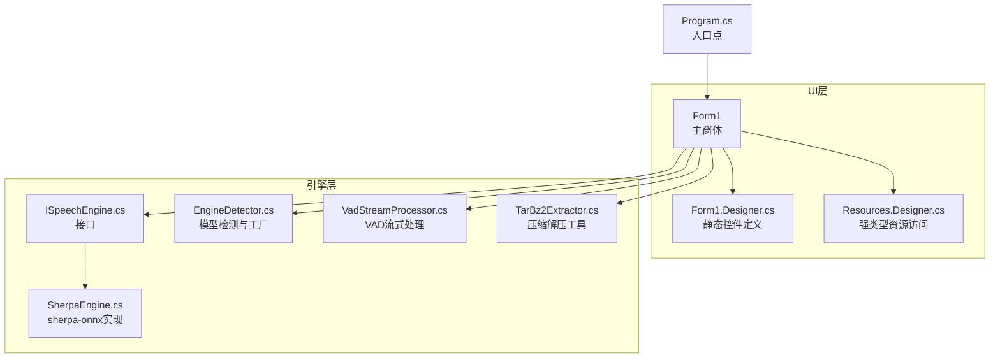
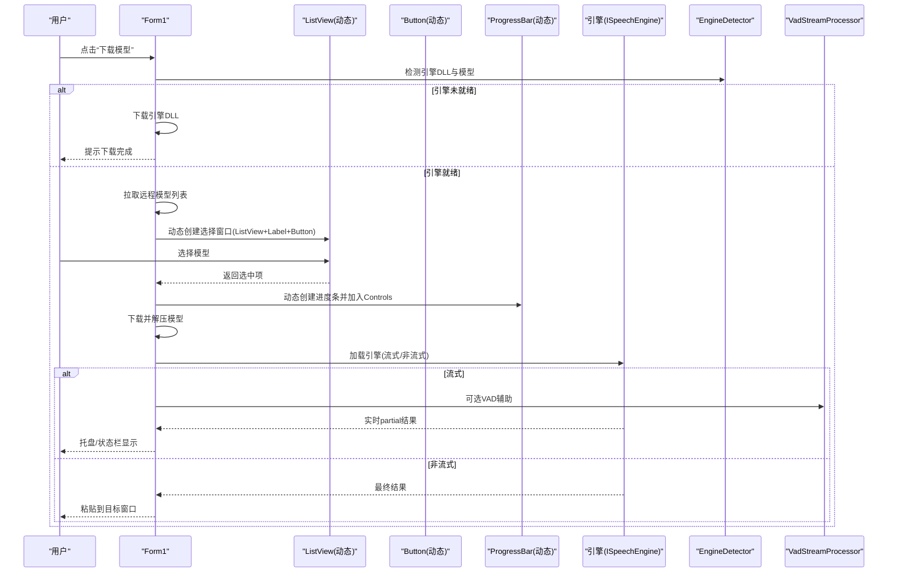
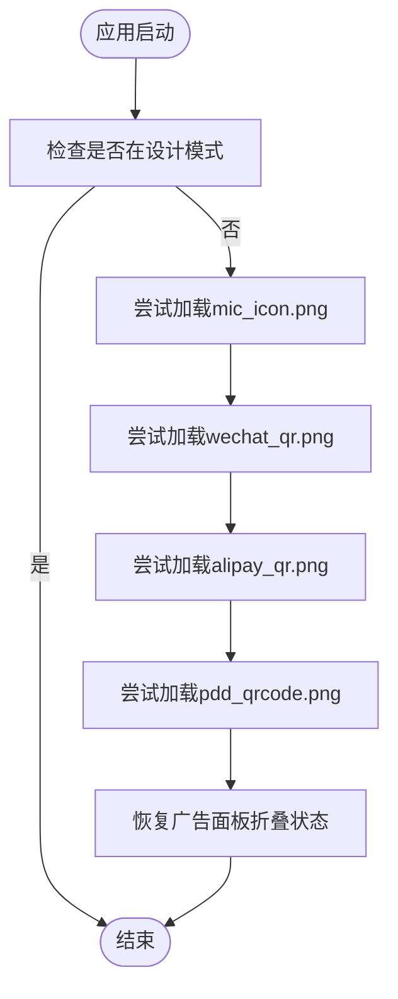
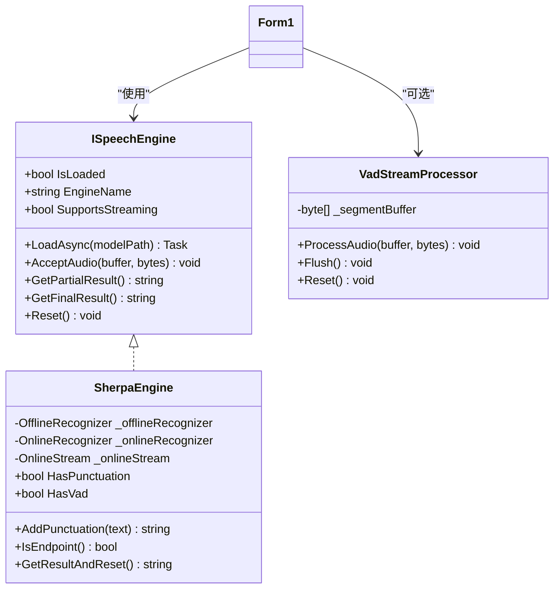
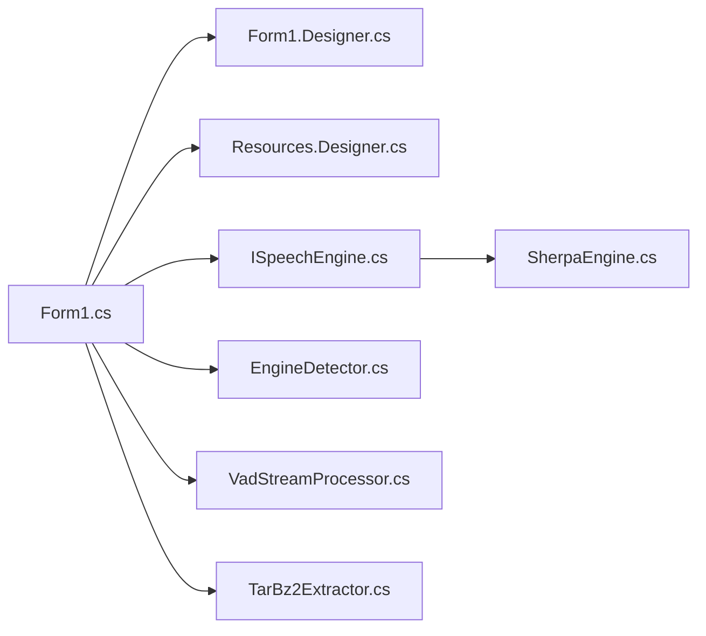

# 动态UI控件管理

<cite>
**本文引用的文件**
- [Form1.cs](file://t9s2t/Form1.cs)
- [Form1.Designer.cs](file://t9s2t/Form1.Designer.cs)
- [Program.cs](file://t9s2t/Program.cs)
- [Resources.Designer.cs](file://t9s2t/Properties/Resources.Designer.cs)
- [ISpeechEngine.cs](file://t9s2t/Engines/ISpeechEngine.cs)
- [SherpaEngine.cs](file://t9s2t/Engines/SherpaEngine.cs)
- [EngineDetector.cs](file://t9s2t/Engines/EngineDetector.cs)
- [VadStreamProcessor.cs](file://t9s2t/Engines/VadStreamProcessor.cs)
- [TarBz2Extractor.cs](file://t9s2t/Engines/TarBz2Extractor.cs)
</cite>

## 目录
1. [引言](#引言)
2. [项目结构](#项目结构)
3. [核心组件](#核心组件)
4. [架构总览](#架构总览)
5. [详细组件分析](#详细组件分析)
6. [依赖关系分析](#依赖关系分析)
7. [性能考量](#性能考量)
8. [故障排查指南](#故障排查指南)
9. [结论](#结论)
10. [附录：与静态设计器集成要点](#附录与静态设计器集成要点)

## 引言
本技术文档围绕“动态UI控件管理”展开，聚焦于在运行时创建、配置和管理控件（如 CheckBox、Button、Label、ListView、ProgressBar 等）的机制与实践。结合仓库中的实际实现，文档将系统阐述：
- 动态控件的创建、属性设置、事件绑定与布局管理
- 动态资源加载（图片）与缓存策略
- 控件生命周期管理（创建、更新、销毁）
- 动态 UI 扩展开发指南与性能优化技巧
- 与静态设计器生成代码的集成方式与注意事项

## 项目结构
该应用为 WinForms 桌面程序，主界面由 Form1 承载，静态控件通过 Designer 生成，动态控件在运行时按需创建并添加到父容器。引擎层封装了语音识别能力，UI 层负责交互与状态展示。

图表来源
- [Form1.cs:144-235](file://t9s2t/Form1.cs#L144-L235)
- [Form1.Designer.cs:29-215](file://t9s2t/Form1.Designer.cs#L29-L215)
- [Program.cs:16-24](file://t9s2t/Program.cs#L16-L24)
- [Resources.Designer.cs:25-102](file://t9s2t/Properties/Resources.Designer.cs#L25-L102)
- [ISpeechEngine.cs:8-33](file://t9s2t/Engines/ISpeechEngine.cs#L8-L33)
- [SherpaEngine.cs:14-72](file://t9s2t/Engines/SherpaEngine.cs#L14-L72)
- [EngineDetector.cs:22-122](file://t9s2t/Engines/EngineDetector.cs#L22-L122)
- [VadStreamProcessor.cs:12-33](file://t9s2t/Engines/VadStreamProcessor.cs#L12-L33)
- [TarBz2Extractor.cs:17-96](file://t9s2t/Engines/TarBz2Extractor.cs#L17-L96)

章节来源
- [Form1.cs:144-235](file://t9s2t/Form1.cs#L144-L235)
- [Form1.Designer.cs:29-215](file://t9s2t/Form1.Designer.cs#L29-L215)
- [Program.cs:16-24](file://t9s2t/Program.cs#L16-L24)

## 核心组件
- 主窗体 Form1：承载静态与动态控件，负责动态资源加载、动态对话框构建、下载进度条动态添加、录音提示浮窗动态创建等。
- 设计器 Form1.Designer.cs：声明并初始化静态控件（按钮、标签、面板、图片框等），提供布局与默认样式。
- 资源类 Resources.Designer.cs：提供强类型资源访问（二维码图片等）。
- 引擎接口 ISpeechEngine 与实现 SherpaEngine：抽象语音识别能力，支持多种模型与流式/非流式模式。
- 引擎检测 EngineDetector：根据模型目录结构自动识别引擎类型并创建实例。
- VAD 流处理器 VadStreamProcessor：对非流式模型进行静音分段，模拟流式体验。
- 解压工具 TarBz2Extractor：统一处理 zip/tar.bz2 等格式，避免外部依赖。

章节来源
- [Form1.cs:144-235](file://t9s2t/Form1.cs#L144-L235)
- [Form1.Designer.cs:29-215](file://t9s2t/Form1.Designer.cs#L29-L215)
- [Resources.Designer.cs:25-102](file://t9s2t/Properties/Resources.Designer.cs#L25-L102)
- [ISpeechEngine.cs:8-33](file://t9s2t/Engines/ISpeechEngine.cs#L8-L33)
- [SherpaEngine.cs:14-72](file://t9s2t/Engines/SherpaEngine.cs#L14-L72)
- [EngineDetector.cs:22-122](file://t9s2t/Engines/EngineDetector.cs#L22-L122)
- [VadStreamProcessor.cs:12-33](file://t9s2t/Engines/VadStreamProcessor.cs#L12-L33)
- [TarBz2Extractor.cs:17-96](file://t9s2t/Engines/TarBz2Extractor.cs#L17-L96)

## 架构总览
下图展示了 UI 与引擎层的交互关系，以及动态控件在关键流程中的参与方式。

图表来源
- [Form1.cs:724-817](file://t9s2t/Form1.cs#L724-L817)
- [Form1.cs:853-966](file://t9s2t/Form1.cs#L853-L966)
- [Form1.cs:645-721](file://t9s2t/Form1.cs#L645-L721)
- [EngineDetector.cs:22-122](file://t9s2t/Engines/EngineDetector.cs#L22-L122)
- [VadStreamProcessor.cs:12-33](file://t9s2t/Engines/VadStreamProcessor.cs#L12-L33)

## 详细组件分析

### 动态控件创建与管理（Form1）
- 动态 CheckBox（开机自启）
  - 在窗体加载时创建，设置文本、位置、尺寸、字体、颜色，并绑定 CheckedChanged 事件，随后添加到 this.Controls 并置于顶层。
  - 参考路径：[Form1.cs:171-182](file://t9s2t/Form1.cs#L171-L182)
- 动态模型选择对话框
  - 使用 new Form() 创建子窗体，动态添加 Label、ListView、Button，并为 ListView 添加列头与数据行；设置 AcceptButton 提升用户体验。
  - 参考路径：[Form1.cs:751-800](file://t9s2t/Form1.cs#L751-L800)
- 动态 ProgressBar（下载进度）
  - 在下载开始时创建 ProgressBar，设置位置、大小、最小/最大值、样式，加入 Controls 并 BringToFront；下载完成后从 Controls 移除。
  - 参考路径：[Form1.cs:858-874](file://t9s2t/Form1.cs#L858-L874)
- 动态录音提示浮窗
  - 首次使用时创建 NonActivatingForm（不会抢夺焦点），内部动态添加 Label，设置圆角区域与屏幕底部居中位置；结束时隐藏。
  - 参考路径：[Form1.cs:1177-1217](file://t9s2t/Form1.cs#L1177-L1217)

最佳实践要点
- 控件创建时机：优先在 Load 或业务触发点创建，避免在构造函数中做耗时操作。
- 属性设置顺序：先设置外观与行为属性，再添加到父容器，最后 BringToFront 确保层级正确。
- 事件绑定：使用匿名委托或命名方法均可，注意跨线程调用时使用 BeginInvoke/Invoke。
- 布局管理：尽量使用绝对坐标配合固定 ClientSize，或在折叠/展开逻辑中集中调整。

章节来源
- [Form1.cs:171-182](file://t9s2t/Form1.cs#L171-L182)
- [Form1.cs:751-800](file://t9s2t/Form1.cs#L751-L800)
- [Form1.cs:858-874](file://t9s2t/Form1.cs#L858-L874)
- [Form1.cs:1177-1217](file://t9s2t/Form1.cs#L1177-L1217)

### 动态资源加载机制（图片）
- 启动时尝试从应用程序目录加载 mic_icon.png、wechat_qr.png、alipay_qr.png、pdd_qrcode.png，若存在则赋值给对应 PictureBox.Image。
- 同时恢复广告面板折叠状态（持久化到 ad_state.txt）。
- 参考路径：[Form1.cs:290-303](file://t9s2t/Form1.cs#L290-L303)

缓存策略建议
- 图片对象在内存中由 GDI+ 管理，重复 Image.FromFile 会导致多次磁盘读取与句柄占用。建议在应用内维护一个静态字典缓存已加载的 Image 实例，按文件名键控，减少 IO 与内存抖动。
- 对于大图标或高频切换的图片，可考虑缩略图缓存与异步加载。

章节来源
- [Form1.cs:290-303](file://t9s2t/Form1.cs#L290-L303)

### 控件生命周期管理（创建、更新、销毁）
- 创建：在需要时 new 控件并设置属性，然后 Controls.Add。
- 更新：通过属性修改与 Invoke/BeginInvoke 安全更新 UI；例如下载进度、状态文本、托盘提示。
- 销毁：
  - 临时控件（如 ProgressBar）在完成阶段从 Controls 移除，避免残留。
  - 长期控件（如 recordingIndicator）在合适时机 Hide 并在关闭时 Dispose。
  - 全局资源（引擎、麦克风、托盘图标）在 FormClosing 中释放。
- 参考路径：
  - 动态控件移除：[Form1.cs:872-874](file://t9s2t/Form1.cs#L872-L874)
  - 录音提示隐藏：[Form1.cs:1219-1223](file://t9s2t/Form1.cs#L1219-L1223)
  - 全局资源释放：[Form1.cs:279-288](file://t9s2t/Form1.cs#L279-L288)

章节来源
- [Form1.cs:872-874](file://t9s2t/Form1.cs#L872-L874)
- [Form1.cs:1219-1223](file://t9s2t/Form1.cs#L1219-L1223)
- [Form1.cs:279-288](file://t9s2t/Form1.cs#L279-L288)

### 动态资源加载流程图

图表来源
- [Form1.cs:290-303](file://t9s2t/Form1.cs#L290-L303)

### 引擎与UI协作（流式与非流式）
- 引擎加载后根据 SupportsStreaming 决定使用 SherpaEngine 原生流式或 VAD 模拟流式。
- partial 结果节流与去重，避免频繁 UI 更新造成闪烁。
- 最终结果通过剪贴板+快捷键粘贴到前台窗口，必要时回退逐字符输入。

图表来源
- [ISpeechEngine.cs:8-33](file://t9s2t/Engines/ISpeechEngine.cs#L8-L33)
- [SherpaEngine.cs:14-72](file://t9s2t/Engines/SherpaEngine.cs#L14-L72)
- [VadStreamProcessor.cs:12-33](file://t9s2t/Engines/VadStreamProcessor.cs#L12-L33)

章节来源
- [Form1.cs:645-721](file://t9s2t/Form1.cs#L645-L721)
- [Form1.cs:1057-1111](file://t9s2t/Form1.cs#L1057-L1111)
- [VadStreamProcessor.cs:38-86](file://t9s2t/Engines/VadStreamProcessor.cs#L38-L86)

## 依赖关系分析
- UI 层依赖引擎接口与具体实现，通过 EngineDetector 自动选择引擎类型。
- 资源访问通过强类型 Resources 类，Designer 生成的控件引用嵌入资源。
- 网络请求与下载流程在 UI 层协调，动态控件用于反馈进度与选择。

图表来源
- [Form1.cs:144-235](file://t9s2t/Form1.cs#L144-L235)
- [Form1.Designer.cs:29-215](file://t9s2t/Form1.Designer.cs#L29-L215)
- [Resources.Designer.cs:25-102](file://t9s2t/Properties/Resources.Designer.cs#L25-L102)
- [ISpeechEngine.cs:8-33](file://t9s2t/Engines/ISpeechEngine.cs#L8-L33)
- [SherpaEngine.cs:14-72](file://t9s2t/Engines/SherpaEngine.cs#L14-L72)
- [EngineDetector.cs:22-122](file://t9s2t/Engines/EngineDetector.cs#L22-L122)
- [VadStreamProcessor.cs:12-33](file://t9s2t/Engines/VadStreamProcessor.cs#L12-L33)
- [TarBz2Extractor.cs:17-96](file://t9s2t/Engines/TarBz2Extractor.cs#L17-L96)

章节来源
- [Form1.cs:144-235](file://t9s2t/Form1.cs#L144-L235)
- [EngineDetector.cs:22-122](file://t9s2t/Engines/EngineDetector.cs#L22-L122)

## 性能考量
- 动态控件数量控制：仅在需要时创建，完成后及时移除或隐藏，避免 Controls 集合膨胀。
- 图片资源缓存：避免重复 Image.FromFile，建议使用字典缓存并按需释放。
- UI 更新节流：partial 结果采用时间间隔与去重策略，降低 BeginInvoke 频率。
- 网络请求与解压：使用异步任务与进度回调，避免阻塞 UI 线程。
- 音频数据处理：RMS 计算与采样转换在引擎层进行，UI 仅消费文本结果。

[本节为通用指导，不直接分析具体文件]

## 故障排查指南
- 动态控件未显示
  - 确认控件已添加到父容器且 BringToFront；检查父容器可见性与尺寸。
  - 参考路径：[Form1.cs:858-874](file://t9s2t/Form1.cs#L858-L874)
- 图片资源未加载
  - 检查文件是否存在于应用程序目录；捕获异常并降级处理。
  - 参考路径：[Form1.cs:290-303](file://t9s2t/Form1.cs#L290-L303)
- 下载失败或解压错误
  - 查看状态文本与异常信息；确认链接有效与格式支持；清理临时文件。
  - 参考路径：[Form1.cs:876-966](file://t9s2t/Form1.cs#L876-L966)
- 引擎加载失败
  - 检查模型目录结构与 tokens 文件；确认 DLL 完整性。
  - 参考路径：[EngineDetector.cs:27-75](file://t9s2t/Engines/EngineDetector.cs#L27-L75)、[SherpaEngine.cs:74-115](file://t9s2t/Engines/SherpaEngine.cs#L74-L115)

章节来源
- [Form1.cs:290-303](file://t9s2t/Form1.cs#L290-L303)
- [Form1.cs:876-966](file://t9s2t/Form1.cs#L876-L966)
- [EngineDetector.cs:27-75](file://t9s2t/Engines/EngineDetector.cs#L27-L75)
- [SherpaEngine.cs:74-115](file://t9s2t/Engines/SherpaEngine.cs#L74-L115)

## 结论
本项目在 WinForms 中实现了完善的动态 UI 管理机制：在运行时按需创建控件、绑定事件、管理生命周期，并结合动态资源加载与引擎协作，提供了流畅的用户体验。通过合理的节流、缓存与异步策略，保证了性能与稳定性。后续可在资源缓存、控件复用与主题切换方面进一步优化。

[本节为总结性内容，不直接分析具体文件]

## 附录：与静态设计器集成要点
- 静态控件声明与初始化位于 Designer 文件，动态控件在业务逻辑中创建并添加到同一父容器。
- 注意 Designer 生成的控件命名与布局常量，避免冲突；动态控件定位应尊重现有布局。
- 资源引用：Designer 中使用强类型资源，动态加载时可直接从文件系统读取，两者并存互不影响。
- 事件处理：Designer 绑定的 Click 事件与方法名一致，动态控件的事件可复用相同处理逻辑。

章节来源
- [Form1.Designer.cs:29-215](file://t9s2t/Form1.Designer.cs#L29-L215)
- [Resources.Designer.cs:25-102](file://t9s2t/Properties/Resources.Designer.cs#L25-L102)
- [Form1.cs:144-235](file://t9s2t/Form1.cs#L144-L235)