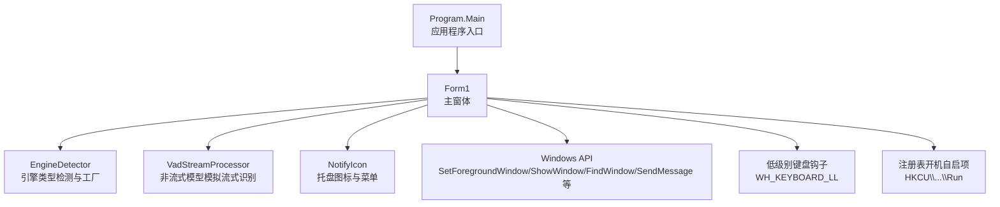
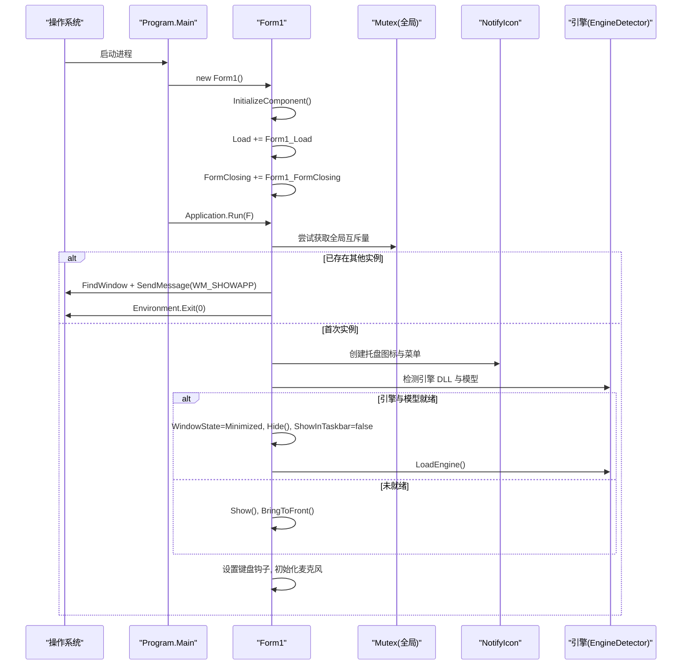
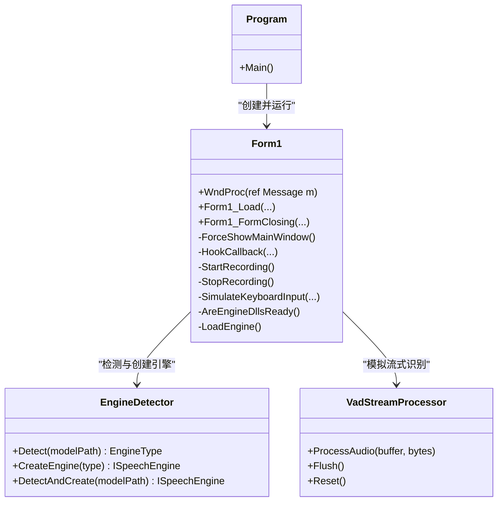

# 窗体生命周期管理

<cite>
**本文引用的文件**   
- [Form1.cs](file://t9s2t/Form1.cs)
- [Program.cs](file://t9s2t/Program.cs)
- [Form1.Designer.cs](file://t9s2t/Form1.Designer.cs)
- [App.config](file://t9s2t/App.config)
- [EngineDetector.cs](file://t9s2t/Engines/EngineDetector.cs)
- [VadStreamProcessor.cs](file://t9s2t/Engines/VadStreamProcessor.cs)
</cite>

## 目录
1. [简介](#简介)
2. [项目结构](#项目结构)
3. [核心组件](#核心组件)
4. [架构总览](#架构总览)
5. [详细组件分析](#详细组件分析)
6. [依赖关系分析](#依赖关系分析)
7. [性能与资源管理](#性能与资源管理)
8. [故障排查指南](#故障排查指南)
9. [结论](#结论)

## 简介
本技术文档聚焦于 Windows 窗体应用的主窗体 Form1 的完整生命周期管理，涵盖：
- 构造函数初始化、Load 事件处理、FormClosing 事件处理
- WndProc 消息处理机制与自定义消息 WM_SHOWAPP 的进程间通信实现
- 单实例运行控制（全局 Mutex）的创建与检测逻辑
- 从启动到最小化再到系统托盘的状态转换流程
- 键盘钩子、录音提示浮窗、剪贴板粘贴等交互细节
- 资源管理与清理的最佳实践及异常处理策略

## 项目结构
该应用为 .NET Framework WinForms 程序，主入口在 Program.Main，主窗体为 Form1。引擎检测与 VAD 流式处理位于 Engines 命名空间下。

图表来源
- [Program.cs:15-24](file://t9s2t/Program.cs#L15-L24)
- [Form1.cs:144-235](file://t9s2t/Form1.cs#L144-L235)
- [EngineDetector.cs:22-104](file://t9s2t/Engines/EngineDetector.cs#L22-L104)
- [VadStreamProcessor.cs:12-101](file://t9s2t/Engines/VadStreamProcessor.cs#L12-L101)

章节来源
- [Program.cs:15-24](file://t9s2t/Program.cs#L15-L24)
- [Form1.Designer.cs:29-215](file://t9s2t/Form1.Designer.cs#L29-L215)

## 核心组件
- 主窗体 Form1：负责 UI 初始化、单实例控制、托盘显示、键盘钩子、音频采集与识别、结果输入、窗口状态切换。
- 引擎检测 EngineDetector：根据模型目录结构自动识别引擎类型并创建对应引擎实例。
- VAD 流式处理器 VadStreamProcessor：对非流式模型进行静音段检测，模拟流式识别体验。
- 托盘 NotifyIcon：提供“显示主界面”和“退出”操作，以及状态提示。
- 低级别键盘钩子：监听 Ctrl+Alt+D 组合键，触发录音开始/结束。
- 自定义消息 WM_SHOWAPP：用于多实例时唤醒已有实例的主窗体。

章节来源
- [Form1.cs:144-235](file://t9s2t/Form1.cs#L144-L235)
- [EngineDetector.cs:22-104](file://t9s2t/Engines/EngineDetector.cs#L22-L104)
- [VadStreamProcessor.cs:12-101](file://t9s2t/Engines/VadStreamProcessor.cs#L12-L101)

## 架构总览
下图展示了从应用启动到主窗体进入后台运行的关键路径，包括单实例互斥量检查、托盘初始化、引擎加载与最小化隐藏。

图表来源
- [Program.cs:15-24](file://t9s2t/Program.cs#L15-L24)
- [Form1.cs:144-235](file://t9s2t/Form1.cs#L144-L235)
- [EngineDetector.cs:22-104](file://t9s2t/Engines/EngineDetector.cs#L22-L104)

## 详细组件分析

### 1) 构造函数与事件绑定
- 构造函数中调用 InitializeComponent 完成控件初始化，并订阅 Load 与 FormClosing 事件。
- 设计器生成的 InitializeComponent 负责控件树构建与默认属性设置。

章节来源
- [Form1.cs:144-149](file://t9s2t/Form1.cs#L144-L149)
- [Form1.Designer.cs:29-215](file://t9s2t/Form1.Designer.cs#L29-L215)

### 2) Load 事件处理与单实例控制
- 使用全局 Mutex 名称 "Global\t9s2t_single_instance_mutex_v3" 确保单实例运行。
- 若无法创建新互斥量，说明已有实例在运行：通过 FindWindow 查找同名窗口句柄，发送自定义消息 WM_SHOWAPP 将其激活，然后退出当前进程。
- 托盘初始化：创建 NotifyIcon 与上下文菜单，双击或菜单项可强制显示主窗体。
- 动态添加“开机自动启动”复选框，读写注册表 HKCU\...\Run 项。
- 引擎与模型检测：
  - AreEngineDllsReady 检查必需 DLL 是否存在且大小大于 0。
  - EngineDetector.Detect 基于模型目录结构判断引擎类型。
  - 若引擎与模型均就绪：将窗体最小化、隐藏、不显示在任务栏，并异步加载引擎；否则保持可见引导用户下载。
- 安装低级别键盘钩子 WH_KEYBOARD_LL，监听 Ctrl+Alt+D 触发录音。
- 初始化麦克风设备 WaveInEvent。

章节来源
- [Form1.cs:151-235](file://t9s2t/Form1.cs#L151-L235)
- [EngineDetector.cs:22-75](file://t9s2t/Engines/EngineDetector.cs#L22-L75)

### 3) WndProc 与自定义消息 WM_SHOWAPP
- 重写 WndProc，当收到 WM_SHOWAPP 时调用 ForceShowMainWindow 恢复主窗体。
- 自定义消息通过 RegisterWindowMessage 注册唯一字符串，跨进程安全。
- 多实例场景：第二个实例通过 FindWindow 找到第一个实例的主窗口句柄，SendMessage 发送 WM_SHOWAPP，随后退出自身进程。

章节来源
- [Form1.cs:119-124](file://t9s2t/Form1.cs#L119-L124)
- [Form1.cs:237-241](file://t9s2t/Form1.cs#L237-L241)
- [Form1.cs:156-162](file://t9s2t/Form1.cs#L156-L162)

### 4) 窗体状态转换：启动 → 最小化 → 托盘
- 正常启动后，若引擎与模型就绪：
  - WindowState = Minimized
  - Hide()
  - ShowInTaskbar = false
  - 托盘气泡提示“程序已在后台运行”
- 用户通过托盘菜单或双击托盘图标，或通过 WM_SHOWAPP 消息，触发 ForceShowMainWindow：
  - 修正 ClientSize（避免最小化/隐藏导致尺寸异常）
  - 使用 AttachThreadInput 提升前台窗口激活成功率
  - ShowWindow(SW_RESTORE/SW_SHOW)、BringToFront、Activate
  - 恢复 ShowInTaskbar=true 与 Visible=true

章节来源
- [Form1.cs:196-214](file://t9s2t/Form1.cs#L196-L214)
- [Form1.cs:243-258](file://t9s2t/Form1.cs#L243-L258)

### 5) 键盘钩子与录音流程
- 低级别键盘钩子回调 HookCallback：
  - 检测 VK_D 键按下/释放，结合 GetAsyncKeyState 判断 Ctrl 与 Alt 是否同时按下。
  - Ctrl+Alt+D 按下：StartRecording，拦截按键返回 1 阻止系统输入。
  - 录音中：继续拦截 D 键防止字符输入。
  - D 键释放：StopRecording，停止录音并输出最终结果。
- StartRecording：
  - 重置引擎与 VAD 处理器，启动 WaveInEvent 录音。
  - 保存当前前台窗口句柄，避免提示浮窗抢焦点影响后续粘贴目标。
  - 显示录音提示浮窗 NonActivatingForm（不激活、置顶）。
- StopRecording：
  - 先停止录音设备，再在锁内设置 isRecording=false，确保最后几帧不被丢弃。
  - 根据引擎模式（流式/非流式）获取最终文本，调用 SimulateKeyboardInput 粘贴。
  - 更新 UI 并隐藏提示浮窗。

章节来源
- [Form1.cs:415-460](file://t9s2t/Form1.cs#L415-L460)
- [Form1.cs:1146-1173](file://t9s2t/Form1.cs#L1146-L1173)
- [Form1.cs:1228-1273](file://t9s2t/Form1.cs#L1228-L1273)
- [Form1.cs:1298-1309](file://t9s2t/Form1.cs#L1298-L1309)

### 6) 结果输入与防干扰策略
- SimulateKeyboardInput：
  - partial 结果仅更新托盘图标文本，避免频繁粘贴造成闪烁。
  - final 结果：
    - 强制前台窗口为目标窗口（ForceForegroundWindow），必要时 AttachThreadInput。
    - 若检测到 Alt 仍按下，临时释放 Alt 以避免 Alt+Space 弹出系统菜单。
    - 写入剪贴板并 SendKeys.SendWait("^v") 粘贴，追加空格。
    - 异常时回退到逐字符输入 FallbackTypeText。
- ForceForegroundWindow：
  - 若前台窗口是主窗体或录音提示浮窗，则回退到录音前保存的目标窗口句柄。
  - 使用 AttachThreadInput 提升 SetForegroundWindow 的成功率。

章节来源
- [Form1.cs:993-1051](file://t9s2t/Form1.cs#L993-L1051)
- [Form1.cs:1114-1144](file://t9s2t/Form1.cs#L1114-L1144)
- [App.config:4-6](file://t9s2t/App.config#L4-L6)

### 7) 引擎加载与流式处理
- LoadEngine：
  - 使用 EngineDetector.DetectAndCreate 创建引擎实例。
  - 若引擎支持流式：
    - SherpaEngine 原生流式：不使用 VAD，直接 AcceptAudio 并在端点检测后获取结果。
    - SenseVoice 等非流式：使用 VadStreamProcessor 模拟流式，按静音段提交识别。
  - 更新 UI 显示引擎名称、是否流式、是否带标点/VAD 等特性。
- VadStreamProcessor：
  - 计算音频能量，检测静音段，积累语音片段，达到阈值后提交识别。
  - 提供 Flush 与 Reset 方法，配合录音开始/结束流程。

章节来源
- [Form1.cs:645-721](file://t9s2t/Form1.cs#L645-L721)
- [EngineDetector.cs:100-104](file://t9s2t/Engines/EngineDetector.cs#L100-L104)
- [VadStreamProcessor.cs:38-101](file://t9s2t/Engines/VadStreamProcessor.cs#L38-L101)

### 8) 资源管理与清理最佳实践
- 互斥量释放：FormClosing 中 _mutex?.ReleaseMutex()，避免进程退出后残留全局对象。
- 钩子卸载：_hookID != IntPtr.Zero 时调用 UnhookWindowsHookEx。
- 音频与引擎释放：waveIn.Dispose()、engine.Dispose()。
- 托盘释放：trayIcon.Dispose()。
- 异常处理：
  - 注册表读写失败时回滚勾选状态并提示。
  - 网络请求失败时使用内置备用配置（模型列表与引擎 DLL 清单）。
  - 剪贴板粘贴失败时回退到逐字符输入。
- 线程安全：
  - 使用 lock(_inputLock) 保护录音数据、引擎调用与输入操作。
  - UI 更新使用 BeginInvoke 避免阻塞。

章节来源
- [Form1.cs:279-288](file://t9s2t/Form1.cs#L279-L288)
- [Form1.cs:260-277](file://t9s2t/Form1.cs#L260-L277)
- [Form1.cs:569-599](file://t9s2t/Form1.cs#L569-L599)
- [Form1.cs:818-851](file://t9s2t/Form1.cs#L818-L851)
- [Form1.cs:988-1051](file://t9s2t/Form1.cs#L988-L1051)

## 依赖关系分析
- Program.Main 启动 Application.Run(new Form1())，进入消息循环。
- Form1 依赖：
  - Windows API（user32.dll、kernel32.dll、gdi32.dll）用于窗口控制、钩子、区域绘制。
  - NAudio.Wave 用于音频采集。
  - Newtonsoft.Json 解析远程 JSON 配置。
  - Microsoft.Win32.Registry 读写注册表。
  - t9s2t.Engines 下的引擎检测与 VAD 处理。
- 外部服务：
  - 远程模型清单与引擎 DLL 清单（HTTPS），具备本地 fallback 配置。

图表来源
- [Program.cs:15-24](file://t9s2t/Program.cs#L15-L24)
- [Form1.cs:237-241](file://t9s2t/Form1.cs#L237-L241)
- [EngineDetector.cs:22-104](file://t9s2t/Engines/EngineDetector.cs#L22-L104)
- [VadStreamProcessor.cs:12-101](file://t9s2t/Engines/VadStreamProcessor.cs#L12-L101)

章节来源
- [Program.cs:15-24](file://t9s2t/Program.cs#L15-L24)
- [Form1.cs:144-235](file://t9s2t/Form1.cs#L144-L235)
- [EngineDetector.cs:22-104](file://t9s2t/Engines/EngineDetector.cs#L22-L104)
- [VadStreamProcessor.cs:12-101](file://t9s2t/Engines/VadStreamProcessor.cs#L12-L101)

## 性能与资源管理
- 流式识别优化：
  - SherpaEngine 原生流式减少中间粘贴，降低 UI 抖动。
  - VadStreamProcessor 通过静音段检测与节流去重，避免频繁 UI 更新。
- 输入稳定性：
  - 剪贴板粘贴优先，失败回退到逐字符输入。
  - 临时释放 Alt 避免系统菜单弹出。
- 网络与 I/O：
  - 使用 WebClient 异步下载，UI 线程通过 BeginInvoke 更新进度。
  - 失败时清理空文件或无效目录，保证下次重试可用。
- 资源释放：
  - 互斥量、钩子、音频设备、引擎、托盘均在关闭路径正确释放。

[本节为通用指导，无需具体文件引用]

## 故障排查指南
- 无法最小化到托盘：
  - 检查 AreEngineDllsReady 与 EngineDetector.Detect 返回值，确认引擎 DLL 与模型目录结构正确。
  - 查看托盘气泡提示与 lblStatus 状态信息。
- 多实例无法唤醒：
  - 确认 WM_SHOWAPP 消息常量与 RegisterWindowMessage 一致。
  - 检查 FindWindow 是否能找到已有实例窗口标题。
- 键盘钩子不生效：
  - 确认 SetWindowsHookEx 成功返回有效句柄。
  - 检查 Ctrl+Alt+D 组合键状态读取是否正确。
- 粘贴失败或出现系统菜单：
  - 检查 ForceForegroundWindow 与临时释放 Alt 的逻辑。
  - 观察 SendKeys 配置是否为 SendInput（App.config）。
- 网络下载失败：
  - 确认 TLS 版本设置与服务端可用性。
  - 检查 fallbackJson/fallbackEngineJson 是否可用。

章节来源
- [Form1.cs:151-235](file://t9s2t/Form1.cs#L151-L235)
- [Form1.cs:237-241](file://t9s2t/Form1.cs#L237-L241)
- [Form1.cs:415-460](file://t9s2t/Form1.cs#L415-L460)
- [Form1.cs:993-1051](file://t9s2t/Form1.cs#L993-L1051)
- [App.config:4-6](file://t9s2t/App.config#L4-L6)

## 结论
Form1 的生命周期管理围绕单实例控制、托盘常驻、键盘钩子与音频流式识别展开。通过全局 Mutex 与自定义消息 WM_SHOWAPP 实现了稳健的多实例互斥与唤醒机制；通过 WndProc 与 Win32 API 完成了窗体状态切换与前台激活；通过 VAD 与流式引擎适配提升了用户体验。资源管理与异常处理贯穿始终，确保了应用的稳定性与健壮性。