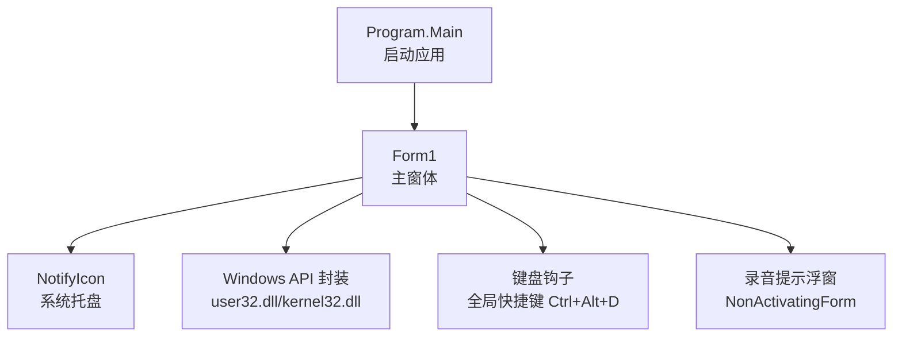
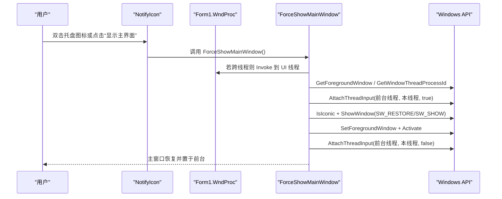
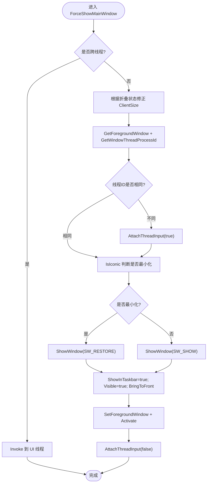
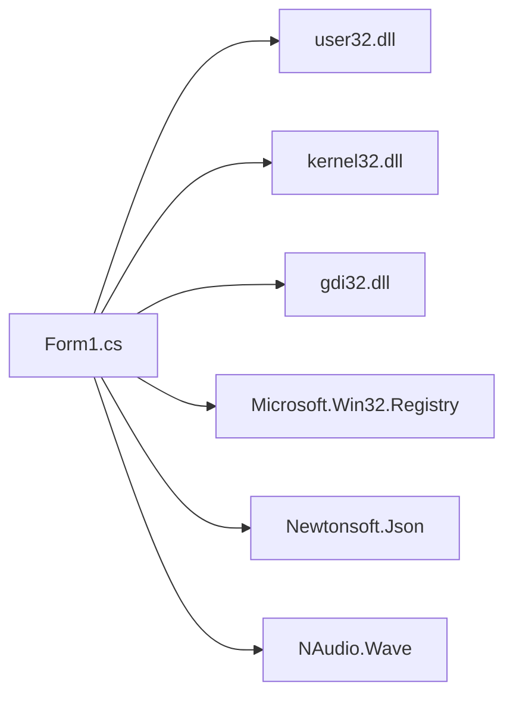

# 窗口状态控制

<cite>
**本文引用的文件**   
- [Form1.cs](file://t9s2t/Form1.cs)
- [Program.cs](file://t9s2t/Program.cs)
- [Form1.Designer.cs](file://t9s2t/Form1.Designer.cs)
</cite>

## 目录
1. [简介](#简介)
2. [项目结构](#项目结构)
3. [核心组件](#核心组件)
4. [架构总览](#架构总览)
5. [详细组件分析](#详细组件分析)
6. [依赖关系分析](#依赖关系分析)
7. [性能与线程安全](#性能与线程安全)
8. [故障排查指南](#故障排查指南)
9. [结论](#结论)
10. [附录：API 参考与最佳实践](#附录api-参考与最佳实践)

## 简介
本技术文档聚焦于该项目的“窗口状态控制”能力，覆盖以下主题：
- 最小化到系统托盘、显示/隐藏、置顶与焦点控制
- ForceShowMainWindow 的跨线程窗口操作与同步机制
- Windows API 封装（SetForegroundWindow、ShowWindow、IsIconic 等）的使用方式
- 窗口尺寸管理与自适应布局策略
- 窗口状态持久化方案与兼容性考虑
- 与系统托盘图标的集成及用户体验优化

## 项目结构
本项目为 WinForms 应用，主窗体位于 Form1.cs，入口在 Program.cs，UI 初始化在 Form1.Designer.cs。窗口状态控制逻辑集中在 Form1.cs 中，包括托盘图标、键盘钩子、窗口显示/隐藏、焦点管理、以及录音提示浮窗等。

图表来源
- [Program.cs:15-24](file://t9s2t/Program.cs#L15-L24)
- [Form1.cs:144-235](file://t9s2t/Form1.cs#L144-L235)
- [Form1.cs:1175-1223](file://t9s2t/Form1.cs#L1175-L1223)

章节来源
- [Program.cs:15-24](file://t9s2t/Program.cs#L15-L24)
- [Form1.Designer.cs:187-218](file://t9s2t/Form1.Designer.cs#L187-L218)

## 核心组件
- 主窗体 Form1：负责窗口生命周期、托盘图标、键盘钩子、语音识别流程、窗口显示/隐藏与焦点控制。
- 系统托盘 NotifyIcon：提供“显示主界面”、“退出”菜单项和双击行为。
- 键盘钩子：监听 Ctrl+Alt+D 组合键，触发录音开始/结束。
- 录音提示浮窗 NonActivatingForm：不抢夺焦点的悬浮提示，避免干扰目标输入窗口。
- Windows API 封装：SetForegroundWindow、ShowWindow、IsIconic、FindWindow、GetForegroundWindow、AttachThreadInput 等。

章节来源
- [Form1.cs:164-169](file://t9s2t/Form1.cs#L164-L169)
- [Form1.cs:415-460](file://t9s2t/Form1.cs#L415-L460)
- [Form1.cs:1292-1309](file://t9s2t/Form1.cs#L1292-L1309)
- [Form1.cs:99-124](file://t9s2t/Form1.cs#L99-L124)

## 架构总览
下图展示了从用户交互到窗口状态变更的关键调用链，包括托盘菜单、消息广播、ForceShowMainWindow 的执行路径。

图表来源
- [Form1.cs:164-169](file://t9s2t/Form1.cs#L164-L169)
- [Form1.cs:237-241](file://t9s2t/Form1.cs#L237-L241)
- [Form1.cs:243-258](file://t9s2t/Form1.cs#L243-L258)
- [Form1.cs:99-124](file://t9s2t/Form1.cs#L99-L124)

## 详细组件分析

### 最小化到托盘与显示/隐藏控制
- 关闭拦截：当用户点击关闭按钮时，取消关闭事件并将窗口隐藏、不在任务栏显示，同时弹出托盘气泡提示。
- 后台运行：当引擎与模型就绪后，自动将窗口最小化并隐藏，仅保留托盘图标；否则保持窗口可见以引导用户完成配置。
- 托盘菜单：提供“显示主界面”和“退出”两个选项，双击托盘图标同样会显示主界面。

章节来源
- [Form1.cs:279-288](file://t9s2t/Form1.cs#L279-L288)
- [Form1.cs:196-214](file://t9s2t/Form1.cs#L196-L214)
- [Form1.cs:164-169](file://t9s2t/Form1.cs#L164-L169)

### 窗口置顶与焦点控制
- 录音提示浮窗使用 WS_EX_NOACTIVATE 扩展样式创建，确保不会抢占焦点，避免影响目标输入窗口。
- 在粘贴最终识别结果前，通过 ForceForegroundWindow 尝试将焦点恢复到录音前的目标窗口，必要时使用 AttachThreadInput 提升权限。

章节来源
- [Form1.cs:1292-1309](file://t9s2t/Form1.cs#L1292-L1309)
- [Form1.cs:1114-1144](file://t9s2t/Form1.cs#L1114-L1144)

### ForceShowMainWindow 实现原理（跨线程与同步）
- 跨线程保护：方法内部首先检查 InvokeRequired，若为真则通过 Invoke 将执行切换到 UI 线程，避免跨线程访问控件引发异常。
- 尺寸修复：在窗口被最小化或隐藏后，ClientSize.Height 可能被置零，因此根据当前广告面板折叠状态计算正确宽度，并强制设置 ClientSize。
- 焦点提升：获取前台窗口句柄与其线程 ID，比较自身线程 ID，若不同则调用 AttachThreadInput 将前台线程与本线程关联，随后调用 IsIconic 判断是否最小化，分别使用 SW_RESTORE 或 SW_SHOW 恢复显示，最后调用 SetForegroundWindow 与 Activate 将窗口置于前台。
- 资源释放：完成后再次断开线程输入关联，避免副作用。

图表来源
- [Form1.cs:243-258](file://t9s2t/Form1.cs#L243-L258)
- [Form1.cs:99-124](file://t9s2t/Form1.cs#L99-L124)

章节来源
- [Form1.cs:243-258](file://t9s2t/Form1.cs#L243-L258)

### Windows API 封装与使用
- user32.dll
  - SetForegroundWindow：将指定窗口设为前台窗口。
  - ShowWindow：控制窗口显示/隐藏/还原，常量 SW_RESTORE=9、SW_SHOW=5。
  - IsIconic：检测窗口是否处于最小化状态。
  - FindWindow：按类名/标题查找已有窗口句柄，用于单实例唤醒。
  - GetForegroundWindow：获取当前前台窗口句柄。
  - GetWindowThreadProcessId：获取窗口所属线程 ID。
  - AttachThreadInput：临时关联输入线程以提升 SetForegroundWindow 的成功率。
- kernel32.dll
  - GetModuleHandle：获取当前模块句柄，用于安装低级别键盘钩子。
- gdi32.dll
  - CreateRoundRectRgn：为录音提示浮窗创建圆角区域。

章节来源
- [Form1.cs:82-124](file://t9s2t/Form1.cs#L82-L124)
- [Form1.cs:1225-1226](file://t9s2t/Form1.cs#L1225-L1226)

### 窗口尺寸管理与自适应布局
- 固定高度：定义 FormHeight 常量，保证在不同状态下高度一致。
- 动态宽度：根据广告面板折叠状态切换 AdExpandedWidth 与 AdCollapsedWidth，并在 ForceShowMainWindow 中修复因最小化导致的尺寸丢失问题。
- 折叠状态持久化：将折叠状态写入 ad_state.txt，启动时读取并恢复。

章节来源
- [Form1.cs:355-411](file://t9s2t/Form1.cs#L355-L411)
- [Form1.cs:246-249](file://t9s2t/Form1.cs#L246-L249)

### 窗口状态持久化方案与兼容性
- 开机自启：通过注册表 HKEY_CURRENT_USER\Software\Microsoft\Windows\CurrentVersion\Run 写入/删除条目，支持启用/禁用。
- 广告面板折叠状态：使用本地文本文件 ad_state.txt 存储“collapsed”或“expanded”，启动时恢复。
- 兼容性考虑：
  - 注册表读写失败时回退 UI 状态（勾选框反转），并提示错误。
  - 文件 I/O 异常时忽略错误，保持默认展开状态。
  - 远程模型列表获取失败时回退到内置 JSON，保障可用性。

章节来源
- [Form1.cs:260-277](file://t9s2t/Form1.cs#L260-L277)
- [Form1.cs:385-411](file://t9s2t/Form1.cs#L385-L411)
- [Form1.cs:818-851](file://t9s2t/Form1.cs#L818-L851)

### 与系统托盘图标的集成与用户体验优化
- 托盘图标初始化：设置图标、可见性与提示文本，绑定上下文菜单与双击事件。
- 状态反馈：识别过程中更新托盘文本为“正在录音...”，完成后更新为“已输入...”；首次就绪时弹出气泡提示。
- 防多开：使用全局 Mutex 与自定义窗口消息 WM_SHOWAPP，重复启动时将现有窗口激活并退出新进程。

章节来源
- [Form1.cs:164-169](file://t9s2t/Form1.cs#L164-L169)
- [Form1.cs:196-214](file://t9s2t/Form1.cs#L196-L214)
- [Form1.cs:151-162](file://t9s2t/Form1.cs#L151-L162)
- [Form1.cs:119-124](file://t9s2t/Form1.cs#L119-L124)

## 依赖关系分析
- 外部库与系统 DLL：
  - user32.dll：窗口与输入相关 API。
  - kernel32.dll：模块句柄查询。
  - gdi32.dll：图形区域创建。
- 第三方库（与窗口状态无直接耦合）：
  - NAudio.Wave：音频采集。
  - Newtonsoft.Json：JSON 解析。
  - Microsoft.Win32.Registry：注册表访问。

图表来源
- [Form1.cs:82-124](file://t9s2t/Form1.cs#L82-L124)
- [Form1.cs:15](file://t9s2t/Form1.cs#L15)
- [Form1.cs:13](file://t9s2t/Form1.cs#L13)
- [Form1.cs:12](file://t9s2t/Form1.cs#L12)

章节来源
- [Form1.cs:82-124](file://t9s2t/Form1.cs#L82-L124)

## 性能与线程安全
- 跨线程 UI 更新：所有对 UI 控件的修改均通过 BeginInvoke/Invoke 调度到 UI 线程，避免跨线程异常。
- 输入锁：使用 _inputLock 保护剪贴板与键盘模拟操作的原子性，防止并发导致的状态不一致。
- 节流与去重：partial 结果更新采用时间戳节流与文本去重，减少频繁 UI 刷新与输入抖动。
- 线程输入关联：仅在必要时调用 AttachThreadInput，且严格配对 true/false，避免长期占用输入线程。

章节来源
- [Form1.cs:988-1051](file://t9s2t/Form1.cs#L988-L1051)
- [Form1.cs:1087-1098](file://t9s2t/Form1.cs#L1087-L1098)
- [Form1.cs:243-258](file://t9s2t/Form1.cs#L243-L258)

## 故障排查指南
- 无法将窗口置于前台：
  - 检查是否成功调用 AttachThreadInput 并配对释放。
  - 确认前台窗口与当前窗口是否属于同一进程/线程。
- 托盘菜单无效：
  - 确认托盘图标已创建且 ContextMenuStrip 已绑定。
  - 检查双击事件是否指向 ForceShowMainWindow。
- 开机自启失败：
  - 检查注册表路径权限与返回值，捕获异常并回滚 UI 状态。
- 窗口尺寸异常：
  - 在 ForceShowMainWindow 中强制设置 ClientSize，避免因最小化导致的高度归零。

章节来源
- [Form1.cs:243-258](file://t9s2t/Form1.cs#L243-L258)
- [Form1.cs:260-277](file://t9s2t/Form1.cs#L260-L277)
- [Form1.cs:164-169](file://t9s2t/Form1.cs#L164-L169)

## 结论
该项目实现了完善的窗口状态控制体系：通过托盘图标与消息机制实现后台运行与快速唤醒；利用 Windows API 与线程输入关联解决前台窗口提升问题；结合尺寸修复与折叠状态持久化，确保用户体验稳定可靠。整体设计兼顾了易用性与健壮性，适合桌面语音输入场景。

## 附录：API 参考与最佳实践
- SetForegroundWindow：需要 AttachThreadInput 配合，且应谨慎使用，避免频繁打断用户工作流。
- ShowWindow：区分 SW_RESTORE 与 SW_SHOW，针对最小化与非最小化分别处理。
- IsIconic：用于判断是否需要还原窗口。
- FindWindow：用于单实例唤醒，需匹配窗口标题或类名。
- AttachThreadInput：仅在必要时短暂关联，使用后务必释放。
- 非激活浮窗：使用 WS_EX_NOACTIVATE 避免抢占焦点，提升输入体验。

章节来源
- [Form1.cs:99-124](file://t9s2t/Form1.cs#L99-L124)
- [Form1.cs:1292-1309](file://t9s2t/Form1.cs#L1292-L1309)